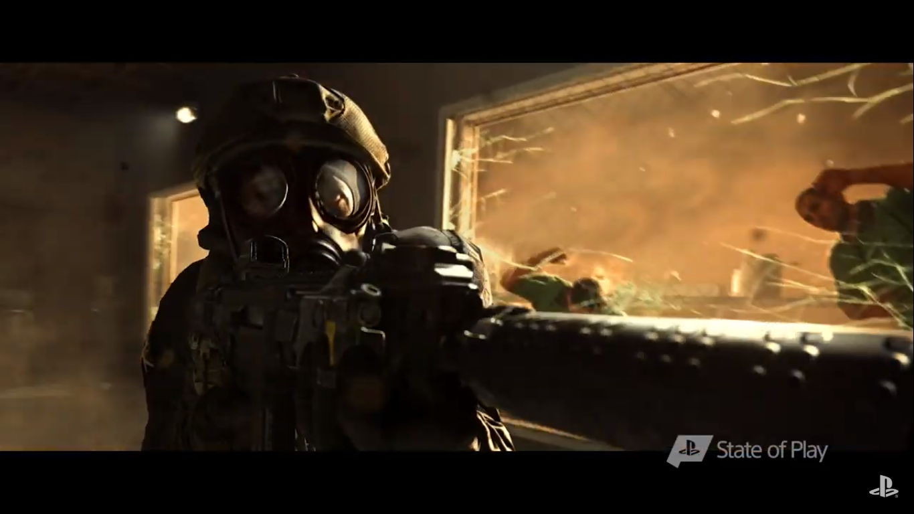
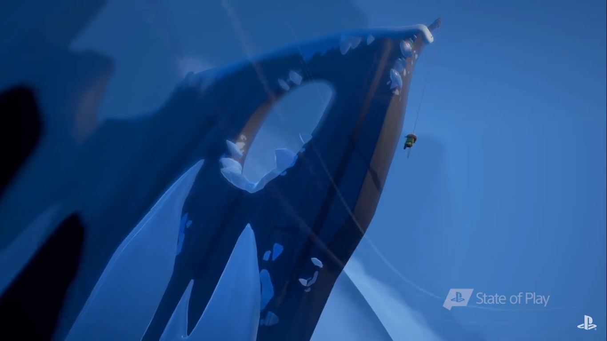
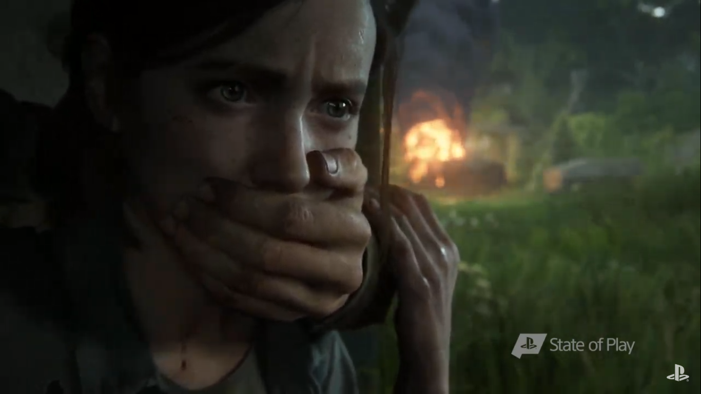
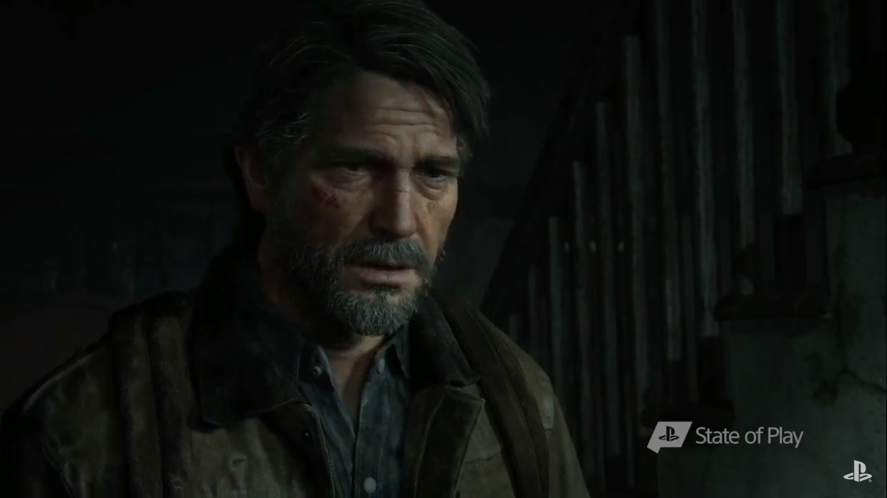
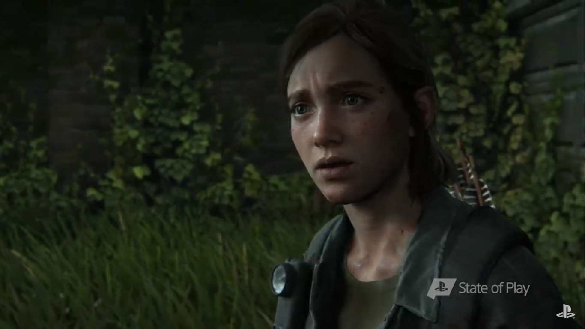
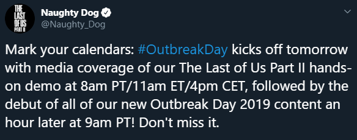
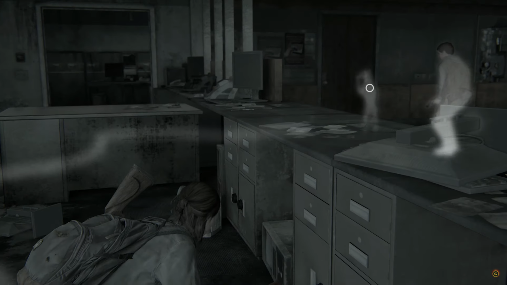

Dzisiejszego wieczoru (24 września 2019) o godzinie 22.00 polskiego czasu odbędzie się kolejna odsłona State of Play, czyli w formie krótkiego filmiku zaprezentowane zostaną nowe gry na platformę PlayStation. Głównym tematem wydarzenia będzie bez wątpienia najnowsza produkcja studia Naughty Dog, czyli The Last Of Us PART II.

Fanom niebieskiej platformy nie trzeba przedstawiać tego tytułu. Jest to jeden z najpopularniejszych ekskluzywów na tę platformę. Od kilku dni twórcy gry mocno promują tytuł na swoich social mediach, więc możemy liczyć nie tylko na nowy gameplay, a być może nawet na ogłoszenie dokładnej daty premiery. Przypomnę tylko, że pierwsza część gry została wydana w 2013 roku na platformę PlayStation 3, natomiast pierwsza oficjalna informacja o kontynuacji serii pojawiła się wraz z trailerem, pod koniec 2016 roku.

Jakby tego było mało, dwa dni po prezentacji, czyli 26 września, ma miejsce doroczne święto fanów gry The Last Of Us, czyli OUTBREAK DAY. Święto to upamiętnia dzień wybuchu zarazy, którego świadkami byliśmy na początku pierwszej odsłony gry. Twórcy wykorzystują ten dzień, aby podziękować wiernym fanom tytułu i udostępniają im nową zawartość cyfrową oraz gadżety kolekcjonerskie. [Rok temu](/outbreak-day-2018) był to: dynamiczny motyw na PS4, tapety, awatary, koszulki, plakat, a także ścieżka dźwiękowa wydana na winylu. W tym roku, dzięki prezentacji gry na State of Play, zawartość udostępniona przez twórców może być jeszcze ciekawsza!

Transmisję z tego wydarzenia można obejrzeć na oficjalnym kanale PlayStation w serwisie YouTube. Gdy tylko poznamy datę premiery lub inne informacje na temat gry, pojawią się one w tym artykule.

<YouTube id='FekB7shVUC8' title='State of Play 24 września 2019'></YouTube>

## Aktualizacja (22:21 24-09-2019)

<Gallery>

</Gallery>

Pokaz rozpoczął się od dość intrygującej gry o nazwie Humanity (premiera w 2020 roku), a następnie pokazano Call of Duty: Modern Warfare, które premierę będzie miało w październiku bieżącego roku).

Pojawił się również "kącik dziecięcy" z grą reklamującą się sloganami niczym z Death Stranding, m.in. "reconnect people" :D . Następnie nasz rodzimy Techland zaprezentował grę Arise (data premiery nieznana). L.A. Noire na gogle VR? Czemu nie! Gra dostępna już od dzisiaj w sklepie PlayStation Store. Nie zmieniając platformy, Sony zaprezentowało krótki przegląd nowych gier na gogle rozszerzonej rzeczywistości.

<ImageDescription>Arise, Techland</ImageDescription>

Medievil - demo gry dostępne już teraz! Krótka prezentacja Civilization VI, które ukaże się 22 listopada. Następnie przypomnienie o zbliżającym Death Stranding i prezentacja limitowanej edycji kontrolera DualShock 4 z białą konsolą PS4 Pro ozdobioną czarnymi śladami dłoni. WYGLĄDA CUDOWNIE!

<YouTube id='davszDemUns' title='death stranding ps4 special'></YouTube>

Następnie gra Afterparty z nieznaną jeszcze datą premiery oraz TheShow19, które wraz z The Last Of Us Remastered będzie dostępne za darmo dla użytkowników PS+.

## Aktualizacja (22:35 24-09-2019)

I jest to, na co czekaliśmy! Pokaz zakończyła prezentacja gry The Last Of Us Part II. Z pokazanego zwiastuna możemy wnioskować, że Ellie będzie mścić się na zabójcach swojej najlepszej przyjaciółki Diny. Joel żyje i będzie towarzyszył naszej protagonistce! **Premiera gry 21 lutego 2020 roku.**

<Gallery>

</Gallery>

<AdSense/>

## Aktualizacja (23:50 24-09-2019)

Ujawniono wszystkie edycje gry:

<Gallery width='2'>

</Gallery>

## Aktualizacja (00:05 26-09-2019)

Na portalach społecznościowych Naughty Dog pojawił się plan przebiegu święta OUTBREAK DAY. Zgodnie z nim o godzinie 17:00 polskiego czasu zobaczymy demo gry, które zaprezentowano na zamkniętym pokazie dla mediów w trakcie trwania State of Play. Natomiast o godzinie 18:00 zostaną przedstawione tegoroczne gadżety związane z grą.

<ImageDescription>@Naughty_Dog - Twitter</ImageDescription>

## Aktualizacja (19:45 26-09-2019)

W sieci pojawiły się już pierwsze materiały prasowe na temat zamkniętego pokazu z gry The Last Of Us Part II. Dziennikarze prezentują urywki rozgrywki oraz opisują mechaniki, jakie zostały im zaprezentowane.

### Bronie

Po przeanalizowaniu materiału oraz interfejsu gry można zauważyć, że nasz oręż nie został mocno zmodyfikowany. Nadal posługujemy się krzyżakowym menu wyboru broni, w którym będziemy musieli decydować, które bronie przeniesiemy z plecaka do kabury. Prawdopodobnie w tej części nie będziemy mieć niszczących się ostrzy, a jedynie niezniszczalny nóż Ellie, który jest prezentem od jej matki. Największą zmianą w broniach jest tłumik. Tak, podczas gameplay-u mogliśmy zauważyć, że bohaterka potrafi montować tłumik na swoim pistolecie, który zużywa się po trzech strzałach. Prawdopodobnie mechanika ta będzie działać podobnie jak ostrza w pierwszej części gry, czyli tłumiki będziemy mogli wytwarzać własnoręcznie.

### Przeciwnicy

Podczas gry mogliśmy zobaczyć jednego z nowych przeciwników. Osobnik podobny do purchlaka, który dodatkowo wypuszcza z siebie trójący gaz, a tym samym wymusza walkę dystansową. Oprócz niego, bohaterka wielokrotnie napatoczyła się na dobrze nam znane, przerażające klikacze.

Do grupy niezarażonych przeciwników dołączą psy tropiące. Niestety nie będą to miłe pieski, a krwiożercze bestie, zdolne nas wypatrzeć, a także wywąchać. Dlatego w trybie nasłuchu, oprócz sylwetek postaci, nasza bohaterka będzie widzieć także swój "ślad zapachowy" po którym czworonogi będą mogły ją wywąchać. Sprawi to, że będziemy musieli podchodzić do nich z bardzo dużą ostrożnością, a jeśli nas wytropią próbować zgubić trop, np. zamykając za sobą drzwi. Jednak należy pamiętać, że właściciel psa może je otworzyć, gdy zobaczy, że ten chce przedostać się na drugą stronę.

<ImageDescription>W trybie nasłuchu można zobaczyć ścieżkę, po której mogą nas wytropić psy. W tle widać czworonoga, który przywołuje swojego właściciela, aby ten otworzył mu zamknięte przez Ellie drzwi.</ImageDescription>

Małe zmiany dotkną również ludzkich oponentów. Ich reakcje mają być teraz bardziej ludzkie. Każdy przeciwnik będzie posiadał własne imię, a jego towarzysze, znajdując jego martwe ciało, powiadomią innych, używając właśnie tego imienia. Wracając jeszcze do psów i ich właścicieli - gra zareaguje adekwatnie na śmierć jednego z nich. Na widok martwego właściciela pies zrobi się smutny, a właściciel zacznie krzyczeć, gdy zobaczy, że zabijamy jego czworonożnego towarzysza. Wspomniano również o ulepszeniu sztucznej inteligencji, dzięki której przeciwnicy mają być teraz zdolni do lepszego blokowania nam drogi ucieczki.

### Skakanie oraz czołganie

Twórcy chcieli podkreślić, że Ellie jest bardziej zwinna od Joela, dlatego postanowili udostępnić graczom więcej sposobów poruszania postacią. Bohaterka potrafi przeskakiwać przez ogrodzenia i okna, przeciskać się przez szczeliny, a także czołgać. Dzięki temu może lepiej ukryć się przed przeciwnikami, chowając się w trawie lub pod samochodem, ale jak pokazał nam jeden z poprzednich trailerów, przeciwnicy (tym razem nie idioci) będą również sprawdzać przestrzenie pod pojazdami. W trakcie czołgania się będziemy mogli używać broni oraz innych przedmiotów ekwipunku. Twórcy podkreślili również, że domy oraz budynki zapewnią lepszą mobilność w pionie, czyli będziemy mogli wejść na większą ilość kondygnacji, w tym równie dach, by móc wystrzelać więcej wrogów.

<YouTube id='izzgMYxvVEE' title='the last of us part ii'></YouTube>

<YouTube id='XveVREWpQw8' title='the last of us part ii'></YouTube>

## Aktualizacja (20:00 26-09-2019)

Naughty Dog opublikowało listę gadżetów z okazji OUTBREAK DAY 2019:

- Filmik "Inside the demo z komentarzem twórców (dostępny od godziny 22:00)
- Darmowy dynamiczny motyw na konsole PS4
- Zniżka -50% na wszystkie motywy i awatary dostępne w PS Store
- Prawie półmetrową figurkę Ellie od Dark Horse
- Koszulki z podobizną Joel'a i Ellie
- Czapki z logo TLOU i znakiem świetlików
- Artbook od Dark Horse
- Instrukcja dla cosplayerów postaci Ellie
- Konkurs, w którym do wygrania jest plakat z podpisami twórców

Więcej informacji znajdziecie na [oficjalnej stronie PlayStation](https://www.thelastofus.playstation.com/OutbreakDay).
