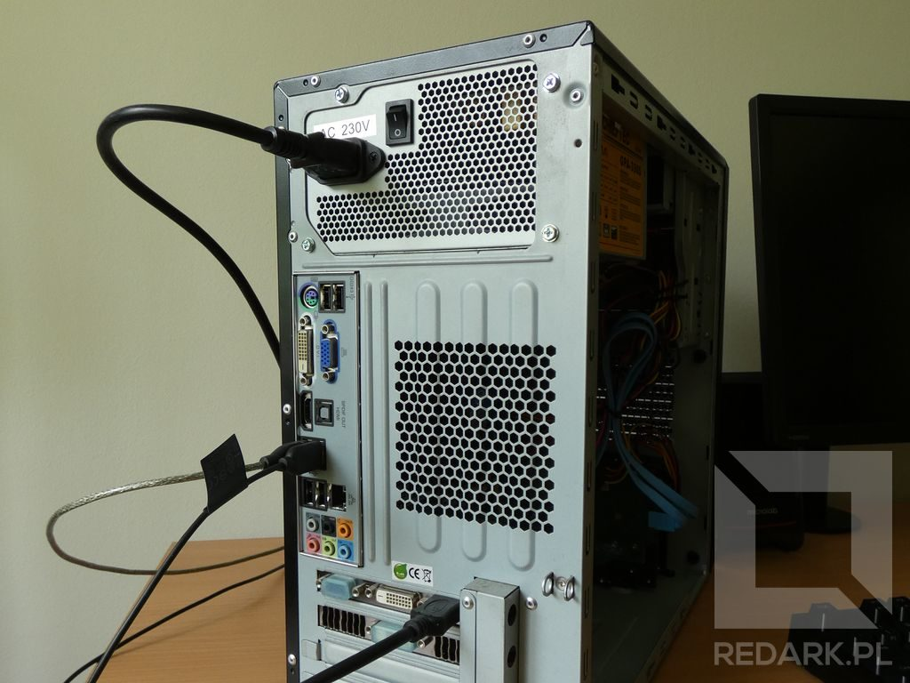
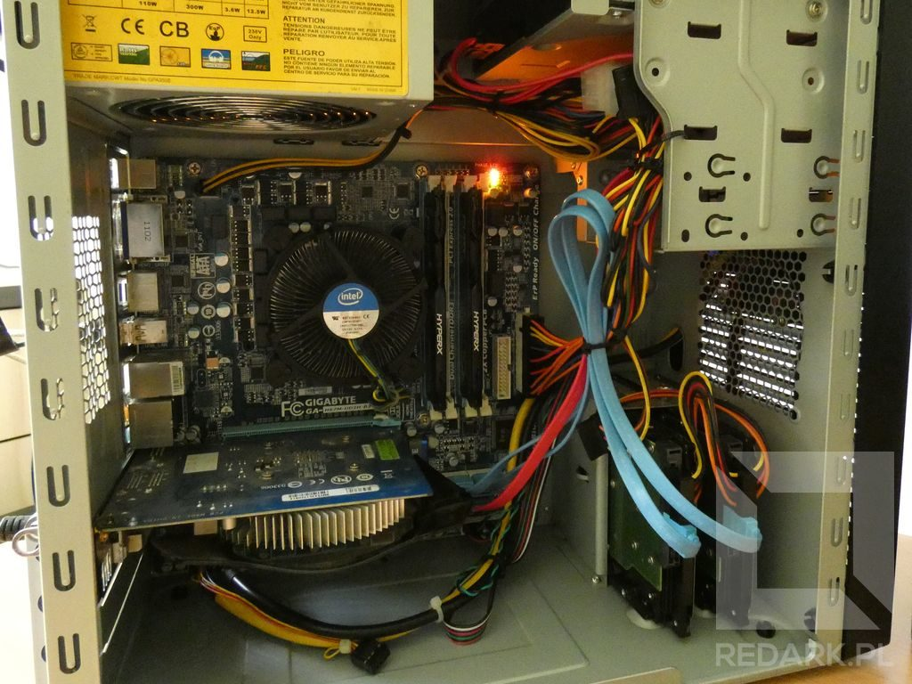
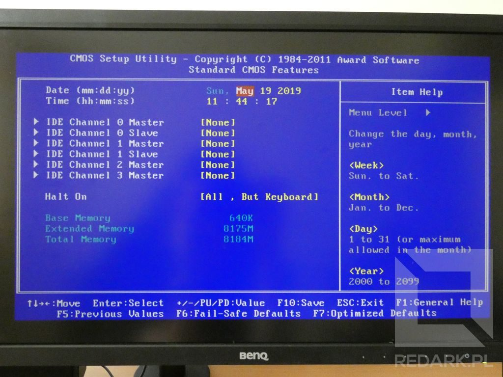

import AssemblingPcFooter from '../../typography/assemblingPcFooter'

Wszystkie podzespoły wewnątrz komputera są już na miejscu, więc nadszedł czas, aby po raz pierwszy uruchomić naszego składaka. Jest to dość nerwowy moment, ponieważ dopiero teraz okaże się, czy podczas montażu nie popełniliśmy jakiegoś błędu. W tym artykule pokażę Wam jak przygotować komputer do uruchomienia, jak powinna zachowywać się "zdrowa" jednostka oraz jak diagnozować ewentualną awarię.

<WarningBlock>Od tej pory będziemy pracować z napięciem 230V, które może zagrażać naszemu życiu lub zdrowiu - zachowaj należytą ostrożność!</WarningBlock>

## Czego będziemy potrzebować?

Aby przeprowadzić pierwsze testowe uruchomienie komputera, wystarczy podłączyć jedynie dwie rzeczy: zasilanie jednostki oraz kabel sygnałowy monitora. Ja oprócz nich podłącze jeszcze klawiaturę oraz mysz, ale te akcesoria są zbędne, gdy chcemy jedynie sprawdzić, czy nasza jednostka poprawnie się uruchamia.

## Przygotowywanie jednostki

Postaw komputer pionowo lub poziomo przy swoim stanowisku. Na czas pierwszego uruchomienia nie musisz zakładać bocznej ścianki obudowy. Pozwoli to na łatwiejsze zweryfikowanie poprawności działania podzespołów, takich jak np. wentylatory.

### Monitor

Przygotuj teraz swój monitor razem z dwoma kablami: zasilającym oraz sygnałowym. Kablem sygnałowym (np. HDMI) połącz gniazdo monitora z wyjściem obrazu znajdującym się z tyłu jednostki centralnej. Pamiętaj, że w przypadku karty graficznej zainstalowanej w gnieździe PCI-E, wyjścia wideo znajdujące się na płycie głównej są nieaktywne, ponieważ działają jedynie ze zintegrowaną grafiką procesora. Na koniec podłącz ekran do zasilania.

### Zasilanie komputera

Pozostało teraz tylko doprowadzić zasilanie do samej jednostki. Przed podłączeniem przewodu zasilającego zwróć uwagę na pozycję przełącznika znajdującego się na zasilaczu obok gniazda zasilającego. Dla większego bezpieczeństwa zaleca się, aby na czas wpinania wtyczki znajdował się on w pozycji OFF (O). W przypadku podłączania komputera poprzez listwę zasilającą (która jest wyłączona) przełącznik ten może znajdować się od razu w pozycji ON (I).

<ImageDescription>Przykładowe podłączenie jednostki centralnej</ImageDescription>

<AdSense/>

## Pierwsze uruchomienie

Gdy wszystkie kable zostały już podłączone, jeszcze raz sprawdź wszystkie rzeczy z poniższej listy:

- Czy przełącznik na zasilaczu oraz listwie zasilającej (o ile ta występuje) jest w pozycji ON?
- Monitor został włączony i jest w trybie gotowości?
- Czy monitor został podłączony do właściwego wyjścia obrazu w komputerze (płyta główna/karta graficzna)?
- Czy w obudowie nie wiszą jakieś niepodłączone lub luźne kable, które mogłyby dostać się do wirnika wentylatora?

Gotowe? No to wciśnij przycisk **POWER** na obudowie... :)

## Jakiej reakcji się spodziewać?

Poprawnie działający komputer powinien od razu uruchomić wentylator znajdujący się na chłodzeniu procesora. Pracę urządzenia mogą także sygnalizować pojedyncze diody kontrolne znajdujące się na powierzchni płyty głównej. Pierwszą rzeczą, jaką komputer wykona po uruchomieniu, będzie przeprowadzenie pełnej diagnostyki podzespołów ([procedura POST](https://pl.wikipedia.org/wiki/POST)), które zamontowaliśmy. Jest za to odpowiedzialny mały system operacyjny zapisany w układzie scalonym znajdującym się na powierzchni płyty głównej. W starszych komputerach był to [BIOS](https://pl.wikipedia.org/wiki/BIOS), natomiast nowsze modele posiadają jego następcę, czyli [UEFI](https://pl.wikipedia.org/wiki/Unified_Extensible_Firmware_Interface).

<ImageDescription>O pracy komputera świadczy obracający się wentylator procesora oraz kolorowe diody płyty głównej</ImageDescription>

### Jeśli wszystko jest w porządku

Jeśli BIOS/UEFI nie wykryje żadnej awarii, a podzespoły przejdą pomyślnie wszystkie testy, oprogramowanie przejdzie od razu do procedury tzw. bootowania systemu operacyjnego. Powoduje ona, że na naszym ekranie ukazuje się logo systemu operacyjnego, a później pulpit użytkownika (tak w dużym skrócie ;) ). W przypadku nowo złożonego komputera nie ma mowy o załadowaniu żadnego Windowsa czy innego systemu, ponieważ jeszcze go nie zainstalowaliśmy, co nie? Co powinien zrobić komputer w takim razie? Zachowanie zależy od producenta płyty głównej, ale zazwyczaj sprowadza się to do dwóch opcji: wyświetlenia menu konfiguracyjnego systemu BIOS/UEFI (patrz zdjęcie poniżej) lub wyświetlenia komunikatu tekstowego w stylu "Operating system not found!" (ang. "nie znaleziono systemu operacyjnego").

<ImageDescription>Menu konfiguracyjne BIOS</ImageDescription>

<InfoBlock>Niektóre starsze komputery mogą podczas uruchamiania wydać pojedyncze piknięcie. Jest to normalna reakcja, która oznacza prawidłowe zakończenie procedury testowej POST. Więcej informacji na temat sygnałów dźwiękowych pojawi się jeszcze w tym artykule.</InfoBlock>

### Gdy pojawią się problemy...

Załóżmy, że coś poszło nie tak i komputer nie zachowuje się tak, jak byśmy tego chcieli. Pamiętaj, że nie oznacza to od razu, że popełniłeś błąd podczas montażu. Takie zachowanie może być również spowodowane wadą fabryczną lub uszkodzeniem podczas transportu części. W takiej sytuacji ważne jest poprawne zdiagnozowanie awarii i stwierdzenie czy wina leży po naszej stronie, czy po stronie producenta któregoś z podzespołów. Dodatkowo trafna diagnoza i szybkie zgłoszenie problemu w sklepie zwiększa szansę na pozytywne rozpatrzenie reklamacji.

## Diagnostyka komputera

Na temat diagnostyki komputera można się rozpisywać w nieskończoność, więc od razu uprzedzę, że nie zamierzam w tym artykule poruszać w pełni tego tematu. Zamiast tego podam szereg porad i czynności ułatwiających znalezienie problemu w nowo złożonych jednostkach. Mają one na celu zlokalizowanie błędu w montażu lub uszkodzonego podzespołu.

Może się zdarzyć, że podane tutaj porady nie rozwiążą Twojego problemu. Niektóre z awarii ciężko zlokalizować bez użycia specjalistycznej aparatury. W takim wypadku możesz poszukać pomocy na forach internetowych lub grupach na Facebooku, tylko pamiętaj, żeby dokładnie opisać problem i objawy, a także podać modele użytych przez Ciebie podzespołów! Jeśli i tam nie znajdziesz odpowiedzi, zawsze możesz oddać jednostkę do specjalistycznego serwisu.

<InfoBlock>W serwisie REDARK w niedalekiej przyszłości powstanie poradnik z pełną diagnostyką komputera, którego zadaniem będzie omówienie jak największej ilości możliwych przyczyn awarii. Gdy materiał ten zostanie już opublikowany, link do niego pojawi się również w tym artykule.</InfoBlock>

<AdSense/>

## Co w traw... komputerze piszczy?

Chyba najczęstszym objawem złej pracy komputera, z jakim się spotkasz, będą dziwne sygnały dźwiękowe (w formie piszczenia) dochodzące z wnętrza jednostki centralnej. To nic niezwykłego i stanowi podstawowy sposób sygnalizowania awarii przez komputer. Dźwięki generowane są przez system BIOS/UEFI (wspomnianym już w tym artykule) za pomocą małego brzęczyka znajdującego się na płycie głównej.

W przypadku usyszenia pikania nie należy od razu wyłączać komputera, a zapamiętać sekwencję sygnału, która działa na zasadzie alfabetu morse'a, czyli składa się z krótkich i długich sygnałów. Zazwyczaj sekwencja dźwięków jest skończona i powtarzana po wyraźnej, długiej przerwie aż do czasu wyłączenia komputera, ale zdarzają się sygnały takie jak np. awaria pamięci RAM, które polegają na emitowaniu nieskończonej serii krótkich sygnałów.

Komunikaty dźwiękowe są charakterystyczne dla danego producenta BIOSu lub UEFI. Nazwę producenta możemy zazwyczaj odczytać z oznaczeń naniesionych na odpowiedzialny za niego układ scalony płyty głównej lub w menu konfiguracyjnych systemu, choć w przypadku awarii raczej nie będzie to możliwe. Gdy wiemy już od jakiego producenta pochodzi posiadany BIOS/UEFI, możemy rozkodować sygnał i poznać przyczynę jego nadawania. W tym celu należy odnaleźć stosowne informacje w Internecie (np. wpisując w Google "phoenix sygnały dźwiękowe"), instrukcji dołączonej do płyty głównej lub w tabelce zamieszczonej poniżej:

Nowe modele płyt głównych często ułatwiają nam życie i oprócz sygnałów dźwiękowych oferują również komunikaty świetlne. Występują one w dwóch formach:

- **Diody LED** - płyta posiada szereg małych diodek podpisanych skrótami CPU, GPU, MOBO itp. Znaczenia kolorów oraz typów świecenia również znajdziemy w instrukcji płyty głównej lub Internecie.
- **Wyświetlacz segmentowy** - bardzo ułatwia diagnostykę, ponieważ zamiast złożonych sygnałów morse'a podaje dwucyfrowy kod błędu, który oczywiście należy rozszyfrować tak samo, jak w przypadku pozostałych metod.

## Całkowity brak reakcji

Rozpatrzmy teraz gorszy scenariusz, czyli taki, w którym komputer nie informuje "co go boli", ponieważ kompletnie nie reaguje na nasze próby uruchomienia. O ile w przypadku działającego już ileś lat komputera, może to oznaczać jakąś poważną awarię, to w przypadku nowej jednostki przyczyną mogą być błędnie podłączone przewody. Oczywiście, brak reakcji może być spowodowany również awarią, chociażby zasilacza, ale nie będziemy skupiać się na aż tak czarnych scenariuszach. Jak wcześniej wspominałem, skupimy się jedynie na znajdowaniu błędów montażu.

### Sprawdzanie zasilania

Zanim zaczniemy chaotycznie grzebać w obudowie, upewnijmy się najpierw, czy komputer faktycznie dostaje zasilanie 230 V. Na początku sprawdź, w jakiej pozycji znajduje się przełącznik zasilacza komputera. Jeśli w pozycji **OFF** to chyba wiesz, co masz zrobić :) . Następnie upewnij się, że w gnieździe, do którego podłączasz komputer, na pewno jest napięcie. Najprościej możesz to sprawdzić, podłączając w jego miejsce lampkę, ładowarkę telefonu lub inne urządzenie elektryczne. Idąc dalej, można sprawdzić przewód zasilający. Jego uszkodzenie jest mało prawdopodobne, ale warto go sprawdzić dla świętego spokoju. Można go wymienić na inny lub spróbować za jego pomocą zasilić monitor, lub drukarkę.

<WarningBlock>Omawiane dalej czynności będą wykonywane wewnątrz jednostki centralnej komputera. Pamiętaj, aby na czas ich przeprowadzania odłączyć komputer od prądu!</WarningBlock>

Jeśli czynności z poprzedniego akapitu nie przyniosły efektu, musimy niestety zajrzeć do wnętrza obudowy. Pierwszym sprawdzeniem, jakie przeprowadzimy, będą wizualne oględziny jednostki. Należy zobaczyć czy w obudowie nie ma wtyczek, o których przypadkiem zapomnieliśmy lub źle docisnęliśmy. Jeśli potrzebujesz, wróć do [artykułu z podpinania kabli](/skladanie-pc-podlaczanie-i-ukladanie-kabli-w-obudowie) oraz do [artykułu objaśniającego znaczenie każdego z nich](/kablologia-przewody-jednostki-centralnej). W przypadku braku jakiejkolwiek reakcji komputera bacznie przypatrzyłbym się głównej wtyczce 20+4 ATX na płycie głównej oraz kablowi idącemu do sekcji zasilania procesora.

### Sprawdzanie kabli sygnałowych

Tutaj pojawią się dwie moje ulubione pomyłki. Po pierwsze błędne podłączenie przedniego panelu. Jak komputer ma się uruchomić, skoro nie widzi, że naciskasz przycisk POWER? W tym celu odłącz (nawet wszystkie) kabelki wpięte w goldpin-y płyty głównej i podłącz je ponownie, tym razem na spokojnie ;)

Drugą pomyłką jest błędne podłączenie chłodzenia procesora. Choć komputer powinien sygnalizować taki problem, to nie musi. Jest to zabezpieczenie przed uszkodzeniem termicznym procesora. Należy pamiętać jeszcze o jednym ważnym aspekcie, o którym wspominałem również w [artykule o dobieraniu chłodzenia komputera](/chlodzenie-komputera). Komputer, aby mógł stwierdzić obecność wentylatora, potrzebuje mieć go podłączonego za pomocą **wtyczki 3 lub 4 pinowej do gniazda CPU\_FAN**. Tylko takie wentylatory mogą chłodzić CPU, ponieważ posiadają one sensor informujący o swojej prędkości obrotowej. Bez tego sygnału zwrotnego komputer może odmówić uruchomienia.

### Dalsze czynności

Podałem najczęstsze powody, przez które komputer może nie chcieć wystartować. Jeśli nadal problem występuje, ponownie przyjrzyj się wszystkim elementom komputera. Czy wszystkie wtyczki zostały do końca wciśnięte oraz, czy nie zostały na siłę podłączone odwrotnie (uwierz mi, nie raz widziałem takie cuda). Chodzi zarówno o kable zasilające, jak i sygnałowe np. SATA.

Dodatkowo możesz sprawdzić mocowanie banków pamięci RAM lub slot karty graficznej. BIOS/UEFI, choć powinien wykrywać takie rzeczy to może dojść do sytuacji, w której słabo dociśnięty element powoduje krytyczne zwarcie obwodów doprowadzające do natychmiastowego wyłączenia lub zawieszenia jednostki.

Jeśli nadal komputer nie daje oznak życia lub zawiesza się w próżni, nie dając obrazu, trzeba już przejść do bardziej pracochłonnych testów. Należą do nich choćby uruchamianie zasilacza "na krótko" i pomiar napięć na jego kablach oraz selektywne wyciąganie podzespołów z obudowy. Te metody zostaną poruszone w przyszłych artykułach na REDARKu całkowicie poświęconych zagadnieniu diagnostyki komputerowej.

<AssemblingPcFooter nextPost='/windows-konta-linux-jaki-system-operacyjny-wybrac'/>
