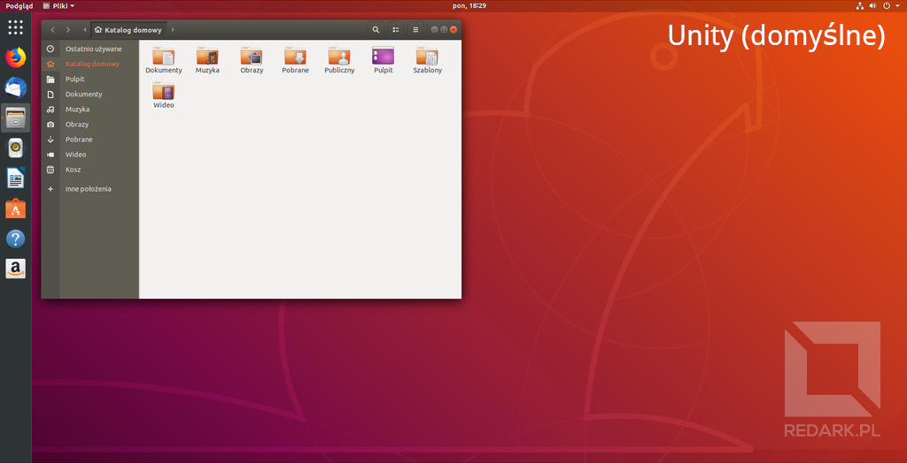
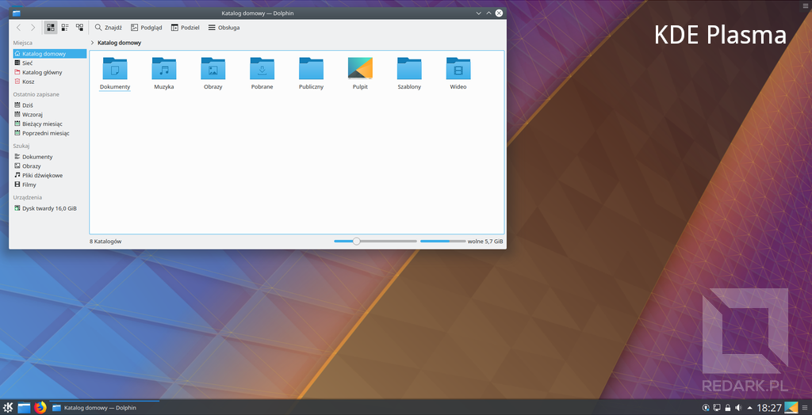
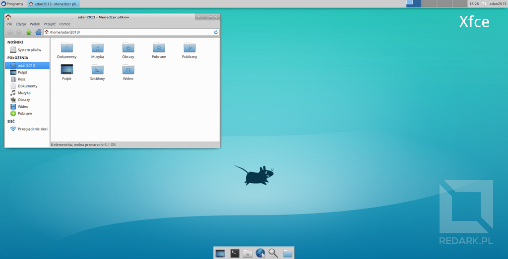

import AssemblingPcFooter from '../../typography/assemblingPcFooter'

Ostatnią rzeczą, jaką zajmiemy się w poradniku [składania PC](/skladanie-pc), będzie zainstalowanie systemu operacyjnego. Zanim jednak przejdziemy do właściwego części poradnika dotyczącej instalacji, omówimy posiadane obecnie na rynku systemy operacyjne. Głównym tematem tego artykułu będzie **porównanie systemów z rodziny Windows oraz Linux**. Pewnie większość z Was i tak pozostanie przy popularnych "okienkach", ale uważam, że warto znać też zalety konkurencji.

## Jakie mamy system operacyjne

### Microsoft Windows

Na początek najpopularniejsza opcja. Szacuje się, że pod kontrolą Windowsa pracuje około 85% komputerów osobistych. Sprawia to, że firma Microsoft posiada monopol w kwestii dostarczania oprogramowania na tego typu urządzenia. Czy słusznie? Na pewno nie można odmówić mu rozbudowanej oferty funkcji i łatwości obsługi. Z drugiej jednak strony, jego podatność na awarie i ataki hackerskie z pewnością niejednokrotnie przysporzyła użytkownikom bólu głowy.

### Linux

Alternatywą dla tak popularnych "okienek" jest darmowy otwartoźródłowy system Linux. Z roku na rok zdobywa on coraz większą popularność na komputerach osobistych i obecnie króluje już w sektorze systemów mobilnych oraz rozwiązań serwerowych. Jego najbardziej znaną formą jest system Android, pod którego kontrolą pracuje dzisiaj około 80% smartfonów. Znajdziemy go również we wspomnianych już serwerach (wg strony [top500.org](https://www.top500.org/) 500 najpotężniejszych komputerów na ziemi pracuje tylko i wyłącznie pod kontrolą systemów z rodziny Linux/UNIX) oraz we wszelkiego rodzaju urządzeniach smart takich jak np. telewizory.

### Apple macOS

System operacyjny rozwijany przez firmę Apple występujący tylko i wyłącznie na komputerach obdarzonych znaczkiem nadgryzionego jabłka. Oficjalnie nie można go zainstalować na urządzeniach innych producentów, dlatego nie będę brał go pod uwagę w dalszej części artykułu. Należy jeszcze tylko dodać, że macOS, tak samo jak Linux, wywodzi się z systemu UNIX, a zatem te systemy mają ze sobą więcej wspólnego, niż mogłoby się to wydawać :) .

## Konfrontacja

Czas porównać ze sobą oba systemy. Zdecydowałem się na podzielenie tematu na "pojedynki", na zakończenie których wydam werdykt podsumowujący poruszone w nich zagadnienia.

## Cykl wydawniczy oraz cena licencji

### Windows

Microsoft wydaje nową wersję swojego systemu co kilka lat i co chwile zmienia sposób numeracji czy też nazewnictwa swoich produktów. Skupiając się tylko na XXI wieku, są to systemy: Windows XP, Vista, 7, 8 oraz 10. Jedne wersje były bardziej, inne mniej udane, ale najczęściej stosuje się zasadę kupowania najnowszej wersji "okienek" w celu jak najdłuższego skorzystania z okresu wsparcia technicznego. Dodatkowo sam Microsoft wymusza stosowanie najnowszego Windowsa, dołączając go do wszystkich nowych komputerów czy laptopów.

Cena podstawowej wersji Windowsa plasuje się między 400 a 500 złotych, natomiast wersja "Pro" to już koszt ponad 600 złotych. Dodatkowo mowa tutaj o licencji OEM, czyli takiej, która jest przypisywana do płyty głównej komputera i nie może już zostać wykorzystana w innym urządzeniu. W tym miejscu muszę wspomnieć jeszcze o sprzedawcach oferujących system w cenie 50, a nawet i kilkunastu złotych. Są to klucze pochodzące z nieoficjalnej dystrybucji, a nawet kradzieży!

### Linux

Linux wydawany jest w formie niezależnych dystrybucji, które posiadają swoje własne wersje oraz aktualizacje. Do najpopularniejszych dystrybucji należą: Ubuntu, Mint, Debian czy Deepin (promowany ostatnio mocno przez firmę Huawei). Wybór wersji zależy wyłącznie od użytkownika.

Ile wynosi cena Linuxa? Zaraz, zaraz, jaka cena? Tak jak już wspominałem na początku artykułu, Linux jest darmowym i otwartym oprogramowaniem dostępnym dla wszystkich. Wyjątkiem mogą być jedynie niektóre płatne dystrybucje przeznaczone do zastosowań serwerowych.

**Werdykt:** W kwestii ceny nie ma tutaj żadnych złudzeń. Monopol Microsoftu sprawia, że może on z roku na rok podnosić cenę swojego produktu bez obawy o konkurencję. Linux wygrywa tutaj walkowerem.

<AdSense/>

## Wymagania sprzętowe

### Windows

System Windows 10 wg oficjalnych danych wymaga jedynie procesora 1GHz oraz 2 gigabajtów pamięci RAM, co jest bardzo niskim poziomem wymagań. Niestety, dane te są wyssane z palca. Komputer o takich parametrach będzie przeznaczony tylko dla osób z anielską cierpliwością, które najlepiej, żeby nie korzystały z Internetu, aby nie zagotować podzespołów. Z własnego doświadczenia wiem, że pamięć RAM musi posiadać co najmniej 4 GB (a najlepiej od 8 wzwyż), a system, aby nie łapał co chwilę zadyszki przez szalejące procesy, powinien być zainstalowany na dysku SSD. Sprawia to, że Windows nie jest już lekkim systemem, który może zostać uruchomiony na byle czym.

### Linux

W kwestii Linuxa wszystko zależy od wspomnianej już dystrybucji oraz zainstalowanego interfejsu graficznego (o tym za niedługo). Niemniej jednak Linux, z racji swojej architektury z powodzeniem może zostać skrojony nawet pod możliwości już leciwego, kilkunastoletniego laptopa. Dla przykładu system Linux AntiX do swojego działania potrzebuje jedynie kilkuset megabajtów RAMu, procesora klasy Pentium II pochodzącego z lat 90. oraz 3 GB wolnego miejsca na dysku.

**Werdykt:** Pod względem wymagań sprzętowych Linux nie ma sobie równych. Bez problemu uruchomi się nawet na słabym komputerze czy laptopie, dając mu drugie życie.

## Baza aplikacji oraz gier

### Windows

Z racji ogromnej popularności Windowsa wybór aplikacji wspieranych przez ten system jest przeogromny. Tyczy się to również gier, które za pośrednictwem platform cyfrowej dystrybucji mogą być uruchamiane na nim bez jakiegokolwiek problemu.

### Linux

Sprawa wygląda zgoła inaczej jeśli chodzi o Linuxa. Niestety jego mała popularność negatywnie odbija się na liczbie dostępnych aplikacji. Powoduje to, że przyzwyczajonemu do Windowsa użytkownikowi ciężko jest odnaleźć się w tym systemie, ponieważ musi on znaleźć alternatywne aplikacje, które zastąpią mu programy znane z Windowsa.

Nadzieją dla Linuxa w tej kwestii jest nasilający się trend tworzenia aplikacji internetowych działających w chmurze. Programy tego typu mogą być bezproblemowo uruchamiane w przeglądarce internetowej, które łatwo jest później przenieść do dedykowanych aplikacjach działających zarówna na Windowsie, Linuxie, jak i macOS.

**Werdykt**: Niestety tutaj Linux cały czas mocno odstaje od popularnego Windowsa. Paradoksalnie, jedyne co może zrobić, to powiększać swoje grono odbiorców, co jest trudne przy mniejszej ofercie aplikacji.

## Załączone oprogramowanie oraz usługi

### Windows

Oba systemy zaraz po instalacji posiadają paczkę niezbędnych do codziennej pracy aplikacji. Jest to przeglądarka internetowa, edytor grafiki, odtwarzacz filmów itd. Niestety z biegiem lat Microsoft postanowił dorzucać do swojego systemu całą masę dodatkowego oprogramowania, które mówiąc szczerze, nie jest mile widziane. Gigant posunął się do tego stopnia, że w jego najnowszym systemie oznaczonym numerkiem 10 po instalacji otrzymujemy garść reklamowanych przez niego gier mobilnych w tym znienawidzone przez wielu "Candy Crush Saga".

Inną kwestią są tajemnicze usługi działające w tle systemu. Dla przykładu usługa SysMain skrywa pod sobą funkcję "Superfetch", która przerzuca część potrzebnych plików z dysku do pamięci podręcznej. Powinno to poprawiać wydajność pracy, a często doprowadza jedynie do 100% zużycia przepustowości nośnika danych.

Drugą kwestią jest moja "ulubiona" telemetria systemu Windows 10, która lubi informować Microsoft o tym, co wykonywujemy na komputerze. W instalatorze Windowsa możemy zauważyć, że firmę Microsoft bardzo interesuje analiza lokalizacji urządzenia, wpisywania tekstu, odręcznego pisma, mowy czy uruchamianych aplikacji. Brzmi niepokojąco? I to jak! W dodatku tej usługi nie da się całkowicie wyłączyć i potrafi ona powracać po ponownym uruchomieniu komputera.

### Linux

W Linuxie sprawa wygląda znacznie lepiej. System pozwala na praktycznie nieograniczoną modyfikację działania oraz wyglądu. To użytkownik decyduje, czego chce w systemie, a czego nie. Oczywiście należy pamiętać, że istnieją różne dystrybucje Linuxa. Jedne są przeznaczone dla zwykłych użytkowników i umożliwiają łatwy start z preinstalowanymi aplikacjami, a inne przeznaczone dla bardziej zaawansowanych użytkowników, którzy otrzymują [gołe jądro systemu](https://pl.wikipedia.org/wiki/J%C4%85dro_systemu_operacyjnego) Linux przygotowane do dalszej rozbudowy o potrzebne funkcjonalności.

**Werdykt:** System Linux oferuje szerokie spektrum możliwości konfiguracji bez masy tajemniczego oprogramowania działającego za naszymi plecami. W przypadku najnowszych Windowsów zaraz po instalacji zawsze trzeba przeprowadzić przymusową "kastrację" jego funkcji oraz uprawnień dotyczących telemetrii.

<InfoBlock>W Internecie dostępny jest nawet darmowy program o nazwie "O&O ShutUp10". Jak sama nazwa wskazuje, pomaga on "uciszyć" system Windows 10 poprzez wyłączenie wszystkich cudowności działających w tle.</InfoBlock>

<AdSense/>

## Interfejs graficzny użytkownika

### Windows

Każda z wydanych edycji Windowsa posiadała swój własny interfejs graficzny, który z reguły poprawiał błędy oraz usprawniał pracę względem poprzednika. System dzięki temu jest ładny, spójny i przyjazny nawet osobom nieznającym się zbytnio na komputerach. Nie mam tutaj żadnych zastrzeżeń.

### Linux

Zanim jednak omówimy interfejs graficzny Linuxa, zatrzymajmy się na chwilę i ustalmy jedną bardzo ważną rzecz. **Linux jest [systemem tekstowym](https://pl.wikipedia.org/wiki/Interfejs_tekstowy)**, czyli opiera się na czarnym ekranie (konsoli), do której wpisujemy szereg komend i cyferek rodem z Matrixa. W takim razie, dlaczego widzimy normalny interfejs przypominający Windowsa?!

To, czym raczą nas dystrybucje przeznaczone dla standardowych użytkowników, to nic innego jak nakładka graficzna, czyli specjalny program przykrywający właściwy system operacyjny. Klikając na przyciski w oknach, tak naprawdę wpisujemy komendy do terminala, a wynik tych komend jest interpretowany przez nakładkę i wyświetlany w czytelny dla nas sposób.

Jakie zalety daje to rozwiązanie? Ogromne! System jest całkowicie niezależny od swojego wyglądu. W Windowsie jesteśmy skazani na jeden interfejs graficzny, natomiast w Linuxie możemy go bezproblemowo wymienić, zmodyfikować lub całkowicie usunąć. Aby to zobrazować, poniżej prezentuje kilka różnych interfejsów graficznych, ale **pracujących na TYM SAMYM SYSTEMIE**. Między wyglądami można się przełączać za pomocą listy rozwijanej umieszczonej na ekranie logowania.

<Gallery>

</Gallery>

O interfejsie graficznym wspominałem już w trakcie omawiania wymagań sprzętowych Linuxa. To właśnie wybór nakładki graficznej w głównej mierze decyduje o wymaganiach środowiska. Dla przykładu: Najpopularniejsza nakładka graficzna [GNOME](https://www.gnome.org/) jest bardzo ładna, ale wymaga dobrych podzespołów komputera. Jeśli jednostka nie dysponuje odpowiednimi parametrami, można bez problemu zainstalować środowisko [Xfce](https://xfce.org/), które oczywiście kosztem efektów specjalnych znacząco obniży wymagania sprzętowe.

**Werdykt:** Tutaj ostateczną decyzję pozostawiam czytelnikowi. Choć Linux posiada ogromne możliwości personalizacji i podmiany środowisk graficznych, to nie mogę odmówić intuicyjności i wygody użytkowania Windowsa.

## Stabilność pracy

### Windows

Czas zastanowić się jak wygląda sprawa bezawaryjności systemu. W przypadku Windowsa stabilność pracy pozostawia wiele do życzenia. Szalejące procesy w tle oraz wysokie wymagania sprzętowe sprawiają, że oprogramowanie to ma tendencję do zaśmiecania się i zwalniania z czasem użytkowania. Do częstych problemów z tym systemem można zaliczyć np. awarię którejś z usług, która nagle zaczyna zabierać 100% użycia procesora, pamięci czy przepustowości dysku. Sprawy nie ułatwiają również przymusowe aktualizacje, które często zawierają błędy i destabilizują system. Stąd też popularną czynnością stało się okresowe formatowanie komputera, czyli usuwanie i instalowanie systemu od nowa.

### Linux

W kwestii Linuxa najlepszym dowodem jest to, że to pod jego kontrolą działają prawie wszystkie serwery na świecie. Jego wysoka stabilność pozwala na długotrwałą pracę, bez potrzeby reinstalacji systemu czy nawet restartowania maszyny. Nie ma tutaj niechcianych procesów, które odpalają się zaraz po wykryciu braku aktywności użytkownika - jeśli użytkownik nie pracuje, system również. Jedyny moment, w którym taki serwer linuxowy musi zostać zrestartowany, to moment zainstalowania nowej aktualizacji jądra systemowego, ale wszystko oczywiście za zgodą użytkownika.

**Werdykt:** Tutaj ponownie zwycięża Linux. Jego niska awaryjność oraz możliwość naprawy praktycznie każdego zainstalowanego w nim modułu sprawia, że służy on rewelacyjnie przez wiele lat bez potrzeby cyklicznej reinstalacji.

## Kompatybilność ze sprzętem oraz systemami konkurencji

### Windows

Popularność "okienek" sprawia, że system ten obsługiwany jest przez praktycznie każde wyprodukowane urządzenie. Każdy producent osprzętu komputerowego pierwsze co robi, to tworzy sterowniki pod Windowsa.

### Linux

W przypadku Linuxa czasami może dojść do sytuacji, w której okaże się, że np. nasza karta graficzna ma problemy z wyświetleniem części obrazu, ponieważ nie posiada oficjalnych sterowników producenta.

### Konflikty między systemami

W kwestii współpracy między omawianymi systemami jest naprawdę ciekawie. Standardowego użytkownika najbardziej zainteresuje kwestia wspierania poszczególnych systemów plików, co przekłada się na widoczność dysków z plikami. Linux bez problemu oprócz autorskiego "ext" obsługuje również windowsowy "ntfs", "fat" i wiele innych. Windows natomiast postanowił założyć sobie klapki na oczy i nie obsługiwać partycji linuksowych. Dlaczego? A kto to wie...

<AdSense/>

Inną sprawą będzie konflikt rozszerzeń plików wynikający z potrzeby stosowania np. różnych pakietów biurowych. Na Windowsie króluje płatny pakiet Microsoft Office zawierający sztandarowe aplikacje takie jak Word, Excel czy PowerPoint. Pakiet ten oczywiście nie jest dostępny w Linuxie, a użytkownicy korzystają z darmowego LibreOffice, OpenOffice czy WPS Office. Choć obie strony już w miarę poprawnie interpretują dokumenty utworzone u konkurencji, tak nadal może dojść do problemów z interpretacją wyglądu niektórych dokumentów czy prezentacji. Niestety osoby chcące używać darmowego oprogramowanie mają w tej kwestii pod górkę.

<InfoBlock>Wspominałem już, że podstawowa wersja najnowszego Office'a to koszt prawie 600 złotych, a bogatsza wersja tego pakietu posiada już czterocyfrową sumę? Okazuje się, że aby mieć legalnego Windowsa wraz z jego popularnym pakietem biurowym musimy wydać co najmniej półtora tysiąca złotych na same licencje. Ciekawe ilu domowych użytkowników zapłaciło za to na wszystkich swoich komputerach...</InfoBlock>

**Werdykt:** Tutaj niestety popularność Windowsa oraz jego aplikacji, takich jak Office, sprawia dużo problemów użytkownikom Linuxa. Mimo to ogłoszę w tym pojedynku remis, ponieważ Linux zdaje się znacznie lepiej koegzystować ze swoją konkurencją, a Windows nie.

## Aktualizacja systemu

### Windows

Windows Update - każdy słyszał i każdy nienawidzi. Usługa służąca do pobierania i aktualizowania systemu oraz sterowników. Potrafi porządnie obciążyć podzespoły komputera i w dodatku od systemu Windows 10 oficjalnie nie da jej się wyłączyć. Microsoft wymuszając aktualizacje, chciał podnieść tym poziom bezpieczeństwa, ale niestety sprowadził na swój system również liczne błędy i konflikty, które powodują do dziś nie lada problemy. Dla przykładu jedna z aktualizacji do Windowsa 10 spowodowała kiedyś wyczyszczenie katalogów domowych (dokumenty, obrazy, muzyka itd.) użytkowników.

Oliwy do ognia dolewa również fakt, że Windows Update często lubi wymuszać restart komputera w trakcie pracy. Kilka razy byłem już świadkiem sytuacji, w której Windows 10 mimo ustawionych "godzin aktywnego użytkowania" (godziny, w których ma siedzieć cicho i pozwolić pracować) nagle zamknął system i uraczył komunikatem o instalowaniu aktualizacji. Swego czasu było również głośno o 10tce zainstalowanej na sprzęcie medycznym, która zaczęła aktualizować się w trakcie operacji pacjenta - zabieg oczywiście musiał zostać przerwany.

### Linux

System Linux działa na zasadzie pakietów, czyli paczek z oprogramowaniem. Najlepiej porównać to do klocków Lego, z których budujemy swój własny system. Aktualizacje jądra systemowego, interfejsu graficznego, aplikacji czy systemu zabezpieczeń są właśnie dostarczane niezależnie w formie pakietów. Instalowane są one przy pomocy specjalnego menadżera dostępnego najczęściej na pasku systemowym. Tutaj to użytkownik decyduje, które aktualizacje chce pobrać, a także w którym momencie. Nie ma tutaj wymuszania pobierania czy restartu - wszystko jest pod kontrolą użytkownika.

**Werdykt:** Chyba nie muszę mówić, kto wygrał w tym pojedynku?

## Bezpieczeństwo danych

### Windows

Na koniec została jeszcze kwestia ochrony przed wirusami i różnymi atakami hackerskimi. Firma Microsoft dorzuca do swojego systemu darmową usługę Windows Defender, która zapewnia podstawową ochronę przed atakami wirusów. W kwestii jej skuteczności nie będę się wypowiadał, ponieważ praktycznie od zawsze korzystam z zewnętrznego oprogramowania antywirusowego. Dlaczego muszę z niego korzystać? Tutaj niestety popularność tego systemu jest jego największą wadą. Skoro wszyscy korzystają z tego systemu to i opłaca się tworzyć do niego ogromne ilości wirusów, a więc niebezpieczeństw nie brakuje.

Niektórzy uważają, że "wystarczy używać głowy" i nie da się zawirusować komputera. Uważam, że to nie prawda, a takie osoby raczej nie wykonują ważnych operacji na komputerze. Sam byłem świadkiem próby ataku na system poprzez zawirusowaną "favikonkę" (mała ikonka reprezentująca każdą witrynę internetową), która widniała na stronie internetowej jednej z placówek edukacyjnych. To była normalna, powszechna witryna, ale przez nieuwagę administratora witryny (którym pewnie był dorywczo któryś z nauczycieli) została zaatakowana i wykorzystana do rozpowszechniania wirusów. Sposobów na zainfekowanie jest mnóstwo.

### Linux

Odwracamy sytuację i cieszymy się, że system Linux jest mało popularny. Dzięki temu, że stanowi on niszę na rynku IT nie jest aż takim cennym kąskiem dla hackerów. Dodatkowo system zabezpieczeń i przydzielania uprawnień w Linuxie jest o niebo lepiej zaprojektowany niż w produkcie Microsoftu. Sprawia to, że choć istnieją wirusy na ten system, a ilość dostępnych antywirusów stoi na nawet przyzwoitym poziomie, użytkownicy czują się o stokroć bezpieczniej na Linuxie nawet bez antywirusa.

Dla przykładu podam jedną rzecz. Czy wiesz, że w systemie Windows cały czas istnieje backdoor (luka w zabezpieczeniach), która pozwala na uruchomienie konsoli administratora na ekranie logowania poprzez naciskanie przycisku Shift? Sprawia to, że każde hasło na koncie użytkownika da się zmienić lub usunąć w kilka minut bez posiadania jakiejkolwiek specjalistycznej wiedzy. Co ciekawe sposób ten działa nawet na Windowsie XP z 2001 roku, a Microsoft doskonale zdaje sobie sprawę z tego problemu. Jakaś łatka naprawiająca po tych prawie 20 latach? Nie, a po co...

**Werdykt:** Tutaj popularność Windowsa obróca się przeciwko niemu. W tym pojedynku wygrywa Linux, a wspomniana powyżej luka pokazuje, jak dziurawy potrafi być Windows.

<AdSense/>

## Podsumowanie

Czy powiem Ci teraz, żeby porzucić rozwiązania Microsoftu i przenieść się w pełni na Linuxa? Nie. Sam obecnie korzystam z 10tki i nie zamierzam w najbliższym czasie całkowicie go porzucać. Tym artykułem chciałem pokazać, ile dobroci oferuje nam Linux i dlaczego Windows nie jest jedynym słusznym systemem na ziemi. Jeśli chcesz zreanimować starego wolnego laptopa, to nie instaluj na nim XPka. Fakt był to bardzo udany system, ale jego czasy już minęły. Zamiast tego możesz postawić na nim Linuxa Mint i cieszyć się jego drugim życiem. A rusz spodoba Ci się ten system i już na nim zostaniesz? Przecież to nic nie kosztuje :) .

Na koniec przedstawię jeszcze podsumowanie wszystkich aspektów poruszonych w tym artykule, a w następnym zajmiemy się już właściwą instalacją obu systemów.

**Windows**

<GoodList>
- Duża popularność systemu
- Bogata baza aplikacji oraz gier
- Przejrzysty interfejs użytkownika
</GoodList>

<BadList>
- Licencja na jeden komputer kosztuje 500 złotych
- Wysokie wymagania sprzętowe
- Duża ilość niechcianego oprogramowania działającego w tle
- Awaryjność i agresywne wymuszanie aktualizacji
- Podatność na wirusy i ataki hackerskie
</BadList>

**Linux**

<GoodList>
- System jest w pełni darmowy
- Praktycznie nieograniczone możliwości personalizacji
- Wiele interfejsów graficznych do wyboru
- Niewielkie wymagania sprzętowe
- Wysoka stabilność i bezawaryjność
- Ujednolicony sposób dostarczania aktualizacji systemu oraz aplikacji
- Brak wymuszania aktualizacji na użytkowniku
- Wysokie bezpieczeństwo systemu
</GoodList>

<BadList>
- Niska popularność systemu
- Problemy z dostępnością aplikacji znanych z Windowsa
- Brak możliwości łatwego uruchomienia gier komputerowych
- Czasami może wystąpić problem z kompatybilnością sterowników do podzespołów komputera
- Problem z rozszerzeniami plików (np. Office'a) utworzonych w popularnym Windowsie
</BadList>

<AssemblingPcFooter nextPost='/instalacja-systemow-windows-oraz-linux-krok-po-kroku'/>
