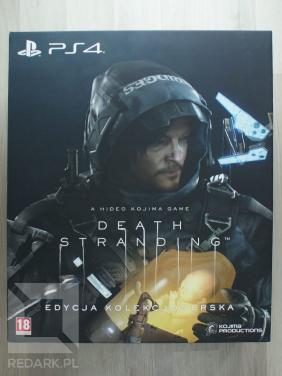
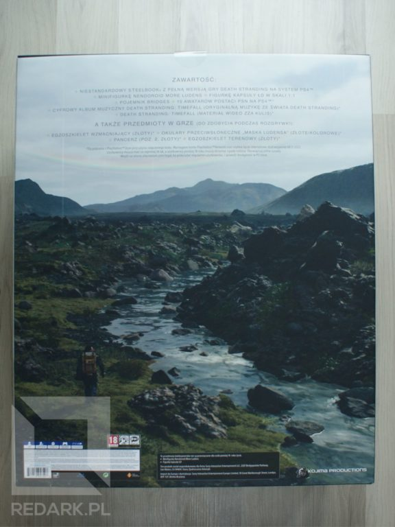
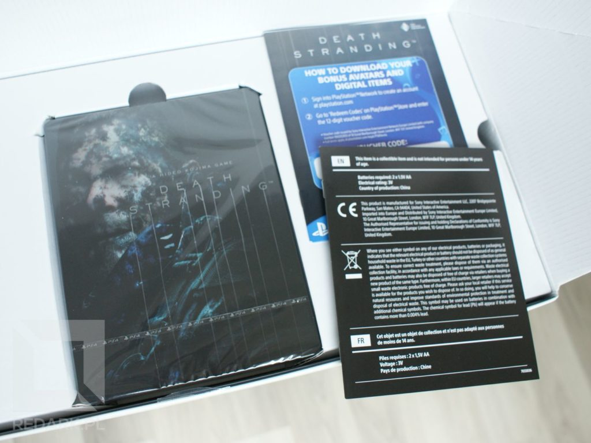
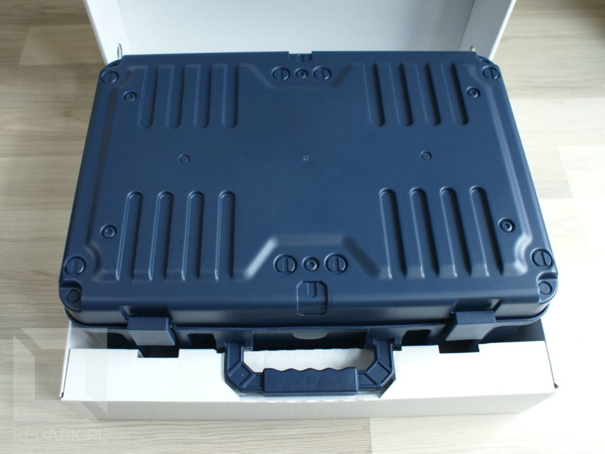
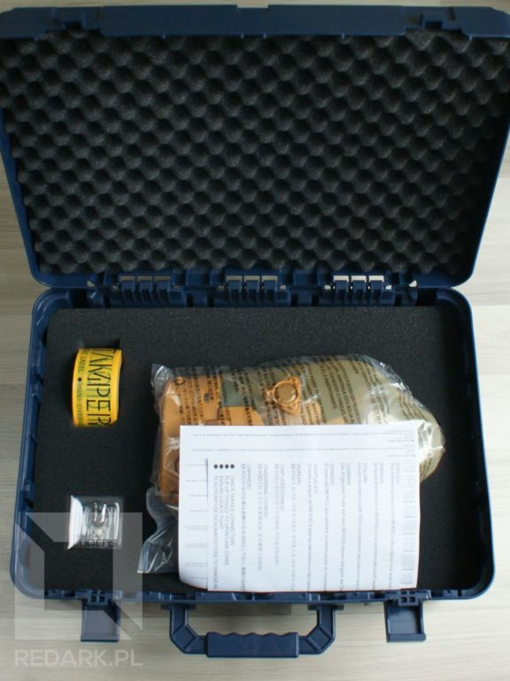
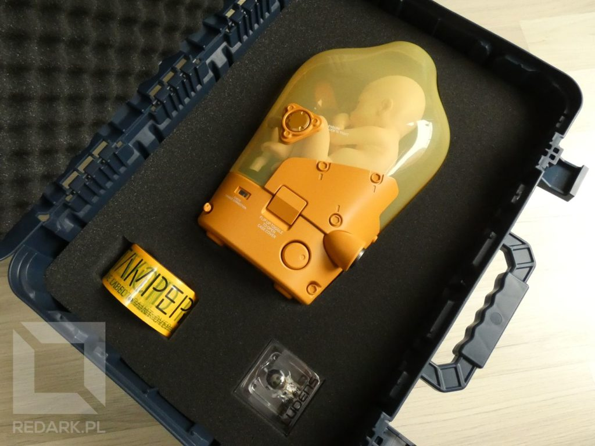
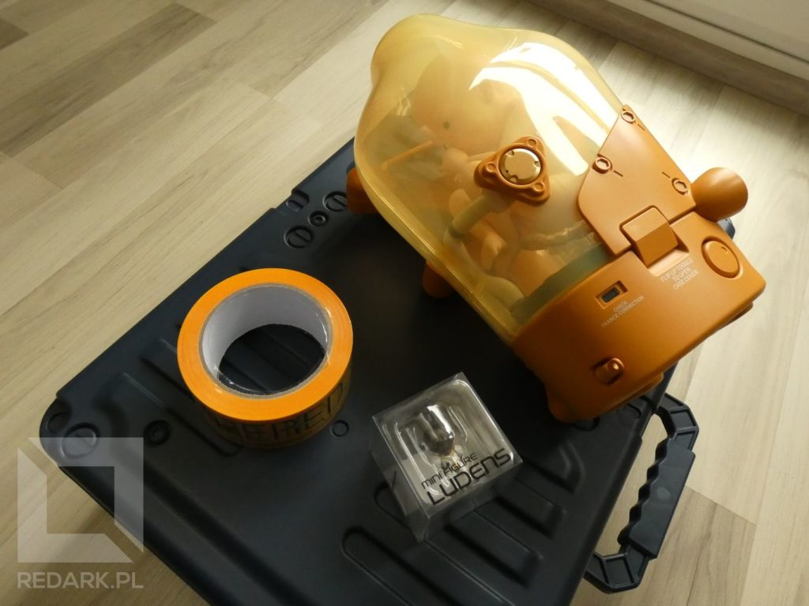
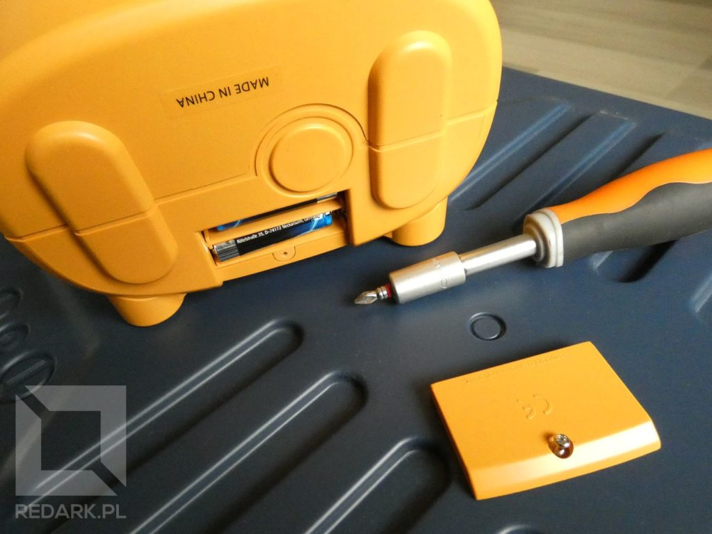
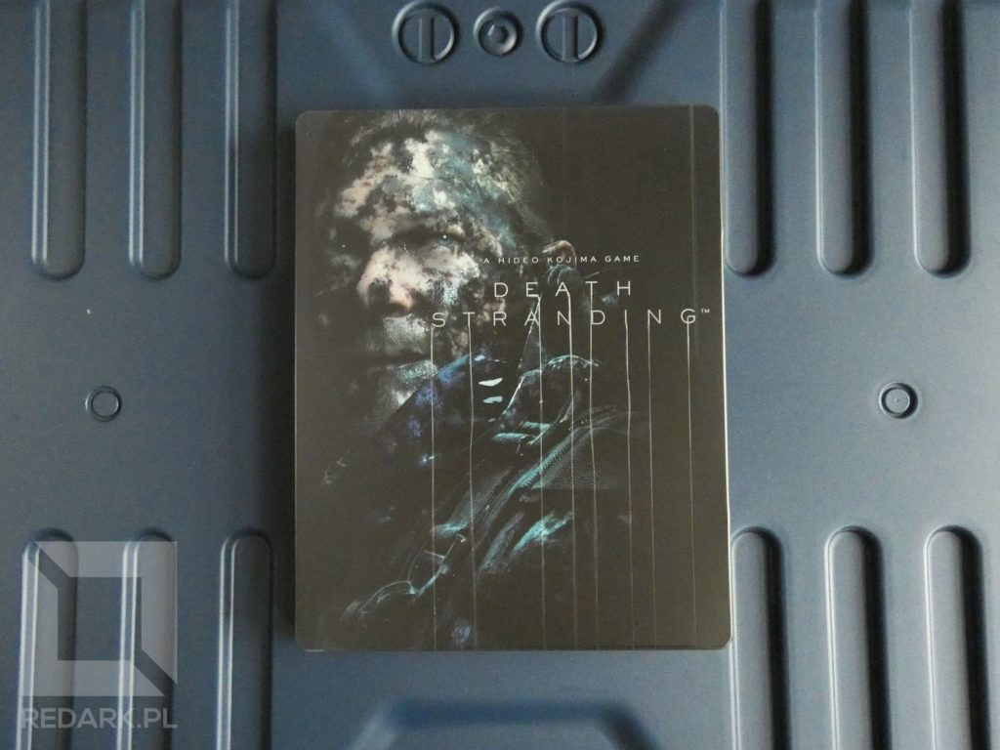
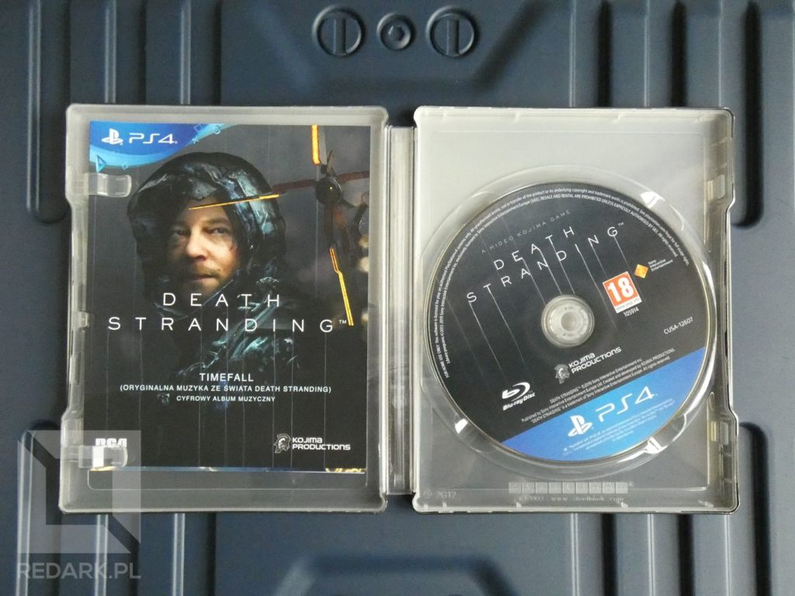

Preorder edycja kolekcjonerska gry Death Stranding znikł ze sklepów internetowych tak szybko, jak się pojawił. Wiele osób zamawiało po kilka sztuk i dlatego też na pewnym serwisie aukcyjnym możemy teraz obserwować wysyp ofert, których cena nawet dwukrotnie przebija kwotę, za jaką można było w przedsprzedaży zamówić tę edycję.

Od dłuższego czasu w Internecie regularnie pojawiały się komentarze od osób, które otrzymały maile o anulowaniu zamówienia. Ja do samego końca nie wiedziałem, czy dane mi będzie zdobyć pudełko właśnie z tą wersją. Zamówienie wisiało bez odpowiedzi, a pracownicy sklepu spytani w dniu premiery o status przesyłki rozkładali ręce. Ale udało się! Dokładniejsze przeszukanie zaplecza i doinformowanie obsługi, że nie będzie to przedmiot wielkości standardowego pudełka z grą, sprawiły, że moja przesyłka odnalazła się!

## Rozmiar pudełka

Karton zawierający wszystkie przedmioty kolekcjonerskie jest przeogromny i ma aż 60 centymetrów wysokości! Paradowanie z takim monstrum po ulicy było ciekawym doświadczeniem. Nie dziwię się też, że nawet obsługa sklepu spytała, czy to jest jakaś specjalna edycja konsoli PS4 z akcesoriami. To pudło spokojnie pomieściłoby z 2 konsole oraz gogle VR.

<Gallery>

</Gallery>

Pudełko na froncie posiada grafikę przestawiającą postać głównego bohatera - Sama Portera Bridges. Na jego piersi możemy zauważyć tytułowego bombelka w słoiku, czyli Bridge Baby występujące w polskim tłumaczeniu jako Dziecko Łącznikowe.

Z tyłu pudełka odnajdujemy przepiękny krajobraz pochodzący z otwartego świata gry zlokalizowanego w postapokaliptycznych Stanach Zjednoczonych. U góry natomiast odnajdziemy spis wszystkich przedmiotów znajdujących się w opakowaniu.

## Zawartość opakowania

Zaraz po otwarciu pudełka naszym oczom ukazuje się steelbook zawierający nośnik instalacyjny gry oraz dwie ulotki, w których odnajdziemy m.in. kody umożliwiające pobranie specjalnej zawartości cyfrowej, która może zostać wykorzystana w świecie gry.

Po zdjęciu wierzchniej tekturki ze steelbook'iem widzimy dwie duże połówki kartonów, w których schowano coś bardzo dużego. Co takiego? Przekonajmy się :)

## Dzień dobry, tu kurier, przesyłkę przyniosłem

Wewnątrz kartonów znajdujemy ogromną granatową walizkę wykonaną z plastiku. Co prawda, jakość materiału mogłaby być lepsza, ale wykonanie szczegółów jest dość staranne i sam rozmiar walizki robi wrażenie. Przedmiot ten ma 50 centymetrów szerokości, 40 wysokości oraz 20 grubości i kształtem nawiązuje do metalowych walizek, w których nasz bohater transportuje przesyłki.

Środek walizki skrywa trzy rzeczy. Pierwszą, najmniejszą z nich jest Ludens, czyli figurka przedstawiająca maskotkę Kojima Productions. Druga to żółta taśma kurierska, która w świecie gry służy do zabezpieczania przesyłek przed nieuprawnionym dostępem do ich zawartości. Porównując ją do standardowych taśm klejących dostępnych w sklepach, tej jest jej całkiem sporo i na pewno będzie można ją wykorzystać na wiele kreatywnych sposobów. A co jest trzecim, największym przedmiotem w walizce?

## Bombelek!

Głównym gadżetem, który wyróżnia tę edycję na tle innych, jest figurka BB wykonana w skali 1:1! Nie myślicie, że jest to jedynie plastikowa creepy figurka do postawienia na półce. Przedmiot posiada u dołu małą klapkę, po zdemontowaniu której, możemy zainstalować baterie i zamienić BB w lampkę nocną, która z pewnością przerazi niejednego gościa w Twoim domu :D

<Gallery width='1'>

</Gallery>

<AdSense/>

## Steelbook i dodatki cyfrowe

Na koniec wróćmy jeszcze do steelbook'a. Jego powierzchnię zdobi podobizna Sama ubrudzonego smołą(?) oraz logo Death Stranding. Wewnątrz znajdziemy płytę blu-ray oraz kilka ulotek, na których znajdziemy kolejne kody umożliwiające pobranie dodatkowej zawartości cyfrowej, do której należy:

- album pt. "Timefall" zawierający ścieżkę dźwiękową z gry,
- wideo "zaa kulis" przezentujące pracę nad grą,
- 10 awatarów dla kont PSN,
- złoty egzoszkielet, pancerz, czapka oraz okulary,
- dynamiczny motyw dla konsoli PlayStation 4.

<Gallery>

</Gallery>

## Moja opinia

Jak w moich oczach prezentuje się ta kolekcjonerka? Nie jest idealna, ale też bardzo daleko jej do złej czy przecietnej. Do zalet można na pewno zaliczyć ładne wykończenie detali (brak odprysków czy nadlewek plastiku), przyzwoitą jakość materiałów oraz rozmiary walizki i BB, które zostały wykonane w skali 1:1. Wadą tej edycji jest to, czego w niej nie ma. Na pewno brakuje mi tutaj artbook'a z grafikami koncepcyjnymi. Gra z takimi krajobrazami aż prosi się o taki dodatek!

Jednak nie jestem zdziwiony akurat takim doborem zawartości przez Hideo. Może już niektórzy z Was zauważyli, że ta edycja jest idealnie skrojona pod cosplay'erów! Nie wierzycie? Świecący "BB Pod" posiadający zaczepy pod kombinezon, zawieszka Ludens'a zdobiąca w grze ekwipunek Sama, a także pełnowymiarowa walizka, która może zostać obklejona taśmą kurierską! Takim oto sposobem dorabiając do tego kostium z radarem na plecach, jesteśmy w stanie zrobić super cosplay naszego głównego protagonisty. Pewnie większość z Was nie będzie bawiła się w przebieranki, ale taka była wizja projektanta tej edycji i moim zdaniem wyszło to idealnie.
