Ponad 66 godzin gry, 431 przebytych kilometrów, 173 083 zdobytych lajków oraz 485 dostarczonych ładunków o łącznej wadze 7,6 tony - tak prezentują się statystyki z ukończonej przeze mnie tydzień temu gry Death Stranding. Jak zatem prezentuje się pierwsza pełnoprawna gra typu "A Hideo Kojima Game"?

Gdy ponad 4 lata temu świat obiegła informacja o odejściu Hideo Kojimy z Konami i o tym, jak był traktowany przez tę korporację, fani serii Metal Gear Solid byli zdruzgotani. Wiedzieli, że będzie to koniec pokręconej i skomplikowanej fabuły serwowanej przez to uniwersum, ale nagle, na scenie E3 2016 pojawił się on - Hideo Kojima - i oznajmił, że teraz z pomocą Sony nadal będzie tworzyć gry, ale już pod szyldem własnej firmy - Kojima Productions. Wtedy też poznaliśmy pierwszy trailer pokazujący płaczącego nagiego Normana Reedusa trzymającego niemowlę na plaży pełnej martwych zwierząt. Zaczęło się ciekawie, nieprawdaż? Później było już tylko dziwniej, ale to już chyba każdy wie.

## Kilka słów na początek

Zanim przejdę do właściwej recenzji, muszę zaznaczyć jedną, bardzo ważną rzecz. Grałem w Metal Gear Solid V i tak, podobała mi się ta gra. Z wiadomych przyczyn była niedokończona, ale byłem z niej zadowolony. Dlaczego musiałem o tym wspomnieć? Praktycznie każda z przedpremierowych recenzji DS, które zostały opublikowane w okolicach 1 listopada, została zbombardowana zarzutami, że tytuł ten recenzowały jedynie osoby lubiące serię MGS i postać Hideo Kojimy. Bardzo zdziwił mnie ten fakt i pytam się, co w tym niestosownego? Idąc tym tropem, osoba, która uwielbia i gra w serię Dark Souls, nie powinna się już wypowiadać na temat na przykład Sekiro: Shadows Die Twice, bo jest nieobiektywna? Duża część polskiej społeczności ubzdurała sobie, że Death Stranding jest pokracznym dziełem wariata i każdy, kto mówi, że ta gra jest świetna, jest fanboy'em Hideo i nie można mu ufać. Dlatego też chciałem zaznaczyć to na wstępie. Znam serię Metal Gear Solid i grałem osobiście w jej piątą, ostatnią odsłonę. Dlatego jeśli ktoś uważa, że z tego powodu nie jestem w stanie rzetelnie zrecenzować tytułu, lepiej niech nie czyta dalej, ponieważ i tak sam wyrobił sobie opinię. Jeśli nie, to zapraszam do lektury :)

<InfoBlock>Jak zaznaczyłem to w tytule artykułu, będę unikać treści mogących zdradzić fabułę omawianego tytułu. Niemniej jednak będę posiłkować się częścią informacji, jakie były udostępniane przed premierą gry.</InfoBlock>

<AdSense/>

## Dostarczać paczki - taki jest mój cel

Zacznijmy od rdzenia całej rozgrywki, wokół której skupia się Death Stranding. Wcielamy się tutaj w postać Sama Portera Bridgesa - kuriera przemierzającego postapokaliptyczne tereny dawnego USA zrujnowanego przez tytułowe Wdarcie Śmierci. Z powodu pojawienia się deszczy temporalnych przyspieszających upływ czasu oraz dziwnych istot zwanych wynurzonymi, ludzkość została zmuszona do ukrywania się w bunkrach rozsianych w różnych zakątkach kraju. Ostatnimi poruszającymi się po powierzchni ziemi ludźmi są właśnie kurierzy, których zadaniem jest transport pożywienia, leków oraz innych przedmiotów, których potrzebują mieszkańcy schronów.

<Gallery>
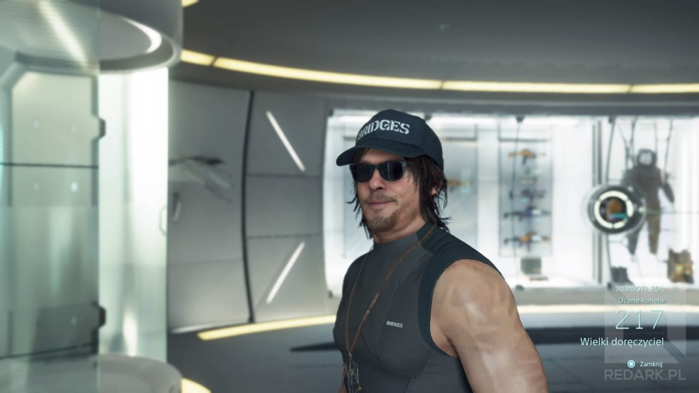
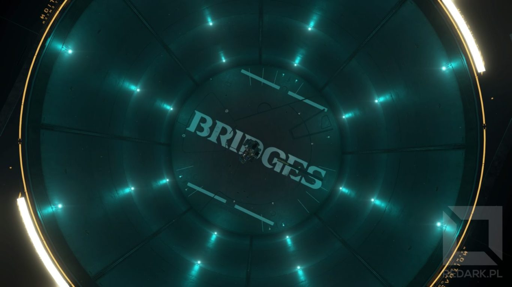
</Gallery>

Nasz bohater jest jednak wyjątkowy. Cierpi na hafefobię, czyli lęk przed dotykiem innych osób, co sprawia, że praca samotnego kuriera jest dla niego jak znalazł. Oprócz tego posiada specjalne zdolności pozwalające mu wyczuwać obecność wspomnianych wcześniej wynurzonych oraz odradzać się po swojej śmierci, ale o tym później :) . Fabuła koncentruje się na organizacji Bridges, do której przed laty należał nasz bohater. Jej celem jest zjednoczenie rozrzuconych po schronach ludzi dzięki zbudowaniu tzw. sieci chiralnej. Jest to swego rodzaju Internet, którego zadaniem jest umożliwić łatwą wymianę informacji między bunkrami oraz zapewnić dostęp do części przedmiotów, które mogą zostać wydrukowane przy pomocy specjalnych drukarek chiralnych.

Jaki w tym problem? Ekspedycja, której celem było stworzenie owej sieci, została zdziesiątkowana przez terrorystów, a jej przywódczyni Amelie (z którą nasz bohater jest mocno związany) została porwana i jest przetrzymywana jako zakładniczka. Sam, z racji swoich zdolności, zostaje zmuszony do powrócenia w szeregi Bridges i udania się na przeciwległy kraniec dawnych Stanów Zjednoczonych, aby uratować Amelie i dokończyć jej dzieło. W tym celu otrzymuje "Q-pid'a" - naszyjnik, który pozwoli aktywować sieć chiralną zbudowaną przez pierwszą ekspedycję oraz Bridge Baby lub jak ktoś woli polskie tłumaczenie Łącznikowe Dziecko. Tak, mowa o tym [dziecku zamkniętym w kapsule](/bombelkowy-unboxing-edycji-kolekcjonerskiej-gry-death-stranding), które Sam nosi na brzuchu. Posiada ono specjalne zdolności, które w połączeniu ze skanerem na znajdującym się plecach Sama dają nam możliwość zobaczenia i unikania wynurzonych.

<Gallery>

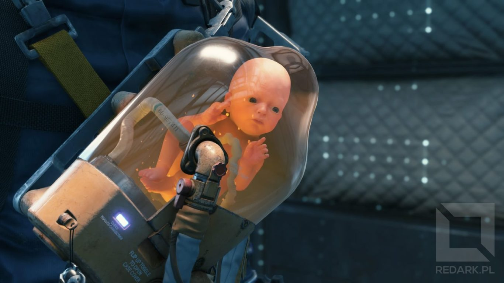
</Gallery>

Organizacja Bridges radzi nam, żebyśmy nie przywiązywali się do BB i traktowali go tylko i wyłącznie jako część ekwipunku, niemniej jednak podczas gry będziemy musieli dbać o stan i zadowolenie naszego łącznika. Można to robić chociażby podczas odpoczynków w czasie trasy, kiedy to mamy możliwość rozprostować kości, zdrzemnąć się, a nawet zanucić naszemu BB kołysankę. Reakcje bąbelka są tak urocze, że tak samo jak Sam, zżyjecie się z nim emocjonalnie. Również samo BB będzie z czasem zmieniać swoje zachowanie wraz z budowania więzi z głównym bohaterem. Zapomnicie nawet, że jest ono zamknięte w kapsule.

<Gallery>
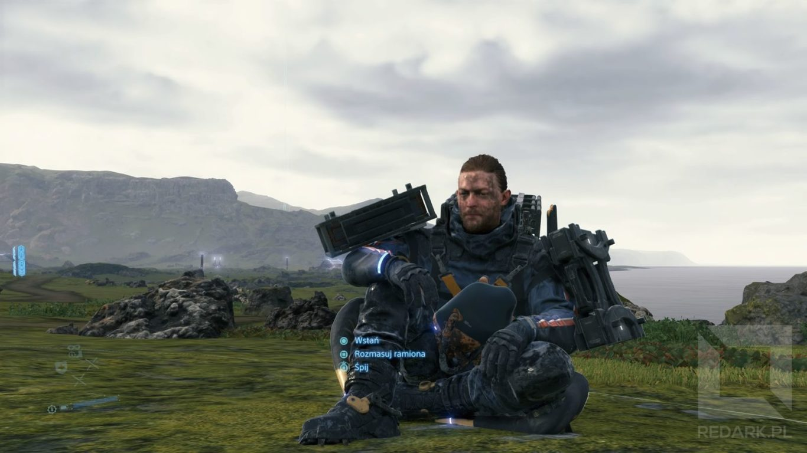

</Gallery>

Naszym zadaniem jest zatem walczenie z niesprzyjająca pogodą, wynurzonymi, terrorystami oraz wrogimi kurierami, którzy w polskim tłumaczeniu nazywani są MUŁ-ami. Po drodze będziemy musieli odwiedzać bunkry, poznawać mieszkające w nich osoby oraz dostarczać potrzebne ładunki. Na początku wszystko wydaje się proste. Przynosimy zamówioną paczkę, a odbiorcy cieszą się, wychwalają Bridges i proszą nas, abyśmy podłączyli ich do sieci. Jednakże im bardziej zbliżamy się do zachodu, sytuacja ulega zmianie. Tereny te są kontrolowane przez terrorystów, a mieszkańcy schronów już dawno przestali wierzyć w ideę zjednoczenia ludzkości. Każda ze spotkanych osób zaczyna opowiadać swoją historię i przedstawiać powód, dlaczego nie chce dołączyć do budowanej przez nas sieci. Naszym zadaniem jest przekonać ich, że warto nam zaufać i pozwolić na podłączenie do sieci. Jak to zrobić? Oczywiście sumiennie dostarczać im przesyłki, nawet te z trudno dostępnych miejsc.

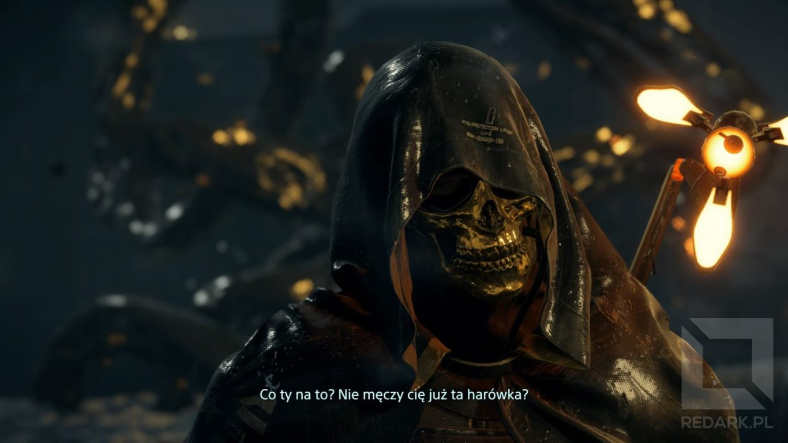

Przed premierą gry, podobnie jak duża część recenzentów, miałem obawy, że Kojima spuszczony ze smyczy Konami stworzy grę, w którą nie da się grać. W końcu co może być ciekawego w noszeniu paczek? A jednak moje obawy były niepotrzebne. Sposób budowania nastroju, zarządzania ładunkiem oraz planowaniem swojej trasy sprawia, że jest to genialne i niecodzienne doświadczenie, którego na próżno szukać w innych tytułach cyfrowej rozrywki.

Szczególną uwagę należy tutaj zwrócić na otwartą, zróżnicowaną mapę świata gry, która na każdym kroku nagradza gracza wspaniałymi widokami wrogiego środowiska naturalnego. Wielkie brawa należą się tutaj studiu Guerrilla Games za udostępnienie swojego silnika graficznego, który napędzał grę Horizon: Zero Dawn. Granie w Death Stranding przypomniało mi, jak cudownie wyglądającą grą jest Horizon. Daleki horyzont, niesamowite widoki i bezbłędne doczytywanie terenu. Każdy, kto grał w ten tytuł, w Death Stranding poczuje się jak w domu. Dodatkowo w świecie gry możemy spotkać nawiązania do Horizona w postaci hologramów przedstawiających główną bohaterkę Aloy, maszynę Czujkę czy Żyrafa. Zresztą w samym Horizonie można było znaleźć przedmioty z DS takie jak lalka niemowlaka, Q-pid oraz futurystyczne kajdanki, które w Death Stranding pełnią rolę komputera osobistego.

<Gallery width='2'>
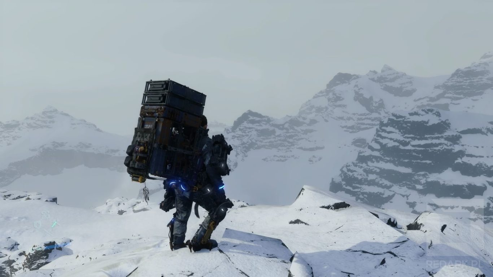
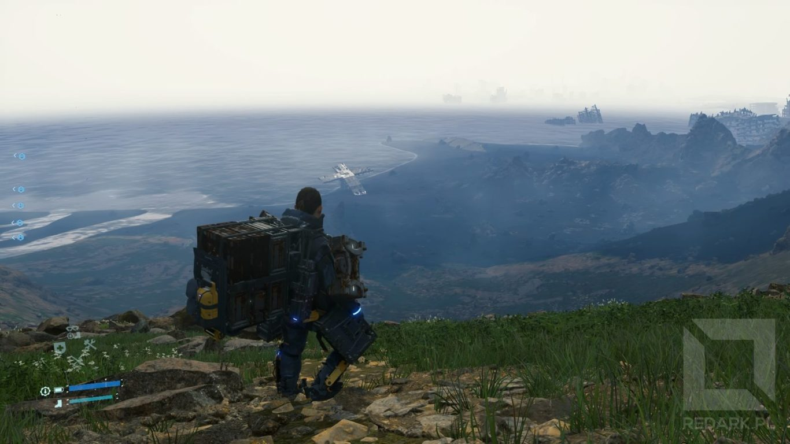
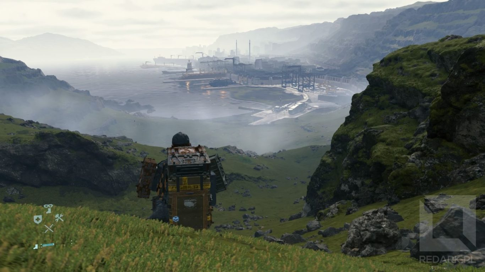

</Gallery>

Pozostając jeszcze w kwestii mapy, muszę podkreślić jedną ważną rzecz. Nawet nie zorientowałem się, w którym momencie mój mózg zaczął podświadomie tworzyć i zapamiętywać sprawdzone ścieżki i taktyki przejścia przez określone fragmenty mapy. Zauważyłem, że przyjmując zlecenie dostawy, w głowie tworzy mi się już gotowy plan na drogę. Tutaj skręcę w lewo. Później pojadę wzdłuż rzeki. A nie, czekaj! Te paczki mają ponad 100 kilo, a tam jest obóz MUŁ-ów! A może ukradnę im ciężarówkę? Lepiej nie. W takim razie pójdę wzdłuż tej góry, a później skręcę w prawo i przejdę kanionem. I tak dalej... W sumie nawet sama gra zachęca nas do takiej aktywności, prezentując na mapie trasy, po których chodziliśmy. Wszystko po to, abyśmy stworzyli własną sieć sprawdzonych ścieżek. Proste, a genialne.

## Zarządzanie ładunkiem

Tak jak już wspominałem, naszym głównym celem będzie transportowanie ładunku w postaci paczek, który będzie umieszczany głównie na plecach oraz w uchwytach i kieszeniach naszego kombinezonu. Nie znajdziecie tutaj magicznych schowków i kieszeni o nieograniczonej pojemności. Każda paczka, broń, drabina czy nawet lina zajmuje nam fizycznie miejsce w plecaku. Ba! Trzeba nawet uważać, aby równomiernie obciążyć barki Sama, ponieważ ma to znaczenie podczas utrzymywania równowagi na nierównościach terenu czy przy silnym wietrze. Brzmi nużąco? Trochę tak i faktycznie momentami byłem już zmęczony przeklikiwaniem tych wszystkich opcji, ale ostatecznie uważam, że jest to kwintesencja tego tytułu.

<Gallery width='2'>

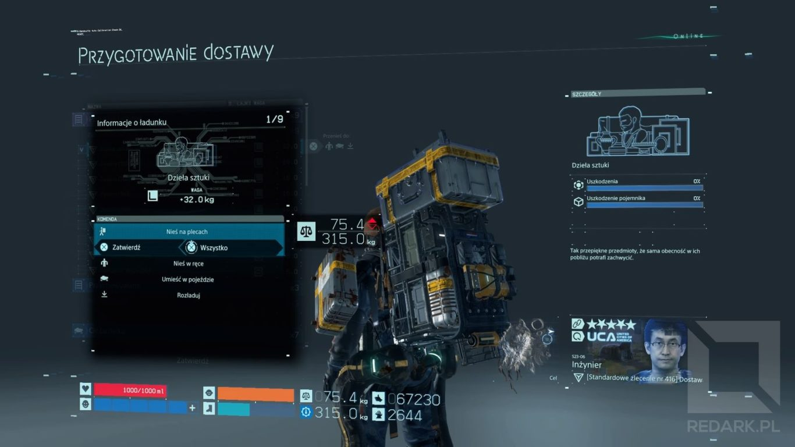
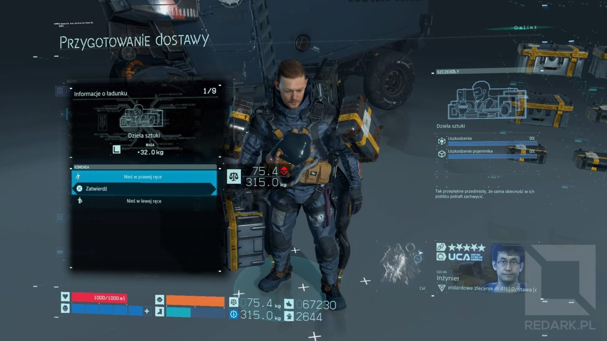
</Gallery>

Pozwólcie, że coś Wam pokażę. To, co widzicie na grafikach powyżej, jest to główny ekran zarządzania ładunkiem w Death Stranding. Po lewej stronie widzimy listę paczek podzieloną ze względu na lokalizacje miejsca, w którym aktualnie znajduje się dany pakunek. Mamy tutaj kategorie reprezentujące ładunek znajdujący się na plecach, ramionach, udach, w kieszeniach, dłoniach, a także ten odłożony na ziemię, do magazynu lub umieszczony w pobliskim pojeździe. Pozycje możemy wybierać pojedynczo lub grupowo i przenosić je między wymienionymi wcześniej lokalizacjami. Teraz uspokoję trochę sceptyków. Gra nie wymusza na nas ręcznego przyczepiania paczek do odpowiednich miejsc i dbania o wyważenie postaci. My musimy jedynie rozdzielić paczki pomiędzy siebie, a np. stojący obok nas pojazd. Następnie wystarczy wcisnąć trójkąt, aby specjalny algorytm ułożył optymalnie wszystkie paczki po całym naszym kombinezonie. Także spokojnie, nie jest to nic męczącego i nie wymaga tytułu magistra logistyki.

Małym minusem jest natomiast animacja załadowywania i rozładowywania ładunku w terminalach bunkrów. Na szczęście da się ją pomijać, ale tak samo jak w przypadku piątej części Metal Gear Solid, wymaga to użycia AŻ 3 przycisków. Spokojnie, w pewnym momencie gry wyrobicie sobie szybki sposób wciskania kombinacji tych klawiszy :)

<AdSense/>

## Z drogi! Uczę się chodzić!

W przedpremierowych recenzjach pojawiało się często stwierdzenie, że "Hideo każe nam od nowa nauczyć się chodzić". To nie jest żart, tylko najszczersza prawda. Ma to związek z omawianą wcześniej mechaniką ładunku. Tutaj nie ma prostego modelu chodzenia: idź spokojnie lub biegnij. Ułożenie ładunku, ukształtowanie terenu, wiatr, deszcz - wszystko ma wpływ na to, jak się poruszasz. Na początku gry faktycznie biegałem jak potłuczony i nie potrafiłem ustać w miejscu. Mocno we znaki wdawała mi się mechanika zachowania pędu. Im szybciej biegniesz, tym trudniej ci się zatrzymać i broń Boże, żebyś nadepnął na jakąś wystającą skałkę, bo Sam wpadnie w wir śmiercionośnego pędu połączonego z usilnymi staraniami, aby nie spowodować bliskiego spotkania swojej twarzy z ziemią. Biegnąc, musimy cały czas obserwować ukształtowanie i pochylenie terenu przed nami.

Z czasem zaczynamy kontrolować tę mechanikę. Rozumieć, na co możemy sobie pozwolić, a na co nie. Uczymy się kontrolować naszą prędkość, promień skrętu podczas biegu oraz wyważenie ładunku. Tutaj wkraczają do gry przyciski spustów (tzw. triggerów) na padzie, ponieważ odwzorowują one ręce naszej postaci. W jaki sposób? Ostro skręcasz i zaczynasz przechylać się w lewo? Użyj R2, aby fizycznie złapać się prawą ręką za szelki plecaka i wyrównać ciężki ładunek do pionu. Idziesz pod górkę i postać zaczyna przeważać ładunek na plecach? Złap się obiema rękoma za plecak, ale pamiętaj, że bez rąk trudniej będzie Ci się wspinać po zboczu. To tylko wierzchołek góry mechanik, jakich doświadczysz w tym tytule.

<Gallery>
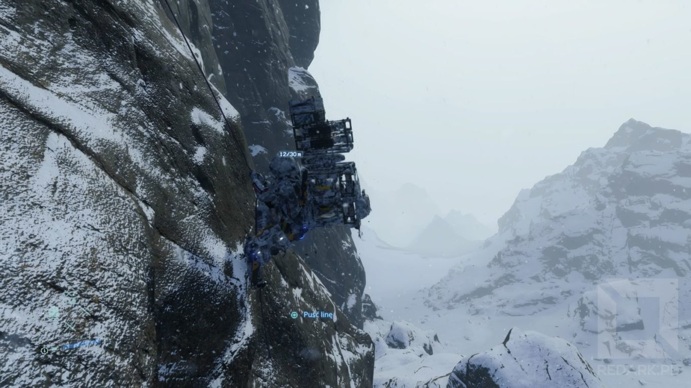

</Gallery>

Pamiętasz, jak w poprzednim rozdziale mówiłem, że ładunek można umieścić również w dłoni? Tutaj także musisz użyć triggerów, aby fizycznie trzymać coś w dłoni. Jeśli w menu ładunku umieścisz paczkę w lewej ręce Sama, to po wyjściu z menu musisz natychmiast zacząć trzymać L2 na padzie, inaczej Sam odstawi ładunek na ziemię. Czy jest to uciążliwe podczas drogi? No ba! Nie dość, że rozkład ładunku jest teraz nie równy, to jeszcze tracimy możliwość wspomagania utrzymywania równowagi. W dodatku wyobraź sobie, jak palec ściskający trigger musi drętwieć podczas długiej wędrówki. Rozwiązanie? Zatrzymać się, odłożyć ładunek i zrobić sobie przerwę lub przełożyć pakunek do drugiej ręki i trzymać teraz R2. Czy nie to samo robisz, wracając z ciężką torbą zakupów ze sklepu? Czy teraz rozumiesz, dlaczego pisałem, że gra genialnie buduje imersję pracy kuriera?

## Mnogość mechanik

To, co z pewnością robi wrażenie w Death Stranding to ilość przeróżnych mechanik, jakie twórcy umieścili w tym tytule. W dodatku nie są one wprowadzane do rozgrywki na zasadzie "zdjęcia kłódki" w menu gry. Skąd zdobyć broń? Znajdź kogoś, kto zajmuje się jej wytwarzaniem. Chcesz ulepszyć swój plecak lub kombinezon? Znajdź kogoś, kto zajmuje się szyciem. Można by tak wymieniać w nieskończoność. Tutaj wszystko, nawet opcja szybkiej podróży, ma uzasadnienie w fabule! Co ciekawsze, gra karmi nas nowymi przedmiotami praktycznie do końca fabuły. Ilość odblokowanych ułatwień zależy jedynie od tego, jak bardzo sumiennie przykładaliśmy się do umacniania więzi z mieszkańcami odwiedzonych przez nas bunkrów. Za darmo przecież nie oddadzą nam swoich gadżetów, co nie?

Tutaj należy też wspomnieć, że gra nie wymusza na nas ciągłego chodzenia pieszo. W dalszej części gry otrzymujemy również możliwość odbudowy autostrady, która znacząco przyspiesza podróżowanie po mapie. Możecie dojść do sytuacji, w której będziecie mogli ładować na pojazdy nawet pół tony ładunku i rozwozić go po całej mapie nie biorąc przy tym na plecy ani jednej paczki. Wszystko zależy od Was. Od tego, czy wolicie iść pieszo, czy jeździć autem. Czy chcecie wykonywać jedynie misje fabularne, czy też wolicie zabawę w logistyka. Pełna dowolność.

Jak jesteśmy już przy pojazdach, muszę niestety powiedzieć o poważnym minusie Death Stranding, jakim jest fizyka pojazdów. Najgorzej wypada tutaj motocykl. Jest on szybki, zwrotny i posiada potężne turbodoładowanie, ale spróbuj uderzyć nim o kamyczek, a staną się rzeczy nie z tego świata. Pojazd w takiej sytuacji nie dość, że w ułamek sekundy wytraca całą swoją prędkość, to jeszcze zaraz po odblokowaniu koła potrafi nagle wystrzelić w powietrze. Wcale nie dziwię się, że twórcy dodali możliwość lekkiego podskakiwania pojazdami. Maszyny w tej grze potrafią zablokować się na wszystkim, co wystaje i bez możliwości skoku korzystanie z nich byłoby niemożliwe.

Przypomina mi się tutaj jeden z niewielu momentów w grze, w którym otrzymałem obrażenia od upadku. Mianowicie pewnego razu przemierzałem mapę w poszukiwaniu schronu, w którym znajdował się interesujący mnie ocalały. W pewnym momencie na mojej drodze pojawiła się mała wyrwa, szczelina w terenie. Jej krawędzie były tak wyprofilowane, że aż prosiły się o wykonanie efektownego skoku motocyklem. Nie widziałem innego wyjścia, jak spróbować przeskoczyć tę szczelinę. Znalazłem w miarę gładki skrawek terenu, wycofałem motocykl i przygotowałem turbodoładowanie. Jak się pewnie już domyślacie, efektownego skoku nie było. Rozpędzony motocykl wyhamował tuż przed przepaścią, a nieobliczalna fizyka pojazdu zafundowała Samowi szybką wycieczkę na dół mini kanionu. Tak, wczytałem ręcznie ostatniego save'a.

## Kiedy wróg atakuje...

Sam unika walki. Jest to zrozumiałe. W końcu transportuje na swoich plecach dziesiątki, a czasami nawet setki kilogramów drogocennego ładunku. W dodatku konflikty po Wdarciu Śmierci są szczególnie niebezpieczne. Każda śmierć, każde gnijące ciało powoduje pojawienie się wynurzonych oraz powstanie tzw. rozpróżni, czyli wielkiego krateru jak po wybuchu bomby atomowej. Z tego powodu pakowanie się w jakiekolwiek tarapaty jest często niewskazane, a preferowanym sposobem walki w tym świecie jest używanie broni obezwładniającej. Możliwe jest także wykorzystanie do walki własnych paczek lub gołych pięści Sama, doprowadzając tym sposobem do scen rodem z Mortal Kombat - kto przeszedł grę z pewnością doświadczył takich momentów ;)

<Gallery>
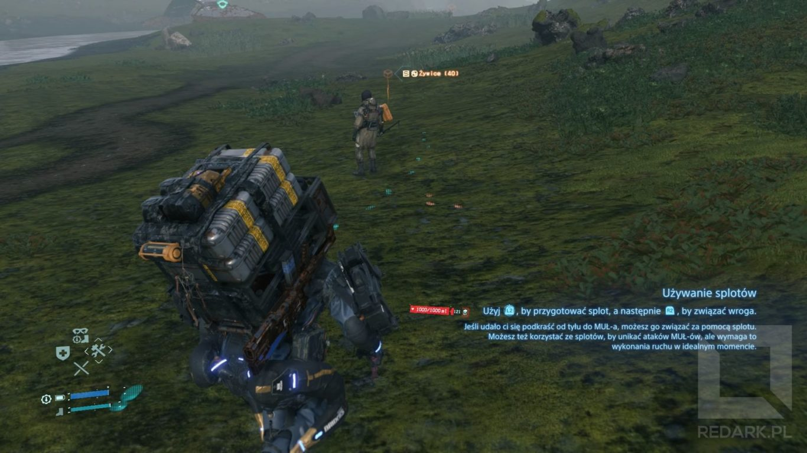
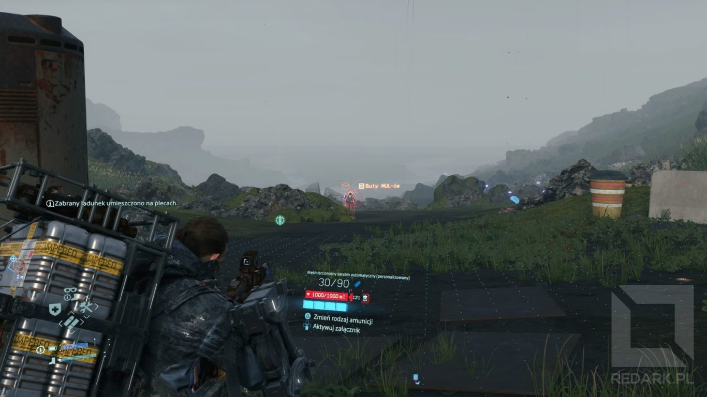
</Gallery>

Walka ze wspominanymi już terrorystami to inna sprawa. Używają oni broni palnej mogącej bardzo szybko pozbawić Sama krwi, która notabene stanowi tutaj pasek zdrowia wyrażany w mililitrach. Swoją drogą, czy pamiętasz, jak mówiłem Ci, że Sam posiada zdolność odrodzenia się po śmierci? Tak, potrafi to zrobić, ale nie mówiłem przecież, że jego śmierć nie powoduje powstania krateru, a terroryści raczej nie mają nic przeciwko temu, aby Sam zmieniał powierzchnię Stanów Zjednoczonych w ser szwajcarski.

Gra oczywiście nie zabrania graczowi zastosowania wobec naszych przeciwników ostrej amunicji, ale jeśli to zrobimy, to po zakończonej potyczce zostaniemy zmuszeni do przetransportowania wszystkich martwych ciał do położonych w górach spalarni ciał, aby nie dopuścić do kolejnej rozpróżni.

<Gallery>

</Gallery>

Co do samego mechanizmu strzelania to jest okej. Dostajemy wiele rodzajów broni, zarówno tej ostrej, jak i obezwładniającej. Fabuła dostarcza kilka okazji do strzelania, głównie podczas walki z bossami, ale nie ma co ukrywać, Death Stranding nie jest grą nastawioną na strzelanie tak, jak to miało miejsce w Metal Gear Solid. Przez jakiś czas było nawet głośno o pewnym wywiadzie z Hideo Kojimą, w którym autor gry powiedział:

<Quote source='Hideo Kojima'>W Stanach Zjednoczonych mieliśmy mocniejszą krytykę. Dla pewnego rodzaju krytyków i odbiorców to może być trudniejsza gra do zrozumienia. Amerykanie są wielkimi fanami strzelanek, a Death Stranding taką nie jest, mierzy wyżej.</Quote>

Jedyna rzecz w mechanice strzelania, jaka zirytowała mnie porównywalnie do jazdy motocyklem po kamyczkach, był sposób przypisania przycisków od celowania na padzie. W Death Stranding, tak jak z resztą w innych tytułach, do celowania używamy L2, a strzelamy R2. Wszystko byłoby fajnie, gdyby nie to, że pod tymi przyciskami mamy już opisywaną wcześniej przeze mnie mechanikę sterowania rękami Sama. Wyobraźcie sobie sytuację, w której walczycie z potężnym bossem. Obrywacie i non stop tracicie równowagę oraz paczki. Nadchodzi idealny moment, aby strzelić do przeciwnika, naciskacie L2, aby przycelować i nic! Dlaczego? Odwracacie kamerę, aby sprawdzić, co się stało i okazuje się, że Sam, zamiast atakować, postanowił złapać się rączką za plecaczek i czekać spokojnie na kolejny cios przeciwnika. Taka sytuacja wydarzyła mi się nie raz.

<AdSense/>

To jest właśnie kolejny poważny problem tej gry. Twórcy wpakowali zbyt wiele funkcji na niektóre przyciski kontrolera, co skutkuje pojawieniem się takich głupich i frustrujących sytuacji. O problemie z triggerami twórcy chyba nawet zdawali sobie sprawę, ponieważ w ustawieniach możemy znaleźć bardzo ciekawy suwak. Ustala on "priorytet utrzymywania równowagi nad celowaniem". Jednym słowem twórcy zadają nam pytanie "wolisz bardziej strzelać czy przewracać się na nierównościach?". Można było to znacznie lepiej rozwiązać.

## Przerażający wynurzeni

Drugim typem wrogów, jaki napotkamy, będą martwe zjawy z pępowinami. Ich występowaniu towarzyszą silne opady temporalne, które wymuszają na nas sprawne przejście przez ich terytoria. Muszę przyznać, że te istoty potrafią zmrozić krew w żyłach. Zwłaszcza jak samowolnie zakradamy się na ich tereny w celu odzyskania paczek z cennymi surowcami. Poziom adrenaliny rośnie wprost proporcjonalnie do ilości wynurzonych znajdujących się w naszym otoczeniu. O ich liczebności i bliskości informuje animacja i prędkość obracania się Odradka - naszego skanera.

<Gallery>

</Gallery>

Dodatkowe emocje dochodzą, jeśli nasza postać napatoczy się na jedną ze zjaw. Z głośników zaczyna dobiegać niepokojąca muzyka, a my obserwujemy na ziemi duże ślady dłoni zbliżające się do naszego bohatera. Jeśli nie zdołamy przed nimi uciec, z ziemi wyłaniają się przerażające pokryte smołą ludzkie sylwetki, które starają się nas powalić i wciągnąć wgłąb ich terytorium.

Ponownie jednak przyczepię się do jednego aspektu. Wkraczanie na teren opanowany przez wynurzonych sygnalizowany jest zwolnieniem czasu i dyszeniem naszego bohatera. Półtorej sekundy później uruchamia się kolejne zwolnienie czasu połączone z powolną animacją rozkładania się Odradka. Powiem szczerze. Robiło to wrażenie jedynie przy pierwszych pięciu wkroczeniach na ich teren. Później była to denerwująca i zbędna animacja bez możliwości pominięcia.

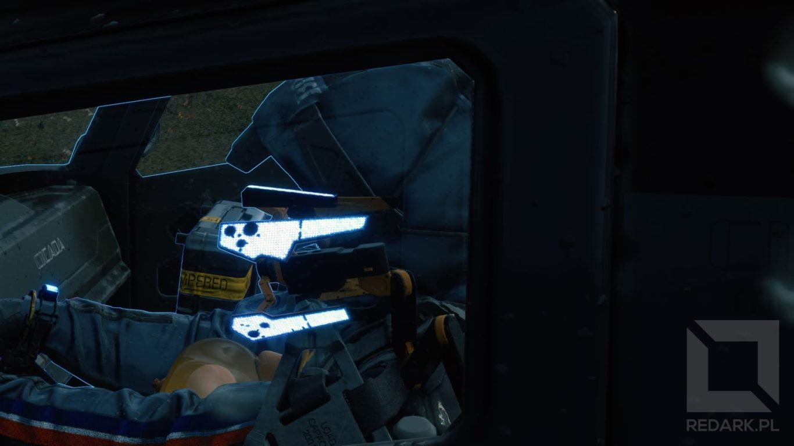

<ImageDescription>Ah sh*t, here we go again...</ImageDescription>

Problem ten stał się jeszcze bardziej dotkliwy, gdy zacząłem jeździć szybko pojazdami po autostradzie (wspomnę o nich jeszcze później). Każde, choćby najmniejsze zahaczenie o teren wynurzonych kosztowało mnie oglądanie tej denerwującej animacji. Ba! Pierwsze spowolnienie czasu powoduje jeszcze zgaszenie silnika w naszym pojeździe i dodatkową animację próby jego odpalenia połączoną z nieprzewidywalnym wystrzałem przez turbodoładowanie. W pewnym momencie aż postanowiłem zmierzyć czas trwania tych animacji. Każdy przejazd przez teren wynurzonych częstował mnie prawie 20 sekundami niepomijalnej animacji, która dodatkowo wyłączała mój pojazd oraz zmieniała ustawienie kamery, tak żebym mógł dokładnie przyjrzeć się animacji rozkładania skanera (bo pewnie jeszcze jej nie widziałem). Tutaj Kojima mocno przesadził z filmowością...

## Pomysłowy tryb multiplayer

W Death Stranding nie znajdziemy tradycyjnego multiplayera, a jego tak zwaną asynchroniczną wersję. Polega on na synchronizowaniu przedmiotów, paczek, pojazdów i innych wybudowanych przez gracza obiektów, ale nie samej sterowanej przez nas postaci. Dzięki temu gra zachowuje się jak tradycyjny sandbox dla jednego gracza, ale na mapie możemy znaleźć ślady działalności innych kurierów, tak jakby faktycznie grali oni razem z nami. Dla przykładu: idąc w nieznany przez nas teren, możemy znaleźć drabinę lub linę pozostawioną przez innego gracza, który był już tutaj przez nami. Dodatkowo każdy z graczy ma możliwość postawiania w dowolnym miejscu znaków (piktogramów) mogących wskazywać łatwiejszą drogę przeprawy, ciekawe miejsca czy ostrzegać o czyhającym na nas niebezpieczeństwie.

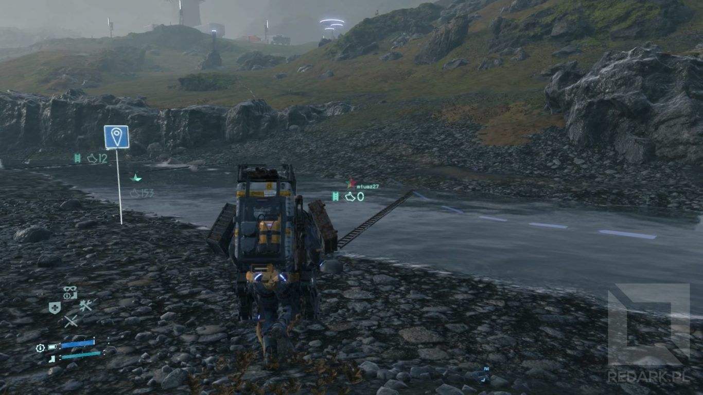

<ImageDescription>Znalezienie drabiny ułatwiającej przejście przez rwącą rzekę zawsze mile widziane</ImageDescription>

Gracz może dziękować innemu kurierowi, za pomoc w wykonaniu zadania przesyłając mu lajki. Tak, te same lajki, które klikasz pod postami na Facebook'u. W świecie przedstawionym Death Stranding już od dawna nie ma waluty. Jedyną formą zapłaty, jaką otrzymasz w tej grze za przyniesienie paczki, będą właśnie cyferki z ikonką kciuka w górę. I to, co jest w Death Stranding piękne to to, że pokazuje, jak ważnym wyznacznikiem sukcesu w dzisiejszych czasach stał się licznik reakcji pod naszymi postami. Nawet nie spostrzegłem kiedy sam zacząłem stawiać coraz więcej "użytecznych obiektów", aby powiększać swoje wirtualne przychody i cały czas otrzymywać komunikaty "ktoś skorzystał z odbudowanej przez Ciebie drogi" lub "gracze dziękują Ci za wybudowany generator".

Mimo tak sprytnie przemyślanego trybu multiplayer spełniła się jedna z moich przedpremierowych obaw. Przemierzając mapę, możemy czasami natknąć się na śmietnik pozostawiony przez innych graczy. Jest on szczególnie zauważalny przy często odwiedzanych budynkach, szlakach, a także na autostradzie.

Na początek znaki. Normalnością w świecie gry stało się stawianie znaków na środku schodów lub pasa autostrady. Dlaczego? Ponieważ każde dotknięcie, każdy przejazd samochodem przez taki znak daje automatycznie jeden lajk kurierowi, który go stworzył. Jest to po prostu łatwy i oszukany sposób na szybkie dorobienie się pokaźniej liczy "łapek".

Druga sprawa to pojazdy. Ile to razy musiałem przerywać swoją jazdę autostradą, bo ktoś postanowił zaparkować sobie motocykl na moście w poprzek. Gratuluję. Drugą sytuacją jest jak najbliższe podjeżdżanie pojazdem do wejścia do bunkra. Jest to naturalne zachowanie, ponieważ tylko tak można dostarczyć ładunek znajdujący się w bagażniku bez jego mozolnego rozładowywania. Sam wielokrotnie tak robiłem, ale nie miałbym nic przeciwko, gdyby inni gracze zabierali później te pojazdy! Przyjeżdżam i chcę rozładować ładunek, a tu okazuje się, że muszę jeszcze przeparkować 3 motocykle, które są przyklejone do bunkra jak szczeniaki do brzucha matki podczas karmienia.

Na szczęście opisane powyżej sytuacje nie są nagminne, a sama gra pozwala na szybkie usunięcie postawionej przez kogoś konstrukcji (oprócz pojazdów) oraz na kontrolowanie listy graczy, z którymi jesteśmy połączeni.

## A na deser fabuła

Jest to chyba najbardziej wyczekiwany aspekt tego tytułu. Kojima udowodnił nam, że potrafi tworzyć rozbudowane i pogmatwane historie. Najlepszym tego dowodem jest oczywiście cała seria Metal Gear Solid. Tutaj nie jest inaczej.

### Lista misji

Gra prezentuje zlecenia (misje) w formie dwóch list. Pierwsza lista zawiera misje fabularne i dzielą się one na te popychające fabułę do przodu oraz te opcjonalne. Na drugiej liście natomiast mamy tzw. zlecenia standardowe, czyli nic innego jak losowe dostawy do odwiedzonych już wcześniej przez nas bunkrów. Niestety nie zawierają one żadnej otoczki fabularnej i gdy osiągniemy z danym bunkrem pełną więź, kompletnie nie chce się ich robić. Szkoda, że twórcy nie pokusili się o lepsze misje poboczne, ponieważ opcjonalnych misji fabularnych nie napotkamy zbyt wiele.

### Tempo rozgrywki

W tej grze nikt nie spieszy się nam wytłumaczyć, czym jest tytułowe Wdarcie Śmierci i jakie znaczenie mają sny i wizje trapiące naszego głównego bohatera. Pasuje to do rozgrywki tego tytułu, ale moim zdaniem twórcy odrobinę przesadzili z tą powolnością. Tak samo jak przedpremierowi recenzenci, tak i jak uważam, że akcja gry zaczyna nabierać tempa dopiero z rozpoczęciem 3. rozdziału historii. W tym samym momencie dostajemy też pełny dostęp do otwartego świata. Wcześniej gra odrobinę trzyma nas za rączkę, powoli prezentuje swoje podstawowe mechaniki i moim zdaniem nie prezentuje za dobrze wszystkich swoich możliwości. Mowa tutaj choćby o tym, że pierwsi mieszkańcu bunkrów przyjmują nas zawsze z otwartymi ramionami, a to powoduje, że nasza podróż to uporządkowane odhaczanie punktów na mapie. Osoby, które przebrną przez te trzy rozdziały, zostaną jednak nagrodzeni mnogością mechanik i ciekawą historią, choć obawiam się, że sceptyków początek rozgrywki może zbyt mocno zniechęcić.

### Sposób przekazywania informacji

Chciałbym się zatrzymać na chwilę jeszcze przy sposobach przekazywania treści od naszych kompanów. Te w środkowej części gry w większości przekazywane są w formie prawie statycznych hologramów, tekstów (e-maili) lub rozmów przez Codec (ukłon w stronę fanów MGS-a). Przerywniki filmowe są i oczywiście, jak przystało na Kojime, ich jakość jest na najwyższym, kinowym poziomie. Szkoda tylko, że nie są one równomiernie rozłożone podczas całej gry. Jest ich dużo na początku, w środku zastępują je wspomniane już hologramy, a na końcu mamy ich zatrzęsienie.

<Gallery>

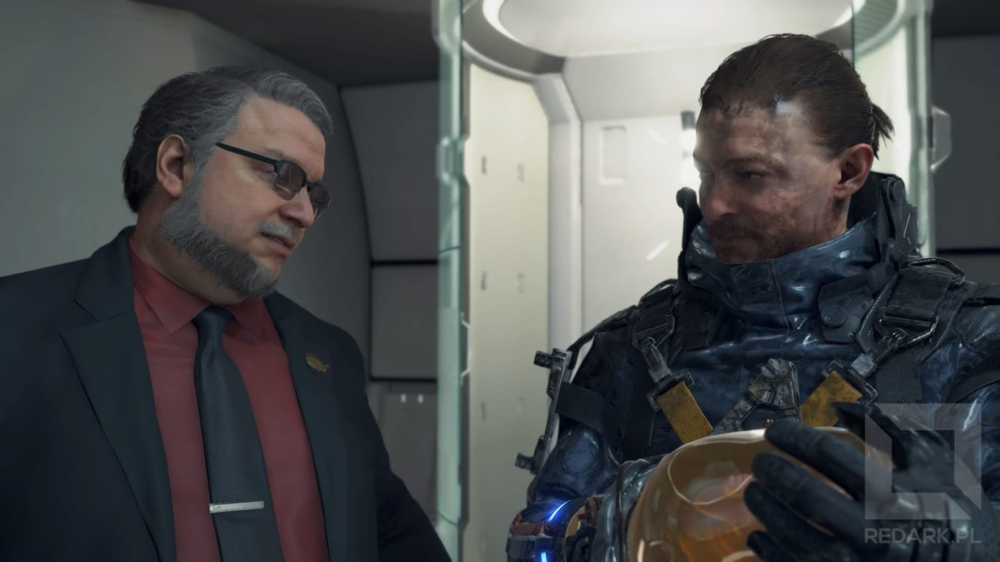
</Gallery>

Tutaj taka mała rada dla osób, które jeszcze nie ukończyły Death Stranding: na finał gry zarezerwujcie sobie dużo czasu, ponieważ u mnie ostatni przyzwoity moment na wyłączenie konsoli i moment pojawienia się ekranu głównego dzieliło 5-6 godzin ;)

Wracając do tematu, nie sposób zauważyć tutaj cięć budżetowych. Dialogi przekazywane są przez prawie nieruchome hologramy oraz dokumenty do czytania. W dodatku Sam podczas wysłuchiwania monologów naszych towarzyszy jedynie stoi i gapi się w punkt. Nawet nie odpowiada na ich pytania. Jego jedyną reakcją jest tutaj podniesienie ręki, gdy się z kimś żegna - normalnie poziom emocji, jak w pierwszej części Watch Doga. Taka narracja nie przystoi tak dużym grom jak Death Stranding. W dodatku często miałem wrażenie, jakby Sam kompletnie nie reagował na to, co spotkało go lub co zobaczył w poprzedniej misji. Przez większość czasu jest to tylko wysłuchiwanie rozkazów i nic więcej. Niejednokrotnie chciałem wręcz krzyknąć "zapytaj się go o to, co zobaczyłeś na tamtej stacji!". Nie zapytał...

<AdSense/>

### Walki z bossami

Tutaj również jestem nieco rozczarowany. Walki z bossami co prawda są widowiskowe, ale tak naprawdę cały czas polegają na tym samym, czyli na nawalaniu wszystkim, co się ma pod ręką. W innych grach nie miałbym z tym problemu, ale nie u Hideo. Mówimy przecież tutaj o człowieku, który wymyślał walki, które przeszły już do statusu legendy.

<WarningBlock>Następny akapit zawiera spoilery z pierwszej oraz trzeciej części gry Metal Gear Solid. Jeśli nie chcesz ich poznać, omiń proszę ten akapit.</WarningBlock>

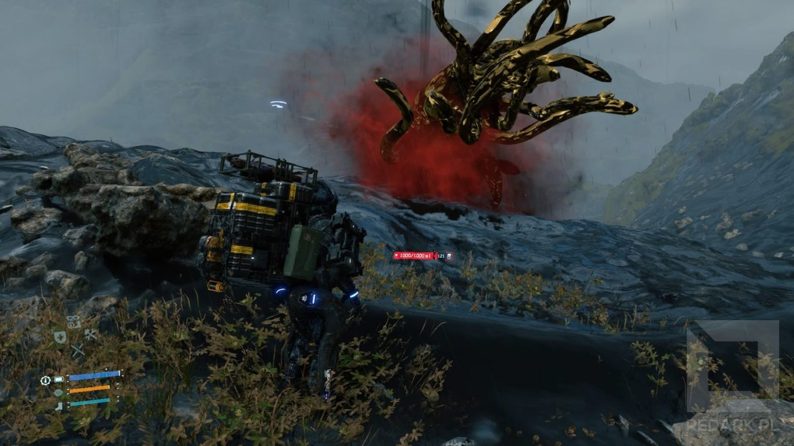

Garść przykładów z serii Metal Gear Solid: Pojedynek w dżungli ze snajperem "The End". Musieliśmy wytropić go wśród gąszczu roślinności przy użyciu wielu elementów ekwipunku lub po prostu wyłączyć konsolę i poczekać, aż starzec nas odnajdzie i pojmie, albo umrze ze starości. Drugi przykład to przeprawa przez rzekę z "The Sorrow". Trudność walki z tym przeciwnikiem zależała od tego, ilu żołnierzy zabiliśmy wcześniej w trakcie gry, a mimo to z tej walki nie mogliśmy wyjść żywo, co zmuszało nas do wywołania ekranu "game over". Oczywiście nie mogę nie wspomnieć postaci "Psycho Mantis-a", który komentował dane znalezione na dysku naszej konsoli lub udawał awarię telewizora. Jego pokonanie w dodatku wymagało fizycznego przepięcia kabli idących do PlayStation. Mówiąc krótko: tutaj takiej oryginalności trochę mi zabrakło.

### Główny wątek fabularny

Oceniając już sam wątek fabularny, jest super. Dostajemy tutaj świetnie wykreowaną postapokaliptyczną wizję świata. Przerywniki filmowe, które można analizować po kilka razy. Nastrojową muzykę uruchamianą automatycznie w trakcie misji, która towarzyszy nam w trakcie schodzenia z góry i podziwiania zapierających dech w piersiach krajobrazów. Na uwagę zasługuje też kwatera naszego bohatera. Jest ona przepełniona easter egg'ami oraz interaktywnymi elementami reagującymi na postęp fabuły.

<Gallery>

</Gallery>

Sądziłem, że znam sztuczki Hideo Kojimy, ale zwrot, jaki zaoferował graczom pod koniec rozgrywki to istny majstersztyk połączony z dużą dawką emocji. Więcej oczywiście nie zdradzę. Trudno mi o czymś więcej powiedzieć bez spoilerów, dlatego musicie przekonać się sami ;)

<InfoBlock>Jeden z autorów muzyki, Low Roar jest silnie związany z Polską i na początku gry będziemy mogli posłuchać utworu o tytule "Poznań", a w dalszej części gry "Gosia". Polecam przesłuchać cały album.</InfoBlock>

Po przejściu Death Stranding uważam jednak, że trailery tego tytułu zbyt dużo zdradziły. Nie chodzi mi tutaj o to, że materiały pokazują sceny, które poniekąd zdradzają zakończenie gry. Są one tak sprytnie zmontowane, że ciężko jest się tam czegokolwiek domyślić. Raczej chodzi mi na przykład o przedstawienie postaci Mamy oraz Heartman'a. Uważam, że gdybym nie znał ich specjalnych zdolności (a raczej przypadłości), to miałbym większe zaskoczenie podczas oglądania przerywników filmowych z ich udziałem, a tak to otrzymałem jedynie rozwinięcie, dopełnienie historii tych bohaterów. Może Hideo chciał tymi trailerami odpowiedzieć na falę krytyki pt. "bo ja nie wiem, o czym jest ta gra!" lub może po prostu chciał wypromować grę sławnymi nazwiskami, które zatrudnił do odgrywania wszystkich głównych ról. Nie wiem i raczej się tego nie dowiem.

<Gallery>

</Gallery>

Twórcy zastosowali też ciekawy zabieg, pokazując zawartość noszonych przez nas paczek. Dzięki temu widzimy, kiedy niesiemy niezbędny do życia prowiant lub leki, a kiedy zwykłe durnostojki takie jak figurki, zegarki lub mini flagi. Pokazuje to, dla jakich błahostek osoby zamieszkujące bunkry narażają życie kurierów. Nie sposób tutaj oczywiście nie wspomnieć o jednym mieszkańcu schronu, który jest wielkim smakoszem pizzy. Osoba ta wielokrotnie zleca nam dostawę tego włoskiego specjału z coraz to trudniejszych terenów mapy.

<Gallery>

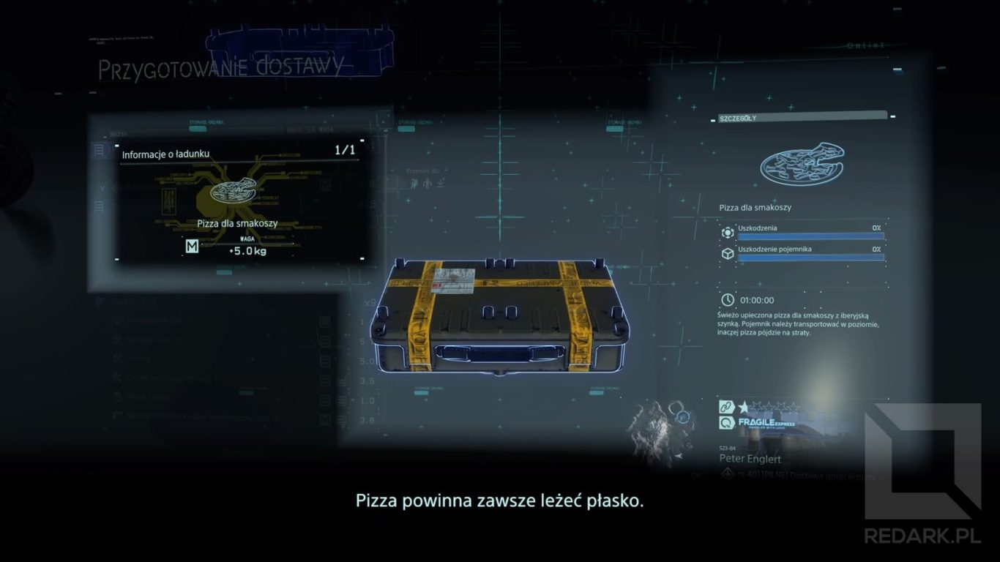
</Gallery>

W dodatku nie jest to zwykłe zadanie. Posiłek musi zostać dostarczony na czas (bo przecież zimna pizza jest niesmaczna), a jakby tego było mało, to musimy jeszcze zadbać o odpowiednie ułożenie pojemnika z jedzeniem. Ustawienie paczki w pionie sprawi, że pizza ulegnie zniszczeniu i nici z uczty :D Szczerze polecam wykonywanie tych misji, ponieważ są one nietypowe, stawiają wyzwania i w dodatku nagradzają gracza pod koniec. Jak? Tego nie zdradzę :)

### Drobne uwagi

Na sam koniec chciałbym podzielić się z Wami jeszcze paroma moimi spostrzeżeniami i uwagami, jakie przyszły mi do głowy po ukończeniu Death Stranding. Po pierwsze uważam, że granie na poziomie normalnym jest zbyt łatwe. Może jeśli przeraża Cię mnogość mechanik i przedmiotów to ten poziom będzie w sam raz, ale ja się lekko zanudziłem brakiem poważniejszych wyzwań. Chyba tylko raz przeciwnicy w otwartym świecie skutecznie odparli mój atak. Dopiero walki z bossami pod koniec gry stanowiły dla mnie wyzwanie.

<Gallery>

</Gallery>

Druga kwestia to elementy fabuły sprawiające wrażenie niedokończonych. Chodzi o niewyjaśnienie pewnej kwestii dotyczącej postaci Die-Hardman'a, choć mógł to być celowy zabieg twórców. Złudzeń nie pozostawia jednak pewna kwestia dialogowa, która pojawiła się w jednym z ostatnich przerywników filmowych (i trailerze). Jej obecność ewidentnie potwierdza, że z fabuły Death Stranding zostało coś wycięte, ale zapomniano poprawić nagranej już wypowiedzi. Jeśli wiesz, o jakiej kwestii teraz mówię, napisz do mnie w wiadomości prywatnej na jednym z social mediów, aby nie psuć innym zabawy. Jestem ciekaw, czy tylko ja zwróciłem na to uwagę :)

<AdSense/>

## Podsumowanie

Podsumowując, Death Stranding to gra niepozbawiona wad, ale niestandardowość jej rozgrywki, genialne budowanie nastroju, bogactwo ciekawych mechanik, dbałość o najmniejsze detale oraz perfekcyjne wyreżyserowane przerywniki filmowe z gwiazdorską obsadą sprawiają, że obok tego tytułu nie można przejść obojętnie. Oczywiście, zdaje sobie sprawę, że nie jest to tytuł dla każdego. Widać tutaj charakterystyczny japoński sposób prowadzenia dialogów oraz mechaniki żywcem zaczerpnięte z serii MGS, która również nie wszystkim może się podobać. Niemniej jednak dziękuję, że mogłem zagrać w tak nietypowe dzieło, jakim jest Death Stranding, a nie kolejną grę typu kopiuj-wklej nastawioną tylko i wyłącznie na zarobek, jakimi częstują nas ostatnio EA, Ubisoft oraz Bethesda.

Tradycyjnie zapraszam do sekcji komentarzy pod postem oraz w social mediach. Dajcie znać czy zachęciłem Was do przejścia tego tytułu lub jeśli macie już grę za sobą, to czy zgadzacie się z moimi uwagami do tej produkcji :)

Plusy:

<GoodList>
- Intrygująca fabuła z mocnymi zwrotami akcji
- Duża ilość zróżnicowanych mechanik - każda uzasadniona fabularnie
- Genialnie stworzony "symulator kuriera"
- Pomysłowy tryb multiplayer
- Wspaniała oprawa audiowizualna
- Zróżnicowana otwarta mapa
- Złożona fizyka chodzenia i zachowania pędu
</GoodList>

Minusy:

<BadList>
- Fatalny model jazdy
- Kłócące się ze sobą przypisania akcji do przycisków pada
- Słabe misje poboczne
- Duża część fabuły opowiadana jest tekstami oraz statycznymi hologramami
- Powolny start fabuły
- Denerwujące na dłuższą metę animacje
</BadList>
