Rok 2019 zbliża się już ku końcowi. Zatem przypomnijmy sobie najważniejsze wydarzenia ze świata gier i IT, jakie miały miejsce w ciągu ostatnich 12 miesięcy.

## Nowości od Google

### Google Assistant

Początek 2019 roku przyniósł Polakom długo oczekiwany prezent w postaci asystenta głosowego Google, który [przemówił po raz pierwszy w naszym ojczystym języku](/testowalem-google-assistant-po-polsku). Konferencja zapowiadająca nadejście do kraju nad Wisłą omawianej usługi została zaplanowana na **15 stycznia**. Niestety, ze względu na żałobę po śmierci prezydenta Gdańska, gigant postanowił odwołać pokaz. Mimo to następnego dnia asystent zawitał na naszych telefonach i do dnia dzisiejszego otrzymuje nowe funkcje. Kazano nam czekać na niego prawie 3 lata, ale chyba było warto. Jest to pierwszy asystent głosowy wspierający język polski. Co prawda, rok wcześniej LG wprowadziło do swoich telewizorów sterowanie głosowe po polsku, ale nie klasyfikuje go jako pełnoprawnego asystenta.

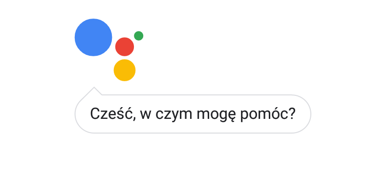

### Google Stadia

Drugą nowością od twórców Androida jest [usługa Google Stadia](/google-stadia-premiera). Została ona zaprezentowana podczas pokazów **19 marca**, a jej oficjalny start został przeprowadzony **19 listopada**. Stadia jest to kolejna próba zrewolucjonizowania cyfrowej dystrybucji gier komputerowych przy użyciu technologii strumieniowania wideo. Można powiedzieć, że jest to taki Twitch, za pomocą którego, zamiast oglądać, jak ktoś gra, sami możemy chwycić za kontroler. Największą zaletą tego rozwiązania jest możliwość uruchomienia wymagających tytułów na dowolnym urządzeniu podłączonym do Internetu. Wiedźmin na telefonie lub lodówce? Nie ma problemu!

Google mimo potężnej infrastruktury sieciowej nie miał łatwego orzecha do zgryzienia. Gry komputerowe wymagają szybkiej dwustronnej komunikacji, a każde opóźnienie rujnuje całe doświadczenie płynące z rozgrywki. To oraz szereg bardzo dziwnych decyzji giganta źle wpłynęły na pierwsze reakcje grających. Stadia oprócz (nawet jeśli drobnych) opóźnień w przesyle obrazu zaoferowała użytkownikom szereg niedziałających funkcji. Strona internetowa usługi wygląda jakby była w budowie i co chwilę odsyła do aplikacji mobilnej. Aplikacja mobilna z kolei nie pozwala nadal zagrać w posiadane gry, chyba że posiadamy smartfon z serii Google Pixel. Dedykowany kontroler? No jest, ale komunikacja bezprzewodowa nie działa, a menu usługi i tak wymusza użycie myszki i klawiatury. Wyjątek stanowi tutaj dedykowany Chromecast Ultra, który notabene potrzebny jest do odbierania treści 4K z HDR. Do pozostałych wad można zaliczyć wciąż ubogą bibliotekę gier, niedziałającego Google Assistant w kontrolerze, czy brak obiecanego "magicznego przycisku" w serwisie YouTube, który miał pozwalać na szybkie zagranie w oglądający przez nas tytuł.

Podsumowując: mało kto chciał rewolucji streamingowej w świecie gier, a Google nie zrobił nic, aby przekonać graczy do takiej koncepcji. Wydał jedynie usługę, której opcje albo nie działają, albo są jeszcze w budowie.

<AdSense/>

## Pogoń za elastycznymi ekranami

### Samsung Galaxy Fold

Do pogoni za bezramkowością oraz największą liczbą aparatów w smartfonach dołącza nowy trend - składane telefono-tablety wykorzystujące elastyczne ekrany OLED. Na pierwszy ogień poszedł Samsung Galaxy Fold. **22 lutego** koreański producent smartfonów zaprezentował swój najnowszy model wyposażony w dwa ekrany. Pierwszy o przekątnej 4.6" został umieszczony z frontu urządzenia, natomiast drugi o przekątnej 7.3", wewnątrz składanej konstrukcji. W kwestii wyglądu chyba nikt nie był zachwycony. Telefon nie dość, że posiada wygląd i wymiary cegły, to jeszcze nie składa się całkowicie na płasko. To w połączeniu ze śmiesznym mini wyświetlaczem na froncie, zgięciu widocznym na dużym ekranie i cenie dochodzącej prawie do 10 tysięcy złotych, jak się pewnie domyślacie, nie przysporzyło dużej popularności temu modelowi.

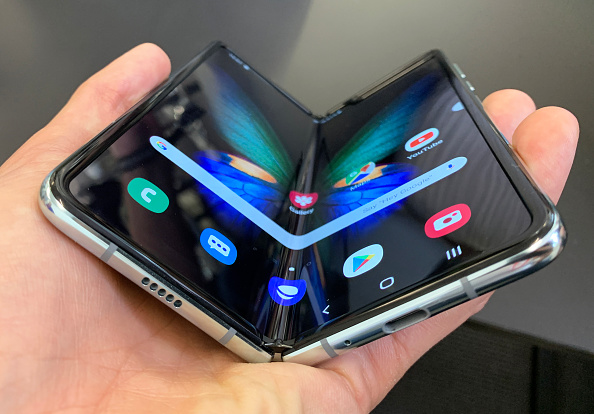

<ImageDescription>Samsung Galaxy Fold, źródło: pulzo.com</ImageDescription>

### Huawei Mate X

Dwa dni później, czyli **24 lutego** śladem Samsunga poszło Huawei oraz LG prezentując modele Huawei Mate X i LG V50 ThinQ. Pierwszy zawodnik posiada ekran o przekątnej 8" umieszczony po zewnętrznej stronie urządzenia, czyli zupełnie przeciwnie od patentu Samsunga. Urządzenie prezentowało się znacznie lepiej od Folda, a jednolity zewnętrzny ekran jest cały czas widoczny z obu stron, co pozwoliło uniknąć stosowania oddzielnych aparatów na front i tył urządzenia. Niestety ze względu na poważne problemy firmy Huawei (o których później) nadal nie doczekaliśmy się tego modelu na rynku konsumenckim.

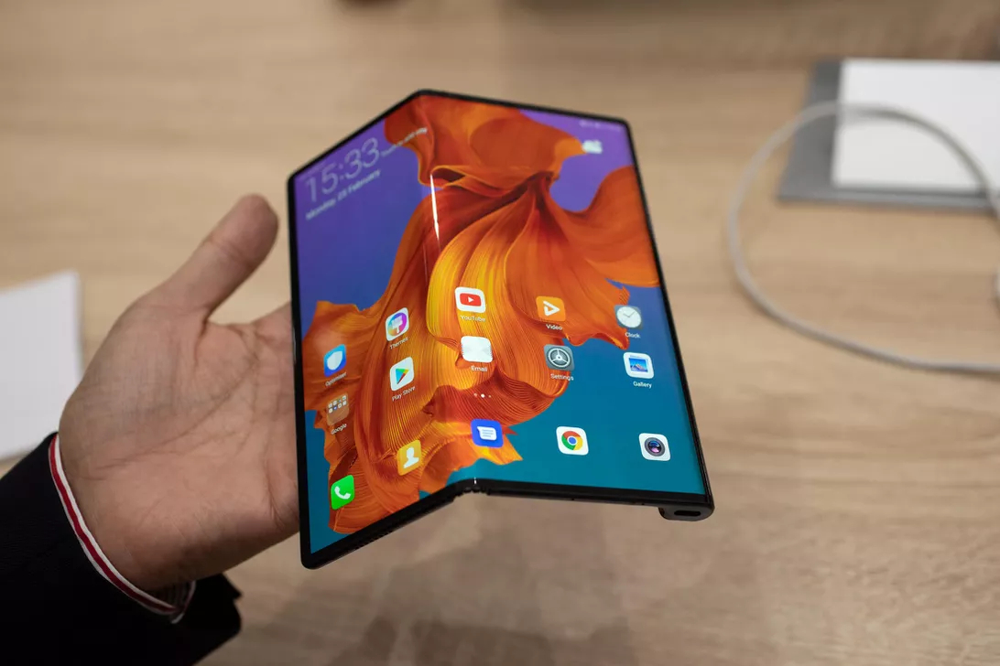

<ImageDescription>Huawei Mate X, źródło: cnet.com</ImageDescription>

### LG V50 ThinQ

Trzeci zawodnik do tematu składanych smartfonów podszedł jeszcze inaczej. Jak? Po prostu nie zastosował w nim ani ruchomego mechanizmu, ani elastycznego ekranu. LG V50 ThinQ jest bowiem zwykłym telefonem wyposażonym w specjalne etui z klapką, w którym ukryty jest dodatkowy ekran. Jest to trochę pójście na łatwiznę ze strony LG, ale muszę przyznać, że ta koncepcja dosyć nieźle się broni. Otrzymujemy tutaj standardowy telefon z opcjonalną możliwością "przeistoczenia" go w konstrukcję dwuekranową. Dodatkową przestrzeń roboczą możemy wykorzystać do obsługi drugiej aplikacji lub do wyświetlenia poziomej klawiatury ekranowej czy też kontrolera do gier. Proste i sensowne.

<ImageDescription>LG V50 ThinQ, źródło: ebay.com</ImageDescription>

### Motorola Razr

Gdy myślano, że w temacie składanych smartfonów to już koniec na ten rok, pojawiła się Motorola i przypomniała nam stare dobre czasy, w których wraz z Nokią produkowała telefony, które wytrzymywały ponad tydzień na baterii, a ich obudowy potrafiły posłużyć jako zastępstwo dla młotka do gwoździ. Amerykański producent **18 listopada** zaprezentował model Razr - hołd dla legendarnego telefonu z klapką o oznaczeniu Razr V3.

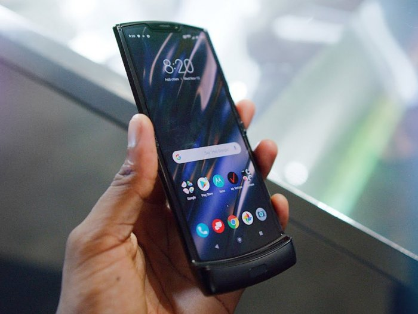

<ImageDescription>Motorola Razr, źródło: indozone.id</ImageDescription>

Motorola postanowiła zaprezentować mały składany smartfon, który dopiero po rozłożeniu oferował przekątną 6.2", czyli standard w dzisiejszych czasach. Obudowa smartfona idealnie odwzorowywała stary styl Motoroli Razr V3 oraz jej charakterystyczny wystający "podbródek". Telefon, choć przepiękny, nie podbił rynku mobilnych urządzeń. Użytkownicy mimo narzekań na rozmiary dzisiejszych urządzeń, zaakceptowali ten fakt i nie widzą sensu w kupowaniu drogiego smartfona, którego za każdym razem muszą rozłożyć. Pomysł na urządzenie genialne, ale nadal nie jest to to, co mogłoby zrewolucjonizować rynek smartfonów.

### Xiaomi Mi MIX Alpha

**24 września** ni stąd, ni zowąd Xiaomi prezentuje nowy telefon - Mi MIX Alpha. Dość nietypowy, ponieważ posiada on ekran otaczający prawie w całości obudowę urządzenia. Jedyną przerwą w powierzchni ekranu jest wąski pasek zawierający zestaw obiektywów aparatu. Czy ten telefon nie wygląda zjawiskowo?

<ImageDescription>Xiaomi Mi MIX Alpha</ImageDescription>

Co prawda w dzisiejszych czasach ciężko jest nam wyobrazić sobie korzystanie z takiego urządzenia, ale w przyszłości kto wie! Wiele osób zarzucało temu telefonowi kompletny brak funkcjonalności. Moim zdaniem Xiaomi kompletnie nie zależało na tym aspekcie. Chcieli jedynie pokazać swój futurystyczny pogląd na telefony przyszłości oraz pokazać, na co faktycznie stać elastyczne ekrany OLED. Zerknijcie na te efekty wizualne poniżej. Jak dla mnie jest to najciekawsze urządzenie 2019 roku.

<Gallery width='3'>

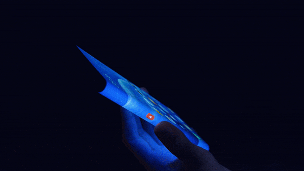
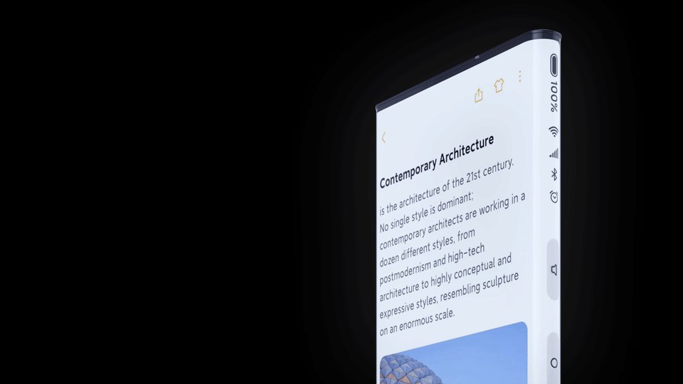
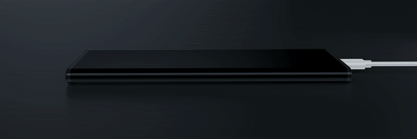

</Gallery>

Xiaomi Mi MIX Alpha w akcji

<AdSense/>

## USA vs Huawei

Tutaj dochodzimy do najgłośniejszej sprawy 2019 roku, której skutki z pewnością będziemy odczuwać jeszcze przez wiele lat. Mowa tutaj oczywiście o konflikcie, jaki urósł pomiędzy rządem USA a chińskim gigantem Huawei. Wszystko zaczęło się, gdy w **połowie maja** prezydent Donald Trump wpisał Huawei oraz towarzyszące mu firmy na czarną listę handlową Stanów Zjednoczonych. Oznacza to, że wszystkie amerykańskie przedsiębiorstwa muszą posiadać specjalne zezwolenie rządu USA na zawieranie umów współpracy z firmą Huawei. Rzekomym powodem wykonania takiego kroku przez prezydenta Trumpa są oskarżenia o szpiegostwo, jakie otrzymał jeden z dyrektorów tej korporacji.

### Huawei odcięty od świata

Kilka dni po przemówieniu Trumpa wiele amerykańskich firm zerwało współpracę z Huawei. Należeli do nich m.in. Microsoft, Intel, ARM Ltd., Qualcomm, Western Digital, a także Google. Okazało się, że w przeciągu kilku dni Huawei utracił całkowitą możliwość produkcji przyszłych modeli telefonów. Nie miał ani podzespołów, ani standardów łączności, ani systemu operacyjnego. Rząd USA pokazał, jak przy pomocy jednego podpisu, potrafi zrujnować dowolne przedsiębiorstwo.

W Internecie pojawiło się mnóstwo plotek. Pojawiły się nawet głosy, że w pewnym momencie telefony Huawei'a (nawet te już wyprodukowane) stracą dostęp do przeglądarki Google oraz sklepu z aplikacjami. Oczywiście tak czarne scenariusze się nie sprawdziły. Korporacja otrzymała 90 dni na wycofanie się z rynku USA, a Google miał jedynie nie udostępniać najnowszych wersji swojego systemu operacyjnego.

### Chiny w kontrataku

Huawei oczywiście natychmiast zareagował na zaistniałą sytuację. Aby uspokoić jakoś swoich klientów, gigant ogłosił, że od dawna przygotowywał się na taki scenariusz i od kilku lat pracuje nad swoim własnym systemem operacyjnym. Dodatkowo oskarżył rząd Stanów Zjednoczonych o łamanie prawa do wolnego rynku zapisanego w ich konstytucji, która przez Amerykanów jest uważana za świętość. Po stronie Chin zaczęły nawet stawać firmy, które parę dni wcześniej zerwały współpracę z Huawei. Ciekawe stanowisko ogłosiło Google, które w piśmie do prezydenta Trumpa stanowczo odradziło zablokowania Chinom dostępu do Androida. Oficjalnie z powodu troski o bezpieczeństwo mieszkańców tego kraju.

### Kto mieczem wojuje...

**30 czerwca** podczas sczytu G20 prezydent Donald Trump spotkał się z przywódcą Chin Xi Jinpingiem. Przedstawiciel Chin musiał być bardzo przekonywający, ponieważ prezydent USA zaraz po spotkaniu ogłosił, że postanowił wycofać się z blokady firmy Huawei. Ciekawe co takiego usłyszał od swojego rozmówcy. Czyżby dowiedział się, że jego drogocenne Apple, a także inne wielkie przedsiębiorstwa polegały na chińskich fabrykach? Raczej nigdy się tego nie dowiemy.

### Huawei woli dmuchać na zimne

Mimo ogłoszenia Trumpa ws. zawieszenia zakazu handlu Huawei nadal borykał się z problemami ze strony amerykańskiego rządu. USA nadal próbowało ograniczyć jego swobodę, ale już nie na tak ostry i głośny sposób. Gigant postanowił zabezpieczyć się przed powrotem problemów i ograniczyć do minimum zależność korporacji od USA. **9 sierpnia** podczas konferencji HDC 2019 Huawei zaprezentował "Harmony OS". Jest to ich autorski system operacyjny, który w przyszłości ma zapewnić niezależność firmy od Google. Ma on zasilać zarówno smartfony, jak i inne urządzenia producenta oraz oferować całkowicie osobny sklep z aplikacjami. Huawei postanowił jednak przystopować z chwaleniem się jego nowym systemem operacyjnym i do dzisiaj nie ujrzeliśmy jego działającej wersji.

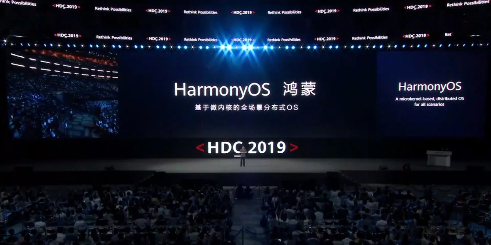

<ImageDescription>Konferencja firmy Huawei dotycząca ich nowego systemu operacyjnego - Harmony OS</ImageDescription>

### Rola Polski w konflikcie

Ciągłe przepychanki na kontrakty i blokady handlowe mocno podważyły autorytet prezydenta USA. Chiny pokazały, że nie dadzą sobie w kaszę (lub ryż ;) ) dmuchać i także potrafią pokazać swoją potęgę. Jak najlepiej umocnić swoją pozycję w walce z Chinami? Oczywiście znaleźć inne państwa, które poprze USA w tej śmiesznej walce. Na kogo padło? Niestety na Polskę. Tak oto **2 września** doszło do spotkania wiceprezydenta USA Mike'a Pence'a z premierem Mateuszem Morawieckim. Efektem tego spotkania było podpisanie umowy zobowiązującej Polskę do budowy swojej sieci 5G bez użycia technologi oferowanej przez Huawei'a i wybraniu "niezależnych politycznie dostawców infrastruktury". Podsumowując mamy odrzucić dostawcę, który od lat zasila nasz kraj i wybrać zależną politycznie firmę, która jest fajna według USA. Tylko co to za różnica, skoro i tak wszystko będzie produkowane w Chinach, a my wybieramy jedynie, który kraj będzie nas szpiegować bardziej, a który mniej?

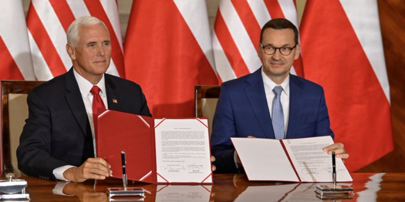

## Kącik cyfrowej rozrywki

Zostawmy już politykę i przejdźmy do ciekawszych tematów. Chciałbym tutaj wymienić oraz omówić niektóre tytuły gier, jakie wyszły na komputery oraz konsole w przeciągu 2019 roku.

### Apex Legends

Gdy świat myślał, że jest już pod dostatkiem gier typu battle royale i mamy ich po prostu dość, wchodzi Respawn Entertainment i zamiata scenę gamingu. Gra bez jakiejkolwiek promocji w przeciągu kilku godzin zajmuje pierwsze miejsce w serwsie Twitch z wynikiem plasującym się w okolicach 500 tysięcy widzów. Zaledwie 8 godzin po premierze, która odbyła się **4 lutego**, dyrektor generalny studia poinformował, że w grze Apex zalogowało się już milion unikalnych użytkowników! Później, jak pewnie wiecie, entuzjazm opadł. Studio nie było przygotowane na tak dużą popularność i nie było w stanie dostarczyć szybko nowej zawartości do gry, a tym samym utrzymać przy niej graczy. Jednak obecnie sytuacja Apex'a się ustabilizowała i zajął on pewne miejsce na scenie gamingu.

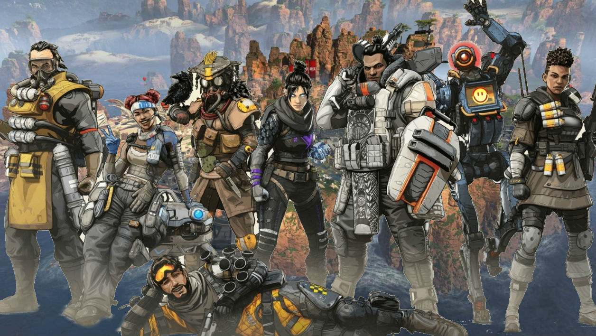

<ImageDescription>Apex Legends</ImageDescription>

### Metro Exodus

Jest to kontynuacja popularnej serii gier wydana **15 lutego**, która spotkała się z [ogromną falą krytyki ze strony graczy](/bojkot-metro-exodus-uzaleznienie-od-steam). Dlaczego? Ponieważ na komputerach osobistych można ją było zdobyć tylko i wyłącznie za pośrednictwem Epic Games Store. Była to pierwsza duża gra, która postanowiła odwrócić się od Steam'a i to chwilę przed swoją premierą. Rozwścieczeni gracze, którzy i tak już nienawidzili Epic Games Store ze względu na popularność Fortnite'a zbombardowali tytuł tysiącami negatywnych recenzji. Po zaistniałej sytuacji wiele serwisów growych oraz platform cyfrowej dystrybucji (w tym Steam) postanowiło zabezpieczyć swoje systemy recenzji przed takimi zachowaniami.

<ImageDescription>Metro Exodus</ImageDescription>

### Pokaz Cyberpunk'a 2077 na konferencji E3

Tego tytułu nie trzeba nikomu przedstawiać. Sukces całej serii Wiedźmin zapewnił polskiemu studiu CD Project Red ogromną popularność. Dlatego też studio postanowiło dobrze wypromować swoje najnowsze dziecko - Cyberpunk'a. **8 czerwca** podczas konferencji Microsoftu został pokazany najnowszy trailer gry zakończony sceną z postacią Silverhanda. Jednakże największą niespodzianką pokazu okazała się obecność aktora odgrywającego ww. bohatera, czyli Keanu Reeves'a znanego m.in. z Matrix'a, czy też John'a Wick'a. W następstwie wydarzenia Internet zalała fala memów z (popularnymi już) tekstami "We've got a city to burn" lub "You're breathtaking!". Akcje studia poszybowały w górę, a my gracze niecierpliwie czekamy na premierę tego tytułu, która ma się odbyć 16 kwietnia 2020 roku.

<ImageDescription>Keanu Reeves na konferencji Microsoft E3 2019</ImageDescription>

### Borderlands 3

Trzecia część serii Borderlands - gier z gantunku loot-shoter'ów nastawionych na zabawne opowiadanie historii. Co w niej takiego niezwykłego? To, że uzyskała ona półroczną ekskluzywność na Epic Games Store, a "cudowna" społeczność PC-towych graczy ponownie pokazała, do czego jest zdolna. Zaraz po premierze tytułu **13 września** poprzednie części serii znajdujące się w sklepie Steam'a zostały zbombardowane negatywnymi ocenami. Oczywiście recenzje nie dotyczyły tych tytułów, a były jedynie wulgarnymi opiniami na temat twórców Fortnite'a. Tutaj po raz pierwszy wszedł do akcji nowy system zabezpieczeń Valve, który po ataku graczy na grę Metro Exodus został dodany do platformy Steam. System wyłapał wszystkie fałszywe opinie, oflagował jako "bezpodstawny atak" i wykluczył z obliczania statystyk.

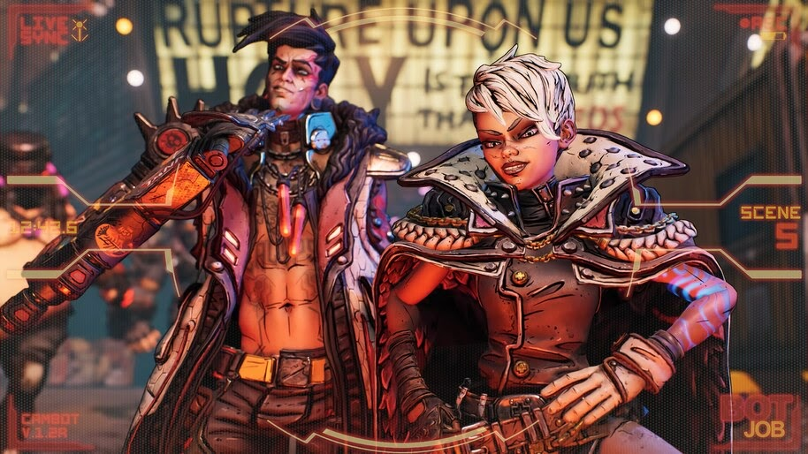

<ImageDescription>Borderlands 3</ImageDescription>

### Fortnite "The End"

**13 października** o godzinie 20:00 polskiego czasu rozpoczął się kolejny sieciowy event w grze Fortnite zatytułowany "The End". Miał on na celu zakończenie dziesiątego sezonu i rozpoczęcie kolejnego - tak się jednak nie stało. Wkrótce po wystrzeleniu rakiety znajdującej się na mapie gry, na ekranie pojawiła się czarna dziura, która pochłonęła wszystko, co znajdowało się na ekranie graczy obserwatorów. Gra wyświetliła czarny ekran z lekko połyskującą czarną dziurą, sklep Epic Games Store został wyłączony, a wszystkie media społecznościowe dotyczące Fortnite'a zostały wyczyszczone do zera. Sam Epic ograniczał swoje komunikaty do minimum. Jedyne co gracze usłyszeli, to to, że nie stracą oni wirtualnej waluty, którą posiadali na swoich kontach.

<ImageDescription>Połyskująca czarna dziura - tylko tyle pozostało po Fortnite</ImageDescription>

Oglądalność eventu na platformie Twitch oraz YouTube dobijała do prawie 6 milionów. Wszyscy gracze zostali pozbawieni możliwości uruchomienia gry i przez około 40 godzin mogli jedynie podziwiać czarną dziurę widoczną na transmisji na żywo (co też robili). Po tym czasie Epic wypuścił ogromną aktualizację do gry, która szczyciła się nazwą "Fortnite: Chapter 2". Gracze otrzymali całkowicie nową mapę oraz zmienioną oprawę graficzną.

<AdSense/>

O Fortnite można mówić o wiele złych rzeczy, ale jedno trzeba tej grze przyznać. Przez ponad 2 lata utrzymywała się i nadal utrzymuje w czołówce gier multiplayer i pokazała, jak kreatywnie można promować gry. Mówię tutaj o tych wszystkich sieciowych eventach oraz o wirtualnym koncercie Marshmello, który odbył się **na początku lutego** tego roku i zgromadził podobno ponad 10-milionową widownię. Niektórzy nie uważają tego za sukces i nadal będą zażarcie bronić Newell'a oraz uważać jego platformę oraz gry za świętość. Ja natomiast potrafię docenić wkład Epic'a do branży growej, nawet jeśli nigdy nie grałem w Fortnite'a.

### Death Stranding

Po ponad 4 latach oczekiwania **8 listopada** do sklepów trafiła gra Death Stranding. Jest to pierwsza gra stworzona przez Hideo Kojime, po tym jak (przymusowo) opuścił on firmę Konami. Gra jest niesztampowa i choć często zostaje nazywana "symulatorem kuriera" to została ciepło przyjęta przez wielu recenzentów jako "świeże doświadczenie". Pełną [recenzję gry](/bezspoilerowa-recenzja-gry-death-stranding) oraz [unboxing edycji kolekcjonerskiej](/bombelkowy-unboxing-edycji-kolekcjonerskiej-gry-death-stranding) można znaleźć na portalu REDARK.

<ImageDescription>Mads Mikkelsen w roli Cliff'a w grze Death Stranding</ImageDescription>

### STAR WARS Jedi: Fallen Order

Gra osadzona w uniwersum Gwiezdnych Wojen opublikowana **15 listopada** i stworzona przez Respawn Entertainment - twórców Apex Legends. Gra, choć z niskim budżetem (widać to po modelach postaci i lekkim recyklingu map świata) zdobyła uznanie wśród graczy. Należy zwrócić szczególną uwagę, że wydawcą tego tytułu jest EA, czyli firma preferująca gry sieciowe skoncentrowane na zarabianiu pieniędzy. Chyba każdy pamięta aferę dotyczącą mikrotransakcji zawartych w grze Star Wars Battlefront II, przez którą powstało wiele komisji zajmujących się nadzorowaniem producentów gier zarabiających na stosowaniu sztuczek hazardowych. Stąd też naprawdę miłą odmianą jest gra singleplayer koncentrująca się na opowiadaniu historii.

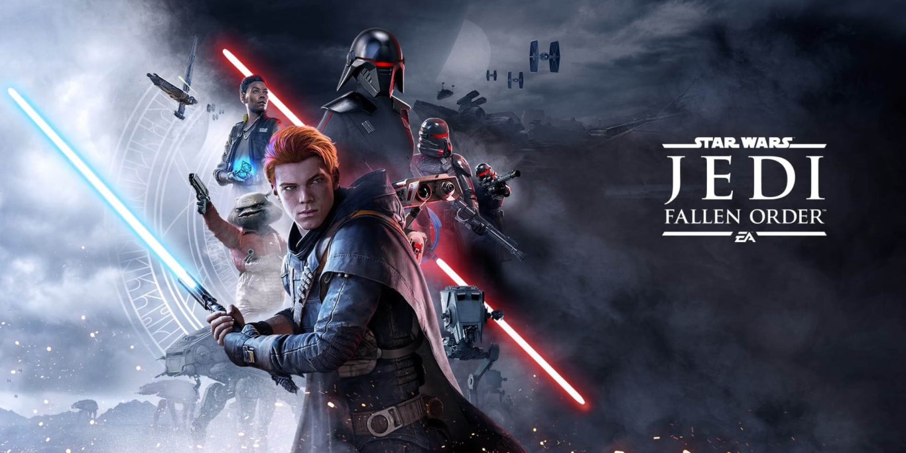

<ImageDescription>Star Wars Jedi Fallen Order - nareszcie jakiś singleplayer od EA</ImageDescription>

### Pozostałe tytuły

Oczywiście wymienione powyżej tytuły to nie jedyne gry, jakie wyszły w 2019 roku. Na wyróżnienie zasługują także:

- **8 lutego:** Devil May Cry 5 - kolejna odsłona popularnej serii slasher'ów od studia Capcom,
- **22 marca:** Sekiro: Shadows Die Twice - nowy soulslike od FromSoftware,
- **23 kwietnia:** Mortal Kombat 11 - jedenasta już część serii bijatyk od NetherRealm Studios,
- **26 kwietnia:** Days Gone - survivalowa gra akcji z otwartym światem od Bend Studio, które stworzyło m.in. poboczną część gry Uncharted wydaną na konsolę PS Vita,
- **14 maja:** Rage 2 - druga część postapokaliptycznej strzelanki od Avalanche Studios,
- **19 lipca:** Gears 5 - kolejna część popularnych trzecioosobowych strzelanek od studia The Coalition / Black Tusk Studios przeznaczona na platformy Microsoftu,
- **23 sierpnia**: Call of Duty: Modern Warfare - szesnasta odsłona cyklu strzelanek o wspólnym tytule Call of Duty,
- **27 sierpnia:** Control - trzecioosobowa strzelanka z elementami science fiction od studia Remedy Entertainment,
- **27 sierpnia:** Ancestors: The Humankind Odyssey - gra survivalowa opowiadająca o rewolucji gatunku homo sapiens od studia Panache Digital Games,
- **25 października:** The Outer Worlds - ciepło przyjęta gra RPG od studia Obsidian Entertainment nazywana często "niezepsutym Fallout'em".

## A co w 2020?

Przyszły rok przyniesie nam jeszcze więcej dużych tytułów. Czekamy m.in. na Ghost of Tsushima od Sucker Punch, remake 3. części Resident Evil od Capcom'a, moje ukochane The Last Of Us: Part II od Naughty Dog, Half-Life: Alyx na gogle VR, wspomniany wcześniej Cyberpunk 2077 od polskiego studia CD Projekt RED, a także Dying Light 2 również od rodzimego studia Techland.

Oprócz wymienionych tytułów będziemy również czekać na premierę nowej generacji konsol, które mają pojawić się w sklepach pod koniec 2020 roku. Jak na razie rąbka tajemnicy uchylił jedynie Microsoft, który na gali The Game Awards 2019 zaprezentował wygląd oraz nazwę nowej konsoli.

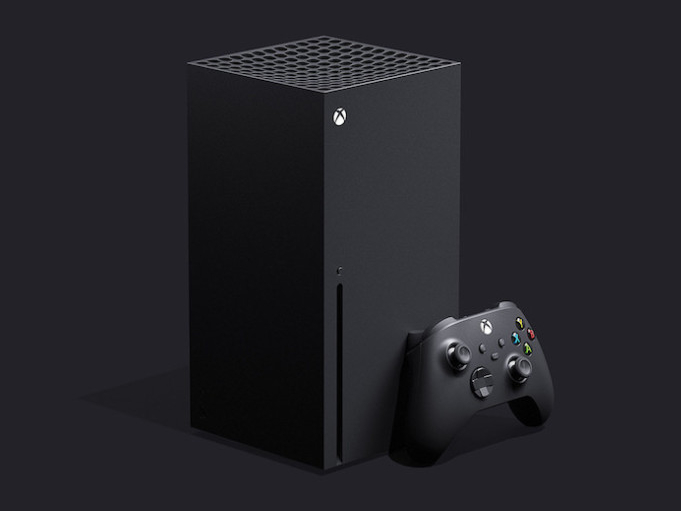

<ImageDescription>Microsoft Xbox Series X - komputer, pustak, śmietnik z popielniczką i lodówka w jednym</ImageDescription>

Co do wyglądu nowego Xboxa to uważam, że może się zarówno podobać, jak i nie. Na pewno jest nietypowy i ani trochę nie przypomina konsol poprzednich generacji. Bardziej śmieszy mnie nazwa: "Xbox Series X". Cudowna. Microsoft po raz kolejny pokazuje, że posiada maszynę losującą nazwy swoich produktów. Jeszcze ciekawsza jest wypowiedź rzecznika prasowego, który postanowił wyjaśnić zaistniałą sytuację. Oznajmił, że "Series X" to jedynie nazwa przedstawionego modelu, a nowa konsola nazywa się po prostu Xbox. Reasumując, najnowsza konsola nazywa się tak samo jak jej pierwsza odsłona, a nazwa modelu brzmi łudząco podobnie do poprzedniej generacji. Phil, ty to masz łeb!

Tak czy siak, rok 2020 zapowiada się bardzo interesująco i nie pozostaje nam nic innego, jak czekać na premierę wymienionych wyżej nowości.
