Smartfony firmy Xiaomi od wielu lat uznawane są za najlepsze w stosunku ceny do możliwości urządzenia. Nie inaczej jest z modelem Mi 9, który na początku 2019 roku podbił rynek urządzeń mobilnych. Przez miniony rok producent uraczył nas wieloma różnymi odmianami tego urządzenia. Mowa tutaj o modelach Mi 9T, Mi 9T Pro, Mi 9 Lite oraz Mi 9 SE, którego mam przyjemność dla Was dzisiaj zrecenzować. Odpowiedzmy na pytanie: czy Xiaomi znowu lepsze?

Wersja SE jest to okrojona odsłona pełnoprawnego flagowca, nazywana czasami "small edition", ponieważ jest najmniejszym przedstawicielem tej serii. Producent, wypuszczając tyle modeli, chciał zapewnić klientowi szeroki wybór różnych konfiguracji telefonu, ale tylko utrudnił podjęcie decyzji. Modele posiadają wiele drobnych różnic, często niewidocznych na pierwszy rzut oka. Stąd też, w czasie tej recenzji często będę się odwoływał do specyfikacji dwóch najbliższych urządzeń: pełnoprawnego Mi 9 oraz okrojonej wersji Mi 9 Lite.

## Unboxing

Urządzenie przychodzi do nas w dość ciężkim białym pudełku. Po jego otworzeniu, naszym oczom ukazuje się tekturowa koperta zawierająca dokumentację oraz drobne akcesoria telefonu. Są nimi półprzeźroczyste etui, przejściówka USB-C na jack 3.5 mm oraz klucz do otwierania tacki na karty SIM.

<Gallery width='3'>
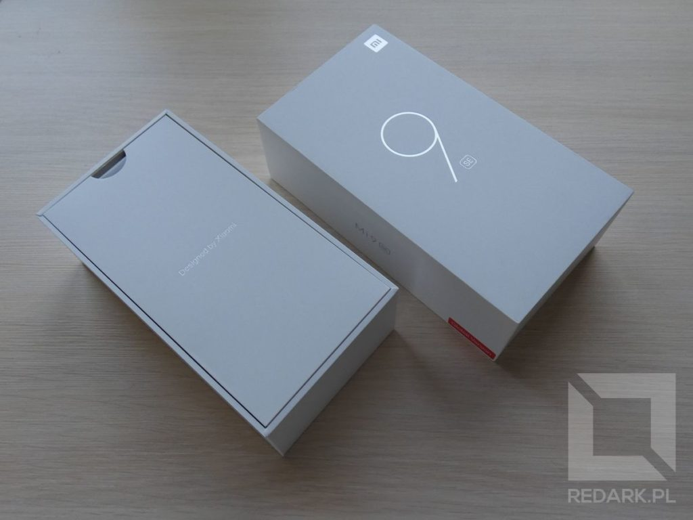
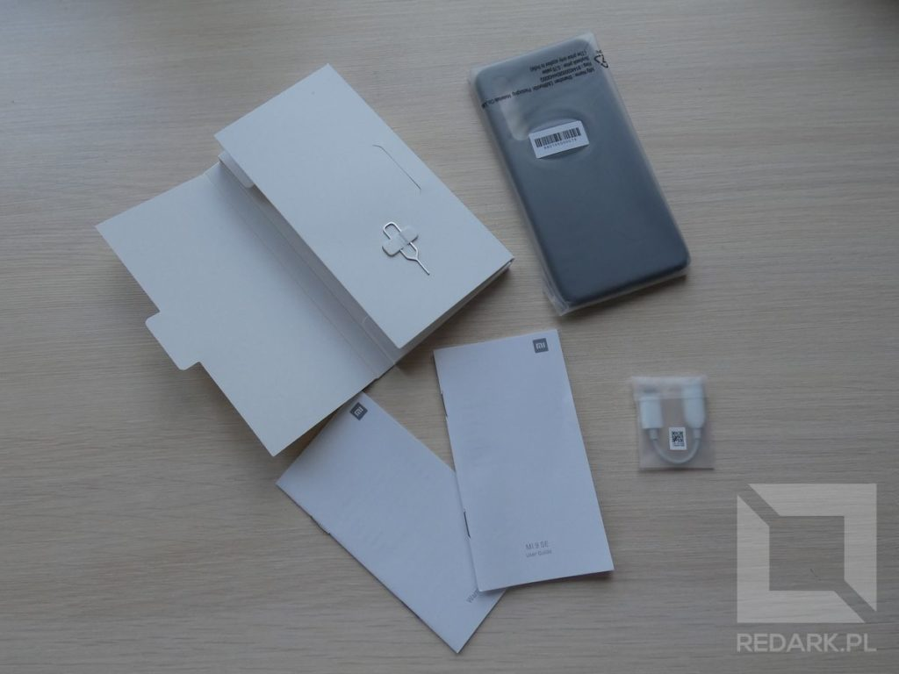
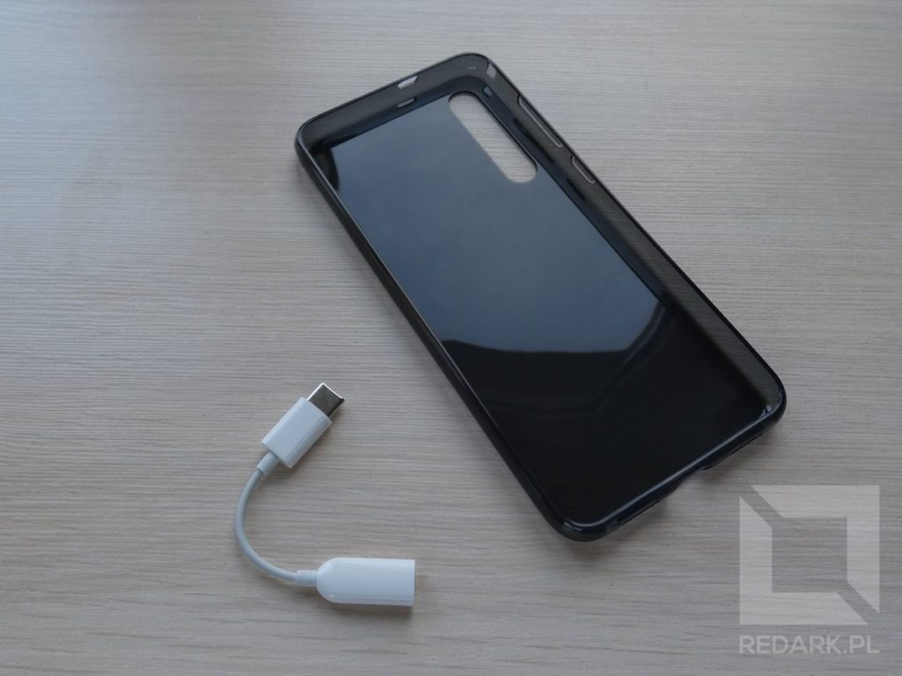
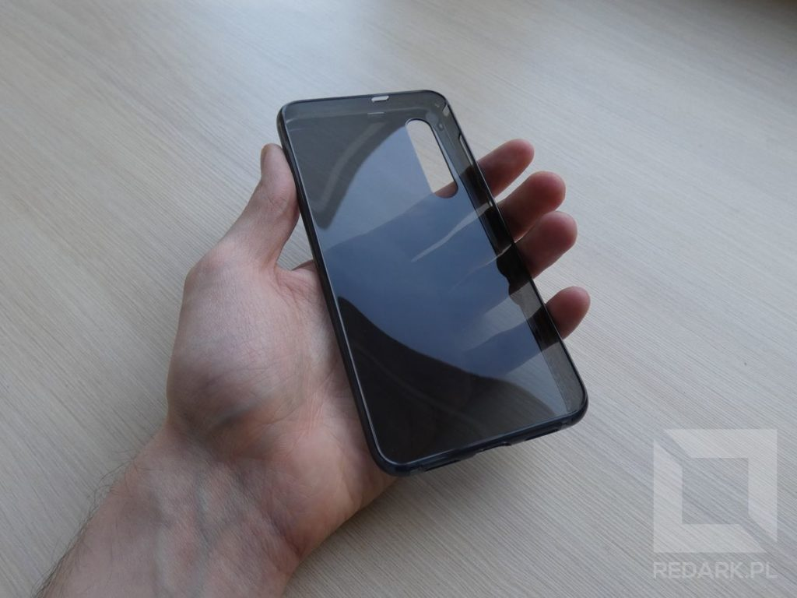
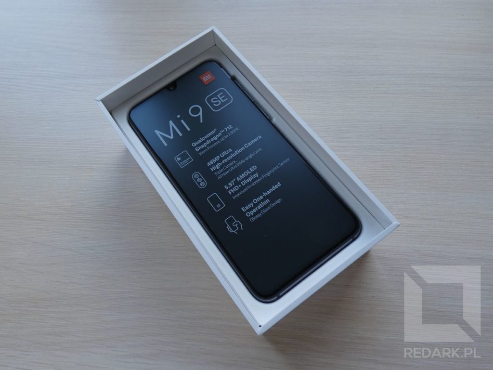

</Gallery>

Poniżej koperty znajdziemy obklejony foliami ochronnymi telefon, a jeszcze niżej ładowarkę sieciową wraz z kablem USB-C. Całość prezentuje się elegancko i schludnie.

## Wykonanie telefonu

Urządzenie zostało wykonane z dwóch tafli szkła Gorilla Glass 5 połączonych ramką wykonaną z aluminium. Szkło znajdujące się z tyłu smartfona prezentuje lekko połyskujący ciemnoszary kolor oznaczany przez Xiaomi jako "piano black". Telefon wygląda przez to zjawiskowo i od razu mi się spodobał, choć ogólny efekt psują trochę duże znaczki wymuszane przez prawo Unii Europejskiej.

<Gallery>
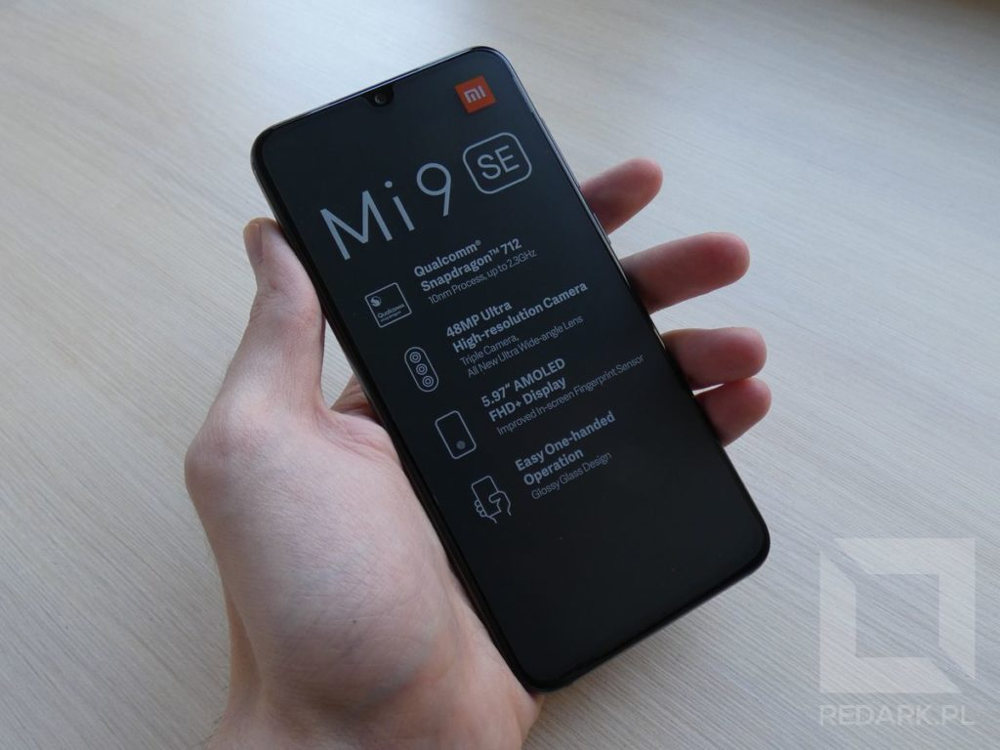
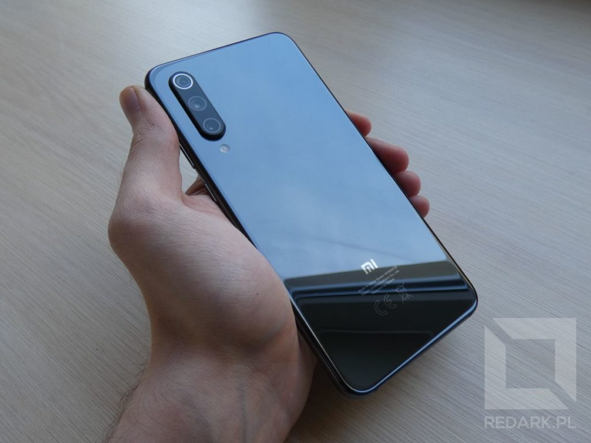
</Gallery>

Jedną z pierwszych rzeczy, jakie zrobiłem po wyjęciu telefonu z opakowania, to przymierzenie półprzeźroczystego etui dołączonego do urządzenia, aby sprawdzić, czy zakrywa ono wystający (niestety) moduł aparatów. Obudowa perfekcyjnie pasuje do wszystkich otworów znajdujących się na krawędziach urządzenia, nie schodzi przypadkowo z urządzenia oraz PRAWIE całkowicie zakrywa aparaty. Cieszę się, że Xiaomi dorzuciło tego typu gadżet do swojego urządzenia, ponieważ gdyby nie dołączone etui, to z pewnością szukałbym na własną rękę takiego, które pozwoliłoby mi zniwelować wystające aparaty. Dodam jeszcze, że etui rozwiązuje problem brudzenia się oraz śliskości szklanych plecków urządzenia. Osobiście nie rozumiem mody na dawanie śliskiego i namiętnie zbierającego odciski szkła na tył smartfonów. Efekt może robi fajny, ale jest kompletnie niepraktyczne.

<AdSense/>

<Gallery>
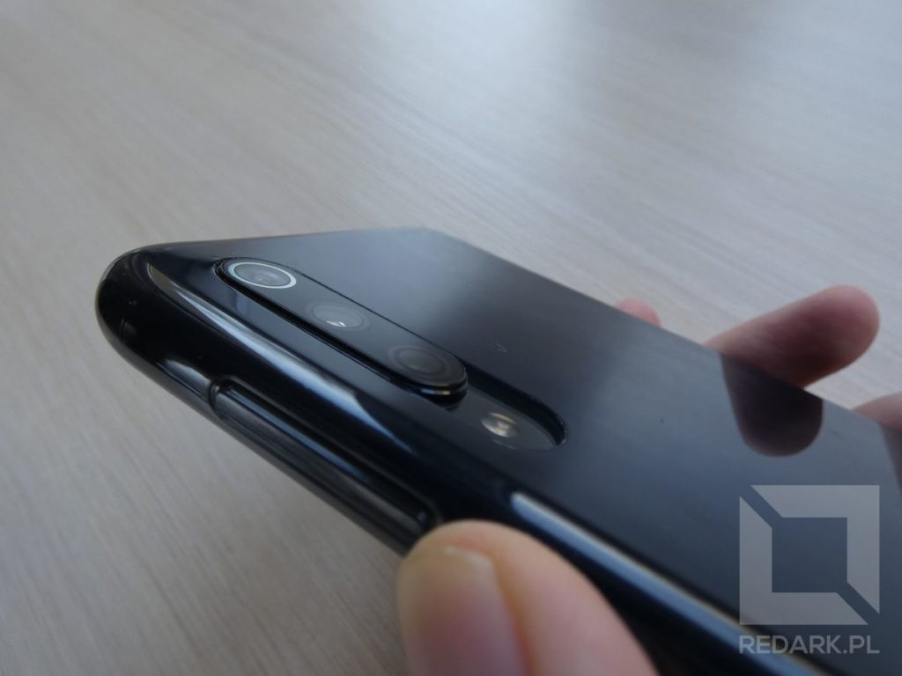
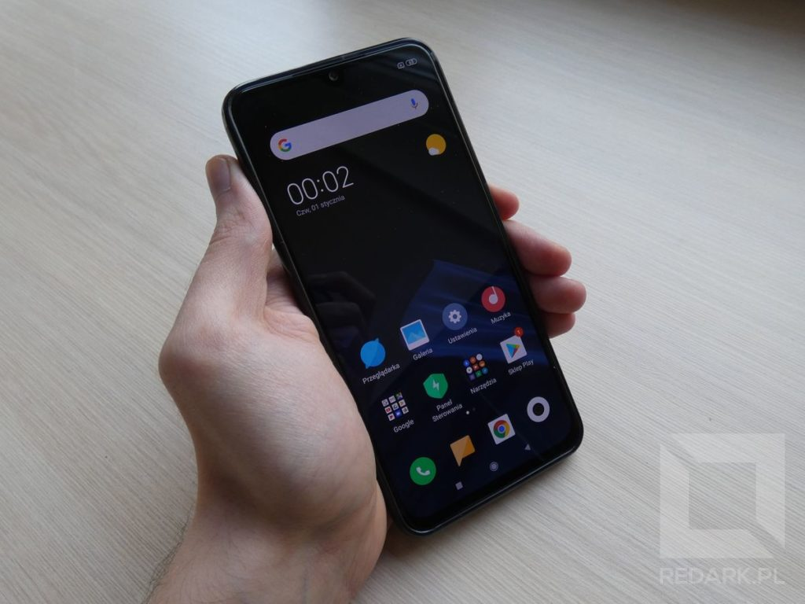
</Gallery>

Zagospodarowanie krawędzi telefonu prezentuje się następująco: Górna krawędź to otwór na diodę podczerwieni oraz mikrofon do redukcji szumów. Dolna to port USB-C oraz dwie maskownice. Jedna z głośnikiem mono, a druga z mikrofonem do rozmów telefonicznych. Lewa krawędź skrywa szufladkę na karty SIM, a prawa trzy standardowe fizyczne przyciski: zasilanie oraz regulację głośności. Ich umiejscowienie jest idealne, a skok lekki, ale dobrze wyczuwalny. Zabrakło tutaj dedykowanego programowalnego przycisku Google Assistant znanego z pełnoprawnego Mi 9.

## Wyświetlacz

Front urządzenia zajmuje 5.97-calowy wyświetlacz o rozdzielczości FullHD wykonany przez Samsunga w technologii AMOLED. Ramki są niewielkie, a dolna belka jak zwykle lekko powiększona. Co do wyświetlanego obrazu to, co tu dużo mówić. Jak przystało na Samsunga, zagęszczenie pixeli jest bardzo dobre, kolory żywe i cieszą oczy, a czerń, jak przystało na AMOLEDa, jest idealnie czarna. Oferowany przez urządzenie zakres intensywności podświetlenia również jest bardzo dobry i pozwala na komfortowe korzystanie z urządzenia zarówno w słoneczny dzień, jak i w nocy.

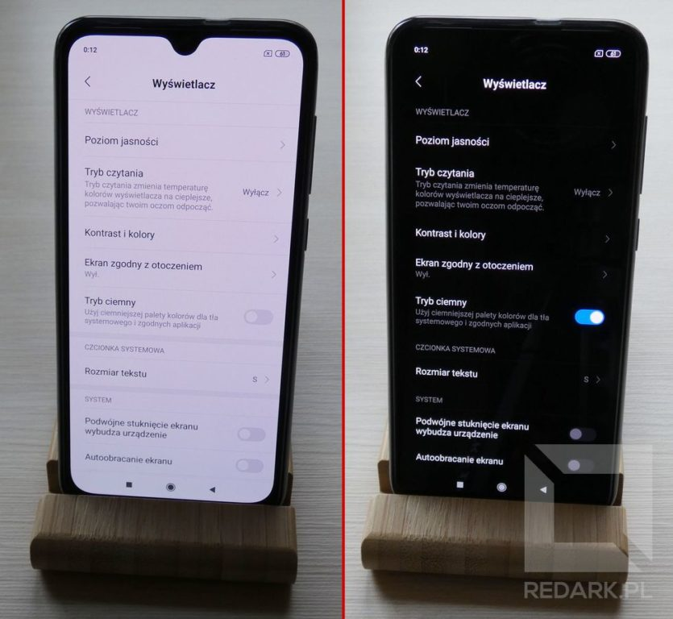

<ImageDescription>Globalny dark mode w MIUI i życie staje się lepsze...</ImageDescription>

W kwestii obsługi urządzenia, to zmniejszona (względem Mi 9 i Mi 9 Lite) przekątna ekranu oraz proporcje 19,5:9 sprawiają, że telefon idealnie leży w dłoni i może być bezproblemowo użytkowany bez angażowania drugiej ręki. To bardzo duży plus, ponieważ w dzisiejszych czasach to rzadkość.

U góry urządzenia znajduje się "kroplowaty" notch skrywający kamerkę do zdjęć selfie. W przeciwieństwie do Mi 9 nie znajdziemy tam diody powiadomień. Duża szkoda. Rozumiem, że Xiaomi musiało pozbawić model SE kilku bajerów, ale nie rozumiem, dlaczego oberwało się też malutkiej, bardzo przydatnej diodzie LED. Co ciekawe model Mi 9 Lite takową diodę posiada, ale ukrytą na pleckach urządzenia, co jest średnio przydatne.

<Gallery>
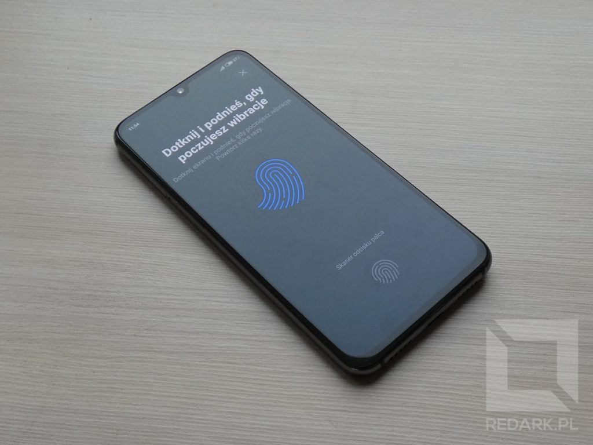
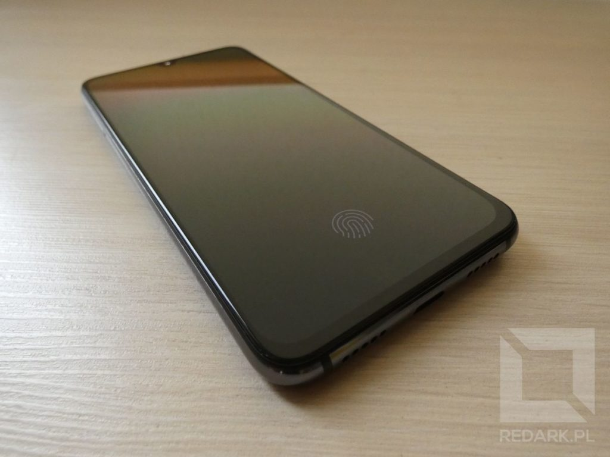
</Gallery>

Ekran urządzenia skrywa pod sobą optyczny czytnik linii papilarnych. Precyzja sensora jest na dobrym poziomie i nie miałem większych problemów z odblokowaniem urządzenia. Miło, że Xiaomi tutaj nie przyoszczędziło. Na początku musiałem co prawda przyzwyczaić się do tego rozwiązania i znaleźć odpowiedni sposób układania palca na ekranie, ale ostatecznie uważam ten sposób odblokowywania telefonu za super wygodny. Pozycja czytnika jest dodatkowo wyróżniana za pomocą bardzo fajnej animacji uruchamianej po wzięciu telefonu do ręki lub dotknięciu ekranu, więc nie ma możliwości, aby nie trafić precyzyjnie w czytnik.

<Gallery width='2'>
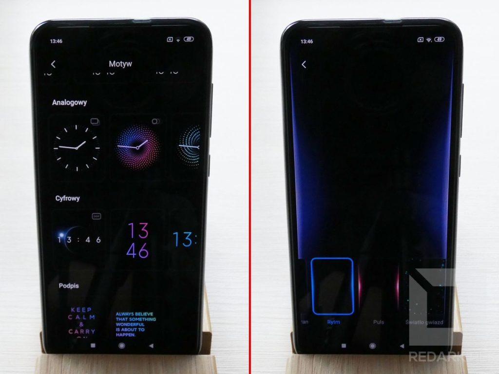
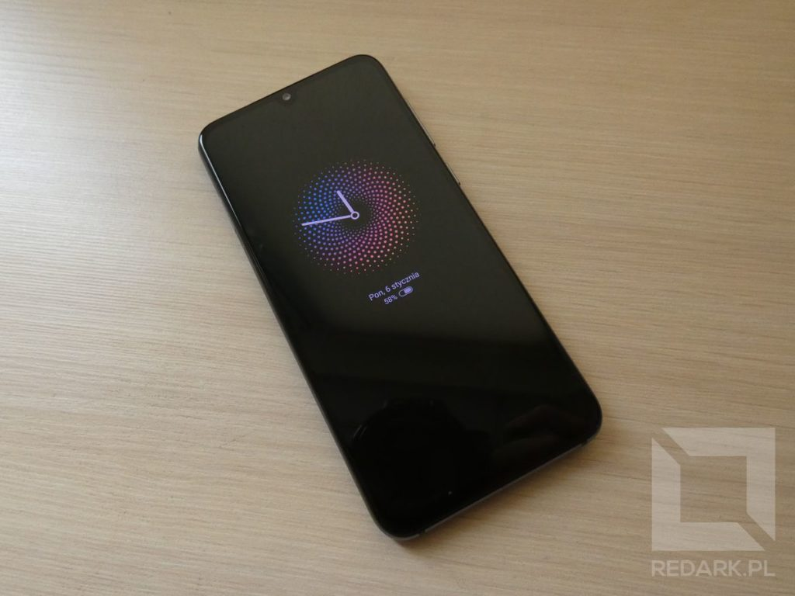
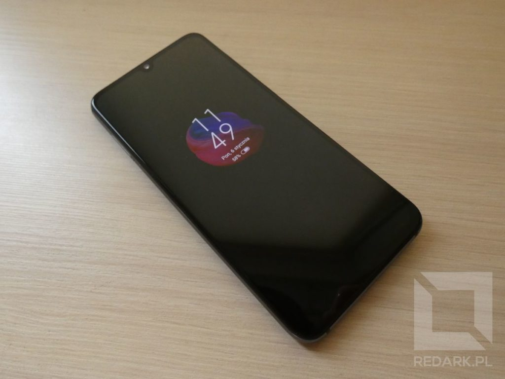
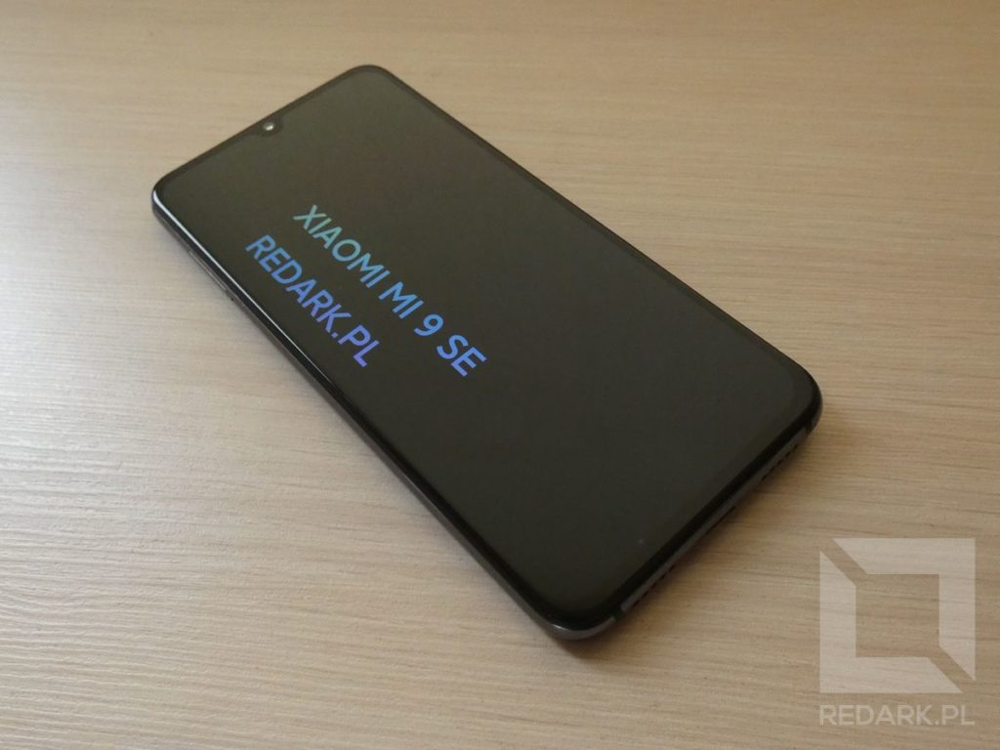
</Gallery>

Dzięki ekranowi AMOLED mamy też do dyspozycji technologię Always on Display, która umożliwia wyświetlanie godziny oraz powiadomień na wygaszonym ekranie. W ustawieniach telefonu możemy wybrać jakie parametry mają zostać wyświetlanie na ekranie, czy chcemy zegar analogowy, cyfrowy, a może wolimy ustawić jakiś własny tekst informacyjny.

<AdSense/>

## Wydajność

Sercem urządzenia jest tu procesor Snapdragon 712 (tutaj niestety duża różnica względem Mi 9, który posiada model 855) wykonany w technologii 10nm. Posiada on 8 rdzeni, z czego dwa osiągają taktowanie na poziomie 2,3 GHz. Producent dorzuca do tego 6 GB pamięci operacyjnej oraz w zależności od zakupionej wersji 64 lub 128 GB pamięci na dane użytkownika. W tym miejscu należy zaznaczyć, że urządzenie nie posiada slotu na karty microSD, a w szufladka znajdująca się na lewej krawędzi telefonu skrywa jedynie dwa miejsca na karty nanoSIM.

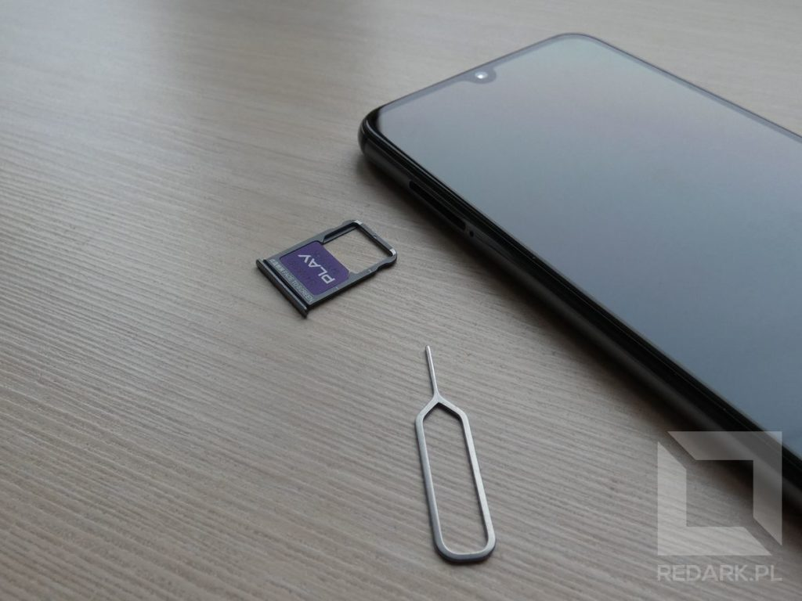

<ImageDescription>Mi 9 SE nie oferuje nawet hybrydowej tacki na karty microSD</ImageDescription>

Smartfon pracuje pod kontrolą Androida 9 Pie z nakładką systemową MIUI w wersji 11, choć telefon ma otrzymać za niedługo aktualizację do najnowszego Androida Q. Do czasu pisania tej recenzji nie zauważyłem żadnych problemów z płynnym działaniem smartfona. Telefon nie miał też problemów z bezpodstawnym ubijaniem procesów w tle - każda otwarta aplikacja była cały czas gotowa do pracy.

## Funkcje nakładki MIUI

To, co skłoniło mnie do zakupu smartfona tej marki to jego autorska nakładka MIUI, która dostarcza użytkownikowi szereg praktycznych udogodnień. Nie chcę Was tutaj nudzić opisywaniem tych wszystkich funkcji, dlatego wymienię pokrótce te, dla których wg mnie warto jest zakupić smarfon od Xiaomi:

- Rozbudowane udostępnianie ekranu po Wi-Fi (wygaszanie ekranu, minimalizowanie aplikacji, ukrywanie danych poufnych),
- filtr niebieskiego światła,
- ciemny motyw ustawień oraz wszystkich aplikacji systemowych, która pozwala zaoszczędzić baterię oraz wyeksponować piękno wyświetlacza AMOLED,
- personalizacja wcięcia w ekranie oraz stylu prezentowanych u góry informacji oraz ikon,
- rozbudowany manager powiadomień,
- gesty pełnoekranowe (zastępują one tradycyjne przyciski u dołu ekranu),
- personalizowane skróty kryjące się pod wirtualnymi przyciskami u dołu ekranu lub fizycznymi na krawędzi urządzenia,
- tryby oszczędzania energii pozwalające na ograniczanie pracy poszczególnych aplikacji,
- pływające okna niektórych aplikacji jak np. kalkulatora (można je dowolnie pomniejszać, przesuwać i zmieniać przeźroczystość),
- dwukolumnowy menadżer uruchomionych aplikacji z wieloma przydatnymi skrótami.

<Gallery>
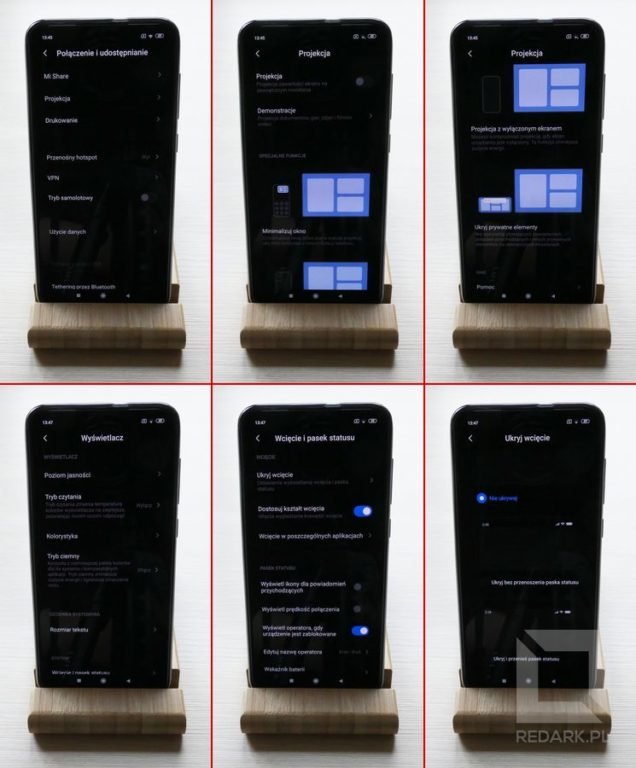
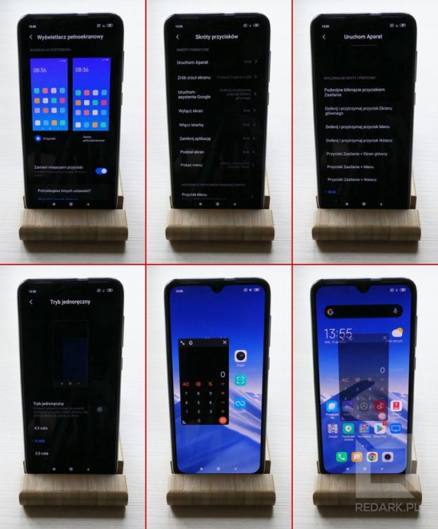
</Gallery>

## Aparaty

Moduł tylnych aparatów został trochę zmieniony względem flagowego Mi 9. Mamy tutaj:

- **Aparat główny:** 48 Mpx, f1.75 wspierający technologię pixel binning (zdjęcia będą miały rozdzielczość 12Mpx) oraz autofocus z detekcją fazy,
- **Teleobiektyw:** 8 Mpx, f2.4 umożliwiający dwukrotny zoom optyczny,
- **Szeroki kąt:** 13 Mpx, f2.4 z kątem widzenia 120 stopni.

Jest to dokładnie ten sam zestaw obiektywów co w Mi 9, ale o słabszej rozdzielczości w przypadku tele i szerokątnego. Model Lite również posiada z tyłu identycznie wyglądające obiektywy, ale nie dajmy się zwieść. Teleobiektyw został tam zastąpiony 2 megapixelowym sensorem głębi, więc telefon w rzeczywistości posiada jedynie dwa aparaty.

Główny, tele i szeroki kąt - zestaw gotowy na każdy kadr

Dzięki dobremu zestawowi obiektywów możliwości fotograficzne telefonu są bardzo szerokie. Urządzenie nie miało problemów ze złapaniem ostrości, czy z niepotrzebnie użytym upiększaniem. Muszę jednak zaznaczyć, że aplikacja aparatu czasami potrafiła się zawiesić i nie pozwalała użyć przycisku migawki. Było to spowodowane pracującym AI oraz HDR-em, dlatego, gdy będziecie z nich korzystać, pamiętajcie o sprawdzeniu, czy zdjęcie faktycznie zostało zrobione.

Jedna rzecz, jaka mi się szczególnie nie spodobała to osobny przycisk do uruchamiania obiektywu szerokokątnego. Nie rozumiem, dlaczego w tym modelu Xiaomi zastosowało dwa oddalone od siebie przyciski, zwłaszcza że pozostałe modele Mi 9 mają znacznie wygodniejszy trzypozycyjny przełącznik na środku ekranu (0.6x, 1x, 2x).

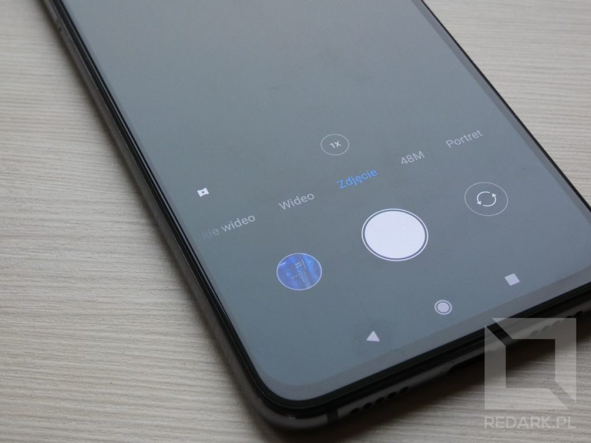

<ImageDescription>Po co tak komplikować?</ImageDescription>

Dla kontrastu, za duży plus można uznać dedykowany tryb "Noc", który genialnie upiększa wykonywane po ciemku zdjęcia. Miałem okazje przetestować go, fotografując świąteczne ozdoby i powiem krótko: jest świetnie! Tryb umiejętnie eksponuje ciemne fragmenty zdjęcia, redukuje szumy i stabilizuje ujęcie. Efekty można podziwiać poniżej, ale zalecam pobranie oryginałów zdjęć za pomocą linku znajdującego się na końcu tego akapitu:

<Gallery width='1'>
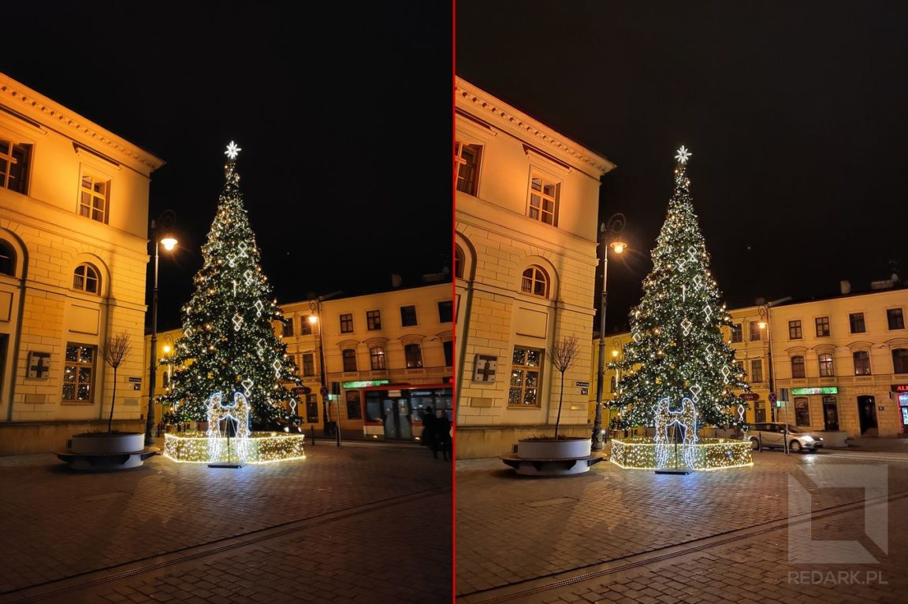

</Gallery>

Mi 9 SE umożliwia nagrywanie filmów w maksymalnej rozdzielczości 4K w 30fps lub w 1080p w 60fps. Nagrania są stabilizowane jedynie cyfrowo. Do dyspozycji jest też tryb slow-motion nagrywający w 120 lub 240 klatkach na sekundę. Jest także tryb 960fps w jakości 720p, ale jakość obrazu jest słaba, a czas nagrywania bardzo ograniczony.

Z frontu mamy do dyspozycji aparat 20 Mpx ze światłem 2.0. Jakość zdjęć jest tak samo bardzo dobra, ale więcej na temat tego obiektywu się nie wypowiem, gdyż zbyt często go nie używam. Zwykle jego funkcjonalność sprowadza się jedynie do szukania rzeczy, jakie wpadły mi pod fotel w samochodzie :)

<InfoBlock>Poniżej można pobrać pełną galerię zdjęć próbnych wykonanych przy pomocy Xiaomi Mi 9 SE. Zawarte tam fotografie nie posiadają kompresji stratnej oraz niewystępują w tym artykule.</InfoBlock>

<DownloadButton file='Xiaomi_Mi_9_SE_zdjecia_z_recenzji_redarkpl.zip' text='Pobierz zdjęcia'></DownloadButton>

<AdSense/>

## Bateria

Tutaj dochodzimy chyba do największego minusu Mi 9 SE. Ogniwo zamontowane w urządzenia ma jedynie 3070 mAh (jest to odrobinę mniej niż w Mi 9 - 3300 mAh) i wystarczy maksymalnie na 2 dni przy mało intensywnym używaniu i to jedynie z animacją czytnika linii papilarnych bez Always on Display. Jeśli telefonu używacie często, będziecie zmuszeni ładować go co noc. Konkurencja nie wypada tutaj lepiej, ale jakoś Xiaomi zwykle rozpieszczało nas większymi ogniwami.

Na szczęście krótki czas pracy na baterii zrekompensuje nam 18-watowa technologia szybkiego ładowania Quick Charge 4.0+. W moim przypadku bateria do pełna ładowała się w około 70 minut, więc mała pojemność ogniwa zbytnio mi się nie uprzykrzała. Kabel dołączony do urządzenia jest elastyczny, wytrzymały i ma jeden metr długości. Podczas normalnego użytkowania i ładowania nie zanotowałem też nadmiernego nagrzewania się szklanych plecków urządzenia. Ładowania indukcyjnego znanego z Mi 9 tutaj oczywiście nie uświadczymy.

## Łączność oraz multimedia

W kwestii łączności bezprzewodowej telefon posiada moduł NFC, Bluetooth 5.0, Wi-Fi 2.4 i 5 GHz oraz wspomnianą wcześniej diodę podczerwieni. W połączeniu z genialną aplikacją "Mi Pilot" bez problemu możemy zamienić nasz telefon w uniwersalny pilot do wszystkich urządzeń znajdujących się w domu. Naprawdę byłem zaskoczony, jak dobrze ta aplikacja jest zintegrowana z systemem.

Głośnik mono umieszczony u dołu urządzenia jest bardzo donośny, a jakość odtwarzanego przez niego dźwięku jest przyzwoita. Na pewno od pojedynczego głośnika nie można wymagać nic więcej. Boli na pewno fakt braku gniazda słuchawkowego. Ja rzadko słucham muzyki na telefonie, więc jakoś mocno mi to nie przeszkadzało, ale nie obraziłbym się gdyby takowe złącze znajdowało się w tym modelu. Miło, że producent dołączył do urządzenia przejściówkę z USB-C na mini jacka, ale fajnie gdyby jej kabel był grubszy niż nieugotowany makaron spaghetti ;)

## Podsumowanie

Powiem szczerze, że Mi 9 SE pozytywnie mnie zaskoczyło. Za około 500 złotych mniej względem pełnoprawnego Mi 9 otrzymujemy kompaktowy smartfon o dobrze przemyślanej specyfikacji. Nie mamy tutaj ładowania indukcyjnego, programowalnego przycisku asystenta, czy flagowego Snapdragona 855, ale nie są to braki, które mocno odbiły się na komforcie z korzystania z telefonu. Zestaw aparatów również nie odstaje zbytnio jakością od droższego brata. Największym minusem urządzenia jest z pewnością bateria, ale szybkie ładowanie i niewielkie wymiary urządzenia bardzo dobrze to rekompensują. Reasumując: jeśli szukasz kompaktowego smartfona z dobrym zestawem aparatów, nie przeszkadza Ci brak gniazda słuchawkowego oraz kart microSD i chcesz zmieścić się w budżecie poniżej 1500 złotych, to mogę Ci gorąco polecić Mi 9 SE.
