Według danych StatCounter (Browser Market Share) z września 2019 roku przeglądarkę Google Chrome posiada około 64% urządzeń na całym świecie. Nie jest to nic dziwnego. Chrome to bardzo udana, stabilna oraz prężnie rozwijana aplikacja i sam korzystam z niej na swoich komputerach, ale tylko na komputerach. Co z telefonem? Tam produkt Google'a nie ma u mnie wstępu od bardzo wielu lat.

Kto jest więc moim czarnym koniem mobilnego przeglądania internetu? Otóż Opera. Przeglądarka mająca bardzo dużo wspólnego z Chrome’em (silnik Chromium), która oferuje znacznie więcej ciekawych i dobrze zaprojektowanych funkcji. Niestety jest ona kompletnie niedoceniana! Wg wspomnianych wcześniej badań jej udział w rynku plasuje się w okolicach niecałych 3% :( . Na potrzeby tego artykułu przywróciłem w moim telefonie przeglądarkę Google Chrome i postanowiłem jeszcze raz przyjrzeć się funkcjom, które oferuje. Zapraszam więc do zapoznania się z listą 8 powodów, dla których NIE WARTO obecnie używać przeglądarki Google Chrome.

<InfoBlock>Dla jasności dodam, że artykuł nie jest w żaden sposób sponsorowany przez twórców Opery, a podczas porównywania używałem następujących wersji przeglądarek: Chrome 79.0.3945.93 oraz Opera 55.2.2719.50740</InfoBlock>

## 1\. Dolna belka nawigacyjna

Na początek z grubej rury. Tyle czasu Google stara się, aby jego system był jak najbardziej przyjazny dla użytkownika i był jak najprostszy w obsłudze, a do dzisiaj umieszcza cały panel nawigacyjny na samej górze telefonu! Czy oni na serio myślą, że trzymamy telefonu do góry nogami, czy co?!

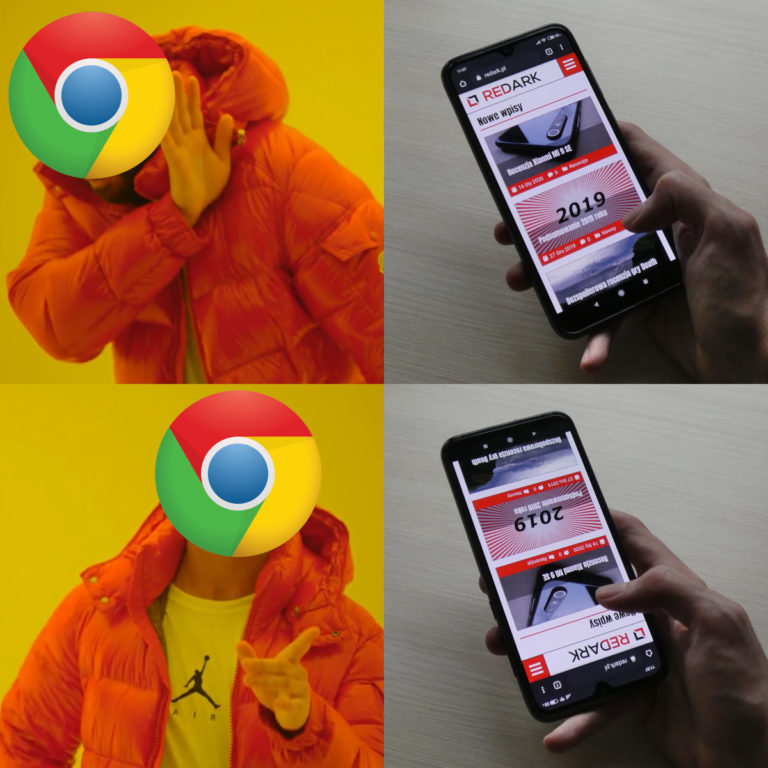

<ImageDescription>#autorskie</ImageDescription>

Czy to jest żart? Google przy każdej zmianie adresu każe nam robić szpagat palcami. Połączmy to z obecną modą na ekrany 6-7 cali z proporcjami 19,5:9 i już mamy wyjaśnienie skąd tyle osób ma rozbite ekrany :D . Zerknijmy, jak to wygląda w Operze. Interfejs jest podzielony na dwie belki. W górnej mamy pasek adresu oraz opcje udostępniania (pokażę je później), natomiast dolna skrywa 5 przycisków. Są to kolejno wstecz, dalej, strona startowa (zamiennie z wyszukiwarką), menadżer kart oraz przycisk menu Opery. Wszystko, co najważniejsze jest w zasięgu kciuka użytkownika. Można? Można.

<Gallery>
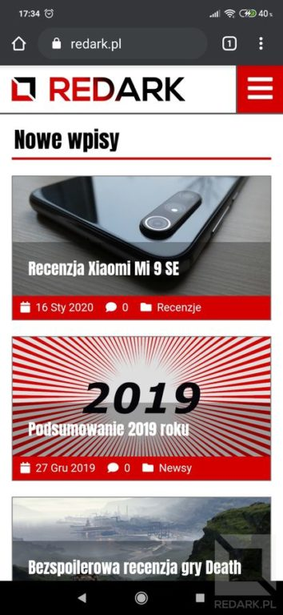
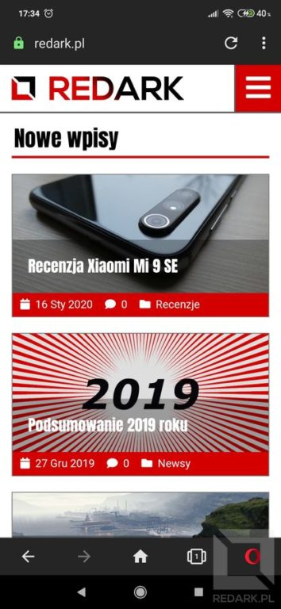
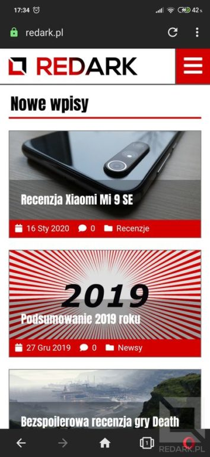
</Gallery>

<ImageDescription>Od lewej: Chrome, Opera z klasyczną nawigacją Androida i Opera z gestami pełnoekranowymi</ImageDescription>

Pewnie część z czytających ten artykuł zdziwi umieszczenie na pasku przycisków wstecz oraz dalej. Faktycznie, są one mniej potrzebne, ale to nie znaczy, że zostały włożone tam bez celu. Tak samo jak androidowy przycisk wstecz, reagują na przytrzymanie (wyświetlają historię stron) oraz idealnie sprawdzają się, gdy mamy włączone gesty pełnoekranowe. Takie sterowanie zdobywa coraz większą popularność na rynku mobilnym, a możliwość cofnięcia strony kliknięciem, a nie przeciągnięciem krawędzi ekranu może okazać się w wielu przypadkach bardzo przydatne.

### Eksperymentalne opcje Chrome

Aby być rzetelnym w porównywaniu tych przeglądarek, muszę wspomnieć o pewnym eksperymentalnym ustawieniu dostępnym w przeglądarce Google Chrome. Po wpisaniu adresu "chrome://flags" otrzymujemy dostęp między innymi do opcji o nazwie "Chrome Duet". Po jej aktywowaniu i dwukrotnym (niepojedynczym, a dwukrotnym - bo tak) restarcie aplikacji otrzymujemy pasek nawigacji u dołu ekranu.

<Gallery>
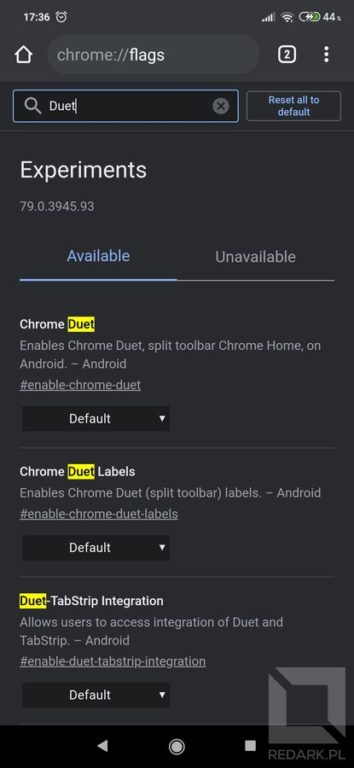
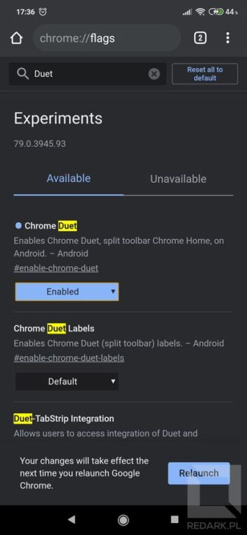
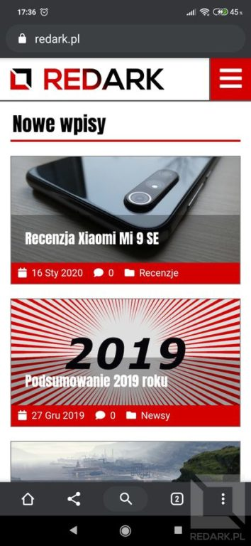
</Gallery>

<ImageDescription>Ciekawe ile osób wie o tym sposobie...</ImageDescription>

Poużywałem chwilę tego rozwiązania i jest mega wygodne oraz nie sprawia problemów z działaniem aplikacji. Mimo to, Google nie wiem ile miesięcy, jeśli nie lat, trzyma tę opcję ukrytą przed postronnymi. Pamiętam, że przez pewien okres czasu znikła ona nawet z Androidów, ale widzę, że powróciła, ale pod zmienioną nazwą "Duet". Tak czy siak, z powodu, że jest to eksperymentalna opcja i nie jest zalecana przez Google, nadal nie zmieniam zdania, że Chrome, krótko mówiąc, jest kompletnie beznadziejny w obsłudze.

<AdSense/>

## 2\. Menadżer kart

Jedną z najczęstszych akcji wykonywanych przez użytkowników w przeglądarkach jest przełączanie kart. Jedni lubią ich otwierać 30 na raz, a inni maksymalnie 3. Jednak niezależnie od tego jak przeglądasz Internet, musisz mieć możliwość łatwego przełączania się między kartami.

### Opera

Najpierw przyjrzyjmy się Operze. Ta posiada przycisk kart (oczywiście) na dolnej belce użytkownika w chyba najlepszym możliwym dla praworęcznych położeniu. Po otwarciu menadżera widzimy do 3 kart jednocześnie, a wszystkie możliwe przyciski mamy u dołu ekranu. Są to kolejno od lewej: karty zsynchronizowane z innych urządzeń, nowa karta, powrót do przeglądarki oraz dodatkowe opcje. Tryb incognito dostępny jest za pomocą przesunięcia widoku w prawo i jest sygnalizowany zmienioną kolorystyką przeglądarki oraz dodatkowym powiadomieniem na belce Androida.

<Gallery>
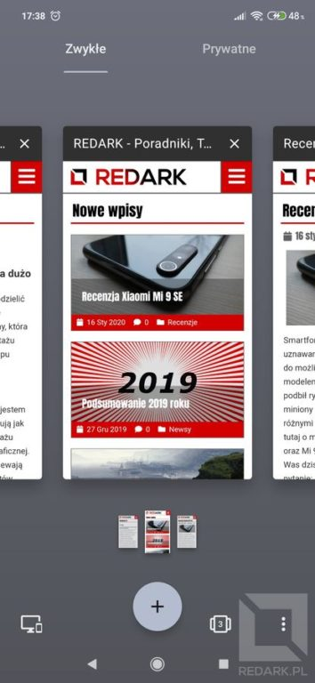
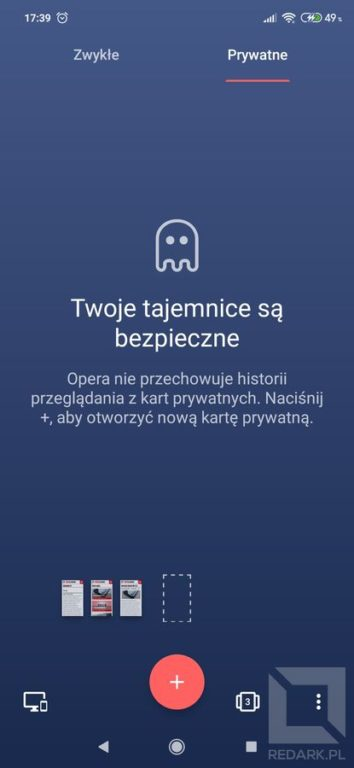
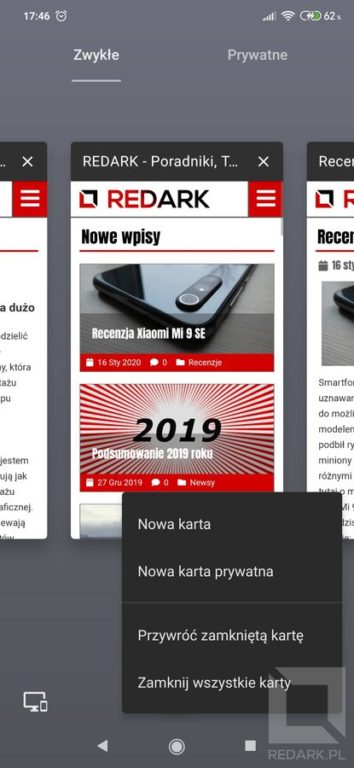
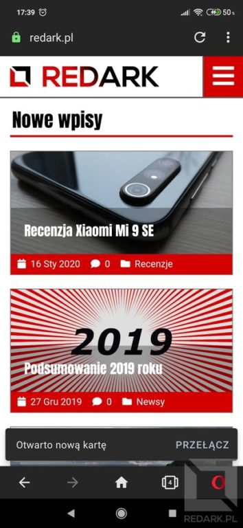
</Gallery>

<ImageDescription>Od lewej: menadżer kart, tryb incognito, dodatkowe opcje i skrót do nowo otwartej karty</ImageDescription>

Dodatkowe opcje pozwalają m.in. przywrócić zamkniętą przez przypadek kartę, a w ustawieniach możemy ustalić, czy nowo utworzona karta ma się otwierać na pierwszym planie, czy w tle. Dodatkiem jest też mini komunikat pojawiający się u dołu ekranu, który pozwala przełączyć się szybko na nowo utworzoną kartę (ostatni screen powyżej).

Sprawne przełączanie kart umożliwiają również gesty dostępne na dolnej belce nawigacyjnej. Przesunięcie palcem wzdłuż jej powierzchni, w lewo, bądź w prawo przełącza między otwartymi kartami, a dłuższe przytrzymanie przycisku menadżera kart otwiera automatycznie nową kartę przeglądarki. Wszystko dostępne u dołu ekranu, intuicyjne i bardzo szybkie.

### Chrome

No to lecimy z Chrome'em. Menadżer kart dostępny jest na górnej belce po prawej, a przycisk nowej karty, jakby jeszcze Was kciuk nie bolał, został wyrzucony do górnego lewego rogu :D . Brawo Google! Idziemy dalej. Widok pozwala na wyświetlanie około 3-4 kart jednoczenie. Tryb incognito dostępny jest tylko pod przyciskiem dodatkowych opcji.

W opcjach dodatkowych nie znajdziemy niestety możliwości przywrócenia zamkniętej przez przypadek karty. Ta opcja pojawia się jedynie na chwilę po zamknięciu karty w postaci mini komunikatu u dołu ekranu. Później nasza cenna strona znika bezpowrotnie. Nie znalazłem opcji wyboru zachowania przeglądarki po otwarciu nowej karty. Przeglądarka pokazuje jedynie szybką animację karty "wchodzącej pod ekran" i tyle. Zero wyboru. Jeśli chcemy się na nią przełączyć, pozostaje jedynie kolejny raz wykonać szpagat palcami.

<Gallery>
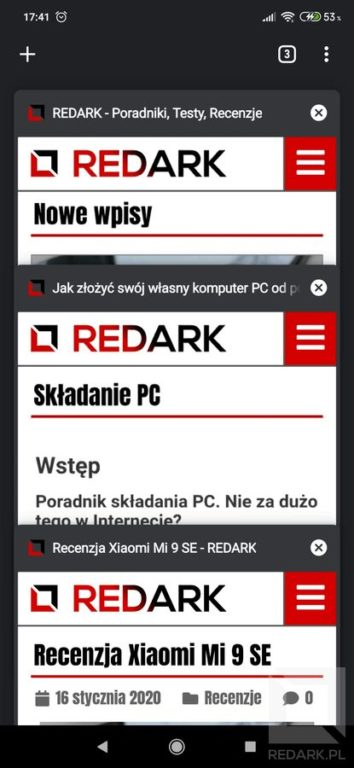
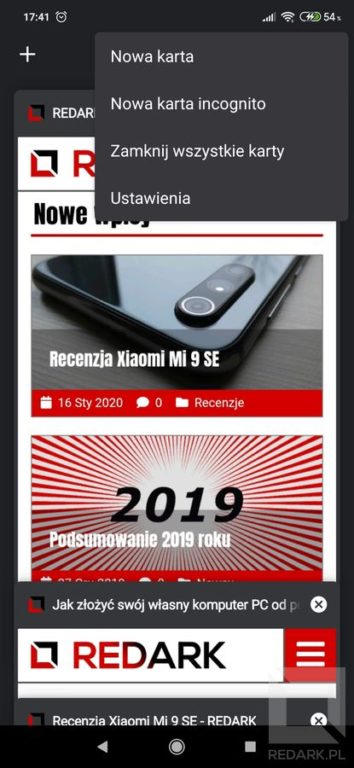
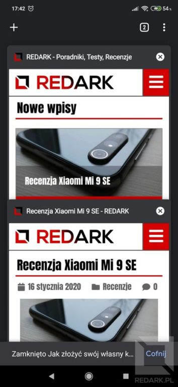
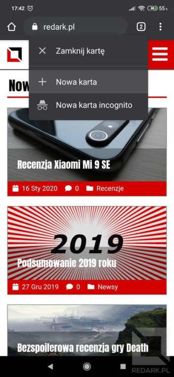
</Gallery>

<ImageDescription>Od lewej: menadżer kart, dodatkowe opcje, mini szansa na uratowanie karty i menu przytrzymania przycisku menadżera</ImageDescription>

Gesty przełączania tutaj również występują, ale ponownie wymagają podróży na górę ekranu. Drobną różnicę można spotkać jeszcze podczas przytrzymania przycisku kart. W Operze tworzyło to od razu nową kartę, a tutaj otwiera mini menu z opcją nowej karty lub zamknięcia obecnej. Niby nic, ale wymaga dodatkowego kliknięcia, jak chcemy otworzyć coś nowego.

## 3\. Zapisywanie stron oraz udostępnianie

W tym podpunkcie chciałbym opowiedzieć o funkcjach udostępniania i zapisywania odwiedzonych przez nas stron. Z dawnych lat użytkowania Chrome'a pamiętam, że przeglądarka pod tym względem mocno odstawała od Opery, ale po ostatnim teście muszę przyznać, że obie aplikacje oferują bardzo podobny zestaw funkcji.

### Opera

Jedyny przycisk istniejący na górnej belce Opery kryje w sobie wszelkie opcje dotyczące aktualnie otwartej strony. Znajdziemy tam funkcję przeszukiwania strony, translator Google'a, przełącznik wersji na komputery, a także szereg funkcji zapisu oraz udostępniania. Do wyboru mamy:

- **Szybkie wybieranie** - dodaje kafelek na ekran startowy przeglądarki,
- **Zakładki** - zapisuje adres do standardowego mechanizmu zakładek, który posiada chyba każda ówczesna przeglądarka,
- **Strony offline** - zapis strony na później (możliwość otworzenia jej bez połączenia internetowego),
- **Ekran główny** - dodaje skrót na jeden z ekranów w systemie Android,
- **Wyślij** - umożliwia przesłanie adresu strony do jednej z zainstalowanych w telefonie aplikacji,
- **Zapisz jako PDF** - generuje dokument PDF z zawartością strony.

<Gallery>
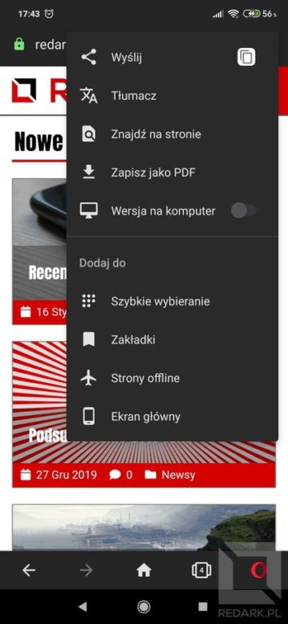
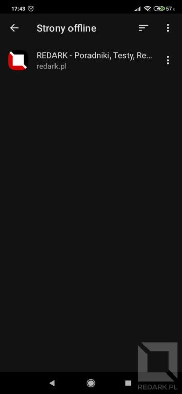
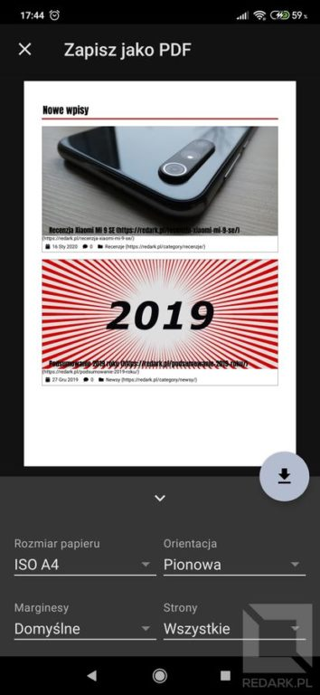
</Gallery>

<ImageDescription>Od lewej: menu udostępniania, lista stron offline i generator plików PDF</ImageDescription>

Po prawej stronie przycisku "Wyślij" wyświetla się skrót do aplikacji, która najczęściej służy nam do udostępniania stron internetowych. Może tam się pojawić np. Facebook, Messenger, Slack lub kopiowanie do schowka. Jeśli chodzi o generowanie PDF-ów, to funkcja ta ewidentnie wymaga jeszcze dopracowania. Wiele stron nie renderuje się poprawnie oraz często nie zawiera grafik ładowanych przez JavaScript.

### Chrome

Opcje udostępniania w przeglądarce od Google dostępne są również w menu u góry. Znajdziemy tam funkcje takie jak:

- **Ikona gwiazdki** - dodaje stronę do zakładek,
- **Ikona pobierania** - trochę mylnie wygląda, ale jest to odpowiednik stron offline Opery,
- **Udostępnij...** - odpowiednik omawianego wcześniej przycisku "Wyślij",
- **Dodaj do ekranu głównego** - dodaje skrót do ekranu Androida.

Nie mamy tutaj funkcji skrótów na stronie startowej przeglądarki oraz opcji generowanie PDF-ów. Szczególnie nie podoba mi się upakowanie wszystkich opcji przeglądarki do jednego menu. Mimo posiadania ekranu FHD w wydłużonych proporcjach 19,5:9 menu ledwo mieściło mi się na ekranie. Może to kwestia przyzwyczajenia i posiadanie wszystkich opcji na wierzchu jest jakimś tam plusem, ale ja, jako nowy użytkownik czułem się lekko zagubiony. W Operze natomiast opcje dodawania i przeglądania skrótów lub pobranych stron były oddzielone.

<Gallery>
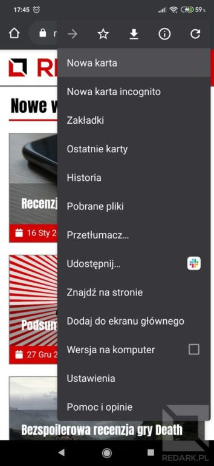
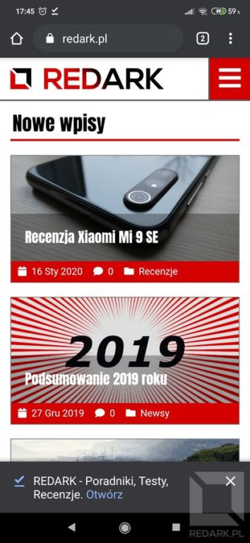
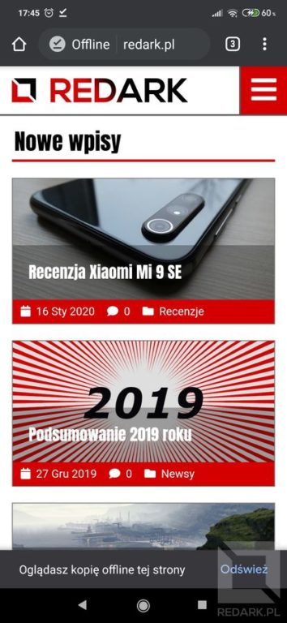
</Gallery>

<ImageDescription>Od lewej: menu przeglądarki Chrome, komunikat o pobraniu strony i widok offline</ImageDescription>

Na chwilę zatrzymam się jeszcze przy funkcji stron offline Chrome'a. Przez nietypową ikonę pobierania na początku myślałem, że jest to skrót do listy pobranych plików, a nie do funkcji stron offline. Mimo to rozumiem, dlaczego Google zastosowało taki symbol, ponieważ funkcja stron offline tej przeglądarki działa zupełnie inaczej niż w przypadku Opery.

Opera oferuje zapisane strony tylko w obrębie swojej aplikacji. Nie otrzymujemy tutaj jawnego pliku znajdującego się w pamięci telefonu. Chrome za to pobiera stronę i zapisuje ją do pliku o rozszerzeniu "mhtml". Takowy plik możemy bez problemu udostępnić innym telefonom lub komputerom. Pomysł bardzo fajny i muszę przyznać, że lepiej renderuje strony niż generator PDF-ów Opery.

<AdSense/>

## 4\. Zmiana wyglądu aplikacji i stron

Możliwość personalizacji aplikacji i dopasowania jej do gustów użytkownika jest bardzo ważna. Opera przygotowała następujące opcje:

- Zmiana kolorystyki aplikacji z jasnej na ciemną (tzw. dark mode),
- Wybór jednego z 5 akcentów kolorystycznych aplikacji,
- Dwa sposoby wyświetlania kart (tryb telefonu lub tabletu),
- Ustawienie sposobu ukrywania paska adresu.

<Gallery>
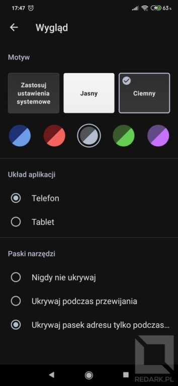
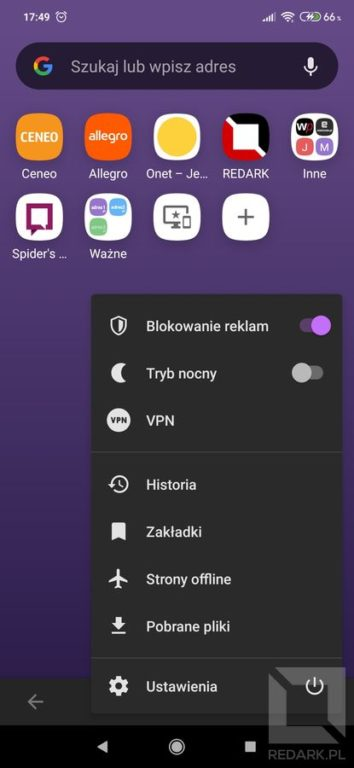
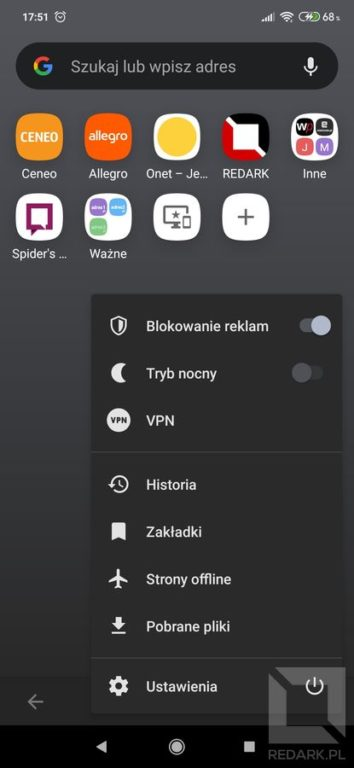
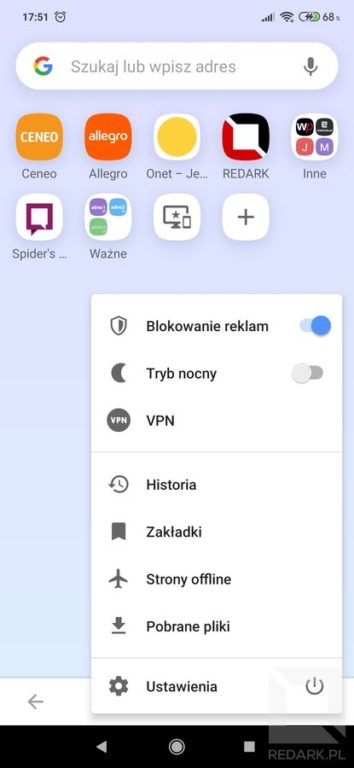
</Gallery>

<ImageDescription>Ustawienia wyglądu przeglądarki oraz trzy przykładowe wersje kolorystyczne</ImageDescription>

Oprócz ustawień wyglądu przeglądarki mamy również "tryb nocny" z następującymi funkcjami:

- Wybór temperatury barw ekranu (filtr niebieskiego światła),
- Przyciemnianie ekranu poza skalę urządzenia,
- Automatyczna zmiana kolorystyki strony na czarną (zobacz przykład REDARKa),
- Przyciemnianie klawiatury ekranowej telefonu,
- Automatyczna zmiana kolorystyki aplikacji na ciemną,
- Uruchamianie trybu nocnego wg harmonogramu.

<Gallery>
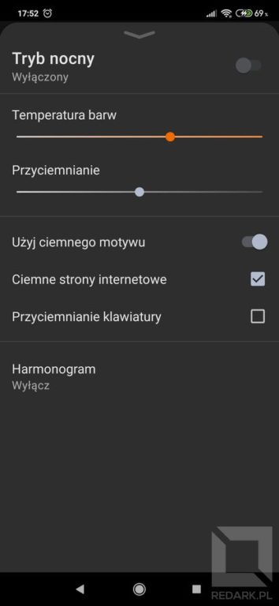
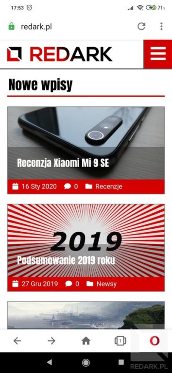
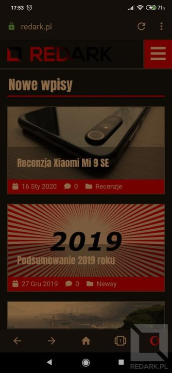
</Gallery>

<ImageDescription>Facebook lub dowolna inna strona w ciemnej kolorystyce? Z Operą to nie problem!</ImageDescription>

Tryb nocny robi wrażenie, co nie? Zerknijmy teraz na Chrome'a i no cóż. Dodali przynajmniej w końcu dark mode do interfejsu...

<Gallery>
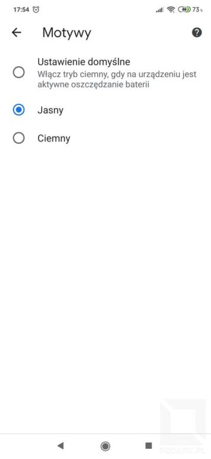
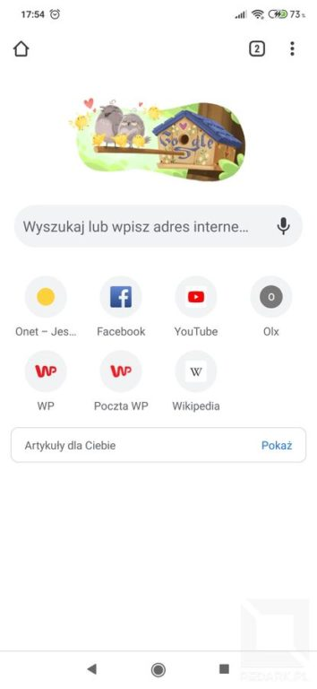

</Gallery>

<ImageDescription>Dark mode niby jest, ale poza tym bieda jak nie wiem</ImageDescription>

## 5\. Blokowanie niechcianych rzeczy

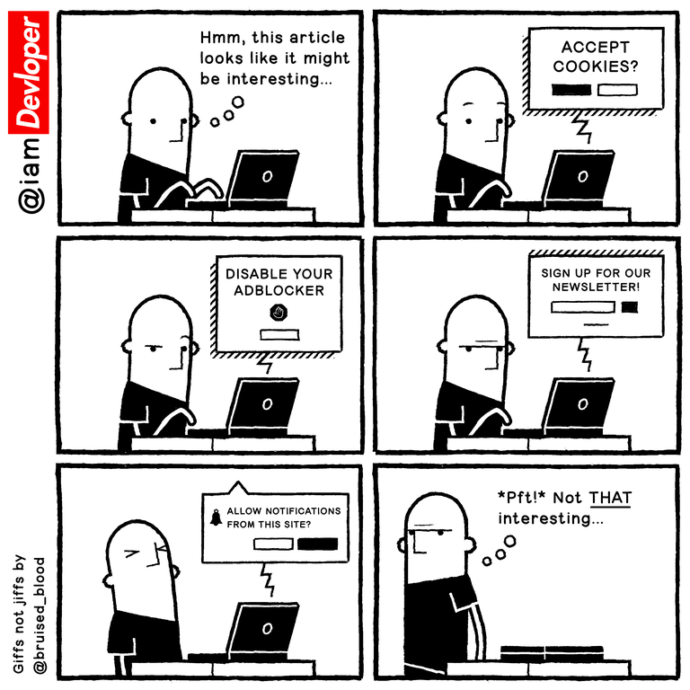

<ImageDescription>Strony internetowe XXI wieku</ImageDescription>

Nie od dziś wiadomo, że strony internetowe XXI wieku to komunikaty o ciasteczka, o polityce RODO, o usłudze powiadomień, o newsletterach, a także cudowne reklamy informujące nas codziennie, że wygraliśmy iPhone'a. Wyczyśćmy zatem wszystkie pliki cookie i wybierzmy się na mój ulubiony poligon testowy, czyli stronę onet.pl :D

Na Operze witryna nie wyświetla ani jednej reklamy. Nie zostałem również zaatakowany przez żaden komunikat o ciasteczkach, RODO lub powiadomieniach. Jedynie między niektórymi artykułami można zauważyć trochę powiększone białe marginesy, które są najprawdopodobniej pozostałościami po reklamach.

Chrome? Na dzień dobry próba wymuszenia powiadomień. Następnie komunikat o RODO na 90% ekranu. W pustych przestrzeniach pomiędzy artykułami oczywiście reklamy, a w artykułach samo odtwarzające się filmiki oraz pełnoekranowe cuda współczesnego marketingu. Internet XXI wieku.

<Gallery width='3'>

</Gallery>

<AdSense/>

Pewnie domyślacie się już, dlaczego taka różnica, co nie? Opera oferuje wbudowany bloker reklam, komunikatów o ciasteczkach oraz próśb o zezwolenie na powiadomienia. Wszystko działa sprawnie i jest dostępne w menu podręcznym przeglądarki. Czyż to nie jest wygodne?

<Gallery>
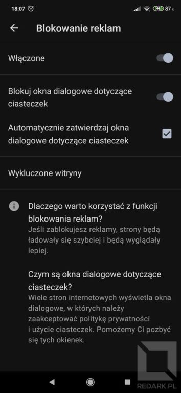
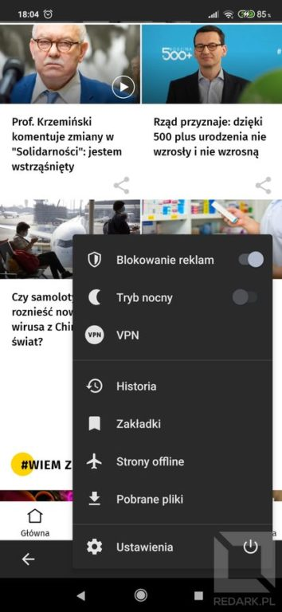
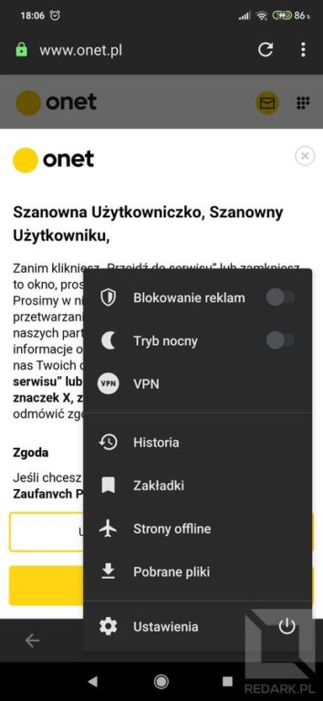
</Gallery>

<ImageDescription>Od lewej: ekran ustawień, Onet z włączoną blokadą oraz Onet z wyłączoną blokadą</ImageDescription>

## 6\. Transfer i prywatność

Obie przeglądarki oferują funkcję oszczędzania transferu, choć Google postanowił ukryć ją pod dziwną nazwą "wersja uproszczona". Obie polegają na przekierowywaniu i kompresowaniu treści przy pomocy serwerów pośredniczących. Opera dodatkowo umożliwia sterowanie jakością wyświetlanych na stronie zdjęć lub ich całkowite wyłączenie.

Funkcją, którą nie znajdziecie w Chrome, jest natomiast **darmowy VPN**, czyli wirtualna sieć prywatna. Umożliwia ona ukrycie swojej rzeczywistej lokalizacji oraz odseparowanie się od niebezpiecznego środowiska sieciowego np. publicznej sieci Wi-Fi w kawiarni. Ekran ustawień umożliwia dodatkowo wybranie kontynentu docelowego, a także możliwość wykluczenia z "oszukiwania" wyszukiwarki internetowej.

<Gallery>
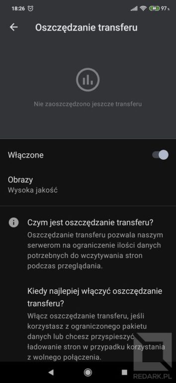

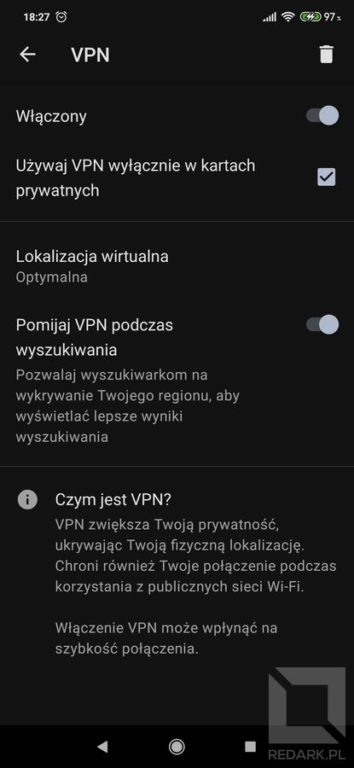
</Gallery>

<ImageDescription>Od lewej: oszczędzanie transferu u Opery, odpowiednik u Chrome'a i ustawienia VPN Opery</ImageDescription>

## 7\. Strona startowa i wyszukiwarka

Ten podpunkt chciałbym przeznaczyć na przyjrzenie się ekranowi startowemu obu przeglądarek oraz funkcjom, jakie one oferują.

### Opera

Opera oferuje w pełni personalizowany ekran główny dostępny po otwarciu nowej karty lub za pomocą środkowego przycisku na dolnej belce. Utworzone przez nas skróty mogą być modyfikowane i grupowane w foldery. Przycisk obok plusa umożliwia przeglądanie zapisanych stron z innych przeglądarek Opera podłączonych do naszego konta. W ustawieniach znajdziemy możliwość zmiany rozmiaru ikon oraz wyświetlenia artykułów z portali informacyjnych. Możemy nawet dostosować tematykę, jakiej mają one dotyczyć. U góry ekranu startowego znajdziemy oczywiście wyszukiwarkę połączoną z paskiem adresu, a także wbudowany **czytnik kodów QR**. Kliknięcie ikony po lewej umożliwia zmianę dostawcy usług wyszukiwania.

<Gallery>
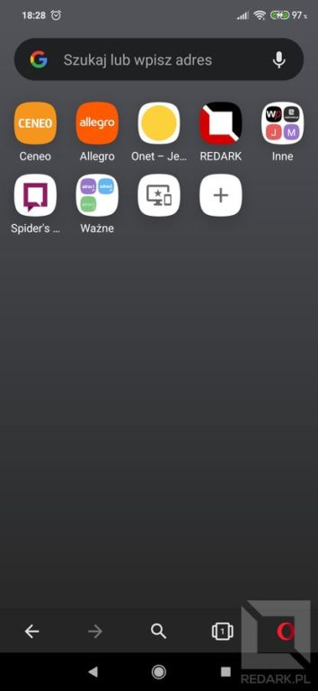
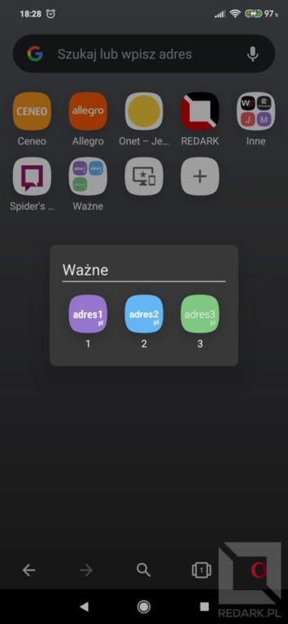
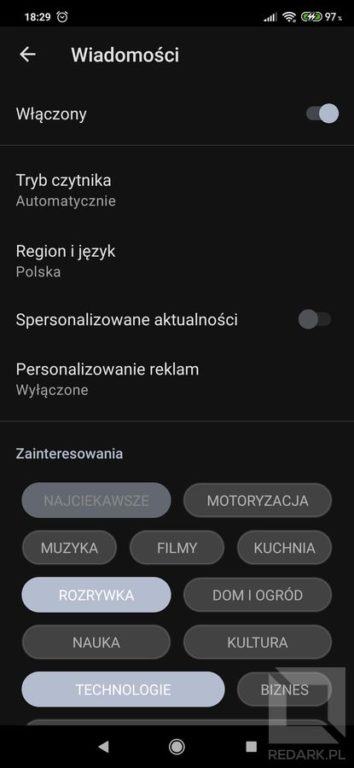

</Gallery>

<ImageDescription>Od lewej: ekran startowy, folder ze skrótami, ustawienia wiadomości i ekran startowy z wiadomościami</ImageDescription>

### Chrome

Ekran startowy od Chrome to jedynie wyszukiwarka (zmiana dostawcy dostępna w ustawieniach), skróty do najczęściej odwiedzanych stron bez możliwości dodania własnych pozycji oraz lista artykułów, które nie mogą zostać w pełni ukryte. Trochu bieda...

<Gallery>
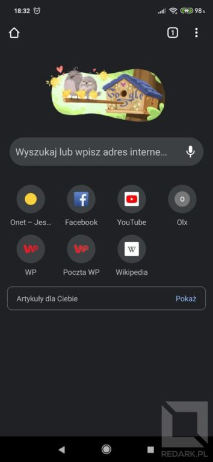
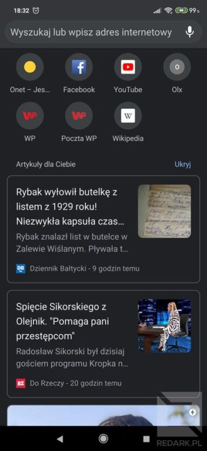
</Gallery>

<ImageDescription>Ekran startowy Chrome'a - zero personalizacji</ImageDescription>

<AdSense/>

## 8\. Aplikacja szyta na miarę

Na koniec chciałbym jeszcze wspomnieć o jednym ważnym aspekcie, który sprawi, że przeglądarka Opera może pracować nawet na słabszych telefonach z Androidem. Mówię tutaj o oddzielnej aplikacji dostępnej w sklepie Google Play, czyli Operze Mini.

<Gallery>

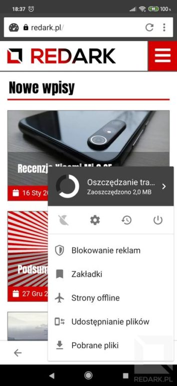
</Gallery>

<ImageDescription>Minimalistyczna Opera Mini</ImageDescription>

Jest to okrojona wersja omawianej w tym artykule "pełnoprawnej" Opery. Zawiera ona jedynie najbardziej przydatne funkcje, zużywa mniejsze ilości cennej pamięci RAM, a także zajmuje mniej miejsca w pamięci na aplikacje (w moim przypadku było to 134 MB kontra 46 MB w wersji Mini). Uratowałem już tą aplikacją kilka tanich telefonów, które co chwilę zawieszały się, próbując udźwignąć ciężar Chrome'a.

<Gallery>
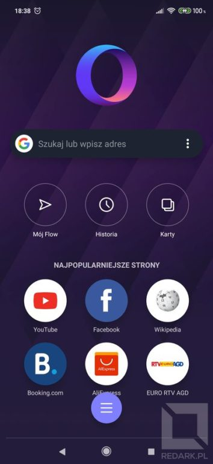
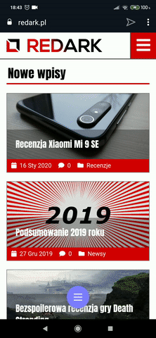
</Gallery>

<ImageDescription>Opera Touch - przeglądanie Internetu wymyślone na nowo</ImageDescription>

Nie mogę też nie wspomnieć o Operze Touch, czyli projekcie stworzenia dość nietypowej przeglądarki internetowej. Stawia ona na sterowanie wszystkim przy pomocy jednego przycisku znajdującego się centralnie u dołu ekranu (zobacz GIF powyżej). Ponownie widać tutaj starania Opery w kwestii łatwości obsługi ich aplikacji przy pomocy jednej ręki. Jeśli chodzi o mnie, to używałem tej przeglądarki przez około tydzień po jej premierze, ale ostatecznie nie przekonał mnie jej styl i powróciłem do klasycznej Opery. Mimo to, jeśli chcesz spróbować czegoś nowego, serdecznie zapraszam do wypróbowania Touch'a. A rusz Ci się spodoba :)

## Podsumowanie

Uff... Trochę długie wyszło to porównanie, ale naprawdę chciałem rzetelnie je przeprowadzić. Mam nadzieję, że powyższe 8 podpunktów pokazało Ci, że Opera jest godną konkurencją Chrome'a i oferuje ogromny wachlarz przydatnych funkcji i ustawień. Jeśli dzięki temu artykułowi wypróbowałeś/aś Operę, daj znać o tym w komentarzach pod artykułem. Będę bardzo wdzięczny i zachęci mnie to do dalszego tworzenia podobnych porównań :)
