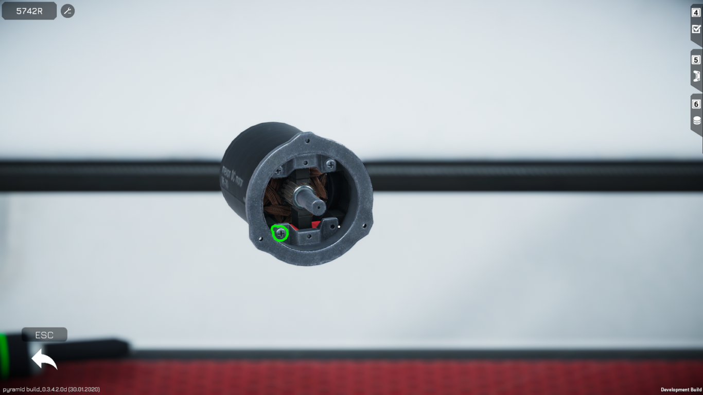
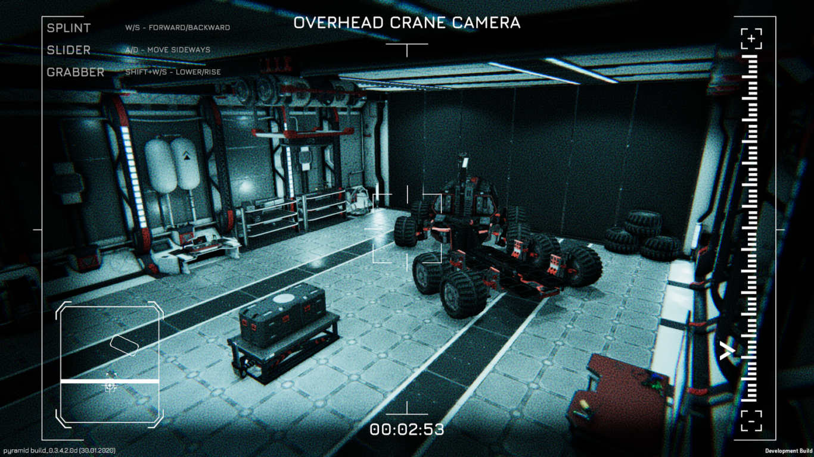
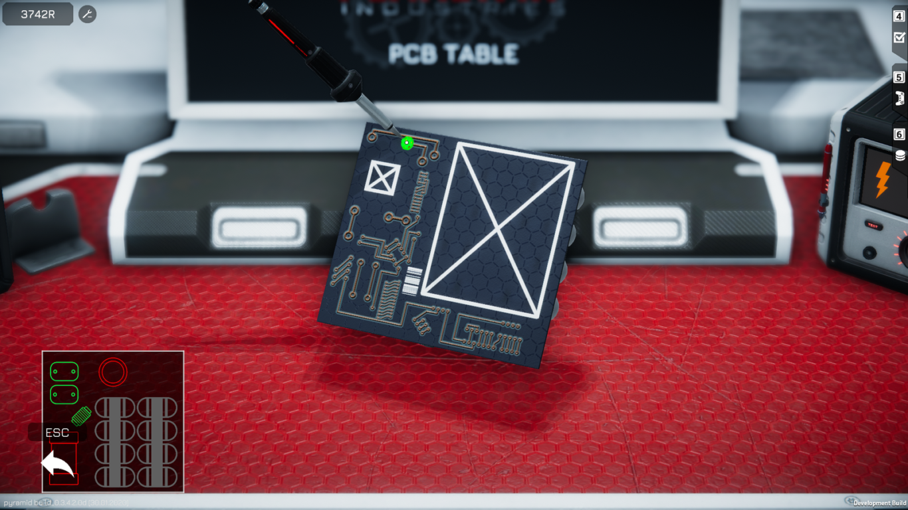
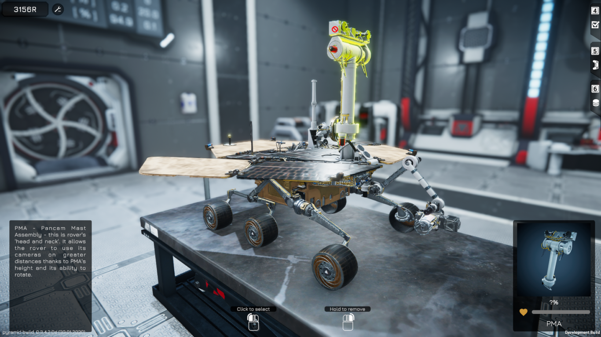
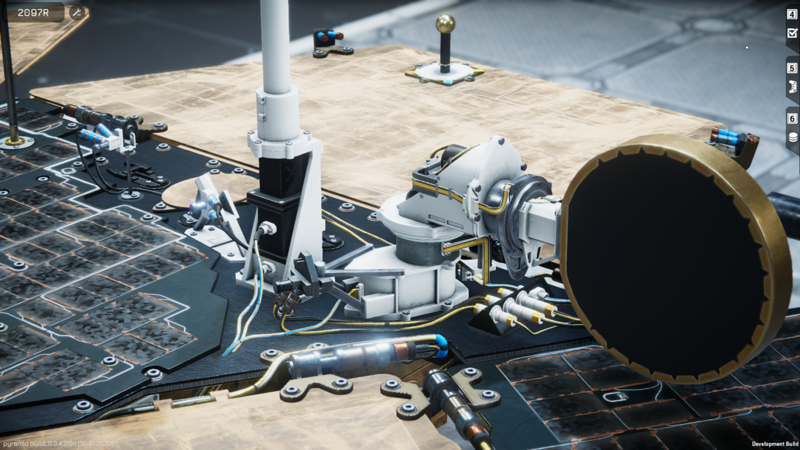

Dzisiaj dość nietypowo, ponieważ chciałbym przedstawić Wam grę **Rover Mechanic Simulator** od polskiego studia [Pyramid Games](https://pyramid.games/), którą dzięki uprzejmości deweloperów, miałem okazję testować przedpremierowo.

[Rover Mechanic Simulator](https://store.steampowered.com/app/864680/Rover_Mechanic_Simulator/) to, jak sama nazwa wskazuje, kolejna gra z serii symulatorów pozwalających wcielić się graczowi w tytułowego mechanika. Co w tym tytule jest zatem takiego wyjątkowego? To, że naszym zadaniem nie jest naprawa samochodów, które znamy i widujemy na co dzień. W grze będziemy naprawiać coś znacznie ciekawszego. Coś, czego pewnie wielu z Was nie widziało nigdy na żywo. W Rover Mechanic Simulator naprawiamy łaziki, których zadaniem jest badanie i eksplorowanie powierzchni czerwonej planety.

## Mechanika

Główny rdzeń mechaniki RMS-a nie odbiega zbytnio od innych gier tego typu. Otrzymujemy trzy tryby działania: demontaż, montaż oraz badanie stanu technicznego. Za ich pomocą diagnozujemy usterki oraz dokonujemy podmiany podzespołów.

<Gallery>

</Gallery>

Niektóre elementy, takie jak np. silniki lub sensory, można dodatkowo rozkręcić na mniejsze podzespoły przy stole naprawczym. Oprócz tego występuje tutaj również mechanika czyszczenia elementów z piasku oraz własnoręcznego naprawiania obwodów elektrycznych. Tak, w tej grze możemy wyjąć niedziałającą płytkę z układem elektronicznym i przy pomocy lutownicy wymienić w niej np. spalony kondensator.

<Gallery>

</Gallery>

## Grafika i walory edukacyjne

To, co zasługuje na duże uznanie, to właśnie dbałość o szczegóły i wierne odwzorowanie prawdziwych łazików marsjańskich. W grze możemy poznać budowę takich maszyn jak Spirit, Opportunity czy Sojourner. O szczegółowości modeli niech świadczą liczby. Mały Sojourner składa się z 90 części i ponad 200 śrubek, a bliźniacze modele Spirit oraz Opportunity zawierają w sobie około 400 różnych elementów i aż 800 śrubek! Twórcy zapewniają również, że będą na bieżąco dodawać nowe pojazdy, m.in. łazika, który w tym roku zostanie wystrzelony w kosmos w ramach [misji Mars 2020](https://mars.nasa.gov/mars2020/).

<Gallery>

</Gallery>

W trakcie majsterkowania gra dba także o to, żebyśmy wiedzieli jakie części demontujemy. Po najechaniu kursorem na poszczególne elementy łazika możemy przeczytać ich krótkie opisy. Dzięki temu nie tylko możemy się pobawić w naprawianie łazików, ale i poznać wiele ciekawych informacji na temat ich działania oraz w jaki sposób badają one powierzchnię Marsa.

<AdSense/>

## Premiera? Już dzisiaj

W przedstawioną przeze mnie grę możecie zagrać już sami, ponieważ właśnie za chwilę wchodzi ona w fazę wczesnego dostępu na [platformie Steam](https://store.steampowered.com/app/864680/Rover_Mechanic_Simulator/). Oprócz tego zapraszam na [oficjalny serwer Discord](https://discord.gg/sv9UWeh), na którym można porozmawiać bezpośrednio z twórcami tego tytułu. Dzisiaj o godzinie 17:00 startuje również stream, na którym będzie można zobaczyć grę w akcji. Transmisja będzie dostępna [na YouTubie](https://www.youtube.com/watch?v=-azFxVZxGQQ) oraz [Twitchu](https://www.twitch.tv/pyramid_games/).

Oprócz tego zachęcam do zainteresowania się jeszcze inną grą studia Pyramid Games, czyli **[Occupy Mars](https://occupymarsgame.com/)**. Jest to gra również poświęcona tematyce kolonizacji Marsa, ale skupiająca się na aspektach surwiwalowych. Tytuł będzie posiadać otwarty świat, dowolność w sposobie budowania bazy oraz rozbudowany system zarządzania zasobami. Nie zabraknie też walorów edukacyjnych, ponieważ twórcy chcą jak najlepiej odwzorować warunki panujące na Marsie. Na ten tytuł, też nie będziecie musieli długo czekać, ponieważ za niecałe dwa miesiące on również wchodzi w fazę wczesnego dostępu na [platformie Steam](https://store.steampowered.com/app/758690/Occupy_Mars_The_Game/).
