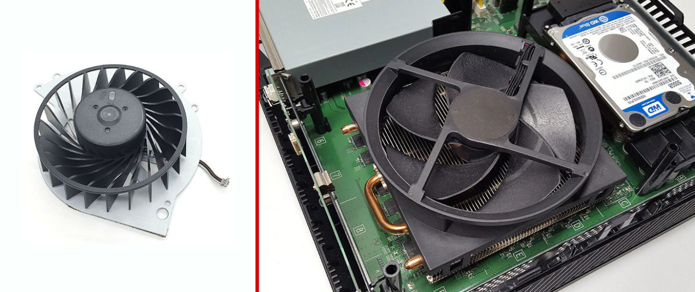
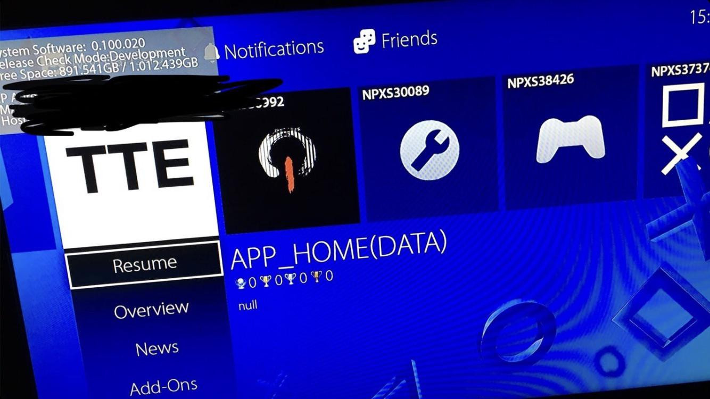
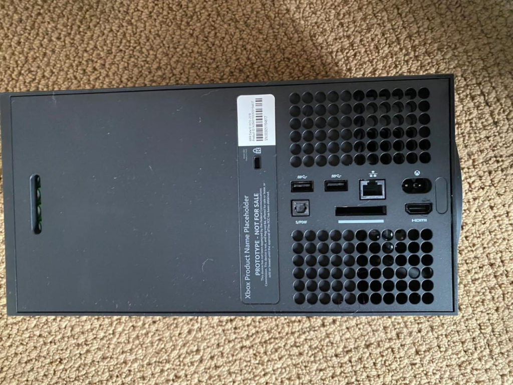
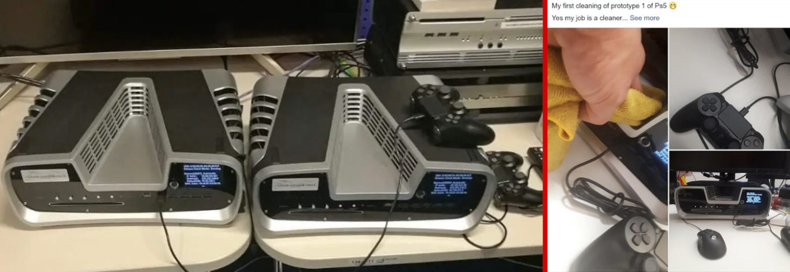

Do premiery nowej generacji konsol pozostało jedynie około 10 miesięcy. Microsoft zaprezentował już wygląd swojej lodówki konsoli, natomiast Sony nadal trzyma nas w niepewności, choć coraz więcej znaków na ziemi i niebie świadczy o tym, że pokaz japońskiego giganta odbędzie się lada chwila. Dlatego uważam, że jest to idealny moment na podsumowanie moich doświadczeń z obecną generacją konsol oraz napisał, jakie są moje oczekiwania względem nowego PlayStation 5.

## Wydajny układ chłodzenia

To, co na pewno dało się we znaki wszystkim posiadaczom PS4, to głośność pracy konsoli. Urządzenie od samego początku potrafiło zamienić się w suszarkę do włosów, a kolejne lata pracy jedynie potęgowały ten efekt. Microsoft pod tym względem wypada znacznie, znacznie lepiej. Oczywiście budowa tych dwóch konsol jest kompletnie odmienna. PlayStation postawiło na niską obudowę z chłodzeniem bardzo podobnym do tych montowanych w laptopach. Microsoft za to wyprodukował słynny już odtwarzacz VHS z wielkim chłodzeniem i kratkami wentylacyjnymi zajmującymi większość powierzchni obudowy urządzenia.

<ImageDescription>Wentylator chłodzący w PS4 (po lewej) i Xbox One (po prawej)</ImageDescription>

Obecnie uważam, że obie strony źle przemyślały swoje systemy chłodzenia. Microsoft kompletnie nie starał się zminiaturyzować chłodzenia, przez co wyszła im paskuda, natomiast Sony przesadziło w drugą stronę, zapewniając swoim graczom ból uszu poprzez zamontowanie mini wiatraczka i ukrycie otworów wentylacyjnych w szczelinach. Nowy Xbox nie zmienił stanowiska i ponownie stawia na dużą obudowę i wydajne chłodzenie wykorzystujące zjawisko konwekcji cieplnej. Ciekawi mnie, czy Sony wyciągnie lekcje z obecnej generacji i tak samo jak Xbox, nie będzie silił się na jak najmniejszą obudowę.

## Osiągi konsoli

To, co na pewno będzie interesowało graczy, to moc, jaką będzie dysponować urządzenie. Obecnie oba obozy przekrzykują się tekstami "**120FPS w 4K!!!!!!!**". Ale wiecie co? Kompletnie mi na tym nie zależy. Dla mnie ideałem będzie 60 klatek w 1080p w KAŻDYM tytule. Nic więcej.

<AdSense/>

Nie mówię tak, tylko dlatego, że nie posiadam ekranu 4K, ale dlatego, że wiem, na czym polegają sztuczki Sony i MS. Jeśli będą chcieli stworzyć urządzenie przystępne cenowo, to na bank dostaniemy przełącznik w ustawieniach, który pozwoli nam wybrać wysoką rozdzielczość lub ilość klatek. Liczę, że w końcu otrzymamy informację na ten temat, ponieważ ten szum propagandowy doprowadza mnie do szału. W kwestii jakości obrazu to chciałbym też, żeby nagrywanie ostatnich 15 minut rozgrywki odbywało się w rozdzielczości natywnej wyświetlacza, a nie w mizernym 720p.

## Usprawnienie działania interfejsu

Trzeci punkt chciałbym poświęcić nieskończonym loading'om niektórych ekranów interfejsu PS4. Przykładem może tutaj być lista aktywnych znajomych lub strona główna PS Store. Na ich otwarcie można czekać czasami nawet kilkanaście sekund. Nie wiem, czy jest to stricte wina działania interfejsu konsoli, czy może usług PSN, ale zdarza się to nagminnie.

<ImageDescription>Interfejs PlayStation 5 w wersji deweloperskiej, źródło: reddit.com</ImageDescription>

Jakiś czas temu mogliśmy już zobaczyć zdjęcie interfejsu devkit-a PS5. Jak widać, nie różni się ono znacząco od obecnej generacji, ale płynność jego działania poznamy niestety dopiero po premierze. Pozostając jeszcze w temacie tego zdjęcia, dużą ciekawość budzi zawartość drugiego kafelka. Widać na nim **logo Decima**. Jest to silnik stworzony przez studio Guerrilla Games, który napędzał takie gry jak Horizon: Zero Dawn oraz wydane niespełna pół roku temu Death Stranding. Jego pojawienie może oznaczać port dzieła Kojimy na nową generację konsol lub potwierdzenie plotek, jakoby druga część Horizon: Zero Dawn mała być tytułem otwierającym dla PS5. Przypomnę też, że pierwszym tytułem na PS4 był Killzone: Shadow Fall od tego samego studia.

## Łatwiejsze kopiowanie plików

Kolejną sprawą związaną z interfejsem PS4 jest możliwość kopiowania plików (zdjęcia i filmy) na dyski zewnętrzne. Obecnie jedynym sensownym sposobem wydostania multimediów z konsoli jest specjalnie sformatowany pendrive w systemie FAT32 (pamięta on czasy Windowsa 95). Do tego praktycznie zerowa kontrola nad sposobem zapisu danych na dysku oraz brak możliwości kopiowania plików w tle. Tak, żeby zgrać materiały z konsoli, muszę przez pół godziny oglądać na telewizorze pasek postępu...

Dlatego PlayStation 5 powinno posiadać na start USB 3. generacji najlepiej wraz z gniazdem USB-C (podobno nowy pad ma być nim zasilany), umożliwiać kopiowanie w tle oraz obsługiwać obecnie używane systemy plików, takie jak np. NTFS. Nie obraziłbym się też za obsługę serwerów NAS w sieci lokalnej.

## System zgłaszania i blokowania użytkowników

Naprawdę nie rozumiem, jak w dzisiejszych czasach PlayStation nie posiada porządnej funkcji zgłaszania i banowania kont użytkowników. Co prawda temat kont "botów" nie jest nagminny i dziwne zaproszenia do znajomych pojawiają się zaledwie raz na kilka miesięcy. Jednak taki system przydałby się rozgrywkom multiplayer, ale skoro Sony nie wspiera tej opcji, to gry tym bardziej nie będą tego robić gry. Podczas grania po sieci wielokrotnie zdarzały mi się sytuacje, w których system zgłaszania i banowania (m.in. za griefing) bardzo by się przydał. Liczę, że taka możliwość w końcu pojawi się w PlayStation 5.

## Szybki i duży magazyn na dane

Wiele mówi się o tym, że nowa generacja konsol ma dostać na start szybkie dyski SSD. To bardzo dobrze, tylko pytanie jeszcze jakiej pojemności one będą i czy konsola będzie umożliwiać rozbudowanie magazynu danych. Ja obecnie korzystam z jednej z pierwszych wersji PS4 z leciwym dyskiem talerzowym o pojemności 500 GB. Każdy, kto gra w gry wie, jak mała jest to dzisiaj pojemność. Mam nadzieję, że Sony kosztem dużej prędkości nie pozbawi nas dużej pamięci i nie zamontuje znowu jakiegoś badziewia na start.

Plotki mówiły również o możliwości instalacji dodatkowych dysków SSD w postaci dawnych kartridży. Zdjęcia tylnich portów nowego Xboxa mogą świadczyć, że obóz zielonych faktycznie przymierza się do tego zabiegu. W przypadku Sony to nadal jedna wielka niewiadoma.

<ImageDescription>Porty prototypu nowego Xbox'a. Widzimy tutaj: 2x USB, Ethernet, zasilanie, optyczne wyjście audio, port HDMI oraz tajemniczy szeroki płaski slot</ImageDescription>

Skoro jesteśmy już w temacie pamięci, to na pewno chciałbym zobaczyć dużą ilość pamięci RAM (ona również w czasie premiery była po prostu śmieszna) oraz więcej opcji do zarządzania zapisami stanów gier. Mówię tutaj zarówno o danych na konsoli, jak i tych, znajdujących się na chmurze abonentów PS+. Obecnie nie możemy wybierać, co ma być synchronizowane z chmurą i jak. Powodowało to czasami możliwość całkowitej utraty postępów w grze, ponieważ konsola postanawiała sobie pobrać stare zapisy postępu z chmury. Zgroza.

## Co z DualShock'iem?

W podsumowaniu konsoli nie może zabraknąć też oceny jego pada. Ja sam jestem bardzo zadowolony z ergonomii i działania DS4. Idealnie leży on w mojej dłoni i nie doświadczyłem często zgłaszanych problemów z rozpadającymi się gałkami analogów. Po ponad 5 latach w użytku pad posiada lekko wytartą na środku lewą gałkę oraz trochę skrzypiące "triggery" z wyraźnymi luzami. W kwestii baterii zgodzę się, że mógłby być lepszy, ale tragedii również nie doświadczyłem.

<AdSense/>

Co chciałbym, żeby uległo zmianie w DualShock'u 5? Na pewno pozbyłbym się panelu dotykowego. Pomysł wydawał się fajny, ale gry, które próbowały wykorzystać go jakoś kreatywnie, można policzyć na palcach jednej ręki. Cała reszta traktowała go jako dodatkowy przycisk do otwierania mapy. W zamian za niego widziałbym **mini ekran OLED**. Pomysł kontrowersyjny, ponieważ obniżyłby żywotność baterii i podniósł koszt urządzenia, ale sądzę, że dałoby się go jakoś fajnie wykorzystać np. do wyświetlania ilości amunicji lub punktów zdrowia. Oczywiście obowiązkowa byłaby opcja jego całkowitego wyłączenia.

To, co na pewno chciałbym zobaczyć w przyszłym padzie to tylne **przyciski w postaci łopatek**, tak jak to zrobił Microsoft Elite Controller 2 (bardzo zazdroszczę go Xbox'owi). Niegłupim pomysłem jest też **regulowany skok i twardość spustów**. We wspomnianym kontrolerze od Xbox'a regulacja odbywa się za pomocą suwaków z tyłu kontrolera. Swego czasu w Internecie panowała plotka, że Sony chce wyposażyć DS5 w podobny patent, ale sterowany programowo przez grę. Umożliwiałoby to np. w ścigałkach symulować opór pedałów samochodu lub w takim Death Stranding ciężar ładunku, jaki niesiemy. Pomysł bardzo fajny, lecz szczerze wątpię, że go ujrzymy.

Obecnie dysponujemy jedynie niewyraźnymi zdjęciami pada dołączonego do sprzętu deweloperskiego PS5. Jak widać, jest to nadal DualShock 4, albo jego lekko zmodyfikowana wersja. Niemniej jednak nie ufałbym, że takowy trafi do wersji konsumenckiej. Pad, w przypadku konsoli jest bardzo ważny i możliwe, że właściwy model Sony trzyma cały czas pod kluczem. Pad dołączony do devkit'u PS4 również różnił się odrobinę od wersji przeznaczonej dla graczy.

## Podsumowanie

Kolejne życzenia można by jeszcze wymieniać niemalże w nieskończoność. Wyświetlanie statystyk grania w dany tytuł. Cichszy napęd Blu-ray. Natywna współpraca z PlayStation VR, a nie tylko wersja Pro i to w dodatku z puszką pośredniczącą na kablu. I tak dalej...

Oto moje oczekiwania względem PS5, a Wy czego byście chcieli? Zgadzacie się ze mną, czy macie kompletnie odmienne zdanie na ten temat? Zapraszam do sekcji komentarzy pod artykułem. A teraz pozostaje nam tylko czekać na prezentację Sony i premierę obydwu konsol ;)
