Od jakiegoś czasu myślałem nad wyborem nowego laptopa do pracy. Zbierałem się do tego i zbierałem, aż w końcu [sklep x-kom](https://www.x-kom.pl/) postanowił dać mi znak, żebym nie zwlekał z zakupem. W ten sposób w ramach tygodnia laptopów udało mi się zdobyć, na całkiem niezłej promocji, laptopa Lenovo IdeaPad S340-15, który znajdował się na mojej liście kandydatów. Dlatego bez zbędnego ględzenia, przejdźmy do recenzji.

## Obudowa

Laptop dostępny jest w trzech wariantach kolorystycznych: czarnym, niebieskim oraz srebrnym. Wykonany jest z dwóch materiałów. Klapa z ekranem jest aluminiowa, natomiast dół urządzenia wykonany jest już jedynie z plastiku. Co do jakości wykonania nie mam zastrzeżeń. Elementy są dobrze spasowane i nie posiadają wad fabrycznych. Jedynym minusem jest tutaj wytrzymałość tworzywa. Po chwyceniu laptopa jedną ręką za jego narożnik widać niestety, jak całość ugina się pod ciężarem podzespołów. Na szczęście nic jeszcze nie chrupnęło, ale lęk pozostaje.

<Gallery width='2'>
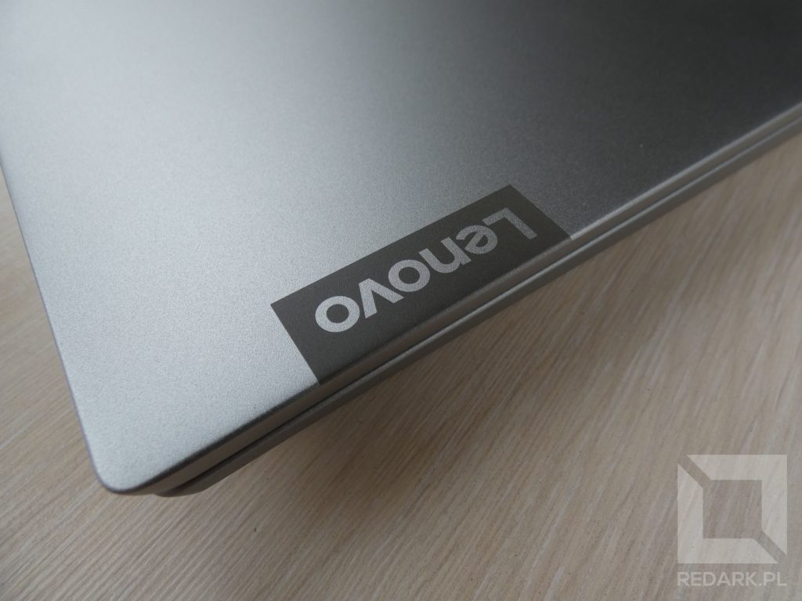
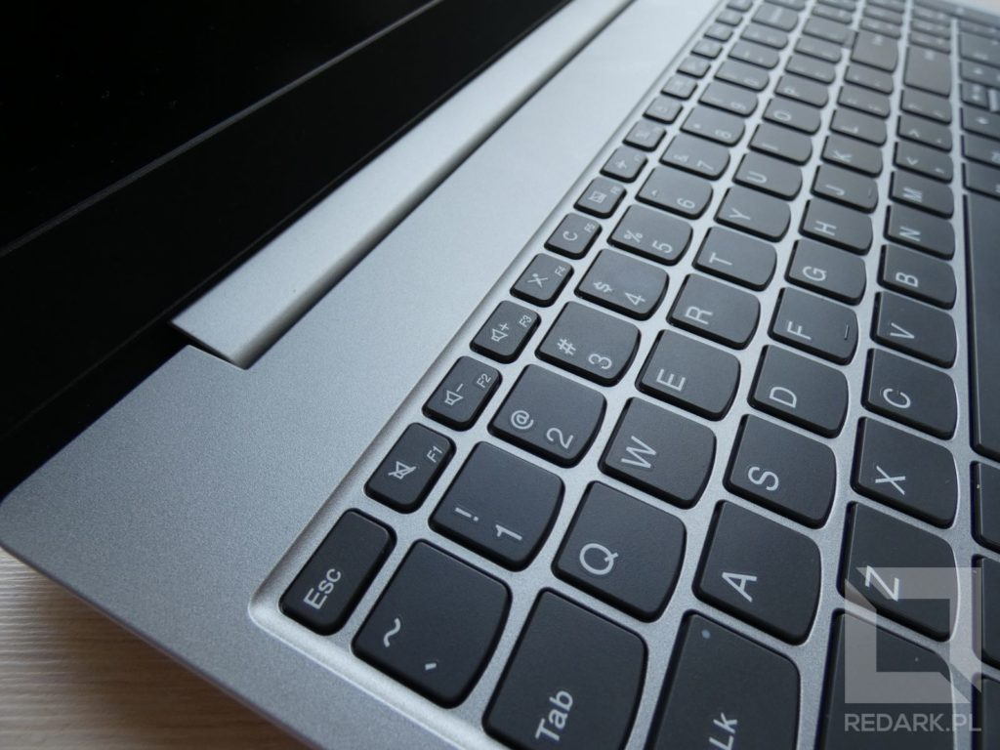
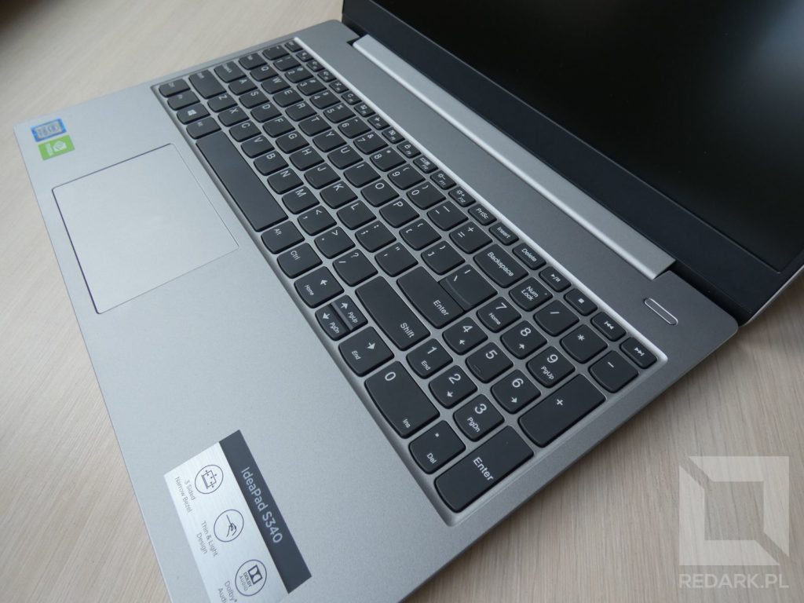
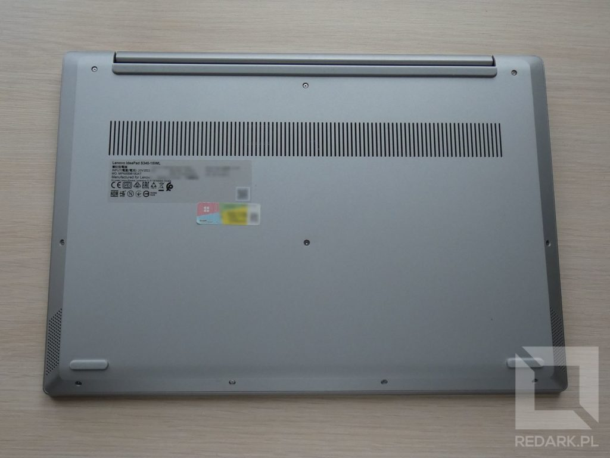
</Gallery>

Obudowa urządzenia posiada 358 mm szerokości i 245 mm wysokości, co w przypadku 15-calowców jest bardzo dobrym wynikiem. Waga urządzenia to 1,8 kilograma. U dołu urządzenia znajdziemy dużą kratkę wentylacyjną znajdującą się na całej szerokości urządzenia. Wylot gorącego powietrza nie znajduje się z boku urządzenia, a został ukryty w szczelinie zawiasu klapy.

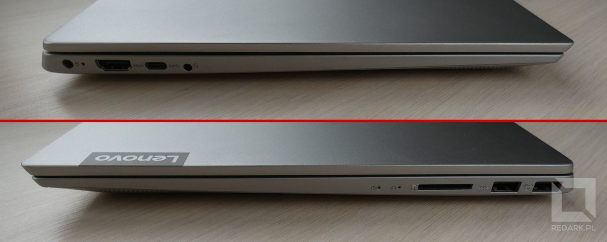

Jeśli chodzi o porty, znajdują się one na lewej i prawej krawędzi urządzenia. Lewa strona to po kolei: okrągłe gniazdo zasilania, HDMI, USB-C oraz combo audio jack 3,5 mm. Natomiast prawa to: 2 gniazda USB 3. generacji i czytnik kart SD. Jedyne, co mocno odrzucało mnie w zakupie modeli marki Lenovo, to ilość gniazd USB. Gniazd typu A mamy tutaj jedynie dwie sztuki i to w dodatku umieszczone obok siebie! W trakcie pracy w terenie często używam modemu LTE i musiałem wyposażyć się w krótki przedłużacz, aby chociaż móc podłączyć do laptopa jeszcze myszkę. Zastanawiam się również nad zakupem jakiegoś ekspandera portów na USB-C, ponieważ na razie nie mam dla tego gniazda jakiegoś innego zastosowania. W pewnych sytuacjach może też mnie pewnie zaboleć brak przewodowej karty sieciowej.

## Klawiatura

Z racji tego, że piszę bardzo dużo tekstu na komputerze, klawiatura stanowiła dla mnie jeden z kluczowych aspektów podczas wyboru nowego laptopa. Nie inaczej było w przypadku Lenovo. Klawiatura S340 posiada przyjemny skok, a klawisze są odpowiednio rozmieszczone oraz posiadają drobną chropowatość, co pozytywnie zwiększyło komfort pisania. Podoba mi się również eleganckie odcięcie kolorystyczne klawiatury od obudowy. Niektóre osoby pewnie zawiodą się brakiem podświetlenia klawiatury, ale mi kompletnie to nie przeszkadza.

<Gallery>

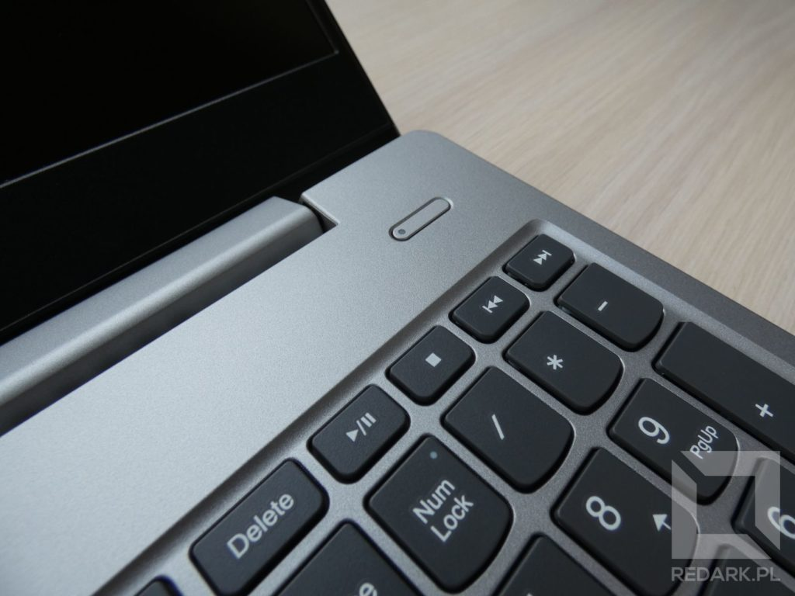
</Gallery>

Dużą zaletą jest dla mnie na przykład umieszczenie klawiszy Home, End, Page Up/Down jako druga funkcja strzałek. Przy odrobinie wprawy potrafi to mocno przyspieszyć nawigowanie w edytorach tekstu. Dodatkowo te same klawisze możemy znaleźć na nieaktywnym bloku numerycznym - do wyboru do koloru. Jedynym, drobnym minusem układu klawiatury, jaki znalazłem, jest trochę za krótki "Backspace", który mógłby zostać wydłużony np. kosztem klawisza tyldy. Podobny trick widywałem np. w laptopach Asusa.

U góry znajdziemy za to dedykowane klawisze do sterowania multimediami (których często brak w laptopach) oraz szereg przydatnych skrótów znajdujących się na klawiszach funkcyjnych. W Lenovo domyślnie to skróty są dominujące, a klawisze funkcyjne są aktywowane poprzez przytrzymanie klawisza "Fn". Na szczęście można to odwrócić w ustawieniach BIOS-u, co dla mnie było obowiązkowe. Po ich podmianie doceniam również regulację głośności, która znajduje się pod klawiszami F1, F2, F3. Dzięki temu nie muszę wykonywać szpagatu palcami, gdy chcę ściszyć muzykę.

<AdSense/>

Jeśli chodzi o znajdujący się pod klawiaturą gładzik, jest on również dobrze przemyślany. Jego powierzchnia jest wystarczająco duża oraz nie wywołuje nadmiernego tarcia. Przyciski ukryte w dolnych narożnikach mają przyjemny i wyraźny skok. Gładzik wspiera natywne gesty systemu Windows 10 i nie zauważyłem problemów z ich interpretacją. Nad klawiaturą znajdziemy dedykowany przycisk zasilania z białą diodą LED. Miło, że jeszcze ktoś nie wciska go na siłę gdzieś obok klawisza Delete. Przycisk jest wąski i ma średnio wyczuwalny skok, ale przynajmniej jest.

## Podzespoły

Na pokładzie znajdziemy procesor Intel Core i5-8265U oraz grafikę Nvidia GeForce MX250, która uruchamiana jest w przypadku dużego zapotrzebowania na moc obliczeniową. Dane użytkownika przechowywane są na dysku SSD 512 GB wspierającym technologię NVMe i zamontowanym w gnieździe M.2 (maksymalny [rozmiar modułu to 2280](/dyski-ssd-m2)). Wewnątrz urządzenia na użytkownika czeka również wolny slot na [dyski 2.5" z interfejsem SATA](/nosniki-pamieci-dyski-hdd-ssd) na dalsze rozbudowy.

<Gallery>
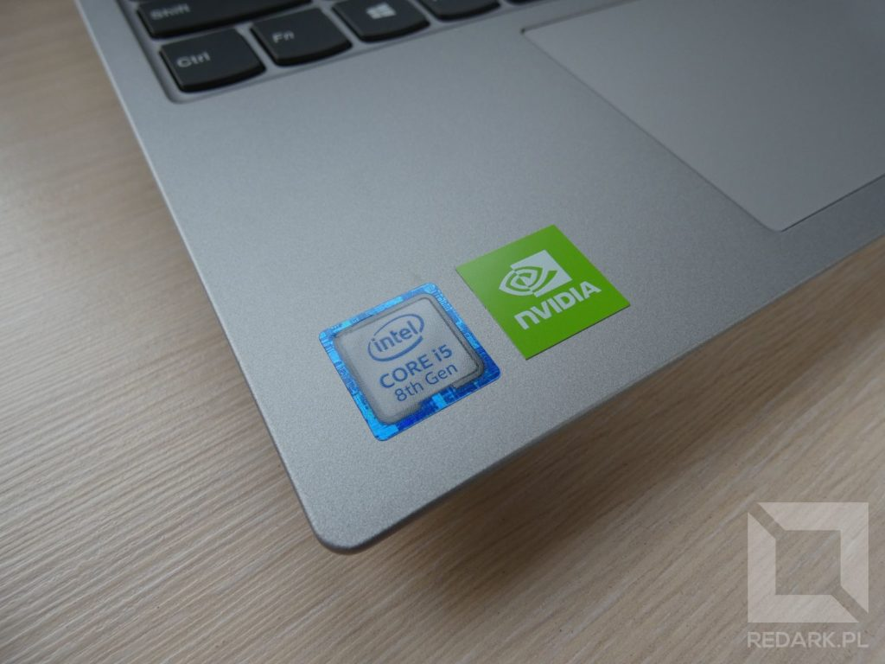
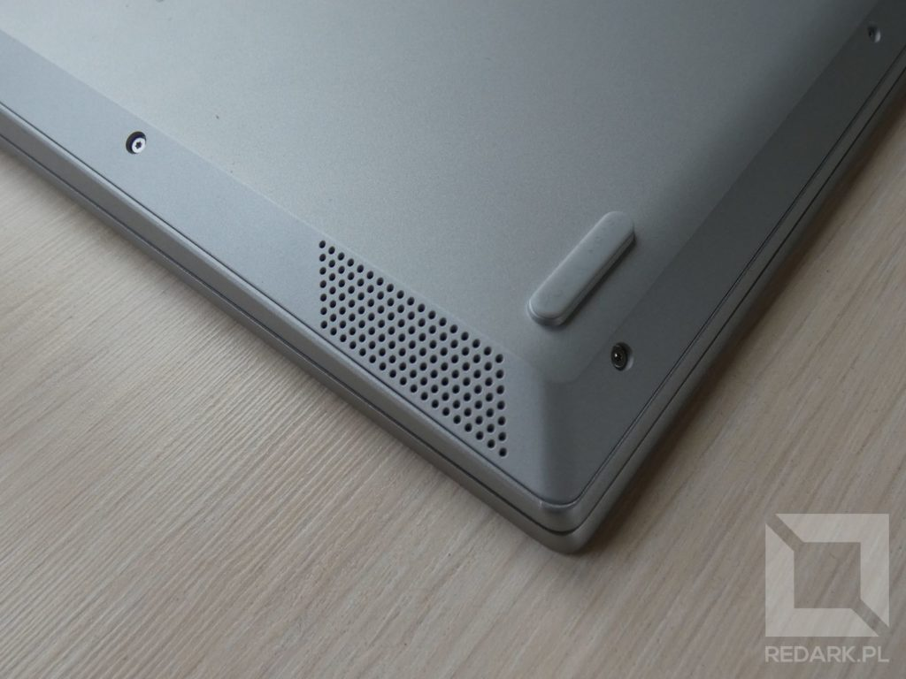
</Gallery>

W kwestii pamięci operacyjnej laptop posiada [jeden slot SO-DIMM DDR4](/pamieci-ram) oraz moduł 4 GB wlutowany w płytę główną. Mój model ma 8 GB pamięci, czyli w gnieździe został zamontowany moduł 4 GB. Analogicznie pamięć Lenovo można w przyszłości rozbudować do 12 lub maksymalnie 20 Gigabajtów. Trochę szkoda, że nie mamy tutaj drugiego gniazda pamięci RAM, ale nie można powiedzieć, że Lenovo nie zrobiło wszystkiego, co mogło. Zobaczcie tylko, jak umiejętnie wykorzystali oni przestrzeń urządzenia:

<YouTube id='TIz3oMRHTpE' title='Lenovo Ideapad S340-15'></YouTube>

Oprócz tego S340 oferuje komunikację bezprzewodową Wi-Fi 802.11ac oraz Bluetooth 4.2. Zespół chłodzący urządzenie działał bardzo dobrze i umiejętnie sterował prędkością obrotową wentylatora, choć ewidentnie wykorzystywał on sztuczkę polegającą na obniżaniu zegarów taktowania procesora po nagrzaniu. W kwestii audio Lenovo S340 otrzymał dwa skierowanie do dołu głośniki stereo, których jakość oraz maksymalna głośność bardzo pozytywnie mnie zaskoczyła.

## Ekran

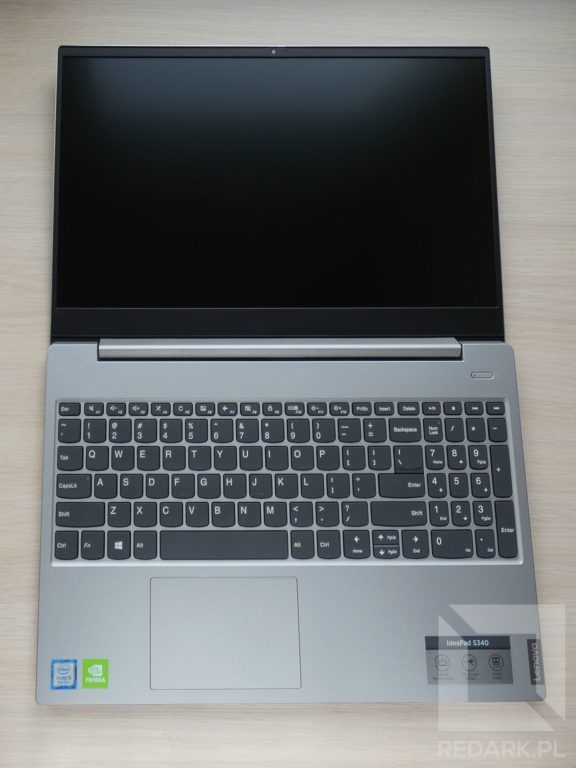

<ImageDescription>Lenovo IdeaPad S340-15 w pełnej okazałości - ekran został położony na płasko</ImageDescription>

Laptop wyposażony jest w 15-calowy ekran o rozdzielczości 1920x1080 wykonany w technologii TN i pokryty matową powłoką. Tak, jak przyzwyczaił nas TN, rewelacji nie będzie. Kąty widzenia są bardzo wąskie, a kontrast tragiczny. Na szczęście Lenovo postanowiło udobruchać użytkowników innymi zaletami. Ekran posiada dobre podświetlenie matrycy oraz bardzo wąskie ramki. 5 milimetrów po bokach i dziesięć u góry. Zawias klapy umożliwia natomiast położenie ekranu prawie na płasko, co na pewno przyda się przy wąskich kątach widzenia.

Miła niespodzianka czeka również nad ekranem. Tuż nad kamerą internetową o rozdzielczości 1 Mpix znajduje się mini suwak. Służy on do sterowania wbudowaną zaślepką, która przysłoni oko kamery, gdy ta nie jest nam potrzebna. Mechanizm działa rewelacyjne i wygląda bardzo elegancko. Koniec z dziwnymi naklejkami, które nie dość, że szpeciły wygląd urządzenia, to jeszcze brudziły obiektyw klejem. Dlaczego więcej modeli nie posiada takiego bajeru, hmm?

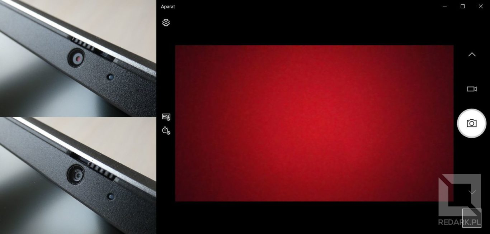

<ImageDescription>Poświata półprzeźroczystej czerwonej kropki znajdującej się na przysłonie obiektywu przypomina o konieczności odsłonięcia kamerki</ImageDescription>

Tutaj muszę Wam jeszcze powiedzieć o pewnej przykrej niespodziance, jaką zgotowało mi Lenovo. Pewnego dnia chciałem popracować z tym laptopem na dwóch ekranach jednocześnie. Podpinam monitor i nic. Podpinam drugi, trzeci, wymieniam kable i dalej nic! Gniazdo HDMI nie odpowiadało, więc jako informatyk zacząłem eksperymentować ze sterownikami oraz sprawdziłem ustawienia w BIOS-ie. Nadal nic. Gdy sprzęt miał już trafić do reklamacji, sprawdziłem fora pod kątem tego konkretnego modelu. Co się okazało? Winowajcą było jedno DOMYŚLNE ustawienie bootwania systemu w BIOS-ie, które kompletnie nie było związane z grafiką. Dlatego, gdy spotka Was ten sam problem, proszę, **zmieńcie od razu "Boot mode" z "Legacy" na "UEFI"**, a oszczędzicie sobie wiele nerwów. Natomiast firmie Lenovo gratuluję wypuszczenia urządzeń z domyślnie ustawioną błędną konfiguracją.

<AdSense/>

## Praca na baterii

Do ładowania urządzenia służy dołączona do zestawu 65-watowa ładowarka wyposażona w przewody o łącznej długości 2,5 metra. Czas ładowania urządzenia, podczas gdy nie jest ono używane, wyniósł niespełna 2 godziny. Przy mojej codziennej pracy ogniwo starczyło jedynie na niewiele ponad 4 godziny pracy bez ładowarki. Szkoda, liczyłem na wyniki bliżej 6 godzin, zwłaszcza po przeczytaniu wielu pozytywnych opinii na temat tego modelu.

W kwestii zasilania producent dołożył jeszcze parę ciekawych bajerów. Pierwszym z nich jest mruganie diod zasilania, gdy poziom baterii spadnie poniżej 20%. Robi to zarówno dioda przy klawiaturze, jak i ta z boku urządzenia. Robi się z tego mini dyskoteka, zwłaszcza że animacja nie wyłącza się po podłączeniu ładowarki (co jeszcze bardziej mnie śmieszy). Diody uspokoją się, dopiero gdy bateria podładuje się do minimum 20%. Trochę to dziwne.

<Gallery>
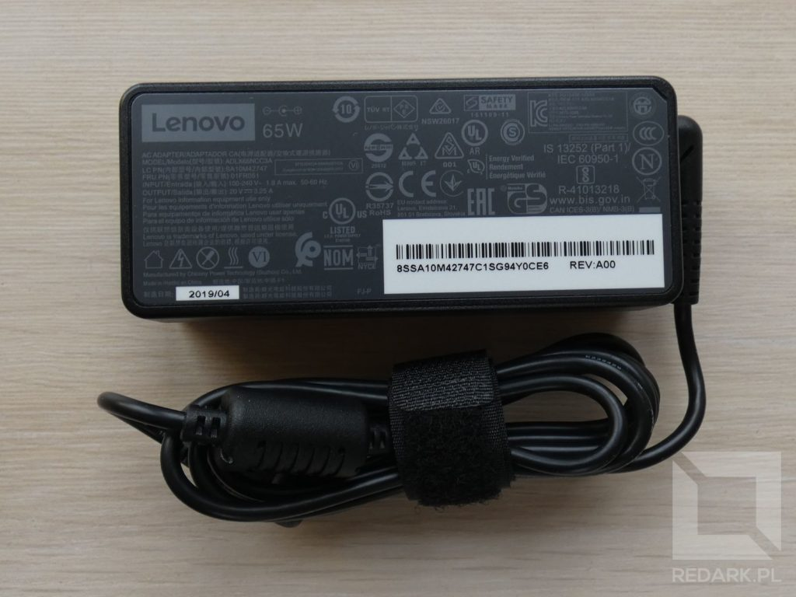
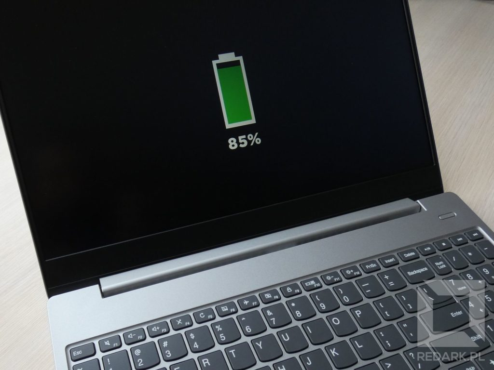
</Gallery>

Drugi i trzeci dodatek jest znacznie ciekawszy. Naciśnięcie któregokolwiek klawisza na klawiaturze, gdy laptop jest wyłączony, pozwala na szybkie wyświetlenie na ekranie poziomu naładowania baterii. Bardzo praktyczna rzecz, ponieważ nie raz zdarzało mi się uruchamiać specjalnie laptopa tylko po to, aby sprawdzić, ile baterii mu zostało. Ostatnim dodatkiem jest jedno stale zasilane USB typu A. Dzięki temu możemy używać Lenovo jako dużego powerbank'a i podładować sobie nim telefon. Obie opcje mogą zostać wyłączone w ustawieniach BIOS'u.

## Podsumowanie

Podsumowując, laptop Lenovo IdeaPad S340-15 to dobrze zaprojektowane urządzenie z wieloma ciekawymi gadżetami. Ogólny wizerunek urządzenia z pewnością psuje zastosowana w nim matryca TN oraz przeciętny czas pracy na baterii. Mimo to uważam, że jest to bardzo przyzwoite urządzenie i z pewnością posłuży mi przez najbliższe lata podczas pracy w terenie. Serdecznie polecam.

Plusy:

<GoodList>
- Smukły i elegancki wygląd
- Wbudowana zaślepka kamery
- Dobrej jakości klawiatura i gładzik
- Stale zasilany port USB
- Wąskie ramki oraz ekran 180 stopni
- Dodatkowy slot SATA 2.5"
</GoodList>

Wady:

<BadList>
- Słaba matryca TN
- Uboga ilość portów USB
- Tylko jeden slot na pamięć RAM
- Słaby czas pracy na baterii
</BadList>
