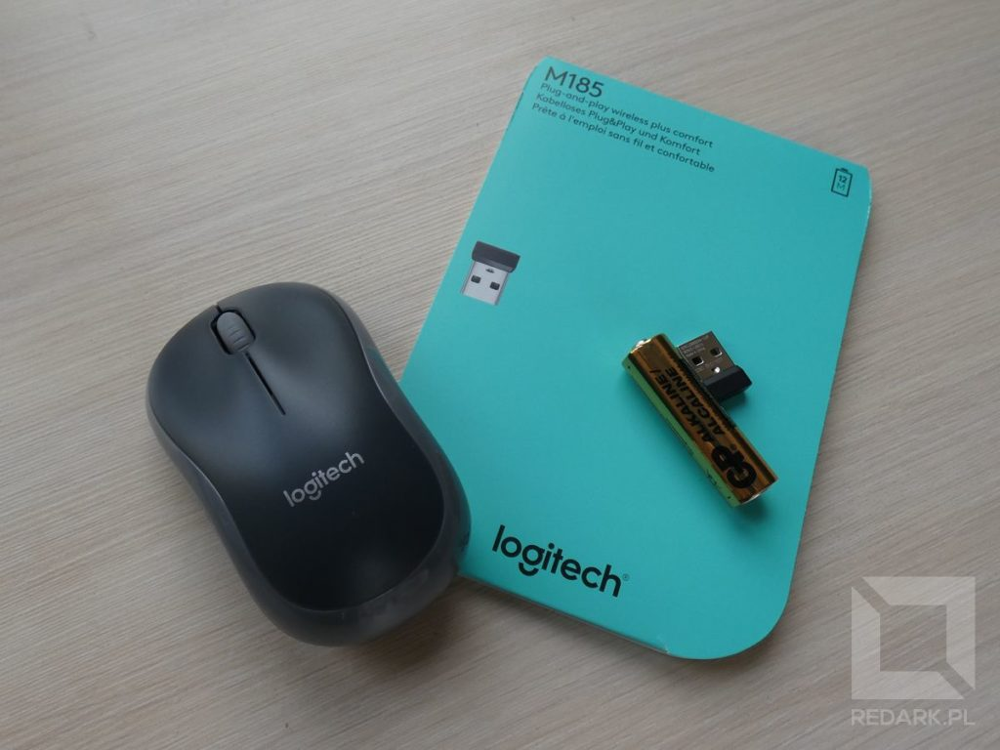
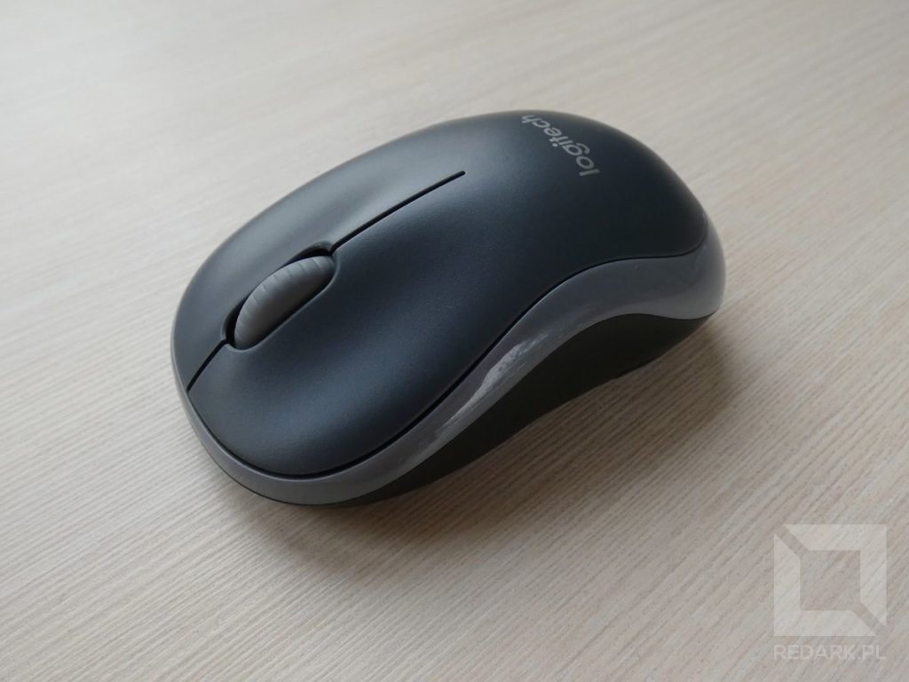
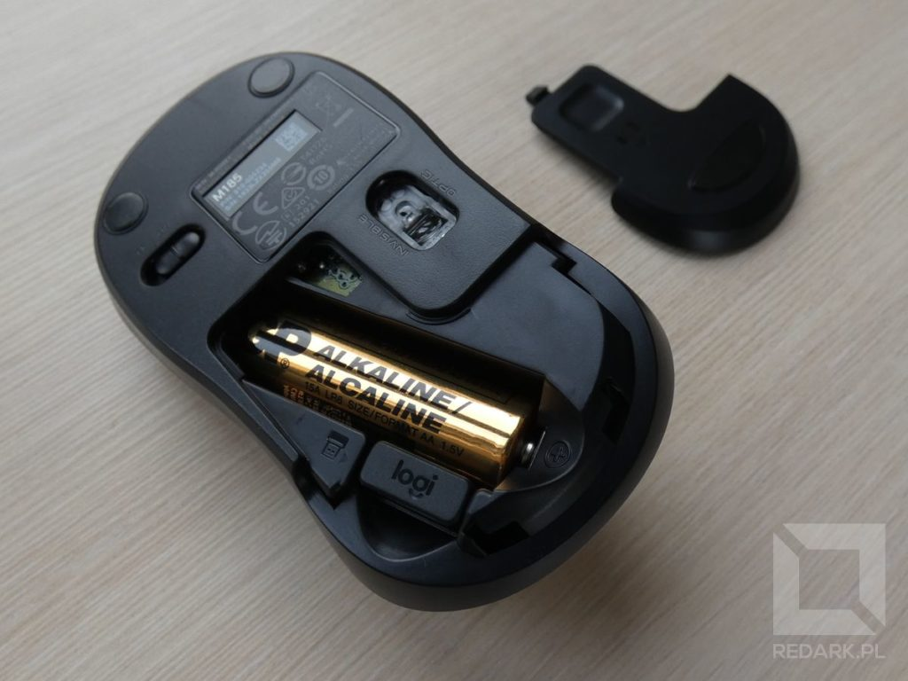
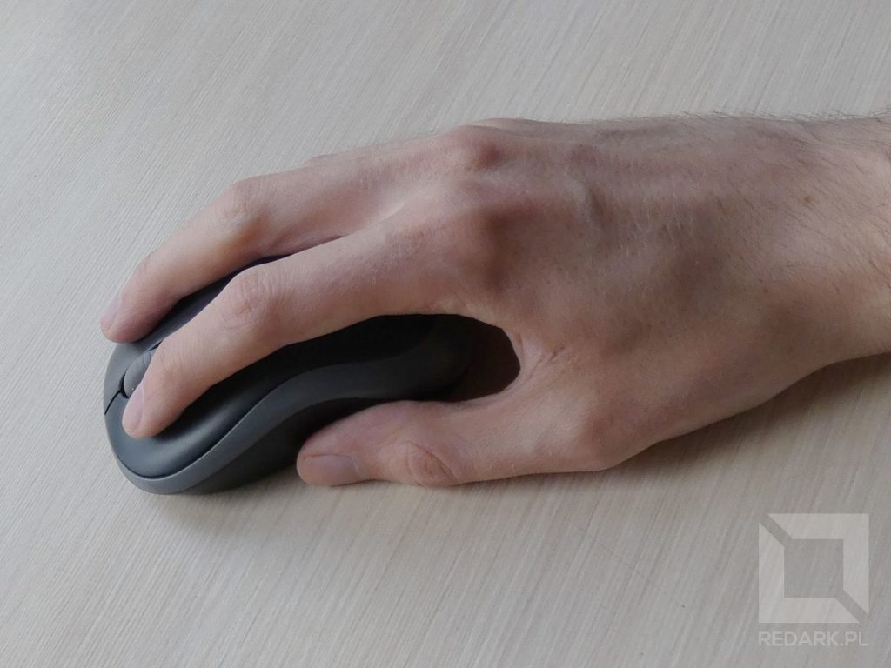

Choć nie planowałem zakupu nowego gryzonia do laptopa, traf chciał, że za sprawą tygodnia laptopów w [x-kom](https://www.x-kom.pl/) w moje ręce gratisowo trafił Logitech M185. Zatem sprawdźmy, co tym razem zaoferował szwajcarski producent peryferiów komputerowych.

## Zawartość opakowania

Urządzenie przychodzi do nas w plastikowym opakowaniu z klasycznym dla tego typu sprzętu zestawem akcesoriów. Znajdziemy tu odrobinę papierologii, baterię AA, nano odbiornik radiowy na USB oraz samą mysz M185.

## Wykonanie i pierwsze wrażenia

Model M185 nie różni się dużo od pozostałych urządzeń Logitecha. Mamy tutaj charakterystyczne połączenie czarnego matowego plastiku z błyszczącymi szarymi akcentami. Mysz posiada trzy podstawowe przyciski. Lewy, prawy oraz środkowy schowany pod wykonaną w całości z plastiku rolką. Wszystkie trzy przyciski chodzą bardzo dobrze i zbytnio nie hałasują.

Chwyt gryzonia poprawiają znajdujące się w połowie boków urządzenia wgłębienia. Według mnie mogłyby być one płytsze, ponieważ w przypadku moich dużych dłoni, wgłębienia utrudniały dobre pozycjonowanie palców na przyciskach. Bardziej odpowiada mi płaska konstrukcja, np. [myszy Microsoft Mouse 1850](/microsoft-mouse-1850-unboxing-recenzja), ale czas pokaże, czy może jednak przyzwyczaję się do tego kształtu.

<AdSense/>

## Spód urządzenia

U dołu urządzenia standardowo znajdziemy przełącznik ON/OFF, sensor optyczny (co ciekawe jest on niewidoczny dla ludzkiego oka) oraz wysuwaną do tyłu klapkę baterii. Ogniwo jest ułożone po skosie, a obok niego znajdziemy miejsce na ukrycie nano odbiornika. Wyważenie urządzenia jest wzorowe, ale martwi mnie komfort korzystania z wyłącznika myszy. Jest on mały, śliski, i posiada jedynie malutką wypustkę na środku.

## Wnioski po miesiącu użytkowania

Od rozpakowania myszy minął już ponad miesiąc i mam parę "ale" co do działania urządzenia, jednak zacznę od dobrych wiadomości. Wgłębienia w bokach urządzenia przestały mi aż tak bardzo przeszkadzać, jak było to na początku użytkowania urządzenia. Mysz pewnie trzyma się w dłoni i bardzo dobrze "jeździ" po blacie. Nie doświadczyłem problemów ze zrywaniem komunikacji bezprzewodowej oraz skakania kursora, tak jak to miało miejsce w przypadku [gryzonia od Microsoftu](/microsoft-mouse-1850-unboxing-recenzja). Światło sensora faktycznie jest niewidzialne, ale tak jak informuje napis obok niego, jest to jedynie sensor optyczny, czyli nie mamy co liczyć na poprawne działanie myszy na szklanym blacie.

Tyle zalet, teraz czas na wady. Po pierwsze nie wiedzieć czemu, LPM w moim egzemplarzu zaczął piszczeć (niczym prawdziwa mysz), gdy naciskam go blisko środkowej rolki. Rozwiązanie problemu stanowi zmiana pozycji nacisku palca, ale takie coś nie powinno wydarzyć się w nowym urządzeniu. Po drugie, faktycznie przełącznik myszy okazał się ciężko dostępny. Aby się do niego dostać, wymagana jest odrobina gimnastyki paznokciem. Moim zdaniem wadą jest też brak jakiejkolwiek informacji o tym, że urządzenie jest włączone. Brak diody zasilania, brak widocznego światła sensora, a nawet brak klasycznego kolorowego spodu przełącznika. Logitech bardzo często kolorował go na zielono lub czerwono, co było bardzo fajnym znacznikiem tego, że urządzenie jest uruchomione. Tutaj czegoś takiego mi zabrakło i zdarzało mi się pozostawić urządzenie niepotrzebnie włączone na wiele godzin.

Ostatnią sprawą jest wybudzanie komputera ze stanu uśpienia. Mysz, mimo odmówienia jej praw do wykonywania tej czynności, nadal to robiła. Każde uśpienie laptopa wymagało ode mnie odłączenia lub wyłączenia myszy. Tutaj na szczęście nastąpił happy end, ponieważ znalazłem rozwiązanie tego problemu. Otóż mysz M185 jest rozpoznawana w systemie jako mysz oraz... KLAWIATURA! Logitech cudownie zminimalizował koszty produkcji oprogramowania :D Jeśli zatem również macie problemy z wybudzaniem laptopa przez mysz Logitech, zajrzyjcie do listy podłączonych klawiatur i tam również odmówcie praw do wybudzania komputera, a problem zniknie :)

## Podsumowanie

Za około 60 złotych otrzymujemy standardową mysz Logitecha, która, choć nie pozbawiona wad (które za tę cenę można jej wybaczyć) oferuje dobre wykonanie oraz bezbłędne działanie. Jedynymi wadami urządzenia jest wspomniany w recenzji brak informacji o uruchomieniu myszy, słabo dostępny wyłącznik oraz piszczący momentami LPM, choć może to być wina jedynie mojego egzemplarza.
