Przez kilka lat, do transportowania swojego poprzedniego laptopa, używałem małej torby na ramię. Niestety, po załadowaniu do niej urządzenia zostawało już bardzo niewiele miejsca, a liczba rzeczy do noszenia ze sobą stale rosła. Wraz z zakupem [nowego laptopa](/recenzja-laptopa-lenovo-ideapad-s340-15) postanowiłem zacząć używać plecaka. Traf chciał, że wraz z nowym Lenovo [sklep x-kom](https://www.x-kom.pl) dorzucił [mysz bezprzewodową](/recenzja-myszy-logitech-m185) oraz torbę na ramię. Niemniej jednak, tak jak planowałem, zakupiłem plecak do transportowania nowego urządzenia, a z torby będę korzystać w wyjątkowych sytuacjach. Uznałem też, że jest to też idealny moment, aby porównać ze sobą oba akcesoria i przedstawić zalety oraz wady obu rozwiązań. Zatem zapraszam na test i porównanie torby **Targus Classic 15-16"** oraz plecaka **Targus CitySmart Professional**.

## Targus Classic 15-16"

Na początek zajmijmy się torbą na ramię. Model Classic, jak sama nazwa wskazuje, stawia na klasyczną konstrukcję składającą się z dwóch komór. Pierwsza, główna z rzepem na laptopa oraz druga znajdująca się na klapie. Możemy włożyć do niej akcesoria takie jak zasilacz czy mysz, a także np. długopisy, dla których przewidziano dedykowane mini kieszonki.

<Gallery width='2'>
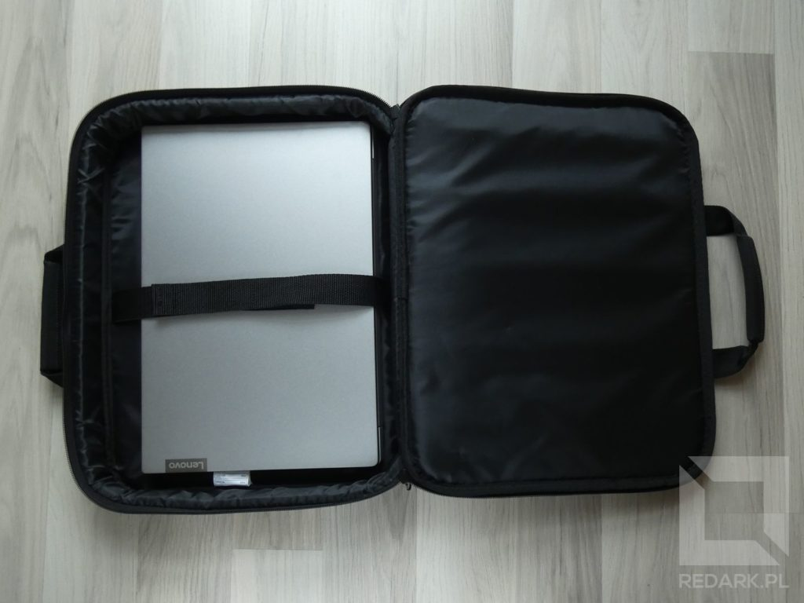
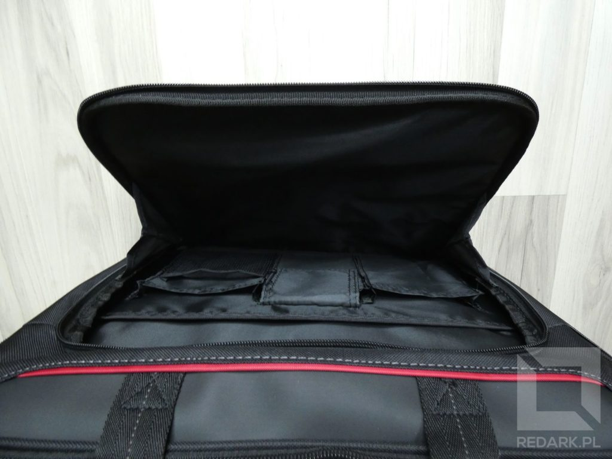
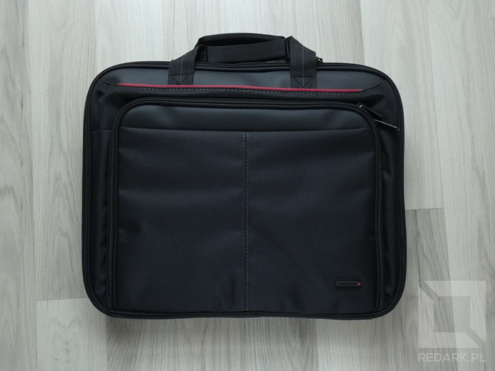
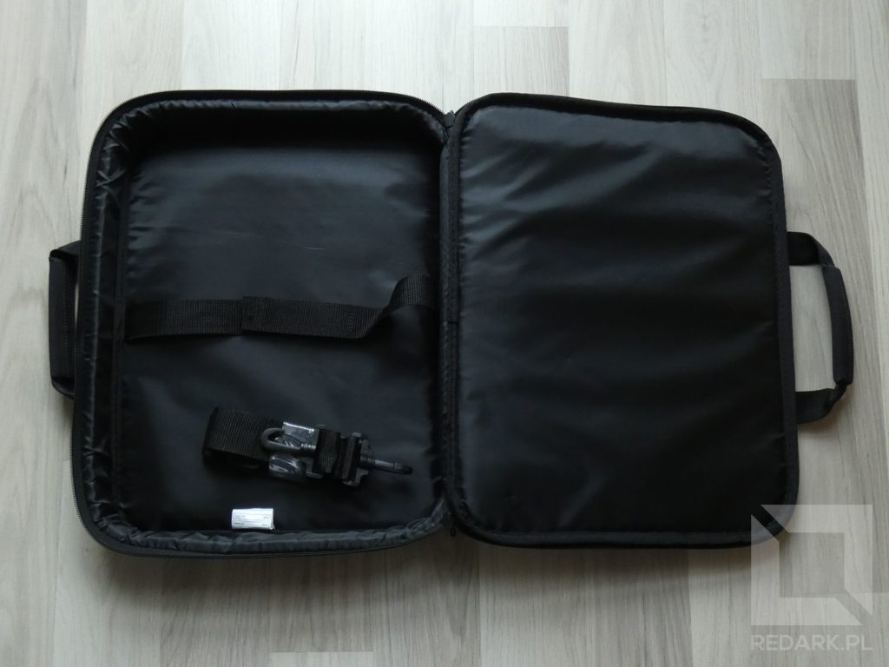
</Gallery>

Torba jest dobrze wykonana i z pewnością udźwignie niejeden ciężar. Martwi mnie jedynie zastosowanie przez producenta plastikowych karabińczyków paska. Z doświadczenia wiem, że takie po pewnym czasie lubią pękać. Małe "ale" mam również do rzepu trzymającego laptopa. Mój Lenovo okazał się chyba zbyt płaski na tę torbę i mimo maksymalnego ściśnięcia pasków wciąż miał on jeszcze odrobinę luzu, a sam rzep ledwo co trzymał.

<AdSense/>

## Targus CitySmart Professional

Czas na plecak. Od razu widać, że jest on znacznie bardziej rozbudowany niż torba na ramię. Idąc od strony pleców do "wierzchu" plecaka, znajdziemy:

- płaską komorę na laptopa,
- główną komorę z klapą odchylaną do góry,
- wzmocnioną mini kieszeń na okulary wyściełaną miękki materiałem,
- wzmocnioną kieszeń na delikatne akcesoria,
- kieszeń z siatką i przegrodami na akcesoria piśmiennicze,
- dwie kieszenie po bokach na butelki wody.

Co istotne nie jest to kolejny plecak, który gdy jest pusty, wygląda jak worek na śmieci. Cała jego konstrukcja jest wzmocniona, sztywna oraz zachowuje postawę pionową niezależnie od załadunku. Nie wierzyłem, ale sprawdziłem i faktycznie tak jest. Nieważne, czy znajdował się w nim tylko laptop, czy tylko akcesoria, czy wszystko razem - plecak zawsze pewnie stał pionowo i nie dawał się tak łatwo przewrócić. Nawet przy wielokilogramowym obciążeniu, konstrukcja zapewniała pewny chwyt i komfort noszenia.

<Gallery width='2'>
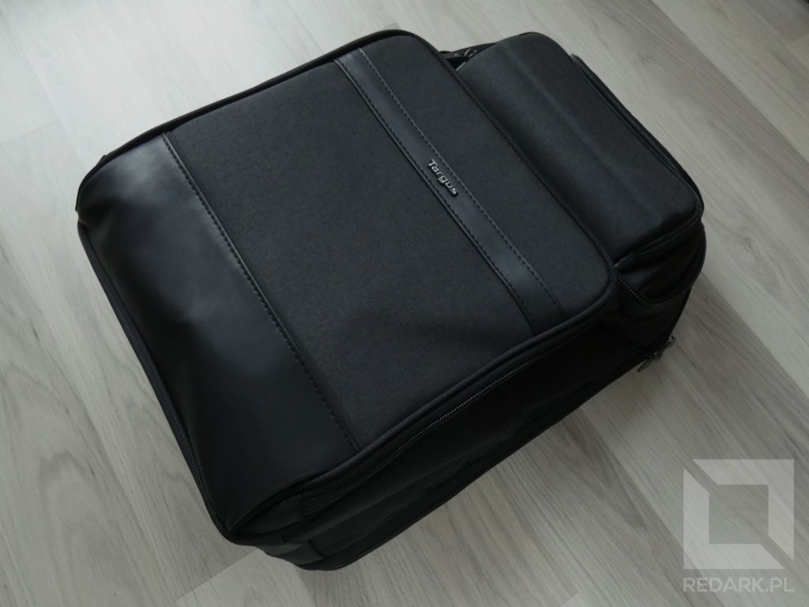
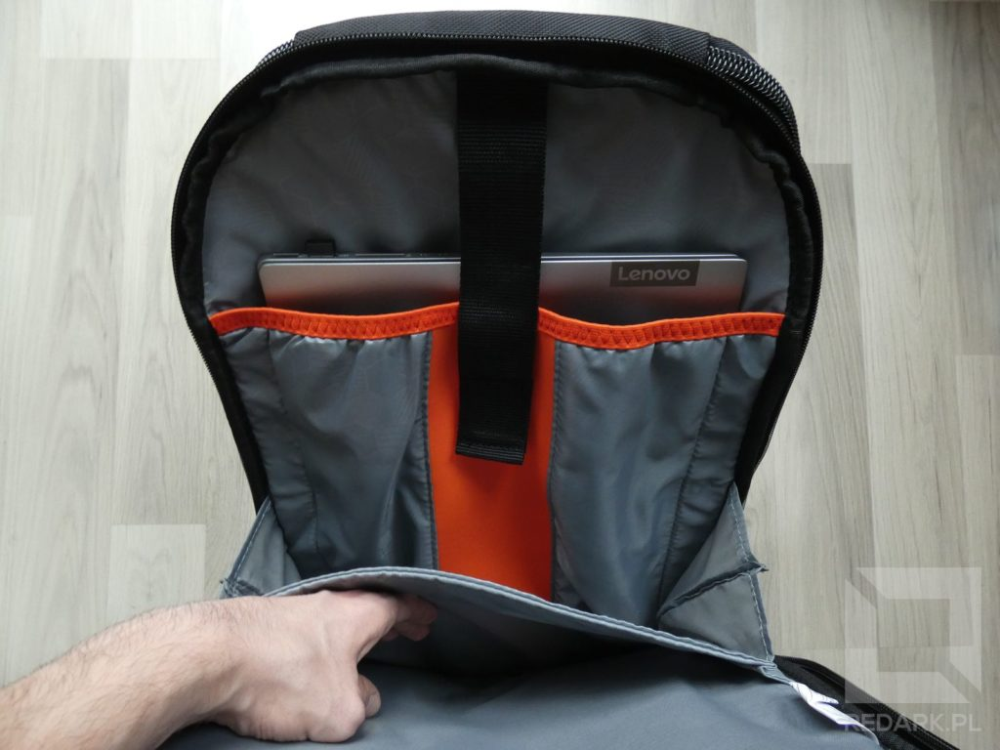
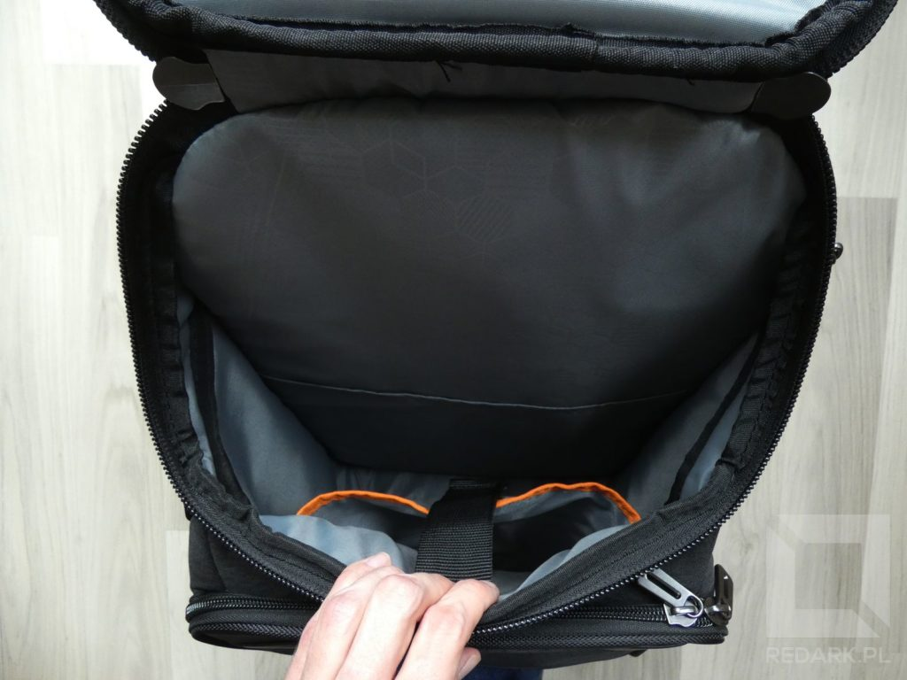
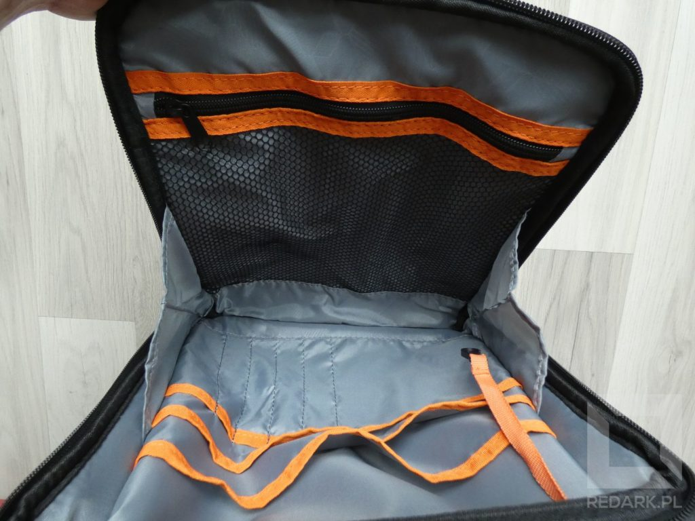
</Gallery>

Funkcjonalność akcesorium zwiększają wspomniane już wcześniej dwie wzmocnione kieszenie. Pierwsza z nich jest umieszczona na samym szczycie plecaka, posiada miękkie wyściełanie, a jej kształt jest idealnie wyprofilowany pod przechowywanie okularów przeciwsłonecznych. Druga komora, znajdująca się poniżej, również posiada na swojej klapie wzmocnienie skutecznie chroniące zawartość przed zgnieceniem. W pozostałych komorach znajdziemy przeróżne kieszenie z rzepami i zamkami błyskawicznymi. Znajdziemy tam również karabińczyk z paskiem do przyczepienia np. kluczy od domu.

<Gallery width='2'>
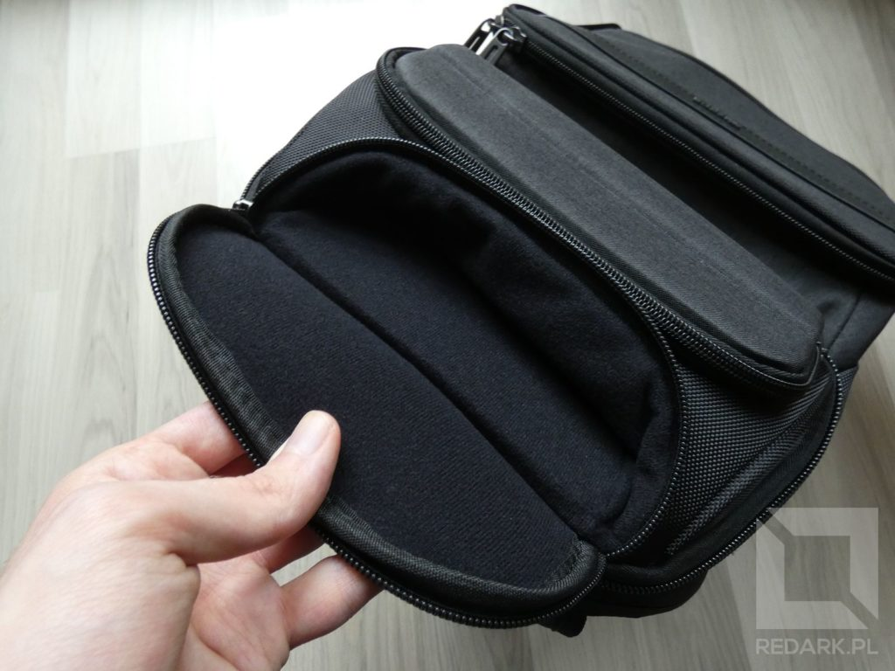
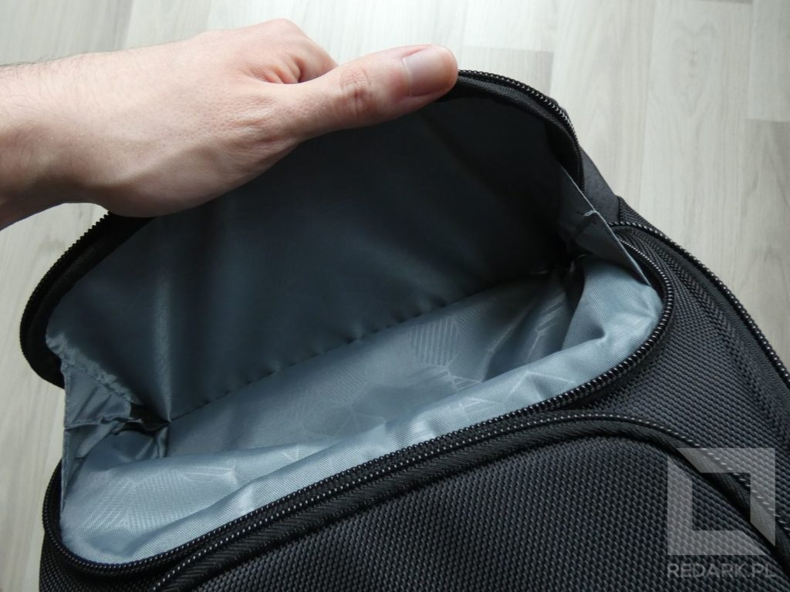
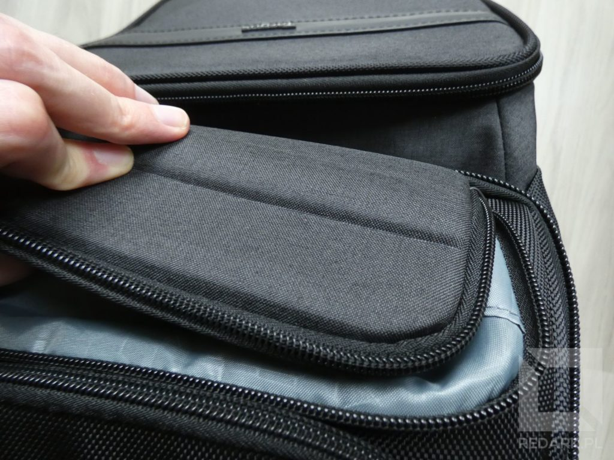

</Gallery>

Pasy na ramiona są szerokie i wygodne, a gąbka, która jest dociskana do naszych pleców, jest gruba i nie zapada się tak łatwo, co zapewnia dobrą cyrkulację powietrza. Komfort noszenia poprawia również z pozoru błaha różnica, a mianowicie to, że kieszeń laptopa nie jest przyczepiona do naszych pleców. Poprawia to wyważenie plecaka, bezpieczeństwo urządzenia, a także sprawia, że nie czujemy wielkiej twardej blachy naciskającej na nasz kręgosłup.

<AdSense/>

No dobra, a czy znalazłem w nim wady? Niby tak, ale mówienie o nich jako o wadach podchodzi już chyba pod czepialstwo. Zamek błyskawiczny głównej komory jest duży i masywny, a co za tym idzie, trochę topornie okrąża się nim klapę głównej komory od dołu. Duże gabaryty plecaka niejednokrotnie utrudniały mi również przejście przez wąskie przejścia w sklepach. Niemniej jednak jeśli do dzisiaj zdarza mi się patrzeć na ten plecak i podziwiać jego przemyślaną konstrukcję, to musi coś być na rzeczy. Według mnie jest on idealny i serdecznie go wszystkim polecam.

## Torba czy plecak?

Czas więc odpowiedzieć na pytanie: wybrać torbę czy plecak? Odpowiedź pewnie już znacie, ale krótko to jeszcze podsumuję.

**Torba** zapewnia podstawową ładowność oraz bardzo kompaktowe rozmiary. Niestety choćby producenci stawali na rzęsach, nie zapewnią im dobrej pojemności. Wynika to zarówno z ich konstrukcji, jak i faktu, że całość noszona jest tylko na jednym ramieniu. To też powoduje, że dłuższe noszenie ciężkiej torby jest dla organizmu męczące. Noga, o którą w pewnym stopniu torba się też obija, również nie będzie zadowolona.

<GoodList>
- Kompaktowe rozmiary i wysoka mobilność
- Przeciętna ładowność sprawdzająca się w codziennych zastosowaniach
- Niska cena (od 70 do 150 złotych)
</GoodList>

<BadList>
- Niski komfort noszenia oraz nierówne rozłożenie ciężaru
- Ograniczona ładowność np. brak miejsca na butelkę wody
</BadList>

**Plecak** z kolei daje dużo większe możliwości. Posiada również bardzo dużo różnych konstrukcji, które można dobrać do swoich preferencji oraz potrzeb. Mała, płaska konstrukcja będzie mobilna i lekka, ale zapewni mniejszą ładowność. Duży plecak pozwoli zabrać wszystko, co potrzebne na długie wyprawy, ale będzie znacznie cięższy i nie pozwoli np. siąść na krześle bez jego zdejmowania. Nieocenioną zaletą jest również symetryczne rozłożenie ciężaru na oba ramiona oraz szereg przeróżnych udogodnień producenta. Mowa tutaj o ochronnych kieszeniach, płaszczach przeciwdeszczowych, otworach na kable oraz wbudowanych portach USB do ładowania telefonów. W sklepach można również znaleźć różne hybrydy, czyli plecaki, które mogą być szybko "przełączone" w torby naramienne.

<GoodList>
- Ogromna ładowność oraz duża ilość kieszeni (również na butelkę wody)
- Dodatkowe funkcjonalności i akcesoria dołączane przez producentów
- Znacznie większy komfort noszenia - nawet ciężkich rzeczy
</GoodList>

<BadList>
- Duże rozmiary i mała mobilność (np. brak możliwości oparcia się lub nawet siedzenia bez zdejmowania)
- Latem problemem może okazać się potliwość pleców, choć zależy to od modelu plecaka
- Wyższa cena (od 180 do 300 złotych)
</BadList>

Jaki jest mój wybór? Tak jak mówiłem. Przerzuciłem się na plecak, ponieważ potrzebowałem móc przenosić dużą ilość rzeczy i akcesoriów do laptopa. Jeśli natomiast nie będę miał aż tak dużo do zabrania, a ważniejsza będzie dla mnie mobilność, bez zawahania się ponownie sięgnę po torbę na ramię.
