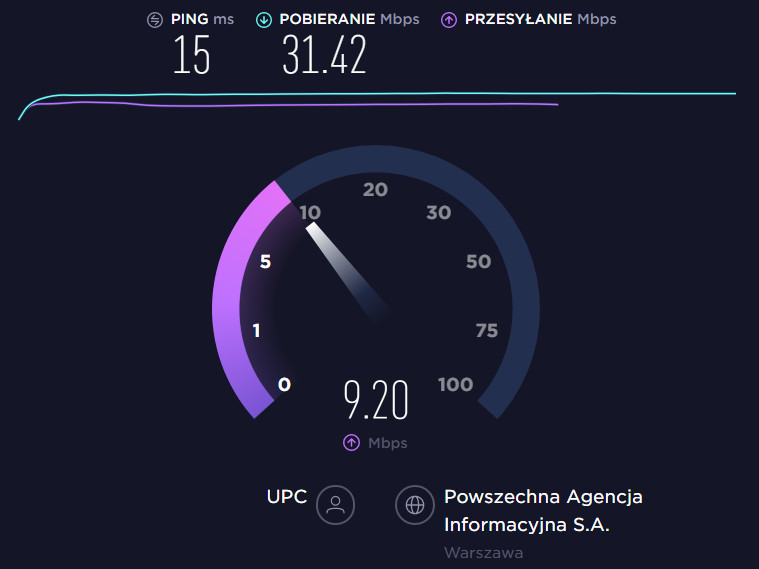
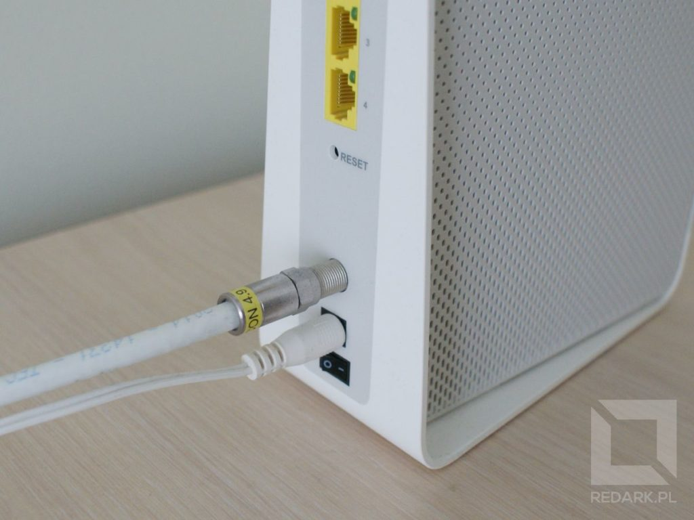
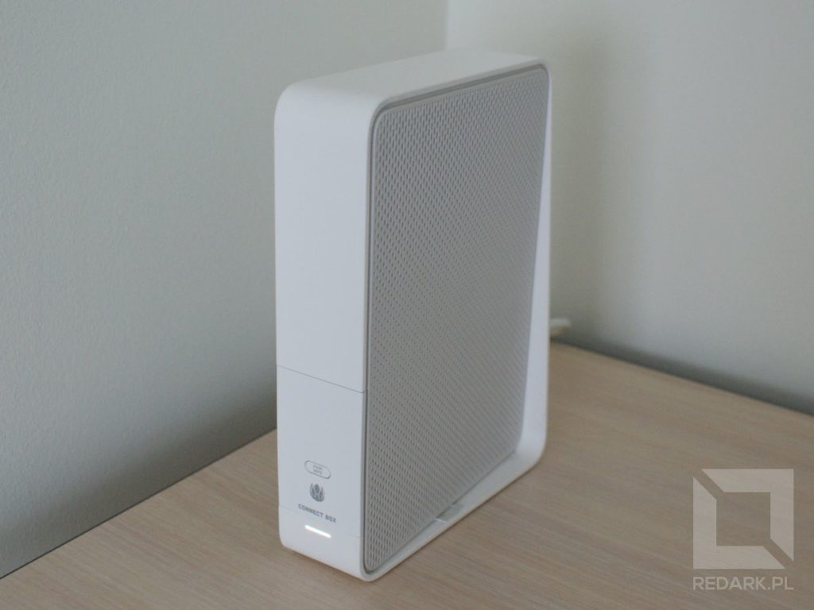

Czy wyobrażacie sobie dzisiaj życie bez dostępu do globalnej sieci komputerów? Chyba nie. Łącze internetowe stało się tak samo podstawowym medium, jak woda czy prąd. Co ciekawsze, mimo tak dobrze rozbudowanej infrastruktury, nadal zdarzają się miejsca, w których ciężko jest o dobre przyłącze. Dodatkowo długie okresy trwania umów abonamentowych sprawiają, że szybka i częsta zmiana dostawców nie jest możliwa. Dlatego też tak ważne jest znalezienie dobrego dostawcy już za pierwszym razem.

## Jakie mamy możliwości?

### Lokalny rynek dostawców

Na początek musimy zorientować się w lokalnym rynku dostawców usług internetowych. Jest to indywidualna sprawa uzależniona od infrastruktury znajdującej się wokół Waszego miejsca zamieszkania. W tym celu najlepiej popytać sąsiadów. Z jakich usług oni korzystają, jak się one sprawują oraz czy wiedzą jak wyglądają oferty konkurencji. W blokach mieszkalnych, na klatce schodowej oraz w piwnicy możemy znaleźć skrzynki rozdzielcze konkretnych dostawców. W przypadku domków rodzinnych można się pokusić o rozejrzenie się wokół drogi w poszukiwaniu takich samych rozdzielni, choć tutaj może być znacznie ciężej je znaleźć. Wielu dostawców prowadzi swoje kable po słupach energetycznych, a rozdzielnie ukrywa w studniach telekomunikacyjnych pod ziemią.

Innym sposobem jest wyszukiwanie ofert przez internet. Wystarczy wpisać w wyszukiwarkę "internet Warszawa ulica ...". Na stronach dostawców internetu znajdziemy często specjalny formularz, w którym możemy zweryfikować, czy możliwe jest wykonanie przyłącza pod naszym adresem. Jeśli chodzi o rodzaje dostawców, wyszczególniłbym trzy rodzaje:

- ogólnopolscy dostawcy tacy jak UPC, Orange czy Netia,
- lokalni dostawcy oferujący usługi tylko w danym mieście i okolicy,
- operatorzy telefonii komórkowej wraz z internetem mobilnym.

<InfoBlock>Oprócz tego można jeszcze spotkać lokalnych dostawców internetu radiowego, ale są oni obecnie już bardzo rzadko spotykani i w dodatku oferują często śmieszne już prędkości pokroju 2 Mbps za 50 złotych.</InfoBlock>

### Który dostawca jest lepszy?

Odpowiedzenie na to pytanie wcale nie jest takie proste. Ogólnopolscy giganci mają bardzo rozbudowane infrastruktury, ale z racji na dużą liczbę odbiorców, administrowanie i utrzymywanie w ryzach takiej sieci nie jest łatwe. Taki operator nie zawsze jest w stanie zapewnić wysoki poziom usług, a już na pewno nie wszystkim. Każdy, kto próbował się dodzwonić na infolinie pomocy technicznej, wie o czym mówię. Uwierzcie mi, praca w usługach telekomunikacyjnych jest naprawdę niewdzięczna. Choćby nie wiem, jak się starali, zawsze ktoś będzie niezadowolony.

W kwestii dostawców lokalnych jest już trochę lepiej. Operują oni na znacznie mniejszych obszarach, mają "bliższy kontakt" z klientami i są w stanie zapewnić mniej zawodne usługi. Infrastruktura sieciowa również może być również dobrze rozbudowana. Sam osobiście znam operatora, który dzięki wykorzystaniu dotacji unijnych skutecznie wyparł z dużej części rejonu rządzącą przez lata miejscową spółdzielnię mieszkaniową. Niemniej jednak do lokalnych dostawców zawsze należy podchodzić z dozą nieufności, ponieważ czasami, zamiast lokalnego przedsiębiorcy możemy trafić, mówiąc w skrócie, na Janusza, który serwuje paru blokom internet na rozpadających się kablach. Wszystko oczywiście możecie zweryfikować zasięgając języka u sąsiadów lub szukając opinii w internecie.

Szukasz internetu mobilnego? Porady dotyczące wyboru operatora sieci komórkowej oraz jego oferty internetu mobilnego znajdziesz [w tym artykule](/jak-dobrze-wybrac-internet-mobilny).

<AdSense/>

## Parametry łącza internetowego

O tym, jakiego dostawcę wybrać będą decydowały oczywiście parametry. Na początek weźmy tylko te stricte powiązane z łączem internetowym, natomiast w następnym podpunkcie zajmiemy się umowami oraz kwestiami technicznymi.

### Prędkość pobierania i wysyłania

Każdy z pewnością słyszał o pojęciach **download i upload**. Są to dwie podstawowe wartości określające szybkość naszego internetu. Pierwszy określa, z jaką szybkością jesteśmy w stanie pobierać informacje z internetu, a drugi jak szybko możemy je wysyłać. Dla standardowych użytkowników to download ma największe znaczenie, ponieważ my, jako odbiorcy treści, w większości pobieramy dane, a nie je wysyłamy. Gdy chcemy otworzyć jakąś stronę internetową, wysyłamy jedynie malutki tekst z zapytaniem o interesujący nas zasób internetowy, a serwer przysyła nam już gotowe pliki. Dla kogo ważny jest upload? Oczywiście dla osób, które przesyłają duże ilości danych do sieci, czyli są tak zwanymi "content creator'ami" (twórcami treści). Zaliczamy do nich przede wszystkim streamerów oraz youtuberów, czyli osoby, które operują materiałami wideo.

### Optymalna prędkość

Ile zatem powinna wynosić prędkość dzisiejszego internetu? Oczywiście najwyższa, na jaką możemy sobie pozwolić, ale oczywiście bez przesady w drugą stronę. Jeśli miałbym podawać konkretne liczby, to powiedziałbym, że do komfortowego przeglądania zwykłych stron www potrzebne będzie łącze minimum 10 Mbps. Gorzej jest z multimediami takimi jak filmy. Według obecnych zaleceń [serwisu Netflix](https://help.netflix.com/pl/node/306) do oglądania treści w jakości HD będziemy potrzebowali łącza minimum 5 Mbps, ale żeby móc włączyć jakość FullHD (najpopularniejszą rozdzielczość dzisiejszych monitorów) będziemy potrzebowali już 25 Mbps.

<ImageDescription>Prędkość obecnego internetu najłatwiej zweryfikować za pomocą popularnych "speed testów". Powyżej pomiar ze strony speedtest.net</ImageDescription>

Innym wymagającym medium będą gry komputerowe. Co ciekawe nie mówię tutaj o rozgrywkach multiplayer. W nich ważna jest stabilność połączenia oraz jak najkrótsza trasa do serwera docelowego, a nie przepustowość. Niemniej jednak gry wymagają szybkiego łącza ze względu na ich cyfrową dystrybucję oraz ilość aktualizacji, jakimi "karmią" je deweloperzy. Obecne tytuły oraz ich aktualizacje mogą ważyć dobrych kilkadziesiąt, jak nie kilkaset gigabajtów. Aby to zobrazować, weźmy jedną z ostatnich dużych gier, czyli **Call of Duty: Warzone**, którego sam tryb Battle Royale waży 83 GB, a pełna wersja gry aż 183 GB. Obliczymy zatem, na ile czasu musimy zostawić nasz komputer w spokoju, aby móc zagrać sobie, chociażby w tryb Warzone przy internecie 25 Mbps:

83 GB \* 8 = 664 Gb 
664 Gb \* 1024 = 679 936 Mb 
679 936 Mb / 25 Mbps = 27 197,44 s 
27 197,44 s / 3 600 = 7,55484 h

Z przeprowadzonych obliczeń wynika, że musimy zostawić włączony komputer na około siedem i pół godziny. Oczywiście zakładając, że nikt inny nie korzystał wtedy z łącza, serwery działały wzorowo, a jego prędkość łącza cały czas wynosiła idealne 25 Mbps. Oczywiście tak nigdy nie będzie. Realny czas pobierania będzie moim zdaniem wynosił gdzieś minimum 9 godzin. Później oczywiście deweloperzy wypuszczą łatkę i znowu będziemy musieli czekać. Fajnie nie? W dodatku to jest tylko jeden z trybów tej gry. Na pobranie całości zeszłaby pewnie pełna doba.

### Megabity kontra megabajty

Czy wiecie, dlaczego w przeprowadzonych powyżej obliczeniach, na samym początku pomnożyłem rozmiar gry ośmiokrotnie? Jeśli nie, to muszę Wam wyjaśnić pewną kwestię związaną z systemem binarnym, za pomocą którego, przesyłane są dane.

Jeśli Wasze łącze posiada prędkość 25 Mbps, a filmik, który chcecie pobrać, waży 800 MB, to nie znaczy, że pobierze się on w 32 sekundy. Zwróćcie baczną uwagę na rozmiar litery B w nazwie jednostki. Prędkość łączy jest podawana w megaBITach na sekundę, natomiast rozmiar plików już w megaBAJTach. Zgodnie z zasadami systemu binarnego 1 bajt składa się z 8 bitów. Dlatego też mając łącze 25 Mbps, czy jak to woli 25 Mb/s, to tak naprawdę dysponujemy łączem o prędkości 3 MB/s. Oczywiście dostawcy internetowi nigdy nie zaznaczają tego faktu w ofertach, ponieważ jak wiadomo, większe liczy, robią większe wrażenie. O systemie binarnym mógłbym zrobić osobną serię artykułów, ale na teraz wystarczy jedynie informacja: Mb to nie to samo co MB i nie dziwcie się, że Wasz plik pobiera się 8 razy wolniej niż powinien ;)

### Łącze symetryczne

Łącze potocznie nazywane "symetrykiem" posiada prędkość pobierania równą prędkości wysyłania. Normalni użytkownicy, tak jak już wspominałem, bardziej potrzebują łączy asymetrycznych, nastawionych na pobieranie. "Symetryki" są dedykowane dla osób lub firm stawiających własne serwery oraz dla streamerów i youtuberów. Jest to zazwyczaj usługa premium, ale dostawcy internetowi skrupulatnie obniżają ceny takich łączy, więc zakup ich przez zwykłych użytkowników jest opcją jak najbardziej do rozważenia.

### Publiczny adres IP

Tutaj ponownie mógłbym rozpisywać się i rozpisywać. Wymagałoby to odrobiny wejścia w zasady działania sieci komputerowej. Mówiąc w skrócie, publiczny adres IP jest to usługa premium wymagana do postawienia serwera świadczącego jakieś usługi (strona internetowa, serwer do gier multiplayer). Posiadając zwykły, (prywatny) adres IP nie jesteśmy tak naprawdę widoczni w internecie, a co za tym idzie, inni użytkownicy internetu nie są w stanie się z nami bezpośrednio połączyć. Dla domowych zastosowań jest to opcja całkowicie zbędna.

### Miesięczny limit danych

Ten parametr tyczy się już tylko ofert internetu mobilnego operatorów telefonii komórkowej. Więcej informacji na temat wyboru oferty internetu mobilnego znajdziesz [tutaj](/jak-dobrze-wybrac-internet-mobilny).

## Umowa abonamentowa oraz przyłącze

Przechodzimy już do ostatniej części artykułu, czyli do podpisywania umowy abonamentowej oraz kwestii technicznych związanych z doprowadzeniem do nas sieci internet.

### Koszt wykonania przyłącza

Tutaj posiadacze domków jednorodzinnych mają niestety, mówiąc wprost, przerąbane. Żaden dostawca internetu nie podepnie takiego domku do swojej sieci z uśmiechem na twarzy z jednego prostego względu. Koszt takiej operacji jest wysoki, a jedna rodzina może nie zdążyć spłacić go w okresie trwania umowy, co dla dostawcy jest niebezpieczne i mało opłacalne. Oczywiście czasami można spotkać oferty wykonania takiego przyłącza za przysłowiową złotówkę, ale jest to zapewne spowodowane projektem unijnym polegającym na podłączeniu do internetu określonej liczby nowych domów, przez co operator za wszelką cenę próbuje pozyskać nowych klientów.

<AdSense/>

W przypadku bloków mieszkalnych sytuacja jest zupełnie odwrotna. Dostawcy z chęcią doprowadzają tam swoje media, ponieważ później, przy niewielkiej rozbudowie infrastruktury wewnątrz budynku, mogą bez problemu podłączyć kilkadziesiąt mieszkań, które zwrócą taką inwestycję bardzo szybko.

### Medium transmisyjne

Internet może być dostarczony do domu za pomocą bardzo różnych mediów transmisyjnych. Należą do nich:

- **Kabel telefoniczny** - wykorzystują je technologie DSL i ADSL lub jak kto woli popularna Neostrada, która należała niegdyś do TP (Telekomunikacji Polskiej), a później została przejęta przez Orange. Przez wykorzystywanie przestarzałych technologicznie linii telefonicznych, nie oferują one wysokich prędkości.
- **Kabel ethernetowy** - popularna "skrętka" oferuje prędkość na poziomie 100 Mbps lub w nowszych wersjach do 1 Gbps. Obecnie jest to najpopularniejsze medium, choć jest skrupulatnie wypierane przez następnego zawodnika.
- **Kabel światłowodowy** - kabel wykonany z włókna szklanego, który wykorzystuje wiązkę światła jako nośnik danych. Są super szybkie i odporne na zakłócenia elektromagnetyczne. Do wad należy nadal stosunkowo wysoki koszt instalacji oraz delikatność przewodu. Dla przykładu: podczas kładzenia kabla światłowodowego trzeba przestrzegać minimalnego promienia zagięcia kabla. Inaczej można doprowadzić do złamania włókna, które znacząco ograniczy prędkość lub całkowicie pozbawi nas internetu.
- **Kabel koncentryczny** - używany najczęściej w blokach do udostępniania po nim kilku mediów naraz (telewizja, internet, telefon).
- **Transmisja radiowa** - używana przez operatorów komórkowych oraz satelity. Potrafi osiągać duże prędkości, ale jest bardzo podatna na zakłócenia, które mocno obniżają jej przepustowość.

<ImageDescription>"Koncentryk" do routera, a później już skrętką bezpośrednio do komputera</ImageDescription>

W kwestii światłowodów należy zaznaczyć, że w pewnym momencie, sygnał optyczny i tak musi zostać przetłumaczony na sygnał elektryczny i doprowadzony do komputera poprzez standardową "skrętkę". W przypadku bloków mogą być dwie opcje. Pierwsza polega na doprowadzeniu światłowodu do bloku, a następnie za pomocą rozdzielni w piwnicy, rozprowadzenie sygnału kablem koncentrycznym lub skrętką do mieszkań. Drugie rozwiązanie, to doprowadzenie światłowodu bezpośrednio do mieszkania, lecz jest ono droższe i wymaga użycia dodatkowego urządzenia (np. terminala GPON-owego) lub zintegrowanego urządzenia dostawcy.

### Sprzęt własny czy wynajem

Kabel w domu już mamy, ale co teraz? Potrzebujemy jeszcze urządzenie o nazwie router, które pozwoli podłączyć nam wszystkie domowe urządzenia do sieci dostawcy oraz utworzy (tak potrzebną dzisiaj) sieć bezprzewodową Wi-Fi. Możemy spotkać dwa różne scenariusze:

Sprzęt jest organizowany we własnym zakresie, a właścicielem jesteś Ty. Rozwiązanie proste, uniwersalne, ale coraz mniej dostawców decyduje się na taki krok. Dostawca nie ma kontroli, jakiej jakości kupisz do siebie sprzęt. Pełna dowolność sprzętowa powoduje bardzo duże problemy z konfiguracją, działaniem sieci oraz zdalną pomocą techniczną.

<ImageDescription>Router Compal ch7465lg-lc, czyli popularny Connect Box oferowany m.in. przez UPC</ImageDescription>

Drugie rozwiązanie to urządzenie dostarczane przez dostawcę. Zapewnia to łatwą konfigurację, utrzymanie i zdalną pomoc techniczną. Takie urządzenia są też często gotowe do podłączenia telefonu bądź telewizora przez wspólne medium transmisyjne. Wady niestety też są. Takie urządzenia często oferują średnie parametry oraz funkcje, ponieważ są wymieniane raz na kilka lat lub nawet nigdy jeśli się nie popsują. Jesteśmy wówczas po prostu zmuszeni "brać, co dają", a nie zawsze dają to, co jest dla nas dobre. Takie urządzenia często posiadają ograniczenia w konfiguracji wielu funkcji sieciowy oraz mogą też posiadać limit urządzeń podłączonych przez Wi-Fi. Dlatego też częstą techniką jest zakup własnego routera i wpinanie go bezpośrednio do urządzenia dostawcy, który działa jedynie w formie łącznika (mostu sieciowego). Dodatkową wadą są także ukryte opłaty za wynajem. Tak, te urządzenia najczęściej są wynajmowane i nigdy nie są naszą własnością, a droższe i lepsze modele zwiększają cenę abonamentu.

### Dodatkowe usługi

Dodatkowym atutem pewnych dostawców może być także oferta dodatkowych mediów takich jak telefon czy telewizja. Oczywiście w dzisiejszych czasach, te media są sukcesywnie wypierane przez streaming oraz telefonię komórkową, ale nadal może to być dla niektórych ważny argument w wyborze dostawcy internetu. Już dzisiaj można spotkać operatorów oferujących abonamenty do Spotify, Netflixa i innych platform streamingowych. Do wyboru, do koloru.

### Długość trwania umowy

Na koniec kilka słów na temat samej umowy. Najczęściej zawierana jest na okres 12 lub 24 miesięcy, a jej długość zależy od polityki danego dostawcy oraz pakietów, jakie dobierzemy. Należy pamiętać, że w cenie abonamentu mamy koszty stałe (abonament) oraz koszty za usługi dodatkowe. Telewizja, telefon, router, publiczne IP itd. Częstą polityką dostawców jest też oferowanie upustów cenowych za wybranie dłuższego okresu umowy. Zmieniając ofertę na 24 miesiące, możemy liczyć na obniżenie kosztów abonamentu lub otrzymanie kilku miesięcy całkowicie za darmo, ale uniemożliwiamy sobie zmianę oferty na dłuższy okres czasu. Rada jest prosta: czytajcie uważnie to, co podpisujecie, aby nie musieć się później męczyć z nieuczciwą polityką dostawcy i słabym internetem.
