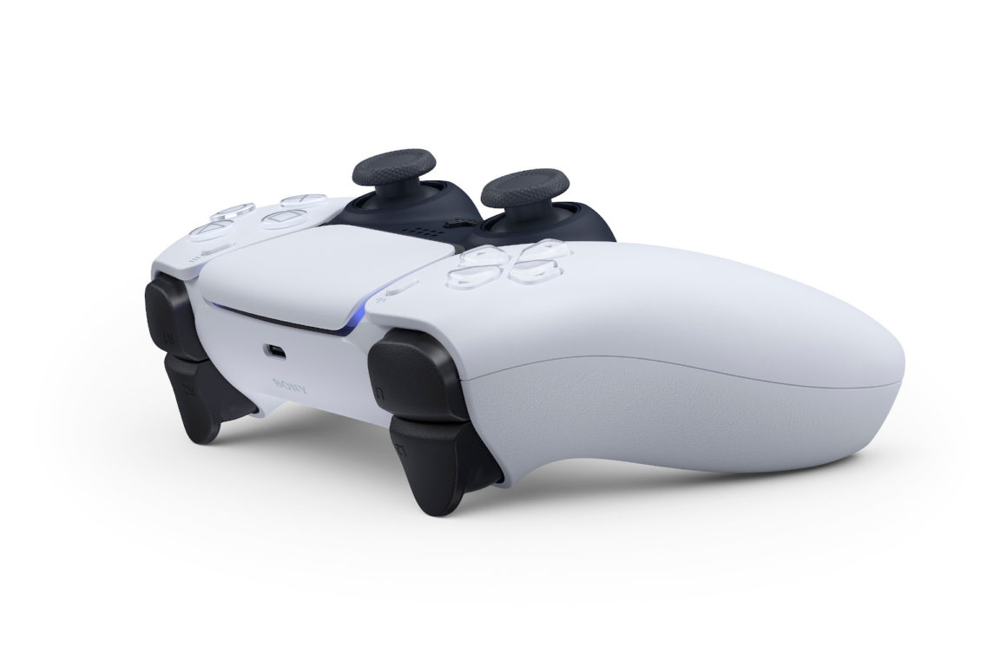
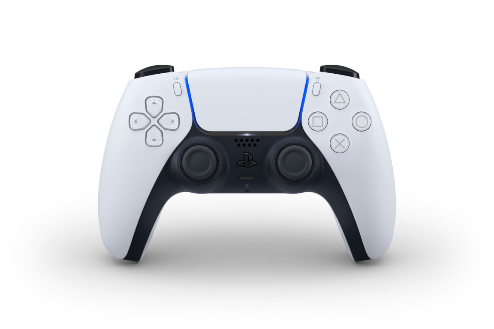
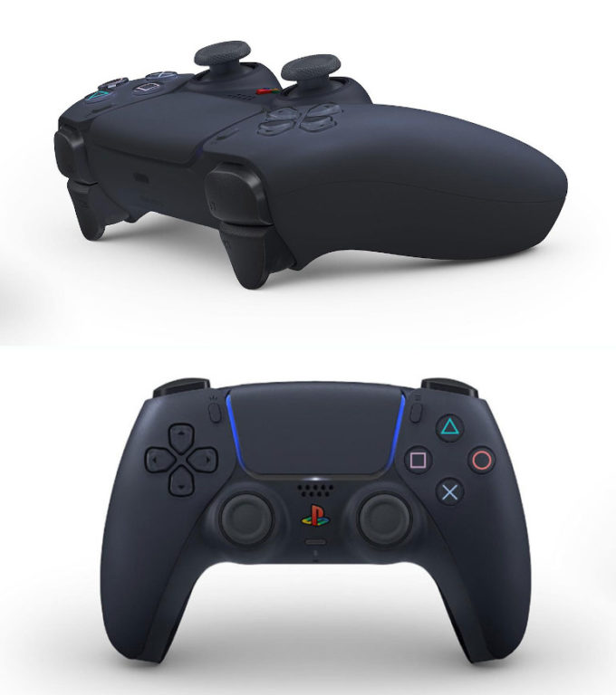
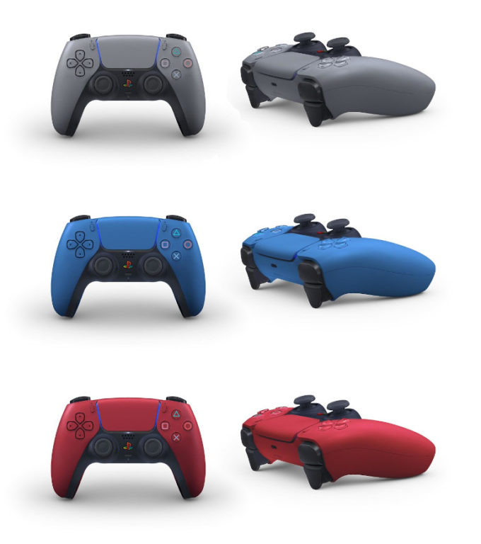

Stało się. Wczoraj wieczorem [Sony postanowiło zaprezentować kontroler](https://blog.us.playstation.com/2020/04/07/introducing-dualsense-the-new-wireless-game-controller-for-playstation-5/), który będzie dołączany do ich najnowszej konsoli, czyli PlayStation 5. O dziwo nie jest to, jak mogło się wydawać DualShock 5. Japoński gigant postanowił odejść od dotychczasowego nazewnictwa kontrolerów i postawił na DualSense.

## Nowa nazwa, nowe funkcje

Nazwa kontrolera nie jest przypadkowa. Słowo sense odnosi się do haptycznego sprzężenia zwrotnego (haptic feedback), w które będzie wyposażony kontroler. Jego zadaniem ma być jeszcze lepsze odwzorowanie sytuacji grywalnego bohatera przy pomocy naszego zmysłu dotyku. Powierzchnia DualSense ma oddawać np. strukturę podłoża, po jakiej porusza się nasza postać. Nie wiem, jak dobrze finalnie będzie działała ta technologia, ale wiem jedno - funkcja wibracji naprawdę potrafi robić robotę w kwestii immersji i próba rozwinięcia tej technologii może być strzałem w dziesiątkę.

Potwierdziły się również wcześniejsze plotki na temat triggerów nowego kontrolera. DS5 będzie posiadał adaptacyjne spusty (przyciski L2 i R2), które będą dynamicznie zmieniały swój skok i twardość, w zależności od sytuacji w wirtualnym świecie. Wspominałem już o tym [w artykule poświęconym moim przypuszczeniom dot. funkcji PS5](/moje-oczekiwania-wzgledem-playstation-5). Podobną rzecz posiadał już Microsoft Elite Controller 2, ale regulacja odbywała się ręcznie za pomocą suwaków u dołu urządzenia. Sony poszło o krok dalej i zaproponowało rozwiązanie programowe. Jeśli tylko zapewnią oni dobrą żywotność mechanizmu (zgaduję, że będzie to silniczek krokowy ściskający sprężynę), to mamy okazję zdobyć idealny kontroler m.in. do gier wyścigowych. Twardość pedałów samochodu? Twardość spustu broni? To naprawdę może odmienić poziom immersji w grach. Już widzę, jak powstaje port [Death Stranding](/bezspoilerowa-recenzja-gry-death-stranding) na PS5 z funkcją symulacji ciężaru paczek. Hideo, liczę na Ciebie! :D

## Sony idzie w futuryzm

W nowym wyglądzie kontrolera nie sposób nie zauważyć ciągot Sony do futurystycznego wyglądu. Krzyżak oraz przyciski z figurami są teraz wykonane z przeźroczystego tworzywa, natomiast obudowa boków urządzenia dosyć ciekawie łączy się z panelem dotykowym. Ciężko jest mi to opisać, dlatego przyjrzyjcie się temu sami:

<ImageDescription>Wykończenie obudowy jest bardzo ciekawe</ImageDescription>

Przedni lightbar został zamieniony w cienką ramkę panelu dotykowego. Podejrzewam, że nadal będzie on wielokolorowy i pozwoli robić ciekawe iluminacje świetlne na całej swojej powierzchni. Nutkę nostalgii znajdziemy natomiast pomiędzy gałkami analogowymi. Okrągły przycisk "home" otrzymał teraz kształt logo PlayStation, co może przypominać czasy poprzednich generacji tego urządzenia. Powyżej przycisku (tak samo jak w DS4) znajdziemy głośnik, a poniżej gniazdo jack 3.5 mm oraz przycisk do sterowania mikrofonem. Tak, DualSense 5 będzie posiadał wbudowany mikrofon! Ciekawe, czy deweloperzy spróbują go wykorzystać do czegoś innego niż czat w rozgrywkach sieciowych.

<ImageDescription>Czy wy również widzicie literę V?</ImageDescription>

Pośrodku urządzenia, tak jak już wspominałem, znajduje się znany z PS4 panel dotykowy, ale w lekko powiększonej wersji. Moim zdaniem jest on średnio przydatny w obecnej generacji i mógłby go zastąpić, chociażby, mini ekran AMOLED, ale okej. Mam nadzieję, że nie stanie się on ponownie przyciskiem do otwierania minimapy. Po bokach panelu znajdziemy ponownie dwa małe przyciski. Prawy to klasyczny "options", natomiast lewy przycisk został nazwany "create" i ma posiadać podobne funkcje co "share", ale jeszcze bardziej rozbudowane.

<AdSense/>

## Ponownie akumulator, ale za to z USB-C

Sony ponownie postawiło na zasilanie swojego kontrolera za pomocą wbudowanego akumulatora. Microsoft natomiast pozostał przy polityce wymiennych "paluszków AA". Nie będę dyskutował, które rozwiązanie jest lepsze, ponieważ oba posiadają trochę zalet oraz wad. Do ładowania pada, tak samo jak w przypadku nowego Xboxa, posłuży nam kabel USB-C. Bardzo dobrze, ponieważ ten standard sukcesywnie przejmuje rynek i głupotą byłoby ponowne pójście w microUSB. Sony zapewnia, że akumulator DualSense będzie wydajniejszy niż w DS4, ale jak na razie nie mamy na to żadnych dowodów.

<Gallery>

</Gallery>

<ImageDescription>Fanowskie wizualizacje innych wersji kolorystycznych DualSense</ImageDescription>

## Moja opinia

Po prezentacji oczywiście powstała fala ankiet, czy wygląd się podoba, czy nie. Jakie jest moje zdanie? Jest okej i chyba nie ma co nad tym więcej debatować. Sony ma swoją wizję i moim zdaniem bardzo dobrze ją realizuje. Nigdy nie miałem oczekiwań względem wyglądu kontrolera dla nowej generacji, dlatego też akceptuję to, co dają. Bardzo cieszy mnie fakt próby udoskonalenia sprzężenia zwrotnego kontrolera. Powtórzę to jeszcze raz, bardzo liczyłem na funkcję adaptacyjnych triggerów i mam nadzieję, że Sony nie zawiedzie w tej kwestii. Zaskoczyło mnie ponowne pójście w panel dotykowy, a nie w wyświetlacz, choć pewnie problemem byłaby wtedy żywotność ogniwa. Co do kolorystyki kontrolera, jest ładna. Oczywiście tak jak reszta społeczności mam nadzieję, że pojawi się również wersja czarna, ale to jest raczej pewne. W swoim komunikacie Sony zaznacza, że w nowym wyglądzie chcą postawić na dwukolorowy design, więc zabawy kolorystyką będzie na pewno sporo.

Po tej prezentacji jeszcze bardziej chcę poznać wygląd samej konsoli oraz w jaki sposób będzie ona nawiązywać do kontrolera. W wypowiedzi CEO Sony czytamy, że firma nadal chce wypuścić produkt w święta 2020 roku, także nie pozostaje nam nic innego jak czekać. A Wam jak się podoba nowy DualSense? Podziejcie się swoją opinią w sekcji komentarzy pod artykułem ;)
