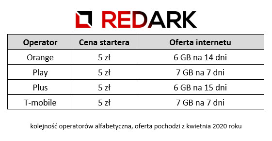
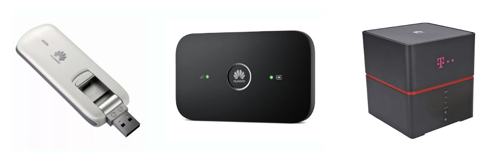

Obecne tempo i styl życia wymusza na nas potrzebę stałego dostępu do internetu. Nieważne czy w celach rekreacyjnych, czy zawodowych, ale chcemy móc rozłożyć się z laptopem w pociągu bądź kawiarni i korzystać z internetu tak, jakbyśmy byli u siebie w domu. Z tego powodu powstała usługa internetu mobilnego oferowana obecnie przez wszystkich operatorów sieci komórkowej. Dostawcy często stosują w nich sztuczki marketingowe, które są w stanie wbić nieświadomego konsumenta na minę. Dlatego też w tym artykule poznasz 5 przydatnych zasad wyboru internetu mobilnego, a także objaśnienie najpopularniejszych parametrów, jakie możesz spotkać u operatora.

## 5 zasad wyboru internetu mobilnego

### 1\. Jeśli możesz, to wybierz internet stacjonarny

Na początek jedna ważna rzecz, jeśli rozważasz internet mobilny pod kątem alternatywy dla kablowego połączenia dla Twojego domu. Choćby nie wiem jak bardzo starał się operator, internet mobilny obecnie nie jest w stanie zastąpić porządnego stałego łącza kablowego. Z tego powodu, jeśli tylko masz możliwość podłączenia u siebie internetu kablowego, to zrób to. Transmisja bezprzewodowa na dużą odległość jest bardzo podatna na zakłócenia i spadki wydajności. Może się okazać, że uruchomienie w kuchni obok czajnika lub mikrofali wyraźnie obniży moc sygnału i nie ma na to uniwersalnej rady. Jeśli możesz, to postaw na kabel. Jeśli faktycznie potrzebujesz internetu w terenie, zapraszam do pozostałej części artykułu.

### 2\. Nielimitowany internet nie istnieje

Jest to jedno z większych kłamstw reklam internetu mobilnego. Obecnie nie istnieje w Polsce operator, który oferuje prawdziwy nielimitowany dostęp do mobilnego internetu. Haczyk polega na zastosowaniu tak zwanego "lejka". Po przekroczeniu pewnej ilości gigabajtów transferu w danym okresie rozliczeniowym prędkość naszego łącza jest sztucznie obniżana najczęściej do wartości 1 Mbps. Oczywiście faktycznie dostęp do internetu nadal będziemy mieć, ale prędkość łącza jest tak śmieszna, że nawet otwarcie jakiegokolwiek artykułu będzie wyzwaniem. Jest on bardziej nieskończony, a nie nielimitowany. Reasumując: czytajcie warunki zapisane małym druczkiem.

<AdSense/>

### 3\. To, że komuś działa, to nie znaczy, że Tobie też będzie

Ten podpunkt dedykuje wszystkim postom na grupach facebookowych z zapytaniem "Hej! Z jakiej sieci wybrać internet? Jak wam się on sprawuje?". Mówiąc wprost krew mnie zalewa jak widze takie pytania. Skąd ktoś, kto pewnie mieszka na drugim krańcu Polski, ma wiedzieć, jak będzie działać internet w Twoim pokoju? Zadawanie takiego pytania wywoła jedynie lawinę setek komentarzy z zażaleniami i wynikami speed testów. Zapewniam Cię, że w niczym Ci to nie pomoże, a tylko namiesza w głowie. Wybór internetu mobilnego to sprawa indywidualna.

<ImageDescription>I tak średnio co 1-2 tygodnie...</ImageDescription>

### 4\. Z usług telekomunikacyjnych zawsze ktoś jest niezadowolony

Temat bardzo powiązany z problemem z zasady nr 3. Z usług telekomunikacyjnych zawsze ktoś będzie niezadowolony i nie istnieje na Ziemi operator, który zadowoliłby wszystkich. Negatywne opinie były, są i będą. Moim zdaniem czytanie ich nie ma większego sensu, ale jeśli chcesz to zrobić, to podchodź do nich z dużym dystansem. Ponownie działa tutaj zasada: nieważne jak komuś to działa, ważne jak Tobie to działa. Oczywiście rozumiem po części smarowanie obelg na socialach operatorów - czasami jest to jedyna skuteczna metoda przebicia się ze swoim problemem do ich pomocy technicznej. Niemniej jednak ponownie proszę: chwalenie się speed testami na Facebook'u nic nie wnosi, a wywołuje jedynie lawinę komentarzy typu "kto ma większego, a raczej mniejszego" ;)

### 5\. Rzetelny test zrobisz tylko Ty!

Dobra dobra, mówisz cały czas, żeby nie prosić innych o opinie, to jak w takim razie mam wiedzieć, który operator będzie dla mnie dobry? Rozwiązanie jest bardzo proste. Obecnie każdy operator komórkowy ma w swojej ofercie startery w cenie minimum 5 złotych. Idziesz do salonu, kupujesz starter, wracasz do domu, wkładasz kartę SIM do swojego telefonu (lub routera GSM jeśli posiadasz) i testujesz! Nikt nie da Ci bardziej rzetelnego testu, niż Ty sam. Dowiesz się, jak silny zasięg danego operatora posiadasz w pokoju oraz jaką prędkość internetu jesteś w stanie osiągnąć. Cena 20 złotych (5 złotych pomnożonych przez czterech największych operatorów komórkowych w Polsce) to nic w porównaniu ze związaniem się umową abonamentową na rok czy dwa z dostawcą o słabym zasięgu.

<ImageDescription>Zanim podpiszesz umowę, przetestuj!</ImageDescription>

## Parametry internetu mobilnego

Jak wyjaśniliśmy sobie już wszystkie kwestie dotyczące internetu mobilnego, możemy sprawdzić, jakie parametry czekają na nas w ofertach ich operatorów:

### Prędkość pobierania i wysyłania

Najważniejszy parametr, który występował również w [internecie stacjonarnym](/jak-dobrze-wybrac-dostawce-internetu), czyli prędkość pobierania i wysyłania danych do internetu. Oczywiście tutaj także dla zwykłego użytkownika ważniejsza jest prędkość pobierania niż wysyłania, a obie wartości powinny być jak najwyższe.

### Miesięczny limit transferu

Tak jak wyjaśniała już zasada nr 2 - nie ma czegoś takiego jak nielimitowany internet mobilny. Wybierając ofertę, sprawdź, ile faktycznie transferu otrzymujesz i do jakiej prędkości zostanie on ograniczony po przekroczeniu limitu. Pamiętaj, że prędkości pokroju 1 Mbps dają jedynie namiastkę dostępu do internetu i nie nadają się komfortowego korzystania z niego.

### Urządzenie odbiorcze

Aby móc podłączyć się do bezprzewodowej sieci komórkowej potrzebujemy urządzenie, które pozwoli na umieszczenie w nim karty SIM operatora. Do wyboru otrzymamy trzy typy urządzeń:

Pierwsze to **modemy USB**. Mają one postać dużego pendrive'a podłączanego bezpośrednio do portu USB komputera bądź laptopa. Są poręczne i nie wymagają skomplikowanej konfiguracji. Wadą jest to, że zasilają w internet jedynie jedno urządzenie naraz. Oczywiście nasz laptop może uruchomić hotspot i udostępnić połączenie innym, ale nie jest to wydajne, a tym bardziej proste rozwiązanie.

Drugi typ to tzw. **routery mobilne**. Są to samodzielne modemy internetowe wyposażone we własną baterię. Po ich uruchomieniu tworzą one lokalną sieć Wi-Fi, do której możemy podłączyć dowolne urządzenie wspierające ten standard komunikacji. Wadą jest potrzeba monitorowania i ładowania baterii oraz brak możliwości podłączenia komputera bez karty bezprzewodowej. Wielu operatorów wymaga za takie urządzenie dodatkowej opłaty abonamentowej, ale często można je też wykupić od razu na własność.

<AdSense/>

Trzeci typ urządzenia to stacjonarna wersja poprzednika przeznaczona dla ofert tzw. internetu domowego. Mowa tutaj o **routerze domowym**, czyli urządzeniu, które zamiast baterii posiada zasilanie 230 V oraz stawia na większą wydajność i przepustowość. Taki sprzęt posiada często możliwość podłączenia komputera za pomocą tradycyjnej skrętki oraz zestawu zewnętrznych anten poprawiających zasięg sieci.

<ImageDescription>Od lewej: modem USB, router mobilny, router domowy</ImageDescription>

### Zewnętrzna antena

Wspomniałem o tym w poprzednim akapicie. W ofercie internetu domowego często możemy spotkać się z opcją zakupu anteny zewnętrznej montowanej na ścianie lub dachu naszego domu. Czasami jest ona dołączana do routera, a czasami widnieje jako osobna pozycja w cenniku. Jej zakup może być zbawienny, jeśli posiadamy w pokoju problemy z odbiorem sygnału operatora.

### Dodatkowe usługi oraz wyłączenia z transferu

Oprócz dostępu do internetu operatorzy często kuszą dodatkowymi usługami dołączanymi do abonamentu. Może to być dostęp do pewnego serwisu streamingowego (HBO, Netflix, Spotify itd.) lub opcja wyłączenia pewnych usług z naliczania zużytego transferu. Polega to na tym, że operator może np. nie naliczać pakietów, które idą do serwerów Facebooka, Messengera i Instagrama. Podczas wyboru takich usług należy zawsze sprawdzić, czy początkowo darmowe profity nie przechodzą później automatycznie w płatne usługi, które mogą zrobić niemiłą niespodziankę na koniec miesiąca.
