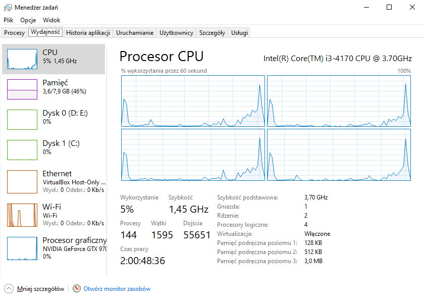
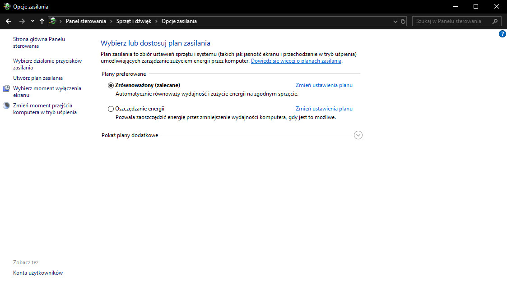
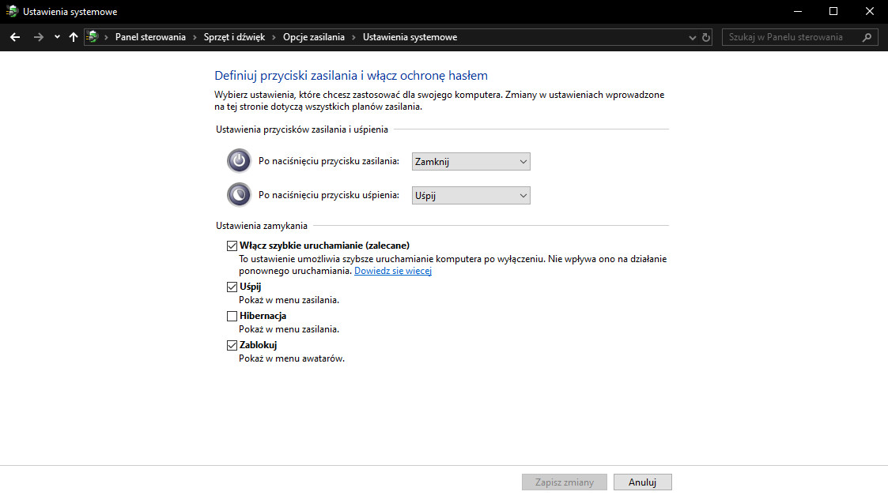
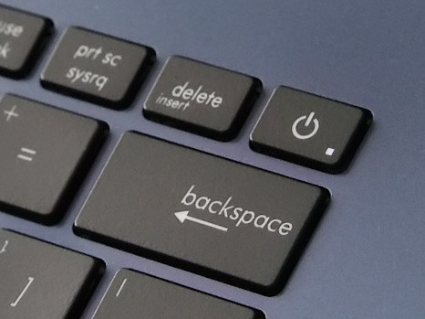

Z moich obserwacji wynika, że wiele osób nie jest w stanie odpowiedzieć na pytanie, czym różni się hibernacja od uśpienia komputera. Ponieważ jeden z tych trybów może doprowadzić do utraty danych użytkownika, dlatego moim zdaniem, warto jest dokładnie wyjaśnić to zagadnienie. Oprócz tego omówię także niestandardowy sposób wyłączania się najnowszych wersji systemu Windows oraz jakie niesie to ze sobą konsekwencje.

## 4 główne stany pracy komputera

### Normalne działanie (G0)

Jest to standardowy tryb pracy naszego komputera. Dioda zasilania świeci światłem ciągłym, a wszystkie podzespoły urządzenia są pod napięciem. Pobór prądu jest oczywiście najwyższy.

### Uśpienie (G1-S3)

Jest to pierwszy najpopularniejszy stan obniżonego poboru prądu. Cechuje się on krótkim czasem wejścia i wyjścia z tego trybu, co zapewnia możliwość szybkiego powrotu do przerwanej pracy. Działanie komputera w stanie uśpienia jest sygnalizowane mruganiem lub pulsowaniem diody zasilania. Komputer w tym trybie cały czas nasłuchuje sygnałów do wznowienia normalnej pracy. Obowiązkową możliwością uruchomienia jednostki jest przycisk zasilania, ale użytkownik może także skonfigurować wybudzanie za pomocą poruszenia myszy, wciśnięcia klawisza klawiatury lub wysłania specjalnego pakietu o nazwie [Magic Packet](https://pl.wikipedia.org/wiki/Magic_Packet) poprzez lokalną sieć komputerową przy użyciu technologii [Wake on LAN](https://pl.wikipedia.org/wiki/Wake_on_LAN).

Po wciśnięciu przycisku "uśpij" (w Windowsie XP widniała nazwa "stan wstrzymania") komputer rozpoczyna procedurę przerzucania wszystkich aktualnych danych do [pamięci RAM](/pamieci-ram). Obecnie działające procesy zostają przerwane, a cała zawartość rejestrów procesora zostaje przeniesiona do wspomnianej wcześniej pamięci operacyjnej. Gdy wszystkie dane zostaną już zgrane, płyta główna odcina zasilania wszystkim podzespołom prócz pamięci RAM. Z racji tego, że jest to pamięć ulotna, nie może zostać wyłączona. Komputer w trybie uśpienia **NIE MOŻE ZOSTAĆ POZBAWIONY ZASILANIA!** Wyłączenie listwy przy biurku lub rozładowanie baterii laptopa może doprowadzić do uszkodzenia systemu, lub otwartych plików użytkownika.

<InfoBlock>Nowe laptopy po długim czasie oczekiwania na powrót do pracy lub po wykryciu niskiego poziomu baterii potrafią samoistnie przejść do trybu pełnej hibernacji, co pozwala zabezpieczyć cenne dane użytkownika.</InfoBlock>

### Hibernacja (G1-S4)

Jest to głęboki stan uśpienia komputera charakteryzujący się praktycznie zerowym poborem prądu. W tym trybie dioda zasilania nie świeci, a komputer zachowuje się identycznie, jakoby był całkowicie wyłączony.

Hibernacja, tak samo jak uśpienie, powoduje przerwanie wszystkich działających procesów procesora oraz migracje jego pamięci. Tym razem miejscem docelowym nie jest pamięć RAM, a [dysk HDD lub SSD](/nosniki-pamieci-dyski-hdd-ssd) komputera. Dzięki temu, że jest to pamięć nieulotna, po przekopiowaniu danych komputer może odciąć zasilanie wszystkich podzespołów. Ograniczona przepustowość dysku powoduje, że przejście i wyjście z tego trybu zajmuje zwykle od kilkunastu do kilkudziesięciu sekund w zależności od rozmiaru danych zapisanych w pamięci RAM.

### Wyłączenie (G2)

W chwili standardowego wyłączania komputera system operacyjny kończy działanie wszystkich uruchomionych procesów oraz zamyka otwarte pliki. Tyczy się to również wszystkich aplikacji uruchomionych przez użytkownika, których niezapisane dane zostaną utracone.

<AdSense/>

## Stany standardu ACPI

Pewnie część z Was zaciekawiły skróty podane przeze mnie w nawiasach znajdujących się w nagłówkach. Są to skróty stanów pracy komputera według standardu ACPI. Dokument definiuje ich znacznie więcej, ale ja skupiłem się jedynie na tych najpopularniejszych i istotnych dla użytkownika. Osoby, które chcą poszerzyć wiedzę na ten temat, zachęcam do przejścia na [stronę Wikipedii](https://pl.wikipedia.org/wiki/ACPI).

## Hybrydowe wyłączanie systemu Windows

Będąc w temacie omawiania różnic pomiędzy stanami pracy komputera, nie sposób nie wspomnieć o dość ważnej zmianie, jaka zaszła w systemie Windows od czasów wersji oznaczonej numerem 8. Zmiana ta pociągnęła za sobą kilka konsekwencji, a wielu użytkowników nie ma o nich pojęcia.

### Geneza

System Windows od dawna nie szczyci się mianem dobrze zoptymalizowanego, a każda nowa odsłona "okienek" zwiększała czas potrzebny na uruchomienie i wyłączenie komputera. Firma Microsoft w wersji 8 postanowiła przystosować swój system do pracy na tabletach, smartfonach i innych urządzeniach mobilnych. Wymagało to zoptymalizowania procesu ładowania się systemu, lecz przepisanie całego kodu nie wchodziło w rachubę. Microsoft postanowił zatem zastosować pewną sztuczkę.

### Sposób działania

Programiści postanowili ograniczyć ilość danych, jaka ładowana jest podczas startu jednostki. System Windows 8 i 10 jest wyposażone w tzw. hybrydowe wyłączanie systemu. Polega ono na tym, że część [pamięci RAM](/pamieci-ram), która pochodziła od rdzenia systemu Windows oraz aplikacji działających w tle zostaje przekopiowana na dysk, tak jak to ma miejsce w przypadku hibernacji. Bieżące dane użytkownika zostają natomiast usunięte, tak jak zwykle ma to miejsce w przypadku wyłączenia komputera. Po uruchomieniu jednostki system przywraca zapisaną część danych, co usprawnia start Windowsa.

Można to porównać do zgarniania narzędzi oraz dokumentów z biurka wprost do szuflady znajdującej się pod jego blatem. Microsoft stworzył hybrydę stanu hibernacji oraz pełnego wyłączenia komputera, ale sprowadził tym na siebie masę problemów.

### Problemy wywołane hybrydowym wyłączaniem systemu

Pierwsze miesiące po wypuszczeniu na rynek Windowsa 8 przynosiły poważne obawy przy wyłączaniu komputera. System błędnie przenosił dane na dysk, co skutkowało, że komputer często blokował się na czarnym ekranie lub uruchamiał procedurę całkowitego przeładowania danych i ładował się kilka minut. Microsoftowi udało się doprowadzić system do ładu, ale odbiło się to na wydajności dysków talerzowych. Magazyn był przeciążony, hałasował, a długi czas oczekiwania na dane powodował kolejne awarie. Sytuację ratował [dysk SSD](/nosniki-pamieci-dyski-hdd-ssd), ale wymuszało to modernizację komputera o bardzo drogi (w tamtych czasach) nośnik.

Brak pełnego zamknięcia systemu zauważają również aplikacje. Dla przykładu antywirus Eset po pobraniu aktualizacji modułu zabezpieczeń prosi o ponowne uruchomienie komputera. Do czasów Windowsa 7 wyłączenie komputera pod koniec pracy i uruchomienie go następnego dnia załatwiłoby sprawę. Niestety na nowym Windowsie to nie wystarczy. Komunikat zniknie, dopiero gdy wybierzemy opcję "uruchom ponownie", która całkowicie przeładuje system. Podobny problem tyczył się lekko przestarzałych już portów PS/2. Na początku istnienia 8-ki pamiętam, że podłączona do tego portu nowa mysz lub klawiatura dawała oznaki życia dopiero po ponownym uruchomieniu komputera. Jeśli nie mieliśmy pod ręką myszy USB, która pozwoliłaby wybrać odpowiednią opcję w menu, zmuszeni byliśmy do celowego odłączania od prądu pracującego komputera, aby wymusić wyłączenie hybrydowego startu.

### Sprawdzanie prawdziwego czasu działania systemu

Jeśli jesteś ciekawy, możesz sprawdzić ile godzin faktycznie bez przerwy działa Twój system Windows. W tym celu otwórz menadżer zadań, kliknij u dołu "więcej szczegółów", a następnie przejdź do zakładki "wydajność". Na karcie procesora (CPU) znajdziesz parametr o nazwie "czas pracy":

Jak widać, mój komputer pracuje już bez przerwy już ponad 2 dni, a przecież uruchomiłem go parę godzin temu! Wszystko przez omawiany tutaj tryb hybrydowy. Licznik możemy oczywiście wyzerować, wymuszając ponowne uruchomienie komputera. Przy okazji można wtedy zobaczyć, jak faktycznie szybko uruchamia się system Windows 10 - bez żadnych sztuczek.

### Brak dostępu do danych z poziomu Linuxa

Jeśli oprócz Windowsa posiadasz na swoim komputerze drugi system z rodziny Linux, pewna rzecz również przysporzy Ci problemów. Hybrydowe zamykanie Windowsa powoduje, że tzw. ["dirty bit" dysku](https://en.wikipedia.org/wiki/Dirty_bit) pozostaje aktywny po wyłączeniu komputera. Jest to specjalna flaga informująca komputer, czy dany dysk był modyfikowany i czy został poprawnie wyłączony. System Linux respektuje tę flagę, a co za tym idzie, nie pozwala na otwarcie partycji należącej do Windowsa. Reasumując: jeśli z poziomu Linuxa chcesz dostać się do partycji Windowsa, musisz wyłączyć hybrydowy start.

<AdSense/>

## Sztuczki i ustawienia zasilania w Windowsie

Na koniec garść sztuczek oraz ustawień zasilania, jakie znajdziemy w systemie Windows 8 oraz 10.

Otwórz panel sterowania i przejdź pod ścieżkę "Sprzęt i dźwięk > Opcje zasilania". Następnie wybierz z menu po lewej opcję "Wybierz działanie przycisków zasilania". Na zaprezentowanym ekranie ustawień znajdziesz szereg opcji związanych z wyłączaniem systemu Windows.

<Gallery>

</Gallery>

Rozwijane listy pozwolą Ci zmienić działanie przycisku zasilania i usypiania znajdujących się na obudowie Twojego komputera lub laptopa. Jest to bardzo przydatna opcja zwłasza jeśli masz nowoczesnego notebooka i jakiś projektant geniusz umieścić w nim przycisk wyłączania obok Backspace'a...

<ImageDescription>Idealne miejsce na wyłącznik...</ImageDescription>

Opcje umiejscowione poniżej list rozwijalnych pozwolą Ci kontrolować opcje wyświetlane w menu zamykania systemu Windows. Możesz tutaj przywrócić ukrytą przez Microsoft hibernację komputera. Dlaczego ją ukryli? Nie wiem, ale ja zawsze ją przywracam. Oprócz tego, jeśli chcesz, możesz zdezaktywować tutaj hybrydowe wyłączanie, które Ci dzisiaj zaprezentowałem.

Na koniec mała sztuczka. Zdarzyło Ci się, że Windows zainstalował w tle aktualizacje i teraz jedyną opcją jest "Zaktualizuj i zamknij"? Pewnie nie raz. Co gorsza, może dojść do sytuacji, że nie możesz pozwolić sobie teraz za długie oczekiwanie na instalację łatki. Rozwiązaniem tej sytuacji jest jedna prosta komenda. Możesz ją wpisać bezpośrednio w wiersz poleceń (konsolę) lub do wyszukiwarki w menu Start:

<Quote>shutdown -s -t 0</Quote>

Zatwierdzenie tej komendy klawiszem enter spowoduje natychmiastowe wyłączenie komputera z pominięciem hybrydowego mechanizmu, a także procesu instalacji aktualizacji! :)
