Gdy komputer przestaje poprawnie działać, zachodzi potrzeba sprawdzenia działania jego poszczególnych podzespołów. Zasilacz to jeden z ważniejszych elementów jednostki centralnej. Zamienia prąd zmienny 230 V na prąd stały, następnie zaopatruje w niego wszystkie podzespoły komputera. Jego awaria może spowodować całkowite unieruchomienie urządzenia lub jego niestabilną pracę. Aby wykluczyć część możliwych przyczyn awarii komputera, w warunkach domowych można przeprowadzić pewien eksperyment.

## Co będzie potrzebne?

Do przeprowadzenia testu zasilacza będzie nam potrzebny miernik cyfrowy (multimetr), spinacz biurowy oraz rzecz jasna sam zasilacz.

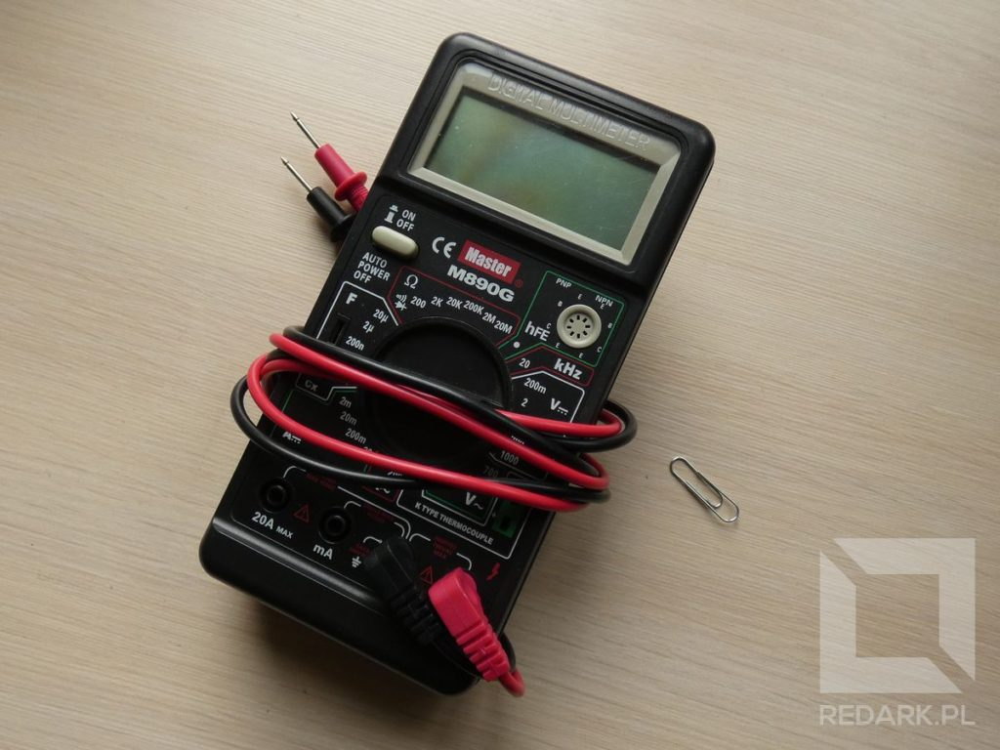

## Przygotowywania do testu

<WarningBlock>Przed przystąpieniem do prac odłącz całkowicie jednostkę od prądu elektrycznego! Pamiętaj także, że mamy tutaj do czynienia z napięciem 230 Volt, które może zagrażać Twojemu życiu lub zdrowiu! Jeśli nie czujesz się na siłach, zleć te testy profesjonalnemu serwisowi komputerowemu.</WarningBlock>

Testy zaprezentuję na zasilaczu wewnątrz jednostki centralnej - bez jego całkowitego demontażu. Na początku należy odłączyć zasilacz od wszystkich podzespołów komputera. Należą do nich płyta główna (2 wtyczki), dyski pamięci masowej, napęd optyczny, karta graficzna oraz opcjonalny kontroler wentylatorów lub pasków LED. Poszczególne wtyczki prezentują zdjęcia poniżej:

<Gallery width='2'>
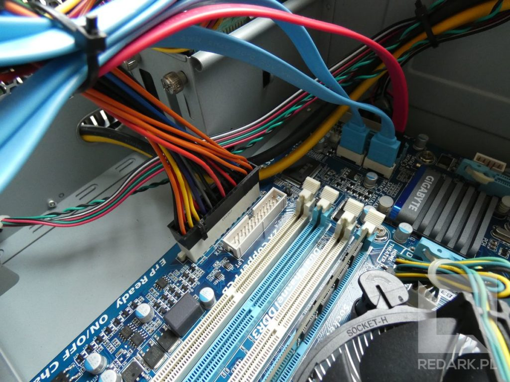
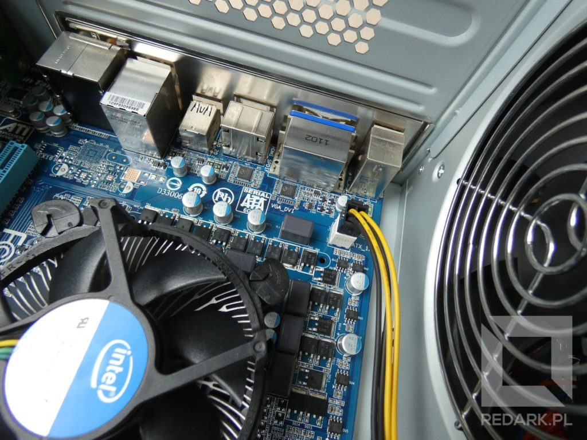
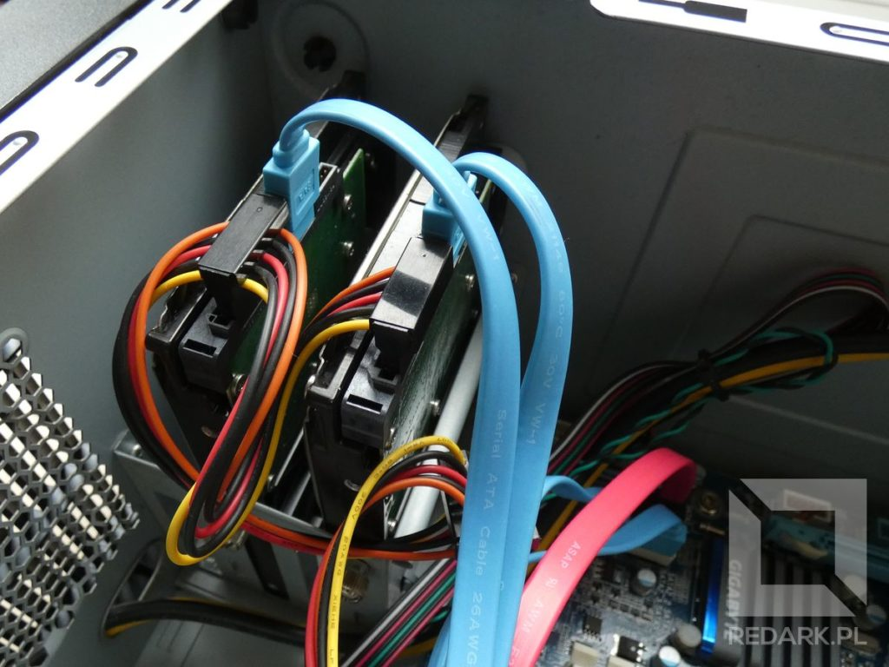

</Gallery>

Część osób twierdzi, że nie należy uruchamiać zasilacza bez obciążenia (urządzenia odbiorczego), dlatego ja postanowiłem pozostawić podłączony napęd optyczny. Sprawdzi się on również idealnie do sygnalizowania pracy zasilacza.

Drugim elementem, jaki musimy przygotować, jest multimetr cyfrowy. Posiada on wiele trybów pracy oraz trzy lub cztery wyjścia na przewody. Będziemy nim przeprowadzać pomiar napięcia prądu stałego do 12 Volt. W tym celu należy upewnić się, że przewody (sondy) pomiarowe są podłączone do następujących gniazd:

- Czarny przewód jest zwyczajowo masą, czyli minusem i podłączamy go pod gniazdo oznaczone napisem COM.
- Czerwony przewód podłączamy do gniazda oznaczonego literą V - pomiar napięcia.

Następnie uruchamiamy w multimetrze odpowiedni tryb pracy. Szukamy sekcji napięcia prądu stałego, który jest oznaczony literą V z symbolem dwóch poziomych kresek - górna ciągła, a dolna przerywana. Aby móc bezpieczenie przeprowadzić pomiar napięcia 12 Volt, wybieramy pokrętłem wartość 20.

<Gallery>

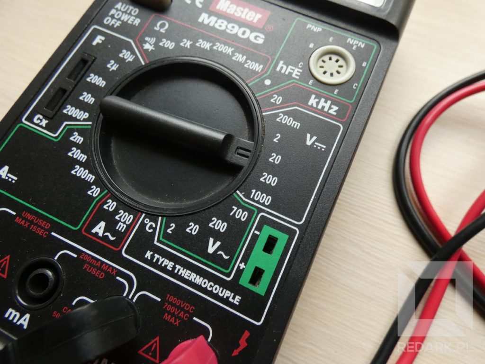
</Gallery>

## Odpalamy na krótko!

Jeśli dostarczylibyśmy teraz prąd do zasilacza, ten nie uruchomiłby się. Napięcie pojawiłoby się jedynie na niewielkiej ilości przewodów. Dzieje się tak, ponieważ w momencie załączania komputera przyciskiem obudowy płyta główna wysyła sygnał do zasilacza, który nakazuje mu rozpocząć generowanie prądu na wszystkich przewodach.

<AdSense/>

Zasymulujemy tę sytuację bez udziału płyty głównej, której awarię chcemy wykluczyć. Aby uruchomić zasilacz, musimy zewrzeć z masą zielony przewód znajdujący się w dużej wtyczce ATX. Do tego celu posłuży nam oczywiście spinacz biurowy.

Cała filozofia polega na wygięciu spinacza w kształt litery U, a następnie włożeniu go do otworu, który odpowiada przewodowi zielonemu i czarnemu. Przewodów masowych we wtyczce będzie wiele, ale wybór jednego konkretnego nie jest istotny.

<Gallery>

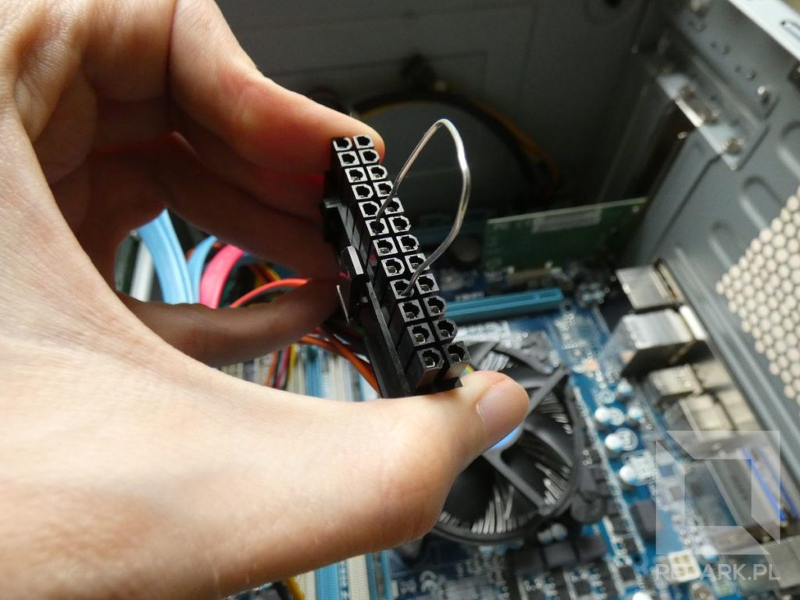
</Gallery>

Po upewnieniu się, że nasza zworka siedzi pewnie we wtyczce i na pewno zwiera zielony przewód, a **NIE ŻADEN INNY**, możemy podłączyć zasilacz do prądu. Po doprowadzeniu zasilania wentylator znajdujący się w zasilaczu powinien zacząć się kręcić. Jest on bardzo cichy, dlatego może być niesłyszalny z dużej odległości. Działanie urządzenia potwierdza napęd optyczny, który zostawiłem podłączony:

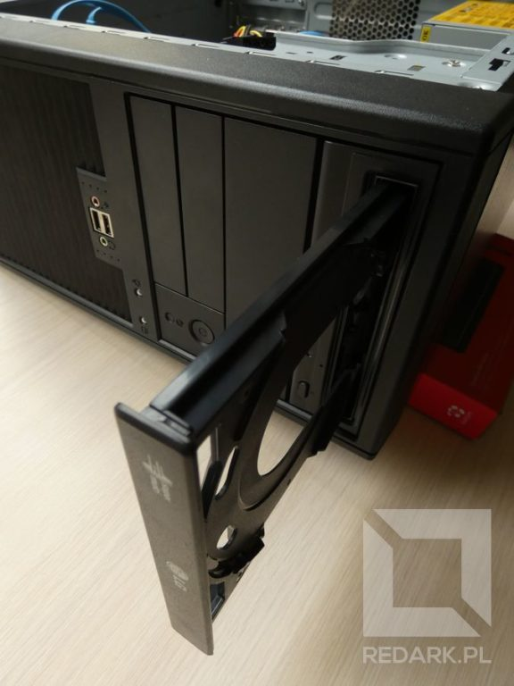

<ImageDescription>Napęd wysunął się, czyli zasilacz uruchomił się</ImageDescription>

## Wykonywanie pomiarów

Zasilacz komputerowy generuje trzy poziomy napięć: 5 Volt (przewód czerwony), 12 Volt (przewód żółty) oraz 3,3 Volta (przewód pomarańczowy). Test polecam rozpoczynać od wtyczki Molex, ponieważ standardowe sondy multimetra idealnie pasują do jego otworów. Molex dostarcza napięcie 5 oraz 12 Volt, natomiast jeśli chcemy sprawdzić poziom 3,3 V, musimy skorzystać już z mniej wygodnej wtyczki ATX. Test można przeprowadzić tylko na jednym przewodzie z danego koloru lub na wszystkich czerwonych, żółtych oraz pomarańczowych przewodach wychodzących z zasilacza.

<Gallery width='2'>
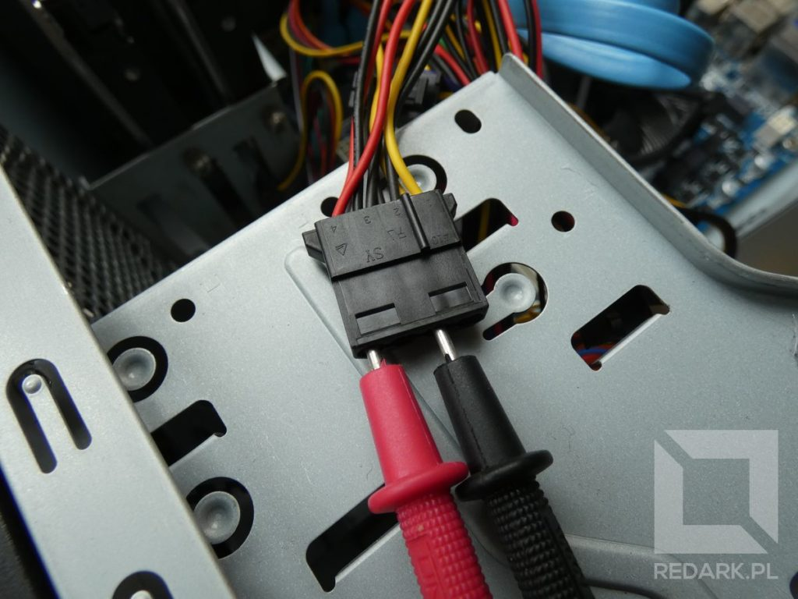
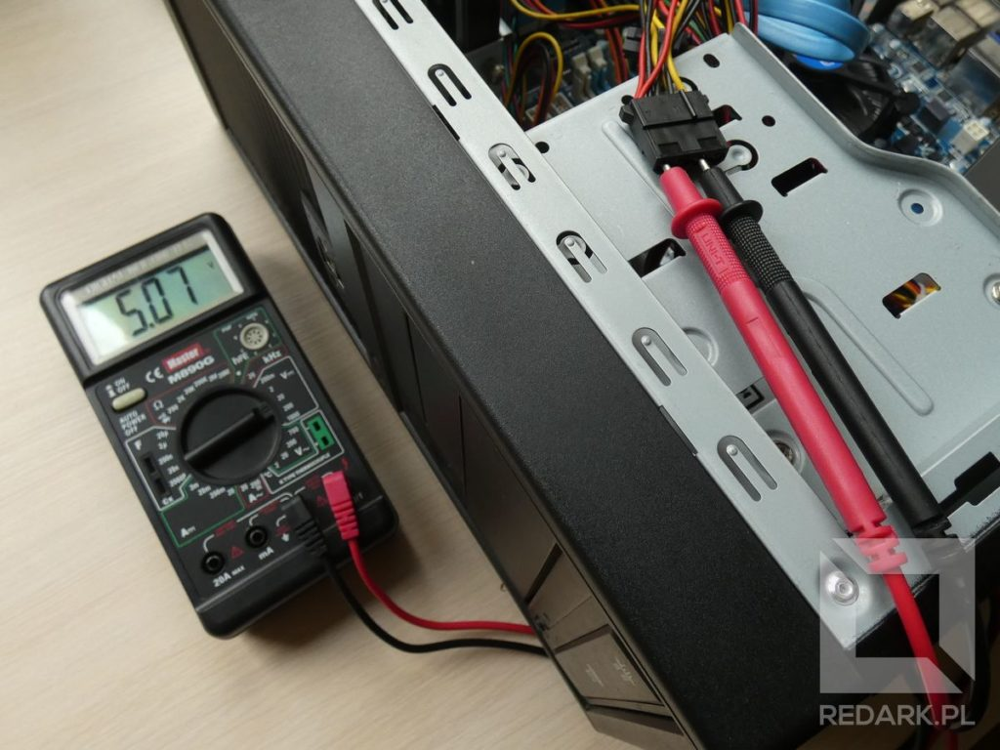
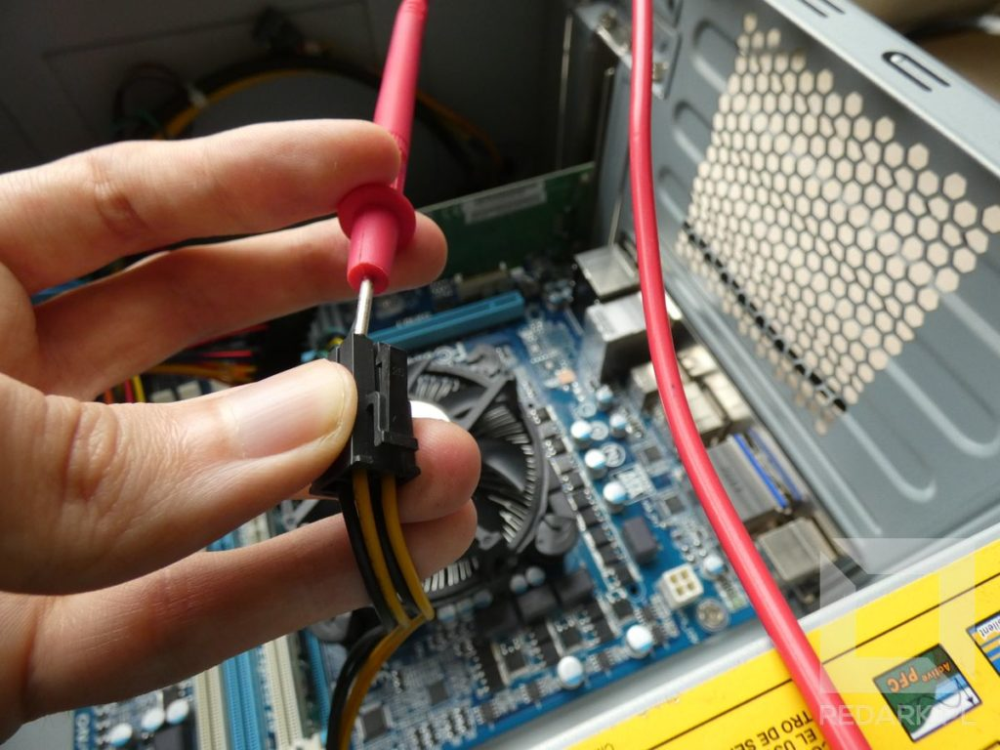
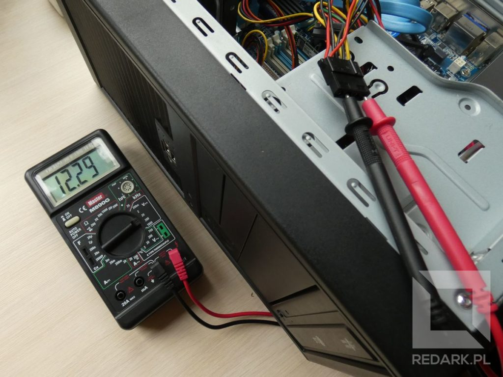
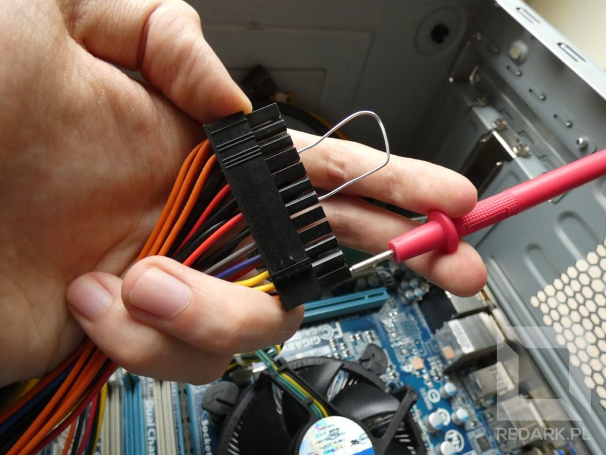

</Gallery>

Jak widać, otrzymałem wyniki: 5,07 dla linii 5 V, 12,28 dla linii 12 V oraz 3,36 dla linii 3,3 V. Czy to są złe wyniki? Absolutnie nie! Żaden zasilacz nie generuje idealnego napięcia, a standard ATX dopuszcza od 5% w czasie spoczynku do nawet 10% odchyłu w czasie obciążenia. Pięć procent dla linii 12 V wynosi sześć dziesiątych Volta, zatem prawidłowe napięcie powinno mieścić się w zakresie od 11,4 do 12,6 V. Jeśli wykonałeś już wszystkie pomiary, odłącz zasilacz od prądu, wyjmij zworkę oraz podłącz wszystkie odłączone przewody z powrotem do podzespołów.

## Co powiedziały nam te wyniki?

Z przeprowadzonego testu możemy wywnioskować, że zasilacz poprawnie reaguje na start komputera oraz generuje prawidłowe poziomy napięć. Jeśli jednostka całkowicie się nie uruchamiała, to prawdopodobnie jest to wina płyty głównej. Jednak nie musi to też oznaczać, że zasilacz jest na pewno w pełni sprawny. Test został przeprowadzony w stanie spoczynku i nie oddaje warunków panujących w komputerze, gdy ten jest uruchomiony. Może okazać się, że zasilacz wyłącza się lub traci napięcie dopiero po przekroczeniu pewnego poziomu poboru prądu.

Takie awarie są ciężkie do stwierdzenia w warunkach domowych. Oczywiście możemy spróbować wykonać pomiar podczas pracy komputera, ale nie dość, że będzie to ciężkie (oraz trochę niebezpieczne) do wykonania, to nie odda nam pełnej charakterystyki prądu płynącego w przewodzie. Należy pamiętać, że zwykły domowy multimetr posiada też swoją dokładność oraz szybkość działania. Jeśli napięcie zanikło na ułamek sekundy, miernik tego nie zauważy, natomiast układ scalony komputera już tak. Tutaj bardziej przyda się profesjonalny oscyloskop cyfrowy, ale jest to znacznie droższa i trudniejsza w obsłudze "zabawka".

Alternatywnym oraz bardzo skutecznym sposobem przetestowania zasilacza jest też jego najzwyczajniejsza w świecie podmiana. Paręnaście minut zabawy z przepinaniem przewodów, a zyskujemy praktycznie 100% pewność wykluczenia awarii z powodu zasilacza.
