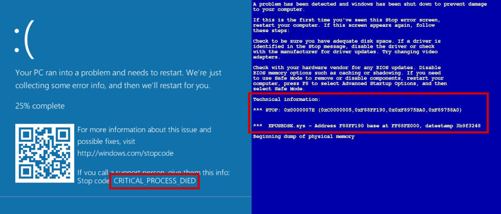
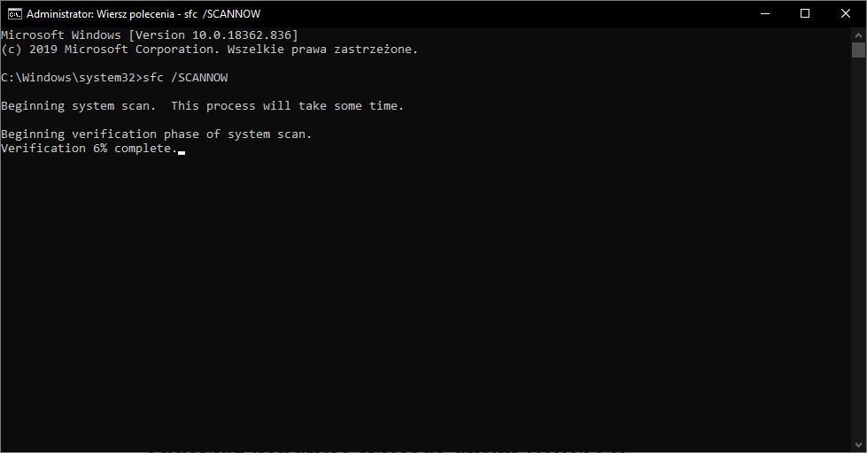
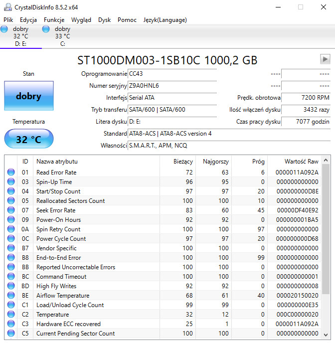
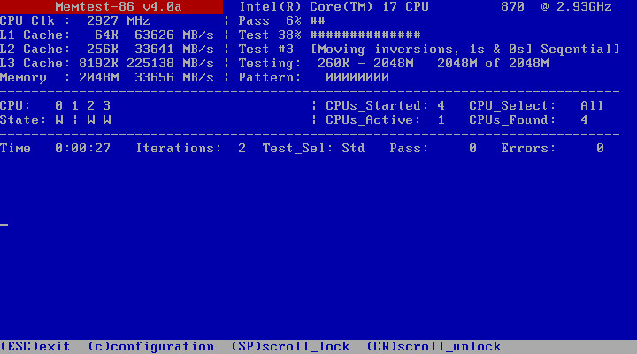

Niebieski ekran śmierci lub jak kto woli Blue Screen of Death (BSOD) jest to (niestety) bardzo rozpoznawalny ekran systemów operacyjnych z rodziny Windows. Występuje on, gdy komputer napotyka krytyczny błąd oprogramowania lub otrzymuje dziwne sygnały od któregoś z podzespołów. Jego pojawienie się oznacza natychmiastowy restart urządzenia i utratę wszystkich niezapisanych wówczas danych. Dziś przedstawię Wam kilka porad i wskazówek, co zrobić, jeśli Wasz komputer dosięgnie choroba ekranów śmierci.

## Drogi komputerze, co Ci dolega?

Na początek na spokojnie. Nie rwijmy od razu kabli i nie wyrzucajmy jednostki za okno. Każdy BSOD posiada kod błędu, który może zawęzić liczbę przyczyn awarii. Niestety z doświadczenia wiem, że kody te często mówią bardzo mało, o ile nie mówią nic. Niemniej jednak warto chociażby spróbować. Jeśli na ekranie pojawi się taki ekran, zanotuj lub zrób zdjęcie wyświetlanych na nim informacji. Następnie wpisz widniejący tam kod błędu do wyszukiwarki Google. Tak jak mówiłem, nie obiecuję, że internet "wypluje" jasną i klarowną odpowiedź na pytanie co się zepsuło, ale jeśli problem jest bardzo pospolity, to jest na to szansa.

<ImageDescription>Przykładowe BSOD z zaznaczonymi kodami błędów. Po lewej wersja z Windowsa 8 i 10, a po prawej ze starszych wersji</ImageDescription>

Problemem w zdobyciu kodu błędu może być czas, przez jaki wyświetla się on na ekranie. W normalnych sytuacjach niebieski ekran śmierci wyświetla się stosunkowo długo, nawet do czasu ręcznego zrestartowania maszyny. Niemniej jednak spotkałem sytuacje, w których BSOD pojawiał się bardzo krótko, chociażby podczas uruchamiania komputera. W trakcie ładowania plików komputer oślepiał użytkownika niebieskim fleszem i momentalnie restartował maszynę. W takim wypadku można spróbować nagrać telefonem lub aparatem ekran, lub wykorzystać nagrywarkę HDMI (video grabber), ale w przypadku występowania ekranu w losowych momentach, wychwycenie takiego błędu jest bardzo trudne. Jest jednak jeszcze jeden sposób na zdobycie kod błędu.

## BlueScreenView - nasze źródło wiedzy

W przypadku szybko znikających kodów błędu nieocenionym programem może zostać [BlueScreenView](https://www.nirsoft.net/utils/blue_screen_view.html). Windows w momencie pojawienia się błędu tworzy specjalny plik o rozszerzeniu ".dmp", który znajduje się w katalogu "C:\\Windows\\minidump". Wspomniamy wcześniej program jest w stanie otworzyć ten plik i wyświetlić nam wiele przydatnych informacji takich jak:

- **Crash Time** - godzina i data wystąpienia awarii,
- **Bug Check String** - słowny kod błędu,
- **Bug Check Code** - kod błędu zapisany szesnastkowo,
- **Parameter 1, 2, 3, 4** - dodatkowe parametry błędu,
- **Caused By Driver** - plik, który może być winowajcą,
- **Caused By Address** - adres pamięci, który wywołał błąd,
- **File Description, Product Name, Company, File Version** - dodatkowe informacje o pliku, który zgłosił awarię.

<ImageDescription>Przykładowy ekran z programu BlueScreenView, źródło: nirsoft.net</ImageDescription>

## Może problem jednak nie jest losowy?

Występowanie ekranów śmierci podzieliłbym na dwie kategorie. Błędy z pierwszej kategorii są wywoływane w określonych momentach pracy komputera. Mam tu na myśli ładowanie system, podłączenie urządzenia lub uruchomienie aplikacji. Drugą kategorią są losowe przypadki, które co prawda są wywoływane z jakiejś przyczyny (np. zwarcie na płycie głównej), ale nie jesteśmy w stanie określić jej gołym okiem.

<AdSense/>

Po pojawieniu się BSOD warto zrobić małe dochodzenie detektywistyczne i spróbować ustalić, do której kategorii należy nasz przypadek. Może wywołujemy awarię, podłączając konkretnego pendrive'a do komputera i wystarczy zainstalować odpowiednie dla niego sterowniki? Może nieświadomie przed awarią kopiemy nogą pajęczynę kabli za biurkiem i doprowadzamy do zwarcia? Możliwych przyczyn jest mnóstwo i nawet serwis komputerowy może mieć problem ze zidentyfikowaniem tego problemu, ponieważ najczęściej otrzymuje on tylko jednostkę centralną komputera - beż żadnych dodatkowych urządzeń czy kabli, które posiadasz przy biurku.

## Najczęstsze przyczyny pojawienia się BSOD

Możliwych powodów wystąpienia niebieskiego ekranu śmierci jest niemalże nieskończenie wiele. Postanowiłem jednak przedstawić tutaj kilka popularnych przyczyn występowania BSOD wraz z krótkim opisem sposobu ich naprawiania.

### Sprawdź integralność plików systemu Windows

System Windows składa się z bardzo wielu przeróżnych plików. W takcie pracy komputera np. w wyniku utraty zasilania lub błędu dysku może dojść do uszkodzenia ich części. System najczęściej nie jest w stanie zauważyć związanego z nimi problemu, dopóki ich nie użyje, a to wywoła pojawienie się ekranu śmierci. Wiersz poleceń posiada jedną ciekawą komendę, która pozwala ręcznie wywołać sprawdzenie integralności plików systemowych. Aby ją uruchomić, otwórz wiersz poleceń (cmd.exe) koniecznie z uprawnieniami administratora, a następnie wywołaj poniższą komendę:

<Quote>sfc /SCANNOW</Quote>

Sprawdzanie integralności plików może chwilę potrwać, zwłasza jeśli komputer jest wyposażony w wolny dysk talerzowy. Jeśli system Windows znajdzie problem z którymś z plików, to podejmie próbę jego naprawy.

<ImageDescription>Sprawdzanie integralności plików systemu Windows można uruchomić za pomocą konsoli</ImageDescription>

### Sprawdź kondycję swojego dysku HDD/SSD

Jednym z powodów pojawiania się problemów z plikami systemu operacyjnego lub którejś z zainstalowanych na nim aplikacji może być kiepska kondycja Twojego dysku. Zarówno dyski HDD jak i nowoczesne SSD ulegają z czasem awarii. Nie zawsze objawia się ona nagłym końcem działania podzespołu. W dysku talerzowym mogą pojawiać się tzw. "bad sector'y", natomiast w dyskach SSD może dojść do przekroczenia ilości możliwych zapisów w niektórych bankach pamięci. Nie wchodząc w szczegóły - dysk się kończy, a Ty musisz zadbać o bezpieczeństwo swoich danych!

Aby móc przewidywać takie awarie, każdy dysk jest wyposażony w [technologię S.M.A.R.T.](https://pl.wikipedia.org/wiki/S.M.A.R.T._(informatyka)), która jest odpowiedzialna za monitorowanie parametrów pracy magazynu danych. Do odczytu parametrów zebranych przez tę technologię można wykorzystać, chociażby popularny program [CrystalDiskInfo](https://crystalmark.info/en/software/crystaldiskinfo/). Znajdziemy tam informacje o ogólnym statusie naszego dysku, jego temperaturze, ilości przepracowanych godzin oraz mnóstwo innych dokładnych parametrów. Wyjaśnię parę z najważniejszych:

- **Read Error Rate** - liczba błędów odczytu. Wartość raw nie musi być równa zero, ponieważ dyski nigdy nie odczytują danych idealnie.
- **Reallocated Sectors Count** - liczba sektorów, jakie musiały zostać przeniesione w inne miejsce na dysku. Jeśli dysk został już zmuszony do ratowania danych, to znaczy, że kondycja talerzy jest już słaba.
- **Spin Retry Count** - ilość ponownych prób rozpędzenia talerzy dysku. Występowanie tych błędów może oznaczać kończący się silnik napędowy lub łożysko.
- **End-to-End Error** - ilość błędów, które wystąpiły na linii dysk-pamięć podręczna.

Jeśli aplikacja poinformuje Cię o zagrożeniu, natychmiast rozważ zakup nowego nośnika i migrację swoich danych!

<ImageDescription>Przykład zdrowego dysku HDD</ImageDescription>

### Przetestuj moduły pamięci RAM

Pamięć operacyjna RAM jest przechowywana w tzw. kościach, czyli modułach wpinanych bezpośrednio w płytę główną komputera. Choć to stosunkowo mało prawdopodobne, one również mogą ulec awarii i co ciekawe, posiadają one zazwyczaj dożywotnią gwarancję producenta. Stan modułów pamięci RAM sprawdza się poprzez wykonanie na nich szeregu operacji arytmetyczno-logicznych.

<AdSense/>

Do przeprowadzania ich wykorzystuje się specjalny program o nazwie [Memtest86](https://www.memtest86.com/), który jest uruchamiany na komputerze z zewnętrznego nośnika. Odpowiednio spreparowany nośnik można stworzyć za pomocą narzędzia dostępnego na stronie producenta oprogramowania. Sam program jest też często wbudowany w nośnik instalacyjny Linuxów. Poradników jak przeprowadzić testy tym narzędziem jest mnóstwo w internecie, także nie będę niepotrzebnie przedłużać tego artykułu.

<ImageDescription>Przykładowy ekran testów w programie Memtest86, źródło: wikipedia.org</ImageDescription>

### Przestarzała aplikacja lub sterownik

Wspominałem już o tym w tym artykule. Niebieski ekran śmierci może powodować zainstalowana przez nas niewłaściwa wersja aplikacji bądź sterownika. W przypadku aplikacji, która nie jest uruchamiana wraz z systemem lub urządzenia, które może być wypięte z komputera, sprawa jest prosta. Uruchamiamy komputer i deinstalujemy wadliwe oprogramowanie. W przypadku aplikacji, która od razu po uruchomieni uszkadza system lub sterownika karty graficznej, która nie może zostać odłączona, należy skorzystać z tzw. "trybu awaryjnego". Jest to specjalny tryb pracy w systemie Windows, który uruchamia tylko i wyłącznie system operacyjny. Wszystkie aplikacje oraz sterowniki zostają tymczasowo zdezaktywowane i można je spokojnie usunąć. Aby uniknąć w przyszłości takich problemów, zawsze pobieraj sterowniki z oficjalnej strony internetowej producenta oraz sprawdzaj pod jakie systemy operacyjne został on zaprojektowany.

## Podsumowanie

Pojawienie się niebieskiego ekranu śmierci nie oznacza jeszcze końca naszego komputera. Choć walka z tą awarią jest często trudna, to zachowanie zimnej krwi i dokładne przeanalizowanie sytuacji, w których dochodziło do awarii, może bardzo pomóc w przywróceniu normalnej pracy naszego komputera. Mam nadzieję, że przekazane tutaj przeze mnie informacje choć trochę naprowadzą Cię na trop poznania przyczyny awarii Twojego komputera. Jeśli któraś z rzeczy jest dla Ciebie niejasna, zapraszam do sekcji komentarzy pod tym postem.
