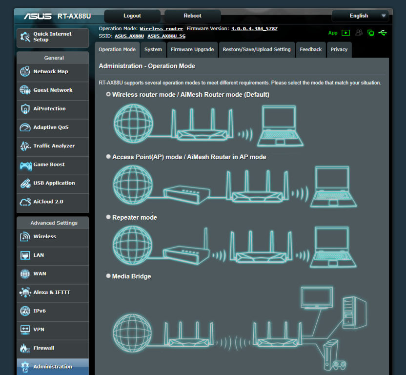
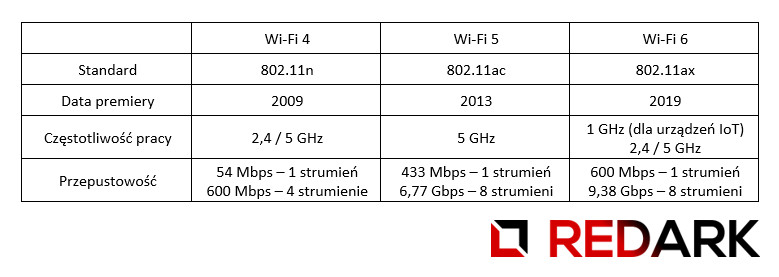
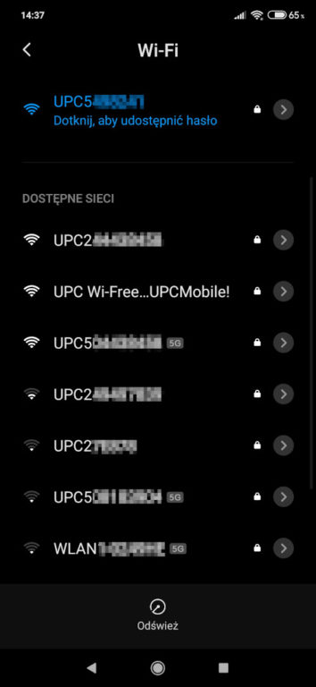

Każdy dom lub mieszkanie podłączone do internetu potrzebuje routera sieciowego. Od jego parametrów zależy, z jaką prędkością pobieramy informacje z internetu oraz jak daleko sięga zasięg Wi-Fi, który z roku na rok odgrywa coraz ważniejszą rolę w naszym domu. Sprawdźmy jakie parametry posiadają domowe routery oraz jakimi dodatkami "częstują" nas ich producenci.

## Czym właściwie jest router?

Na początku zadajmy sobie ważne pytanie: czym właściwie jest router? Jest to urządzenie sieciowe, którego zadaniem jest komunikowanie ze sobą dwóch sieci o różnej adresacji. W przypadku domowych zastosowań chodzi oczywiście o połączenie naszej domowej sieci z adresacją 192.168.x.x z siecią naszego [dostawcy internetu](/jak-dobrze-wybrac-dostawce-internetu). Proces przekazywania danych przez różne sieci określa się trasowaniem, którego nazwa w języku angielskim brzmi routing - stąd wzięło się nazewnictwo tego urządzenia.

## Różne tryby pracy routera

Zwykły "goły" router nie tworzy jeszcze sieci bezprzewodowej, ale modele przeznaczone do użytku domowego są urządzeniami wielozadaniowymi, które posiadają wbudowane anteny sieci Wi-Fi. Możemy wyszczególnić kilka trybów pracy, których dostępność zależy od oprogramowania producenta:

- **Router bezprzewodowy** - standardowy tryb pracy. Sieć utworzona przez router jest dystrybuowana zarówno po kablu, jak i bezprzewodowo.
- **Punkt AP (Access-point)** - router w tym trybie tworzy jedynie sieć bezprzewodową i łączy się przewodowo z innym routerem, który jest odpowiedzialny za routing ruchu do dostawcy internetu.
- **Tryb klienta** - w tym trybie router zamienia się w zwykłą kartę sieciową podobną do takiej znajdującej się w komputerze czy smartfonie. Urządzenie za pomocą łączności bezprzewodowej łączy się z istniejącą już siecią Wi-Fi, a następnie rozprowadza jej sygnał za pomocą swoich interfejsów kablowych. Najczęściej można zdecydować także, czy router ma stworzyć osobną adresację IP dla swoich urządzeń, czy też korzystać z adresacji sieci Wi-Fi.
- **Wzmacniacz sygnału (repeater)** - router w tym trybie służy do wzmacniania sygnału istniejącej sieci Wi-Fi. Jedynie odbiera i przekazuje dalej dane.
- **Most sieciowy (bridge)** - tryb umożliwia bezprzewodowe połączenie dwóch sieci lokalnych znajdujących się np. w różnych budynkach. Do stworzenia takiego połączenia zaleca się używanie identycznych modeli routera.

<ImageDescription>Przykładowy ekran zmiany trybów pracy</ImageDescription>

## Interfejsy przewodowe

Routery domowe najczęściej posiadają jeden port WAN (do podłączenia dostawcy internetu) oraz cztery porty LAN, do których możemy podłączyć nasze pozostałe urządzenia. W przypadku wyboru routera należy zwrócić uwagę na kilka rzeczy:

### Medium transmisyjne

Internet może dostać doprowadzony do usługobiorcy za pomocą kilku różnych mediów transmisyjnych. Należą do nich:

- **Linia telefoniczna** - typ transmisji wykorzystywany, chociażby przez Neostradę (Orange). Do jej obsługi router musi być wyposażony w modem ADSL lub VDSL.
- **Standardowa skrętka** - najpopularniejsza metoda dystrybuowania sieci internet. Sygnał dostarczany jest za pomocą ośmiożyłowego przewodu zakończonego wtyczką RJ-45.
- **Kabel koncentryczny** - technologia bardzo popularna w blokach mieszkalnych. Umożliwia przesyłanie wielu multimediów (telewizja, internet, telefon) za pomocą jednego wspólnego medium transmisyjnego. Z technologii DOCSIS korzysta m.in. UPC czy Netia.
- **Światłowód** - światłowód nie może zostać podłączony bezpośrednio do komputera. Wymagany jest tzw. terminal optyczny (GPON ONT), który zamienia sygnał optyczny na elektryczny. Jest on wbudowany w router lub ma postać osobnego urządzenia. W przypadku drugiego rozwiązania wystarczy wtedy dokupić standardowy router z gniazdem RJ-45.
- **Sieć GSM** - oprócz interfejsów sieciowych można spotkać także routery przystosowane do łączenia się z [bezprzewodową siecią komórkową](/jak-dobrze-wybrac-internet-mobilny). Takie modele posiadają dodatkowe anteny nadawczo-odbiorcze oraz slot na kartę SIM operatora.

<AdSense/>

### Prędkość maksymalna

Należy zwrócić także uwagę, jakiego typu interfejsy posiada dany model routera. Gniazda Fast Ethernet posiadają maksymalną prędkość wynoszącą 100 Mb/s, czyli 12 MB/s. Standardem stają się już porty Gigabit Ethernet osiągające do 1000 Mb/s, czyli 125 MB/s. Zapewni to, że na porcie WAN (na którym kumuluje się cały ruch sieciowy) nie dojdzie do przeciążenia i pojawienia się "wąskiego gardła". W dodatku w przypadku posiadania [umowy abonenckiej](/jak-dobrze-wybrac-dostawce-internetu) na prędkość powyżej 100 Mb/s kupowanie routera Fast Ethernet byłoby wyrzuceniem pieniędzy w błoto.

### Dodatkowy port WAN

Choć jest to raczej domena routerów serwerowych do zastosowań w firmach, to można spotkać czasami małe routery wyposażone w dwa porty sieci WAN. Umożliwiają one jednoczesne podłączenie sieci lokalnej do dwóch niezależnych dostawców internetu. Pozwala to zwiększyć przepustowość sieci oraz zapewnić redundantność połączenia - w przypadku awarii u jednego dostawcy, cały ruch kierowany jest na drugie łącze.

## Dodatkowe funkcje

Producenci, aby wyróżnić się na rynku, wyposażają swoje routery w szereg dodatkowych funkcji. Część z nich jest naprawdę interesująca. Opiszę poniżej najważniejsze z nich:

### QoS - w trosce o użytkownika

Jedną z najpopularniejszych funkcji routera jest QoS, czyli Quality of Service. Jest to oprogramowanie dbające o to, aby każdy użytkownik sieci dostał swój odpowiedni "kawałek tortu". Bez uruchomionego QoS może dojść do sytuacji, w której osoba pobierająca bardzo duży plik zabiera całą przepustowość łącza i blokuje dostęp do internetu innym domownikom. Zadaniem QoS jest analizowanie danych przepływających przez sieć i nadawanie im priorytetów. Dla przykładu: gry sieciowe oraz wideokonferencje dostają wyższy priorytet od ładowania zwykłych stron, ale nie mogą przekroczyć 80% wykorzystania łącza sieciowego. Wszystko zależy od konfiguracji ustawionej przez użytkownika.

### DDNS - lek na zmienny adres IP

[Bez specjalnej dopłaty u dostawcy](/jak-dobrze-wybrac-dostawce-internetu) nasz adres IP co jakiś czas ulega zmianie. Utrudnia to postawienie lokalnego serwera WWW lub uruchomienie kamerki IP monitorującej naszego pupila. Usługa DDNS pozwala skojarzyć nasz router z nazwą mnemoniczną. Dzięki temu, jeśli chcemy podejrzeć obraz z naszej kamerki, to nie musimy znać swojego aktualnego adresu IP, a użyć adresu pokroju "mojakamerka.ddns.net". Całą resztą zajmie się już Twój router i usługa DDNS.

### Tunel VPN - poczuj się jak w domu

Załóżmy taki scenariusz. Znajdujesz się u gości i chcesz im pokazać zdjęcia z ostatnich wakacji. Niestety nie posiadasz ich przy sobie na komputerze, a na dysku sieciowym stojącym na półce w Twoim domu. Jeśli skonfigurowałeś wcześniej w routerze tunel VPN, to bez problemu się do nich dostaniesz. VPN, czyli wirtualna sieć prywatna, pozwala na zdalne podłączenie się do swojej sieci lokalnej tak, jakbyśmy rzeczywiście siedzieli u siebie w domu. Możesz dzięki temu zdobyć dostęp do swojego komputera, dysku, drukarki, a nawet sterować inteligentnym oświetleniem.

### Wydzielona sieć dla gości

Rozwinięcie historii z poprzedniego akapitu. Tym razem to do Ciebie przyjechali goście i chcesz dać im dostęp do internetu. Sęk w tym, że w Twojej sieci znajduje się dysk sieciowy z danymi, do których nie powinni mieć oni dostępu. Rozwiązaniem jest wydzielona sieć Wi-Fi. Posiada ona osobną nazwę oraz hasło dostępu, a co najważniejsze - odizolowane otoczenie sieciowe. Nikt z tej sieci nie podłączy się do Twojego komputera, telewizora czy dysku z danymi.

### Wbudowany port USB

Coraz częściej w routerach możemy spotkać wbudowane porty USB. Mogą one pełnić zazwyczaj jedną z trzech funkcji:

- **Serwer plików** - nie chcesz kupować drogiego serwera NAS, a chcesz mieć dostęp do danych na wielu urządzeniach jednocześnie? Kup pendrive'a i podłącz go do routera, a Twoje pliki będą widoczne na każdym urządzeniu!
- **Serwer druku** - jeśli Twoja drukarka nie posiada karty sieciowej, możesz spróbować podłączyć ją do routera za pomocą kabla USB. Nie zawsze to rozwiązanie działa poprawnie, a także może np. nie pozwalać Ci na użycie skanera, ale mimo to warto wiedzieć o takiej możliwości.
- **Modem GSM** - niektóre routery pozwalają nawet na podłączenie pod nie modemów USB dostarczanych przez [operatorów telefonii komórkowych](/jak-dobrze-wybrac-internet-mobilny). Tutaj również mogą wystąpić problemy z kompatybilnością, ale jeśli dostawca kablowego internetu zawiedzie, to możliwość podłączenia zapasowego łącza może okazać się zbawienna.

W przypadku serwera plików oraz modemu GSM warto zainwestować w [port USB 3. generacji](/kablologia-zlacza-usb). W przypadku tych funkcji używanie USB 2.0 znacząco ograniczy przepustowość sieci.

### Firewall oraz kontrola rodzicielska

Wielu producentów dorzuca do swoich urządzeń podstawowe oprogramowanie chroniące przez atakami DDoS oraz ograniczające pulę urządzeń, jakie mogą zostać podłączone do sieci. Dodatkowo można tam spotkać funkcje kontroli rodzicielskiej umożliwiające blokadę dostępu do określonych stron lub o określonych porach dnia.

### Przycisk WPS

Na obudowach domowych routerów można spotkać przyciski oznaczone skrótem WPS. Jest to technologia umożliwiająca podłączenie nowego urządzenia do sieci Wi-Fi bez znajomości hasła dostępowego. Aby jej użyć, należy wybrać odpowiednią opcję na urządzeniu docelowym np. "połącz przy użyciu WPS". Uruchomi to ograniczone czasowo nasłuchiwanie urządzenia na sygnał routera. W tym czasie należy nacisnąć przycisk WPS na routerze, a nasze urządzenie zostanie automatycznie skonfigurowane i podłączone do sieci.

<AdSense/>

## Parametry sieci Wi-Fi

Pozostało jeszcze omówić parametry sieci bezprzewodowej, jaką tworzy nasz router. Będzie to przede wszystkim standard oraz częstotliwość, w jakiej pracuje. Wydajność może wzrosnąć także przy pomocy technologii MU-MIMO, o której pokrótce opowiem.

<InfoBlock>Czasami słyszę stwierdzenie, że szybkość Wi-Fi w danym routerze można stwierdzić po ilości anten wychodzących z routera. Po części można tak powiedzieć, ponieważ duża ilość anten świadczy o wsparciu technologii MU-MIMO, ale nie jest to wyznacznik. Wiele modeli routerów posiada anteny ukryte pod obudową, co zwiększa ich estetyczność.</InfoBlock>

### Standard oraz częstotliwość pracy

Obecnie sieć Wi-Fi wykorzystuje dwie częstotliwości: 2,4 GHz i 5 GHz, a dokładnie od 2,4 do 2,48 oraz od 4,9 do 5,8 GHz. Sposób działania sieci reguluje standard IEEE 802.11. Do tej pory powstało już kilkanaście wariantów tego standardu, a oznaczane są one małymi literami: 802.11a, 802.11b, 802.11g, 802.11n, 802.11ac itd. Zrobił się z tego straszny bajzel, dlatego stowarzyszenie WiFi Alliance postanowiło uprościć numerację tych standardów i obecnie na rynku możemy spotkać tych trzech zawodników:

Wybierając router, należy sprawdzić jakie standardy Wi-Fi on wspiera (im nowsze, tym lepiej), a także, na jakiej częstotliwości pracują nasze laptopy, telefony i inne urządzenia. Częstotliwość 2,4 GHz jest tą podstawową formą komunikacji. Niestety ze względu na duże obciążenie i dużą podatność na zakłócenia Wi-Fi pracujące na tym paśmie może bardzo słabo działać. Widać to szczególnie w miastach. Ja sam mieszkam w bloku, w którym praktycznie każde mieszkanie jest wyposażone w router UPC, który tworzy do trzech sieci Wi-Fi - jedną osobistą, jedną gościnną i jedną publiczną dla wszystkich abonentów UPC ([usługa UPC Wi-Free](https://www.upc.pl/internet/poznaj/wi-free/)). Zakłócenia są ogromne, nie ma wolnych kanałów, a urządzenia co chwilę tracą połączenie.

<ImageDescription>Mój telefon znalazł 8 sieci Wi-Fi, w tym 3 pracujące także w paśmie 5 GHz</ImageDescription>

W takich przypadkach warto jest rozważyć przejście na 5 GHz. Jest to znacznie mniej oblegane pasmo, a także dzięki większej częstotliwości jest szybsze i mniej podatne na zakłócenia. Ceną jest niestety zasięg, który jest znacznie mniejszy niż w przypadku 2.4 GHz. Obecnie na rynku królują routery "dual-band", które tworzą sieci Wi-Fi na obu częstotliwościach. Powoduje to, że starsze urządzenia mogą nadal korzystać ze słabszego 2,4 GHz, natomiast [urządzenia wspierające już 5 GHz](/recenzja-xiaomi-mi-9-se) automatycznie przełączą się na lepsze pasmo. Na rynku można spotkać również urządzenia "tri-band", które mają zdublowane pasmo 5 GHz do obsługi większej liczby urządzeń. Istnieją również routery "quad-stream" wykorzystujące częstotliwość 60 GHz, ale jest to tak mało popularna technologia, że nie warto zawracać sobie nią głowy.

<WarningBlock>Ostatnimi czasy głośno jest o wprowadzeniu nowej generacji sieci komórkowej o nazwie 5G. Wielu przeciwników tej technologii, którzy kompletnie nie znają się na technologii, próbują powiązać Wi-Fi 5 GHz z siecią 5G. Doprowadzało to do tak kuriozalnych sytuacji, jak oskarżanie dostawcy internetu o potajemną próbę kontroli ich umysłów. Tak, to nie żart. Wszystkie te osoby pragnę poinformować, że standard 802.11a, który jako pierwszy wykorzystywał częstotliwość 5 GHz, został opracowany w 1999 roku.</WarningBlock>

### Technologia MU-MIMO

Na koniec kilka słów o technologii MU-MIMO. Standardowy router w trybie SU-MIMO (single user) wysyła dane do jednego urządzenia naraz. Uniemożliwia to komfortowe przesyłanie plików przez kilka urządzeń naraz. Z tego powodu powstała technologia MU-MIMO (multi user), która usprawnia proces wysyłania danych do urządzenia dzięki wykorzystaniu kilku anten jednocześnie oraz tzw. formowania wiązki, dzięki czemu sygnał idzie bezpośrednio w kierunku urządzenia docelowego.

Dla przykładu: mając router obsługujący 4 strumienie danych, jesteśmy w stanie obsłużyć 4 telefony z maksymalną prędkością lub na przykład dwie karty sieciowe wyposażone w parę anten. Dla jasności należy zaznaczyć jeszcze, że MU-MIMO jest dostępne tylko dla częstotliwości 5 GHz, a dzielenie sygnału na kilka anten dotyczy jedynie przesyłu danych z routera do urządzenia docelowego. Upload danych odbywa się nadal w trybie SU-MIMO. Po więcej informacji zapraszam do super merytorycznego [artykułu od Computerworld](https://www.computerworld.pl/news/Co-warto-wiedziec-o-MU-MIMO,405520.html).
