Jeśli czytasz ten artykuł, zapewne zdarzyło Ci się zostawić uśpiony komputer na przykład na czas pójścia do toalety, a po Twoim powrocie okazało się, że komputer pracuje sobie w najlepsze. Niestety jest to dość popularny problem, który dotyka system Windows. Choć jego rozwiązanie wymaga przeklikania się przez wiele ustawień systemowych, to nie jest to trudne zadanie i każdy może rozwiązać ten problem samemu. Jeśli nie wiesz, na czym polega usypianie komputera i czym różni się ono od hibernacji, to zapraszam do [artykułu uzupełniającego tę wiedzę mojego autorstwa](/uspienie-hibernacja-wylaczenie-rozne-stany-pracy-komputera).

## Identyfikacja problemu

Procedurę wybudzania komputera z trybu uśpienia może wywoływać jedna z następujących rzeczy:

- urządzenie peryferyjne (np. mysz lub klawiatura),
- karta sieciowa,
- aplikacja zainstalowana przez użytkownika,
- timer lub usługa systemowa (np. Windows Update).

### Przyczyna ostatniego wybudzenia

Aby dowiedzieć się, co spowodowało wyjście ze stanu uśpienia, możesz skorzystać z bardzo pomocnej komendy wiersza poleceń. W tym celu wyszukaj aplikację "Wiersz poleceń" lub w skrócie "cmd", a następnie wpisz do konsoli następującą komendę:

<Quote>powercfg -lastwake</Quote>

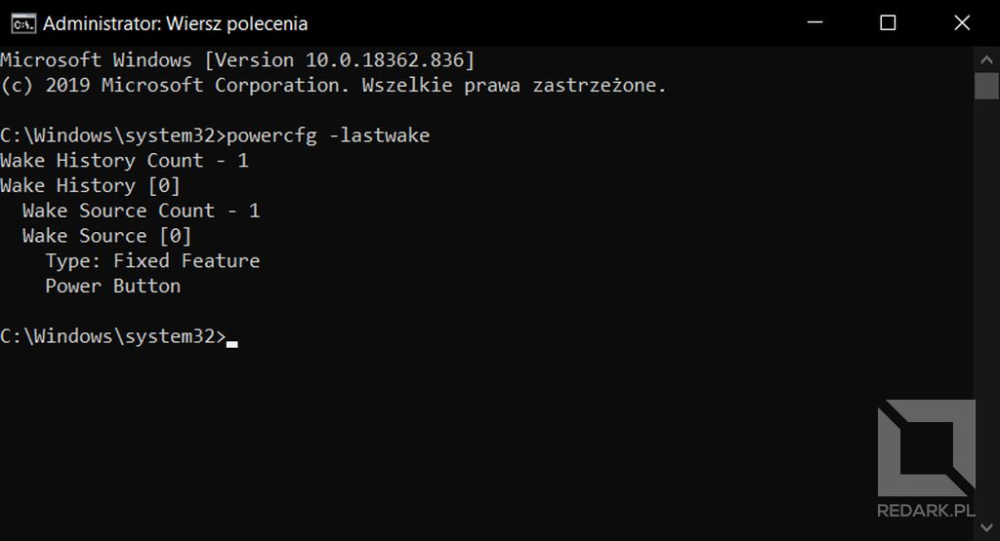

W moim przypadku komenda oznajmiła, że przyczyną wybudzenia był "Power Button", czyli przycisk zasilania znajdujący się na obudowie. Komenda ta czasami zawodzi i nie pokazuje źródła problemu, ale często jest bardzo pomocna.

### Dziennik zdarzeń systemowych

Oprócz powyższej metody istnieje jeszcze jeden sposób na znalezienie winowajcy. Za pomocą wyszukiwarki systemowej znajdź aplikację o nazwie "Podgląd zdarzeń". W liście rozwijanej po lewej stronie okna wybierz "Dzienniki systemu Windows", a następnie "System". Na liście pośrodku znajdziesz setki przeróżnych zdarzeń zarejestrowanych przez system Windows. Aby zobaczyć tylko te dotyczące zasilania, kliknij prawym przyciskiem myszy na pozycję "System", którą chwilę wcześniej wybrałeś, a następnie wybierz opcję "Filtruj bieżący dziennik...". W nowo otwartym oknie odnajdź listę rozwijaną zatytułowaną "źródła zdarzeń" i wybierz pozycję "Power-Troubleshooter".

<Gallery width='2'>
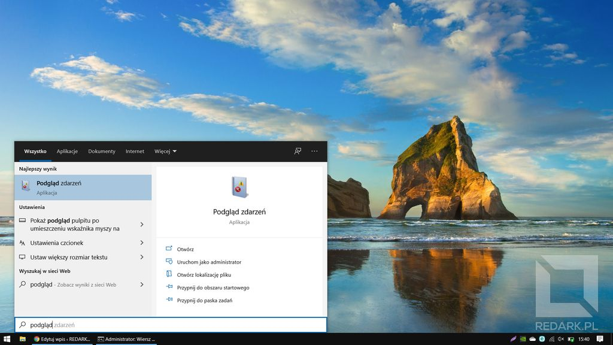
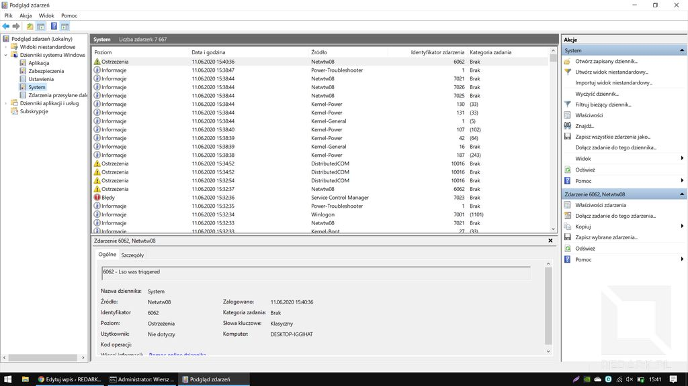
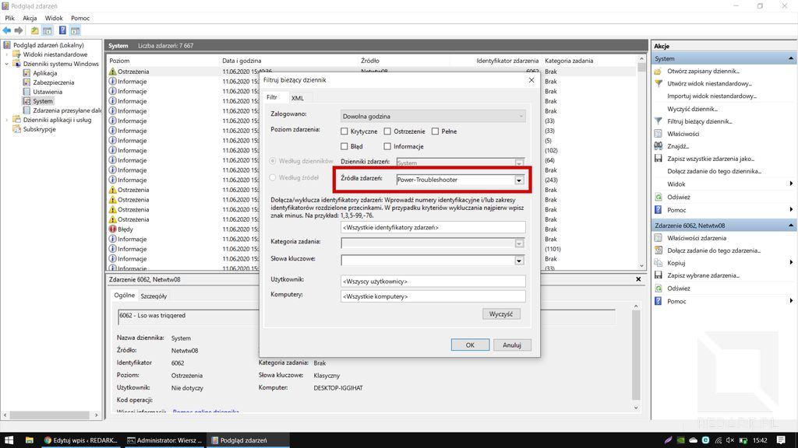
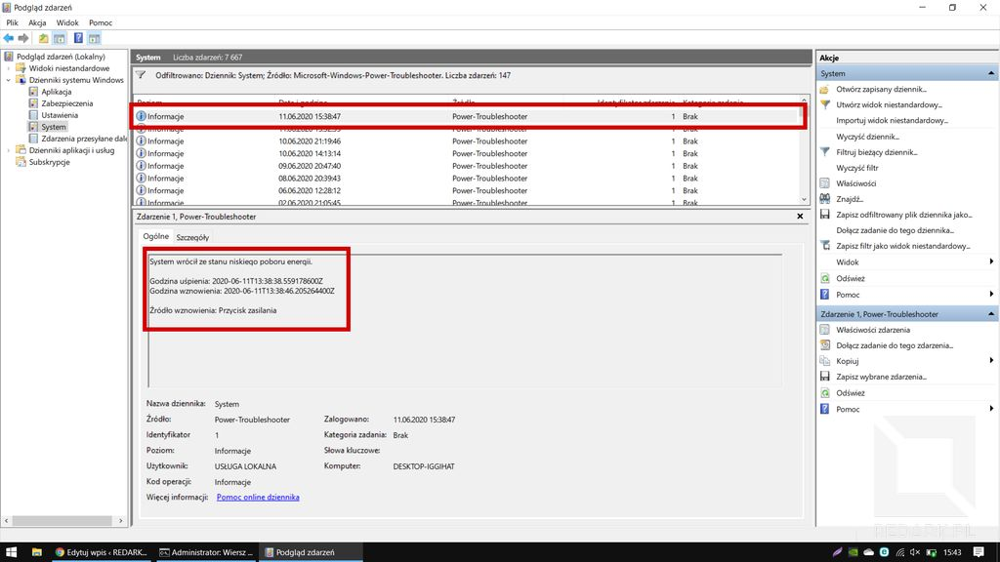
</Gallery>

Po zatwierdzeniu filtrów odnajdź na liście interesujący Cię przypadek samoczynnego wybudzenia się komputera. U mnie ostatnie zdarzenie dotyczyło "powrotu ze stanu niskiego poboru energii", uśpienie i wznowienie pracy nastąpiło o godzinie tej i tej, a źródłem wznowienia był "Przycisk zasilania". Jak widzisz, przyczyną ponownie okazał się przycisk zasilania.

## Odmawianie uprawnień do wybudzania

Problemy z samowzbudzaniem się komputera spowodowane są tym, że system Windows dość ochoczo rozdaje wszystkim uprawnienia do zarządzania zasilaniem komputera. Niestety wiele urządzeń nadużywa tego dostępu i powoduje nieświadomie uruchamianie się komputera. Moja dewiza jest prosta: nic nie ma mieć prawa do wybudzania komputera, a jedyną możliwością ma być prawilny przycisk na obudowie. Zero kłopotów i pełna kontrola. Teraz pokażę Ci, jak skonfigurować system w taki sposób.

<AdSense/>

### Menadżer urządzeń

Najwięcej przyczyn problemu rozwiążesz w menadżerze urządzeń. Jest to aplikacja systemowa pokazująca wszystkie urządzenia podłączone w danej chwili do komputera. Jest ona również przydatna, gdy mamy problemy ze sterownikami, ale tym tematem nie będziemy się teraz zajmować. Aby otworzyć menadżer urządzeń, otwórz eksplorator plików i kliknij prawym przyciskiem myszy na "Ten komputer". Z menu kontekstowego wybierz pozycję "Zarządzaj". W nowo otwartym oknie znajdź po lewej pozycję "Menadżer urządzeń".

Twoje zadanie to teraz zlokalizować trzy elementy komputera: mysz, klawiaturę i kartę sieciową. Pierwszą rzecz znajdziesz w kategorii "Mysz i inne urządzenia wskazujące", drugą w "Klawiatury", a trzecią w "Karty sieciowe". U mnie kart sieciowych wyskoczyło bardzo duże, ale rzeczywista jest tylko jedna (Intel Wireless) - pozostałe to karty wirtualne.

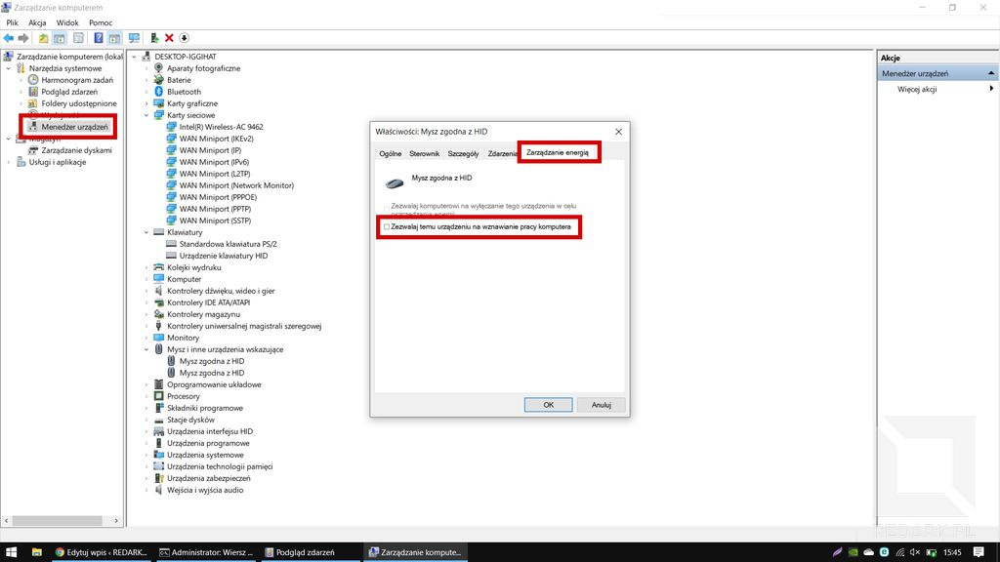

Gdy zlokalizowaliśmy już potencjalnych winowajców czas przystąpić do działania. Kliknij dwukrotnie na każdą pozycję znajdującą się na tych trzech listach i sprawdź, czy okno zawiera kartę "Zarządzanie energią". Jeśli tak, to wejdź na nią i odznacz opcję "Zezwalaj temu urządzeniu na wznawianie pracy komputera". Jeden potencjalny winowajca mniej, teraz zrób tak z całą resztą.

<InfoBlock>Ciekawostka: jedna z ostatnio recenzowanych przeze mnie myszy bezprzewodowych była rozpoznawana w systemie jako mysz i klawiatura oddzielnie. Było to spowodowane tym, że producent zastosował w niej uniwersalny nadajnik, który montował w obu typach urządzeń.</InfoBlock>

<ActionButton to='/recenzja-myszy-logitech-m185'>Zobacz recenzję myszy Logitech M185</ActionButton>

### Sprawdzanie listy uprawnionych urządzeń

Jeśli chcesz, możesz upewnić się, czy odmówiłeś praw wszystkim urządzeniom za pomocą komendy wiersza poleceń:

<Quote>powercfg -devicequery wake_armed</Quote>

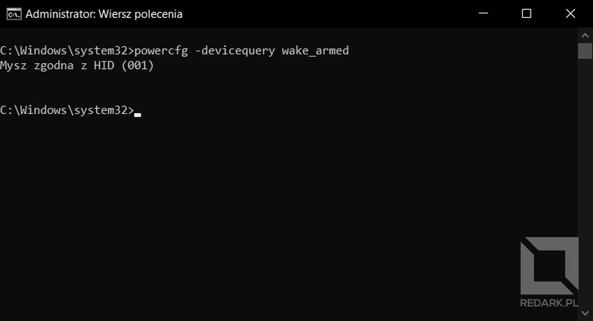

Z mojego doświadczenia wynika, że czystka w menadżerze urządzeń najczęściej rozwiązuje problem wybudzania się komputera, który powodowała, chociażby cały czas działająca myszka. Jeśli Twój problem nadal występuje, wykonaj jeszcze operacje opisane poniżej.

### Wyłączanie funkcji Wake on LAN

Czy wiesz, dlaczego oprócz myszy i klawiatury kazałem Ci również wyłączyć zarządzanie zasilaniem w kartach sieciowych? [Wake on LAN](https://pl.wikipedia.org/wiki/Wake_on_LAN) jest to specjalna technologia służąca do zdalnego wznawiania pracy komputera. Użytkownik może wysłać pod wskazany adres IP tzw. "[magic packet](https://pl.wikipedia.org/wiki/Magic_Packet)", który odebrany przez kartę sieciową wznawia pracę komputera. Nie jest to technologia, która znalazłaby zastosowanie w domowych warunkach, a czasami doprowadza ona właśnie do niepotrzebnego wybudzania komputera.

Aby całkowicie ją dezaktywować, oprócz menadżera urządzeń, należy wyłączyć ją również w BIOS-ie płyty głównej. Nie będę tutaj tłumaczył jak to zrobić, ponieważ każdy komputer posiada inną procedurę wchodzenia do BIOS-u i zmiany tej opcji. Instrukcję jak to zrobić znajdziesz w dokumentacji swojej płyty głównej lub w internecie.

### Zdarzenia czasomierza

System Windows posiada tzw. zdarzenia czasomierza, czyli mechanizm, który pozwala rejestrować akcje, które mają inicjować wybudzanie komputera. Aby podejrzeć te zdarzenia, należy skorzystać z poniższej komendy:

<Quote>powercfg -waketimers</Quote>

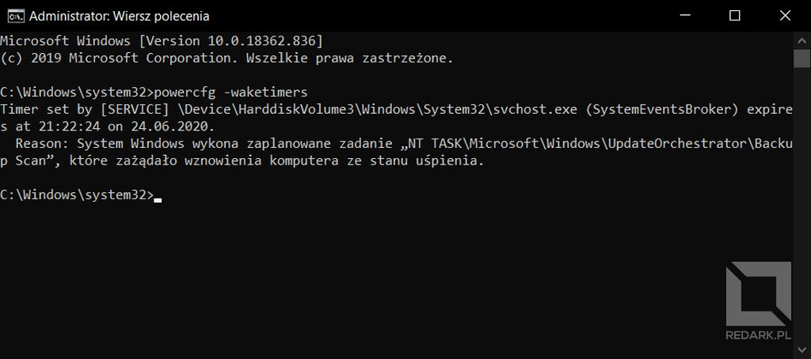

U mnie pojawiła się jedna pozycja "UpdateOrchestrator\\Backup Scan". Wyłączeniem tej konkretnej opcji zajmiemy się w następnym podrozdziale, a teraz pokażę Ci, jak można wyłączyć wszystkie pozycje znajdujące się na tej liście. Wyszukaj aplikację "Edytuj plan zasilania" i wybierz opcję "Zmień zaawansowane ustawienia zasilania". Na liście znajdź węzły "Uśpienie" i "Zezwalaj na wznawianie pracy według czasomierza", a następnie wyłącz znajdującą się tam opcję. Od teraz system nie będzie się wybudzał.

<Gallery>
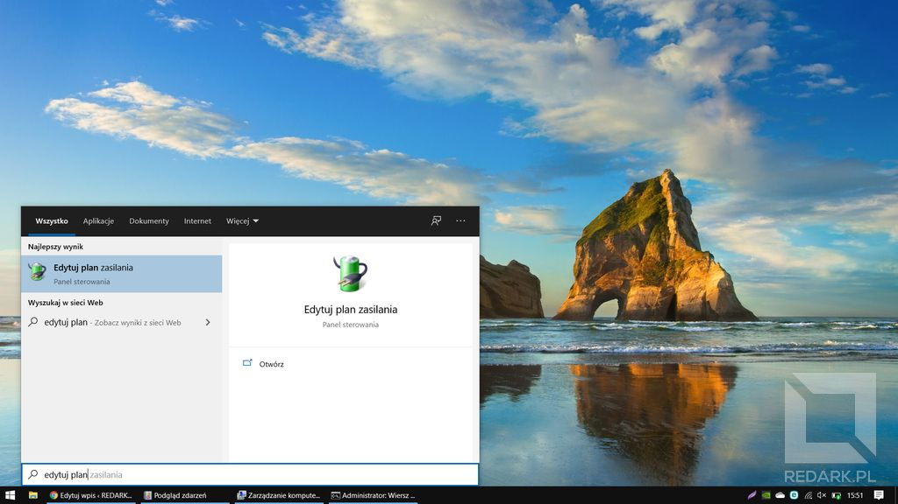
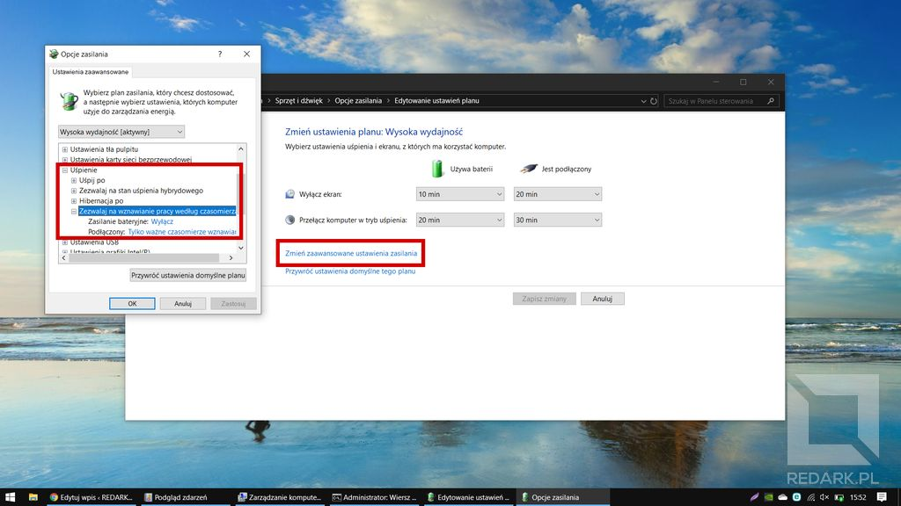
</Gallery>

### Automatyczna konserwacja systemu

Czasomierz, który pojawił się u mnie w poprzednim podrozdziale, dotyczy usługi automatycznej konserwacji systemu Windows. Domyślnie jest ona ustawiona na godzinę drugą w nocy i jej zadaniem jest codzienne zrestartowanie komputera w celu instalacji aktualizacji oraz wykonania innych rzeczy, o których chyba nie chcemy mieć pojęcia ;) . Aby ją zdezaktywować, należy przejść do panelu sterowania i zakładek: "System i zabezpieczenia" oraz "Zabezpieczenia i konserwacja". Następnie należy rozwinąć kategorię "Konserwacja" i wybrać opcję "Zmień ustawienia konserwacji". W otwartym oknie znajdziemy opcję umożliwiającą wyłączenie omawianej konserwacji. Ech, jak ja kocham Windowsa...

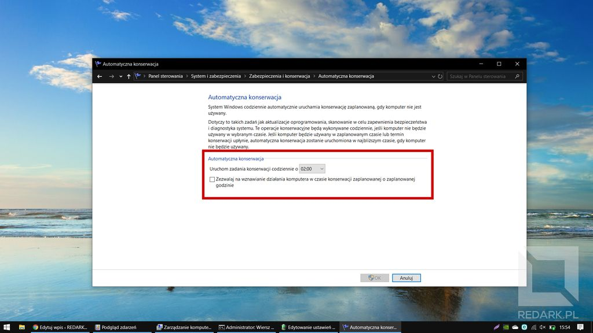
