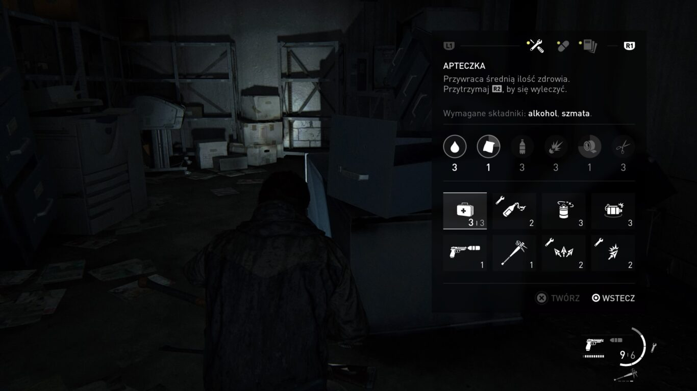
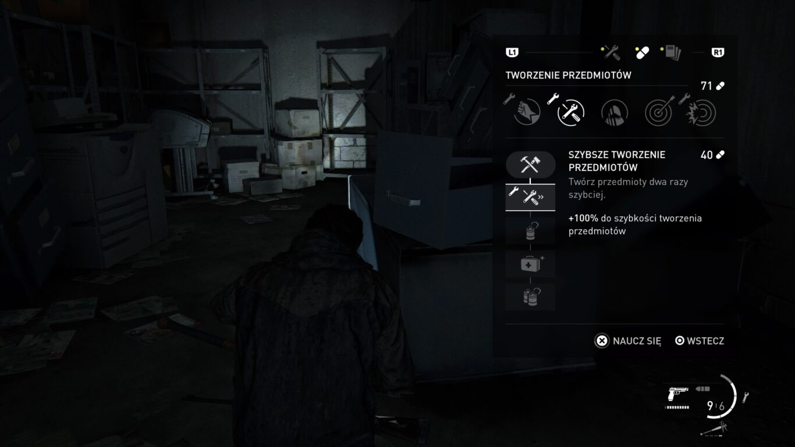
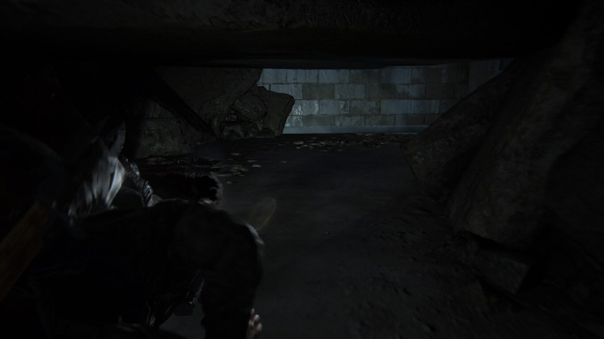
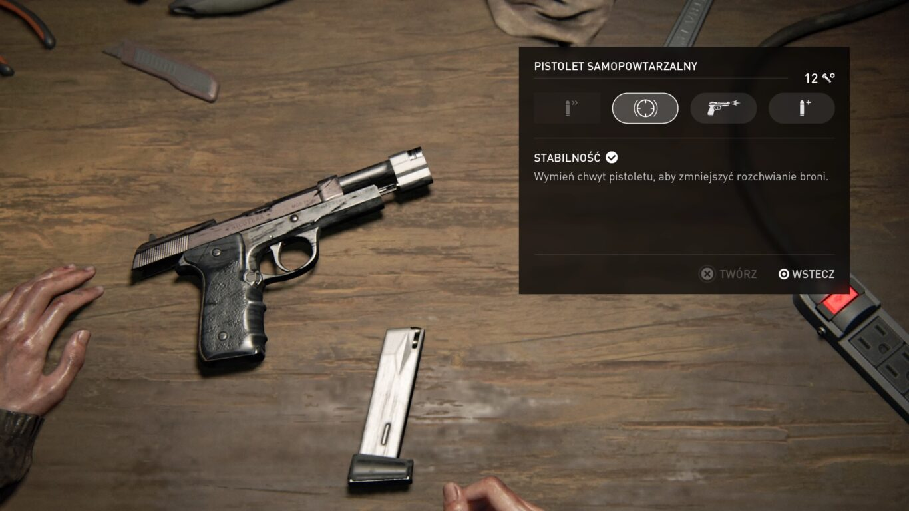
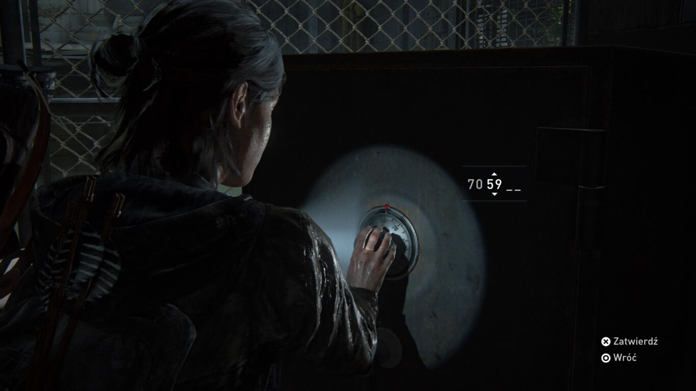
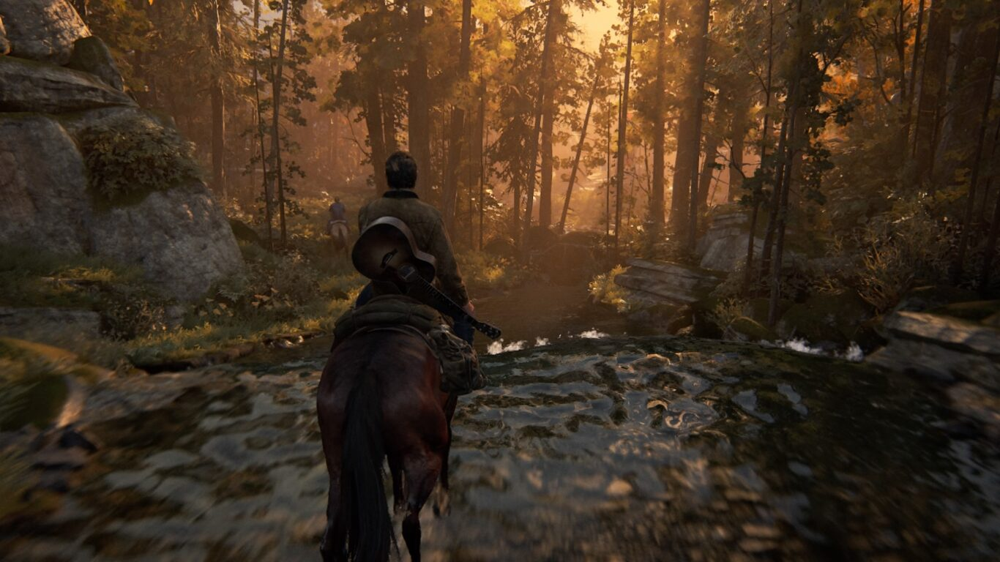
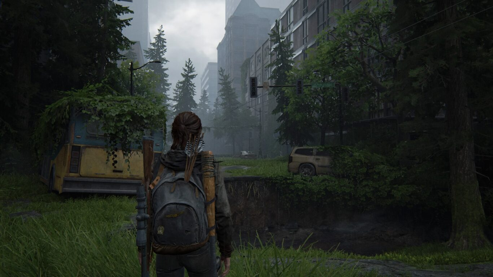
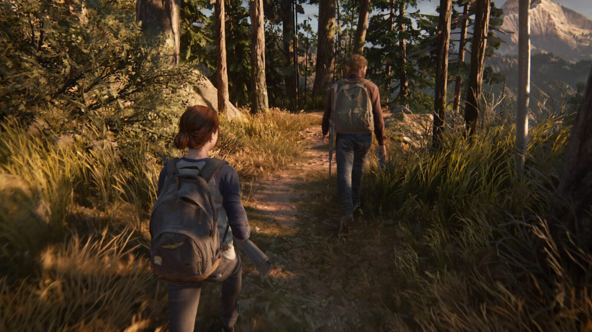

Po 7 latach od premiery pierwszej części The Last Of Us nareszcie dostałem możliwość poznania dalszych przygód Joela oraz Ellie. Recenzja nie zawiera spoilerów i omawia minimalną ilość fabuły. Choć jestem ogromnym fanem serii The Last Of Us, nie będzie to jednak kolejny tekst wychwalający ten tytuł i dający mu same oceny 10/10. Bez przedłużania, zacznijmy tego, co gra robi naprawdę dobrze.

## Eksploracja

Druga odsłona gry nie wprowadza ogromnych rewolucji w kwestii prowadzenia rozgrywki. Ponownie eksplorujemy lokacje w poszukiwaniu surowców, z których tworzymy potrzebne nam przedmioty, bronie oraz amunicje. Rozwój postaci odbywa się poprzez zbieranie tabletek rozsianych po świecie gry i odblokowywanie nimi kolejnych pozycji na drzewku umiejętności. Jedyna różnica polega na tym, że na początku gry mamy odblokowaną tylko jedną ścieżkę rozwoju, a kolejne pojawiają się dopiero po znalezieniu specjalnych podręczników szkoleniowych, które notabene super wynagradzają uważne przeszukiwanie lokacji.

Lecz mówienie, że rozgrywka w Part II to to samo co w jedynce jest kłamstwem. Naughty Dog bardzo postarało się o to, aby gracz otrzymał szeroki wachlarz nowych możliwości. Na pewno największą zaletą jest znacznie większa mobilność głównej bohaterki. Ellie może teraz kłaść się na ziemi, ukrywać pod autami, przeciskać przez szczeliny oraz wspinać na wiele obiektów. Tutaj zgodzę się z twórcami, którzy chwalili się bardziej wertykalną rozgrywką. Dzięki opisanym wcześniej mechanizmom lokacje mogą niemalże przytłaczać złożonością i ilością kondygnacji. Pierwsze The Last Of Us wypada pod tym względem biedne. Lokacje były płaskie, a na piętra można było się dostać tylko za sprawą schodów. Rozgrywka w Part II jest znacznie bardziej dynamiczna, a ilość możliwości przeprowadzania ataków nieograniczona.

<Gallery width='2'>

</Gallery>

## Walka

Dużą świeżość można znaleźć w systemie walki, który otrzymał tak banalną funkcję jak robienie uników. Pamiętam, że w jedynce często można było wciskać bez opamiętania przycisk ataku, a postać sama naprowadzała się na cel, a jej ciosy były prawie zawsze skuteczne. Tutaj to już nie działa. Każdy przeciwnik, nieważne czy człowiek, czy zarażony, posiada swój schemat zachowania, który gracz musi poznać i nauczyć się znajdować w nim momenty idealne do zadania ciosu. W przeciwnym wypadku zostaniemy bardzo szybko zabici. Na duży plus zasługuje też zmieniony system porozumiewania się przeciwników. Używają oni swoich imion, wydają sobie polecenia przeszukania konkretnych lokacji, flankują, a także informują się, gdzie zauważyli przeciwnika np. "Widzę ją! Jest w tartaku!". Robi to wrażenie.

Jednak największą zaletą systemu walki jest reagowanie postaci na obrażenia i znajdujące się obok przedmioty. Mechanizm ten był już obecny w jedynce, ale tutaj został wyśrubowany do granic możliwości. Przeciwnicy trzymają się za zranione kulą lub nożem miejsca, kuleją lub leżą półżywi na ziemi próbując jeszcze wyciągnąć pistolet z kabury. Wielokrotnie spotkałem się też z sytuacją, w której zarażony mimo odstrzelenia obu nóg nadal usilnie próbował mnie dorwać, czołgając się po ziemi. Animacje zabójstw są brutalne oraz tak jak mówiłem, wykorzystują elementy otoczenia. Obok znajduje się stół? Bohaterka roztrzaska głowę przeciwnika o jego kant lub położy go na nim i wyrwaną wrogowi sekundę wcześniej siekierą rozpruje mu wnętrzności. Wszystko jest płynne i mimo bardzo dużej brutalności sprawia ogromną satysfakcję. Aby nie przedłużać więcej tego wywodu, ośmielę się posiłkować kilkoma znalezionymi na Twitterze filmikami użytkownika [SunhiLegend](https://twitter.com/SunhiLegend). To, co one przedstawiają, nie jest fotomontażem. Takie akcje rzeczywiście da się w grze zrobić.

<VideoViewer file='images/Ea1X5PQX0AgU5jR.mp4'></VideoViewer>

<VideoViewer file='images/Ea5Pb75WkAAbKOE-1.mp4'></VideoViewer>

<VideoViewer file='images/EbSN3MhXYAAskEz-1.mp4'></VideoViewer>

## Zagadki logiczne

Nie sposób nie zauważyć w grze pomysłów zaczerpniętych z serii Uncharted - drugiej najpopularniejszej serii studia Naughty Dog. Podczas eksploracji lokacji w pierwszej części gry mogliśmy napotkać dwa typy sekretów. Pierwszym z nich były zamknięte pokoje, które wymagały zużycia ostrza do otworzenia zamka. Drugą natomiast były sejfy, do których szyfr mogliśmy znaleźć na notatce "znajdźce" gdzieś w pobliżu. Było to fajne, ale nic bardzo angażującego. Part II poszło w tej kwestii w bardzo dobrym kierunku.

<AdSense/>

W trakcie gry możemy natknąć się na drzwi, które z jakiegoś powodu nie pozwalają się otworzyć. Tym razem, zamiast bawić się w ślusarza, musimy znaleźć alternatywną drogę do interesującego nas pokoju, a to nie zawsze jest proste i oczywiste. Podobnie jest z sejfami. Tym razem kombinację wprowadzamy ręcznie, a kod nie zawsze jest podany jak na tacy na którejś z notatek. Podam kilka przykładów. Znajdujemy list do męża z informacją, że kodem do sejfu jest ich data ślubu. Oczywiście nie znamy jej, ale gdy uważnie przyjrzymy się ich pokojowi, zauważymy kalendarz na ścianie, na którym zaznaczony jest dzień podpisany jako rocznica ślubu, a z tego łatwo możemy obliczyć poprawną kombinację. Sprytne i genialne! Bardzo podobał mi się, chociażby sekret z pracownikiem, który śmiał się z zawsze zapominającego kodu do drzwi wejściowych kolegi, dlatego przygotował dla niego mini pomoc, o ile najpierw kupi mu napój w automacie. Co dalej trzeba było zrobić, nie powiem :) .

<Gallery width='2'>

</Gallery>

Dużym urozmaiceniem jest też wprowadzona do gry fizyka przewodów oraz lin, których fizyka notabene została wykonana rewelacyjnie. Dużo nowości wprowadziła także możliwość rozbijania szyb. Mechaniki te posłużą nam do rozwiązywania wspomnianych wcześniej zagadek oraz popychania fabuły do przodu, co wymaga czasami odrobiny pogłówkowania. Podsumowując: wprowadzenie zagadek do TLOU było bardzo dobrym pomysłem, a po rozwiązaniu każdej z nich byłem pod ogromnym wrażeniem pomysłów deweloperów.

## Nowi przeciwnicy

Chciałbym powiedzieć jeszcze kilka słów na temat nowych przeciwników. Zgodnie z zapowiedziami twórców stawimy czoła trzem frakcjom: zarażonymi, organizacji militarnej WLF oraz sekcie religijnej - Serafitów. Szeregi zarażonych uzupełnią dwa nowe typy. Jeden z nim to jedynie wariacja purchlaka (znanego z jedynki), który nie był jakoś bardzo odkrywczy. Drugi natomiast, to czyhacz. Nazwa chyba mówi już sama za siebie, co jest jego specjalnością. Ten typ przeciwnika akurat genialnie urozmaicił rozgrywkę, doprowadzając mnie często niemalże do ataku serca. Żołnierze WLF są doskonale uzbrojeni, a Serafici preferują łuk i broń białą. Dodatkowo występują w mrocznych lokacjach i komunikują się za pomocą gwizdania, co wywołuje dodatkowe ciarki na plecach.

Organizacja WLF oprócz broni palnej posiada także wychwalane przez deweloperów psy. Z nimi miałem trochę problem. Choć zaprojektowane są super, to niepotrzebnie przyspieszają rozgrywkę. Dodatkowo z zapewnień deweloperów, że "nie musimy ich zabijać" nic nie wyszło. Grali oni chyba na niskim poziomie trudności. Wybierając poziom trudny, który jest idealny do surwiwalu, jakim jest The Last Of Us, nie sposób przejść obok nich niezauważonym. Niby można spróbować ominąć lokacje z nimi, ale dla gracza, który walczy o każdy surowiec i chce zwiedzić każdy zakątek wirtualnego świata, nie jest to rozwiązanie. Dodatkową wadą psów jest jeszcze jedna kwestia fabularna, ale nie chcę jej w tym miejscu przytoczyć. Podsumowując: choć pomysł na urozmaicenie rozgrywki był dobry, to uważam, że obecność psów w takiej formie zaszkodziła grze.

## Oprawa audiowizualna

To, co na pewno nie podlega dyskusji, to oprawa audiowizualna gry. Naughty Dog ponownie pokazało wyżyny swoich możliwości, dostarczając graczom rewelacyjnie wyglądający postapokaliptyczny świat gry. Każda lokacja, którą odwiedzamy, ma swój unikatowy styl, a wspomniany wcześniej wertykalny sposób zwiedzania poziomów, tylko to uwydatnił. Wielokrotnie zdarzało mi się przystawać na chwilę i zachwycać cyfrowym krajobrazem.

<Gallery width='2'>

</Gallery>

The Last Of Us: Part II to pod względem technicznym majstersztyk. Rewelacyjna optymalizacja, mnóstwo ustawień personalizacji poziomu trudności i interfejsu, a także ładowanie poziomu po śmierci trwające dosłownie 1-2 sekundy sprawiają, że przechodzenie rozdziałów tego tytułu to czysta przyjemność. Nawet moja podstawowa PS4'ka rzadko włączała maksymalny "tryb suszarki", choć słyszałem (dosłownie), że posiadacze wersji Pro mieli z tym gorzej. Ogromne brawa za rozbudowane opcje ułatwień dostępu. Choć z nich nie korzystałem, to widziałem, jak bardzo twórcy postarali się, aby po ich tytuł mógł sięgnąć każdy gracz.

Za muzykę ponownie odpowiedzialny jest argentyński kompozytor Gustavo Santaolalla. Ścieżka dźwiękowa jest utrzymana w tym samym stylu co w jedynce, ale moim zdaniem odegrała tutaj mniejszą, bardziej stonowaną rolę. Oczywiście nadal jest ona na wysokim poziomie, ale nie wywoływała ona takich ciarek jak poprzednio. Po prostu jest dobrze wykonana i nic więcej.

<AdSense/>

## Sztuczna inteligencja

Jeśli miałbym się do czegoś przyczepić w kwestii działania gry, to byłaby to sztuczna inteligencja przeciwników oraz naszych towarzyszy, która czasami wyraźnie szwankowała. W jednej lokacji udało mi się wybić pół oddziału nożem, tworząc tym samym usłany zwłokami "pokoik śmierci". Co do naszych towarzyszy, to mieli oni problem ze znalezieniem swojego miejsca za osłoną. Gdy znajdowali się obok nas, nerwowo przybierali nogami w miejscu, generując tym samym hałas, który nie pozwalał mi się skupić na lokalizowaniu przeciwników. Dodatkowo zdarzało mi się, że biegnący towarzysz postanawiał zająć moje miejsce za osłoną, co powodowało, że zostawałem wypchnięty tuż pod nogi przeciwnika, który sprzedawał mi od razu cios w głowę. Nie było to nagminne, ale na tyle częste, że zwróciłem na to uwagę. Uważam, że Ellie w pierwszej części mniej przeszkadzała Joelowi w skradaniu, ale prawdopodobnie przez to, że lokacje tam były znacznie mniej skomplikowane.

## Fabuła

Part II jest to kontynuacja historii opowiedzianej w pierwszym The Last Of Us, dlatego znajomość tamtej fabuły jest wskazana, a nawet obowiązkowa. Ja grę przeszedłem na poziomie trudnym (i takowy polecam) i cała fabuła łącznie z "wylizaniem" wszystkich lokacji w poszukiwaniu surowców i znajdziek zajęła mi nieco ponad 30 godzin. Długo zastanawiałem się, w jaki sposób opowiedzieć o fabule The Last Of Us: Part II, by nie niszczyć zabawy osobom, które chcą ją odkryć samemu. Chcę jednak o niej opowiedzieć, ponieważ uważam ją za najsłabszy element gry. Niestety. Postanowiłem zatem przygotować dwa artykuły. Pierwszy, ten, który teraz czytasz, nie zawiera treści zdradzających fabułę, a jedynie mocne ogólniki. Drugi artykuł będzie poświęcony w całości omówieniu mojego poglądu na fabułę The Last Of Us: Part II i zapraszam jego przeczytania jedynie osoby, które skończyły już ten tytuł lub nie zamierzają go przechodzić. Artykuł zostanie podlinkowany pod koniec tego tekstu.

Podsumujmy to, co Part II nadal robi dobrze. Lokacje zapierają dech w piersiach. Walki z ludźmi oraz zarażonymi wywołują niesamowite emocje, których próżno szukać w jakimkolwiek innym tytule. Przerażający dźwięk klikaczy, krzyki zranionych przez nas przeciwników dalej wywołują ciarki na plecach. To są powody, dla których naprawdę warto sięgnąć po ten tytuł. Niestety uważam, że na tym większe zalety Part II się kończą.

## Cel podróży

Po pierwsze momentami czuć, że rozgrywkę rozciągnięto na siłę. Gra ma też problem z regulowaniem jej tempa oraz wyznaczaniem celu podróży. Posłużę się porównaniem do pierwszej części The Last Of Us. Tam mieliśmy idealną sinusoidę akcji. Były fragmenty spokojnie i fragmenty nastawione na walkę. Zrównoważone oraz wyraźnie zaznaczone. Tutaj otrzymaliśmy na początku półotwartą lokację, która, choć przepiękna (i bardzo dobrze zaprojektowana) jest momentami nużąca i powoduje, że akcja nabiera tempa bardzo powoli. Następnie gra zabiera nas na praktycznie nieprzerwane mordowanie mieszkańców Seattle. Szkoda, że ta lokacja nie pojawiła się gdzieś w środku gry. Byłaby miłą odskocznią.

Jak przejawia się brak zarysowanego celu i sensu gry? Na początku naszym celem jest znalezienie jednej z postaci, później znalezienie kogoś innego, później jeszcze kogoś innego i tak w kółko. To, za co pokochałem jedynkę, to cel, który, choć cały czas był ten sam, to co chwilę się aktualizował przez niesprzyjające okoliczności. Tłumaczył on też idealnie potrzebę zabijania przeciwników. **"Naszym zadaniem jest przetrwać i tylko to się liczy"**. Zabijaliśmy, bo chcieli nas zabić, a naszym celem było tylko dotarcie do jednego konkretnego miejsca. Tutaj dostaliśmy coś na kształt filmu Django - podróż na drugi koniec Stanów Zjednoczonych, aby wybić wszystkich, którzy mogli mieć kontakt z mordercą bliskiej nam osoby. Wybaczcie, ale to do mnie nie przemawia. Zwłaszcza teraz, jak mam już przed oczami cały obraz fabuły The Last Of Us.

## Serialowość

Widać, że w scenariuszu maczała palce serialowa scenarzystka Halley Gross. Widać tutaj naleciałość amerykańskich seriali i nie mówię tylko o standardowej checkliście poprawności politycznej. Gra ma problem ze skupieniem się na jednym wątku. Podejrzewam, że powodem mogło być też usilne próby prześcignięcia sukcesu jedynki. Widać to szczególnie w ostatnich godzinach fabuły. Gra posiada wiele momentów idealnych na postawienie kropki i puszczenie napisów, ale zamiast tego uruchamia kolejną lokację, której równie dobrze mogłoby nie być. Wyglądało to, jakby twórcom zostało jeszcze kilka pomysłów i trochę pieniędzy w budżecie lub chcieli wygrać konkurs na największą liczbę lokacji.

Nie spodobał mi się również pewien zabieg, jaki zastosowali twórcy w połowie gry, ale mogę go przedstawić tylko w formie ogólników. Przechodzimy wątek fabularny, by dojść w końcu do punktu kulminacyjnego i nagle zostajemy cofnięci mocno w czasie, by uzupełnić pogląd na zaistniałe już sytuacje. Pomysł ciekawy, ale wzbudził we mnie negatywne emocje. Po pierwsze cały czas byłem myślami w tamtym kulminacyjnym momencie i nie mogłem się doczekać, aż przejdę tę część fabuły i dowiem się, co było dalej. Oprócz tego drugi wątek fabularny jest poprowadzony w taki sposób, aby wytykać nam błędy popełnione w pierwszym wątku. Dodatkowo większość z tych rzeczy było skryptowo wywoływanych wbrew naszej woli, dlatego karanie nas za coś, czego nie chcieliśmy robić, jest bardzo nieczystym zagraniem.

Naprawdę nie rozumiem, dlaczego twórcy nie zastosowali tutaj narracji z dodatku DLC "Left Behind". Tam także były dwa wątki fabularne, które wzajemnie się dopełniały, ale dzięki temu, że szły one równolegle, gracz nie miał poczucia cofania się w fabule. Tutaj także pasowałoby to idealnie, ale zamiast tego zostałem zmuszony niejako do podwójnego przechodzenia dużego fragmentu gry i zamrożenia fabuły w jednym z najciekawszych jej momentów.

## Bohaterowie

Na koniec największy zarzut, jaki mam do fabuły Part II. Jest to sposób, w jaki zostały pokazane postacie z pierwszej części. Wiedziałem, że dwójka miała być mroczna i skupiać się na gniewie i zemście, ale uważam, że twórcy z tym przedobrzyli. Jak pewnie wiecie, The Last Of Us: Part II zostało zbombardowane negatywnymi recenzjami w serwisie [Metacritic](https://www.metacritic.com/). Z racji tego, że zaczęły się one pojawiać kilka godzin po premierze gry, odniesiono wrażenie, że po prostu jest to bunt graczy przeciwko wątkom LGBT i innym poprawnościom politycznym. Przejawiało się tam jednak jeszcze jedno ważne stwierdzenie: **"nie podoba mi się to, co twórcy zrobili z bohaterami gry"**. Niestety po przejściu gry stwierdzam, że to prawda. Part II niszczy obraz bohaterów znanych z jedynki i kompletnie nie przejmuje się tym, jak zachowywali się oni do tej pory. Oczywiście wiem, że ten zabieg miał pokazać, jak żądza zemsty niszczy człowieka i prowadzi do obłędu, ale są granice. Momentami czułem się na siłę przykuty kajdankami do pada i jedyne co chciałem zrobić to wyłączyć konsolę.

Muszę jeszcze zaznaczyć, że nie podoba mi się również to, co twórcy zrobili z trailerami do tej gry. Oprócz sprytnego łączenia kilku różnych scen dopuścili się bowiem perfidnego podmieniania modelu postaci Ellie, tak aby zatuszować zmianę w jej wyglądzie. Z jednej strony to niby nic - to ich gra, ich trailery i ich decyzje, ale z drugiej, żeby fabrykować Ellie tylko na potrzeby trailerów? Według mnie jest to nieczyste zagranie.

<AdSense/>

## Podsumowanie

Nie takich emocji oczekiwałem po przejściu Part II. Myślałem, że tak jak [TVGRY](https://www.youtube.com/user/TVGRYpl) dam ocenę 10/10 i będę latami wychwalał ten tytuł za jego perfekcję. Gra cudowna pod względem technicznym i audiowizualnym, ale mająca problemy z tożsamością i prowadzeniem fabuły. Oczywiście nie zgadzam się też z bombardowaniem jej ocenami 0/10, bo na to nie zasługuje (ale jak wiadomo, 0 najlepiej zaniża średnią). Uważam, że gra naprawdę ma problemy z fabułą i obawiam się, że przez jej przedpremierowy wyciek oraz przedwczesne bombardowanie graczy, którzy nie grali w ten tytuł, zarzuty te zostaną zignorowane przez twórców i zakwalifikowane jako hejt przeciwników mniejszości i tolerancji. Nie mam też za złe osobom, którym się ten tytuł podoba. Po rozmowie z kilkoma graczami doszedłem do wniosku, że wszystko zależy od podejścia grającego. Ja, jako fan pierwszej części poczułem się urażony potraktowaniem jej bohaterów, ale osoby, które chciały jedynie kontynuacji fabuły i dobrego gameplay'u zostały uszczęśliwione.

Taka jest moja opinia na temat The Last Of Us: Part II. Nie każdy musi się z nią zgadzać, ponieważ tak jak już wspomniałem, zależy to od oczekiwań i podejścia danego gracza. Osoby, które chcą poznać dokładniej powody, dlaczego tak zareagowałem na ten tytuł, [zapraszam do "recenzji part II" TLOU Part II](/co-nie-spodobalo-mi-sie-w-fabule-the-last-of-us-2) (hehe), zawierający dokładny opis całej fabuły oraz moje przemyślenia. Zapraszam również do obejrzenia [unboxingu edycji kolekcjonerskiej](/unboxing-edycji-kolekcjonerskiej-gry-the-last-of-us-part-2).

Na koniec życzę Naughty Dog, aby nie próbował już na siłę pokonywać samego siebie i skupił się na tworzeniu pięknych i spójnych fabularnie gier.
