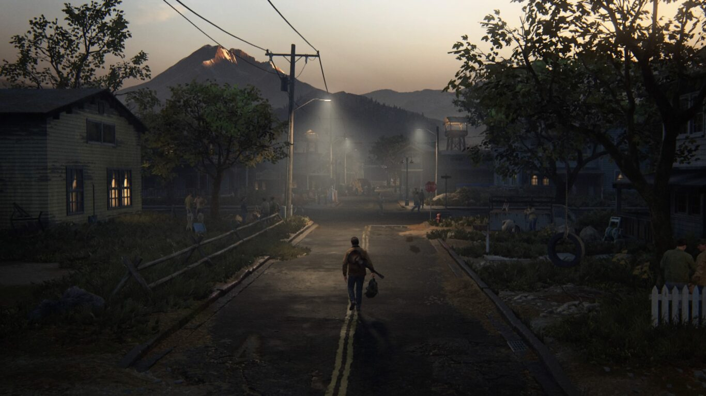
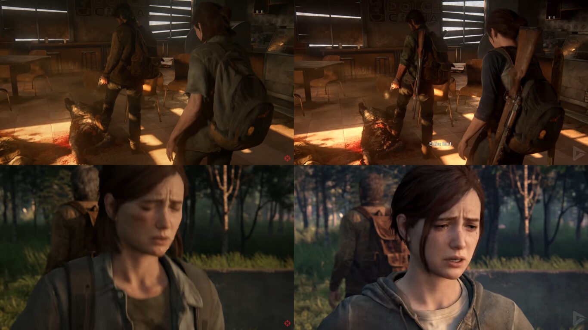
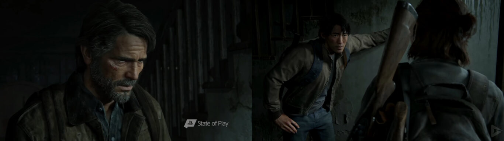
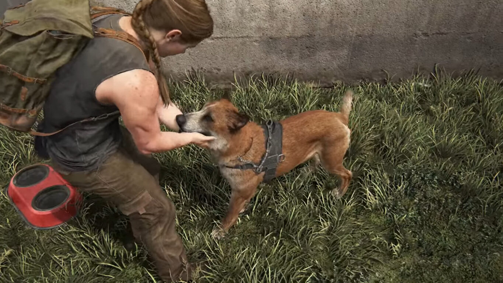
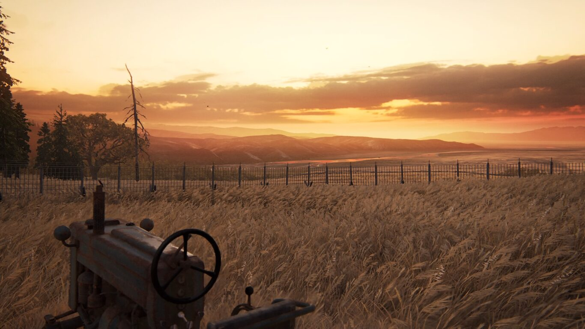

**UWAGA! Ten artykuł zawiera duże spoilery dotyczące fabuły gry The Last Of Us: Part II. Jeśli nie znasz tej gry, a chcesz ją przejść, nie czytaj go. Treść artykułu jest rozwinięciem zawartości pełnoprawnej, bezspoilerowej recenzji, którą możesz znaleźć pod [tym adresem](/recenzja-the-last-of-us-part-2-gra-niestety-nieidealna). Polecam przeczytać ją jako pierwszą, gdyż zawartość tego artykułu ma być jedynie uzupełnieniem, dlaczego tak, a nie inaczej oceniłem The Last Of Us. Nie twierdzę, że każdy powinien ją tak odebrać. Jest to jedynie moja opinia.**

## Jak oszukać graczy

W pełnej recenzji wspominałem o tym, że nie podoba mi się to, co Naughty Dog zrobiło z trailerami The Last Of Us. Co ciekawe uważam, że niestety sami jesteśmy sobie tego winni. Aby nakreślić problem, cofnijmy się do pierwszego trailera Part II z roku 2016:

<YouTube id='W2Wnvvj33Wo' title='The Last Of Us Part II trailer'></YouTube>

Pamiętacie te emocje? Ja tak. Ogromna grupa graczy zaczęła dogłębnie analizować jego zawartość i doszła do wniosku, że ukazany tam Joel tak naprawdę nie żyje i pojawia się jedynie jako zjawa. No cóż, mieli rację. Tylko że przez to, że mieli rację, Naughty Dog zostało zmuszone do szybkiego uspokojenia graczy, aby nie spalić ważnej sceny fabularnej. Postawili na ożywienie Joela i skierowanie podejrzeń graczy na śmierć Diny. Od tamtej pory w trailerach widzieliśmy bransoletkę Diny na ręce Ellie, a także Joela, który razem z Ellie przemierza Seattle. Przyjrzyjcie się sami:

<ImageDescription>Po lewej trailer, a po prawej sceny z gry</ImageDescription>

Osoby, które znają fabułę, już pewnie wiedzą co zrobili deweloperzy. Obydwie sceny pochodzą ze wspomnień, w których Ellie przypomina sobie miłe chwile spędzone z Joelem przed wydarzeniami z Part II. Numer polega na tym, że postacie Ellie i Joela została podmieniona tak, aby wyglądało to jak scena z głównego wątku gry. Podobny trick zastosowano w scenie, w której Joel łapie od tyłu Ellie. Joela oczywiście tam nigdy nie było, a na jego miejscu powinien stać Jessie, który w grze wypowiada dokładnie te same słowa co Joel w trailerze.

<ImageDescription>Po lewej Joel żyje, a po prawej jednak nie</ImageDescription>

Rozumiem strach deweloperów przed spaleniem ważnego momentu fabuły, ale fabrykowanie cutscenek tylko na potrzeby trailera? Szkoda, że Nathana Drake'a tam nie wsadzili.

## Patrz jaki słodki piesek!

Jest takie powiedzenie, że śmierć psa w filmie porusza bardziej niż śmierć setki osób. Twórcy byli tego świadomi, dlatego zapewniali, że w grze nie musimy zabijać psów. Jakoś tego nie zauważyłem. Tak jak wspominałem w recenzji, twórcy chyba grali na poziomie łatwym, że byli w stanie je omijać i mogli sobie pozwolić na niezbieranie znajdujących się w budynkach zasobów. Teraz wyobraźcie sobie, że przez całą grę staraliście się nie zabić żadnego czworonoga. Było ciężko, ale się udało. No to wchodzicie do oceanarium, aby dopaść Abby i co? Na dzień dobry atakuje nas pies, którego musicie zatłuc na śmierć. Tak właśnie według deweloperów wygląda niezabijanie zwierząt. Czy to wszystko? Nie!

<AdSense/>

Mimo że gracz już czuje się wystarczająco podle, musi jeszcze oglądać morderstwo dwóch osób (choć wie, że jedna z nich jest w ciąży). W kolejnej scenie ginie jeszcze jedna osoba, a w Ellie zostaje wymierzona broń. I co robi gra? Przenosi nas do wątku Abby i zmusza do obserwowania, jakimi to fajnymi ludźmi były ofiary Ellie. W dodatku przed wyruszeniem w teren ciężarna zabiera ze sobą swojego psa obronnego. Tak, właśnie tego, który zginie z naszych rąk. Z tego powodu trafiamy do zagrody pełnej innych psów. Poznajemy ich imiona i widzimy, jak wszyscy je kochają. Dodatkowo możemy je pogłaskać oraz porzucać im piłeczkę i taka możliwość pojawia się w grze jeszcze kilka razy. Bardzo brzydkie zagranie Naughty Dog.

## Zła Ellie! Zła!

Wiecie, jak odebrałem cały wątek z historią Abby? Jako wytykanie mi wszystkich złych decyzji, które nie zależały ode mnie, a zostały podjęte przez scenarzystę, który stworzył fabułę. Dobrze poprowadzony scenariusz nie daje poczucia, że robimy coś złego, a dopiero na koniec możemy poznać rzeczywiste konsekwencje swoich czynów. Zauważcie tylko, jak poprowadzona jest historia:

1. Abby zabija Joela
2. Ellie rozpoczyna krwawą zemstę
3. Od Nory dowiaduje się, dlaczego Abby zemściła się na Joelu
4. Mordujemy psa i wspomniane wcześniej osoby
5. Przenosimy się na wątek Abby
6. Dowiadujemy się, kim jest faktycznie ta postać i że miała ona pełne prawo do zemsty na Joelu
7. Oglądamy jakimi fajnymi ludźmi były nasze ofiary
8. Bawimy się z psami, które zabijaliśmy
9. Abby odkupuje swoje winy ratując parę dzieci z sekty
10. Abby jest zmuszona zabijać swoich kompanów z WLF i na dodatek dowiaduje się, że ktoś zamordował wszystkich jej przyjaciół z oddziału, którzy szykowali się do ucieczki od całej tej wojny

Tak podsumowałbym wydarzenia w Seattle. Jako Ellie robimy straszne rzeczy, by po przejściu na postać Abby dowiedzieć się, jakimi to potworami byliśmy. Abby miała pełne prawo do zemsty i wymierzyła ją tylko w Joela, nikogo innego. W dodatku widzimy, jak odpokutowuje ona swoje winy, ratując dzieciaki i jeszcze traci wszystkich, których znała - zarówno organizację, do której należała, jak i wieloletnich przyjaciół. Natomiast Ellie nie miała okazji do zadośćuczynienia. Pod koniec wątku Abby gra jeszcze każde nam toczyć idiotyczną walkę z Ellie i próbować ją zabić. Prawda jest taka, że obie postaci nie zasłużyły na taki los. Z jednej strony niby idealnie pokazano nakręcanie się spirali nienawiści, a z drugiej ma się wrażenie, że twórcy faworyzują Abby.

## Zakończenie bez końca

Ostatecznie Abby po raz drugi darowuje życie Ellie i postanawia zapomnieć o przeszłości. Przenosimy się w czasie do sceny, która mogłoby się wydawać epilogiem. Coś na kształt tego z Uncharted 4, ale z Diną i małym dzieckiem. Tutaj można wspomnieć o wątkach LGBT. Niby nie przeszkadzają w fabule, ale w momencie gdy orientujemy się, że: "biseksualna żydówka w ciąży (z którą główna bohaterka później wychowuje dziecko) zostaje postrzelona przez transpłciowe dziecko, które z powodu orientacji prawie zostało zabite przez współwyznawców swojej religii" to trzeba przyznać, że brzmi to trochę kuriozalnie.

Wracając do zakończenia. Wykonujemy kolejne zadania na farmie. Sceny oddzielają przerwy z czarnym ekranem. To jeszcze nie koniec. Mamy gościa - przed domem stoi koń. Czyżby Tommy jednak przeżył? Tak! Hura! Ale nagle zaczyna gadać jak obłąkany i każe Ellie porzucić swoją rodzinę, bo po powrocie do Jackson obiecała mu, że zabije Abby. Naprawdę? Niby ożywiliście Tommy'ego, a jednocześnie go zabiliście. Kolejne cięcie. Napisy? Oczywiście, że nie. Następna retrospekcja i ciąg dalszy wendetty. Czy tylko mi się wydaje, że jest to już na siłę doklejane? Na koniec Ellie puszcza Abby żywą, ale po powrocie na farmę zastaje pusty dom.

Z tym zakończeniem to też ciekawa sprawa, bo zauważyłem, że wiele osób chciało śmierci Abby. Ja cieszę się, że twórcy tego nie zrobili, bo zabicie którejkolwiek ze stron byłoby głupie, zważywszy na to, co przeszły obie bohaterki. W dodatku w trakcie grania w ten tytuł, cudowne algorytmy Facebooka postanowiły pokazać mi komentarz jakiegoś gościa, który pisał, że w grze będziemy musieli zdecydować, kto ma zginąć. Na szczęście było to nieprawdą, a owy użytkownik pewnie widział jeden z wielu clickbaitowych filmików na YT.

## Podsumowanie

To moje główne zarzuty co do fabuły Part II. Niestety ślepo próbowała ona pobić swojego poprzednika, który ostatecznie pokonał ją pod każdym względem. Nierówne tempo rozgrywki. Problemy z chronologią i narracją, a na deser brak konkretnego zakończenia. Niestety, ale Part II, kompletnie nie umywa się do stylu i spójności pierwszej części.
