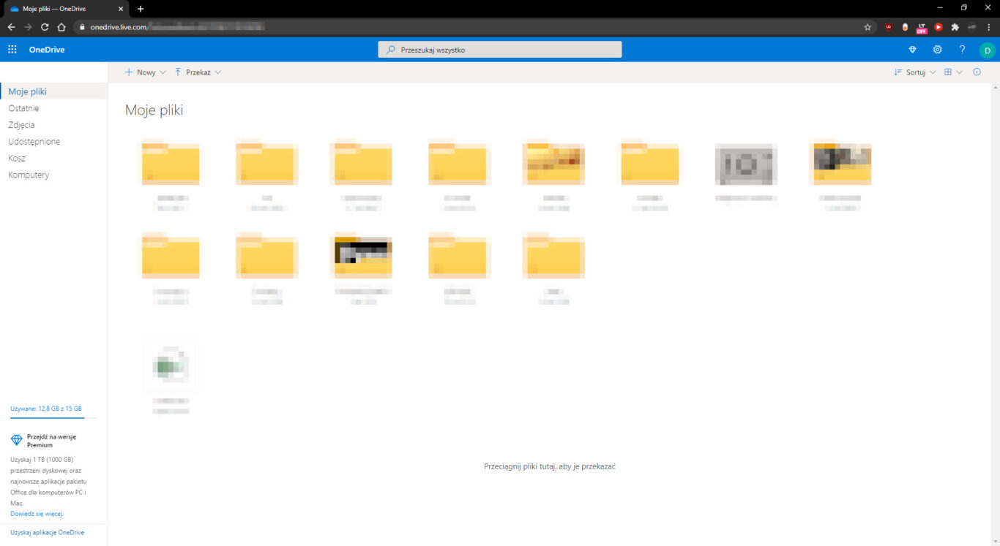
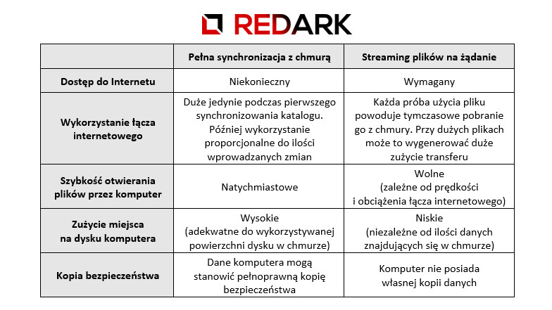
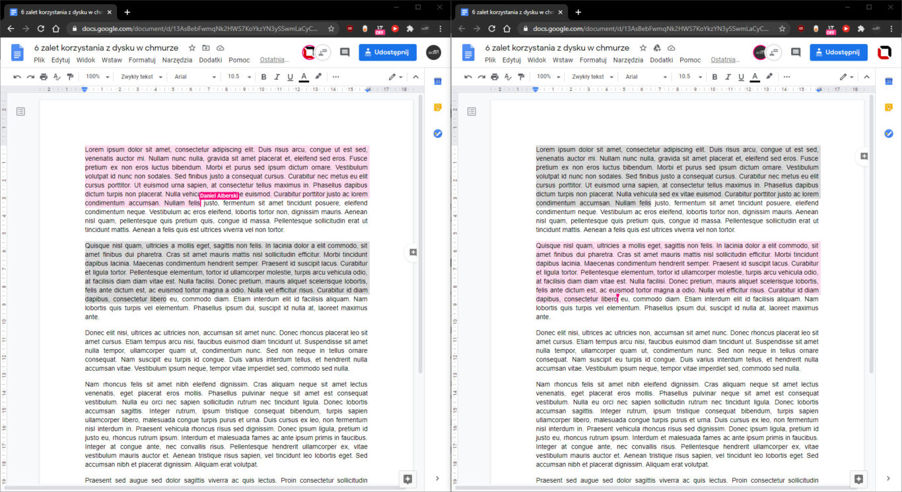
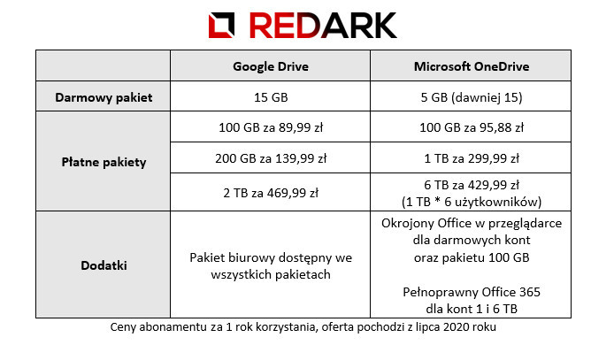

Od kart perforowanych przez taśmy, dyski talerzowe, dyskietki, pendrive'y aż po mistyczne dyski w chmurze. Tak wygląda historia nośników danych. Tylko czym jest owa chmura i jej dysk internetowy, dlaczego nie należy się ich bać i jakie korzyści płyną z ich wykorzystywania? Zapraszam na zestawienie sześciu zalet korzystania z dysku w chmurze.

## Dostęp do plików z każdego miejsca

Na początek chyba najbardziej oczywista zaleta przechowywania danych w Internecie. Dzięki temu, że nie znajdują się one tylko na dysku komputera, możemy uzyskać do nich dostęp z każdego miejsca na Ziemi i z każdego urządzenia podłączonego do sieci. Zapewnia to niezwykły komfort i elastyczność pracy. Nie musimy się już bawić w taszczenie ze sobą dysku lub woreczka pendrive'ów. Do plików możemy się dostać za pomocą przeglądarki internetowej lub dedykowanych aplikacji klienckich, które oferują dodatkową integrację z systemem operacyjnym.

<ImageDescription>Uniwersalną metodą dostępu do danych jest przeglądarka internetowa</ImageDescription>

Niektórym osobom może się tutaj zapalić lampka ostrzegawcza w głowie. Czy dostęp do danych z każdego miejsca na Ziemi nie spowoduje, że są one łatwym celem dla hackerów? Odpowiedź brzmi: i tak, i nie. Takim usługom owszem, zdarzają się wycieki danych, ale nie różni się to niczym od składowania danych na naszym prywatnym komputerze. Jeśli hacker będzie chciał je zdobyć, to je zdobędzie, nieważne gdzie się znajdują. Wiele domowych komputerów jest o wiele słabiej zabezpieczonych od publicznie widocznych serwerów chmurowych gigantów. Poczucie większego bezpieczeństwa jest tu więc bardzo mylne.

## Łatwe przenoszenie plików między urządzeniami

Dostęp do danych po sieci oraz dedykowane aplikacje klienckie na wszystkie istniejące platformy sprawiają, że przenoszenie danych pomiędzy urządzeniami staje się banalnie proste. Sam pracuję na dwóch urządzeniach: komputerze stacjonarnym w domu oraz na laptopie w terenie. Gdybym miał wrócić do dawnych czasów, gdy musiałem biegać między komputerami z pendrive'm i dbać o aktualizowanie plików, pewnie skończyłbym w wariatkowie. W dodatku zapewne często spotykałaby mnie sytuacja, w której nagle orientuję się, że zostawiłem bardzo ważny plik na komputerze w domu. Dzięki chmurze zapomniałem co to pendrive i nie muszę się już martwić, że nie przejmuję się tym. że nie zabrałem ze sobą jakiegoś ważnego pliku.

<AdSense/>

To samo tyczy się telefonu. Ile razy chciałeś przekopiować zdjęcie z telefonu na komputer lub przesłać obrobioną na komputerze grafikę na telefon, żeby umieścić ją na Instagramie? Ile razy kończyło się to przewracaniem szuflad podczas szukania kabla USB lub (o zgrozo) wysyłaniem maila? Zaletą chmury jest to, że zdjęcie, bądź dowolny inny plik jesteś w stanie przesłać z lub do telefonu w ułamek sekundy! Koniec z mailami, kablami, utratą jakości. Wszystko dzieje się automatycznie!

## Dwa tryby przechowywania plików

Zazwyczaj dostawcy usług danych w chmurze oferują dwa tryby działania. Pierwszy z nich polega na przechowywaniu na dysku pełnej kopii danych znajdujących się w chmurze. Zapewnia to szybki dostęp do ich zawartości oraz brak potrzeby stałego dostępu do Internetu. Zmiany w plikach są synchronizowane automatycznie, jeśli tylko jest taka możliwość.

Drugi tryb polega na streamingu danych w zależności od potrzeb użytkownika. Dane widoczne na dysku komputera to jedynie sprytne ikonki, których kliknięcie inicjalizuje dopiero pobranie prawdziwego pliku z magazynu w chmurze. Jest to szczególnie przydatne jeśli posiadamy laptopa z małym dyskiem SSD lub telefon, na którym nie zmieściłyby się wszystkie nasze zdjęcia i filmy z wakacji. Wadą oczywiście jest potrzeba stałego podłączenia do Internetu oraz długi czas otwierania plików, jeśli dysponujemy słabym złączem internetowym. Tryb wybieramy oczywiście my sami, dobierając go do własnych potrzeb.

<ImageDescription>Wybór trybu działania należy do Ciebie</ImageDescription>

## Chmura jako rozproszony system kopii bezpieczeństwa

Drugą rzeczą, którą najbardziej cienię w korzystaniu z chmury na kilku urządzeniach to fakt, że nigdy nie byłem tak spokojny o bezpieczeństwo swoich danych. Nie wierzysz? Już tłumaczę dlaczego, ale najpierw mała dygresja.

Pracując jako programista, moim podstawowym narzędziem pracy jest Git - rozproszony system kontroli wersji. Dzięki niemu nie muszę robić kopii bezpieczeństwa, martwić się, że coś zepsuje w kodzie oraz pilnować, aby każdy programista w zespole miał dokładnie ten sam kod co ja. Okej, a co oznacza słowo rozproszony? Każdy deweloper, który pracuje w projekcie, posiada pełnoprawną kopię całego projektu na swoim komputerze. Sprawia to, że może on pracować bez dostępu do Internetu, a integracją danych między programistami zajmuje się centralny serwer. W dodatku każda z tych osób może poratować kogoś swoją kopią danych, a nawet sam serwer, jeśli jakimś cudem uległby on awarii i utracie danych. Widzicie analogię do dysku w chmurze?

Tę właściwość pokażę na własnym przykładzie. Moje dane znajdują się w trzech miejscach jednocześnie. Na serwerze Microsoftu, na dysku komputera stacjonarnego oraz na dysku laptopa. Dane znajdujące się na nich są stale synchronizowane bez jakiegokolwiek mojego wkładu. Jednak załóżmy, że mój laptop kończy roztrzaskany na chodniku. Co z danymi? Cały czas posiadam ich kopię w domu oraz w chmurze. Pracowałem nad obszernym tekstem przez wiele miesięcy i nagle Word postanowił wysypać się podczas zapisu i uszkodzić plik dokumentu? Nadal nic się nie stało, nawet jeśli wadliwy plik jakimś cudem zsynchronizowałby się z chmurą. Wciąż mam drugi komputer z pełną redundantną kopią bezpieczeństwa - wystarczy, że uruchomię go bez dostępu do Internetu, aby nie pobrał wadliwej wersji.

Nawet gdyby jakimś cudem Microsoft bądź Google upadł z dnia na dzień (choć nie wiem, jak niektórzy mogą cały czas wierzyć w taki scenariusz), to **moje dane nadal są bezpieczne**. To jest właśnie rozproszony system kopii bezpieczeństwa. Żeby bezpowrotnie stracić dane, oba moje komputery musiałyby ulec jednoczesnej awarii, a serwery największego giganta informatycznego wraz z jego wszystkimi zapasowymi centralami danych musiałyby wylecieć w powietrze.

<AdSense/>

## Łatwe współdzielenie plików oraz dokumentów

Połączenie dysku sieciowego z innymi usługami w chmurze takimi jak pakiet biurowy, poczta, kalendarz, czy książka telefoniczna, to raj dla przedsiębiorców. Zarówno Microsoft jak i Google posiadają w swojej ofercie darmowe (tak, darmowe) pakiety biurowe, które dzięki integracji z dyskiem i kontami użytkowników umożliwiają jednoczesną pracę wielu osób nad jednym dokumentem czy arkuszem kalkulacyjnym. Wszyscy członkowie zespołu mają wgląd do jego treści, posiadają swój własny kursor na ekranie, a także oddzielny tryb sugerowania zmian w dokumencie. Naprawdę, w dzisiejszych czasach nie musicie już latać z "Word'em" na pendrive'ie, marnować papieru w drukarce i wysyłać dokumentów mailem. Plikami podzielicie się kilkoma kliknięciami myszy, a wszystkie zmiany zobaczycie na żywo na swoim ekranie. Jakby tego było mało, takie pakiety oferują także funkcję "historii wersji", która pozwala podejrzeć, jak dokument zmieniał się z dnia na dzień oraz przywrócić jego konkretną wersję z przeszłości.

<ImageDescription>Jeden dokument, dwóch użytkowników, dwa kursory</ImageDescription>

## Jeden nieograniczony magazyn

Najpopularniejszymi pojemnościami darmowych planów dysków w chmurze są 5 i 15 GB. Ja sam posiadam kilka takich, a do codziennej pracy służy mi OneDrive o pojemności 15 GB. Jest to pojemność w sam raz. Pomieści wszystkie aktualnie potrzebne pliki i programy, a też nie pozwoli zrobić zbyt dużego bałaganu ;) . Dla osób bardziej wymagających lub chcących przechowywać w chmurze ciężkie pliki wideo, są oczywiście płatne plany oferujące pojemności od kilkudziesięciu gigabajtów do nawet kilku terabajtów. Każdy może zakupić tyle miejsca, ile potrzebuje. Ceny takich usług są bardzo przystępne, zwłaszcza jeśli policzyć wszystkie benefity, jakie otrzymujemy w prezencie.

## Podsumowanie

Mam nadzieję, że pokazanymi tutaj zaletami przekonałem Was do zainteresowania się usługami oferowanymi przez chmurę. Zarówno płatne, jak i darmowe konta oferują szereg przydatnych opcji, które będą Wam codziennie wynagradzać tę zmianę. Darmowy pakiet biurowy do pracy z wieloma osobami naraz, łatwe udostępnianie plików między urządzeniami i współpracownikami, to tylko wierzchołek góry możliwości usług chmurowych. Obawy przed tą technologią są naprawdę bezpodstawne i zachęcam wszystkich do jej wypróbowania.
