<ActionButton to='/recenzja-analiza-dzialania-opaski-xiaomi-mi-band-6'>Zobacz recenzję Xiaomi Mi Band 6 (2021)</ActionButton>

Kilka tygodni temu w Polsce odbyła się premiera 5. generacji najpopularniejszej opaski sportowej, czyli Xiaomi Mi Band 5. Postanowiłem kupić ją zaraz po premierze i sprawdzić, za co miliony osób pokochały te urządzenia. Z racji tego, że jest to moja pierwsza opaska tego typu, nie odpowiem na pytania, czy warto zamienić Mi Banda 4 na nową generację. Będzie to świeże spojrzenie osoby, która dotychczas używała jedynie klasycznych zegarków.

## Wykonanie oraz budowa opaski

<Gallery>
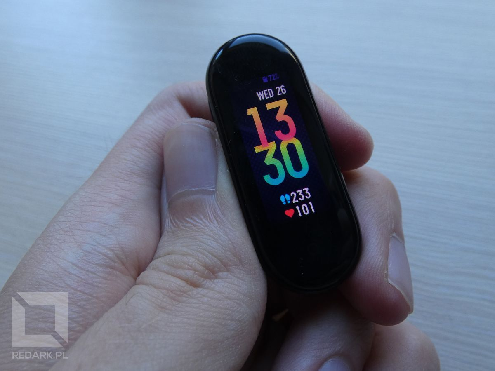
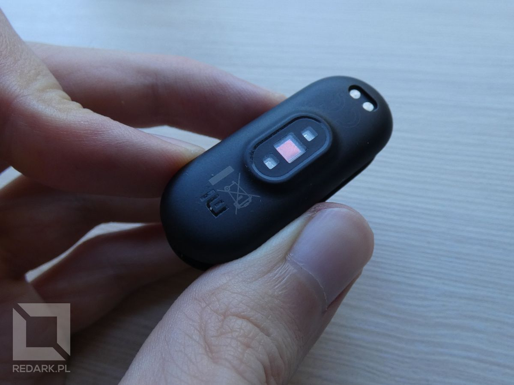
</Gallery>

<ImageDescription>Wykonanie bez zarzutu</ImageDescription>

Urządzenie ponownie ma postać małej pastylki zamocowanej w gumowej opasce zapinanej na klips. Tym razem wymiary urządzenia uległy drobnej zmianie i opaska nie jest kompatybilna z poprzednikiem, tak jak to miało miejsce w przypadku Mi Banda 3 i 4. To, co pozostało takie samo, to doskonała jakość wykonania. Opaska jest wytrzymała, przyjemna w dotyku i nie uwiera podczas noszenia. Na samym urządzeniu znajdziemy 1.1-calowy dotykowy ekran AMOLED, a pod nim pojedynczy przycisk dotykowy zaznaczony lekko widocznym małym okręgiem. Front został przykryty szkłem hartowanym wykonanym w technologii 2.5D. Tył Mi Banda skrywa jedynie sensor optyczny oraz styki służące do ładowania baterii.

Do komunikacji z telefonem służy Bluetooth w wersji 5.0 Low Energy. Na pokładzie opaski znajduje się też moduł komunikacji zbliżeniowej NFC, ale tak samo jak w poprzedniku, obsługuje on jedynie płatności wykonywane na terenie Chin i nie zapowiada się, aby miało się coś w tej kwestii zmienić. Nowością w Mi Bandzie 5 jest natomiast pulsoksymetr, czyli pulsometr z funkcją pomiaru natlenienia (saturacji) krwi. Niestety na dzień dzisiejszy ta funkcja również jest dostępna tylko na terytorium Chin.

<Gallery>
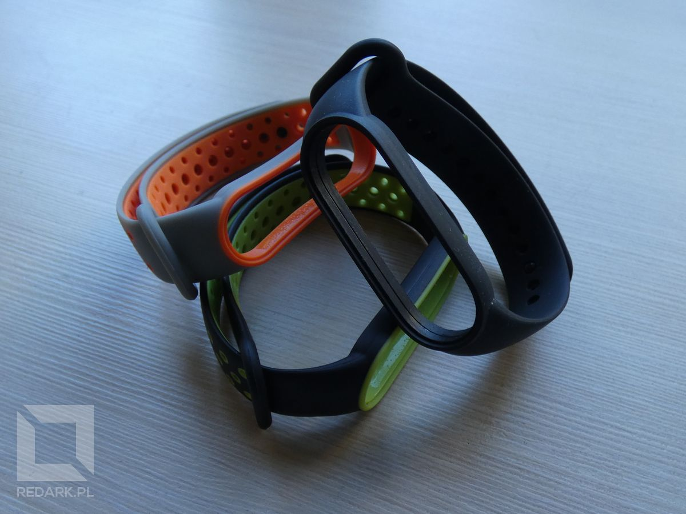
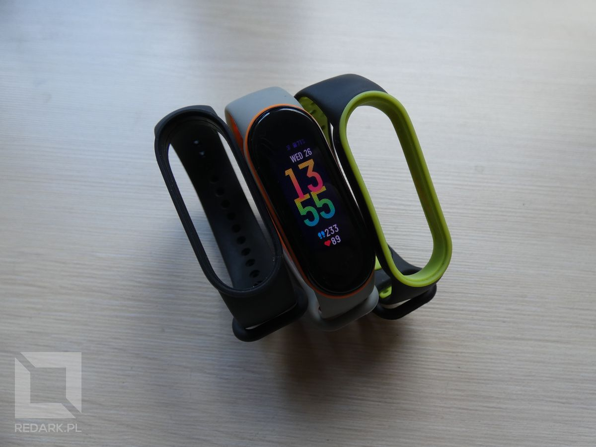
</Gallery>

<ImageDescription>W opakowaniu znajduje się jedynie czarna opaska. Dwie pozostałe dokupiłem osobno</ImageDescription>

## Zestaw funkcji

Mi Band 5 posiada sprawdzony zestaw funkcji swoich poprzedników i wprowadza jedynie drobne nowości i ulepszenia działania sensorów. Standardowo mamy tutaj krokomierz z pomiarem tętna, stresu oraz snu. Za pomocą opaski jesteśmy też w stanie zarządzać naszym telefonem. Możemy odczytywać powiadomienia, SMS-y, odrzucać lub wyciszać połączenia głosowe oraz sterować odtwarzaczem muzyki i aparatem. Oprócz tego możemy włączyć w nim tryb cichy lub uruchomić bardzo głośny dzwonek dzięki funkcji "znajdź telefon". Opaska umożliwia też automatyczne zablokowanie urządzenia, jeśli znajdzie się ono zbyt daleko od jego właściciela.

Do tego znajdziemy tutaj też podstawowe funkcje zegarka takie jak: stoper, minutnik, budziki czy zegar światowy. Na deser jest jeszcze ekran prognoz pogody, asystent relaksacyjnych ćwiczeń oddechowych oraz śledzenie cyklu miesiączkowego u kobiet. Nie zabrakło też znanych z poprzednich generacji opasek powiadomień o braku aktywności (zasiedzeniu się).

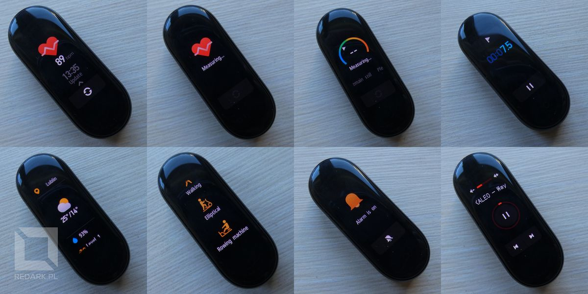

<ImageDescription>Interfejs opaski jest schludny i przejrzysty</ImageDescription>

Do śledzenia naszej aktywności posłuży **11 predefiniowanych kategorii** sportowych - jest to prawie dwukrotnie więcej trybów niż w poprzedniku! Mi Band 5 umożliwia monitorowanie: biegania na zewnątrz, biegania na bieżni, jazdy na rowerze zwykłym lub stacjonarnym, chodzenia (spacerów), ćwiczeń na orbitreku, wiosłowania, jogi, skakania na skakance, pływania oraz tzw. stylu dowolnego.

<AdSense/>

## Interfejs opaski

Główny widok opaski wyświetla standardowo godzinę, datę, poziom baterii, ikonki statusu połączenia oraz zawiera dwa personalizowane panele. Domyślnie wyświetlają one aktualny puls oraz wykonaną tego dnia ilość kroków. W opasce znajdziemy jeszcze dwie inne preinstalowane tarcze. Jedną z zegarem cyfrowym i jednym polem personalizacji oraz drugą z zegarem analogowym i dwoma miejscami personalizacji. Mi Band 5, tak samo jak poprzednicy, oferuje możliwość wgrywania własnych niestandardowych tarcz. Na razie ich wybór w oficjalnym sklepie nie powala, ale z pewnością będzie on sukcesywnie powiększany. Dodatkowo pewnie powstanie za niedługo jakaś nieoficjalna aplikacja do ich instalowania, o ile już nie powstała.

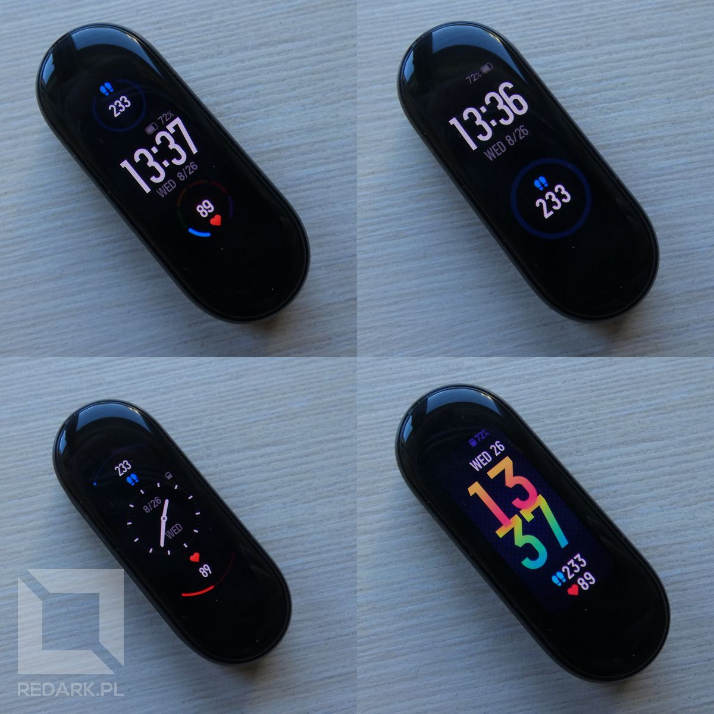

<ImageDescription>Trzy wbudowane tarcze oraz jedna niestandardowa</ImageDescription>

Ekrany opaski zmienia się za pomocą gestów przeciągnięcia palcem w czterech kierunkach. Przeciągając palcem poziomo, możemy przeglądać widgety urządzenia. Domyślnie wybrane są: tarcza zegarka, powiadomienia telefonu, pogoda oraz sterownie odtwarzaczem muzyki. Za pomocą aplikacji Mi Fit możemy dodać do tego jeszcze ekrany: statusu, PAI, tętna, poziomu stresu, asystenta oddychania, cykli miesiączki, kalendarza zdarzeń, treningów, ustawień "nie przeszkadzać", budzików, sterowania aparatem, stopera, minutnika, funkcji "znajdź telefon", wyciszania telefonu oraz zegara światowego. Wybór opcji jest bardzo rozbudowany i chyba zabrakło mi w nim jedynie szybkiego skrótu do regulacji jasności ekranu.

<InfoBlock>PAI jest to stworzony przez producenta 100-punktowy wskaźnik aktywności fizycznej. Ocenia on nasze dokonania z ostatnich 7 dni i zachęca do ciągłego polepszania wyników. Aby mógł on działać, wymagane jest uruchomienie najczęstszego (co 1 minutę) monitoringu parametrów użytkownika, co znacząco skraca żywotność baterii. Ja nie czułem potrzeby testowania tej funkcji. Bardziej zależało mi na przetestowaniu czasu pracy na baterii, dlatego po kilku dniach wyłączyłem te opcje.</InfoBlock>

Oprócz widżetów mamy oczywiście dostępne standardowe menu, które wywoływane jest pionowymi przeciągnięciami palca. Znajdziemy tutaj pozycje: wyświetlacz opaski, status, PAI, tętno, powiadomienia telefonu, stres, oddychanie, wydarzenia, pogoda, trening, cykle oraz przycisk "więcej". Tak samo jak poprzednio, **kolejność oraz widoczność poszczególnych elementów możemy dostosować do własnych preferencji.**

W menu "więcej" znajdziemy: tryb "nie przeszkadzać" (DND), budziki, sterowanie aparatem i odtwarzaczem muzyki, stoper, minutnik, opcję "znajdź urządzenie" oraz tryb ciszy dla telefonu, zegar światowy, zmianę tarcz opaski oraz menu ustawień. One z kolei zawierają: jasność i blokadę ekranu, długość podświetlania treści oraz opcję restartu urządzenia i przywracania ustawień fabrycznych. Naprawdę, dlaczego Xiaomi tak głęboko ukrywa regulacje jakości ekranu?

Oprócz gestów ekranowych do nawigacji posłuży także dotykowy przycisk znajdujący się pod jego ekranem. Służy on do powracania do poprzedniego ekranu i zatrzymywania treningu. Do działania ekranu oraz przycisku nie mam żadnych zastrzeżeń. Przejrzysty interfejs oraz szeroka możliwość personalizacji jego układu bardzo mi się spodobała. W kwestii jasności ekranu jest rewelacyjnie. Maksymalna jasność wynosi 450 nitów i można ją dostosować, wybierając jeden z pięciu dostępnych poziomów. Ja przez cały czas używałem mocy 80%, w której ekran był widoczny bez problemu nawet w pełnym słońcu. Jeśli już mowa o ekranie, to szkoda, że producent nie zastosował tutaj którejś z generacji Gorilla Glass. Dla bezpieczeństwa pewnie za niedługo zabezpieczę swojego Mi Banda jakimś dodatkowym szkłem ochronnym.

## Aplikacja Mi Fit

<Gallery>
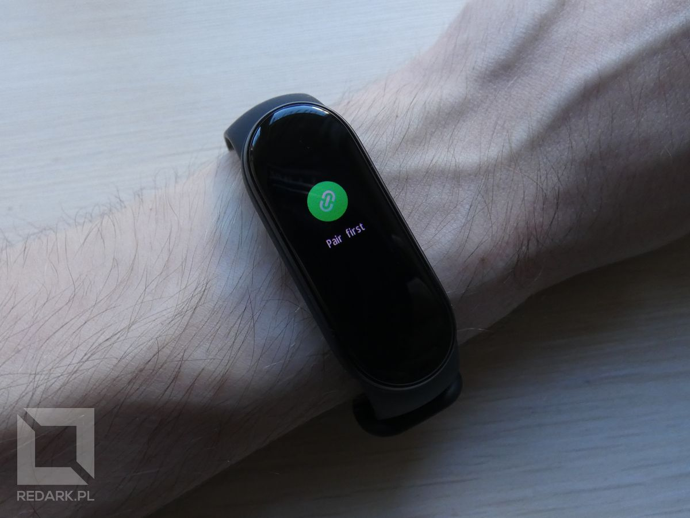
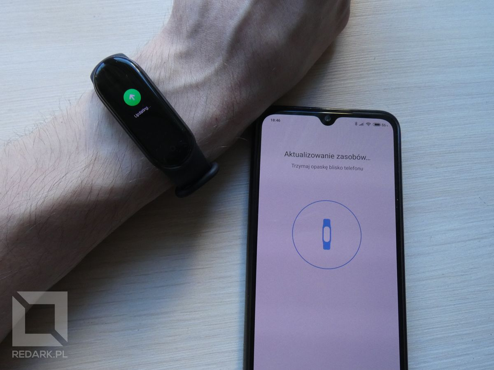
</Gallery>

<ImageDescription>Aby móc używać Mi Banda 5, należy go pierw sparować z telefonem i aplikacją Mi Fit</ImageDescription>

Mi Band 5 nie jest w pełni samodzielnym urządzeniem. Do pierwszego uruchomienia, zmiany wielu ustawień oraz podglądu wyników treningu potrzebny jest nam telefon z zainstalowaną aplikacją Mi Fit. Po pierwszym sparowaniu urządzenia przy pomocy technologii Bluetooth opaska przeprowadzi automatyczny proces aktualizacji swojego oprogramowania pokładowego. Cały proces jest bardzo prosty i nie wymaga od nas dużo interakcji.

<AdSense/>

Za pomocą aplikacji możemy śledzić całą historię wykonanych przez opaskę pomiarów. Ekran pomiaru snu prezentuje diagram przebiegu poszczególnych faz, ich udział procentowy oraz czas trwania drzemek w ciągu dnia. Wszystkie dane można porównać ze statystykami innych użytkowników Mi Banda. Przeglądając opcje dalej, znajdziemy statystyki krokomierza zliczającego wszystkie nasze aktywności, a także analizę naszej wagi i budowy ciała. Z racji tego, że nie posiadam wagi Xiaomi (choć może sobie teraz taką sprawię), nie dzieje się na tych panelach zbyt dużo.

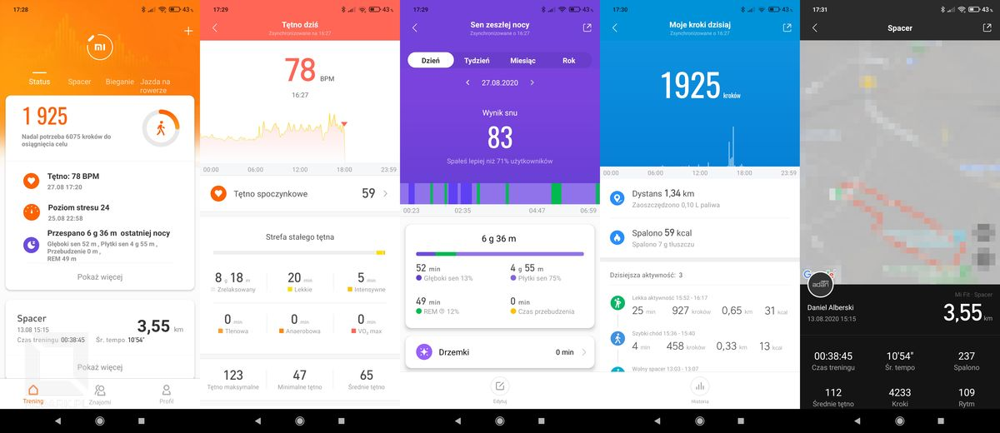

W niższej części ekranu głównego znajdziemy sekcję zarejestrowanych przez opaskę aktywności fizycznych. Mowa tu o tych, które ręcznie uruchomiliśmy z poziomu menu Mi Banda lub aplikacji Mi Fit. Ekran podglądu ćwiczeń dostarcza szczegółowe statystyki treningu wraz z wykresem tętna oraz mapą okolicy, jeśli zezwoliliśmy wcześniej na rejestrowanie lokalizacji za pośrednictwem telefonu, ponieważ Mi Band 5 nie posiada swojego modułu GPS.

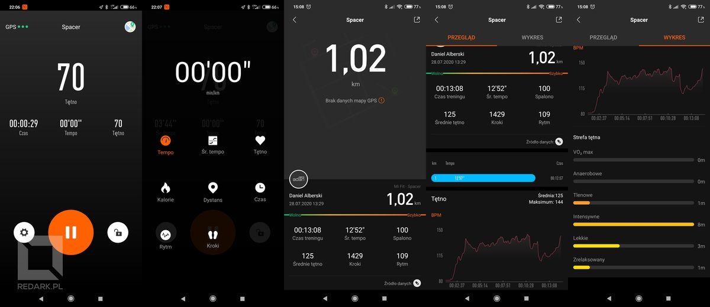

<ImageDescription>Rejestrowanie treningów możliwe jest też z poziomu aplikacji Mi Fit</ImageDescription>

Bardzo ważna jest ostatnia karta "profil", ponieważ tam znajdziemy listę przypisanych do naszego telefonu urządzeń. Wybierając Mi Banda 5, znajdziemy następujące opcje:

- sklep z tarczami zegarka,
- odblokowywanie telefonu za pomocą opaski,
- informowanie o połączeniach przychodzących i wiadomościach SMS,
- powiadomienia z aplikacji,
- alarmy oraz powiadomienia o wydarzeniach,
- alerty o bezczynności,
- opcję "wykryj opaskę" (uruchamia wibracje),
- ustawienia działania komunikacji Bluetooth,
- lokalizacja opaski (lewa czy prawa ręka),
- automatyczne podświetlanie ekranu po podniesieniu ręki (można wybrać harmonogram oraz czułość),
- język interfejsu (na razie bez języka polskiego),
- automatyczny pomiar tętna, stresu i snu,
- personalizacja menu, widgetów oraz typów treningu,
- zmiana zegarów światowych oraz lokalizacji dla prognozy pogody,
- personalizacja sygnałów wibracji (pozwala nagrać własne sekwencje wibracji do każdego typu powiadomień).

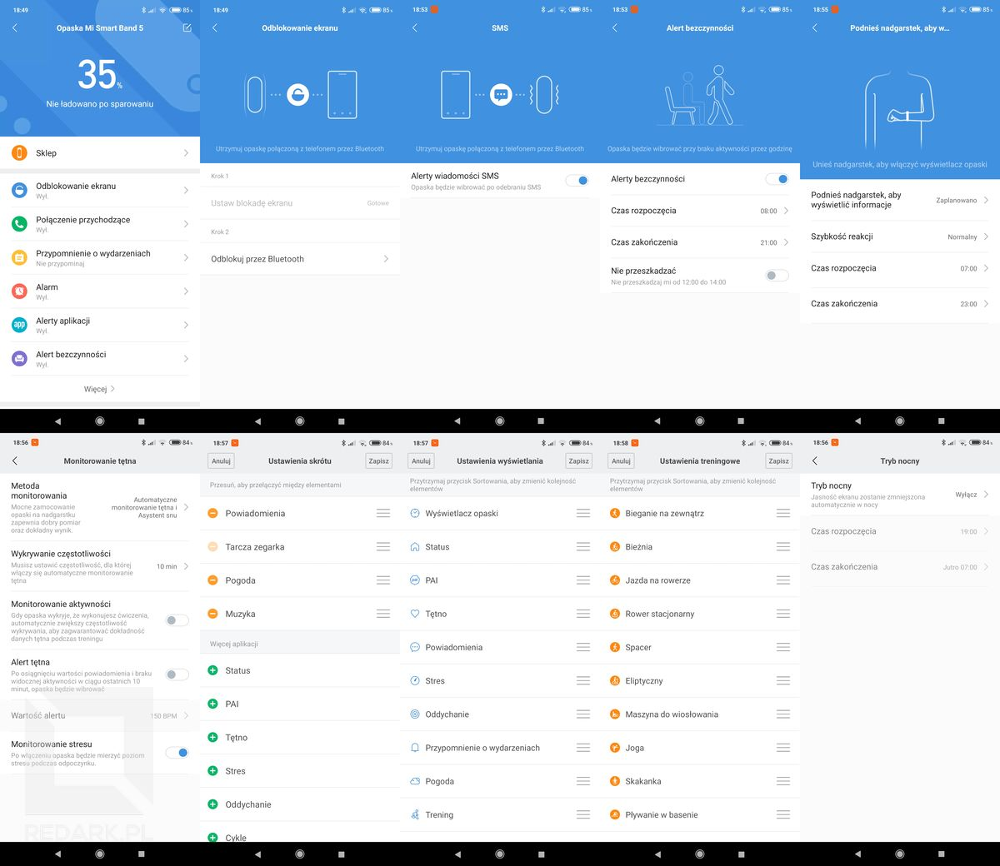

<ImageDescription>Opaskę można spersonalizować na wiele sposobów</ImageDescription>

Polecam przejrzeć wszystkie te opcje zaraz po zakupie urządzenia, aby dostosować opaskę do własnego trybu życia. Należy pamiętać, że od ilości aktywowanych tutaj opcji zależy żywotność baterii urządzenia, która może wytrzymać od kilku do kilkunastu dni bez ładowania.

## Pomiar pulsu, stresu oraz snu

Mi Band 5 wyposażony jest w sensor tętna wykorzystujący zieloną wiązkę światła do pomiaru przepływu krwi w naczyniach krwionośnych użytkownika. **Dokładność pomiarów oceniam na bardzo dobrym poziomie.** Muszę jednak przypomnieć, że skuteczność działania sensora zależy w dużej mierze od jego odległości od skóry. Jeśli lubicie nosić zegarek luźno zapięty na ręce, to nie liczcie, że będzie on poprawnie wskazywał tętno. Dużo do rzeczy ma też częstotliwość wykonywania automatycznych pomiarów. Do wyboru są wartości: 1, 5, 10 i 30 minut. Jeśli ustawicie zbyt rzadką ilość pomiarów, to istnieje duże prawdopodobieństwo, że wynik podawany przez opaskę na ekranie będzie błędny. Prosta zasada. Sensor tętna działa bardzo dobrze, ale pamiętajcie, że Wy również musicie zapewnić mu odpowiednie warunki do działania.

<InfoBlock>Pomiar tętna weryfikowałem ze wskazaniami domowego ciśnieniomierza. Różnica wynosiła maksymalnie 10 uderzeń na minutę.</InfoBlock>

Oprócz tętna opaska jest w stanie mierzyć poziom stresu użytkownika oraz jakość jego snu. Pomiar stresu niestety mnie nie przekonał. Oczywiście opaska pokazywała jakieś wartości, ale nigdy nie dały mi one wyraźnych powodów, abym zaufał tym wynikom. W dodatku pomiar wymaga od użytkownika stania w bezruchu, przez co automatyczny pomiar często się nie wykonywał i wykres w aplikacji Mi Fit był poszatkowany, dlatego zrezygnowałem później z tej opcji.

<AdSense/>

Co do monitoringu snu jest okej, tylko z jednym "ale". Opaska przez wszystkie noce idealnie wykrywała momenty zaśnięcia i przebudzenia, a także pokazywała wiarygodne diagramy prezentujące fazy snu. Z punktu widzenia nowego użytkownika takich urządzeń muszę jednak stwierdzić, że jest to kompletnie niepotrzebna opcja. Sprawdzałem codziennie rano na telefonie, co opasce udało się zarejestrować, ale w sumie jedyne co mi ona mówiła, to to, że mam się kłaść koło 22, bo to zdrowe. Jakiś szczególnych profitów z tej funkcji nie odczułem - zwykły bajer i ciekawostka.

## Działanie krokomierza

Drugą najważniejszą funkcją Mi Bandów jest oczywiście krokomierz. Aby ocenić jego wiarygodność, postanowiłem przetestować trzy różne sposoby pomiaru kroku, po trzy pomiary na każdą, aby wykluczyć pojedynczy fałszywy wynik. Każdy spacer został przeprowadzony na innej trasie, a jej długość była sprawdzana za pomocą Google Maps. Według danych dostępnych w Internecie długość męskiego kroku wynosi od 60 do 80 centymetrów. Uznałem więc, że wartością wzorcową zostanie 1428 kroków na kilometr. Wyniki przeprowadzonych pomiarów prezentuje poniższa tabelka:

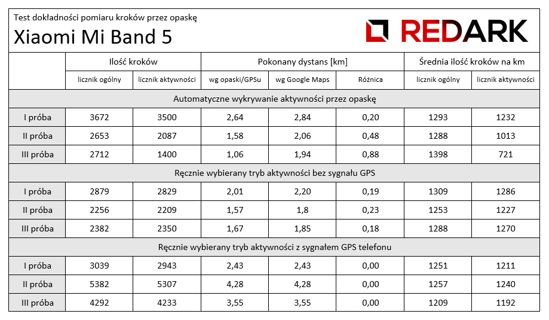

### Test 1: automatyczne wykrywanie aktywności

Pierwszy test polegał na całkowitym oddaniu się automatycznemu działaniu opaski. Spisywałem ilość kroków na ekranie i wychodziłem z domu. W tabelce znajdują się dwie różne ilości kroków. Jedna wartość pochodzi z licznika znajdującego się na głównym ekranie opaski, a druga pochodzi z sekcji "dzisiejsza aktywność" w aplikacji Mi Fit. Znajdują się tam jedynie aktywności automatycznie wykryte przez opaskę.

Jak widać po danych znajdujących się w tabeli, ilości kroków z obu miejsc znacząco się różnią. Sekcja aktywności zliczała o wiele mniej kroków, zwłaszcza w 3. próbie. To samo tyczy przebytego dystansu. Można stwierdzić, że im dłuższa trasa, tym odczyt był dokładniejszy. Jeśli chodzi o wyliczoną średnią ilość kroków, to w przypadku licznika ogólnego oscylowała ona wokół wartości 1300-1400, czyli bardzo blisko naszej wartości wzorcowej. Z wyników tej próby można stwierdzić, że opaska przyzwoicie zlicza ilość kroków, ale automatyczne wykrywanie aktywności nie uruchamia się zawsze w porę i przez to zaniżona ilość kroków. Ten problem naprawimy w teście numer 2.

### Test 2: ręcznie wybrany tryb aktywności bez GPS

Tym razem, wychodząc z domu, wybierałem ręcznie "spacer" z menu aktywności opaski. Mi Band 5 był połączony z telefonem za pomocą Bluetooth, ale odmówiłem mu wszelkich sposobów odczytu mojej lokalizacji. Chciałem ponownie przetestować tylko i wyłącznie działanie opaski - bez korygowania danych sygnałem GPS.

Jak widać, różnica zarejestrowanego dystansu od wzorcowej wartości Google Maps oscylowała w granicy 0,2 kilometra. Wartości ilości kroków były bardzo zbliżone, a ilość kroków na kilometr wynosiła niecałe 1300. Wg danych z ekranu opaski mój krok został wyliczony na 72 centymetry.

### Test 3: ręcznie wybrany tryb aktywności z GPSem telefonu

Ostatni test polegał na tym samym co test nr 2, ale z włączonym odbiornikiem GPS w telefonie. Wyniki tak samo, jak w próbie numer 2 są bardzo klarowne. Przebyta odległość była rejestrowana perfekcyjnie, ilość kroków na kilometr oscylowała w przedziale 1200-1250, a mój krok został oceniony na długość 80-85 centymetrów.

### Fałszywe zliczanie kroków

Jedną z najbardziej frapujących mnie myśli przed zakupem było, jak często Mi Band będzie błędnie rejestrował zliczanie kroków. W internecie czytałem opinie zdenerwowanych osób, które prowadząc auto, potrafiły wykonać znaczną część dziennej aktywności fizycznej. Z racji nieposiadania poprzednich generacji Mi Bandów nie mam odniesienia do tego "jak było kiedyś", ale mogę opisać moje spostrzeżenia co do działania 5-tki.

Zatem czy Mi Band 5 zlicza przypadkowo kroki? Tak. Czy robi to nagminnie? Odpowiem prosto: stara się jak może, aby tego nie robić. I tak, zdarza mu się podczas parzenia herbaty czy mycia naczyń nabić ze 100 kroków. **Podczas prowadzenia auta na dystansie 120 kilometrów zliczył mi ich 300.** Tylko czy to jest dużo jeśli zalecaną ilością jest 8 tysięcy dziennie? Nie wydaje mi się. W dodatku zastanówmy się, czym jest Xiaomi Mi Band 5. Urządzenie bez GPSu, opierające się tylko na odczytach akcelerometru i to w dodatku w cenie czajnika elektrycznego lub większych zakupów spożywczych. Czasami wydaje mi się, że ludzie mają za duże wymagania od tego sprzętu. Jak sam akcelerometr ma idealnie odróżniać kroki od mycia naczyń? To tak, jakby zamknąć kogoś w ciemnym bagażniku i później kazać mu podać ilość przejechanych kilometrów tylko na podstawie wibracji samochodu.

Ja z przeprowadzonych testów **oceniam krokomierz Mi Banda 5 na piątkę z plusem.** Urządzenie nawet bez GPS-u oferowało niewielki margines błędu. Prezentacja wyników na opasce i w aplikacji Mi Fit też jest odpowiednio zaprojektowana. Jedyne, do czego bym się przyczepił, to rozmiar zegara na ekranie opaski podczas wykonywania ćwiczeń. Jest on mikroskopijny i na zewnątrz w słońcu kompletnie nie da się go odczytać.

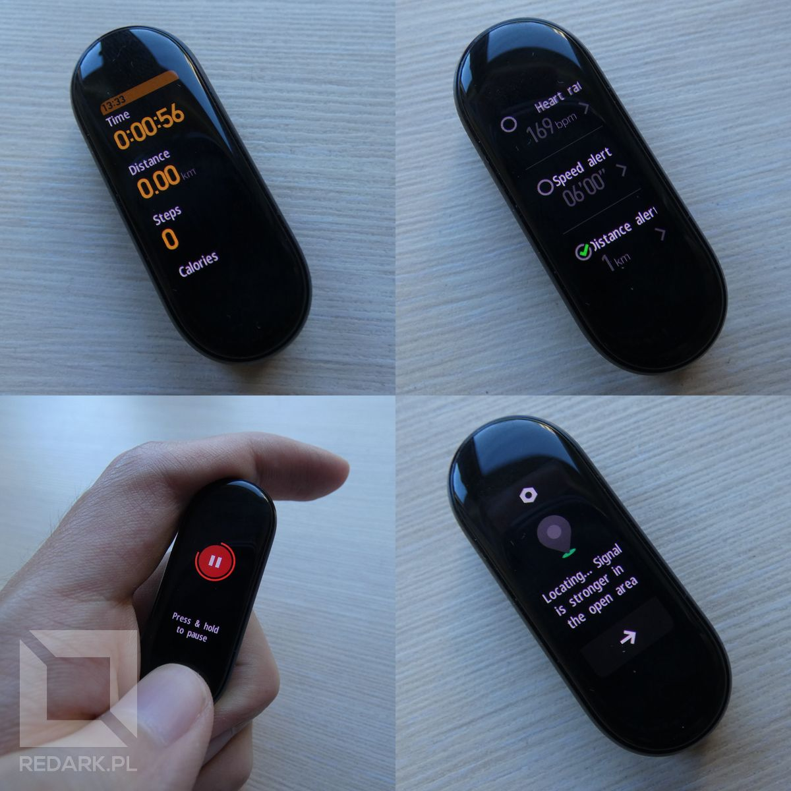

<ImageDescription>Jedyną wadą ekranu treningów jest mikroskopijny zegar na pomarańczowym pasku u góry</ImageDescription>

## Długość pracy na baterii oraz ładowanie

Urządzenie po wyjęciu z opakowania i sparowaniu z telefonem wskazywało 35% naładowania. Postanowiłem nie ładować jej od razu i ustawić prawie najbardziej prądożerne ustawienia:

- powiadomienia z telefonu,
- alert o bezczynności,
- wybudzanie ekranu po podniesieniu (w godz. 7-23),
- monitorowanie tętna, snu i stresu co 1 minutę,
- jasność ekranu na 80%,
- tryb nocny obniżający jasność ekranu (w godz. 18-8).

Opaska na tych ustawieniach straciła po dwóch dniach prawie 25% swojej baterii. Można z tego wnioskować, że na takich ustawieniach w pełni naładowana opaska jest w stanie wytrzymać około 8-9 dni pracy. Rozładowaną opaskę naładowałem dokładnie w godzinę i 26 minut, a następnie zmniejszyłem częstotliwość wykonywania pomiarów do 10 minut z automatycznym podbijaniem częstotliwości w przypadku wykrycia aktywności fizycznej. Reszta ustawień pozostała bez zmian. Na tych ustawieniach **opaska wytrzymała mi 14 dni z drobnym zapasem energii.**

<AdSense/>

Wynika z tego, że przy odpowiednim dobraniu opcji jesteśmy w stanie bez problemu otrzymać 2 tygodnie pracy na baterii, które zresztą były zapewniane przez producenta. Według tych samych zapewnień opaska w "trybie eco" jest w stanie wytrzymać 20 dni i jest to moim zdaniem bardzo realny pułap, ale kupowanie Mi Banda i używanie go jako zwykłego zegara moim zdaniem mija się z celem.

<InfoBlock>Dla porównania: największy konkurent Mi Banda - Honor Band - także deklaruje pracę do 14 dni na baterii, ale z wyłączonymi wszystkimi automatycznymi pomiarami i podświetlaniem ekranu ruchem nadgarstka. W normalnym trybie działania Honor Band ledwo dociąga tygodnia na baterii. Jest to bardzo mało w porównaniu do Mi Banda.</InfoBlock>

Tak czy siak, na **jeden z największych plusów 5. generacji opaski od Xiaomi uważam ładowarkę magnetyczną.** Choć nie używałem poprzedników, to potrafię sobie wyobrazić, jak uciążliwe było ciągłe wyjmowanie pastylki z opaski w celu jej naładowania. A teraz? Zdejmuję ją z ręki, zbliżam do jej plecków kabelek i cyk! Ładowarka samoczynnie przyczepia się do gniazda zasilania, a ja nie muszę się siłować z rozbieraniem urządzenia. Rewelacja!

<Gallery>
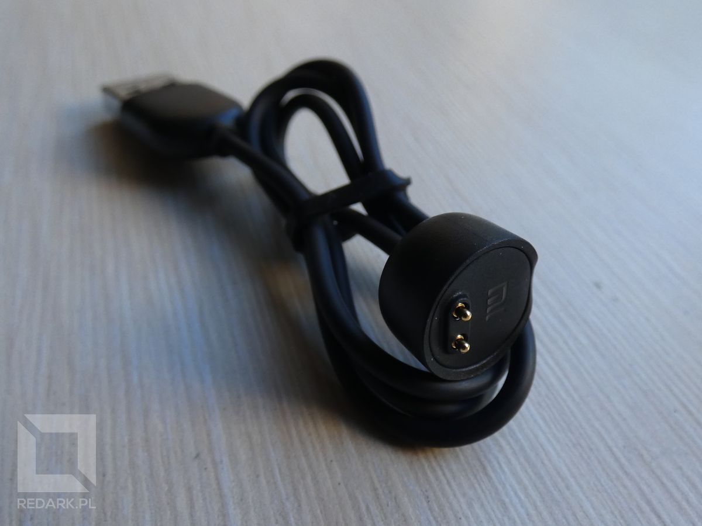
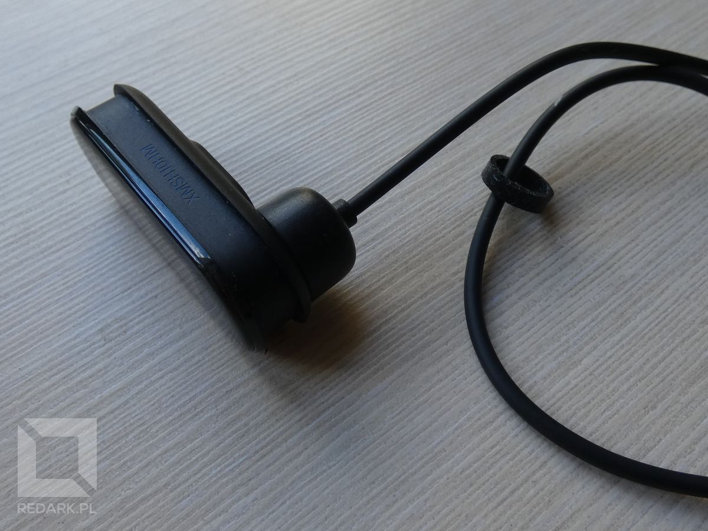
</Gallery>

## Podsumowanie

Podsumowując Mi Band 5 to kawał dobrej i taniej elektroniki. Inżynierowie Xiaomi ponownie pokazali, dlaczego rynek smart opasek należy właśnie do nich. Wzorowe wykonanie, długi czas pracy na baterii, przyzwoite mierzenie tętna i kroków, a to wszystko za cenę 150 złotych. Ja wróżę temu urządzeniowi kolejny rekord sprzedażowy. Serdecznie polecam.

<GoodList>
- Duży i czytelny, nawet w ostrym słońcu, wyświetlacz
- Przejrzysty i przyjemny interfejs
- Magnetyczny kabel ładowania
- Rozbudowana lista trybów treningu
- Dobra precyzja pomiaru kroków oraz tętna
- Szeroka gama ustawień oraz personalizacji układu menu
</GoodList>

<BadList>
- Ciągły brak wsparcia dla naszych systemów płatności zbliżeniowej
- Zablokowany sensor saturacji krwi
- Chwilowe problemy z działaniem aplikacji Mi Fit
- Brak Gorilla Glass (przyda się szkło lub folia ochronna)
</BadList>
