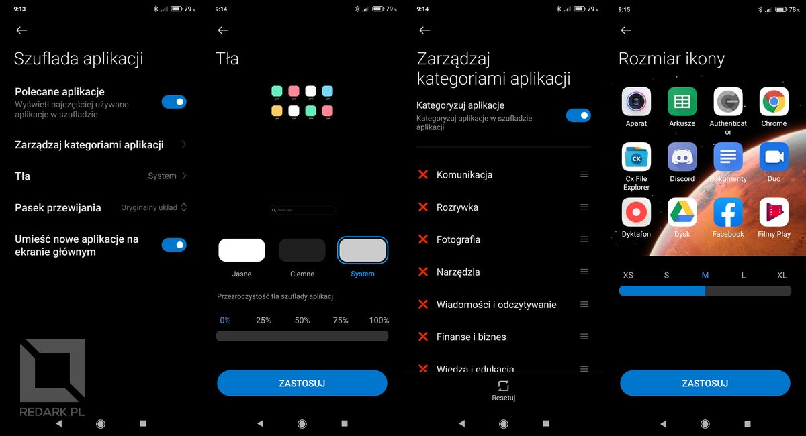
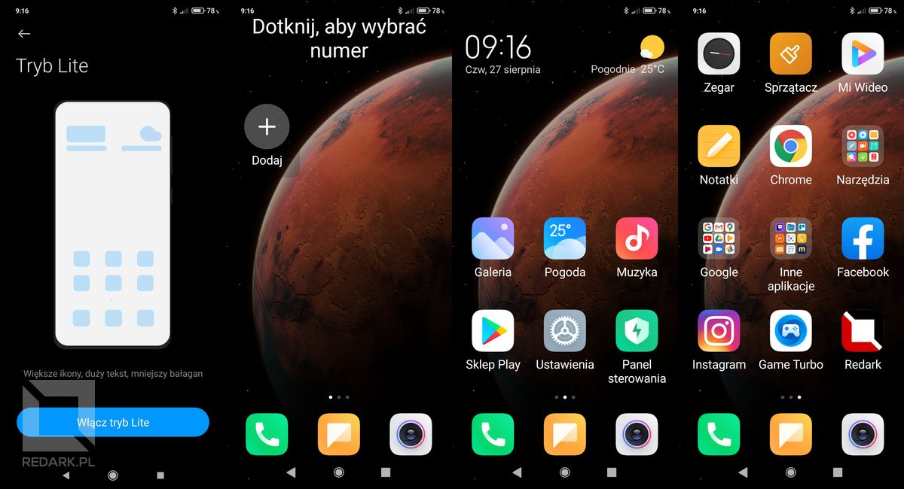
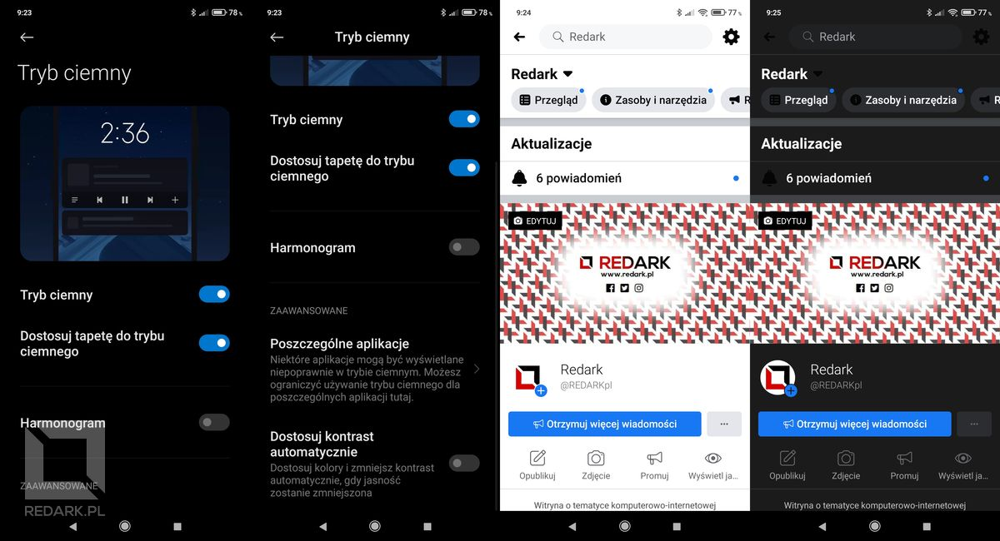
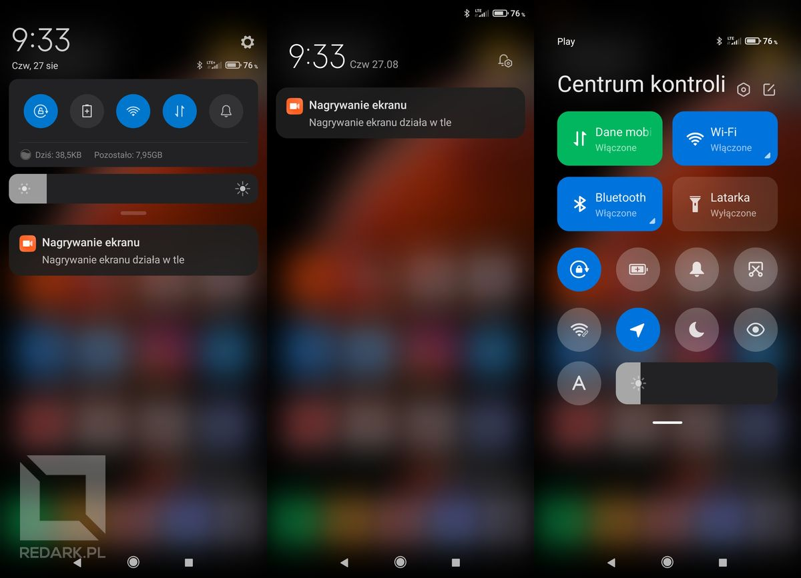
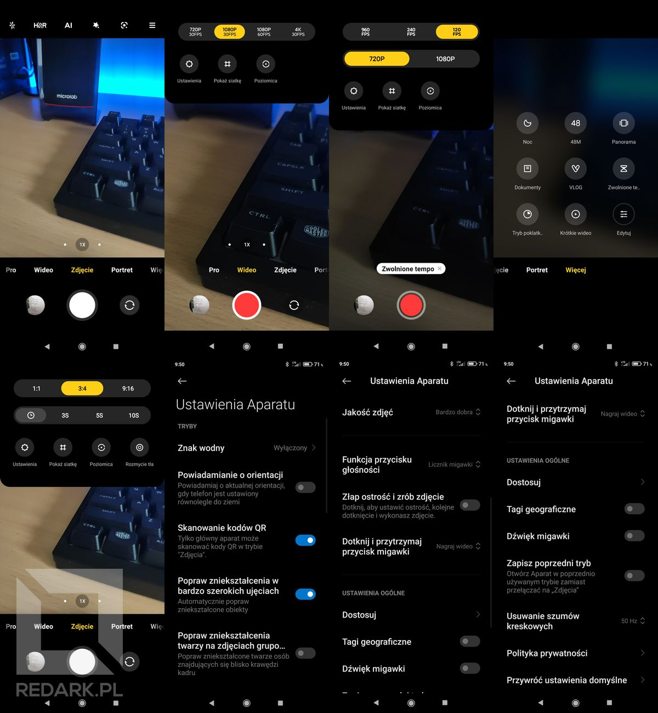
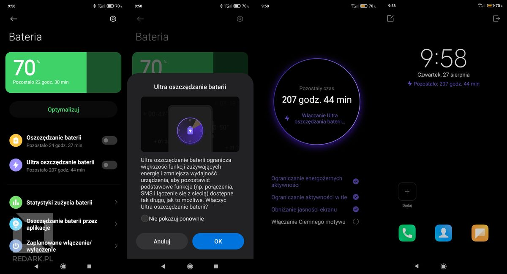
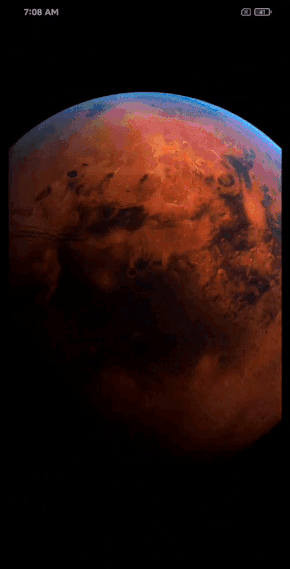

Xiaomi, jeden z najpopularniejszych obecnie producentów smartfonów, od pewnego czasu wdraża w swoich urządzeniach nową wersję nakładki systemowej MIUI oznaczonej numerem 12. Mój telefon, czyli Mi 9 SE (którego [recenzję możecie znaleźć na tym portalu](/recenzja-xiaomi-mi-9-se)) otrzymał ją w tym tygodniu. Zapraszam na omówienie najważniejszych zmian w MIUI 12 od Xiaomi.

## Nowy wygląd menu oraz animacje

Producent postanowił odświeżyć ogólny wygląd swoich urządzeń. Aktualizacja znacząco zmienia wygląd menu w telefonie. Tyczy się to przede wszystkim rozmiaru i kroju czcionki. Poniżej filmik prezentujący nową animację odblokowywania telefonu oraz wygląd ustawień:

<YouTube id='lB_AYPLgNPw' title='miui 12 nowe animacje'></YouTube>

<YouTube id='VakOzPwILWI' title='miui 12 nowe menu ustawień'></YouTube>

Nie sposób nie zauważyć tutaj inspiracji systemem iOS od Apple. Animacja nadlatywania ikonek po odblokowaniu, zaokrąglone na rogach kwadraty, czy fizyka cieczy w przycisku pamięci reagująca na pochylenie telefonu. Takie tricki są już od dawna znane użytkownikom telefonów z nadgryzionym jabłkiem.

## Menadżer pulpitów

Zmiany zaszły również w domyślnym menadżerze pulpitów Xiaomi, który jest odpowiedzialny za wygląd ekranów głównych z ikonkami aplikacji. Dotychczas Xiaomi, tak samo jak Huawei w swoim EMUI i Apple w iOS-ie, stosował zasadę: wszystkie ikonki na pulpicie, zero ukrywania. Jedni są zwolennikiem takiego rozwiązania, inni nie. Na szczęście od teraz użytkownik będzie mógł zadecydować, jakie ułożenie ikonek preferuje:

<YouTube id='YMez1VB9r50' title='miui 12 szuflada z aplikacjami'></YouTube>

Szuflada z aplikacjami jest bardzo dobrze zaprojektowana i pozwala na personalizowanie kolejności ikonek oraz widocznych u góry kategorii (screeny poniżej). Powiem szczerze, że chyba przejdę za niedługo na ten tryb.

<ImageDescription>Święty Graal dla osób lubiących minimalizm na ekranie głównym</ImageDescription>

Menadżer pulpitów MIUI 12 dostał jeszcze jedną nowość, a jest nim tryb Lite! Posłużyć on może seniorom lub osobom niedowidzącym. Po wejściu w ten tryb ikony oraz nazwy aplikacji stają się ogromne, a specjalny panel po lewej stronie pozwala na łatwe wybieranie kontaktów z książki telefonicznej.

<ImageDescription>Tryb Lite - pożyteczny dla osób niedowidzących</ImageDescription>

## Aplikacja ma jasny interfejs? To nie problem!

Xiaomi wie, jak bardzo jego użytkownicy cenią sobie ciemny interfejs w telefonach. Wersja 12. posuwa się o krok dalej i nie oferuje ciemnej kolorystyki jedynie w menu i systemowych aplikacjach, ale w każdej aplikacji, jaką masz zainstalowaną w telefonie! Tak, to koniec jasnego Facebooka, którego deweloperzy są głusi i ślepi na obecne trendy! Chcesz ciemną aplikację? W ułamku sekundy możesz całkowicie ją przemalować!

<ImageDescription>Koniec z białymi owcami w interfejsie!</ImageDescription>

<YouTube id='BIhSJ1kmpRQ' title='miui 12 automatyczna zmiana kolorów aplikacji'></YouTube>

## Centrum kontroli

Ta funkcja to już perfidne zżynanie rozwiązań od Apple :D . Zresztą zobaczcie sami. Animacja, sposób wysuwania paneli, wygląd przycisków, czy nawet rozmycie tła - tosz to iOS w czystej postaci!

<YouTube id='lGFRMC4nlZI' title='miui 12 centrum kontroli'></YouTube>

<ImageDescription>Kiedy iOS wejdzie za mocno</ImageDescription>

## Pływające okna

Od pewnego czasu w systemie Android dostępna jest opcja dzielenia ekranu na dwie części. Pozwala to np. przepisywać ze zdjęcia tekst do notatnika. MIUI 12 wprowadziło jeszcze jeden sposób użytkowania dwóch aplikacji jednocześnie, a jest nim pływające okno. Aplikacja otworzona w takim trybie może być dowolnie przesuwana po powierzchni ekranu za pomocą górnej krawędzi okna. Zbliżenie go do jednego z narożników spowoduje jego pomniejszenie. Pionowe przeciągnięcie dolnej krawędzi okna powoduje zamknięcie lub zmaksymalizowanie aplikacji. Opcja ciekawa, choć lista dostępnych w tym trybie aplikacji na razie nie powala, przez co nadal lepszym rozwiązaniem jest dzielenie ekranu na dwie części.

<YouTube id='AW9G1M-596s' title='miui 12 pływające okna'></YouTube>

<AdSense/>

## Nowa aplikacja aparatu

Domyślna aplikacja aparatu również przeszła facelifting i również czerpie trochę z iPhone'a. Z najważniejszych zmian zaliczyć można ujednolicony suwak do zmiany obiektywów ([w recenzji Mi 9 SE](/recenzja-xiaomi-mi-9-se) pokazywałem, że był on dwuczęściowy), ulepszony przełącznik trybów aparatu (od teraz możemy sterować ich widocznością i kolejnością) oraz łatwiejszy dostęp do popularnych ustawień takich jak np. czas samowyzwalacza.

<ImageDescription>Zmiany niewielkie, a cieszą...</ImageDescription>

## Tryb ultra oszczędzania baterii

W moim poprzednim telefonie firmy Huawei dostępny był specjalny tryb maksymalnego oszczędzania energii, który pozwalał wyłączyć wszystkie zbędne funkcje smartfona, zostawiając jedynie połączenia głosowe i wiadomości SMS. Dotychczasowy tryb oszczędzania energii u Xiaomi był mniej inwazyjny i jedynie ograniczał działanie procesów w tle. Nie dało się dzięki niemu odczuć dużej różnicy w czasie pracy na baterii. Na szczęście Xiaomi poszło po rozum do głowy i dodało tzw. tryb ultra oszczędzania baterii, który działa dokładnie tak, jak opisywany wcześniej przeze mnie patent Huawei'a. Zamrożenie większości funkcji i ograniczenie kolorów na ekranie zapewnia znacznie mniejsze zużycie energii, zwłaszcza jeśli nasz telefon wyposażony jest w ekran AMOLED.

<ImageDescription>Nieoceniony, gdy liczy się każdy procent baterii</ImageDescription>

## Super tapety

Na koniec chyba najbardziej widowiskowa funkcja MIUI 12, której niestety nie udało mi się uruchomić na telefonie. Mowa o tzw. super tapetach, czyli animacjach, które płynnie zamieniają tapetę ekranu głównego na ekran Always on Display i vice versa. Można wybrać pomiędzy Ziemią a Marsem, a także wskazać miejsce, na które będzie przybliżany widok po odblokowaniu telefonu. Efekt prezentują poniższe gify:

<Gallery>

</Gallery>

## Podsumowanie

Jak Wam podobają się takie nowości? Uważacie, że Xiaomi dobrze robi, upodabniając się do iOS'a czy nie? Dajcie znać w komentarzach, a ja tymczasem wracam do grzebania w opcjach mojego telefonu :)
