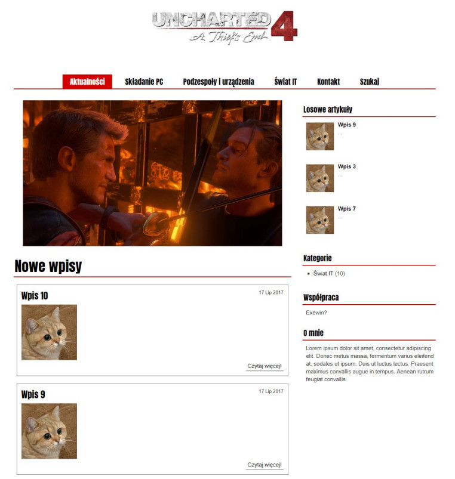
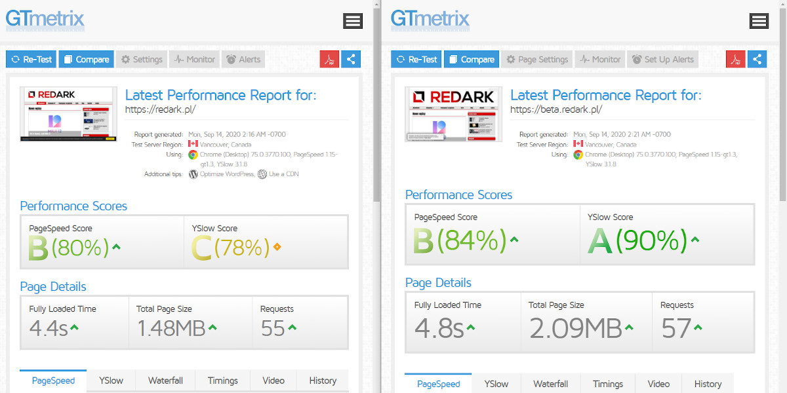
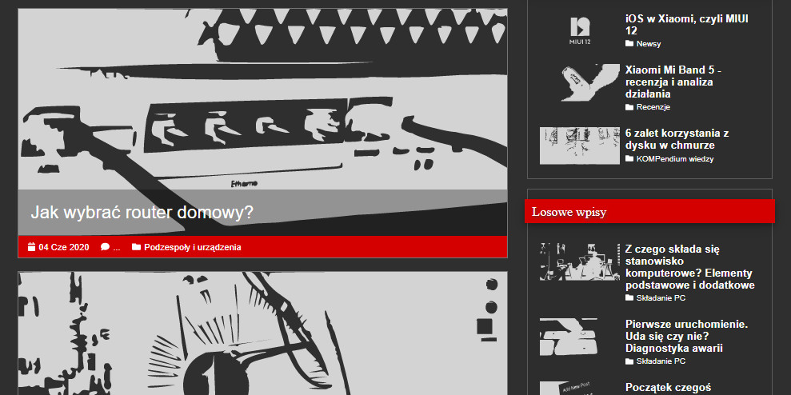
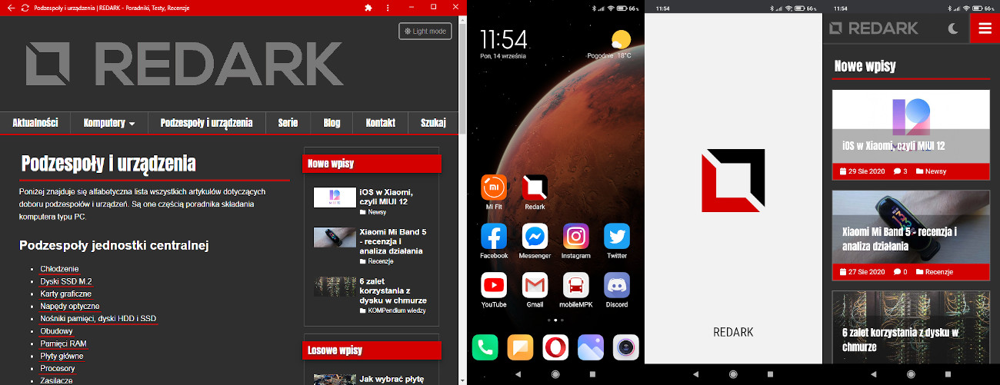

## Geneza

Pozwólcie, że przytoczę po krótce historię powstania serwisu REDARKpl. Gdy ponad dwa lata temu postanowiłem stworzyć swojego własnego bloga wybór był oczywisty - WordPress. Łatwy w obsłudze, rozbudowany i popularny CMS do tworzenia i zarządzania stroną internetową. Miałem z nim już do czynienia wcześniej, stąd wiedziałem, jakie ma możliwości i znałem też jego konkurenta - Joomle, który okazał się bardzo słabym kawałkiem oprogramowania. Jestem perfekcjonistą, więc darmowe motywy dostępne w Internecie mnie nie satysfakcjonowały (a nie chciałem wówczas ładować w to pieniędzy). Postanowiłem utrudnić sobie życie i wykorzystać dawne umiejętności w PHP, aby stworzyć swój własny motyw do WordPressa. Choć jakość jego wykonania pozostawiała wiele do życzenia, działał i pozwolił mi wystartować z blogiem. Miesiące mijały, ilość wymagań rosła, a kod motywu stawał się coraz mniej czytelny. Pojawiające się co chwile problemy z WordPressem lub jedną z jego wtyczek, [zmiana edytora treści na Gutenberga](/gutenberg-nowy-edytor-tresci-wordpressa), czy skomplikowana migracja na protokół HTTPS nie poprawiały sytuacji. Postanowiłem coś z tym zrobić...

Jako że na co dzień zajmuję się programowaniem w Reactcie (biblioteka JavaScript do tworzenia interfejsów aplikacji internetowych), postanowiłem spróbować wykorzystać swoje umiejętności i wlać trochę nowości do WordPressa. Przez około 2 miesiące szukałem dobrego połączenia Reacta z WordPressem. Najpierw jako tzw. headless CMS, później jako React zagnieżdżony w motywie WordPressa, ale efekt cały czas był niezadowalający. Z jednej strony problemy generował React, który nie jest stworzony do takich zadań, a z drugiej strony WordPress, który cały czas boleśnie przypominał mi, że jest napisany w lekko przestarzałym już PHP i działa po stronie serwera, a nie użytkownika. Te technologie ze sobą nie współgrały. Zwątpiłem w powodzenie tej misji.

<ImageDescription>Pierwszy screen Redarka, jaki chyba posiadam :)</ImageDescription>

Postanowiłem podejść do tematu jeszcze inaczej i wykorzystać Gatsby'ego. Mówiąc w skrócie, Gatsby jest to React, który pozwala wygenerować gotowe pliki HTML z treścią artykułów na podstawie zewnętrznego źródła danych np. istniejącego WordPressa. Nie znałem tej technologii, więc spróbowałem polegać na gotowcach i istniejących wtyczkach dedykowanych do łączenia WordPressa z Gatsbym. Wyniki były niezadowalające, strona koślawa, a WordPress (tak samo, jak przy migracji na HTTPS) przypomniał mi, że operuje na adresach absolutnych, czyli jakakolwiek próba ruszenia go z domeny redark.pl zakończy się jego śmiercią. Oznaczało to, że Redark tak czy siak musiałby zostać na tej domenie, jeśli nie chcę go uszkodzić. Wtedy narodziła się myśl - a gdyby tak zrezygnować z WordPressa?

<AdSense/>

## Porzucić wszystko...

Rozpoczęła się wewnętrzna walka. Czy zaryzykować życie prowadzonego przez dwa lata serwisu na WordPressie, na rzecz technologii, której prawie nie znam? Czy ja na pewno tego chcę? Co, jeśli nie wyjdzie? Czy w razie czego uda mi się przywrócić wszystko z kopii bezpieczeństwa? Te pytania zaprzątały mi głowę przez wiele tygodni. Nagle postanowiłem: zrobię to, ale nie na gotowcach i nie bez doszkolenia się w tym temacie. Tutaj pomógł Adam "Roman" Romański - prowadzący [kanał YouTube Hello Roman](https://www.youtube.com/helloroman) (z którego notabene dowiedziałem się o istnieniu Gatsby'ego) oraz autor rewelacyjnego [kursu](https://eduweb.pl/programowanie-i-www/reactjs/gatsby-generator-react) poświęconego tej technologii. I nie, to nie jest materiał sponsorowany. To jest rekomendacja osoby, która zakupiła ten kurs prywatnie, obejrzała go w jeden wieczór i zawierzyła mu dwa lata swojej pracy.

Tak oto zaczęła się trwająca ponad miesiąc batalia o przepisane strony do nowej technologii. Łatwo nie było. Cała logika, style, wyświetlanie obrazków, a nawet przechowywanie artykułów trzeba było wymyślić na nowo. W dodatku wszystkie treści znajdujące się na WordPressie trzeba było jakoś sprawnie przenieść. Import metodą kopiuj-wklej około 80 artykułów nie wchodził w grę. Na szczęście udało się ten proces w miarę zautomatyzować i dzisiaj mogę to powiedzieć - udało się.

## Umarł WordPress, niech żyje Gatsby

I tutaj przenosimy się już do dnia dzisiejszego. Baza oraz pliki WordPressa zostały z honorami spakowane do ZIPa i zabezpieczone, a na serwerze możecie podziwiać już nową wersję serwisu, przepisaną całkowicie na nową technologię. Stali bywalcy zauważą, że nie zmieniło się tutaj dużo. Nie planowałem zmieniać wyglądu serwisu, a jedynie wprowadzić upragnione przeze mnie zmiany i usprawnienia (np. dwupoziomowe menu), których nie chciałem już na siłę implementować w starym wordpressowym motywie. Pojawiły się jednak trzy ważne zmiany, którymi chcę się teraz przed Wami pochwalić.

## Co nowego?

### Dark mode

Tę nowość pewnie część z Was zauważyła od razu po wejściu na stronę. Jednym z moich głównych celów zmiany technologii była właśnie chęć wprowadzenia ciemnego motywu dla całej witryny. Coraz więcej aplikacji oraz stron wprowadza takie rozwiązanie i nie ukrywam, że długo męczyła mnie ochota na to, żeby takową funkcjonalność zaimplementować również w REDARKu, zwłaszcza że ma on bardzo jasną kolorystykę. Reasumując: serwis jest teraz dostępny w dwóch wersjach kolorystycznych: jasnej i ciemnej. Jej wybór zależy od preferowanego schematu kolorów ustawionego w Waszym systemie operacyjnym. Jeśli wybrana domyślnie kolorystyka Ci nie odpowiada, zawsze możesz ją zmienić za pomocą przycisku znajdującego się na samej górze strony, na prawo od logo.

Bardzo cieszę się, że udało mi się zaimplementować tę funkcję w Gatsbym. Choć może się to wydawać dziwne, ale wcale nie było to takie proste i wymagało zastosowania paru sztuczek, aby efekt końcowy był zadowalający. A pro po efektu końcowego: jak Wam się podoba ta nowość? Wolicie jasną czy ciemną stronę mocy... znaczy się REDARKa? :) Koniecznie dajcie znać o tym w komentarzach.

### Szybkość ładowania stron

Nie mogło zabraknąć też optymalizacji działania witryny! W WordPressie ładowanie stron opiera się na technologii SSR (Server Side Rendering), czyli generowaniu treści na serwerze za każdym razem, gdy użytkownik chce wejść na naszą stronę. W przypadku prostych witryn ten model spisuje się bardzo dobrze. Każda osoba, która miała styczność z WordPressem, wie jednak, że opiera się on na zasadzie "to się pluginem zateguje". Takie podejście niestety powoduje, że tworzenie bardziej rozbudowanej witryny jest obarczone potrzebą zainstalowania kilkunastu, jak nie kilkudziesięciu różnych dodatków często bardzo słabej jakości. Każda taka wtyczka mocno wydłuża czas generowania strony i negatywnie odbija się na pozycjonowaniu witryny i zadowoleniu odwiedzających. Co, jeśli ktoś chciał temu zaradzić? Musiał instalować kolejną wtyczkę, później kolejną i kolejną. Miałem dosyć takiego błędnego koła.

Niewątpliwą zaletą Gatsby'ego jest to, że wygenerowana przez niego strona składa się w głównej mierze ze statycznych plików HTML. Strony nie są już generowane ani po stronie serwera, ani po stronie użytkownika. Cały ruch opiera się na gotowych plikach, które są jedynie wysyłane w miarę potrzeb do użytkownika. To, wraz z automatycznym cache'owaniem danych oraz obrazków sprawia, że strony wykonane w Gatsbym są bardzo szybkie oraz dobrze się indeksują i pozycjonują w wyszukiwarce Google'a.

<ImageDescription>Choć rozmiar plików się zwiększył, to strona i tak wykręca wyraźnie lepsze wyniki</ImageDescription>

Poprawa wyników to także zasługa nowego sposobu ładowania ikon oraz obrazów na stronie. Aby strona ładowała się wydajnie, Gatsby przygotowuję kilka różnych wariantów rozmiarów grafik, które są ładowane w zależności od rozmiaru ekranu urządzania. Komputer pobierze wariant z wyższą rozdzielczością, a telefon zadowoli się słabszymi wersjami. W dodatku na samym początku ładowania strona jest pozbawiona wszelkich grafik, a w ich miejscach znajdują się jedynie jednokolorowe kontury (ścieżki SVG), które ważą dziesiątki razy mniej, niż ich kolorowe odpowiedniki. Grafiki są ładowane równolegle (asynchronicznie) i zostają podmienione z konturem, gdy tylko będzie to możliwe. Nie wierzycie mi? Spróbujcie kilka razy odświeżyć całkowicie okno przeglądarki. Może na komputerze ze stałym łączem efekt będzie widoczny tylko ułamek sekundy, ale na telefonie ze słabym zasięgiem? Różnica może sięgać nawet kilku sekund!

<ImageDescription>Witryna Redark w trakcie ładowania</ImageDescription>

<AdSense/>

### Wsparcie dla PWA

Jednym z kolejnych trendów w świecie witryn internetowych jest wsparcie dla aplikacji PWA, czyli Progressive Web App. Jeśli nie wiecie, co to jest, to już pokazuję to na przykładzie. Od teraz, odwiedzając witrynę REDARK możecie zainstalować jej aplikację na komputerze lub smartfonie klikając na komunikat "zainstaluj" znajdujący się najczęściej gdzieś w okolicach paska z adresem strony. Po jego kliknięciu ikona REDARKa pojawi się na Waszym pulpicie lub ekranie telefonu. Najciekawsze w PWA jest to, że nie jest to prawdziwa aplikacja, a ja nie musiałem tworzyć jej przez wiele miesięcy w pocie czoła. Jest to specjalna mini przeglądarka internetowa skrojona tylko pod obsługę mojej witryny.

Pewnie zastanawiacie się, jakie to daje korzyści. Zastosowanie PWA przede wszystkim ułatwia otwieranie witryny użytkownikom oraz daje im możliwość przeglądania jej zawartości bez połączenia z Internetem. Tak, aplikacja PWA umożliwia korzystanie ze strony internetowej w trybie offline. Co prawda na razie tej opcji nie uruchamiałem na Redarku (jest ona czasami problematyczna i nie wydaje mi się, że jest szczególnie potrzebna przy takim blogu), ale kto wie, może się na to zdecyduję.

## Czy jest sens używać jeszcze WordPressa?

Takie pytanie pewnie pojawiło się w głowach części z Was i odpowiedź na nie brzmi: tak, jak najbardziej. Choć Gatsby jest bardzo ciekawym narzędziem do tworzenia stron internetowych, to nie da się ukryć, że wymaga on znaczącej wiedzy informatycznej/programistycznej. WordPress, choć ma dużo wad, to nadal genialny i popularny CMS umożliwiający dosłownie każdemu wyklikanie swojej wymarzonej witryny. Nie powiem teraz: "hej! usuńcie swoje WordPressy i migrujcie je do Gatsby'ego!". Teraz sam wiem, ile tak na prawdę wysiłku kosztowało przeniesienie wszystkiego do tej technologii, a nadal nie jestem w 100% pewien, czy była to dobra decyzja. Jak to mówią: bez ryzyka, nie ma zabawy.

## Co dalej?

To, że witryna stoi dumnie na domenie, nie sprawia, że moje zadanie się już kończy. Nadal muszę nadzorować, czy wszystkie elementy i funkcje witryny działają poprawnie oraz, czy treści zostały poprawnie zaimportowane. Dużo pracy czeka mnie też na zapleczu. Może dla Was te trzy nowości nie robią wrażenia i uznacie, że nic się nie zmieniło, ale dla mnie witryna zmieniła się diametralnie. Muszę na nowo opracować wszystkie procedury publikowania na niej postów. Na pewno, gdy sam opanuję sytuację, będę chciał przygotować drugi artykuł opisujący działanie witryny od kuchni, ponieważ dzieje się tam sporo. Jeśli jesteście tego ciekawi, dajcie znać o tym w komentarzach, to bardzo zmotywuje mnie do dalszej pracy. A tymczasem się z Wami żegnam i wracam do pisania :)

