Zacznijmy od tego jak do niedawna wyglądało moje stanowisko, ale nie myślcie sobie, że na co dzień panuje tutaj taki porządek - zrobiłem go na potrzeby tego zdjęcia. Normalnie, gdy to stanowisko robi za miejsce pracy, można tu znaleźć prawie wszystko. Pudełko po słuchawkach pełniące rolę podstawki pod boczny monitor nie ułatwiało sprawy, a dodatkwo znajdujący się na nim ekran miał słabe parametry i był jedynie rozwiązaniem tymczasowym na czas koronawirusowego lockdown'u. Rosnąca ilość zadań do wykonania na raz na komputerze zmusiła mnie do szybszego pomyślenia o nowy monitorze z porządną rozdzielczością.

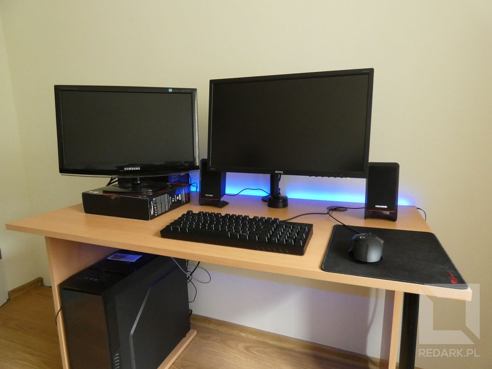

## BenQ GW2480

Moim podstawowym monitorem (po prawej stronie) od wielu lat jest BenQ GW2270. Cały czas uważam go za jeden z najlepiej przemyślanych i wykonanych ekranów, jakie posiadałem. Wyposażony jest on w matrycę AMVA, rozdzielczość Full HD, dwa porty HDMI oraz jeden D-SUB. Z racji dużego zadowolenia tym modelem, poszukując nowego monitora bacznie śledziłem ofertę BenQ. Niestety moja seria oznaczona numerem 70 została już wycofana. Po części jestem perfekcjonistą i nie obraziłbym się, gdyby oba monitory wyglądały identycznie. W aktualnej ofercie producenta znajduje się już seria numer 80. Skoro nie mógł to być już ten sam model, postanowiłem, że pójdę jeszcze w odrobinę większą przekątną, ponieważ obecnie mam większe stanowisko, niż poprzednio i przekątna 22 cale stała się odrobinę za mała.

Tak oto zdecydowałem się na BenQ GW2480. Miał on kilku konkurentów, ale żaden z nich nie oferował takich dodatków jak BenQ. Rozpocznijmy więc od unboxingu. W pudełku znajdziemy zestaw wielojęzycznych instrukcji, płytkę CD ze sterownikami, dwuczęściową nóżkę, kabel zasilający, kabel sygnałowy HDMI oraz rzecz jasna monitor.

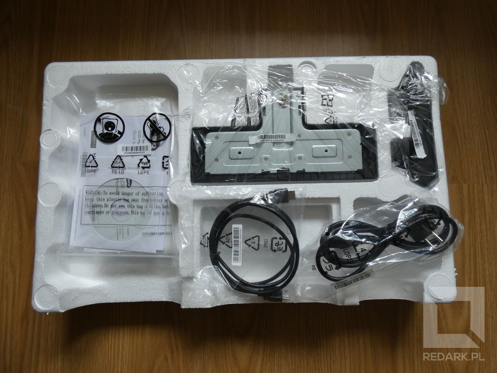

Pierwszym elementem, jaki wypakowałem, była nóżka. Jest prostokątna i bardzo przypomina nóżkę mojego starego GW2270. Bardzo podoba mi się ten kształt, ponieważ jest bardziej pasowny od swoich okrągłych odpowiedników, a dzięki wysięgnikowi znajdującemu się za monitorem, na powierzchni nóżki można położyć jakieś przedmioty. Pamiętam, że uwielbiałem kłaść na niej telefon oraz długopis, by były zawsze pod ręką. Jednak nowa generacja zaoferowała jedną znaczącą zmianę względem 22-calowego poprzednika. BenQ GW2480 w swojej podstawce posiada genialnie zaprojektowany i ukryty organizer na przewody. Z resztą sami to oceńcie spoglądając na zdjęcia poniżej.

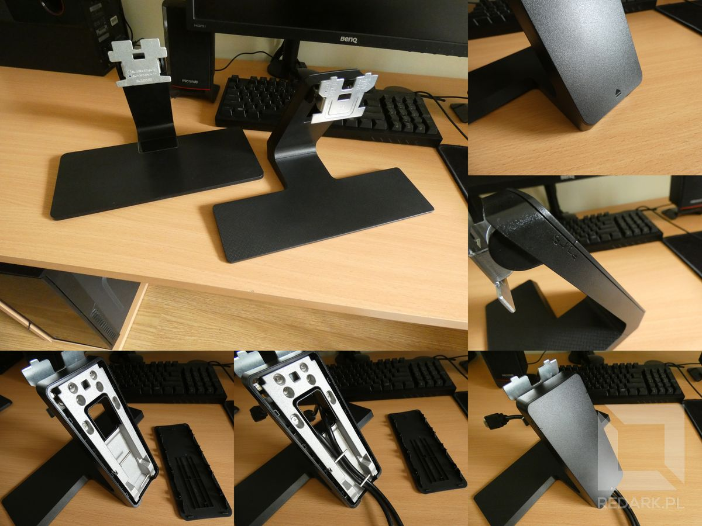

Niestety, tak samo jak w przypadku poprzedniego monitora, tak i tu miałem wyrzuty sumienia, że zastępuje tak fajną podstawkę uchwytem VESA. Jednak bardzo zależy mi na miejscu na biurku oraz możliwości regulacji wysokości ekranu, więc ta decyzja nie podlegała dyskusji. Wracając do samego monitora i jego specyfikacji. Jest to 24-calowy monitor IPS posiadający rozdzielczość Full HD, wbudowane głośniki, czujnik natężenia światła oraz ekran z ukrytymi ramkami. Ze złącz dostępne jest HDMI, DisplayPort, D-SUB oraz wejście i wyjście audio (taki sam duet gniazd audio posiadał GW2270, co jest bardzo przydatne). Do sterowania urządzeniem służy sześć przycisków znajdujących się na jego dolnej krawędzi (więcej opowiem o nich później).

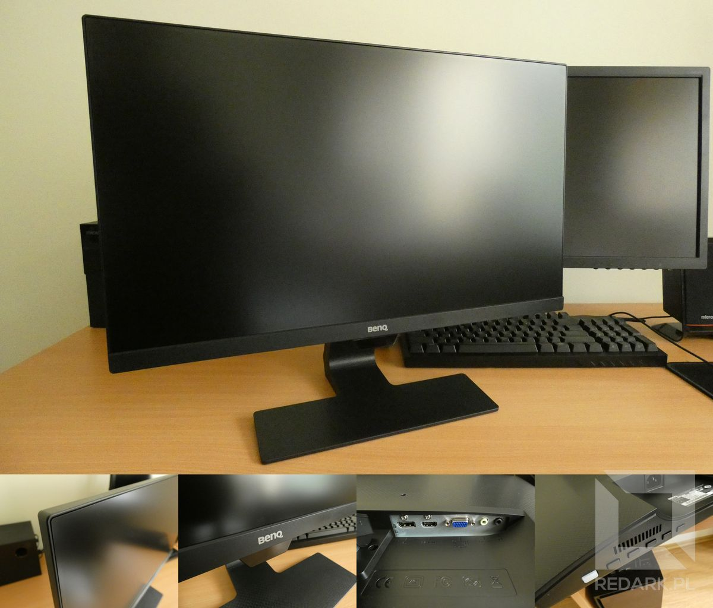

### Nowy monitor w akcji

Do czasu publikacji tego artykułu monitora używam od prawie dwóch miesięcy. Jakość wyświetlanego obrazu jest oczywiście bez zastrzeżeń, choć mając teraz do porównania matrycę IPS oraz VA, muszę stwierdzić, że bardziej preferuję VA, która notabene jest przedstawiana jako "ulepszony IPS". Ewidentnie widać, że nowy ekran ma mniejszy kontrast (1000:1 dla IPS i 3000:1 dla VA), a także odrobinę węższe kąty widzenia. Widać to szczególnie na krawędziach matrycy, na których obraz ewidentnie szarzeje. Tak czy siak, obraz prezentowany przez GW2480 jest nadal bardzo dobrej jakości.

<AdSense/>

Mówiąc już o działaniu muszę wspomnieć o genialnie przemyślanym menu oraz jego przyciskach sterowania. Pewnie myślicie, co może być takiego fajnego w przyciskach monitora? Otóż jedną z funkcji, która naprawdę urzekła mnie w monitorach BenQ są personalizowane przyciski skrótów. Oba modele pozwalają na zdefiniowanie do 3 skrótów do funkcji urządzenia. Dla przykładu na starym monitorze wybrałem sobie regulację podświetlenia, zmianę wejścia obrazu oraz filtr niebieskiego światła. Na nowym monitorze skonfigurowałem prawie to samo, z tą różnicą, że filtr niebieskiego światła zamieniłem na regulację głośności wbudowanych głośników. Nie wiem jak Wy, ale ja jeszcze nie widziałem takiej funkcji w monitorze innego producenta. Mam teraz dwa monitory, dwa identyczne ekrany ustawień ze skrótami pozwalającymi zmienić mi za pomocą jednego przycisku najczęściej modyfikowane przeze mnie ustawienia. Jak dla mnie cudo.

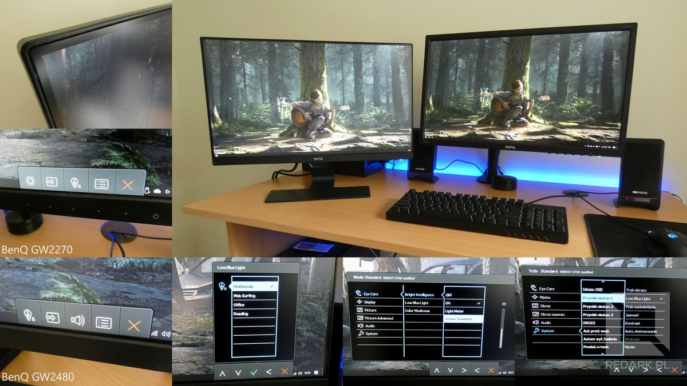

### Wady GW2480

Jak w każdym sprzęcie znalazłem także wady. Oprócz wspomnianego wcześniej słabszego kontrastu oraz kątów widzenia nie zachwycił mnie niestety znajdujący się na dolnej krawędzi sensor światła. W teorii powinien on pozwolić mi na komfortową pracę w zmiennych warunkach oświetlenia, a w rzeczywistości powodował, że monitor mnie raził. Oferowany przez niego zakres jasności był dla moich oczu nie do wytrzymania, a jego regulacja w ustawieniach dawała jedynie symboliczną poprawę, dlatego całkowicie zrezygnowałem z tej opcji. Następna wada również dotyczy podświetlenia, a mianowicie zakresu regulacji podświetlenia matrycy w trybie bez korekty czujnika światła. Menu monitora ewidentnie powinno pozwalać zejść na jeszcze niższe wartości podświetlenia, które w porównaniu ze starszym GW2270 są zauważalnie wyższe. Ostatnią z wad monitora są jego wbudowane głośniki. Co prawda, nie spodziewałem się rewelacji, bo w takich urządzeniach zapewniają one jedynie podstawową jakość dźwięku, ale muszę przyznać, że i tak mnie rozczarowały. Oferowany przez nie dźwięk jest bardzo słabej jakości i nie wiem czy kiedykolwiek ich użyję, nawet w podbramkowej sytuacji.

## Modernizacja stanowiska

### Wyłącznik pod zasilanie audio

Jedną z wad posiadanych przeze mnie na biurku głośników 2.1 jest okresowe uderzenie głośnika basowego, gdy ten nie jest używany. Niby nic, ale można się go trochę przestraszyć. Aby wyłączyć głośniki byłem zmuszony sięgać daleko ręką do głośnika basowego, aby użyć wyłącznika znajdującego się na jego obudowie. Takie rozwiązanie było niewygodne oraz bałem się, że jego częste używanie szybko doprowadzi do awarii. Postanowiłem coś z tym zrobić i wykonać sobie niestandardowy przedłużacz do ich wyłączania.

<WarningBlock>Opisywane poniżej elementy będą pracowały pod niebezpiecznym dla człowieka napięciem 230V. Należy je wykonać solidnie, aby nie stwarzały zagrożenia dla życia lub zdrowia przyszłych użytkowników. Jeśli nie czujesz się na siłach, aby wykonać taką instalację samodzielnie, nie rób jej i poproś o pomoc wykwalifikowaną osobę.</WarningBlock>

W sklepie budowlanym zakupiłem płaskie (bez uziemienia) gniazdo oraz wtyczkę, przełącznik nożny typu włącz-wyłącz oraz odpowiednią dla mojego biurka długość dwużyłowego przewodu. Do wykonania przedłużacza użyłem nożyczek, ściągacza izolacji, skalpela oraz zestawu śrubokrętów i kleszczyków. Pracę rozpocząłem od przecięcia przewodu na pół oraz odizolowaniu końcówki jednego z nich. Następnie zarobiłem blaszki łączące przewód z otworami gniazdka. W przypadku prądu zmiennego i gniazdka bez bolca, kolejność przewodów nie ma znaczenia. Analogicznie sytuacja miała się z wtyczką, którą zarobiłem na jednym z końców drugiego kawałka przewodu.

<Gallery>
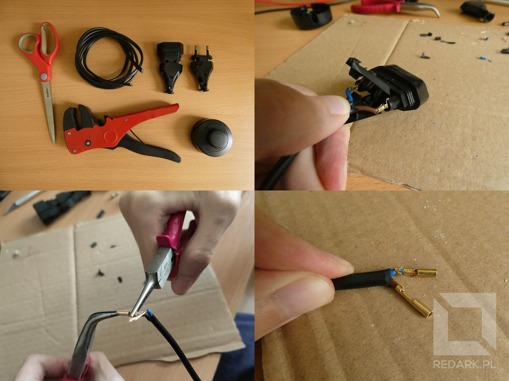
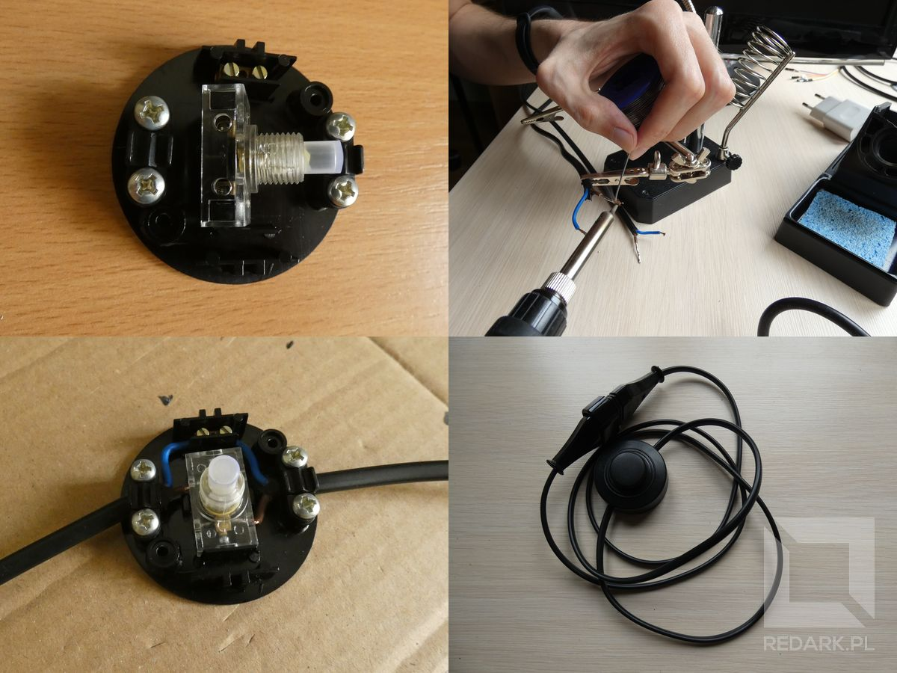
</Gallery>

Ostatnim elementem do zamontowania został wyłącznik nożny, który miał połączyć obie połówki przewodu. Przełącznik po rozkręceniu zawierał w sobie wykonany z plastiku mechanizm przełącznika z dwoma otworami na przestrzał oraz malutki metalowy konektor służący do stałego połączenia drugiej żyły przewodu. Z racji tego, że oba połączenia były tam skręcane śrubą w tulejce, postanowiłem dla pewności pokryć jeszcze końcówki przewodów cyną. Następnie zamontowałem oba przewody w gnieździe. Przewód brązowy (fazowy) umieściłem zgodnie ze sztuką w przełączniku tak, aby po wyłączeniu przedłużacza faza nie znajdowała się w gniazdku. Oczywiście w przypadku wtyczki bez uziemienia nie ma to dużego znaczenia, ponieważ można ją podłączyć odwrotnie i faza popłynie niebieskim przewodem, ale jak robić, to porządnie. Na koniec pozostało skręcić obudowę przełącznika i wykonać mały test np. przy użyciu lampki biurkowej. Wszystko działało idealnie :)

### Szykowanie uchwytu pod nowy monitor

Następnym ulepszeniem, w jakie chciałem wyposażyć biurko, był drugi uchwyt VESA do powieszenia omawianego wcześniej nowego monitora. W tym celu zakupiłem uchwyt ART L-01X. Chciałem kupić model ART L-01 ze względu na lepsze mocowanie do blatu, ale niestety jego dostępność była tragiczna. Czemu lepsze mocowanie? To jest wynik nauczki, jaką sprezentował mi mój pierwszy uchwyt VESA, na którym wisiał dotychczas BenQ GW2270. Zamawiając ART-a liczyłem na to, że ten będzie miał inaczej skonstruowane mocowanie, które nie będzie wymagało ode mnie żadnych modyfikacji. Gdy otworzyłem opakowanie nowego uchwytu nie wiedziałem, czy się śmiać, czy płakać. Zamówiony przeze mnie ART L-01X to tak naprawdę Maclean MC-753 (ze zmienionym logo), czyli mój pierwszy uchwyt, który wymagał ode mnie zmodyfikowania uchwytu :D Chciałem uniknąć problemów, a dostałem powtórkę z rozrywki...

<Gallery>
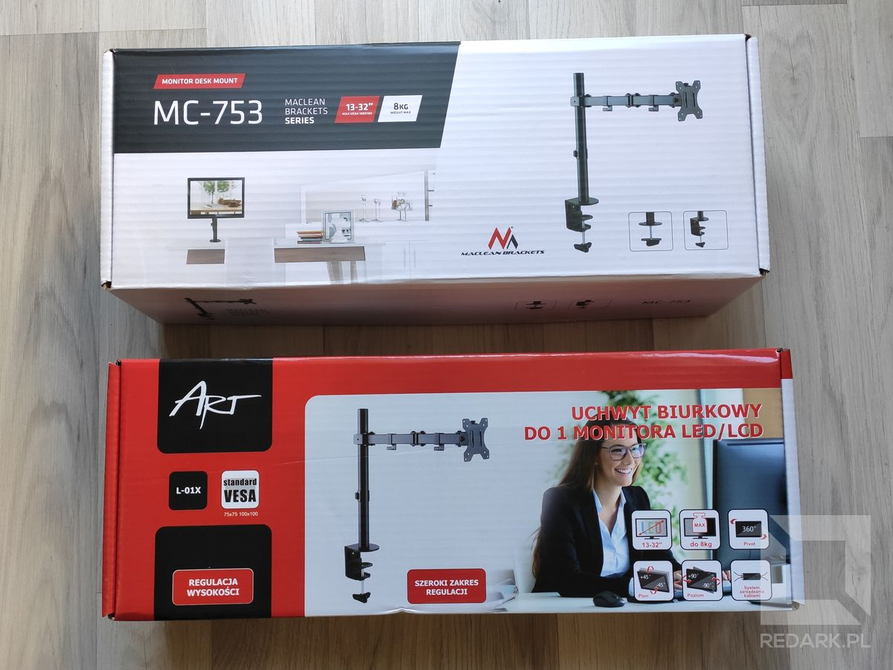
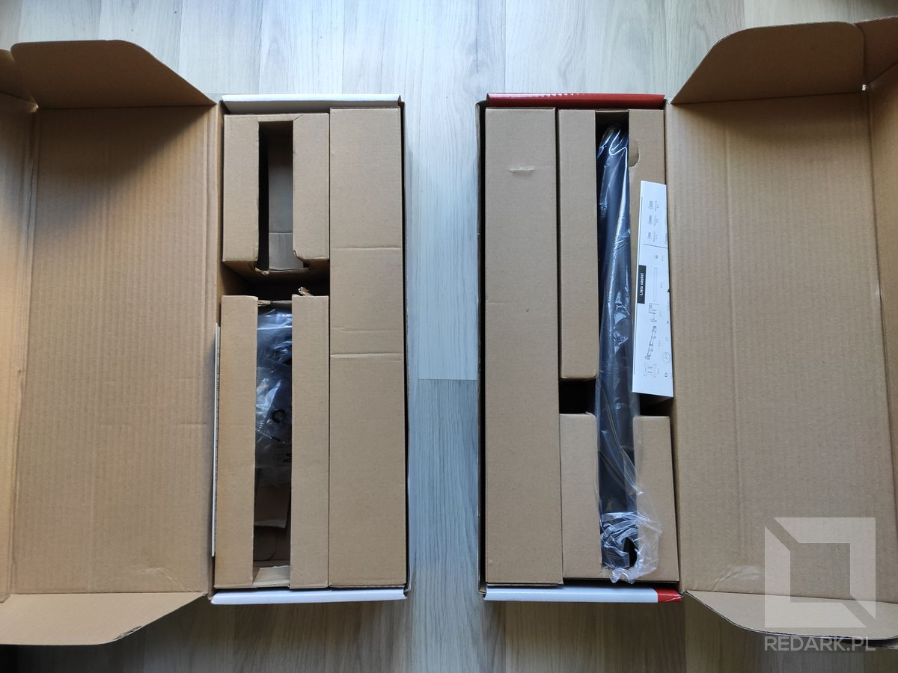
</Gallery>

Pozostało się tym nie przejmować i zacząć skręcać uchwyt. Jego montaż nie jest trudny i wszystko sprowadza się do przykręcenia kilu śrubek oraz naklejeniu pięciu gumowym nóżek. Na zdjęciach poniżej możecie zobaczyć o jaką modyfikację uchwytu mi chodziło. Dokładnie to samo zrobiłem w moim pierwszym egzemplarzu. Po prostu tylna ścianka biurka jest na tyle blisko krawędzi blatu, że oryginalna śruba nie byłaby w stanie się obrócić wokół własnej osi. Pozostało więc ucięcie jej długich ramion i po problemie!

<InfoBlock>W przypadku zakupu takiego uchwytu zalecam się zaopatrzyć w własny zestaw imbusów wraz z grzechotką dla zrobienia dobrej dźwigni. Malutkie kluczyki dołączone do zestawu nie pozwalają komfortowo i solidnie skręcić całego zestawu, który ma przecież dźwigać wielokilogramowy monitor na długim wysięgniku.</InfoBlock>

<AdSense/>

<Gallery>
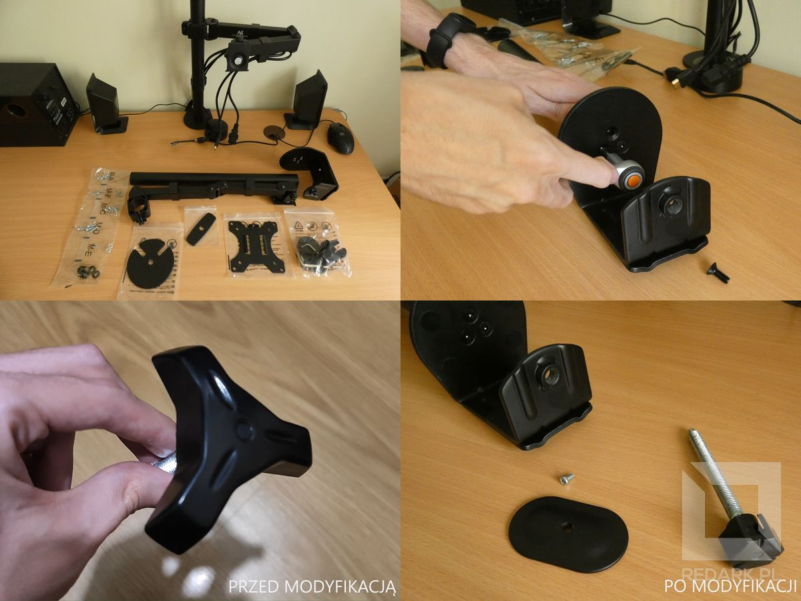
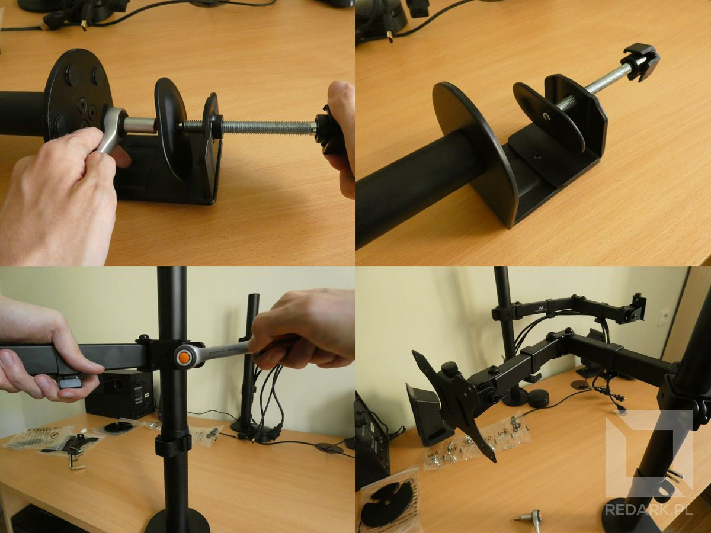
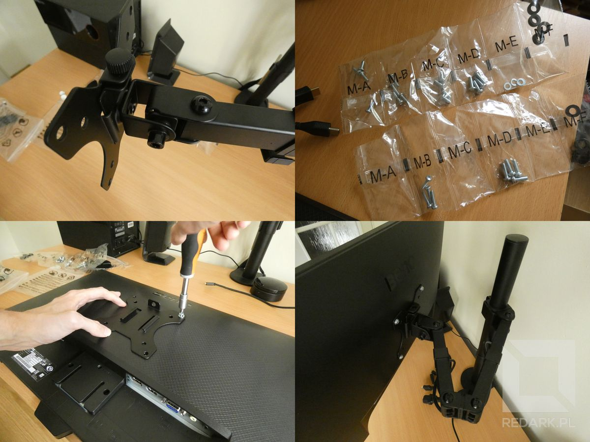
</Gallery>

Na koniec pozostało przytwierdzić "motylek" VESA do plecków monitora. Do tego celu producent uchwytu dołącza szereg przeróżnych wariantów śrub i podkładek. Ja z racji posiadania drugiego egzemplarza tych woreczków z pierwszego uchwytu doskonale wiedziałem, których elementów mam użyć. Zalecam uważne dobranie ich średnicy oraz przede wszystkim długości. Zbyt długie śruby nie docisną dobrze "motylka" i co gorsza mogą nawet przebić matrycę monitora z drugiej strony! Dokręcajcie je więc z wyczuciem! Po powieszeniu monitora należy jeszcze przytwierdzić "motylek" do reszty uchwytu za pomocą małej śrubki dołączonej do zestawu. Zabezpiecza ona monitor przed wysunięciem się z sanek, gdy przechylimy ekran o więcej niż 90 stopni.

### Demontaż starego okablowania oraz nowa instalacja zasilająca

Listwa zasilająca znajdująca się po lewej stronie mojego biurka pękała już w szwach. Nie pozwalała mi podłączyć ani jednego dodatkowego urządzenia. Z tego powodu potrzebowałem zamontować w biurku drugą, dodatkową listwę, która przejęła by chociaż zasilanie obydwu monitorów. Nowa listwa została umiejscowiona pod blatem w okolicach przepustu pod kable klawiatury oraz myszy. Na początku zdemontowałem znajdującą się za biurkiem pajęczynę starych przewodów, a następnie odmierzyłem miejsce pod montaż nowej listwy, tak, aby nie kolidowała ona ze znajdującymi się po drugiej stronie uchwytami pod kable. Z racji tego, że listwa nie posiadała uchwytów pod przykręcenie śrubami, wybór padł na montaż parą niezawodnych trytek. Wymierzyłem odpowiedni ich rozstaw, a następnie wywierciłem wiertarką 4 otwory. Uchwyty spasowały idealnie, a znajdujące się pod biurkiem oświetlenie LED rewelacyjnie oświetliło mi stanowisko pracy :D

<Gallery>
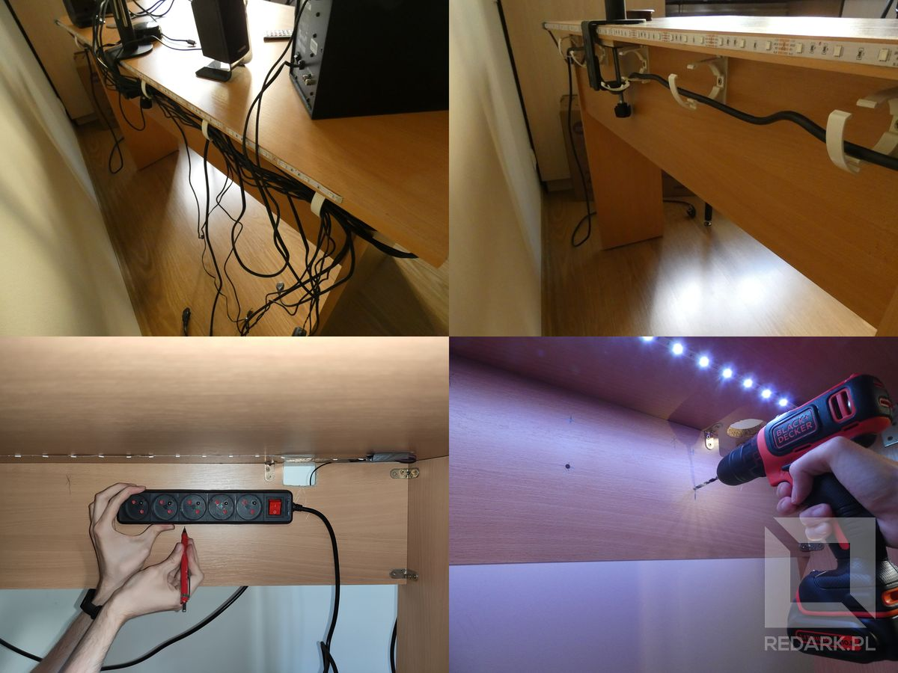
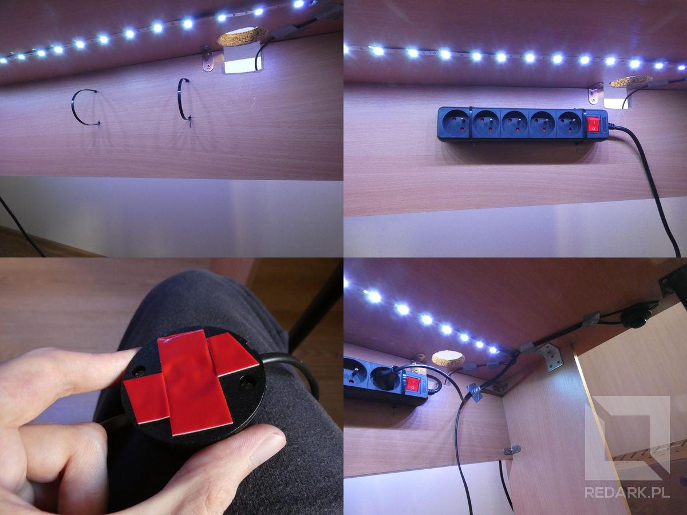
</Gallery>

Następnym krokiem było zamontowanie przygotowanego wcześniej przedłużacza dla głośników. Przełącznik został przymocowany do spodu biurka za pomocą silnej piankowej taśmy w taki sposób, abym mógł go bezproblemowo używać, łapiąc ręką prawą krawędź biurka. Wtyczkę przedłużacza podłączyłem do nowej listwy, a gniazdko przełożyłem przez otwór do tylnego korytka na przewody, gdzie zostanie do niego podłączona wtyczka idąca od głośników. Przewód przymocowałem na srebrną taśmę - rozwiązanie może niezbyt eleganckie, ale działa i jest widoczne jedynie po schyleniu się.

<AdSense/>

### Montaż uchwytów oraz okablowania

Po wykonaniu wszystkich przeróbek pozostało już tylko założenie obydwu uchwytów na monitory oraz ułożenie na nowo wszystkich przewodów. Wszystkie urządzenia poza jednostką centralną zostały podłączone do listwy pod blatem, natomiast listwa boczna posiada teraz jedynie dwie wtyczki - jedną od jednostki, a drugą od dodatkowej listwy. Dzięki temu uzyskałem trzy wolne gniazda, a nawet możliwość wyłączenia całego osprzętu oprócz komputera na przykład w celu pobrania jakiejś dużej ilości danych przez całą noc. Zdjęcia z montażu stanowiska oraz efekt końcowy możecie zobaczyć poniżej:

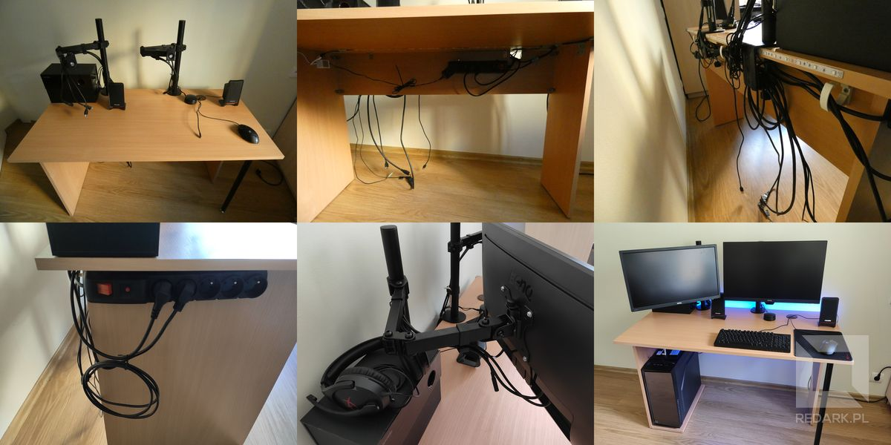

## Podsumowanie

I to by było na tyle. Wszystkie zaplanowane przeze mnie modyfikacje zostały zastosowane. Uzyskałem wolne gniazdka w listwie, dodatkową przestrzeń na biurku, mogę sterować głośnikami za pomocą wygodnego przycisku pod blatem oraz oczywiście mogę teraz używać dwóch monitorów o tej samej rozdzielczości, co z pewnością bardzo ułatwi mi pracę. Mam nadzieję, że zainteresowałem choć część z Was moimi przeróbkami. Sekcja komentarzy jest do Waszej dyspozycji. Na dzisiaj to tyle i do usłyszenia :)
