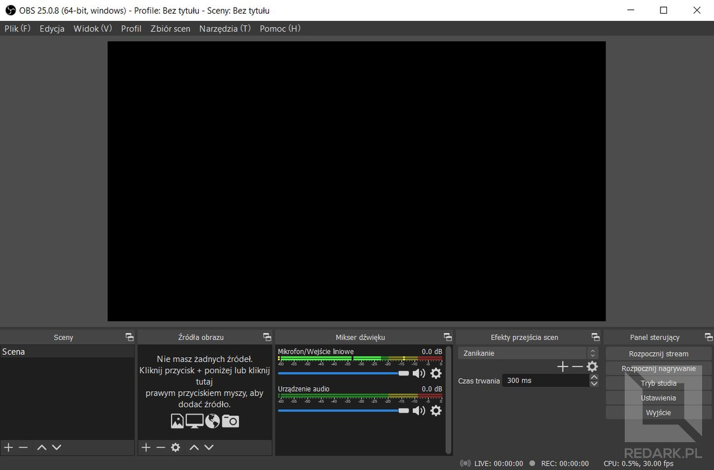
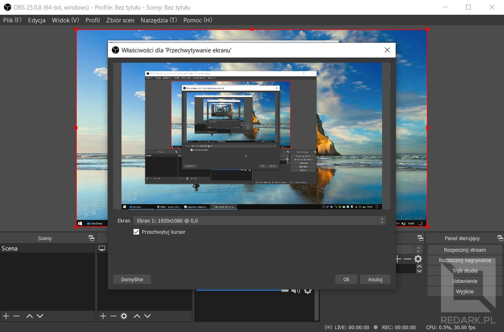
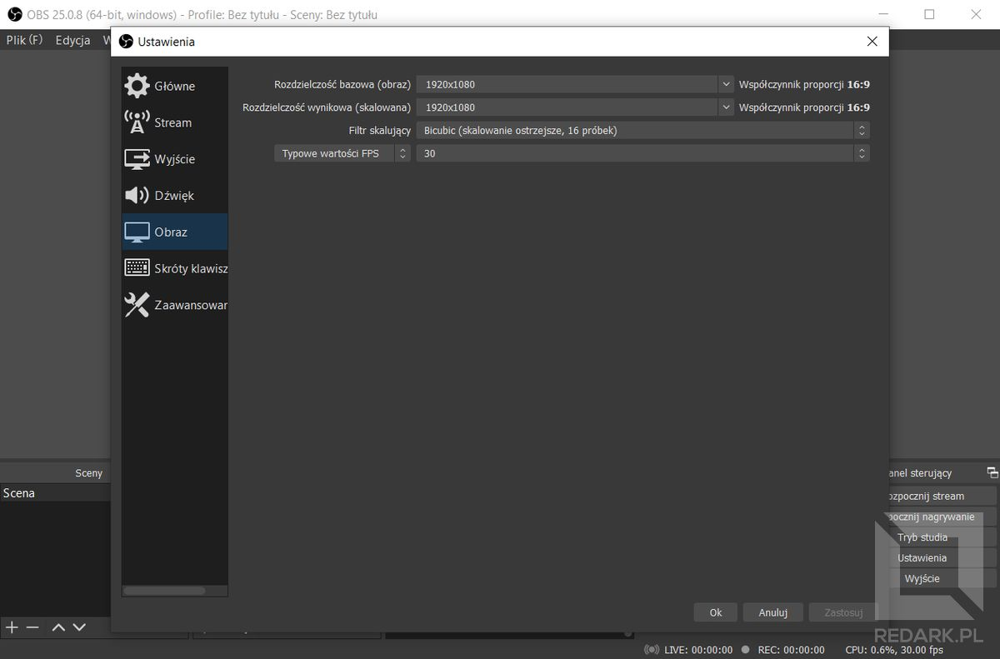
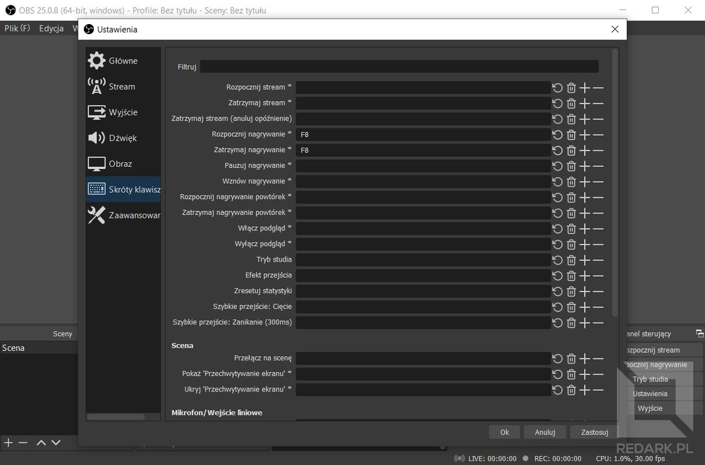
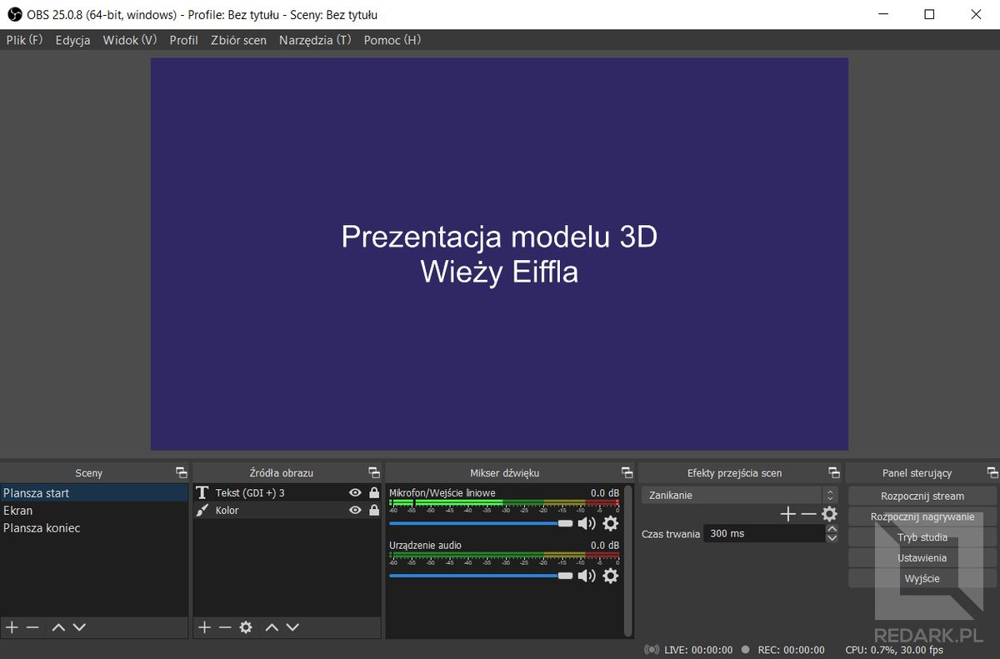
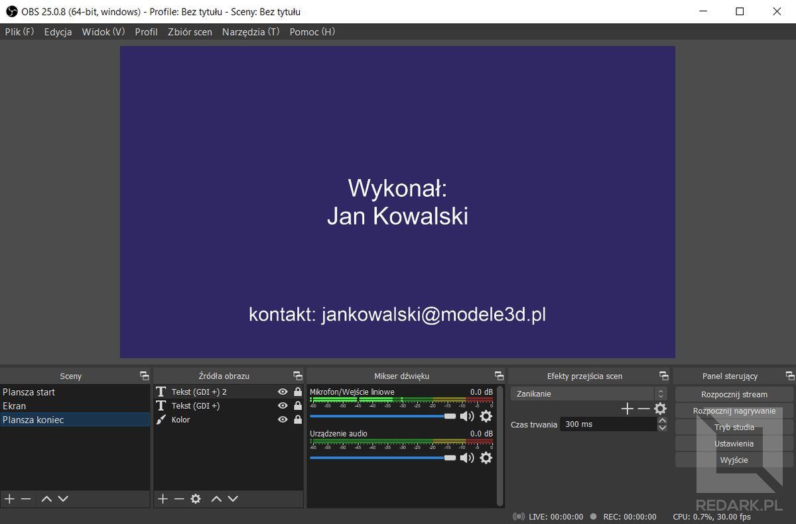
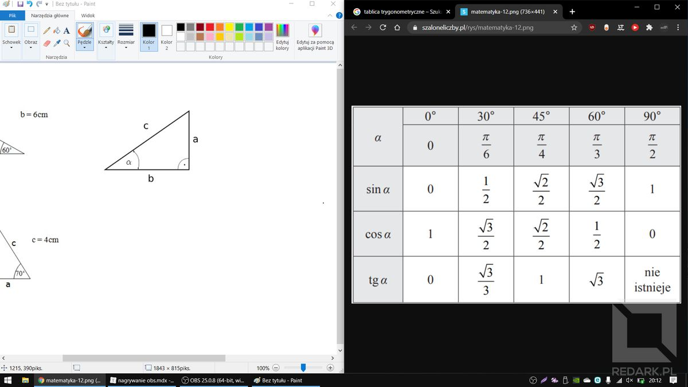
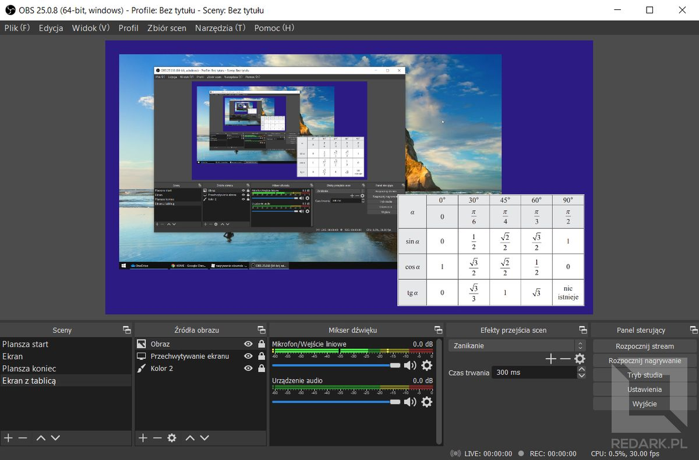
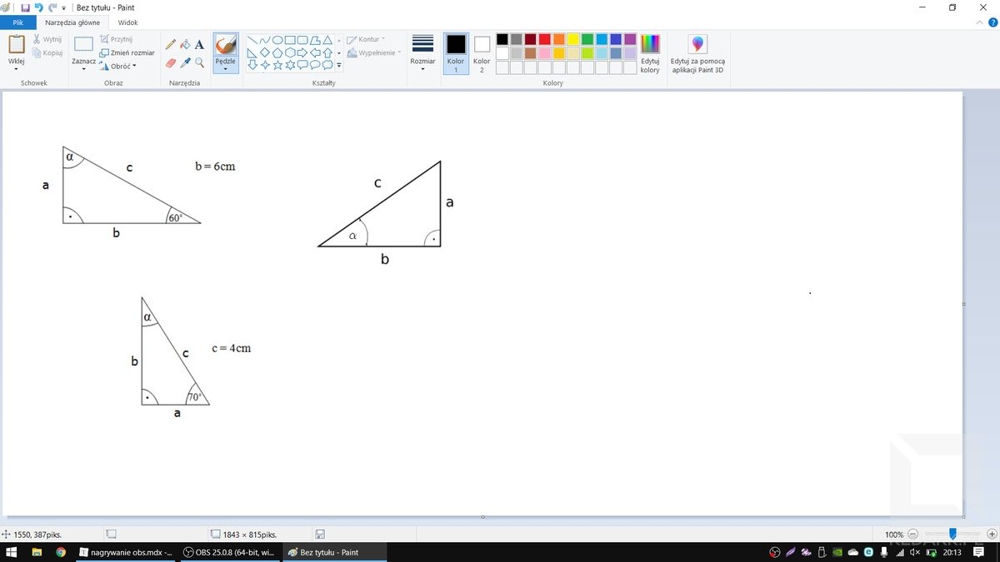
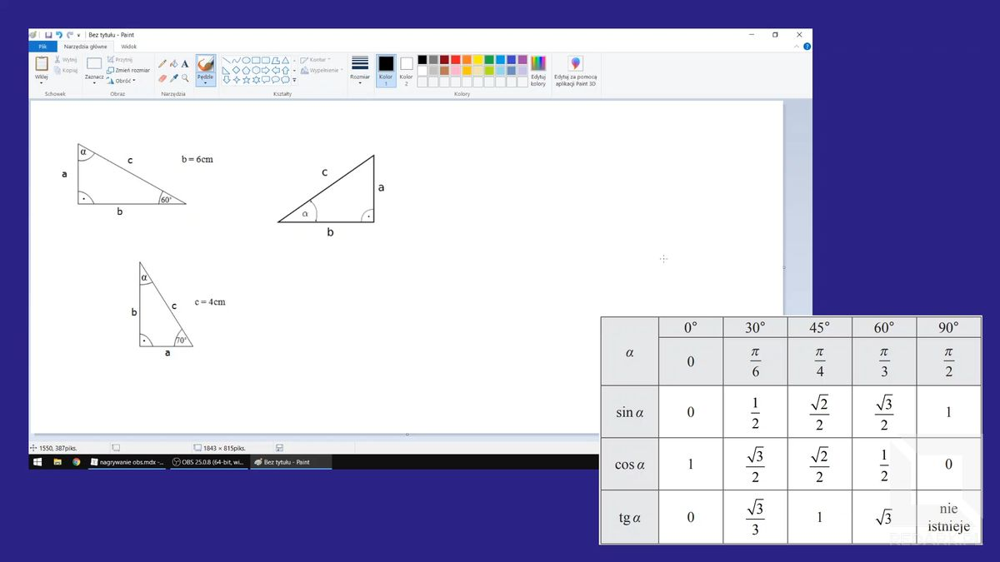

Pewnie wielu z Was stanęło kiedyś przed potrzebą nagrania czegoś na ekranie swojego komputera, np. nagrania jakiegoś poradnika albo obrazowego wytłumaczenia komuś wykonania pewnej rzeczy. Zapewne problem zawsze był ten sam - czym dobrze, łatwo i za darmo nagrać ekran? Internet jest przepełniony różnej maści aplikacjami do tego przeznaczonymi, ale większość z nich ma wspólną wadę - są płatne. Bardzo często nie widać nawet tego na pierwszy rzut oka. Wiele takich produktów udaje jedynie swoją bezpłatność i dopiero po zainstalowaniu informuje użytkownika, że może on na razie wykonać film o maksymalnej długości 60 sekund, w obniżonej rozdzielczości lub obarczony ogromnym znakiem wodnym. Nie jest to miła niespodzianka. Na szczęście istnieje jedna rewelacyjna darmowa aplikacja umożliwiająca nagrywanie pulpitu, o której istnieniu wielu użytkowników nie wie. Jest nią OBS.

Streamerzy grający na żywo w gry na takich platformach jak YouTube lub Twitch do przesyłania swojego obrazu najczęściej wykorzystują właśnie aplikację OBS, czyli Open Broadcaster Software. Tłumacząc nazwę na język polski, jest to otwartoźródłowe (czyli zarazem w pełni darmowe) oprogramowanie do transmisji strumieniowej obrazu. Dodatkową funkcją OBS-a jest właśnie możliwość nagrywania obrazu, czyli dokładnie to, czego potrzebujemy. W dodatku z racji tego, że jest to narzędzie do prowadzenia transmisji internetowej, czyli de facto telewizji XXI wieku, jego możliwości znacząco wykraczają poza zwykłą nagrywarkę pulpitu. Pozwólcie, że Wam to zaprezentuję.

## Instalacja

Zacznijmy najpierw od zainstalowania OBS-a na komputerze. Wchodzimy na stronę [OBS Project](https://obsproject.com/) i pobieramy wersję przeznaczoną dla naszego systemu operacyjnego. Aplikacja dostępna jest na systemy Windows, macOS oraz Linux, więc nie ma opcji, abyś nie mógł uruchomić jej u siebie.

## Ekran główny

Po uruchomieniu aplikacji na jej ekranie głównym znajdziemy kilka ważnych elementów. Pierwszym z nich, zajmującym największą powierzchnię okna jest podgląd naszego obrazu. Na razie jest on całkowicie czarny, ale tym zajmiemy się później. W panelach poniżej znajdziemy bloki oznaczone jako: sceny, źródła obrazu, mikser dźwięku, efekty przejścia scen oraz panel sterujący. Omówię pokrótce każdy z nich.

### Scena

Scena w OBS-ie jest to pojedynczy wariant układu okien i obiektów, jakie znajdują się na nagrywanym lub transmitowanym obrazie. Scena może zawierać tylko obraz Waszego pulpitu, pulpit wraz z obrazem kamerki internetowej (tak jak to robią streamerzy) lub ekran z napisem "zaraz wracam". Operator może je oczywiście swobodnie przełączać, wybierając je z omawianej listy scen lub za pomocą skrótów klawiszowych. Dodawanie i usuwanie scen odbywa się za pomocą przycisków + i - znajdujących się pod listą.

### Źródła obrazu

Źródła obrazu są to wszystkie obiekty znajdujące się na ekranie aktualnie wybranej sceny. Dla każdej z nich są one definiowane indywidualnie, dlatego po zmianie sceny, lista źródeł zostanie zmieniona. Za niedługo, dzięki tej liście, sprawimy właśnie, że na czarnym podglądzie pojawi się zawartość Twojego ekranu komputera.

### Mikser dźwięku

Za pomocą tego panelu możesz kontrolować dźwięk, jaki jest rejestrowany przez OBS-a. Ja, na pokazanym wyżej zrzucie ekranu, posiadam dwa wejścia dźwięku. Pierwszy reprezentuje wbudowany w mojego laptopa mikrofon. Drugi natomiast to źródło dźwięku pochodzącego z systemu operacyjnego oraz uruchomionych na nim aplikacji. Zwróć proszę uwagę, że pierwszy kolorowy pasek częściowo się rozświetlił. Jest to aktualny poziom dźwięku (hałasu) rejestrowany przez to źródło.

### Efekty przejścia scen

W tej sekcji możesz zmienić typ oraz długość efektu aktywowanego podczas zmiany scen. Domyślnie wybrane jest "zanikanie" przez 300 milisekund, co powoduje, że podczas zmiany sceny, obraz będzie się zmieniał bardzo płynnie (bez wyraźnego cięcia).

### Panel sterujący

Znajdziesz tutaj przyciski aktywujące najważniejsze funkcje OBS-a. Przejdziesz tutaj do ustawień aplikacji, rozpoczniesz transmisję oraz uruchomisz nagrywanie ekranu.

<InfoBlock>W systemie Windows często można się spotkać z problemem przycinania nagrywanego obrazu. Ten problem najczęściej da się wyeliminować, uruchamiając aplikację z uprawnieniami administratora z poziomu menu kontekstowego (prawy przycisk myszy na ikonce).</InfoBlock>

<AdSense/>

## Przygotowywanie OBS-a do nagrywania

Teraz skonfigurujmy OBS-a tak, aby umożliwiał standardowe nagrywanie całego pulpitu. W tym celu kliknij + znajdujący się pod listą "źródeł obrazu", a następnie z rozwijanej listy wybierz pozycję "przechwytywanie ekranu". W nowym oknie możesz nadać nazwę temu obiektowi, ale na razie pozostaw ją domyślną i kliknij przycisk "ok". Następne okno umożliwia wybranie ekranu, który ma zostać przechwycony. Służy do tego rozwijana lista znajdująca się pod jego podglądem. Opcja poniżej listy umożliwia zadecydowanie, czy na rejestrowanym obrazie ma być widoczny kursor. Po zatwierdzeniu okna i powrocie do aplikacji OBS na podglądzie obrazu widoczny będzie już Twój ekran!

Za pomocą czerwonych ramek na podglądzie obrazu możesz zmienić rozmiar i położenie nagrywanego obrazu. Jeśli przechwytywanie ekranu ma być jedynym elementem na scenie i ma on zajmować zawsze cały ekran, warto zabezpieczyć go przed przypadkową edycją. W tym celu w sekcji "źródła obrazu" znajdź dodane przed chwilą źródło i kliknij znajdującą się obok niego kłódkę. W ten sposób tryb edycji tego elementu został zablokowany, a z ekranu podglądu zniknęła jego czerwona ramka.

<InfoBlock>Znajdująca się obok kłódki ikonka oka służy do czasowego ukrywania i pokazywania elementu na ekranie sceny. Dzięki temu możesz chwilowo schować jakiś element sceny bez potrzeby jego usuwania lub definiowania drugiej identycznej sceny bez tego jednego elementu.</InfoBlock>

Drugą rzeczą do skonfigurowania jest dźwięk. Jeśli tak jak ja, pracujesz na laptopie i posiadasz wbudowany mikrofon, to domyślnie nagrywa on dźwięk. Jeśli nie chcesz, aby tak było, kliknij na ikonę głośniczka przy odpowiednim suwaku w sekcji "mikser dźwięku". Jeśli to zrobisz, kolorowy pasek przestanie reagować na hałas znajdujący się w Twoim pokoju. Jeśli nie chcesz, aby nagrywany był również dźwięk pochodzący z Twojego komputera, wycisz analogicznie drugie źródło. Jeśli chcesz jednak używać wejścia audio, możesz wyregulować jego poziom głośności za pomocą suwaka znajdującego się obok przycisku wyciszania.

Na koniec zajrzymy do ustawień. Tam interesować nas będą trzy karty: wyjście, obraz skróty klawiszowe.

### Ustawienia wyjścia

Ustawienia w tej karcie są podzielone na dwie kategorie. Pierwsza z nich dotyczy streamingu, czyli transmisji na żywo i ona nas na razie nie interesuje. Druga natomiast jest już poświęcona nagrywaniu obrazu. Znajdziemy tutaj opcję zmiany katalogu, gdzie będą zapisywane pliki wideo oraz opcje zmiany jakości i formatu wygenerowanych plików. Ważnym elementem jest też enkoder. Określa on podzespół odpowiedzialny za przetwarzanie nagrywanego przez nas obrazu. Wyrażenie "Programowy (x264)" lub "Sprzętowy QSV" oznacza, że dane będzie przetwarzał procesor. Enkoder "Sprzętowy (NVENC)" odnosi się do technologii kart graficznych Nvidia. W przypadku normalnego korzystania z komputera (niezbyt dużego obciążenia) ustawienie to nie ma aż takiego wielkiego znaczenia.

### Ustawienia obrazu

W ustawieniach obrazu możemy ustalić rozdzielczość, z jaką będziemy streamować oraz nagrywać obraz. Ostatnia opcja pozwoli także określić ilość FPS, czyli liczbę zarejestrowanych klatek na sekundę. Do standardowych nagrań wystarczy 30 FPS, natomiast rozdzielczość najlepiej ustawić na natywną, czyli taką, jaką posiada nasz ekran w komputerze np. Full HD (1920x1080). Jeśli nie zależy Ci na idealnej ostrości obrazu, a chcesz, aby plik wideo był mniejszy, możesz obniżyć rozdzielczość obrazu do np. 720p.

### Ustawienia skrótów klawiszowych

Ostatnia omawiana karta umożliwia zdefiniowanie wszelkich potrzebnych skrótów klawiszowych. Można tutaj przypisać sobie skrót do rozpoczynania i zatrzymywania nagrywania, wyciszania dźwięku, zmiany sceny i wielu innych funkcji. Wybór zależy od potrzeb użytkownika.

## Dodatkowe możliwości OBS-a

W tej chwili posiadasz już pełną wiedzę pozwalającą na nagrywanie ekranu dzięki aplikacji OBS. Może wymagała ona trochę konfiguracji i nie jest tak przejrzysta, jak dedykowane do tej oprogramowanie, ale OBS dlatego tak wygląda i tak się go obsługuje, ponieważ umie on znacznie więcej niż tylko nagrywać pulpit. Pokażę Ci parę przykładów, jak OBS może oszczędzić Ci wiele zachodu przy pracy.

### Edytor wideo w prezencie

Załóżmy scenariusz, w którym nagrać prezentację modelu 3D opatrzoną Twoim komentarzem głosowym. W przypadku obsługi mikrofonu część aplikacji do nagrywania ekranu jeszcze sobie poradzi, ale załóżmy, że potrzebujesz jeszcze rozpocząć nagranie ekranem z tytułem projektu, a na końcu mają się znaleźć Twoje dane kontaktowe. Typowa plansza powitalna i końcowa. W przypadku prezentacji w PowerPoint'cie jeszcze dasz radę zrobić coś takiego samemu, dodając dodatkowe slajdy, ale co w przypadku nagrywania innej aplikacji? Typowe nagrywarki są już tutaj bezsilne.

Takie plansze można oczywiście dorobić w edytorze wideo, ale aplikacje tego typu są bardzo trudne w obsłudze i przede wszystkim wymagają drogich licencji. Naprawdę ciężko jest znaleźć przyzwoitą darmową aplikację do obróbki wideo, a kupowanie płatnej aplikacji i uczenie się kilka dni jej obsługi, aby móc edytować paruminutowy filmik to chyba lekka przesada co nie? OBS dzięki wspomnianemu już mechanizmowi scen umożliwia wykonanie prostego montażu wideo na żywo i bezpośrednio w aplikacji. Przecież omawiane teraz plansze mogę być stworzone jako osobne sceny, które zostaną przełączone ręcznie w oknie OBS-a lub dyskretnie za pomocą skrótu klawiszowego. Zobaczcie przykład poniżej:

<Gallery>

</Gallery>

<ImageDescription>Po lewej plansza startowa, a po prawej końcowa</ImageDescription>

### Dodatkowe źródła obrazu

OBS to nie tylko przechwytywanie ekranu komputera. Oprogramowanie umożliwia wykorzystanie dowolnego urządzenia lub pliku jako źródła obrazu. Na liście, na której znajdowała się pozycja "przechwytywanie ekranu", znajdziesz takie elementy jak:

* kolory i tekst - przydatne do wykonania tła sceny i napisów informacyjnych,
* obraz/pokaz slajdów - wyświetlanie obrazków pochodzących z dysku komputera,
* przechwytywanie ekranu/gry - rejestrowanie całego ekranu komputera,
* przechwytywanie okna - nagrywanie jednego konkretnego okna (nawet po jego przemieszczeniu),
* przeglądarka - możliwość otworzenia konkretnej strony www w wirtualnej przeglądarce internetowej,
* urządzenie do przechwytywania wideo - kamerki internetowe, aparaty cyfrowe, lustrzanki, zewnętrzne przechwytywarki obrazu (video grabber'y).

<AdSense/>

W scenie OBS-a można zawrzeć dowolną treść. Możesz dodać swoją kamerkę, dokonać korekty jej obrazu, dodać kluczenie koloru (jeśli posiadasz greenscreen) i wiele wiele więcej. Chcesz wytłumaczyć zadanie matematyczne i w pewnym momencie potrzebne jest skorzystanie z tablic trygonometrycznych. Możesz oczywiście otworzyć je w przeglądarce internetowej, ale nie będzie to szybkie a tym bardziej przyjemne do oglądania. A gdyby tak nałożyć wcześniej przygotowaną tablicę na przechwycony obraz ekranu i pokazywać ją lub ukrywać wciskając jeden przycisk na klawiaturze? W OBS-ie to nie jest żaden problem. Sprawdźcie efekt sami:

<ImageDescription>Taki obraz ani nie jest przyjemny dla nagrywającego, ani dla oglądającego</ImageDescription>

<ImageDescription>Przykładowa konfiguracja OBS-a. Rezultat widoczny poniżej</ImageDescription>

<Gallery>

</Gallery>

<ImageDescription>Po lewej to, co widzi nagrywający (Ty), a po prawej kadr wycięty z nagrania</ImageDescription>

To tylko jedna z wielu funkcji tej aplikacji. W przypadku tradycyjnego nagrywania ekranu taki proces wymagałby wynajęcia montażysty wideo, który dodałby pożądane efekty i posklejał materiał razem. Ode mnie to wszystko. Mam nadzieję, że pokazałem Ci potęgę, jaka drzemie w tej aplikacji. Jeśli masz problem z jej konfiguracją, zapraszam do sekcji komentarzy pod tym artykułem i do usłyszenia.
