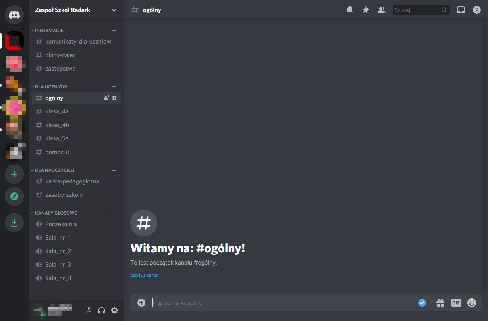
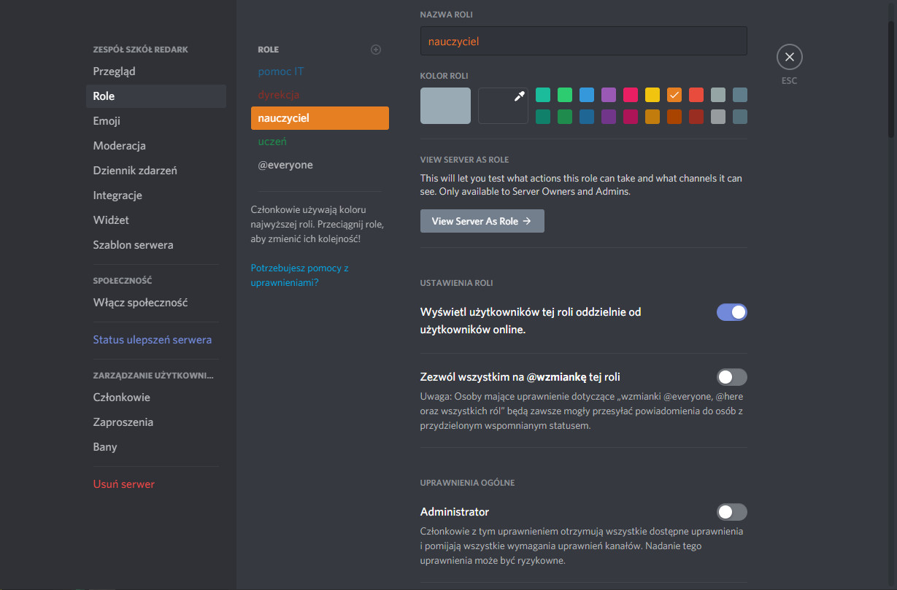
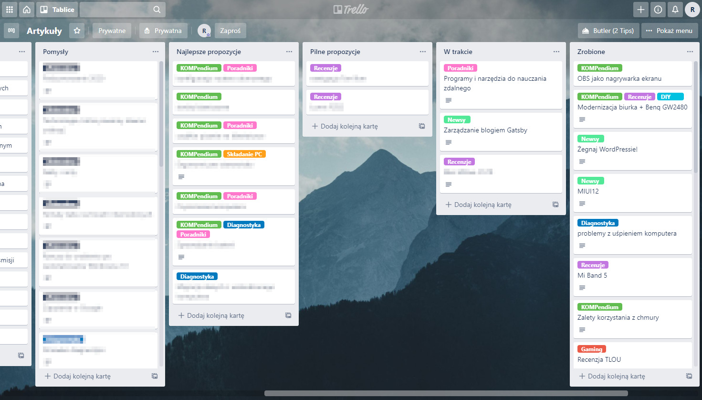
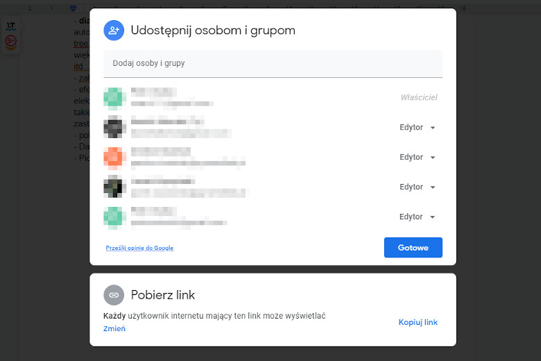
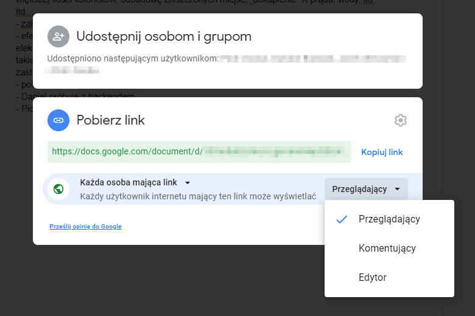
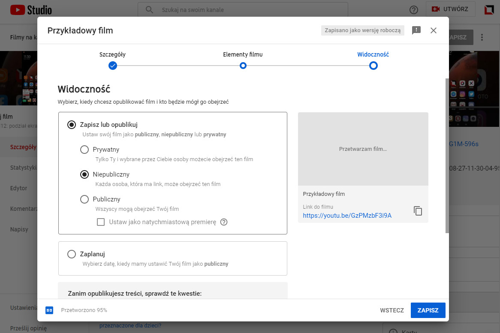
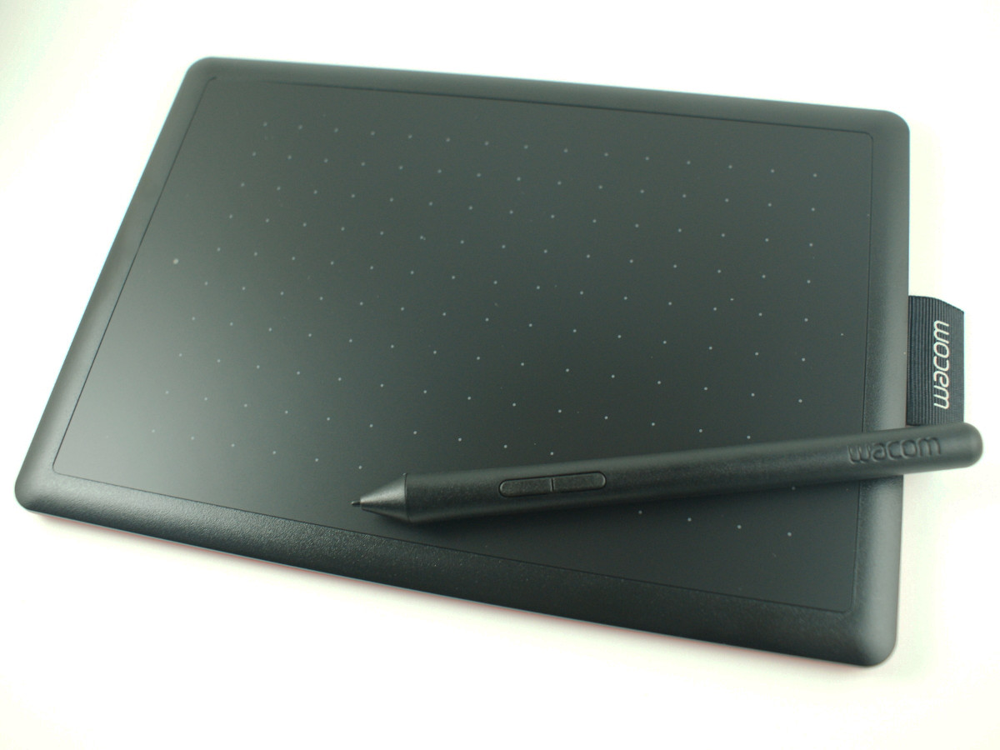
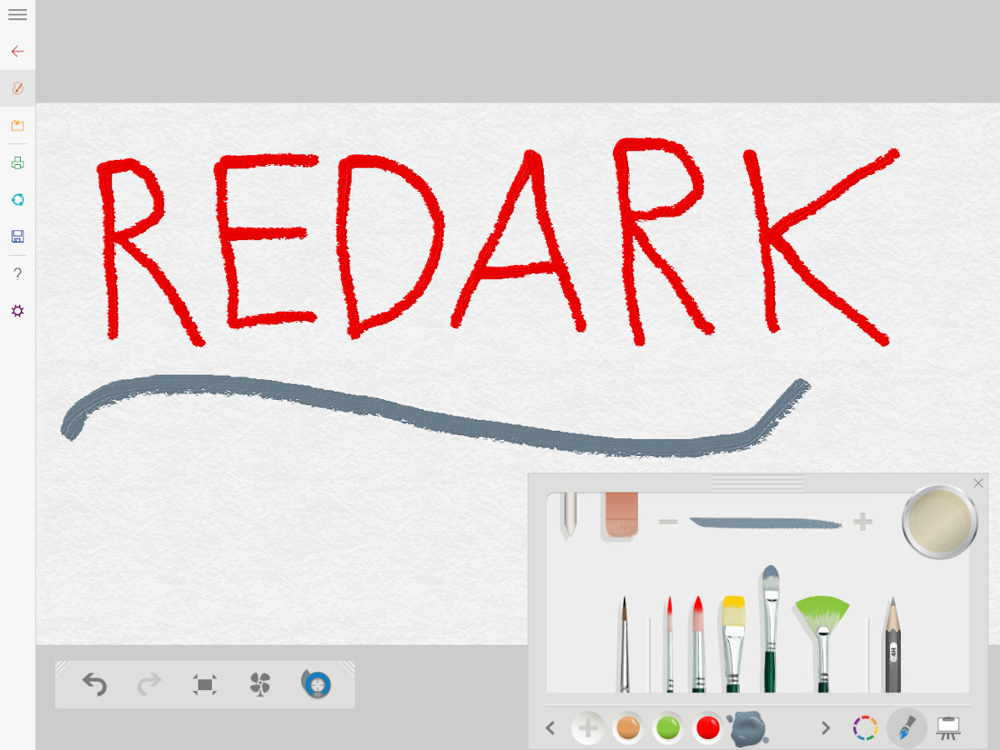

Ostatni wzrost zachorowań na koronawirusa prawdopodobnie poskutkuje ponowną potrzebą przeprowadzania zajęć lekcyjnych na odległość. Niestety polski system edukacji nie działa zbyt prężnie i w kwestiach cyfryzacji, pomimo wprowadzenia e-dzienników, jest on cały czas daleko w tyle, a nauczanie zdalne wymaga sięgnięcia po znacznie nowsze rozwiązania technologiczne. Branża IT od lat korzysta z pracy w trybie zdalnym i wypracowała sobie do tego milion przeróżnych narzędzi i aplikacji. Codzienne spotkania organizacyjne, konferencje, rozmowy z klientami, a nawet szkolenia - to wszystko w IT może odbywać się  zdalnie. Z racji posiadania pewnego doświadczenia w tych tematach oraz chęci pomocy polskim nauczycielom i uczniom, postanowiłem przygotować zestawienie 5 porad dotyczących pracy i nauki zdalnej, które mam nadzieję, że choć trochę nakreślą pedagogom kierunek działania oraz ogrom możliwości, jakie daje prowadzenie lekcji przez Internet.

## 1. Sprawna komunikacja z uczniami oraz organizacja zajęć to podstawa

Aby móc przeprowadzić lekcje online, należy najpierw skomunikować się z wszystkimi uczniami w klasie, dlatego wyjaśnijmy sobie najpierw kilka kwestii. **Wysyłanie zwykłych e-maili się tutaj nie sprawdzi.** Ta technologia jest już przestarzała, była łatana oraz udziwniana miliony razy i nie jest używana przez młodsze pokolenia. Istnieją miliony znacznie lepszych i wydajniejszych form komunikacji.

Narzędziem, które chyba najczęściej pojawia się w polskich szkołach, jest płatna usługa Microsoft Teams. Szkoły traktują ją jako gotowe narzędzie do zdalnego nauczania, ale nie w takim celu zostało stworzone. Teams jest to usługa przeznaczona przede wszystkim do komunikacji wewnątrzfirmowej. Oczywiście integracje z pakietem biurowym, kalendarzem, pocztą i milionem innych usług sprawiają, że Teams z powodzeniem może być używany także w szkole, ale nie jest to oprogramowanie dedykowane do prowadzenia lekcji. Z tego też powodu nie należy zakładać, że za jego pomocą można zrobić wszystko. Rozumiem, że dana placówka może wymagać wykorzystywania Teams i nie trzeba z tym walczyć. Chcę jedynie zaznaczyć, że Teams nie jest uniwersalnym i gotowym narzędziem do lekcji online i wypadałoby (a nawet należałoby) razem z nim wykorzystać jeszcze inne, zewnętrzne narzędzia. Dlatego w tym artykule będę podawał nazwy wielu innych usług i narzędzi, aby pokazać, jak dużo możliwości personalizacji daje nauczanie zdalne. Chciałbym, aby Teams nie był traktowany jako jedyna i słuszna opcja do zdalnego nauczania, nawet jeśli narzucana przez szkołę.

### Komunikacja na własną rękę

Załóżmy, że szkoła nie określiła się w temacie innej formy komunikacji z uczniami i nakazała używać zwykłych maili i załączników. Mam nadzieję, że nigdzie nie dojdzie do takiej sytuacji. Niemniej jednak, co wówczas zrobić? Przede wszystkim nie używać maili. Jednym z mniej popularnych narzędzi do organizowania komunikacji z uczniami jest **Google Classroom**. W przeciwieństwie do Teams jest to darmowa usługa od Google stworzona do prowadzenia e-lekcji. Posiada gotowe narzędzia do tworzenia wirtualnych klas oraz zajęć, a także możliwość zdefiniowania skali ocen oraz zadań domowych. Może to być idealne narzędzie dla placówek, które nie potrafią zdecydować się na nic innego. Szkoła musi jedynie utworzyć dla siebie specjalne konto G Suite, które będzie służyło do zarządzania wszystkimi danymi wirtualnej placówki.

Bardzo ciekawą alternatywą dla Google Classroom i innych narzędzi do edukacji zdalnej jest chociażby jeden z najpopularniejszych obecnie komunikatorów internetowych o nazwie **Discord**. Początkowo został on stworzony na potrzeby graczy, ale jego ogromne możliwości sprawiły, że zaczęły go wykorzystywać też inne grupy komunikujące się przez Internet. Discord umożliwia prowadzenie klasycznych rozmów tekstowych, rozmów głosowych oraz wideokonferencji z kamerkami lub udostępnianiem ekranu i cały czas mówię tutaj o planie darmowym. Z racji tego, że jest to narzędzie, a raczej komunikator uniwersalny, to trzeba spędzić parę minut, aby skonfigurować go do swoich potrzeb. Jednak odpowiednio skonfigurowany serwer Discorda to złoto, jeśli chodzi o zbieranie wokół siebie społeczności czy chociażby uczniów. Aby to zaprezentować, w ciągu 10 minut stworzyłem to:

<Gallery>

</Gallery>

Jest to utworzony na szybko serwer Discorda, który z powodzeniem może zostać wdrożony w szkole. Utworzyłem tutaj kanały informacyjne, na których pisać mogą tylko nauczyciele i dyrekcja. Kanały do udostępniania planów zajęć i zastępstw. W kategorii "dla uczniów" znajdują się kanały tekstowe dla poszczególnych klas. Uczniowie mogą się tam organizować, zadawać pytania itd. Dodałem tam też kanał ogólny oraz kanał pomocy technicznej dla szkolnego informatyka. W kategorii "dla nauczycieli" znajdują się prywatne (niewidoczne dla uczniów) kanały do komunikacji między nauczycielami oraz dyrekcją. Na samym dole listy widnieją kanały głosowe, które reprezentują wirtualne sale, w których mogą odbywać się zajęcia na żywo. Gdy zbliża się ustalona godzina zajęć, uczeń chodzi na Discorda i dołącza do wyznaczonego wcześniej pokoju rozmów (wirtualnej sali) i może już uczestniczyć w zajęciach. Drugi screen powyżej prezentuje konfigurację ról. Każde konto dodane do serwera szkoły może mieć przypisaną rolę, a tym samym uprawnienia do wykonywania określonych akcji. Uczeń będzie widział tylko to, co powinien i móc pisać tylko tam, gdzie powinien, nauczyciel zobaczy prywatne kanały grona pedagogicznego i panel do zarządzania uczniami, a dyrekcja oraz pomoc IT pełny dostęp do konfiguracji serwera. To, co pokazałem, wyklikałem na poczekaniu w 10 minut! To jest właśnie potęga Discorda i jego uniwersalności!

### Inne narzędzia

Oprócz Teams, Classroom czy Discorda chciałbym wspomnieć jeszcze o trzech narzędziach. **Zoom** jest to jedno z najpopularniejszych narzędzi do prowadzenia wideokonferencji. Darmowy plan umożliwia rozmowy z (AŻ) 100 osobami jednocześnie przez maksymalnie 40 minut. Wiele firm, placówek oraz instytucji posiada u nich wykupione licencje, które znoszą te limity. Dlatego nie zdziwcie się, jeśli usłyszycie kiedyś zwrot "spotkamy się na Zoom'ie".

Darmowym odpowiednikiem Zoom'a jest **Google Meet**. Jest on znacznie prostszy w obsłudze i z racji, że jego twórcą jest sam Google, to posiada on idealną integrację z całym ekosystemem giganta. Opcja zarejestrowania spotkania w Google Meet często pojawia się podczas dodawania nowego wydarzenia w kalendarzu Google lub pisania wiadomości e-mail w Gmailu.

<AdSense/>

Trzecim, bardzo bliskim mi narzędziem jest **Trello**. Jest to częściowo płatne narzędzie, ale darmowy plan też udostępnia bardzo wiele opcji. Służy ono do organizowania list zadań w stylu [Kanban](https://pl.wikipedia.org/wiki/Kanban). Jest to taka wirtualna tablica korkowa podzielona na kolumny określające postęp prac lub kategorie zadań. Może to być podział na "pomysły", "w realizacji", "w korekcie", "odrzucone", "oczekujące na publikację" i "opublikowane". Zadania mają postać bloczków (karteczek samoprzylepnych), które mogą być swobodnie przenoszone pomiędzy tymi kategoriami. Używam tego narzędzia do zbierania i usystematyzowania pomysłów na artykuły dla Redarka. W przypadku firm, w których z tablic korzysta jednocześnie dziesiątki osób, to jest niebywałe ułatwienie! Uniwersalność Trello sprawia, że znajdzie on zastosowanie w wielu przypadkach. Zarówno w życiu prywatnym, jak i prowadzeniu firmy czy organizowaniu edukacji zdalnej. Poniżej prezentuję zrzut ekranu mojego Trello, ale z wymazanymi ważnymi danymi :)

## 2. Zaangażuj ucznia poprzez quizy online

Wspaniałym urozmaiceniem zarówno tradycyjnych, jak i zdalnych lekcji są quizy, czyli szybkie konkursy wiedzy. Z wykorzystaniem komputerów, ich przeprowadzanie jest banalnie proste! Zrobienie quizu podczas zdalnego nauczania przynosi trzy zasadnicze korzyści. Po pierwsze, nie ma nic gorszego niż nudne zajęcia z suchym czytaniem tekstu ze slajdów. Takie zajęcia nudzą i sprawiają, że uczeń od razu zapomina to, co na nich usłyszał. **Udział w quizie sprawia, że uczeń angażuje się w prowadzone zajęcia, co mocno przekłada się na wyniki kształcenia**. W dodatku ogranicza to możliwość wystąpienia sytuacji, w której uczeń na drugim monitorze gra w gry komputerowe, bo transmisja nie wymaga od niego żadnej uwagi i interakcji.

Po drugie, quizy online są idealne do przeprowadzania sprawdzianów, kartkówek, czy innych testów wiedzy. Ciężko było upilnować uczniów w szkole, żeby nie ściągali w czasie sprawdzianu? Bardzo. Jak w takim razie teraz zweryfikować czy nie ściągają, skoro siedzą w zaciszu swojego domu? Odpowiedź jest prosta: limit czasu. Quizy online mają tę zaletę, że **pozwalają na losowanie kolejności pytań oraz odpowiedzi, a także na ustalanie limitu czasu na poszczególne pytania lub cały test**. Sprawia to, że uczeń praktycznie nie ma możliwości skorzystania z Internetu lub porozumiewania się z drugim uczniem, ponieważ  nieustannie goni go czas. Może skorzystać tylko i wyłącznie z własnej wiedzy.

Po trzecie, skoro testy są przeprowadzane przez komputery, to **ich wyniki są widoczne od razu**. Koniec ze żmudnym sprawdzaniem wymiętych kartek wyrwanych z zeszytu. Za pomocą jednego przycisku można wygenerować pełne statystyki udzielanych przez uczniów odpowiedzi, ustalić punktację, wyznaczyć oceny oraz wykryć pytania, które sprawiały problemy.

<YouTube id='7XzfWHdDS9Q' title='Kahoot'></YouTube>

Skoro znamy już zalety quizów online, to czas porozmawiać o tym, jak je przeprowadzać. Najpopularniejszych narzędziem do ich przeprowadzania jest [Kahoot](https://kahoot.com/). Aplikacja posiada plany płatne oraz darmowe. Jeśli ograniczenia darmowej licencji uniemożliwiają przeprowadzenie quizu, warto rozważyć inne narzędzia, takie jak na przykład [w pełni darmowy Quizlet](https://quizlet.com/pl). Do wyboru, do koloru. Dyrekcja szkoły powinna być szczególnie zainteresowana zakupem zbiorowej licencji na takie narzędzia, ponieważ umożliwiają one łatwe udostępnienie dostępu całej kadrze pedagogicznej oraz szybkie i wygodne archiwizowanie wyników wszystkich przeprowadzonych quizów i sprawdzianów.

## 3. Korzystając z klasycznego Office'a tylko utrudniasz sobie życie

Nauczanie zdalne wymaga wcześniejszego przygotowania materiałów, które będą rozsyłane w trakcie zajęć do wszystkich uczniów. Prawdopodobnie najczęściej będą miały one formę dokumentów tekstowych oraz prezentacji. W Polsce utarło się przekonanie, że pakiet Microsoft Office to jedyne takie oprogramowanie dostępne na rynku. Bo kto niby nie zna Worda, PowerPointa czy Excela? W przypadku potrzeby łatwego udostępniania stworzonych dokumentów korzystanie z klasycznego pakietu Office to strzał w kolano.

<ImageDescription>Nad dokumentami Google może pracować wielu użytkowników jednocześnie</ImageDescription>

Do przygotowywania i udostępniania dokumentów uczniom najlepiej wykorzystać narzędzia działające w chmurze, takie jak chociażby w pełni darmowy pakiet biurowy od Google. Do działania wymaga on jedynie przeglądarki internetowej i konta Google, które z pewnością już posiadasz. Oprogramowanie to nie wymaga instalacji, uruchamia się na praktycznie każdym urządzeniu podłączonym do Internetu, a dzięki integracji z Gmail'em, Google Drive'm (dyskiem sieciowym w chmurze) oraz wieloma innymi usługami, umożliwia łatwe udostępnianie dokumentów dużej liczbie osób. Wystarczy kliknąć przycisk "udostępnij", wybrać uprawnienia i indywidualnie rozesłać do uczniów wygenerowany przez Google link lub skorzystać z automatycznego rozsyłania maili. Do wyboru są trzy typy uprawnień:

* **Przeglądający** - uczniowie mogą jedynie oglądać dokument, a zmiany wprowadzane przez nauczyciela są synchronizowane w czasie rzeczywistym,
* **Komentujący** - uczniowie oprócz przeglądania dokumentu mogą dodawać pytania (komentarze) do konkretnych fragmentów jego treści,
* **Edytor** - uczniowie otrzymują pełne prawa do edycji treści dokumentu i mogą go redagować razem z nauczycielem.

<Gallery>

</Gallery>

Alternatywą dla pakietu biurowego Google jest odpowiednik Microsoftu wraz z jego dyskiem chmurowym OneDrive, ale z doświadczenia wiem, że rozwiązanie Google jest bardziej intuicyjne oraz nie atakuje użytkownika reklamami płatnych wersji. Fajnym urozmaiceniem dostarczanych materiałów mogą być wszelakie diagramy oraz mapy myśli. Internet jest przepełniony narzędziami umożliwiającymi "wyklikanie" takich elementów. Ze swojej strony mogę polecić narzędzie do diagramów [draw.io](https://app.diagrams.net/) (ma bardzo fajną integrację z pakietem biurowym od Google i Microsoftu) oraz [Coggle](https://coggle.it/) do tworzenia map myśli (choć darmowy plan ma pewne ograniczenia). Osoby zainteresowane tematem tworzenia dokumentów w chmurze zapraszam do [innego artykułu mojego autorstwa](/zalety-korzystania-z-dysku-w-chmurze), w którym tłumaczę zalety korzystania z dysków sieciowych.

<WarningBlock>W przypadku udostępniania dokumentów i prezentacji w postaci plików, pamiętaj, aby udostępniać materiały w plikach z rozszerzeniem PDF. Materiały zapisane w ten sposób można otworzyć na większej liczbie urządzeń oraz nie mają one opcji modyfikacji swojej treści. Udostępniając edytowalne pliki docx lub pptx narażasz się na możliwość złośliwego zmodyfikowania treści dokumentu przez uczniów i rozsyłania ich na własną rękę! W przypadku wyżej opisanego udostępniania dokumentów w pakiecie biurowym od Google, tę sprawę załatwia się poprzez ustawienie uprawnienia "przeglądający" lub "komentujący", które blokuje możliwość zmiany treści materiału przez ucznia.</WarningBlock>

## 4. Przygotuj materiały z komentarzem głosowym

Wymogiem wielu dyrektorów szkół jest to, aby przeprowadzane zdalnie zajęcia były wykonywane z użyciem kamerek internetowych. Rozumiem, skąd wziął się taki pomysł. Kontakt wzrokowy jest dla ludzi ważny oraz pozwala zauważyć, czy uczeń faktycznie znajduje się przed komputerem. Rzeczywistość jest jednak znacznie inna. Obraz kamerki często niepotrzebnie komplikuje sprawę, a i tak można sfałszować go na miliony sposobów, używając chociażby legendarnej już sztuczki z zapętleniem transmisji znanej z filmu "Speed". Zorganizowanie transmisji na kilkadziesiąt kamerek nie jest łatwe - zarówno dla prowadzącego, jak i dla sprzętu oraz łącza internetowego. Moim zdaniem dobrze przygotowany wcześniej materiał wideo lub transmisja pulpitu na żywo, ale TYLKO I WYŁĄCZNIE z komentarzem głosowym, może być tak samo wartościowa, co wideokonferencja. Już tłumaczę, o co chodzi.

<AdSense/>

### Jak wyglądają kursy online

Coraz popularniejszą formą szkolenia pracowników w firmach są kursy online. Mają one formę podzielonych na części filmików instruktażowych z komentarzem głosowym prowadzącego. Czasami zdarzają się materiały z obrazem kamery, ale są one w zdecydowanej mniejszości. Kluczem sukcesu takich materiałów jest to, że zostały one skrzętnie zredagowane i nagrane wcześniej, przez co mają o wiele lepszą jakość i wartość merytoryczną, niż konferencje, lekcje czy prezentacje prowadzone na żywo. Nie mówię tutaj, że lekcje na żywo są złe. Są po prostu obarczone pewnym ryzykiem losowości i nie należy się bać zastępować ich (chociaż częściowo) gotowymi materiałami wideo.

### Przygotowywanie własnych materiałów

No dobrze, tylko jak zatem spróbować tworzyć takie materiały? Do tego najlepiej posłuży **aplikacja OBS**. Jest ona używana przez wszelkich streamerów, którzy przechodzą gry komputerowe (i nie tylko) na takich platformach jak Twitch czy YouTube. Jedną z funkcji OBS-a jest właśnie nagrywanie materiału wideo wraz z komentarzem głosowym oraz obrazem kamerki. Dużo na ten temat powiedziałem [w osobnym artykule poświęconym aplikacji OBS](/najlepszy-darmowy-program-do-nagrywania-ekranu). Serdecznie do niego zapraszam.

### Udostępnianie nagrań uczniom

Z racji tego, że pliki wideo są sporych rozmiarów, nie można ich udostępnić uczniom w postaci załącznika do e-maila, a nawet na komunikatorze tekstowym takim jak Messenger, Teams, Classroom czy Discord. Do tego zadania najlepiej sprawdzi się serwis YouTube, który z pewnością zna każdy z nas. Umożliwia on bezpłatne udostępnianie materiałów wideo bez konieczności ich upubliczniania w Internecie. Gdy posiadasz już gotowe nagrania, przejdź do serwisu [YouTube](https://www.youtube.com/), zaloguj się na swoje konto Google, a następnie przejdź do [studia twórców](https://studio.youtube.com/). Za pomocą znajdującego się tam panelu utworzysz swój własny kanał w serwisie, a następnie załadujesz na niego swoje materiały.

Ważne jest, aby podczas publikacji materiałów zaznaczyć opcję widoczności na "niepubliczny". Sprawi to, że dany materiał wideo nie będzie widoczny w Internecie, a dostęp do niego będzie możliwy tylko i wyłącznie za pośrednictwem bezpośredniego linku tak, jak to miało miejsce w przypadku omawianych wcześniej dokumentów i prezentacji. Opcja "publiczny" udostępni materiał wszystkim użytkownikom serwisu, a opcja "prywatny" sprawi, że materiał będzie widoczny tylko i wyłącznie na twórcy.

## 5. Przygotuj się technicznie

Potrzeba przeprowadzenia lekcji online niestety wymaga pewnego przygotowania swojego komputera i stanowiska w domu, ponieważ nie da się tego robić na byle czym. Do wyścigu nie startuje się przecież posiadając Fiata Cinquecento. Aby móc dobrze i komfortowo przeprowadzać lekcje zdalnie należy zaopatrzyć się w potrzebny sprzęt komputerowy. Postaram się mniej więcej nakreślić potrzeby, z jakimi może zetknąć się nauczyciel.

### Mikrofon oraz nagłośnienie

Do przeprowadzenia rozmowy przez Internet potrzebny będzie mikrofon oraz głośniki lub słuchawki. W przypadku wideokonferencji i korzystania z kamerki internetowej sprawa mikrofonu jest już zazwyczaj rozwiązana. Zarówno zewnętrzne kamerki na USB, jak i te wbudowane w laptopy posiadają już mikrofony, które zapewniają podstawową jakość audio. Nic specjalnego, ale wystarczy.

Najlepszym jednak rozwiązaniem do przeprowadzania rozmów głosowych czy wideokonferencji pozostają nadal headsety, czyli słuchawki wyposażone w mikrofon. Dzięki nim możemy odizolować się od reszty otoczenia, a mikrofon znajduje się bliżej naszych ust. Dodatkowo korzystanie ze słuchawek niweluje możliwość wystąpienia tzw. sprzężenia zwrotnego. Z pewnością słyszeliście kiedyś jego efekt w postaci przeraźliwego pisku wydobywającego się z głośników. Do tego zjawiska dochodzi, gdy mikrofon zaczyna "słyszeć" sam siebie przez głośniki. Dochodzi wtedy do zapętlenia sygnału i niekontrolowanego narastania dźwięku lub tworzenia się efektu echa. W przypadku słuchawek dźwięk trafia bezpośrednio do naszych uszu i mikrofon zbiera klarownie naszą mowę. Na Redarku istnieją dedykowane artykuły poświęcone doborze odpowiednich [głośników](/glosniki-komputerowe) oraz [słuchawek z mikrofonem](/sluchawki).

<InfoBlock>Często nie trzeba nawet specjalnie kupować headsetu. Słuchawki na gniazdo mini jack 3.5 mm niegdyś ochoczo dołączane do wielu telefonów komórkowych i smartfonów to w rzeczywistości headsety, które posiadają wbudowany w połowie kabla mikrofon. Jakość rejestrowanego przez nie dźwięku może być przeróżna, ale warto spróbować.</InfoBlock>

### Dodatkowy monitor

[Drugim niezbędnym elementem, w jaki trzeba wyposażyć stanowisko komputerowe jest dodatkowy monitor](/modernizacja-stanowiska-benq-gw2480). Każdy streamer lub inna osoba zajmująca się tworzeniem wideo ma na swoim biurku dwa lub trzy monitory. Jest to szczególnie ważne, jeśli lekcje online mają polegać na tym, że oprócz wideo rozmowy mamy prowadzić równolegle chociażby pokaz prezentacji. W takim przypadku jeden ekran służy nam jako reżyserka, a drugi jako obraz przygotowany do transmisji. Na pierwszym mamy otwarty program do komunikacji z uczniami (Teams, Zoom, Classroom, Discord itp.) i prywatną przeglądarkę internetową. Na drugim PowerPoint, Word, Paint, przeglądarkę internetową lub co tam jest nam potrzebne do lekcji. Dzięki temu odseparowujemy obraz przeznaczony dla nas od obrazu przeznaczonego dla uczniów. W przypadku posiadania jednego monitora nie dość, że prowadzenie transmisji będzie niezwykle uciążliwe i męczące, to jeszcze udostępniany obraz z wielokrotnie zmieniającymi się oknami może okazać się testem na wywołanie padaczki. **Drugi monitor to podstawa**.

Skąd zatem wziąć dodatkowy monitor? Jeśli placówka szkoły została zamknięta, to z pewnością w salach informatycznych zalega kilkadziesiąt nieużywanych monitorów. Nic nie szkodzi wypożyczyć jeden do domu. Jeśli jednak szkoła nie jest w stanie go zapewnić, to można go zakupić samemu. Opcje są dwie. Albo zakupić nowy egzemplarz ze sklepu (na przykład z [x-kom](https://www.x-kom.pl/)), albo skorzystać ze sklepów poleasingowych. Monitory poleasingowe to prawdopodobnie modele, które przepracowały ileś lat w jakiś biurze i zostały zastąpione przez nowsze modele. Można tam znaleźć naprawdę fajnie wyposażone egzemplarze za niewielkie pieniądze. Jeśli jednak budżet domowy pozwala na zakup nowego monitora, to ja ten sposób rekomenduje. Monitor to nie jest urządzenie, które przyda się tylko do prowadzenia zdalnie lekcji, a uniwersalne urządzenie, które posłuży w domu z pewnością jeszcze wiele wiele lat. Monitory poleasingowe często posiadają już przestarzałe parametry. Niską rozdzielczość, słabą matrycę (a tym samym kolory, kontrast i kąty widzenia) oraz brak funkcji ochrony wzroku (redukcja niebieskiego światła, brak migotania) itd. Po więcej informacji na temat tych parametrów zapraszam do [mojego osobnego artykułu poświęconemu wyborze monitorów](/monitory-czesc-1).

<AdSense/>

### Tablet graficzny

Tęsknisz za tradycyjną tablicą kredową, na której można było na bieżąco notować to, o czym się mówi? Prowadząc e-lekcje nie trzeba z tego rezygnować! Idealnym narzędziem do prowadzenia lekcji chociażby matematyki będzie tablet graficzny, którego ceny zaczynają się już od około 150 złotych! Urządzenie to ma postać niewielkich rozmiarów tabletu bez wyświetlacza z dołączonym rysikiem przypominającym klasyczny długopis. Dzięki niemu możemy w naturalny dla nas sposób poruszać kursorem komputera i tym samym tworzyć na nim odręczne notatki. Zapiski możemy tworzyć w dedykowanym do tego oprogramowaniu lub wykorzystać do tego nieśmiertelnego Painta wbudowanego w system Windows.

<InfoBlock>Wiele aplikacji posiada opcję rozpoznawania pisma odręcznego, więc dzięki tabletowi graficznemu możliwe jest przekształcenie naszych bazgrołów w normalny dokument tekstowy. Dodatkowo nawet podstawowe modele tabletów potrafią wykrywać siłę nacisku rysika na tablet. Umożliwia to szkicowanie oraz malowanie obrazów na komputerze tak, jakby były one robione tradycyjną metodą.</InfoBlock>

<Gallery>

</Gallery>

<ImageDescription>Tablet graficzny Wacom One oraz aplikacja Fresh Paint</ImageDescription>

### Stałe i stabilne łącze internetowe

W przypadku prowadzenia rozmów z wieloma użytkownikami przez Internet, nie odkryję Ameryki, mówiąc, że ważne jest posiadanie stałego (bez limitu danych), kablowego (nie przez Wi-Fi) i stabilnego (nie od firmy Januszex) łącza internetowego. Oczywiście wiem, że nie zawsze jest taka możliwość. Wiele miejsc nadal nie posiada dobrze rozwiniętej infrastruktury sieciowej. Mimo to, jeśli jest taka możliwość, warto sprawdzić, czy nie możemy czegoś w tej kwestii poprawić. Jedną z takich podstawowych zasad poprawy działania naszego łącza jest wyeliminowanie łączności bezprzewodowej. Jest ona obarczona ograniczeniami prędkości oraz zakłóceniami pochodzącymi od innych urządzeń elektrycznych i nie tylko. Lodówka, kuchenka mikrofalowa, telewizor, czajnik, a nawet zwykła ściana działowa osłabia sygnał Wi-Fi i zwiększa prawdopodobieństwo wystąpienia problemów z Internetem. Mógłbym się rozpisywać o tym godzinami, pasmo przenoszenia (2.4 kontra 5 GHz), technologia MU-MIMO, funkcja QoS, ale nie o tym jest ten artykuł. Chętnych powiększenia swojej wiedzy na temat wyboru routerów, działania sieci Wi-Fi czy wyboru dostawcy Internetu, zapraszam do artykułów podanych poniżej:

* [Jak wybrać router domowy?](/jak-wybrac-router-domowy) - opis parametrów najważniejszego urządzenia w domu - routera sieciowego oraz wyjaśnienie kwestii związanych z działaniem bezprzewodowych sieci Wi-Fi,
* [Jak dobrze wybrać dostawcę Internetu?](/jak-dobrze-wybrac-dostawce-internetu) - jak wybrać i później nie żałować, czyli wybór dostawcy stałego łącza internetowego do domu,
* [Jak dobrze wybrać Internet mobilny?](/jak-dobrze-wybrac-internet-mobilny) - gdy nie ma stałego łącza, pozostaje ratować się Internetem mobilnym - fakty i mity działania Internetu w sieciach komórkowych.

## Podsumowanie

Mam nadzieję, że choć trochę pokazałem jaki ogrom możliwości dają lekcje prowadzone przez Internet. Naprawdę nie należy się ich bać. Odpowiednie dobranie technologii pozwala na polepszenie efektów kształcenia oraz zautomatyzowanie większości wykonywanych procesów. Obecnie świat IT oferuje gotowe rozwiązania (bardzo często darmowe) na praktycznie każdy możliwy scenariusz potrzeb. Wystarczy jedynie je znaleźć i wdrożyć do swojego życia. W razie pytań lub wątpliwości serdecznie zapraszam do sekcji komentarzy pod tym artykułem. Jeśli temat będzie się cieszył dużą popularnością, nie wykluczam możliwości stworzenia kolejnych, bardziej szczegółowych poradników.
