Minął już jakiś czas od oficjalnego uruchomienia [nowej wersji serwisu Redark działającej przy użyciu technologii Gatsby'ego](/zegnaj-wordpressie). Sytuacja z prowadzeniem bloga już się wyklarowała, więc to dobry moment, aby podzielić się z Wami tym, jak teraz wygląda proces publikowania artykułów. Dodatkowo przedstawię sporządzoną przeze mnie listę plusów i minusów pracy z Gatsby'm w porównaniu do mojego poprzedniego CMS'a, czyli WordPress'a.

## Jak przechowywane są dane witryny?

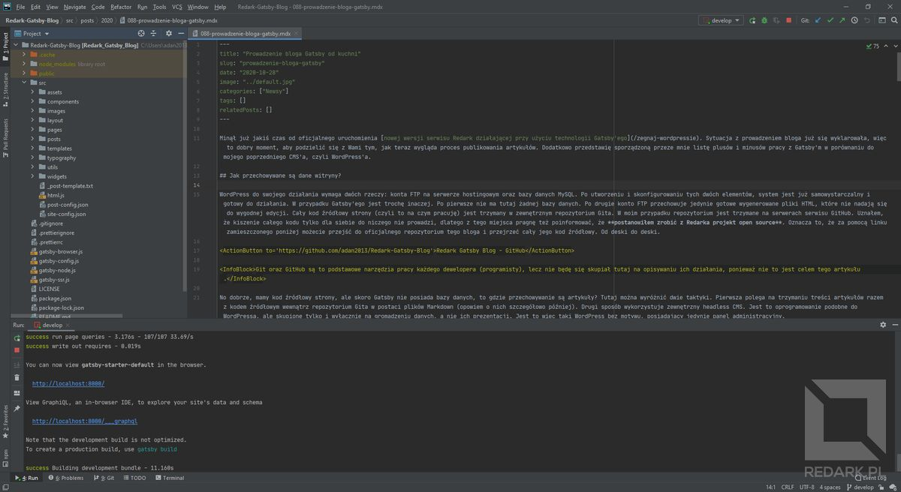

<ImageDescription>Środowisko programistyczne WebStorm - moje nowe centrum dowodzenia</ImageDescription>

WordPress do swojego działania wymaga dwóch rzeczy: konta FTP na serwerze hostingowym oraz bazy danych MySQL. Po utworzeniu i skonfigurowaniu tych dwóch elementów system jest już samowystarczalny i gotowy do działania. W przypadku Gatsby'ego jest trochę inaczej. Po pierwsze nie ma tutaj żadnej bazy danych. Po drugie konto FTP przechowuje jedynie gotowe wygenerowane pliki HTML, które nie nadają się do wygodnej edycji. Cały kod źródłowy strony (czyli to na czym pracuję) jest trzymany w zewnętrznym repozytorium Gita. W moim przypadku repozytorium jest trzymane na serwerach serwisu GitHub. Uznałem, że kiszenie całego kodu tylko dla siebie do niczego nie prowadzi, dlatego z tego miejsca pragnę też poinformować, że **postanowiłem zrobić z Redarka projekt open source**. Oznacza to, że za pomocą linku zamieszczonego poniżej możecie przejść do oficjalnego repozytorium tego bloga i przejrzeć cały jego kod źródłowy. Od deski do deski.

<ActionButton to='https://github.com/adan2013/Redark-Gatsby-Blog'>Redark Gatsby Blog - GitHub</ActionButton>

<InfoBlock>Git oraz GitHub są to podstawowe narzędzia pracy każdego dewelopera (programisty), lecz nie będę się skupiał tutaj na opisywaniu ich działania, ponieważ nie to jest celem tego artykułu.</InfoBlock>

No dobrze, mamy kod źródłowy strony, ale skoro Gatsby nie posiada bazy danych, to gdzie przechowywanie są artykuły? Tutaj można wyróżnić dwie taktyki. Pierwsza polega na trzymaniu treści artykułów razem z kodem źródłowym wewnątrz repozytorium Gita w postaci plików Markdown (opowiem o nich szczegółowo później). Drugi sposób wykorzystuje zewnętrzny headless CMS. Jest to oprogramowanie podobne do WordPressa, ale skupione tylko i wyłącznie na gromadzeniu danych, a nie ich prezentacji. Jest to więc taki WordPress bez motywu, posiadający jedynie panel administracyjny.

W Redarku zdecydowałem się na sposób nr 1. Po pierwsze chciałem maksymalnie uniezależnić się od zewnętrznych serwisów. Wszystko miało być w jednym miejscu, nad którym sprawowałbym kontrolę. Po drugie blog posiada już tak dużo grafik i innych multimediów, że nie zmieściłby się w darmowym planie żadnego z dostępnych serwisów headless CMS, a to mocno zwiększyłoby koszty utrzymania witryny.

<AdSense/>

## Pisanie artykułów

### Przechowywanie treści

W pierwszym akapicie wspominałem o plikach Markdown. W skrócie są to zwykłe pliki tekstowe, które za pomocą prostych symboli pozwalają sformatować (nie mylić z ostylować!) pisany tekst. **Zaleta pisania tekstów w takich plikach jest taka, że całkowicie oddzielamy treść od jej wyglądu na stronie**. Pisząc artykuł, nie określam wyglądu nagłówka lub obrazka. Stawiam jedynie symbol, który jedynie mówi "to jest nagłówek". To, jak on będzie wyglądać na stronie, zależy już tylko i wyłącznie od strony, która wyświetla ten tekst.

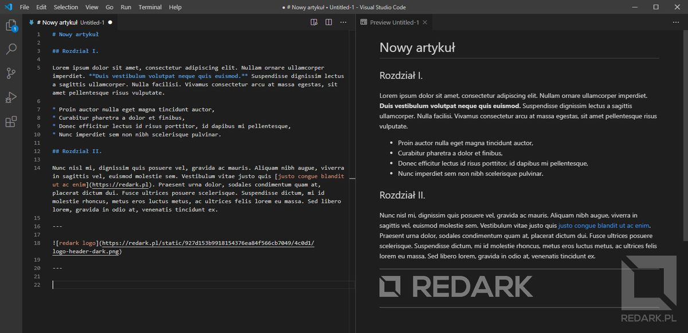

<ImageDescription>Przykładowy plik Markdown. Po lewej jego treść, a po prawej ostylowany podgląd</ImageDescription>

Wracając do Redarka. Tak jak już wspominałem, treść artykułów przechowuje bezpośrednio w repozytorium Gita. Znajdziesz je w katalogu *"src/posts"*. Dla przejrzystości podzieliłem artykuły na roczniki oraz zastosowałem numerację w nazwach ich plików. Mają one rozszerzenie ".mdx", ponieważ są to pliki Markdown wzbogacone o składnie JSX, a z kolei JSX jest to plik JavaScript wzbogacony o składnię HTML. Brzmi przerażająco? Nie ma się tu niczego bać. Oznacza to tyle, że wewnątrz plików MDX można stosować niestandardowe formatowanie tekstu lub reużywalne elementy jak np. przyciski. Zobaczcie przykład poniżej:

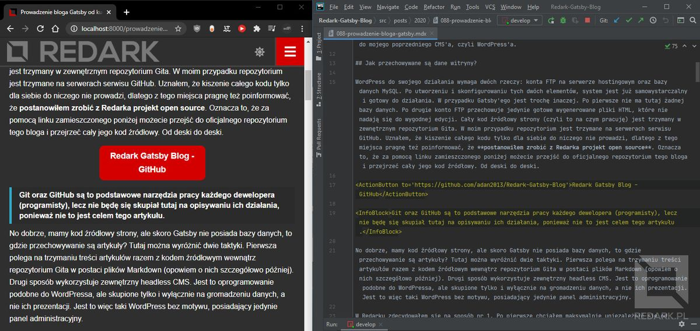

<ImageDescription>Przycisk akcji lub "InfoBlock" to tak naprawdę znacznik HTML</ImageDescription>

Chcąc dodać do artykułu, który czytasz, duży przycisk akcji, musiałem użyć znacznika *"ActionButton"*, a do zrobienia niebieskiego bloku informacyjnego znacznika *"InfoBlock"*. Jeśli jesteś ciekaw, jak działają te niestandardowe znaczniki, to ich kod znajdziesz w katalogu *"src/typography"*. W plikach artykułów można znaleźć jeszcze jeden nietypowy element, który znajduje się zawsze na ich początku.

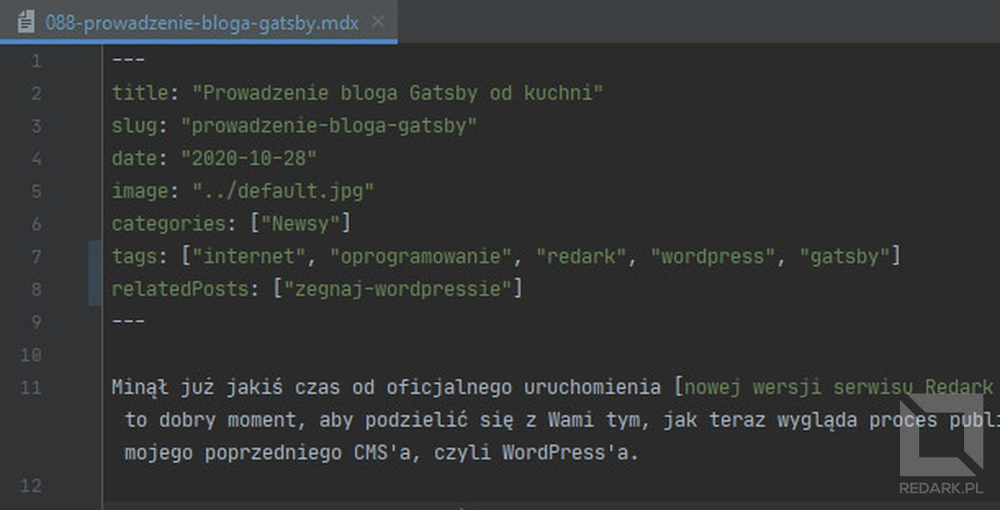

Są to tzw. meta-dane artykułu, czyli dodatkowe informacje potrzebne do prawidłowego działania witryny, ale nie wchodzące w treść postu. Są one rozpoczynane i kończone potrójnymi znakami myślnika (---). Moja strona wymaga następujących wartości:

* **title** - tytuł artykułu (nie używam nagłówka pierwszego stopnia w treści artykułu),
* **slug** - adres strony, pod którą będzie dostępny post,
* **date** - data zapisana w formacie YYYY-MM-DD oznaczająca datę publikacji,
* **image** - ścieżka względna do pliku obrazka wyróżniającego,
* **categories** - tablica z nazwami kategorii, do których należy post,
* **tags** - analogicznie do kategorii,
* **relatedPosts** - tablica z artykułami do sekcji "zobacz również" znajdującej się pod artykułem (pozostałe "polecane artykuły" są automatycznie wybierane i losowane przez kod strony).

Jak widzisz, jest to po prostu konfiguracja danego artykułu. W WordPressie można to by było wyklikać w odpowiednim panelu opcji, a tutaj muszę wkleić taki tekst z szablonu i ręcznie go uzupełnić.

### Redagowanie treści

Wiemy już, jak są przechowywane artykuły. Teraz opiszę trochę, jak przebiega proces ich redagowania. Pliki Markdown można tworzyć nawet za pomocą zwykłego windowsowego notatnika. Ja do tego celu używam aplikacji Typora lub czasami środowiska programistycznego (WebStorm lub Visual Studio Code). Zaletą Typory jest to, że formatuje ona lekko pisany przez nas tekst. Jest on nadal zapisany w Markdownie bez styli, ale nagłówki są wyróżnione lekko rozmiarem i krojem czcionki, a obrazki mają swój podgląd.

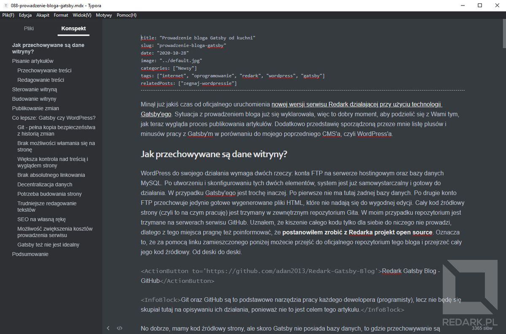

<ImageDescription>Edytor Typora</ImageDescription>

Dodatkowym atutem korzystania z takiej aplikacji jest sprawdzanie błędów pisowni. Typora obsługuje język polski i oferuje podstawową korektę tekstu. Tutaj niestety mam do czynienia z dużym minusem przejścia na Gatsby'ego. Pisząc artykuły w WordPressie w przeglądarce internetowej, nad moim tekstem pieczę sprawowała wtyczka "LanguageTool". Jest to genialne narzędzie wyłapujące nie tylko błędy ortograficzne, ale i stylistyczne. Żadna inna aplikacja, z której korzystałem (Microsoft Word jest w tym bardzo słaby), nie dorównała inteligencji tego rozszerzenia.

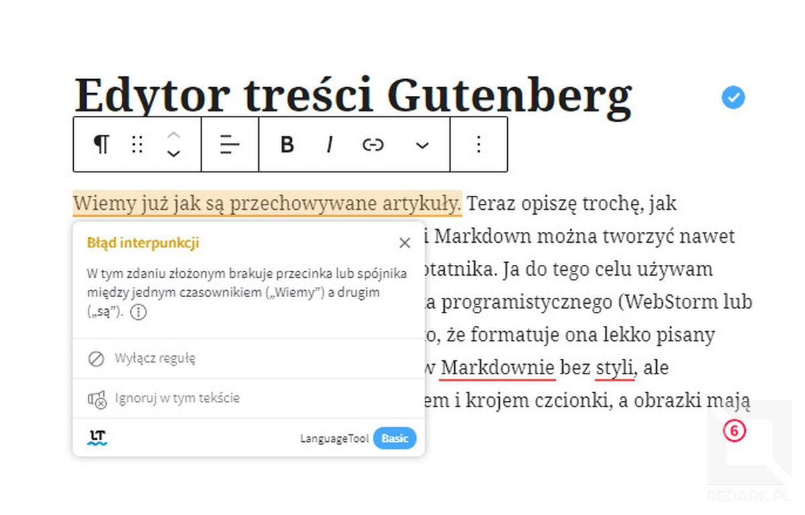

<ImageDescription>Ta wtyczka naprawdę ułatwia pisanie...</ImageDescription>

Tymczasowo problem ten rozwiązałem przeklejając artykuł kawałek po kawałki do edytora online dostępnego pod [tym adresem](https://languagetoolplus.com/). Jest to uciążliwe i nieintuicyjne, ale na razie musi takie być. Alternatywą są dostępne w przeglądarce edytory Markdowna, ale niestety albo nie działają one z LanguageTool, albo dziwacznie obsługują niestandardowe znaczniki, które opisywałem wcześniej. Pakiet biurowy Google posiada integrację z LanguageTool, ale ciężko jest w nim pisać bez użycia styli, w zwykłym pliku tekstowym. Najlepszym rozwiązaniem dla mnie, byłoby napisanie dedykowanego edytora online. Niestety wymagałoby to bardzo dużo pracy, a obecnie nie mam aż tyle wolnego czasu. Może kiedyś sprawię sobie taki, ale póki co korzystam z tego, co mam.

## Sterowanie witryną

Kolej na parę rzeczy na temat zarządzania witryną. Służą do tego dwa pliki znajdujące się w katalogu *"src"*. Są nimi *"site-config.json"* oraz *"post-config.json"*. Pierwszy z nich, jak sama nazwa wskazuje, dotyczy konfiguracji samej witryny. Znajdują się tam ustawienia takie jak:

* **disqusUrl** - adres witryny, który jest zarejestrowany w serwisie Disqus (obsługa komentarzy),
* **banner** - pozwala mi pokazywać, ukrywać i kontrolować banery promocyjne,
* **recommendation** - sterowanie dodatkowym panelem w bocznej kolumnie, który pozwala mi pokazywać rekomendowane artykuły,
* **mainMenu** - hierarchia i zawartość głównego menu strony,
* **social** - lista moich kont w social mediach, która jest wykorzystywana w panelu bocznym, stopce oraz na stronie "kontakt",
* **footer** - zawartość stopki strony.

Plik konfiguracyjny postów jest znacznie prostszy. Zawiera on jedynie listę kategorii oraz tagów, jakich używam w artykułach. Pozwala mi to na łatwe sprawdzenie nazw, jakich używałem już podczas pisania poprzednich artykułów. Dodatkowo skrypt budujący stronę (o nim za chwilę), dzięki tej liście, sprawdza, czy w którymś artykule nie użyłem kategorii lub taga, który nie jest tutaj zadeklarowany. Zapobiega to tworzeniu się literówek oraz bałaganu w hierarchii artykułów.

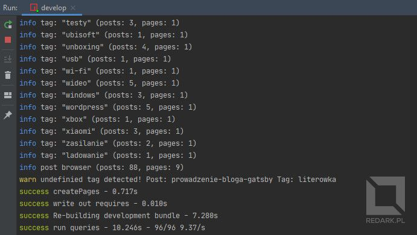

<ImageDescription>Ostrzeżenie o wykryciu niezadeklarowanego taga w artykule</ImageDescription>

<AdSense/>

## Budowanie witryny

Tak jak wspominałem [w pierwszym artykule](/zegnaj-wordpressie), strona napisana w Gatsby'm działa finalnie na gotowych, wyrenderowanych plikach HTML, co bardzo przyspiesza jej działanie oraz usprawnia indeksowanie w Google. Aby pliki źródłowe strony oraz pliki MDX z artykułami mogły zamienić się w pliki HTML, należy przeprowadzić budowanie wersji produkcyjnej. Do definiowania sposobu budowania strony w Gatsby'm służy specjalny plik o nazwie *"gatsby-node.js"*, który znajduje się w głównym katalogu repozytorium.

Aby Redark mógł wyglądać i działać tak, jak powinien, musiałem uzupełnić ten plik o potrzebne funkcjonalności. Nie będę tłumaczył go linijka po linijce, ale chcę pokazać, z jakimi zadaniami musi się on zmierzyć, przygotowując witrynę do działania. Ciekawych kodu zapraszam oczywiście do samodzielnego zapoznania się z zawartością pliku *"gatsby-node.js"*.

Pierwszym zadaniem tego skryptu jest niejako otworzenie każdego pliku z artykułem, odczytanie wartości "slug" dokumentu i na jej podstawie, utworzenie i zarejestrowanie docelowej podstrony. Dzięki temu, po wpisaniu końcówki adresu *["/zdalne-nauczanie"](/zdalne-nauczanie)* pojawia się artykuł o zdalnym nauczaniu.

Następną rzeczą, jaką musi wykonać skrypt, to przygotowanie list z artykułami dla każdej kategorii oraz taga wraz z paginacją wyników. Dzięki temu na jednej stronie widoczne jest jednocześnie tylko 10 artykułów, a następne znajdują się na podstronach nr 2, 3, 4 itd. Zauważcie, że tych stron w rzeczywistości nie ma w repozytorium - ja nigdzie ich nie redaguje. Ich istnienie zawdzięczam właśnie temu skryptowi, który oblicza ich zawartość dynamicznie, a następnie generuje dla nich podstrony.

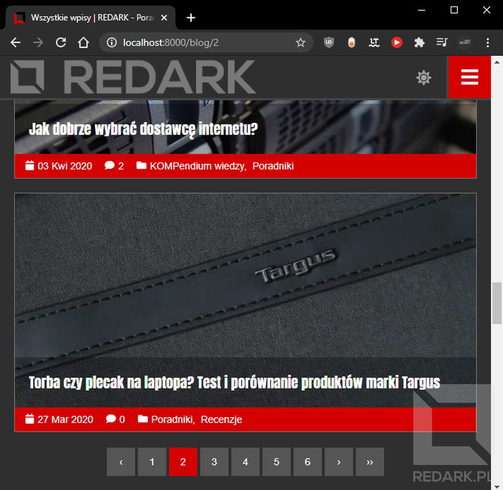

<ImageDescription>Implementacja paginacji listy artykułów leży po stronie programisty</ImageDescription>

Proces generowania podstron jest na bieżąco raportowany w oknie konsoli. Mogę tutaj podejrzeć nazwę kategorii lub taga, ilość znalezionych dla niego artykułów oraz ilość stron paginacji. W przypadku napotkania w artykule niezadeklarowanej w pliku *"post-config.json"* nazwy kategorii lub taga skrypt wyświetli mi tutaj ostrzeżenie informujące o możliwości wystąpienia literówki.

## Publikowanie zmian

Wiesz już, jak wygląda zarządzanie witryną oraz pisanie dla niej artykułów. Czas na ostatni krok, czyli publikacje tych zmian w Internecie. Po zakończeniu prac nad artykułem następuje commit wprowadzonych zmian, merge wszystkich wymaganych branchy do mastera oraz push zmian do serwisu GitHub. Oczywiście posługuję się tutaj terminologią charakterystyczną dla Gita i nie będę tłumaczył jej znaczenia, bo wówczas ten artykuł byłby pięć razy dłuższy. Po wysłaniu zmian na zdalne repozytorium istnieją trzy możliwości. Pierwsza polega na ręcznym uruchomieniu komendy budującej stronę oraz wysłaniu gotowych plików na serwer FTP. W przypadku Redarka taka możliwość nie wchodziła w rachubę, ponieważ pełny build witryny oraz przesłanie wszystkich plików na serwer zajmuje około 60-70 minut. Zdecydowanie zbyt długo.

Drugą metodą jest skorzystanie z narzędzi CI/CD. Skrót CD odnosi się do terminu "Continuous Deployment", który można przetłumaczyć jako "narzędzie do automatycznego publikowania nowych wersji oprogramowania". Oprogramowanie to, po wykryciu nowych zmian w repozytorium, automatycznie przeprowadza szereg skonfigurowanych wcześniej czynności prowadzących do wdrożenia nowej wersji strony na serwer docelowy. Ja w trakcie budowania witryny testowej korzystałem z polskiego serwisu [Buddy Works](https://buddy.works/). Jest on bardzo intuicyjny, ponieważ cały proces konfiguracji narzędzia można wyklikać przy pomocy myszki bez zagłębiania się w zaawansowane techniczne niuanse. Dodatkową zaletą Buddy'ego jest to, że optymalizuje on proces budowania strony i wysyła na serwer FTP tylko te pliki, które faktycznie uległy zmianie. To bardzo usprawnia pracę, przez co czas budowania Redarka spadł z 70 do 4 minut!

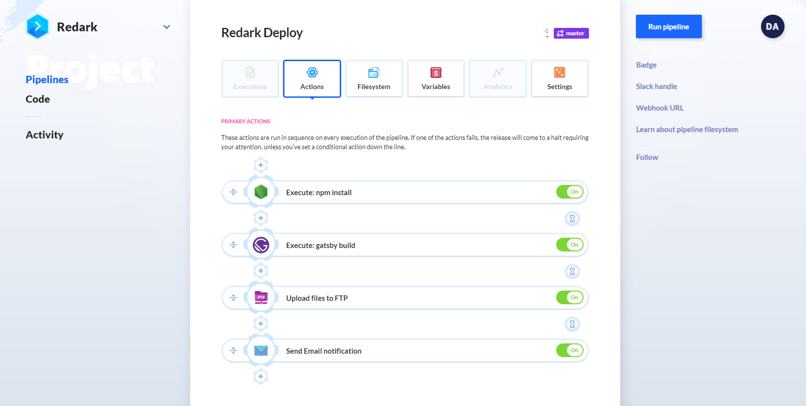

<ImageDescription>Buddy Works - genialnie zaprojektowane narzędzie CI/CD</ImageDescription>

Niestety rozmiar serwisu ponownie przysporzył mi problemów. Ogromna ilość grafik sprawiła, że przestałem mieścić się w darmowym planie Buddy'ego i zostałem zmuszony z niego zrezygnować. Mimo to naprawdę polecam narzędzie, ponieważ jest ono rewelacyjnie zaprojektowane i ma ogromny potencjał. Chcących dowiedzieć się więcej o tym narzędziu zapraszam do [tego artykułu](https://devstyle.pl/2019/03/28/continuous-integration-delivery-deployment-buddy/).

Pozostała więc trzecia opcja, która jest używana obecnie przeze mnie w Redarku. Pewna zasada programistów brzmi: "jeśli nie powstało narzędzie, które jest Ci potrzebne, to stwórz je samemu". Tak więc zrobiłem i stworzyłem uniwersalne narzędzie do zautomatyzowanego budowania stron opartych o Gatsby'ego oraz różnicowego wysyłania ich na serwer. Tak samo, jak kod bloga, tak i to narzędzie jest dostępne publicznie na platformie GitHub. Link do repozytorium znajdziecie poniżej:

<ActionButton to='https://github.com/adan2013/Gatsby-FTP-Deployment'>Gatsby FTP Deployment - GitHub</ActionButton>

Skrypt automatycznie pobiera zmiany z GitHuba, buduje wersję produkcyjną, porównuje jej pliki z poprzednią wersją witryny i wysyła jedynie zmodyfikowane jej elementy. Dodatkowo na koniec wysyła jeszcze na wskazany adres e-mail raport z przebiegu budowania i wysyłania nowej wersji witryny. Może nie jest to rozwiązanie tak przyjemne i komfortowe jak gotowe CI/CD, ale działa i **aktualizuje witrynę w 2-3 minuty**. Ważne jest też to, że skrypt jest uniwersalny i może zostać użyty nawet w Twoim blogu! Wszelkie potrzebne informacje dotyczące konfiguracji skryptu znajdziesz w pliku README w repozytorium. W razie potrzeby możesz też zwrócić się bezpośrednio do mnie :)

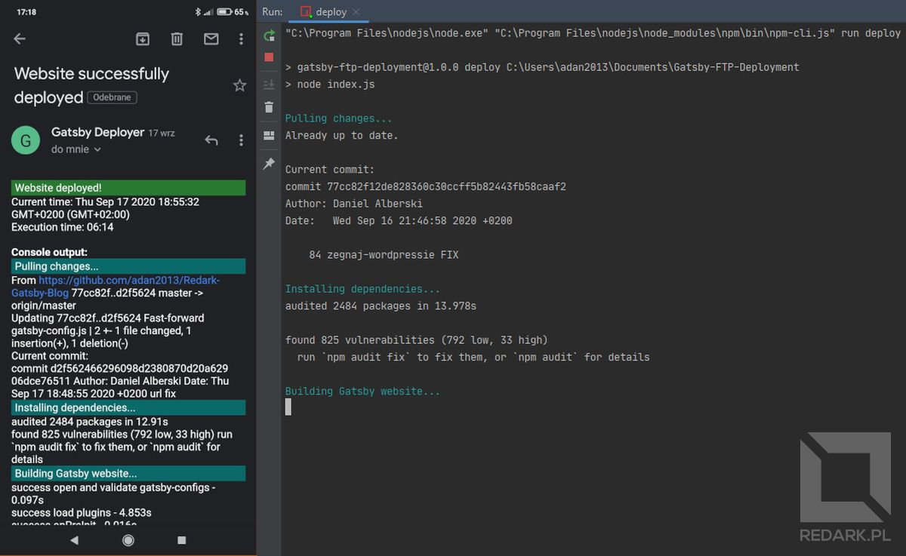

<ImageDescription>Po prawej widok konsoli, a po lewej mail wysyłany po zakończeniu pracy skryptu</ImageDescription>

<AdSense/>

## Co lepsze: Gatsby czy WordPress?

Czas więc odpowiedzieć na pytanie: czy do prowadzenia własnego bloga Gatsby jest lepszy od WordPressa? Zacznijmy od plusów.

### Git - pełna kopia bezpieczeństwa z historią zmian

Dzięki temu, że mój blog znajduje się teraz w repozytorium Gita, nie muszę się już martwić o robinie kopii bezpieczeństwa, co w przypadku WordPressa było wręcz wskazane. Dzięki Gitowi dane są odseparowane od witryny i bezpiecznie trzymane na serwerach giganta, jakim jest GitHub oraz Microsoft - jego obecny właściciel. W dodatku mam pełną kontrolę nad zmianami, jakie wprowadzam w blogu i nawet za 5 lat będę w stanie przywrócić Redarka do obecnego stanu używając zaledwie jednej komendy.

### Brak możliwości włamania się na stronę

WordPress z racji swojej popularności jest łakomym kąskiem dla hackerów, którzy próbują co chwilę złamać jego zabezpieczenia, by przejąć kontrolę nad czyjąś witryną. Sprawę bardzo ułatwiają dziesiątki różnej jakości wykonania wtyczki, które zainstalował użytkownik. To one często pozwalają hackerom wejść do panelu administratora. Gdy Redark pracował na WordPressie miał dodane dwuetapowe uwierzytelnienie z Google Authenticator'em oraz jeszcze kilka innych zabezpieczeń, a i tak bałem się, że któregoś dnia, uda się komuś go zawirusować.

W Gatsby'm sytuacja jest zupełnie odwrotna. Redark jest teraz statyczną stroną i nie posiada żadnego panelu logowania, panelu administratora czy jakichkolwiek wrażliwych danych. Sprawia to, że **Redark jest obecnie w 100% odporny na ataki hackerskie**. Jedyny teraz sposób to włamać się bezpośrednio do hostingu, a to już nie jest takie proste. Mogę teraz nareszcie spać spokojnie.

### Większa kontrola nad treścią i wyglądem strony

Nawet posiadając własny motyw w WordPressie, nie miałem pełnej kontroli nad sposobem działania pewnych elementów witryny. Dla przykładu chciałem, żeby pod treścią artykułu widget "udostępnij artykuł" był przed widgetem "zobacz więcej". Niestety WordPress nie umożliwia kontrolowania kolejności działania wtyczek, a jedynie umożliwia zainstalowanie kolejnej szemranej wtyczki, która niby ma dodać takową funkcjonalność. Aż mnie ciarki przechodzą, jak o tym znowu pomyślę. W Gatsby'm mam pełną kontrolę nad tym, co robię. Każdy element, każdy tekst widoczny na ekranie, to moje dzieło. Nadal są pewne elementy, którymi ciężko w Gatsby'm sterować, ale to już opiszę w wadach tego rozwiązania.

### Brak absolutnego linkowania

WordPress miał tę ogromną wadę, że stosował linkowanie absolutne, czyli każdy link, przycisk lub zdjęcie kierowało na adres https... i tak dalej. Powoduje to to, że jakakolwiek próba ruszenia WordPressa z pierwotnej domeny, jest drogą przez mękę. Trzeba kombinować, modyfikować pliki, instalować durne pluginy, a nawet modyfikować ręcznie bazę danych profesjonalną metodą "Ctrl+F". Doświadczyłem tego dwa razy na Redarku. Pierwszy raz, gdy migrowałem z niezabezpieczonego http na szyfrowany https, a drugi raz, gdy chciałem postawić sobie na komputerze kopię witryny do testów i ulepszania mojego autorskiego motywu.

Pewnie myślicie, że zmieniłem adres redark.pl na localhost, poprawiłem wszystkie linki we wszystkich artykułach i po sprawie? Oj nie ma tak łatwo! Musiałem na sztywno ustawić w adresie mój prywatny adres IP komputera! Inaczej nie byłbym w stanie testować działania witryny na moim telefonie. A teraz kwintesencja całej sytuacji. Skoro miałem na sztywno zapisany adres IP w adresie witryny, to musiałem skonfigurować wszystkie routery, z którymi łączyłem się z Internetem tak, aby korzystały z tej samej adresacji oraz przypisywały mi zawsze ten sam adres IP. Rozumiecie? Aby WordPress mógł mi działać poprawnie, musiałem bawić się ustawieniami routerów w domach! Przecież to jest absurd!

A co robi Gatsby? Pracuje na linkach relacyjnych, więc mogę go dowolnie przenosić między domenami i wszystko będzie działać. Nowa domena? Spoko, nie ma problemu. Migracja serwisu? Tylko przekopiuj pliki. Serwer testowy w domu? Minutka i gotowe. **Dlaczego WordPress nie może tak działać?!**

### Decentralizacja danych

Czas na wady Gatsby'ego. Stosowanie go wymaga na administratorze zdecentralizowania swoich danych. Hosting z FTP to jedno, ale dochodzi jeszcze repozytorium, jakiś headless CMS oraz narzędzie CI/CD. WordPress miał to do siebie, że wszystko działo się w obrębie hostingu i nie trzeba było się bawić w żadne integracje. Dla jednych to będzie zaleta, a dla innych wada. Niemniej jednak warto to zaznaczyć.

### Potrzeba budowania strony

Gatsby dzięki pracy na statycznych gotowych plikach jest super szybki. Niestety coś kosztem czegoś. Potrzeba ponownego budowania strony po każdej zmianie nie jest z pewnością komfortowa. Jesteśmy zmuszeni robić to ręcznie lub wykorzystać gotowe narzędzie CI/CD, co albo nie jest tanie, albo nie jest łatwe. Ja na przykład ostatecznie stworzyłem sobie do tego niestandardowy skrypt, ale wymagało to oczywiście ode mnie wiedzy programistycznej.

### Trudniejsze redagowanie tekstów

Tutaj taka zbiorcza wada poświęcona pisaniu artykułów. Są one tworzone w prostym edytorze tekstu, który nie jest tak intuicyjny i przyjemny jak Gutenberg w WordPressie. Oczywiście ma to swoje zalety, np. brak narzuconego stylowania elementów, ale stawiając się na miejscu osoby nietechnicznej - jest trudniej. Trzeba zapamiętać składnie Markdowna (choć nie jest skomplikowana), a także ręcznie dbać o zapis meta danych na początku artykułu. Mocną wadą (przynajmniej dla mnie) jest brak omawianej wcześniej wtyczki do Chrome'a do sprawdzania pisowni w języku polskim. W Gutenbergu działała ona wyśmienicie i bardzo ułatwiała pisanie, a teraz muszę kombinować.

### SEO na własną rękę

Każdy użytkownik WordPress'a zna wtyczkę Yoast SEO. Choć lubi ona przysparzać problemów, to jest niezastąpiona jeśli chodzi o optymalizację strony pod kątem wyszukiwarek internetowych. W przypadku Gatsby'ego otrzymujemy na start jedynie malutki komponent, który pokazuje nam, jak możemy obsłużyć SEO w naszym projekcie. Jego rozbudowa leży jednak po naszej stronie. Wymaga to zaznajomienia się z zasadami działania indeksatorów Google'a oraz stosowania różnej maści testerów online. Obsługa, chociażby obrazków wyróżniających artykuły, to moja robota. Gdybym tego nie napisał, to po udostępnieniu artykułu w socialach, wyskakiwałby szary prostokąt oznaczający brak grafiki. Jednym słowem: jak sobie pościelisz, tak się wyśpisz.

<InfoBlock>Wiele testerów SEO jest płatna, ale da się znaleźć darmowe mniej szczegółowe raporty, które pozwolą na podstawowe przygotowanie witryny pod wyszukiwarki.</InfoBlock>

### Możliwość zwiększenia kosztów prowadzenia serwisu

Tak jak już pewnie zauważyliście w trakcie czytania tego artykułu, podczas przechodzenia na Gatsby'ego często spotykałem się z barierą płatnego planu któregoś z narzędzi. Niestety, ale wykorzystanie tej technologii ciągnie za sobą potrzebę korzystania z dodatkowych serwisów i narzędzi takich jak GitHub, headless CMS czy CI/CD. W przypadku bardziej rozbudowanych portali darmowe plany mogą nie wystarczyć, a to może znacząco zwiększyć koszt utrzymania interesu. Ja, po odrobinie kombinatoryki i wykorzystaniu swoich programistycznych umiejętności, uniknąłem dodatkowych wydatków. Niemniej jednak prowadzenie witryny w WordPressie było znacznie prostsze i nie wymagało takiej gimnastyki w celu uniknięcia dodatkowych kosztów.

<AdSense/>

### Gatsby też nie jest idealny

Na koniec pozostawiłem trzy poważne problemy, które wynikają już tylko i wyłącznie ze strony Gatsby'ego. Po pierwsze jego cache, który jest wykorzystywany do przyspieszenia budowania strony, często się psuje i zaczyna robić bardzo dziwne rzeczy. Dzieje się to najczęściej podczas dodawania lub usuwania grafik w trakcie działania serwera deweloperskiego. W takim przypadku trzeba usunąć cache i przebudować cały projekt, a to na moim komputerze zajmuje nawet kilkanaście minut. Twórcy Gatsby'ego na pewno muszą popracować nad jego stabilnością.

Drugą rzeczą są jego obrazki, które przez swoją "specjalność" w postaci konturów SVG nijak nie słuchają się CSS-owych stylów. Po prostu cały dzień można zmarnować na szukaniu sposobu, aby któryś z obrazków wyglądał tak, jak chcemy. Największym problemem jest ograniczenie wysokości obrazka wraz z zachowaniem jego proporcji. W Internecie znajdziecie miliony osób, które proszą o pomoc z ich ostylowaniem. Po prostu dramat.

Trzecim problemem są omawiane już niestandardowe znaczniki w plikach MDX. Choć jak widzicie, udało mi się je stworzyć, to napsuły mi one solidnie krwi. Cały problem polega na tym, że tekst znajdujący się w znaczniku przestaje być już Markdownem i nie mogę np. użyć kursywy w "InfoBlock-u" (przykład poniżej). W przypadku galerii zostałem zmuszony zrobić dziwaczną sztuczkę programistyczną i ręcznie interpretować składnie Markdowna, aby zamienić ją na właściwe obrazki.

<InfoBlock>To jest zwykły tekst, *a ten tekst powinien być napisany kursywą, a nie jest!* Zamiast tego ma gwiazdki na początku i końcu, które nie zostały zinterpretowane.</InfoBlock>

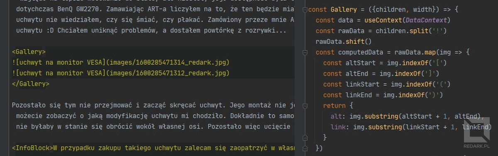

<ImageDescription>Aby galeria mogła działać, musiałem ręcznie interpretować składnie Markdowna</ImageDescription>

## Podsumowanie

To by było na tyle. Mam nadzieję, że choć trochę wytłumaczyłem, jak wygląda prowadzenie bloga w Gatsby'm. Nadal podtrzymuje zdanie, że WordPress to dobre narzędzie, ponieważ zdejmuje z użytkownika wiele ciężaru i postawienie na nim strony jest bardzo proste. Natomiast osobom odważnym, które mają już dość prowadzenia na nim witryny, a znają się na programowaniu, serdecznie polecam Gatsby'ego. Jeśli mielibyście jeszcze jakieś pytania dotyczące obsługi Gatsby'ego lub migracji z WordPress'a, zapraszam do sekcji komentarzy pod postem lub na jeden z moich social mediów. Linki do nich znajdziecie w stopce lub na [stronie kontaktowej](/kontakt). Do usłyszenia :)
