Coraz większa liczba incydentów na drogach oraz prób wyłudzenia odszkodowania powoduje, że posiadanie wideorejestratora w samochodzie staje się już niemalże obowiązkowe. Kilka tygodni temu, w moim samochodzie, zagościł Mio MiVue C570, czyli wideorejestrator z wbudowanym modułem GPS oraz funkcją ostrzegania przed fotoradarami. Bez przedłużania, zapraszam na unboxing oraz test kamerki w terenie.

## Zawartość zestawu

W pudełku znajdziemy komplet instrukcji wraz z kartą gwarancyjną, ładowarkę samochodową, uchwyt z przyssawką oraz sam wideorejestrator. Kabel zasilający jest zakończony kątową wtyczką mini USB. Giętkość i długość przewodu jest na tyle duża, że bez problemu można go przeprowadzić przez podsufitkę oraz słupek obok przedniej szyby. Szkoda, że producent postawił na znacznie mniej popularny wtyk mini USB, a nie micro USB. W przypadku nagłej sytuacji z pewnością nie miałbym czym podłączyć się do urządzenia, aby zgrać nagranie. Szkoda również, że nie pokuszono się o dodatkowy port USB we wtyczce zapalniczki. Widziałem taki trick w wielu innych wideorejestratorach i byłaby to miła niespodzianka umożliwiająca też naładowanie telefonu za pomocą jednej zapalniczki.

<Gallery>
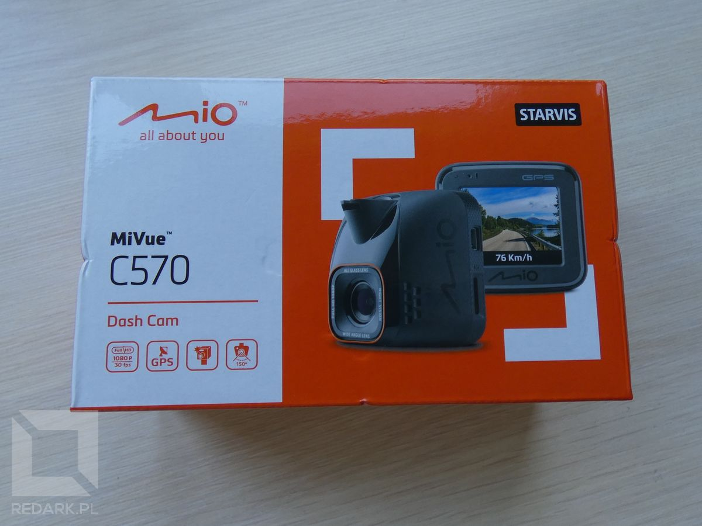
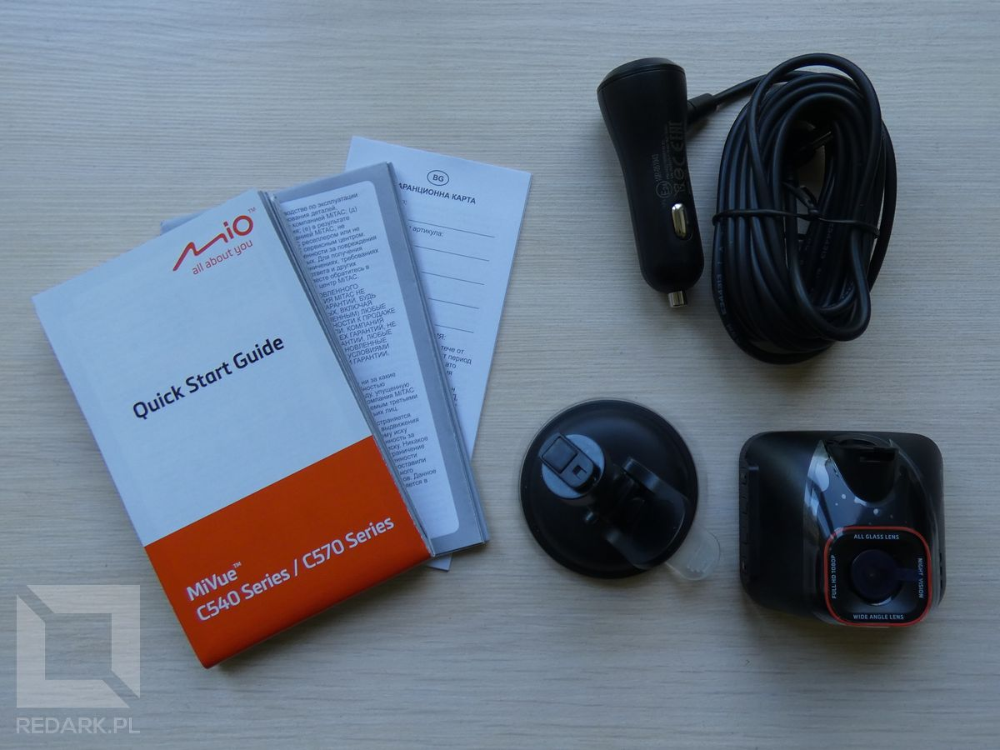
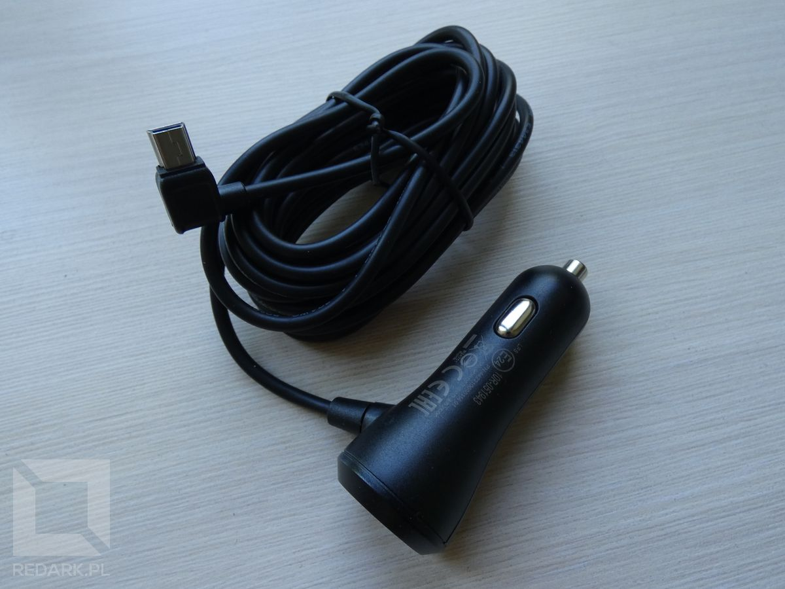
</Gallery>

Samo urządzenie jest bardzo dobrze zaprojektowane. Mamy tutaj kompaktową obudowę (około 6 na 6 centymetrów) wykonaną z bardzo dobrej jakości plastiku, która bezproblemowo mieści mi się na dłoni. Na lewej krawędzi urządzenia znajdziemy gniazdo kart microSD oraz gniazdo mini USB służące do ładowania kamerki lub zgrywania z niej nagrań. Prawa krawędź posiada cztery wielofunkcyjne przyciski. Na froncie znajduje się 2-calowy wyświetlacz LCD, mikrofon oraz dioda sygnalizująca pracę urządzenia. Z tyłu wideorejestratora znajdziemy głośnik, a także rzecz jasna obiektyw kamery. Wykonany jest on w całości ze szkła, posiada przysłonę f/1.8. C570 oraz został wyposażony w popularną i sprawdzoną matrycę dobrej jakości Sony Starvis. Urządzenie oferuje kąt widzenia 150 stopni (deklarowany przez producenta) oraz rozdzielczość FullHD w 30 klatkach na sekundę. Do urządzenia należy dokupić kartę microSD klasy 10-tej (lub lepszej) o maksymalnej pojemności 128 gigabajtów.

## Działanie kamerki oraz dostępne opcje

Po podłączeniu urządzenia do zasilania i odczekaniu chwili ukazuje się główny ekran interfejsu wraz z podglądem obrazu. Znajdziemy tam informacje takie jak: status nagrywania, aktualna godzina, siła sygnału GPS oraz aktualna prędkość samochodu. Po prawej znajdują się ikonki dostępnych opcji, które mogą zostać wybrane za pomocą przycisków znajdujących się na prawej krawędzi wideorejestratora. Pierwszy pozwala wejść do menu i ustawień, drugi dodać niestandardowy fotoradar (więcej o tym  później), trzeci wykonać zdjęcie, a ostatni zabezpieczyć nagranie przed nadpisaniem.

<Gallery width="3">
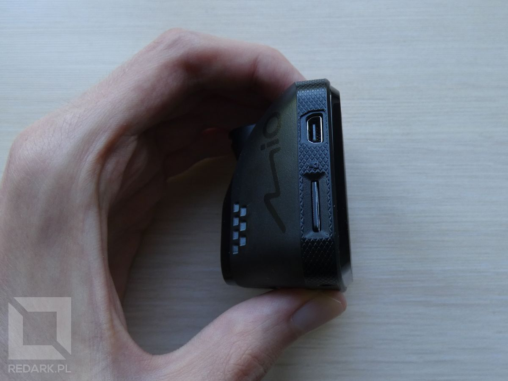
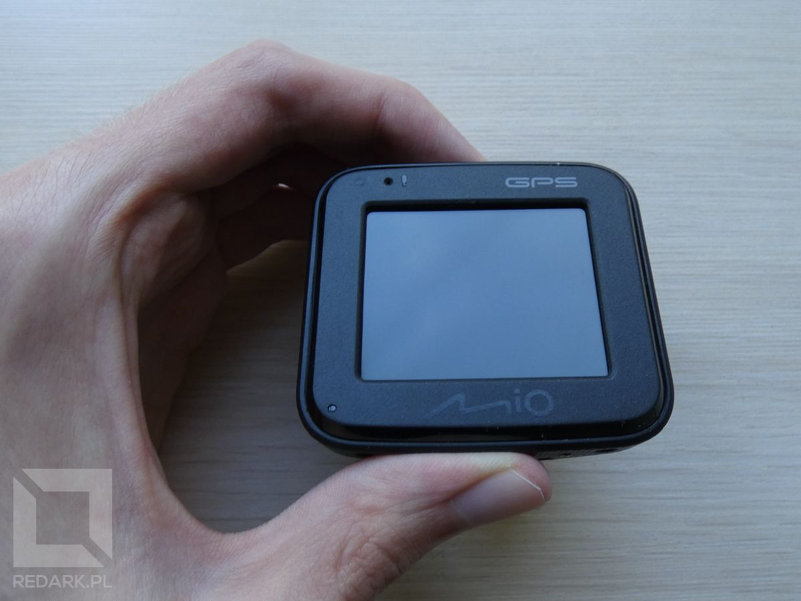
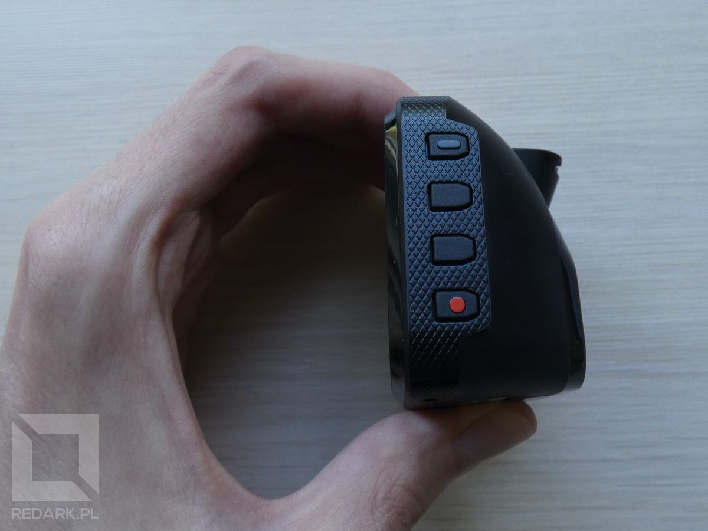
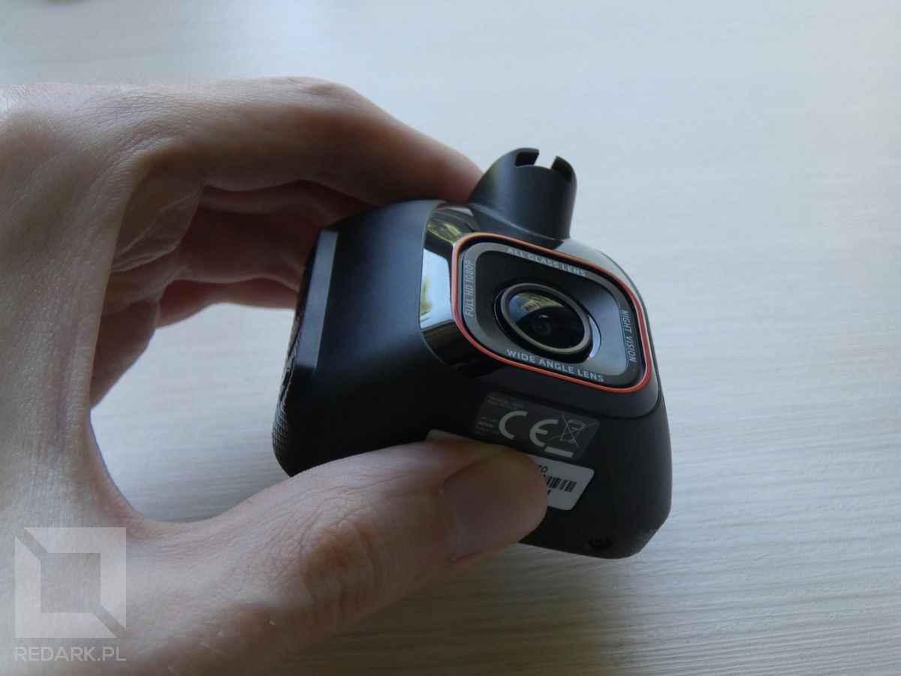
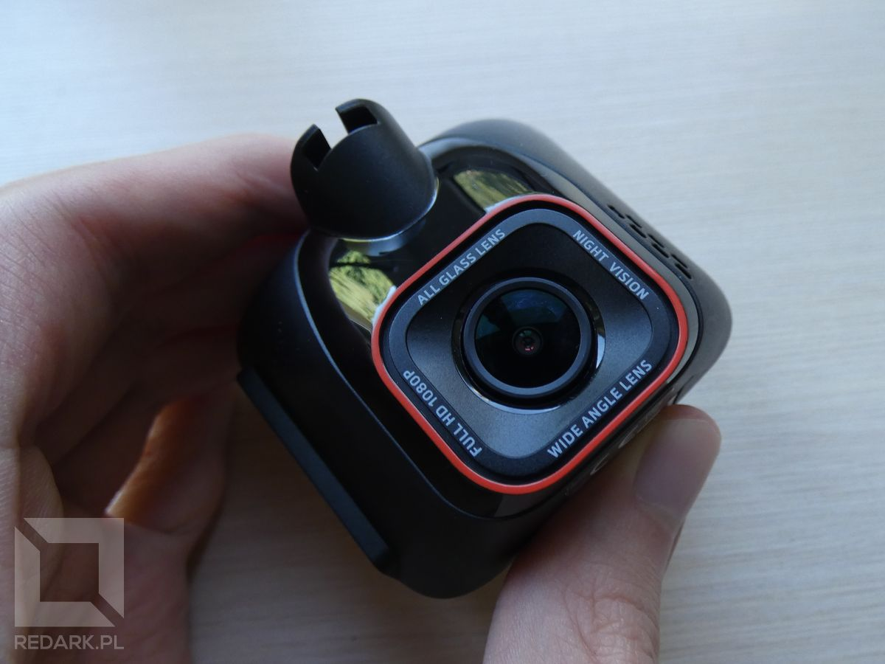
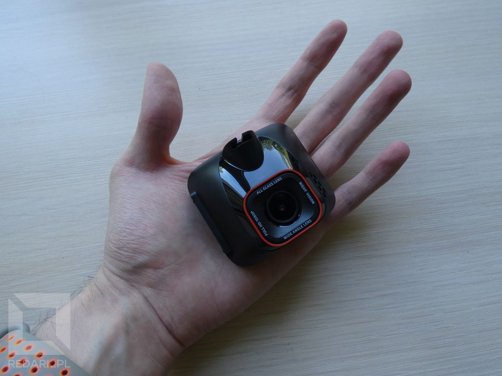
</Gallery>

Po wejściu do menu otrzymujemy możliwość przejrzenia nagranych materiałów, włączenia lub wyłączenia rejestrowania dźwięku, sterowania ostrzeżeniami przed fotoradarami oraz trybem parkingowym. W ustawieniach systemowych możemy określić długość pojedynczych plików wideo, włączyć WDR (Wide Dynamic Range), dostosować wartość ekspozycji, zmienić częstotliwość odświeżania obrazu (50 lub 60 Hz) oraz ustawić czułość sensora przeciążeń, który w razie kolizji, automatycznie zabezpieczy nagranie przed nadpisaniem. Dodatkowo możemy określić jakie informacje mają zostać naniesione na nagrywany obraz. Do wyboru są wartości przeciążeń w trzech osiach, współrzędne geograficzne, prędkość pojazdu oraz własny tekst np. numer rejestracujny samochodu.

<AdSense/>

Ustawienia systemowe umożliwiają podgląd łączności z satelitami, wybór między systemem GPS a GLONASS, zmianę daty i godziny (wraz z automatycznym pobieraniem jej z systemu GPS), możliwość wyłączenia dźwięków przycisków oraz melodyjki powitalnej. Głośność komunikatów oraz czas świecenia ekranu również może zostać dostosowany. Ekran może pozostać włączony, wygasić się po 10, 60 lub 180 sekundach, a także pracować w trybie HUD. W tym trybie wyświetlacz jest włączony cały czas, ale zamiast podglądu obrazu pokazuje jedynie aktualną godzinę oraz prędkość pojazdu (ostatnie zdjęcie poniżej). Choć poniższe zdjęcia prezentują urządzenie z angielskim interfejsem, to MiVue C570 oferuje także interfejs w języku polskim.

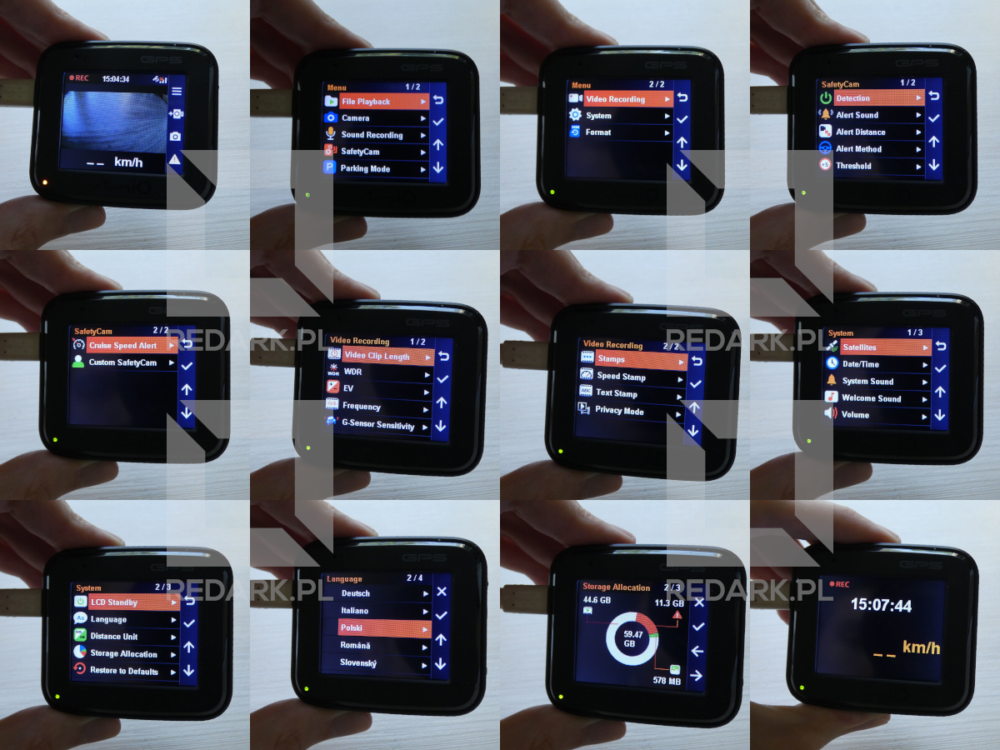

## Ostrzeganie przed fotoradarami

Bardzo ciekawą funkcją, którą posiadają chyba jedynie wideorejestratory Mio, Garmina oraz Navitela, jest wykorzystanie systemu GPS do ostrzegania przed fotoradarami. W menu urządzenia znajdziemy do tego dedykowany ekran ustawień. Możemy tam włączyć lub wyłączyć omawianą funkcję, określić sposób ostrzegania (sygnał dźwiękowy, komunikat głosowy lub jedynie komunikat na ekranie), dostosować dystans od fotoradaru, przy którym pojawia się ostrzeżenie oraz określić przy jak dużym przekroczeniu prędkości ma pojawiać się komunikat. Druga część ustawień umożliwia zdefiniowanie stałego limitu prędkości (po jego przekroczeniu rozlegnie się alarm) oraz zarządzanie listą niestandardowych fotoradarów. Ich lokalizacje możemy dodawać z poziomu ekranu głównego urządzenia przy pomocy jednego z przycisków bocznych. Aktualizacja bazy fotoradarów oraz oprogramowania samej kamerki jest wykonywana poprzez skopiowanie odpowiedniego pliku na kartę pamięci urządzenia. **Dostępność aktualizacji ma być zapewniona dożywotnio**.

Mam dwa zastrzeżenia do działania tej funkcji. Po pierwsze, po przetestowaniu funkcji niestandardowych fotoradarów zauważyłem, że dodany punkt zapamiętuje kierunek poruszania się pojazdu i aktywuje ostrzeżenie tylko w tym jednym kierunku. Dlatego dodanie standardowego (działającego w obu kierunkach) fotoradaru wymaga podwójnego zarejestrowania go w pamięci urządzenia i to jadąc z dwóch różnych kierunków. Nie rozumiem, dlaczego Mio tak to rozwiązało. Drugie spostrzeżenie dodtyczy głośności komunikatów dźwiękowych kamerki. Zarówno sygnał, jak i komunikat głosowy jest zdecydowanie zbyt cichy i może zostać bez problemu zagłuszony przez radio samochodowe. Oczywiście pozostają komunikaty na ekranie, ale ciężko z nich korzystać, jeśli tak jak ja, chcecie ukryć urządzenie za lusterkiem wewnętrznym.

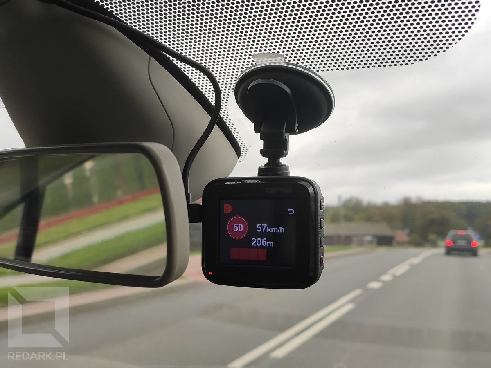

## Działanie kamerki w terenie

Przyszedł czas na test urządzenia w terenie. Zależało mi na jak najbardziej dyskretnym działaniu rejestratora, dlatego tak, jak już wspominałem, umiejscowiłem go za wewnętrznym lusterkiem auta. Dzięki kompaktowym wymiarom urządzenie jest prawie niewidoczne dla kierowcy, ale uważam, że tradycyjny uchwyt na przyssawkę zepsuł trochę wrażenie "kompaktowości". Uchwyt jest duży i wideorejestrator znacząco odstaje od szyby. Szkoda, że producent nie pokusił się tutaj o mocowanie na klej tak, jak chociażby w modelu J60 lub urządzeniach Garmina. Urządzenie prezentowałoby się znacznie lepiej. Dla porównania prezentuję wideorejestrator Garmin Dash Cam 54, którego miałem okazję przez chwilę testować. Do szyby montowany na klej jest jedynie mały silny magnes.

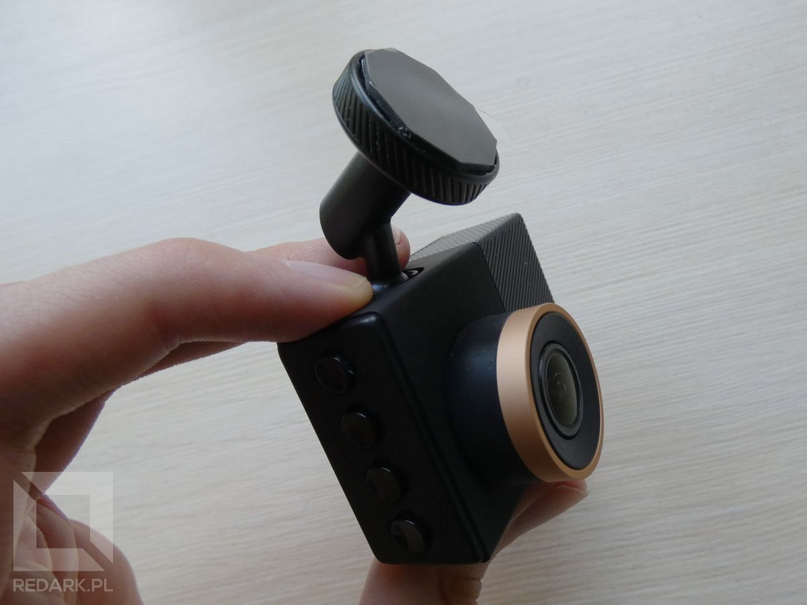

<ImageDescription>Garmin Dash Cam 54 i jego kompaktowy uchwyt na klej i krążek magnetyczny</ImageDescription>

<Gallery>

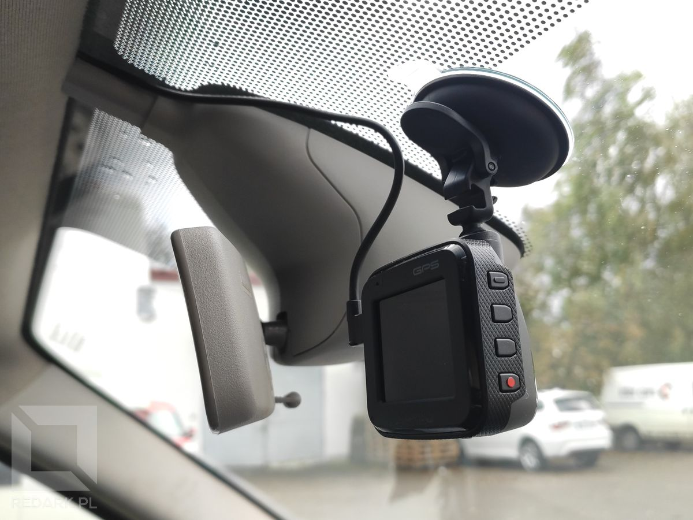
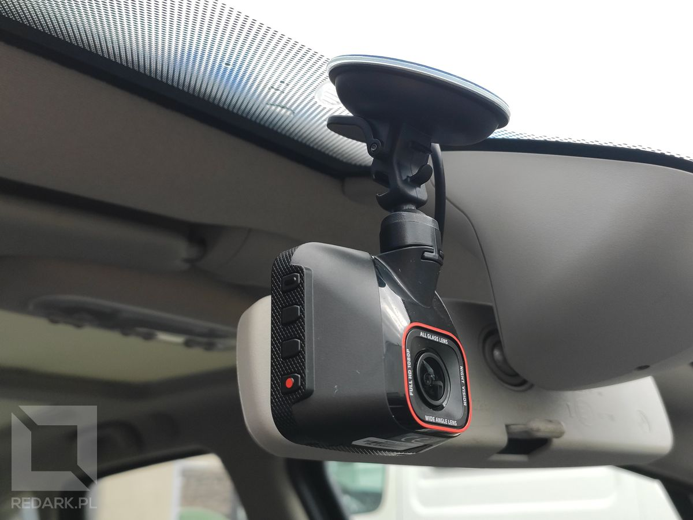
</Gallery>

Jak możecie zauważyć na powyższych zdjęcia, kabel został już przeze mnie ukryty w podsufitce. Nie napotkałem większego problemu z przeprowadzeniem go na sam dół deski rozdzielczej. Do działania modułu GPS nie mam zastrzeżeń. Mierzona prędkość szybko reagowała podczas dynamicznej jazdy, a sygnał GPS był zawsze nawiązywany w mniej niż 30 sekund od uruchomienia nagrywania. Warto również zaznaczyć, że dołączona do zestawu ładowarka impulsowa nie spowodowała u mnie zauważalnego zakłócania działania radia w samochodzie.

<AdSense/>

Działanie C570 przetestowałem w dzień oraz w nocy. Jakość nagrań oceniam na przyzwoitą. W nocy oczywiście ciężko o łatwą identyfikację aut na podstawie tablic rejestracyjnych, ale widać, że wideorejestrator robi wszystko, co może, aby zarejestrowany materiał miał zadowalającą jakość. Próbkę możliwości urządzenia prezentuję na poniższym filmiku. Pamiętaj jednak, że materiały w serwisie YouTube są obarczone pewną kompresją i oglądany materiał może nie odzwierciedlać pełnych możliwości kamerki.

<YouTube id='Tc4sYiFntS8' title='Testowe nagranie w dzień wideorejestratora Mio MiVue C570'></YouTube>

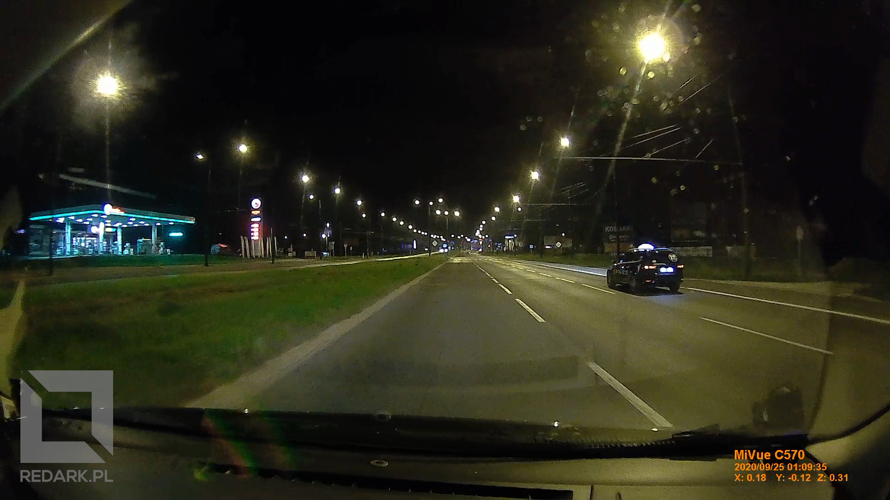

<ImageDescription>Nagrania w nocy nie są szczegółowe, ale ich jakość nie odstrasza</ImageDescription>

## Dodatkowe akcesoria i oprogramowanie na PC

Możliwości wideorejestratora można rozszerzyć za pomocą dwóch akcesoriów. Pierwszym z nich jest "Powerbox". Jest to akcesorium pozwalające zasilić wideorejestrator bezpośrednio z akumulatora pojazdu (zarówno z instalacji 12V, jak i 24V). Dzięki temu kamerka może działać w tzw. trybie parkingowym i czuwać nad bezpieczeństwem auta w czasie, gdy stoi on na parkingu. W przypadku wykrycia uderzenia, rejestrator uruchamia nagrywanie i powiadamia o zdarzeniu kierowcę, gdy ten wróci do pojazdu.

Drugim akcesorium jest kamerka A30, która może zostać zamontowana na tylnej szybie samochodu. Połączona jest ona z wideorejestratorem za pomocą dołączonego do zestawu 5-cio metrowego kabla USB oraz rozgałęźnika w kształcie litery Y. Za jego pomocą do wideorejestratora można podłączyć jednocześnie zarówno ładowarkę samochodową, jak i tylną kamerę.

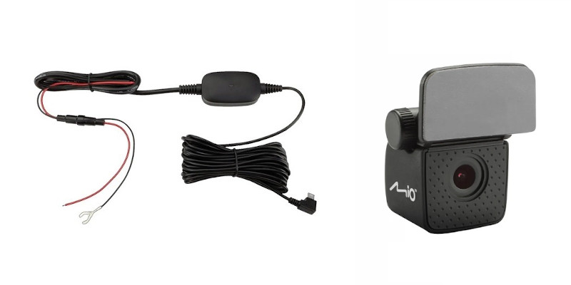

<ImageDescription>Po lewej Powerbox, a po prawej kamerka A30</ImageDescription>

Ostatnią rzeczą, jaką chciałbym przedstawić jest oprogramowanie  o nazwie MiVue Manager dostępne na komputery. Jest to aplikacja umożliwiająca podgląd obrazu z przedniej oraz tylnej kamerki (jeśli została podłączona), a także analizę danych zarejestrowanych przez G-sensor oraz moduł GPS. Program umożliwia także łatwe nałożenie tych danych na mapę świata, a także eksport pomiarów do pliku KML. Dzięki temu możemy uzupełnić nasze nagranie danymi o prędkości i pozycji naszego auta, nawet jeśli nie były one naniesione na nagrywany obraz.

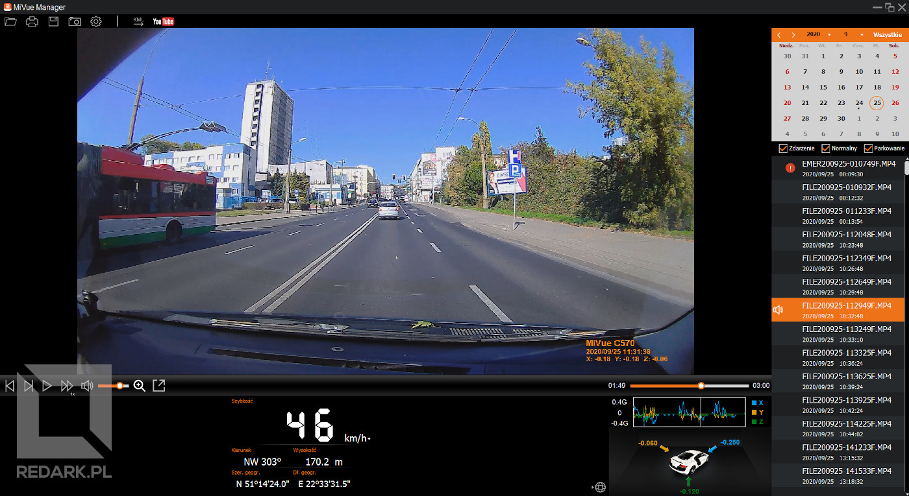

## Podsumowanie

Mio MiVue C570 to porządnie wykonany i funkcjonujący wideorejestrator. Oferuje on dobrą jakość nagrań, bezbłędnie działający moduł GPS, ostrzeganie przed fotoradarami z dożywotnią aktualizacją oraz bardzo użyteczną aplikację na PC. Jako największą wadę uznałbym duży uchwyt na klasyczną przyssawkę, który niepotrzebnie powiększa rozmiar urządzenia. Fajnie też, gdyby kamerka była wyposażona w port USB w wersji micro, a nie mini. Mimo to uważam C570 za bardzo udany model i mam nadzieję, że będzie on przez wiele lat dzielnie służył w moim samochodzie.

<GoodList>
- kompaktowe rozmiary i dobra jakość wykonania
- szybki i bezbłędny moduł GPS
- ostrzeganie przed fotoradarami z dożywotnią aktualizacją
- brak zakłóceń na fabrycznym radiu
- przydatna aplikacja na PC do podglądu nagrań, danych GPS oraz wartości przeciążeń
</GoodList>

<BadList>
- duży uchwyt z przyssawką, który mógłby być zastąpiony uchwytem na klej
- mało popularna wtyczka mini USB
- ciche komunikaty o fotoradarach
</BadList>
