Po czterech latach przerwy Ubisoft ponownie postanowił zabrać nas do świata hackerów. Tym razem udajemy się do Londynu niedalekiej przyszłości, który został opanowany przez złą organizację militarną Albion, a naszym zadaniem jest odbudowanie dawnej organizacji hackerskiej DedSec i wywołanie rewolucji. Bez zbędnego przedłużania przekonajmy się, czy tym razem Ubisoft dotrzymał słowa i nie zawiódł w kwestii obiecanych mechanik.

## Rekrutacja członków DedSec

<Quote source="Mk 5,9">
Na imię mi "Legion", bo nas jest wielu
</Quote>

Ten cytat najlepiej opisuje najważniejszą mechanikę tej gry. To, czym wyróżnia się Legion to nowatorska mechanika rekrutowania do naszej drużyny napotkanych na ulicy przechodniów. Wymusiła ona na twórcach zastosowanie wielu sztuczek, dzięki którym każdy napotkany przez nas NPC jest unikalny i może wejść z nami w interakcje. Każda taka postać posiada szereg cech osobowości oraz może dysponować specjalnymi elementami ekwipunku. Lekarz będzie posiadał strój medyczny pozwalający wchodzić do szpitali oraz możliwość przywoływania karetki. Budowlaniec będzie posiadać gwoździarkę jako broń palną, strój robotnika oraz dron transportowy idealny do eksplorowania dachów budynków. Dodatkowe cechy mogą dotyczyć zwiększonych obrażeń dla przedstawicieli danej frakcji, szybsze obalanie przeciwników lub możliwość wyciągnięcia członków DedSecu z aresztu lub szpitala, jeśli zostaną oni ranni podczas akcji. Można też spotkać zabawne "przeszkadzajki" jak np. czkawkę, która w losowych momentach alarmuje pobliskich wrogów. Choć nie jestem zadowolony ze wciskania przez Ubisoft wszędzie mechanik RPG, to jednak całość nawet się broni i wprowadza jakąś świeżość do serii.

<Gallery>
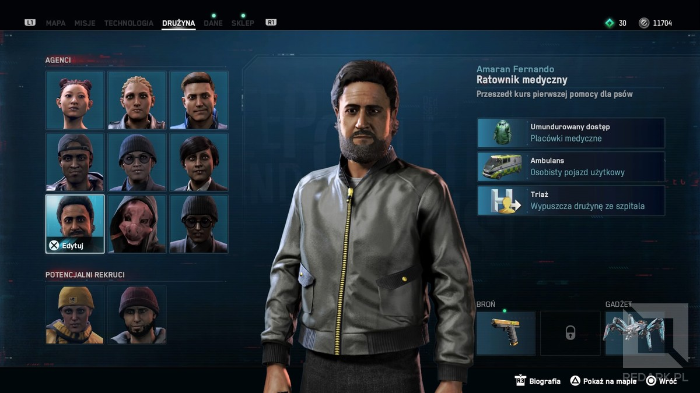
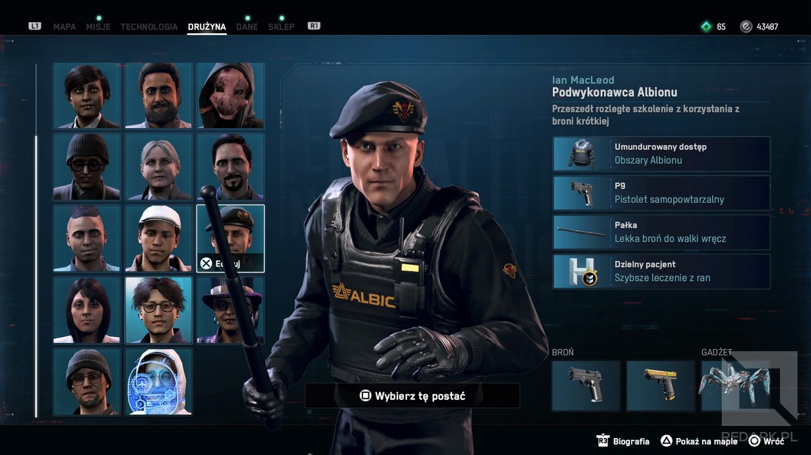
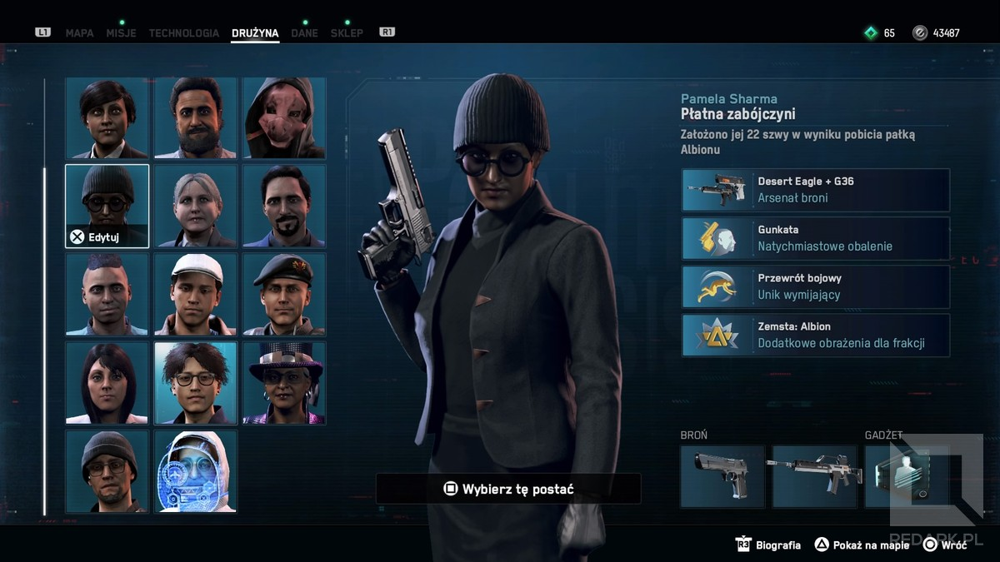
</Gallery>

Duże brawa należą się także za implementacje planu dnia każdego NPC. Gdy na ulicy zeskanujemy przechodnia, możemy poznać co do godziny plan całego jego dnia. Najlepsze jest to, że jest on prawdziwy i postać rzeczywiście wykonuje znajdujące się tam czynności! Wychodzi z domu, idzie do pracy, na siłownię, spotyka się ze znajomymi itd. Dane te mogą być wykorzystywane przez gracza do wykrywania okazji, dzięki którym możemy nakłonić daną postać do zasilenia szeregów naszej organizacji. Bardzo fajnie to działa.

Niestety, nie obyło się bez błędów i niedociągnięć. Postacie losowe posiadają generowane w locie animacje twarzy. Moja pierwsza rekrutka, którą przechodziłem samouczek gry, miała wyraźnie widoczne momenty łączenia animacji. Spowodowało to to, że zamiast być pod wrażeniem wyglądu i działania gry, obserwowałem moją bohaterkę, która momentami wyglądała, jakby miała atak padaczki. Na pewno nie było to dobre pierwsze wrażenie. Podejrzewam, że mogłoby to zostać dopracowane przez deweloperów, ale Ubisoft pewnie jak zwykle chciał ciąć koszty produkcji.

Druga sprawa to głosy losowych NPC-ów. Twórcy przed premierą gry chwalili się, że głos postaci będzie modulowany na żywo, przez co nigdy nie spotkamy dwóch osób posiadających ten sam głos. Bardzo pomysłowa mechanika i widać, że faktycznie jest tutaj zaimplementowana, ale niestety czasami daje ona nieprzewidywalny efekt. Głosy czasami nie pasują do odgrywanych postaci, przez co jednym z moich wyznaczników dobrej rekrutacji był normalny głos NPC. Członkowie z piskliwym głosem wykonywali najtrudniejsze misje, aby w razie niepowodzenia mógł szybko się ich pozbyć poprzez mechanikę permanentnej śmierci.

## Fabuła gry

Fabuły poprzednich gier z serii Watch Dogs nigdy nie były złożone i nie zaskakiwały gracza milionem zwrotów akcji. Legion tego nie zmienia. Władza w Londynie została przejęta przez prywatną firmę militarną Albion, a my chcemy osłabić jej wpływy i wywołać rewolucję - ot cała historia. Aby móc odbudować dawny DedSec (grupę hackerską znaną z poprzednich części) biegamy po mieście i rekrutujemy przechodniów, którzy posiadają interesujące nas cechy. Niestety ta rewolucja jest bardzo, ale to bardzo grzeczna i praktycznie jej nie widać. Dodatkowo wiele misji fabularnych potrafiło budować napięcie, ale zamiast punktu kulminacyjnego pojawiał się przycisk "aby otworzyć drzwi i zakończyć misję". Wątek fabularny po prostu jest i nic więcej. Z pewnością odebrałbym go lepiej, gdyby Ubisoft nie szczędził w scenkach przerywnikowych i animacjach. Misje poboczne? Tak samo sztampowe. Przyjdź, zhackuj, zabij, zrób zdjęcie.

Problemem w narracji fabuły Watch Dogs Legion jest też to, że nie wiadomo, jaka postać będzie wykonywać daną misję. Niestety może dojść do sytuacji, w której sterowana przez nas postać kompletnie nie pasuje do wykonywanej misji. Dla przykładu bezdomny będzie infiltrował wystawny bal, a staruszka będzie skakać po dachach z LKM-em. W dodatku każda postać posługuje się innym sposobem mówienia, co diametralnie zmienia sposób odbioru dialogów. Możliwość pojawienia się wielu różnych bohaterów nie wpłynęła też pozytywnie na jakość animacji. Postacie są sztywne i niespecjalnie wchodzą ze sobą w interakcje.

<Gallery>
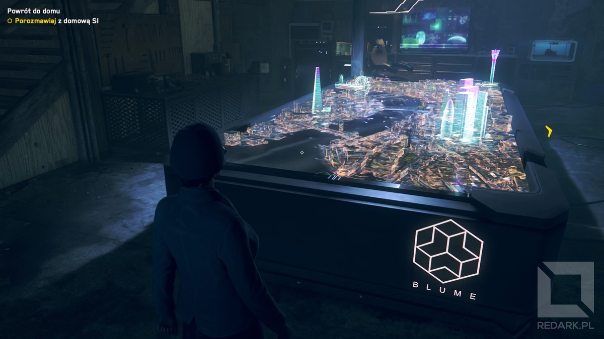
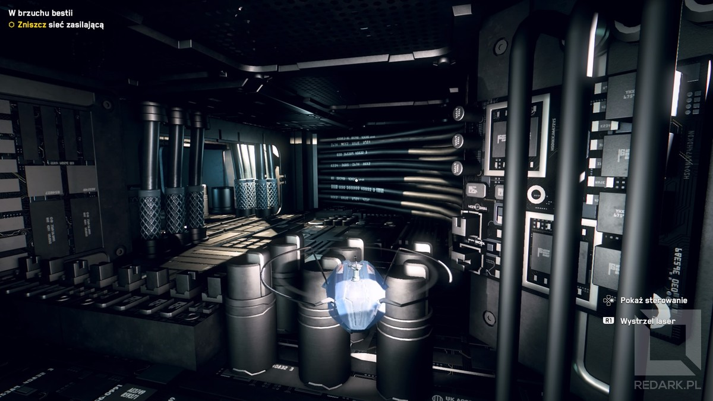
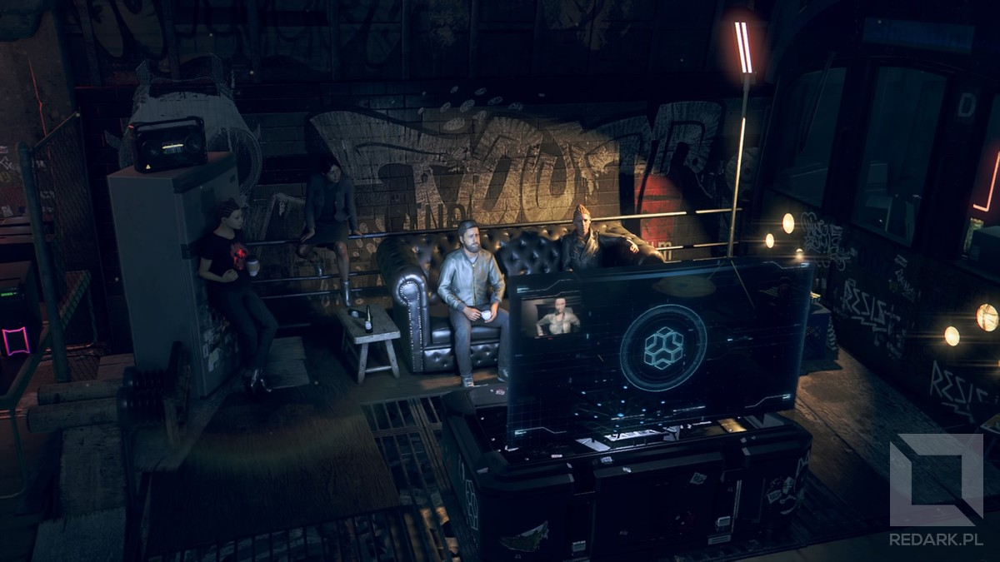
</Gallery>

Sama idea odbudowywania DedSecu poprzez rekrutację osób zajmujących różne stanowiska pracy jest super. Niestety kwestie dialogowe próbujące wytłumaczyć jakoś fakt rekrutacji nieznajomej osoby są tragiczne. Przykładowy dialog: "Witaj, widzę, że możemy Ci pomóc. Jesteś z DedSecu? Super, ostatnio w pracy potwornie się zatrułam. Kierownictwo kompletnie nie chciało mnie słuchać - zbadajcie to." Tak oto, po wymienieniu paru zdań, z nieznajomego spotkanego na ulicy stajemy się Państwową Inspekcją Pracy i szukamy dowodów na spisek pracodawców danej osoby. Niby fajnie, że gra próbuje to jakoś uzasadnić i nadać temu sens, ale losowa historia przedstawiona w kilku zdaniach, często wypada prostu śmiesznie, a nawet prowadzi do absurdów takich jak na przykład mistrz nielegalnych walk bokserskich, który mówi mi, że nie lubi przemocy...

<AdSense/>

Uwaga należy się też znajdźkom, którymi gra próbuje też po części opowiadać historię. Nic odkrywczego, wszak Ubisoft jest z tego znany. Problem w tym, że już w samym samouczku zostajemy poczęstowani chyba aż 6-cioma kilkuminutowymi nagraniami audio, które (uwaga) można odsłuchać tylko w menu! Co się tu stało?! Zarówno Watch Dogs 1, jak i 2, miały możliwość odsłuchiwania nagrań w tle za pomocą wirtualnego telefonu i aplikacji odtwarzacza. Legion postanowił z tego całkowicie zrezygnować i kazać nam na start siedzieć pół godziny w menu. Brawo Ubisoft, potraficie perfekcyjnie ciąć koszty.

<InfoBlock>
W trakcie pisania tej recenzji, deweloperzy wypuścili aktualizację do gry, która dodaje możliwość odsłuchiwania materiałów dźwiękowych w tle. Yey!
</InfoBlock>

## Mapa świata

<Gallery>
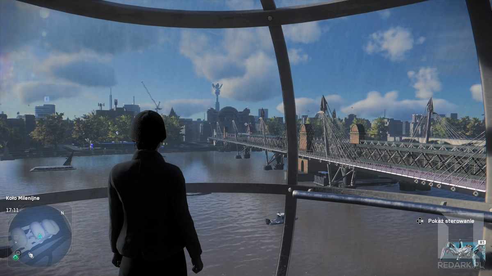
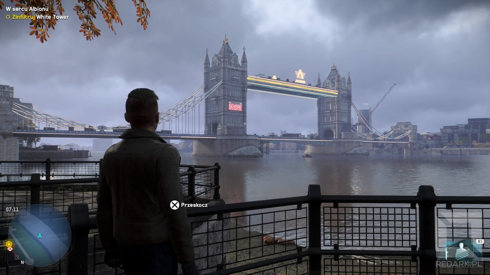

</Gallery>

Mapa Londynu przypomina mi bardzo Chicago z pierwszej części Watch Dogs. Uliczki są wąskie i szczegółowo wymodelowane, co cieszy oko. Akurat pod tym względem Ubisoft nigdy nie zawodził. Mapa nie jest duża i wypada słabo w porównaniu do San Francisco z drugiej odsłony serii, które urzekło mnie swoim rozbudowaniem i różnorodnością, ale jest okej. Widoki cieszą oko i to się liczy.

Londyn został podzielony na kilka dzielnic, w których mamy kilka pobocznych zadań do wykonania. Tutaj trzeba coś zepsuć, tam coś ukraść, a jeszcze gdzie indziej wyłączyć propagandowy bilbord. Gdy poziom kontroli Albionu spadnie do określonego poziomu, odblokowuje się misja specjalna. Wykonujemy ją, ludzie się cieszą, odpalają fajerwerki, a jakiś napotkany NPC mówi nam, jak bardzo nam dziękuje za wyzwolenie dzielnicy. Strasznie to sztuczne i naciągane. Bardzo przypominało mi to Just Cause 3 lub Infamous: Second Son, ale tam miało to chyba większy sens. Dodatkowo na przykład w takim Infamousie wyzwolenie dzielnicy powodowało chociażby zauważalne zredukowanie liczby patroli wrogich służb oraz większy entuzjazm mieszkańców - w Watch Dogs Legion nie zauważyłem żadnej różnicy. Tak jak mówiłem, nie widać tu tej rewolucji.

<Gallery>
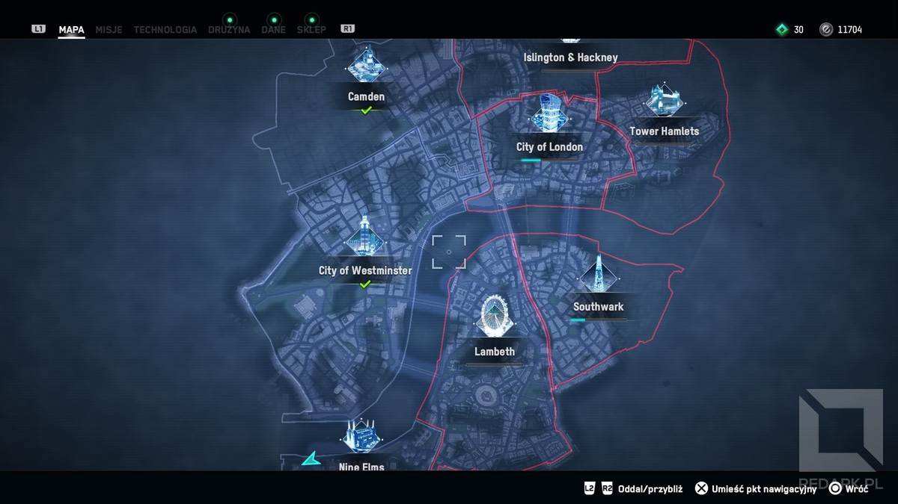
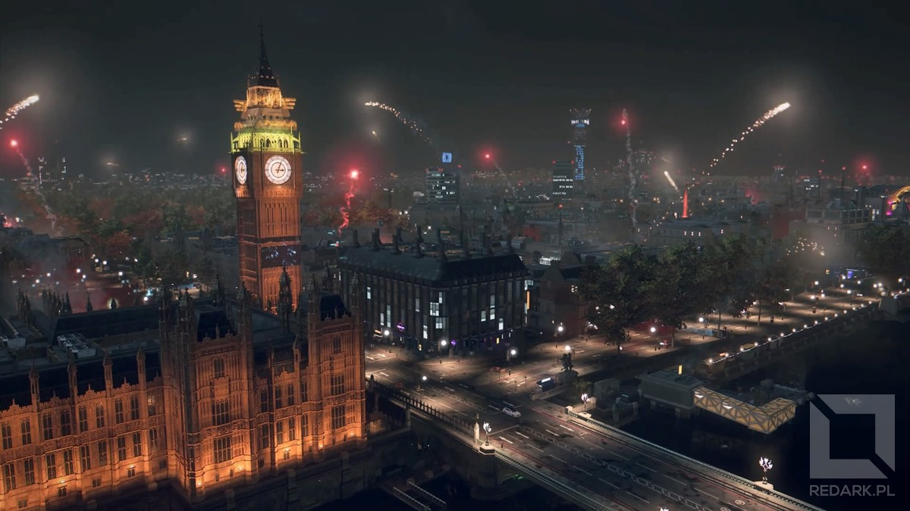
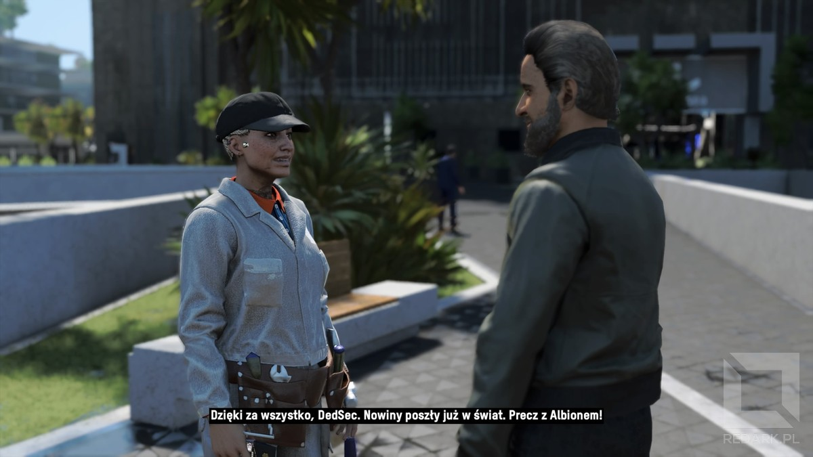
</Gallery>

Do sprawnego poruszania się po mieście wykorzystywać będziemy metro (jako punkty szybkiej podróży) oraz samochody. Te oczywiście są elektryczne i posiadają tryb jazdy autonomicznej. Gracz może go sam aktywować, ale jest on wolniejszy od staruszki z chodzikiem, więc raczej nie będziecie z niego korzystać. Sam model jazdy nie przypadł mi do gustu, ale seria Watch Dogs nigdy nie słynęła z przyjemnego prowadzenia aut. Samochody w Legionie to prawie niezniszczalne, latające, wyjące napędem elektrycznym mydelniczki obijające się o wszystkie budynki Londynu. Centrowanie kamery jest w nich tak agresywne, że nawet nie warto dotykać prawego analoga podczas ich prowadzenia. Nawet klakson jest zepsuty i reaguje z wyraźnym opóźnieniem na przycisk pada. Na szczęście stacje metra są gęsto rozsiane po mapie i znakomicie niwelują potrzebę jeżdżenia autami. Szkoda, bo przez to nie można podziwiać pięknie wymodelowanego Londynu.

<AdSense/>

## Postacie oraz sztuczna inteligencja

Sztuczna inteligencja naszych wrogów oraz przechodniów to tragedia. Wrogowie potrafią reagować w dziwaczny sposób, a nawet samoistnie wchodzić w stan zaalarmowania (nawet jak nic jeszcze nie zrobiłem w ich otoczeniu). Walka z Albionem to jest żart. Pościg "na jedną lub dwie gwiazdki" nie jest w stanie mnie dopaść nawet, jak stoję w miejscu, bo nie potrafią do mnie dotrzeć. Po zhackowaniu ich pojazdu kompletnie głupieją, a później jeżdżą w przód i tył, co po uderzeniu w kilka elementów powoduje wybuch kilku innych aut w wyniku reakcji łańcuchowej. Zdarzyło mi się kilka razy, że gdy hackowałem kamery terenu zastrzeżonego, nagle dostawałem komunikat, że jestem atakowany. Gdy wróciłem widokiem do mojej postaci, okazało się, że dostałem latającym samochodem, a obok mnie leży kilka martwych osób. Jeśli uważacie, że zmyślam, to zobaczcie to AI w akcji:

<YouTube id="qWl9H4jEX_8" title="Sztuczna inteligencja w Watch Dogs Legion"></YouTube>

Przejechanie żołnierza Albionu lub kilkunastu przechodniów praktycznie nie ma konsekwencji. Zdzielenie żołnierza kluczem francuskim, zamiast natychmiastowego ognia broni palnej powoduje, że reszta biegnie do mnie ochoczo, aby bić się ze mną na pięści. Punkty kontrolne z wieżyczkami Albionu rozsiane po całym mieście też nic nie robią. W takim Infamousie budziły one respekt i potrzebę ukrywania się z mocami przed żołnierzami, a tutaj generowały we mnie jedynie śmiech. Naprawdę, nie wiem, co trzeba zrobić w świecie gry, aby zesłać na siebie poważny pościg służb. W poprzednich częściach za dotknięcie przechodnia lub wyciągnięcie broni w miejscu publicznym natychmiast dało się dostać pościg policji. Tutaj wrogowie są po prostu ślepi i pozwalają okładać się np. kluczem francuskim.

## Hackowanie

To, co wyróżniało serię Watch Dogs na tle innych tytułów, to oczywiście hackowanie. Możliwość finezyjnego załatwienia kilku przeciwników naraz poprzez wykorzystanie znajdującej się na ich ciałach elektroniki. W pierwszym Watch Dogu każdy element miał do wykonania tylko jedną akcję, a ilość hackowań była ograniczana przez symboliczną baterię naszego telefonu. Watch Dogs 2 mocno rozbudował tę mechanikę i dodał aż cztery interakcje do obiektów. Ilość hackowań była ograniczana przez kołowy pasek naładowania sieci botnet. Domyślna akcja wykonywana była poprzez szybkie wciśnięcie przycisku, a reszta opcji była dostępna w menu kołowym, po przytrzymaniu przycisku. Naprawdę wspominam tę mechanikę z dużą przyjemnością, ponieważ była ona bardzo dobrze przemyślana, oferowała ogrom możliwości ataku i rozbudzała wyobraźnię.

<Gallery>
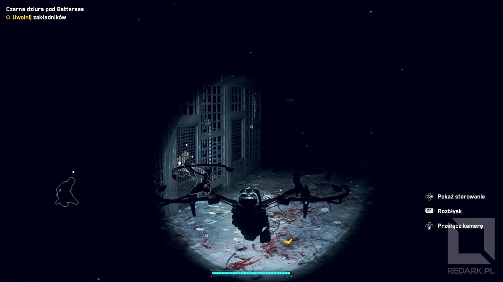
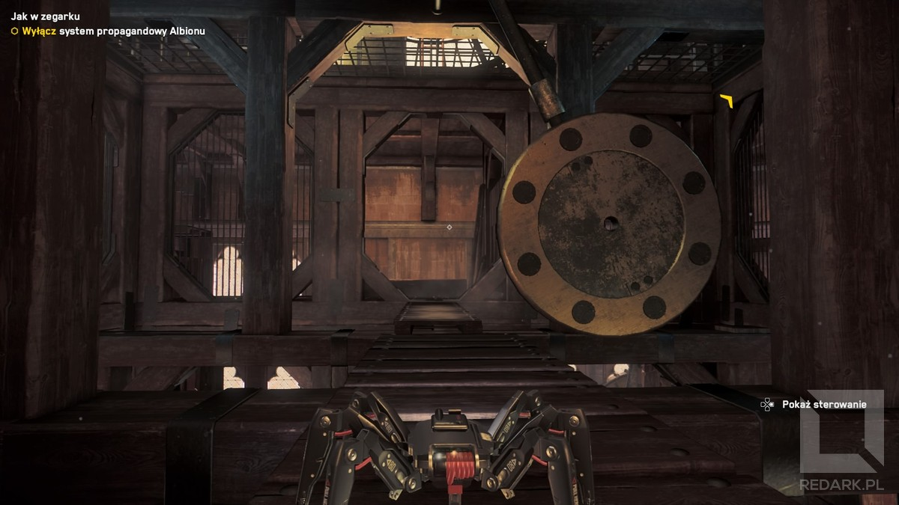
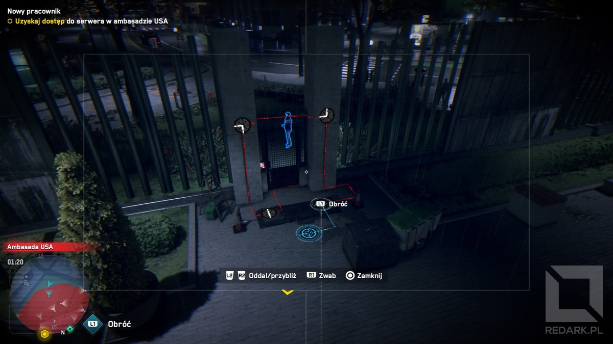
</Gallery>

Watch Dogs Legion kontynuuje schemat dwójki, ale wersję chyba po kastracji. 4-miejscowe menu hackowania często zawiera jedną lub dwie opcje, a licznik punktów botnetu został zastąpiony przez nieczytelne cooldowny (paski ładowania widoczne dopiero na poszczególnych opcjach w menu hackowania). Oberwało się nawet tak prozaicznemu obiektowi, jakim są drzwi automatyczne. W dwójce można było je oczywiście otwierać i zamykać, ale także blokować i uruchamiać melodyjki, które odwracały uwagę przeciwników. Dzięki temu można było podejść do misji bardzo taktycznie i blokować strony ataku potencjalnych wrogów. Legion zredukował to menu tylko do jednej opcji. Dlaczego?! Ja się pytam?! Drugim zarzutem jest domyślna akcja na krótkie przyciśnięcie przycisku hackowania. W dwójce była ona niezmienna, co umożliwiają wyrobienie sobie pamięci mięśniowej. Domyślna akcja dronów w WD Legion zależy od odległości, w jakiej się od nich znajdujemy. Jeśli jest on obok nas, to przejmujemy nad nim kontrolę, a jeśli jest daleko, to go wyłączamy. Podczas walki to było okej, bo pozwalało mi szybko usuwać pościg, ale dziesiątki razy wyłączyłem swojego drona transportowego zamiast się na niego przełączyć. Nie dość, że spadał on wtedy w dół, to jeszcze musiałem czekać, aż uruchomi się on ponownie, ponieważ mechanikę ponownego włączania urządzeń (która była w dwójce) również usunięto.

## Strzelanie, walka i rozwój postaci

Oprócz hackowania do naszych środków perswazji należy ponownie broń palna, która przeszła chyba większą kastrację, niż omawiane wcześniej hackowanie. Zarówno jedynka, jak i dwójka oddawała do naszych rąk calusieńki arsenał broni, który mogliśmy kupić w sklepie lub wydrukować w specjalnych drukarkach 3D. Watch Dogs Legion daje nam tylko parę nieśmiercionośnych pistolecików, które w dodatku dziwacznie odblokowujemy i ulepszamy w drzewku umiejętności, który notabene jest trochę mało rozbudowany i atrakcyjny. Broń śmiercionośna została zdegradowana tutaj do poziomu specjalnej umiejętności werbowanych NPC-ów.

Samo strzelanie też jest jakieś nijakie. Z jednej strony odrzut jest tak silny, że ciężko jest kogokolwiek trafić serią, a z drugiej strony mamy super silny aim assist, który dosłownie potrafi obrócić naszą kamerę, aby wycelować ją w przeciwnika. Alternatywą dla strzelania jest walka wręcz, która została rozbudowana i jest kierowana za pomocą trzech przycisków akcji. Postać potrafi wykonywać atak, przełamywać gardę oraz unikać ciosów przeciwnika. Ubisoft był tak dumny z tej mechaniki, że postanowił przekształcić cały Londyn w terytorium nielegalnych walk bokserskich, w których możemy zarobić trochę pieniędzy oraz znaleźć nowych rekrutów. Walka na tych arenach to jednak nic odkrywczego. Pojedynki nie dają żadnego wyzwania, a modele przeciwników co chwilę wesoło wbijają się w podłogę lub elementy otoczenia areny. Dodatkowo animacje ich rozpoczynania i kończenia ją tak sztampowe, że po paru razach nie mogłem na nie patrzeć.

<Gallery>
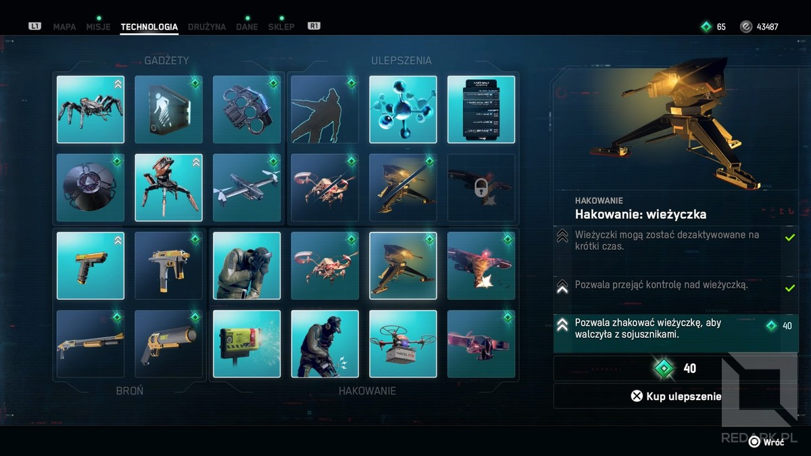
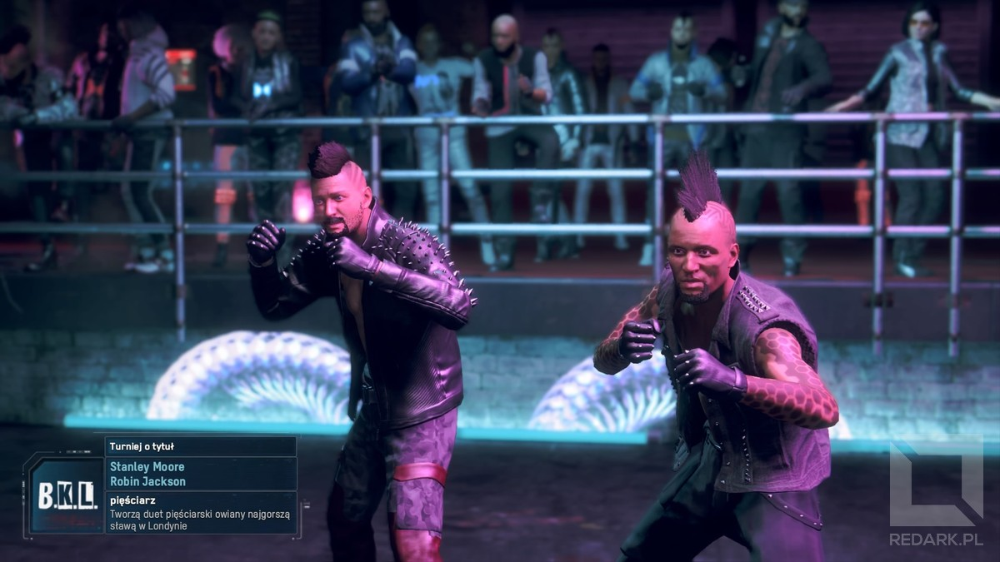
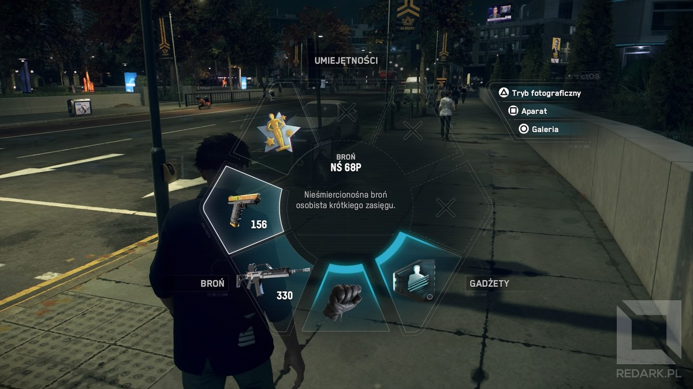
</Gallery>

Na chwilę uwagi zasługuje również wachlarz dostępnych opcji ataku na teren zastrzeżony. Twórcy ewidentnie chcieli wymusić na graczach potrzebę przełączania się między agentami DedSecu i każdej postaci dali możliwość noszenia zwykle 1 lub 2 typów broni oraz gadżetów. Rozumiem taki zabieg, ale spowodował on pewien problem. W Watch Dogs 2 postać posiadała szeroki wachlarz możliwości ataku, co bardzo dobrze przekładało się na "sandboxowość" gry i bawienie się mechanikami. W Legionie bywałem zmuszany do przerywania misji i wycofywania się z jej terenu, ponieważ nie miałem odpowiedniego gadżetu do jej wykonania. Problemem są też uniformy (lekarzy, ochroniarzy itd.), które powinny pomagać w poruszaniu się po terenie zamkniętym. Jednakże Ubisoft postanowił zablokować w nich możliwość kucania i chowania się za osłonami. W normalnych warunkach, gdy postać faktycznie chce się wtopić w tłum, jest to akceptowalne. Tylko że gdy nasza postać zostaje wykryta i strzela do niej 5 osób, a ona nie może się schylić, żeby nie pognieść sobie marynareczki dochodzi do absurdu. Dlatego w pewnych momentach po prostu zdejmowałem uniform z postaci przed misją, tylko po to, aby móc się normalnie poruszać i nie ryzykować jej permanentnej śmierci.

## Działanie gry

Na koniec wisienka na torcie, czyli działanie gry. Na początek dobrze informacje. Nie zauważyłem znacznych spadków ilości klatek animacji nawet podczas walki lub eksplozji, choć wentylator mojej PS4-ki wył jak szalony. To już koniec dobrych informacji - czas na złe. Po pierwsze interfejs gry jest znacznie mniej czytelny. Mówię tutaj zarówno o mapie Londynu, jak i HUD-ie gracza. Zrezygnowano z jakiegokolwiek paska ładowania limitującego hackowanie chociażby samochodów. Zrezygnowano z menu w formie telefonu. Interakcje raz się zatwierdza jednym przyciskiem, a innym razem drugim.

<AdSense/>

Kolejna sprawa to notoryczne bugi pojawiające się w świecie gry. Nieprzewidywane AI przeciwników, NPC-e biegający w kółko i wchodzący co chwile na skrzynie. Drony transportowe, które widziałem częściej bez załadowanych tekstur (w postaci kolorowych prostopadłościanów) niż z teksturami. Zbugowane są nawet napisy. Aby móc lepiej je czytać w trakcie akcji, postanowiłem je sobie powiększyć za pomocą ustawień gry. Szybko jednak wróciłem do standardowego rozmiaru, ponieważ jak się okazało, twórcy nie uwzględnili rozmiaru tekstu w pozycjonowaniu ich na ekranie, przez co linijki napisów zaczęły nachodzić na siebie. Kwintesencją stabilnego działania gry została sytuacja, w której moja agentka w trakcie skradania ni stąd ni zowąd, nie wiadomo dlaczego, trafiła do szpitala. Dobrze, że gra zinterpretowała to tylko jako lekką ranę, bo przez opcję permanentnej śmierci, straciłbym agentkę na dobre.

<Gallery>
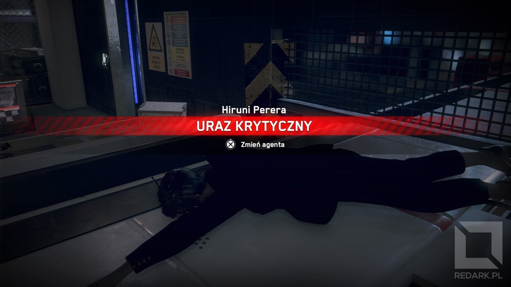
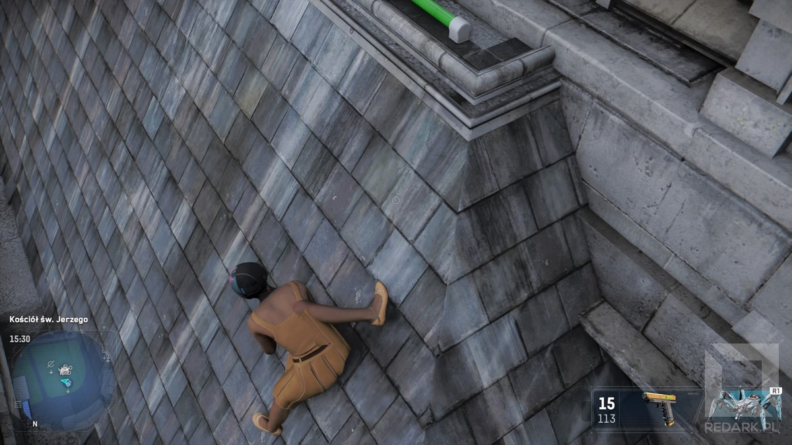
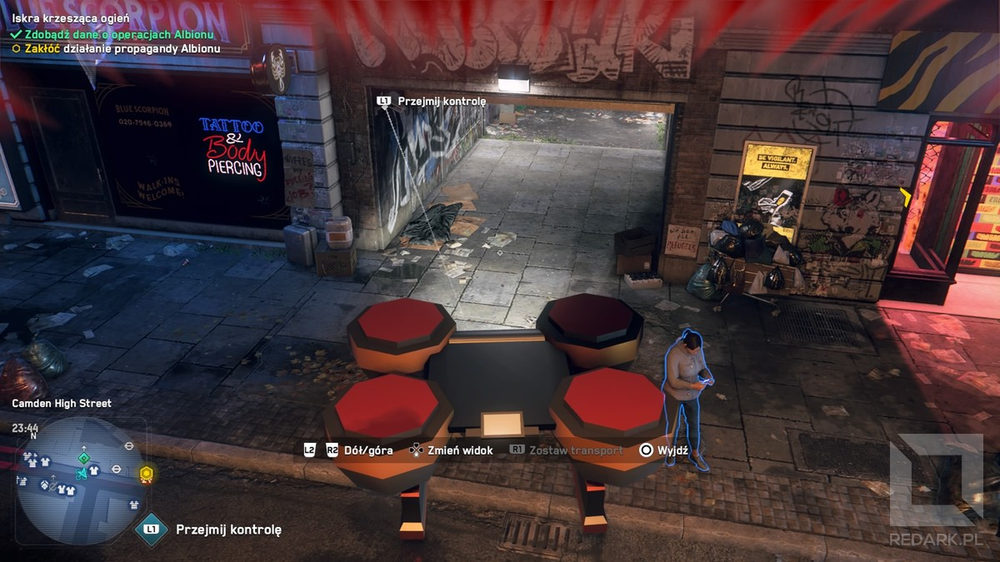
</Gallery>

Po trzecie gra co chwilę karmi gracza ekranami ładowania, które w dodatku wcale nie są krótkie. Nawet wejście do kryjówki powoduje chwilowe zawieszenie się ekranu i pojawienie się ekranu ładowania. W Watch Dogs 2 pamiętam, że jakoś udało się im uniknąć ładowania plików animacją Markusa, który musiał wklepać kod do drzwi i pokazać swoją twarz do kamerki. Tam potrafili to elegancko zrobić, a tutaj poszli na łatwiznę.

Na koniec trzeba zaznaczyć, że gra notorycznie "wywala się do pulpitu", o ile można tak powiedzieć grając na konsoli. Dzieje się to najczęściej podczas wychodzenia z gry lub kończenia misji, czyli akurat wtedy, gdy następuje zapis postępu naszej gry. Mówiąc krótko: gra przypomina mi stan Assassin's Creed Unity zaraz po premierze.

## Podsumowanie

Podsumujmy sobie losy serii Watch Dogs. Pierwsza część posiadała najlepszy klimat, drętwego głównego bohatera oraz mało rozwinięte mechaniki. Choć nie było to dzieło sztuki, to tytuł się bronił i zyskał swoich sympatyków. Druga część serii poprawiła błędy poprzednika. Ogrom opcji hackowania i walki sprawiał, że z przyjemnością bawiłem różnymi sposobami wykonywania misji. Może klimat dwójki nie spodobał się fanom mrocznej jedynki, ale moim zdaniem twórcy bardzo dobrze wykreowali tamten świat przedstawiony. Mapa San Francisco była ogromna i genialnie zaprojektowana. Zbieranie na niej znajdziek, to była przyjemność. Jedyną wadą, jaką pamiętam, było chyba zakończenie fabuły, które było dziwne i mało satysfakcjonujące, ale w ogólnym rozrachunku druga część była genialna. Tutaj dochodzimy już do trzeciej części o podtytule Legion.

Choć gry z serii Watch Dogs miały swoje niedoskonałości, to moim zdaniem nawet się broniły. Legion ewidentnie padł niestety ofiarą typowego dla Ubisoftu cięcia kosztów i przedwczesnej premiery. Tytuł naprawdę miał szansę zaskoczyć graczy nietypową mechaników rekrutowania NPC-ów, ale jego premiera zdecydowanie odbyła się za wcześnie. Rażące liczne błędy, nijaka fabuła, słabe AI oraz niestabilność gry sprawiają, że uważam Legion za najsłabszą część trylogii Watch Dogs. Zdecydowanie ten tytuł powinien się ukazać dopiero w przyszłym roku, a nie być idiotycznie wypuszczanym na silę tuż przed premierą Assassin's Creed Valhalla - gry o znacznie większym budżecie i w dodatku pochodzącej od tego samego wydawcy! Ubisoft miał szansę zrobić z Watch Dogs swoją kolejną dochodową serię gier, a tymczasem co chwilę rzuca jej kłody pod nogi. Oby tylko Legion nie okazał się jej gwoździem do trumny.

Czy polecam zagrać w Legion? Może kiedyś, ale na pewno nie teraz. Twórcy powinni naprawić w niej masę błędów, a cena pudełka z grą musi znacząco spaść.
