Często spotykam się z sytuacją, w której ktoś chce dać nowe życie swojemu staremu laptopowi. Taki sprzęt można zmodyfikować (odświeżyć) na dwa sposoby. Pierwszym z nich jest rozbudowa [pamięci RAM](/pamieci-ram). Obecne minimum to 8 GB, a najlepsze jest 16. Przyniesie to ogromne rezultaty, gdy mamy w zwyczaju otwierać dużo różnych aplikacji jednocześnie. Niestety ze względów konstrukcyjnych, pamięć RAM w laptopach bardzo często ciężko jest rozbudować, o ile w ogóle się da. W tym wypadku na pomoc przychodzi druga modyfikacja, czyli instalacja dysku półprzewodnikowego SSD.

## Dlaczego dysk SSD?

Choć dyski talerzowe HDD są nadal chętnie wykorzystywane w komputerach, to niestety czasy, w których potrafiły udźwignąć ciężar systemu operacyjnego już przeminęły. Najpopularniejszy obecnie system operacyjny - Windows 10 - już praktycznie nie potrafi działać na dyskach HDD. Laptop z takim nośnikiem po paru tygodniach może się kompletnie zawieszać, uruchamiać po 5-10 minut oraz pojawią się pierwsze problemy z działaniem niektórych procesów w tle. Powiedzmy to jasno: **Windows 10 do normalnego działania wymaga dysku SSD**. Wyposażenie w niego laptopa, to podstawowa czynność, która w większości przypadków, da urządzeniu drugie życie.

## Jak montowany jest dysk w laptopach

Dysk w laptopach może być zamontowany na kilka różnych sposobów. Najczęściej spotykanym w laptopach rozwiązaniem jest dysk o rozmiarze 2,5 cala montowany w gnieździe SATA. Taki dysk można podmienić na SSD praktycznie z zamkniętymi oczami - wystarczy wyjąć stary HDD i włożyć nowy SSD - nic więcej! Drugi typ, to dyski montowane w gnieździe M.2. Mają one postać płaskich, wąskich i podłużnych płytek wsuwanych pod kątem do gniazda laptopa. Gniazdo M.2 jest przeznaczone tylko dla dysków SSD i występuje często w parze obok standardowego gniazda SATA, o którym mówiłem przed chwilą. Przykłady dysków do obu typów gniazd znajdziecie poniżej:

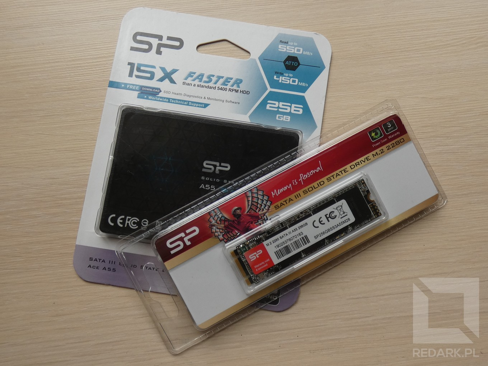

<ImageDescription>Na zdjęciu dwa dyski SSD - duży SATA 2.5" oraz mały na port M.2</ImageDescription>

Nie będę w tym artykule skupiał się na kwestiach doboru odpowiednich dysków do laptopów. Wszelkie potrzebne informacje dotyczące ich parametrów znajdziecie w dedykowanych do tego artykułach podlinkowanych poniżej.

<LayoutContainer>
<LayoutColumn><ActionButton to='/dyski-ssd-m2'>Dyski SSD M.2</ActionButton></LayoutColumn>
<LayoutColumn><ActionButton to='/nosniki-pamieci-dyski-hdd-ssd'>Dyski HDD/SSD 2.5"</ActionButton></LayoutColumn>
</LayoutContainer>

## Jak wymienić dysk HDD na SSD krok po kroku

Przejdźmy do działania. Aby zobrazować możliwe scenariusze wymiany dysków, na warsztat wziąłem dwa różne modele laptopów. Ponadto zakupiłem dwie różne kieszenie na wymieniane dyski 2,5 cala. Kieszeń jest to potoczna nazwa na specjalną obudowę, w którą możemy włożyć stary dysk laptopa i podpinać go później za pomocą gniazda USB, jakby był to zwykły pendrive. Pozwoli to na późniejsze łatwe przenoszenie danych ze starego systemu operacyjnego.

<AdSense/>

## Modernizacja laptopa HP ProBook 440 G3

Zacznijmy od laptopa HP ProBook 440 G3. Model ten wyposażony jest w gniazdo SATA z dyskiem talerzowym 500 GB oraz wolne gniazdo M.2. Modernizacja będzie polegać na zainstalowaniu w nim dysku M.2 oraz wyjęciu starego dysku HDD i zamontowaniu go w kieszeni 2,5 cala. Dysk to Silicon Power A55 o pojemności 256 GB, a za kieszeń posłuży chyba najtańszy model dostępny na rynku, czyli Gembird USB 3.0 2,5" enclosure. Zacznijmy od otwarcia laptopa.

### Otwarcie laptopa

<Gallery>
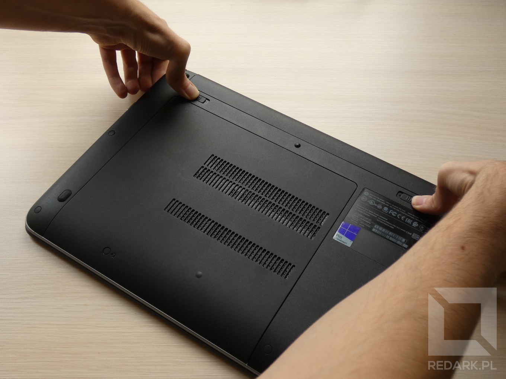
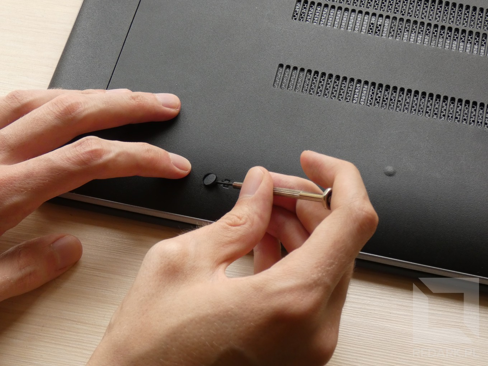
</Gallery>

Na początek kładziemy urządzenie do góry nogami. Następnie dla bezpieczeństwa odłączamy od niego ogniwo baterii. Po jednoczesnym naciśnięciu na oba suwaki, ogniwo samo wyskoczy z gniazda, choć czasami trzeba użyć do tego odrobiny siły. Poniżej baterii znajdują się duże drzwiczki serwisowe urządzenia. Są one przytrzymane jedną śrubką znajdującą się pod gumową zaślepką u dołu urządzenia. Zaślepkę należy podważyć, a śrubkę odkręcić śrubokrętem. Następnie odciągnąć klapkę do dołu i odsłonić podzespoły komputera.

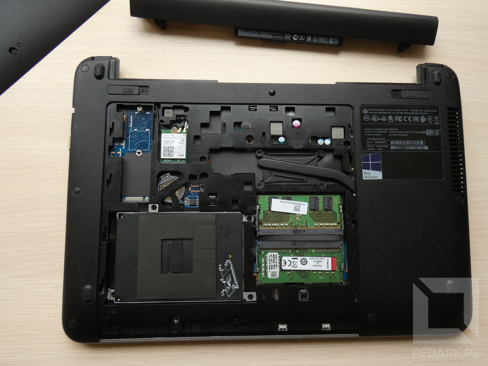

W górnym lewym rogu widzimy puste podłużne gniazdo M.2, w którym za chwilę zamontujemy dysk SSD. Obok niego znajduje się karta sieciowa Wi-Fi oraz bateria podtrzymująca datę i godzinę. Poniżej gniazda M.2 widzimy już duży dysk 2,5 cala, natomiast po prawej znajdują się dwa moduły pamięci RAM oraz widoczna rurka cieplna odprowadzająca ciepło z powierzchni procesora.

### Montaż dysku M.2

Montaż dysku SSD zaczynamy od odkręcenia znajdującej się w laptopie śrubki mocującej. Po tej czynności możemy wsunąć dysk do gniazda M.2 pamiętając o kilku zasadach:

1. Dyski M.2 są podatne na wyładowania elektrostatyczne, dlatego przed pracą zdejmujemy z siebie wszelkie elektryzujące się ubrania takie jak np. swetry,
2. Staramy się unikać dotykania palcami elementów na płytkach drukowanych dysków i chwytamy je (w miarę możliwości) jedynie za krawędzie płytki,
3. Zwracamy uwagę na poprawną orientację dysku względem gniazda M.2 - jedno wycięcie ma 6 styków, a drugie 5 styków,
4. Dyski M.2 wchodzą do gniazda pod kątem około 30 stopni, a nie poziomo i będą sprężynować podczas ich dociskania (patrz zdjęcie poniżej).

<Gallery width='2'>
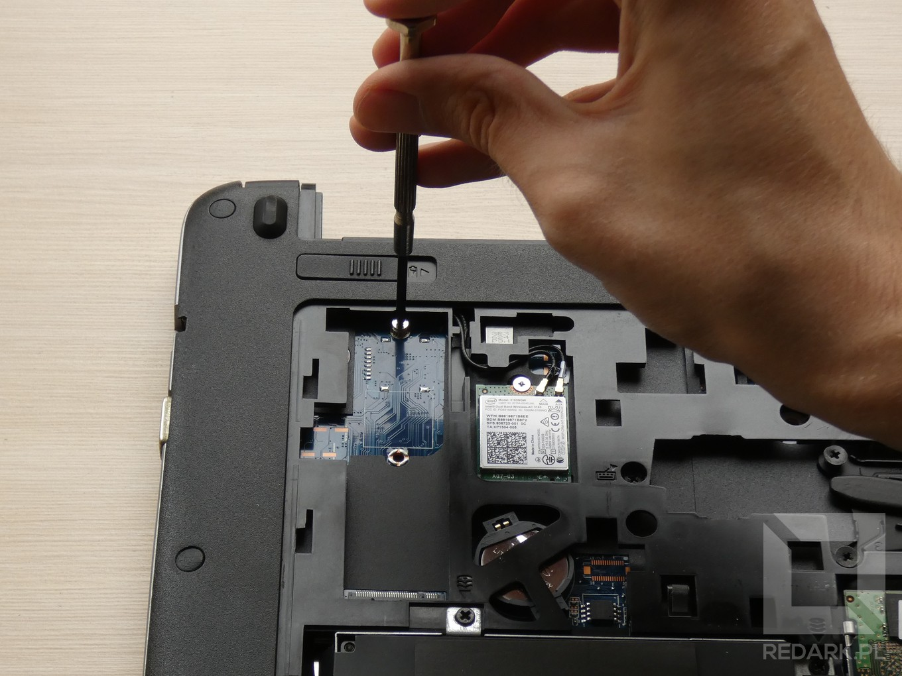
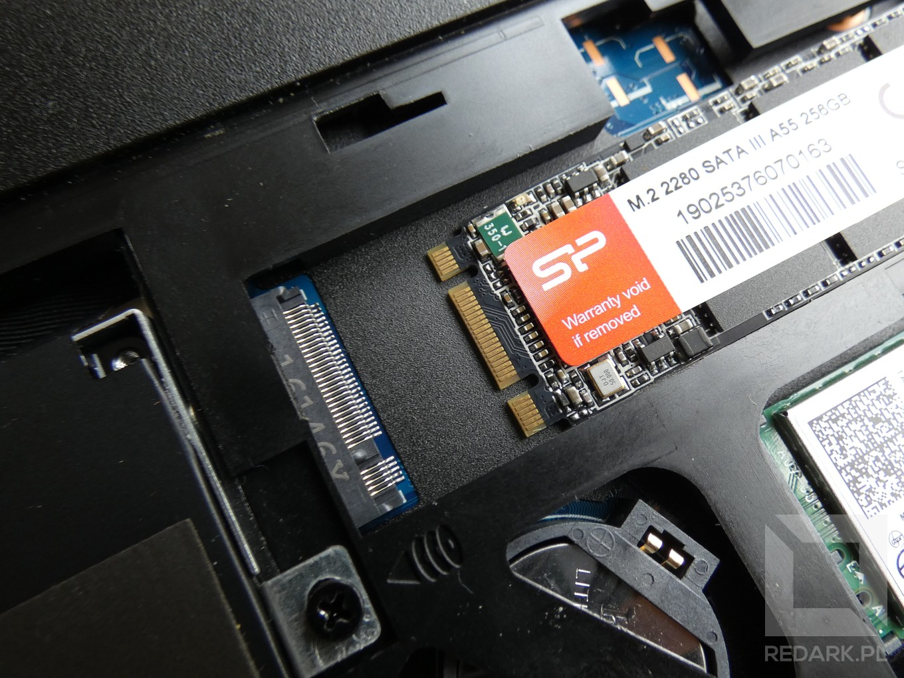
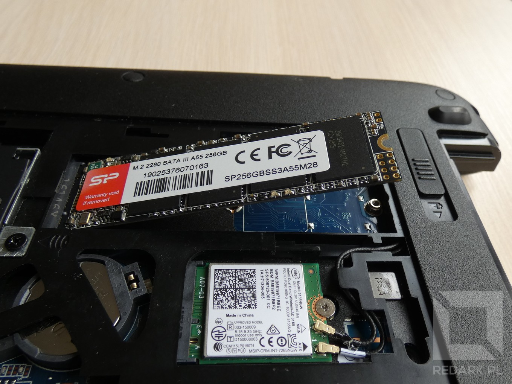
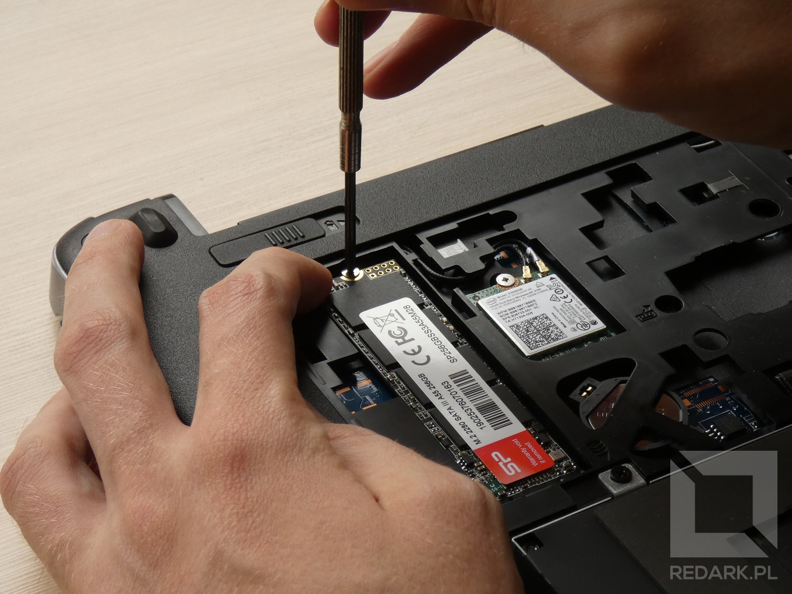
</Gallery>

Po włożeniu dysku do gniazda M.2, należy docisnąć je do poziomu i unieruchomić odkręconą wcześniej śrubką montażową. Po tej czynności dysk M.2 jest już zamontowany i możemy przejść do demontażu starego dysku HDD.

### Demontaż starego dysku HDD

Aby wymontować dysk 2,5 cala, należy odkręcić cztery śruby znajdujące się na srebrnej ramce wokół niego. Gdy zostaną usunięte, należy wykorzystać "papierowy język" znajdujący się na środku dysku, by podważyć go LEKKO do góry. Gdy uniesie się on ponad swoją wnękę, należy wysunąć go z gniazda SATA, czyli w przypadku tego modelu, w lewą stronę.

<Gallery width='2'>
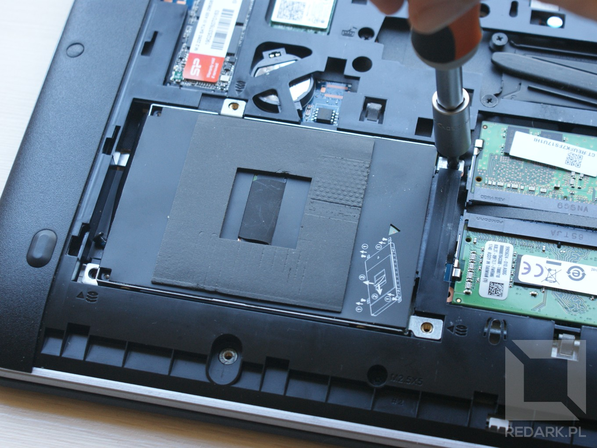
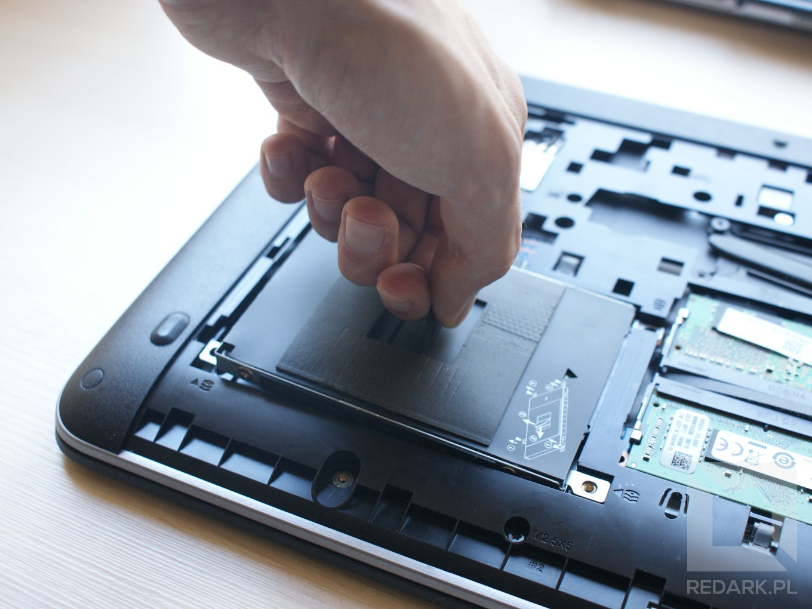
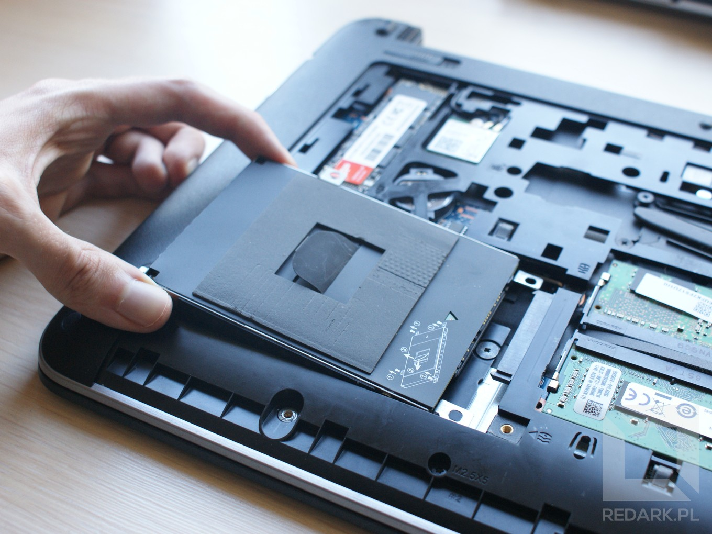

</Gallery>

Po zdemontowaniu dysku należy usunąć jeszcze ramkę mocującą. W tym celu należy odkręcić kolejne cztery śruby znajdujące się na krawędziach dysku. Pustą ramkę można zamontować z powrotem w laptopie, a cztery niepotrzebne śruby od dysku można zapakować do woreczka strunowego i zachować do przyszłego majsterkowania. Po tym zabiegu montujemy drzwiczki serwisowe w laptopie, przykręcamy je śrubę montażową i wsuwamy z powrotem ogniwo baterii.

### Kieszeń na dysk Gembird

Na koniec pozostało nam jeszcze załadować stary dysk do kieszeni Gembirda. W zestawie znajdziemy samą obudowę, cienki futerał, kabel USB 3. generacji, mini śrubokręt, zestaw śrubek oraz instrukcję. Montaż dysku jest banalnie prosty. Podłączamy kontroler do dysku, a następnie wsuwamy całość do obudowy. Na koniec przykręcamy dwie mikroskopijne śrubki trzymające całość ze sobą.

<Gallery>
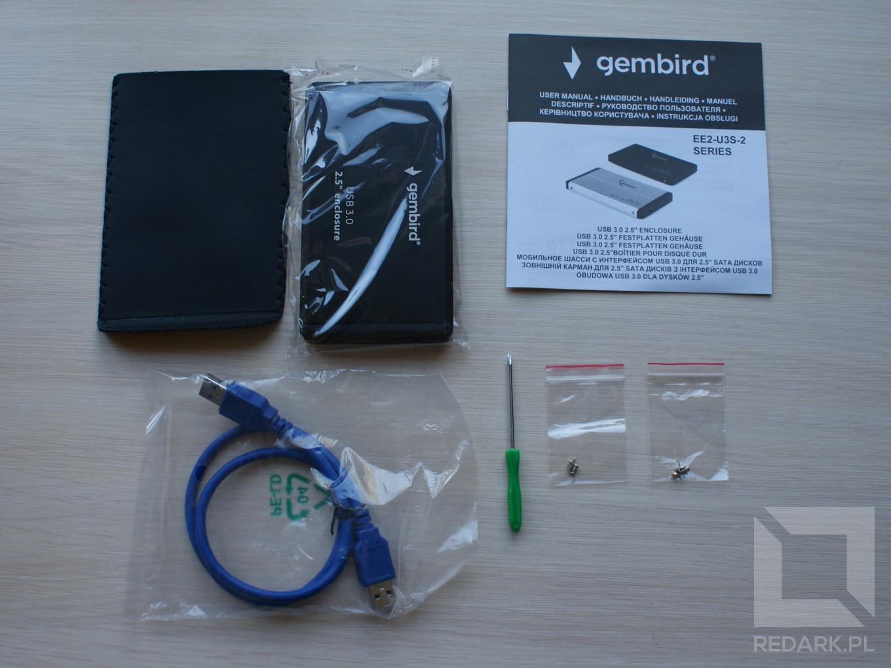
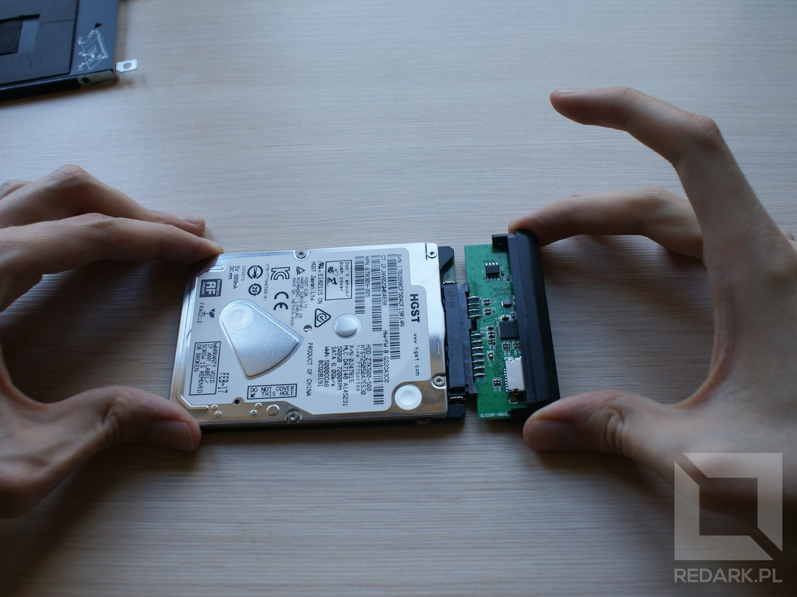
</Gallery>

<AdSense/>

## Modernizacja laptopa Acer ES1-131

Czas na drugiego zawodnika, którym jest kompaktowy Acer ES1-131 z ekranem 10 cali. Ten model wyposażony jest tylko i wyłącznie w gniazdo SATA 2,5 cala. Modernizacja będzie polegać na wymianie dysku talerzowego na SSD Goodram CX400 o pojemności 512 GB oraz przełożeniu dysku HDD do kieszeni od Silver Monkey dostępnej w sklepie [x-kom](https://x-kom.pl).

### Otwarcie laptopa i podmiana dysku

Tak jak mówiłem, Acer jest laptopem kompaktowym, więc dostęp do jego wnętrza jest trochę trudniejszy, niż w przypadku HP-ka. Cały jego spód to jednoczęściowa pokrywa, która trzymana jest przez 13 śrub. Musimy odkręcić je wszystkie i zalecam wyposażyć się do tego w mały pojemniczek, aby żadnej z nich nie zgubić! Następnie należy odgiąć klapkę tak, aby wyskoczyła z zaczepów. Polecam chwycić w okolicach gniazda Ethernet, ewentualnie użyć plastikowego dowodu tożsamości lub innej karty z portfela. Po otworzeniu laptopa zobaczymy dysk, płytę główną oraz baterię. Dla zainteresowanych: w tym modelu pamięć RAM oraz procesor wraz z chłodzeniem pasywnym (bez wentylatorów) znajduje się po drugiej stronie płyty głównej.

<Gallery width='2'>

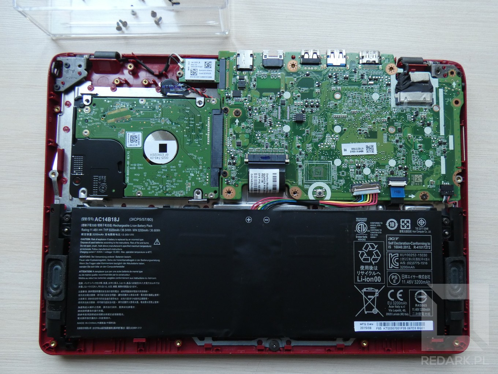
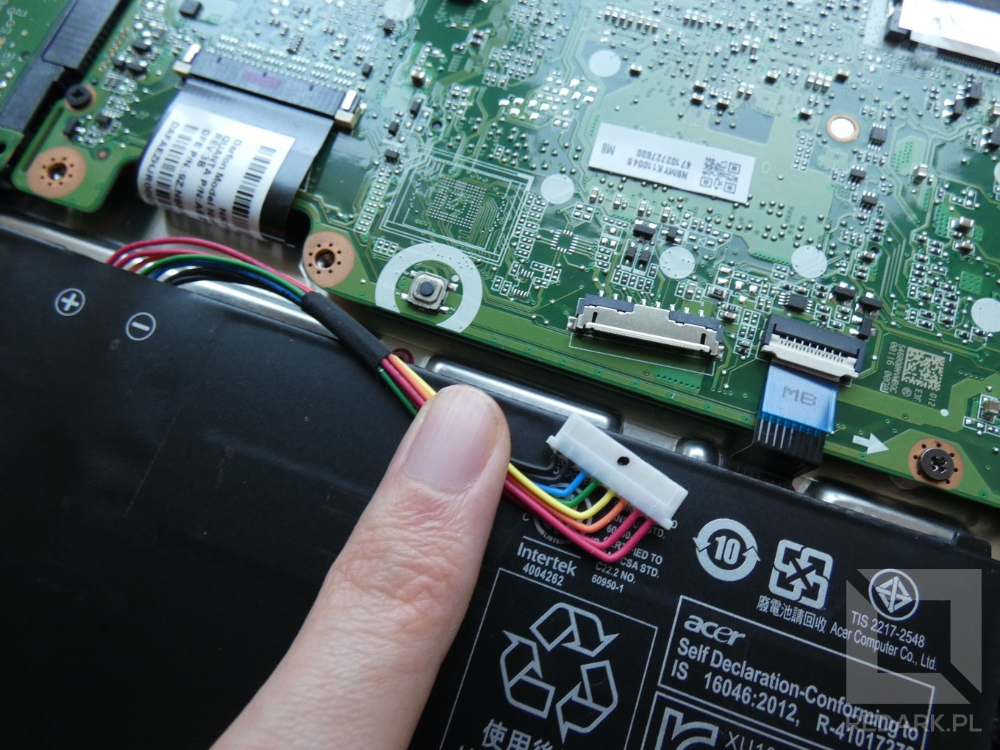

</Gallery>

Zanim zaczniemy demontaż dysku, odłączmy płytę od zasilania. W tym celu wypinamy wtyczkę wiązki kabli idących od ogniwa baterii. W tym modelu dysk nie posiada żadnych śrubek oraz sanek mocujących. Wystarczy go chwycić i wysunąć z gniazda. Następnie należy rozpakować dysk SSD i wsunąć go w to samo miejsce. Na koniec (bardzo ważne!) podłączamy ponownie baterię do płyty głównej i zamykamy obudowę laptopa. Pamiętajmy, aby sprawdzić, czy wszystkie zaczepy klapki dobrze zaskoczyły oraz nie odstają od obudowy i dopiero wtedy przykręcajmy wszystkie śrubki.

### Kieszeń na dysk Silver Monkey

Czas jeszcze zadbać o osierocony dysk HDD. W pudełku Silver Monkey znajdziemy znacznie mniej akcesoriów, niż w przypadku Gembirda. W zestawie pojawiła się dwuczęściowa obudowa, kabel USB 3. generacji oraz woreczek ze śrubkami i gumowymi nóżkami. Montaż dysku tutaj też jest banalnie prosty. Dysk podpinany do kontrolera obudowy. Klapkę zamykamy i przykręcamy ją czterema śrubkami od spodu, które mogą zostać dodatkowo zakryte za pomocą dołączonych do zestawu gumowych zaślepek.

<Gallery width='2'>

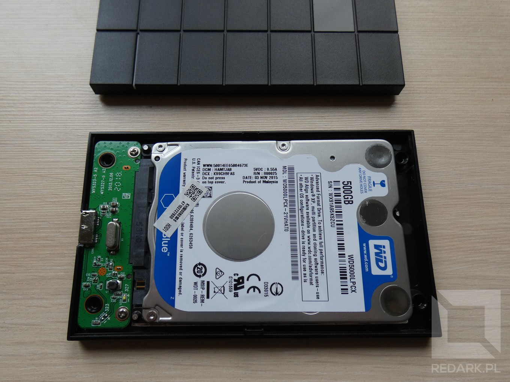
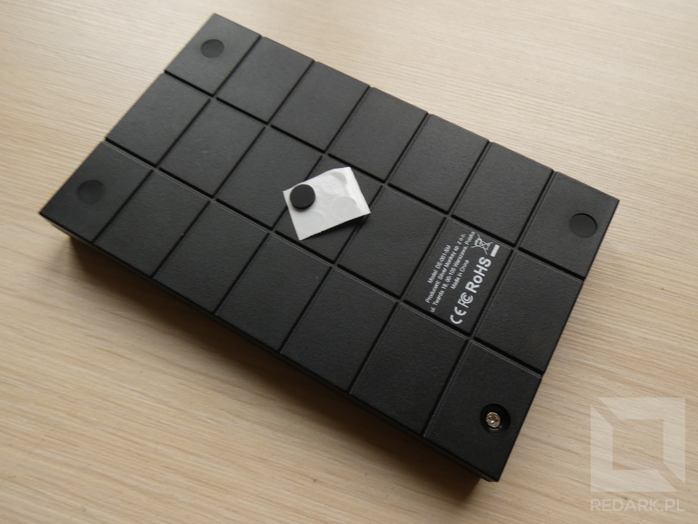
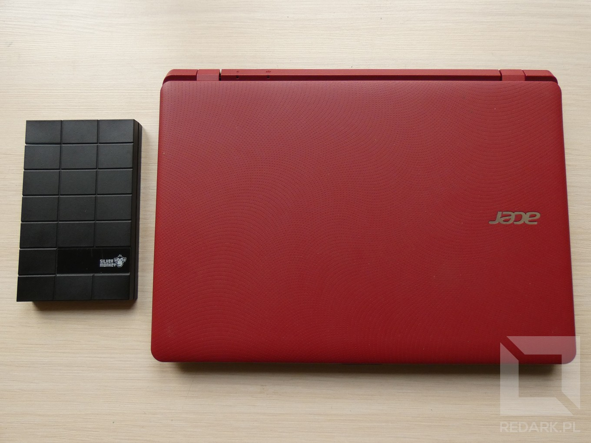
</Gallery>

<AdSense/>

## Ocena kieszeni na dyski

Kieszenie na dyski 2,5 cala mogą w bardzo łatwy sposób dać drugie życie wymontowanym z laptopów dyskom talerzowym. Idealnie sprawdzą się do robienia kopii bezpieczeństwa lub trzymania zdjęć i filmów z wakacji. Porozmawiajmy jeszcze o jakości obydwu modeli. Kieszeń Gembirda jest najtańsza na rynku, kosztuje tylko 20-30 złotych, co widać i czuć. Futerał wykonany jest z dziwnej gumy śmierdzącej na kilometr chińską fabryką, dołączonym do zestawu śrubokrętem można sobie jedynie oko wykuć, a sama obudowa nie miała odpowiedniej długości - dysk był wciskany przeze mnie na siłę, aby dało się przykręcić śrubki montażowe. Sam kabel USB jest sztywny i mało poręczny, ale działa. Reasumując: kieszeń jest okej, ale jej jakość jest adekwatna do ceny.

<Gallery>
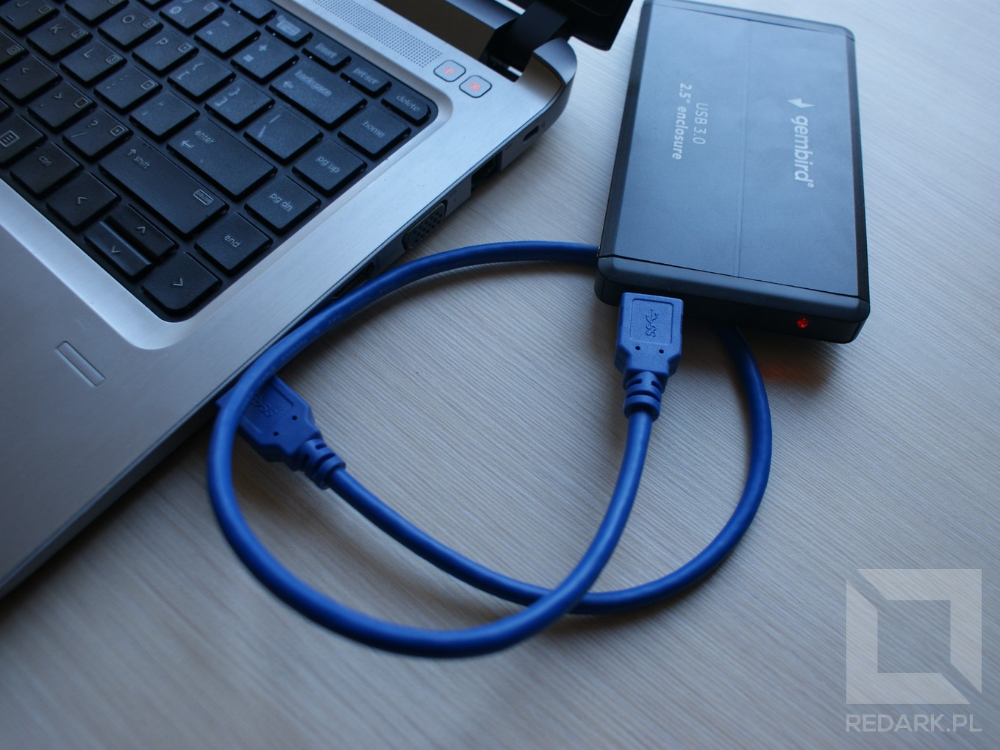
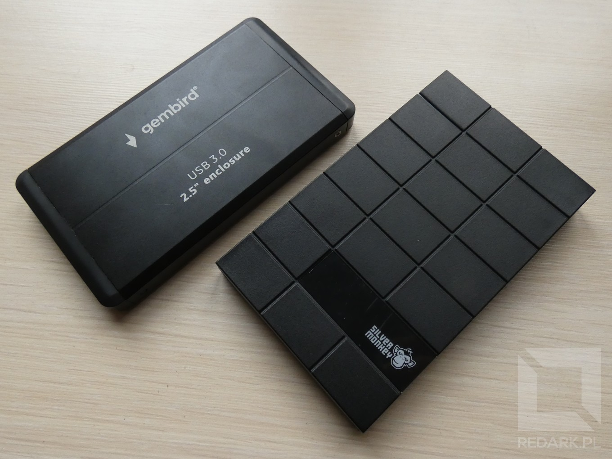
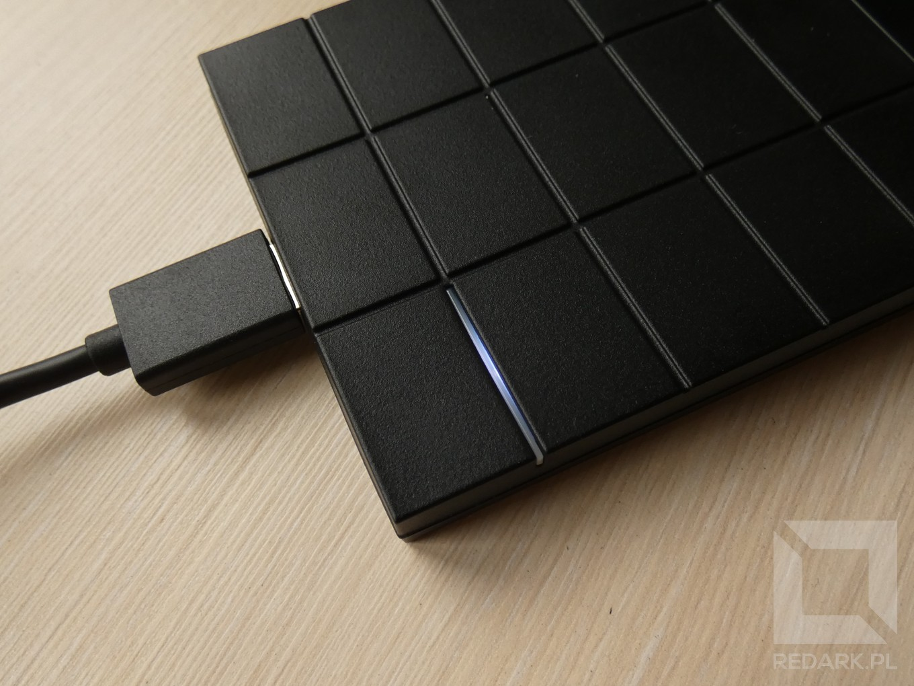
</Gallery>

Obudowa Silver Monkey kosztuje 40-50 złotych i jej elementy są na pewno lepszej jakości oraz posiadają lepsze spasowanie. Nie musiałem tutaj na silę dociskać dysku. Zastosowany plastik nie śmierdzi, a kabel USB jest znacznie bardziej giętki i elegancki. Jako wadę uważam lekkie zarysowania błyszczącego plastiku, ale może to być jedynie wada mojego egzemplarza. Plus za ciekawy design obudowy, subtelną diodę zasilania oraz niedorzucanie zbędnych akcesoriów o beznadziejnej jakości.

Tak oto prezentuje się jakość najtańszych na rynku kieszeni na dyski 2,5 cala. Spełniają one swoje zadanie, ale nie dorównują jakością wykonania obudowom z fabrycznie zainstalowanymi dyskami. Na powyższym zdjęciu widać dysk zewnętrzny Toshiby o pojemności 1 TB, który zakupiłem dawno temu do robienia kopii bezpieczeństwa. Obok znajduje się też zakupiony osobno porządny futerał, który zabezpiecza nośnik przed uderzeniami w czasie podróży. Warto się w taki wyposażyć, jeśli dane trzymane na dysku są bardzo cenne.

## Podsumowanie

Wymiana dysku w laptopie to nie jest czarna magia i mam nadzieję, że pokazane tutaj przykłady przekonały Cię do tego. Podmiana dysku HDD na SSD z pewnością przywróci do życia niejeden zakurzony laptop, który nie mógł już się uruchomić. Jeśli masz jakieś problemy lub wątpliwości z wymianą dysku w swoim laptopie, napisz o tym w komentarzach poniżej. Zapraszam również do [tego artykułu](/instalacja-systemow-windows-oraz-linux-krok-po-kroku), w którym pokazuję krok po kroku, jak zainstalować na nowym dysku system Windows lub Linux. Na koniec zaprezentuję Ci jeszcze jeden bardzo ciekawy sposób modernizacji laptopów, który możesz wykorzystać, jeśli Twój model posiada napęd płyt CD/DVD.

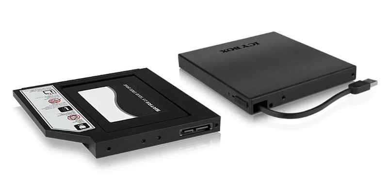

<ImageDescription>Adapter ICY BOX, źródło: x-kom.pl</ImageDescription>

Na rynku dostępne są specjalne adaptery umożliwiające montaż dodatkowego dysku 2,5 cala w miejscu napędu optycznego laptopa, który nie ukrywajmy, jest już bardzo rzadko używany w dzisiejszych czasach. Dodatkowo niektóre zestawy mają jeszcze dołączoną specjalną obudowę na wymontowany napęd optyczny. Jej zadanie jest dokładnie takie samo, jak omawianych dzisiaj kieszeni na dyski HDD. Pozwalają one dalej użytkować stary element laptopa (napęd optyczny) poprzez podpinanie go za pomocą kabla USB. Dzięki temu zyskujesz dodatkowe miejsce na dysk w laptopie oraz uniwersalny napęd optyczny na USB. Wilk syty i owca cała :)
