import AssemblingPcFooter from '../../typography/assemblingPcFooter'

W [poprzednim rozdziale](/skladanie-pc-tworzymy-stanowisko-monterskie) kursu składania PC omówiłem aspekty dobierania podzespołów i organizowania stanowiska pracy. Dziś przejdziemy do właściwego montażu komputera, a naszym pierwszym zadaniem będzie montaż podzespołów na powierzchni płyty głównej: procesora, pamięci RAM oraz dysku SSD.

## Przygotowanie płyty głównej oraz procesora

Płyta główna to MSI B450 Tomahawk Max. Jest to model wykonany w standardzie ATX posiadający gniazdo dla procesorów AMD - AM4. W pudełku znajdziemy zestaw instrukcji, płytkę ze sterownikami, naklejki, zaślepkę tylnych portów, dwa kable sygnałowe SATA, śrubkę do dysków M.2 oraz rzecz jasna, samą płytę główną umieszczoną w folii antystatycznej. Na czas montażu podzespołów pozostawię płytę wewnątrz jej kartonowej wytłoczki. Nie jest to może super stabilne podłoże do pracy, ale zapewni bezpieczeństwo samej płyty.

<Gallery>
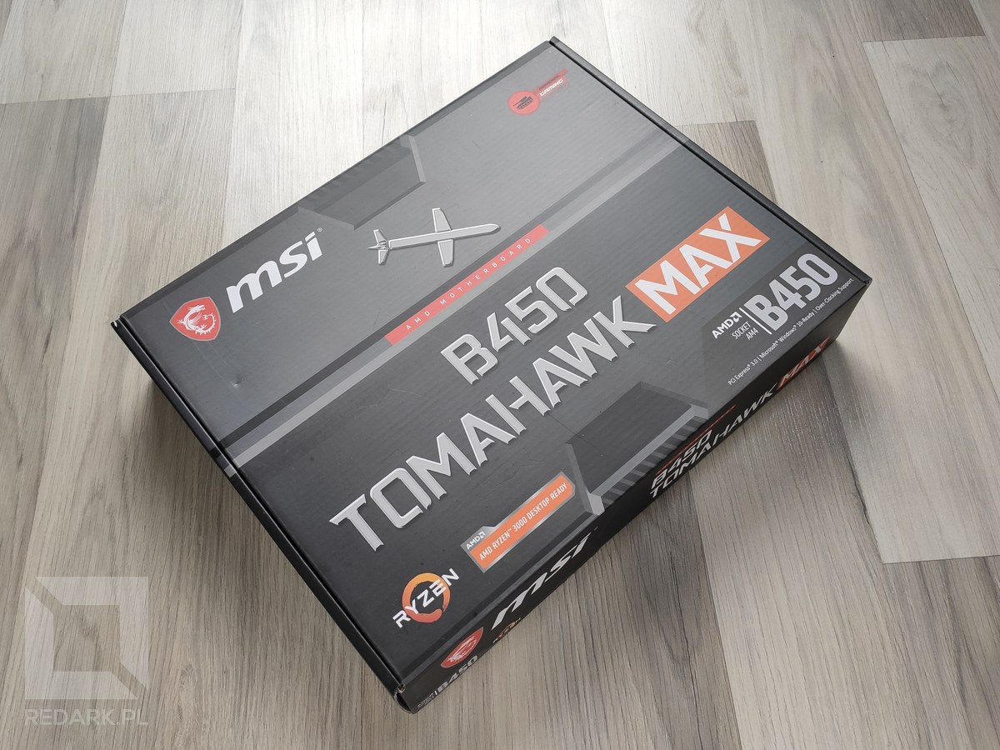
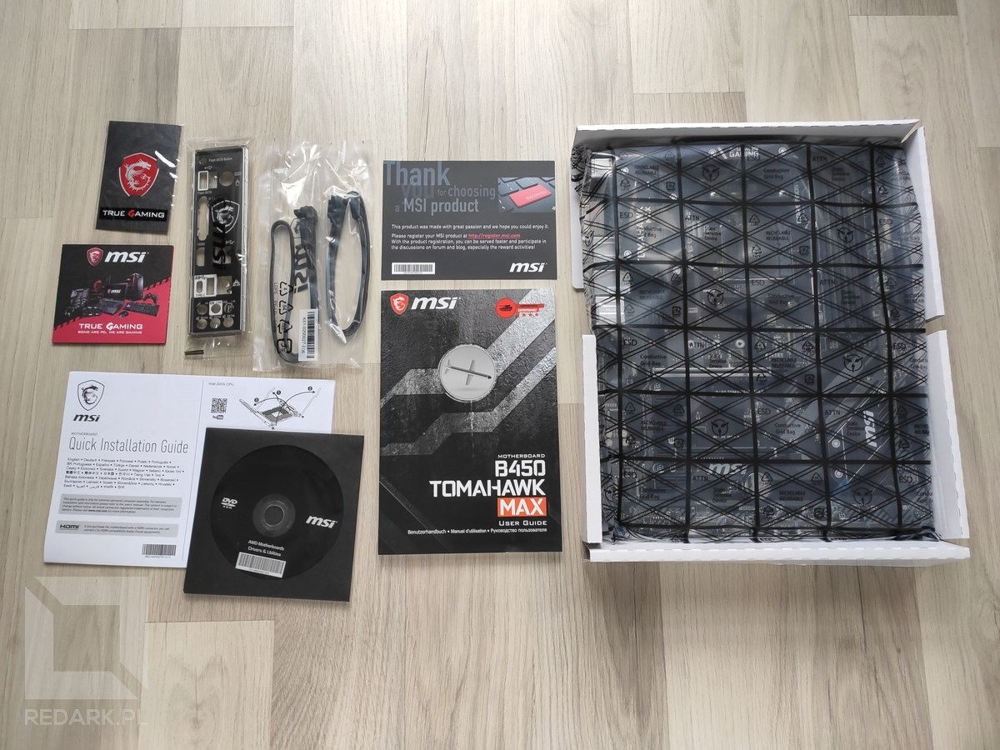
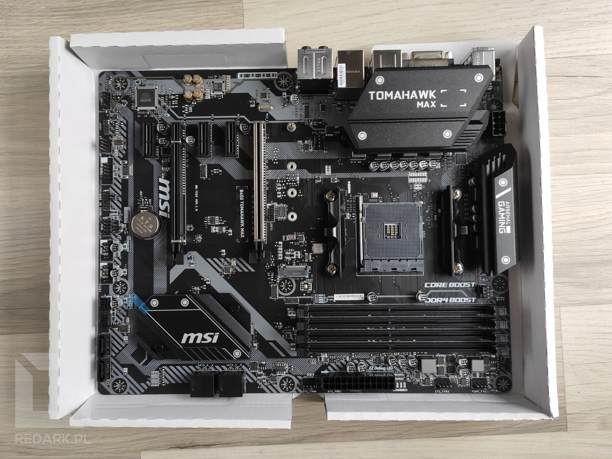
</Gallery>

Za pracę przyszłego komputera będzie odpowiedzialny procesor AMD Ryzen 5 3600. W opakowaniu znajdziemy skróconą instrukcję montażu, podstawowe chłodzenie powietrzne od AMD oraz procesor wraz z dekoracyjną naklejką. Chłodzenie dołączone do zestawu robi znacznie lepsze wrażenie, niż to dołączane do procesorów konkurencyjnego Intela. Jest większe, elegancko wykończone oraz posiada czarny kabel w oplocie. Nałożona termopasta również wydaje się mieć większą powierzchnię, niż u Intela.

<Gallery width='2'>

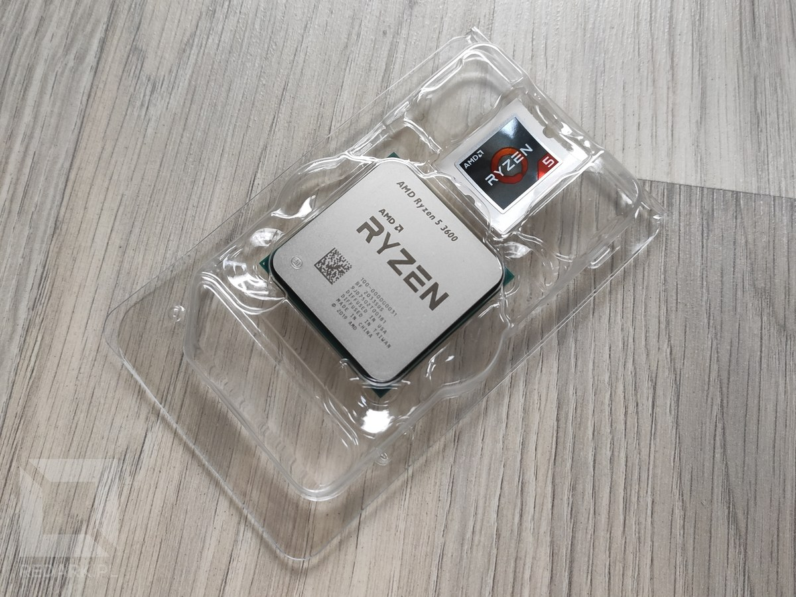
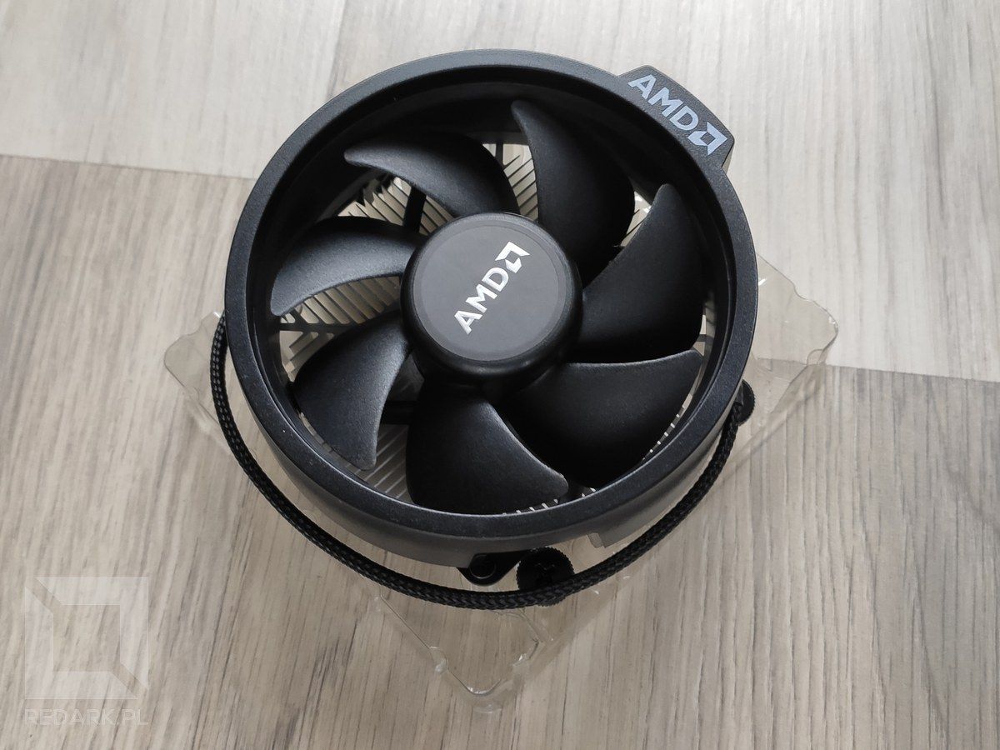
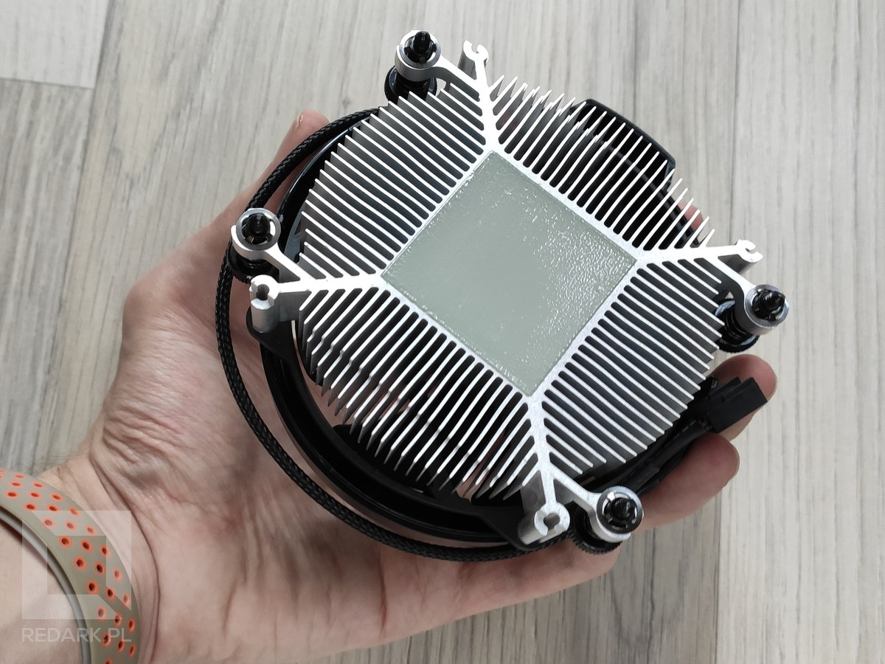
</Gallery>

Ja jednak włożę to chłodzenie z powrotem do pudełka, ponieważ zamiast niego, do komputera trafi niestandardowe rozwiązanie, którego instalacją zajmiemy się w następnej części poradnika.

<LayoutContainer>
<LayoutColumn><ActionButton to='/plyty-glowne-czesc-1'>Dobieranie płyt głównych</ActionButton></LayoutColumn>
<LayoutColumn><ActionButton to='/procesory'>Dobieranie procesorów</ActionButton></LayoutColumn>
</LayoutContainer>

## Montaż procesora AMD

Montaż procesora AMD rozpoczynamy od odbezpieczenia gniazda na płycie głównej. W tym celu należy odciągnąć do góry znajdującą się obok gniazda metalową dźwignię. Następnie możemy przejść do wyjęcia procesora z plastikowej wytłoczki. Należy to zrobić bardzo powoli i ostrożnie! Inaczej drogocenny procesor wykona szybki lot paraboliczny po Twoim pokoju :) . Podczas trzymania procesora palcami, starajmy się nie dotykać niepotrzebnie jego metalowej powierzchni. Zatłuszczona powierzchnia znacząco utrudni wymianę ciepła.

<AdSense/>

<WarningBlock>Do odtłuszczania i czyszczenia powierzchni procesora należy używać tylko i wyłącznie alkoholu izopropylowego oraz ściereczek, które nie pozostawiają włókien! Stosowanie innych substancji może uszkodzić procesor lub płytę główną!</WarningBlock>

<Gallery width='2'>
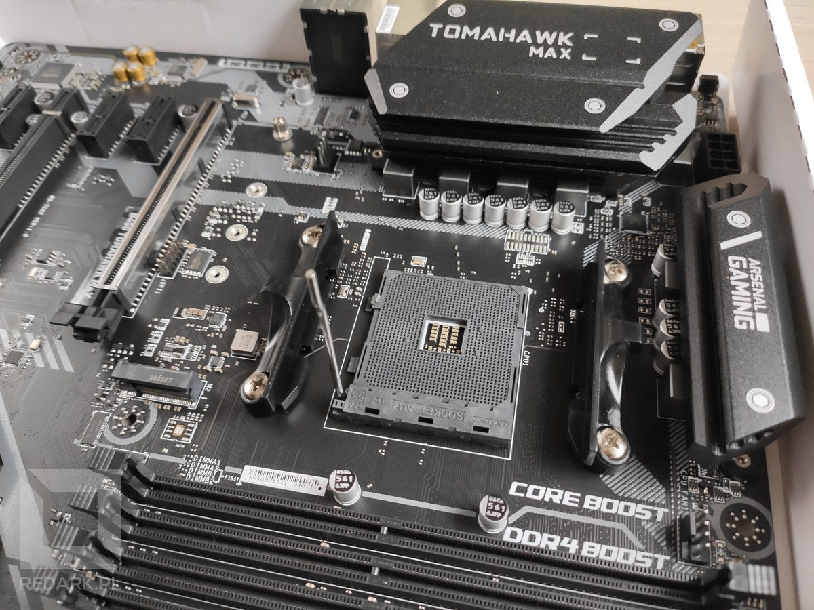
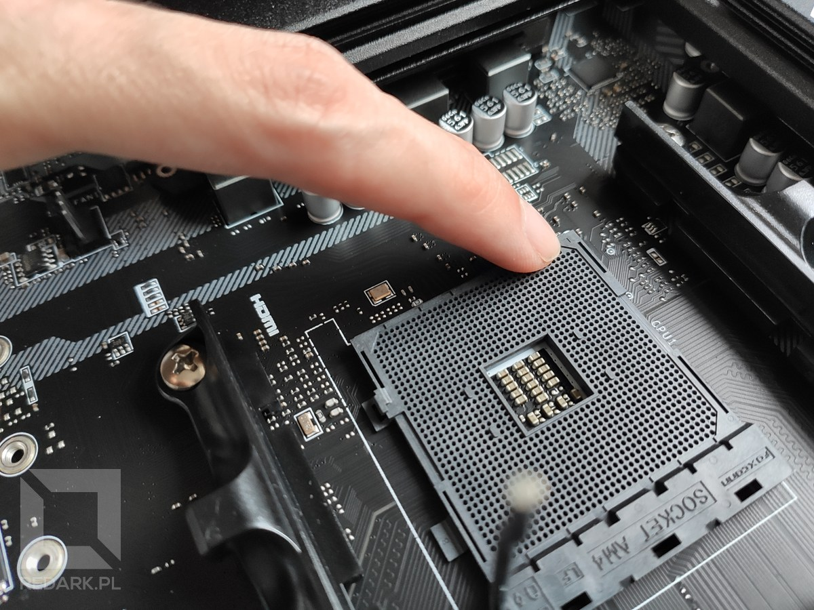
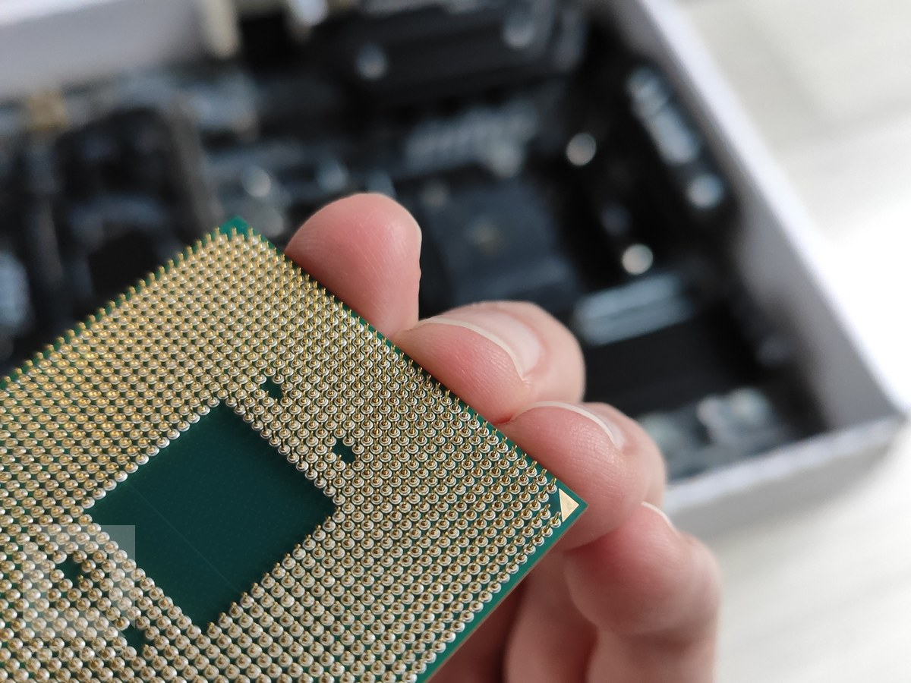
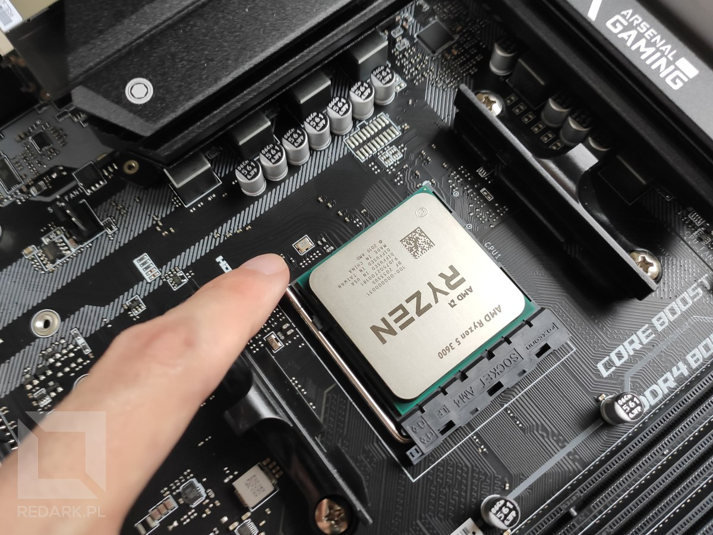
</Gallery>

Poprawna orientacja procesorów AMD w gnieździe jest oznaczana za pomocą małej złotej strzałki znajdującej się na gnieździe oraz procesorze - zarówno na wierzchu, jak i po stronie nóżek (patrz zdjęcia powyżej). Gdy znaleźliśmy już oznaczenia, możemy umieścić ostrożnie procesor w gnieździe. Nóżki podzespołu muszą całkowicie wejść w podstawę gniazda tak, aby płytka procesora zrównała się z nim poziomem. Gdy mamy pewność, że procesor pewnie leży na swoim miejscu, możemy zablokować gniazdo używając znajdującej się obok dźwigni. Gotowe!

<InfoBlock>Montaż procesorów Intela możesz obejrzeć we wcześniejszej (starszej) edycji składania PC, do której link znajdziesz poniżej:</InfoBlock>

<ActionButton to='/skladanie-pc-montaz-procesora-i-chlodzenia'>Montaż procesorów Intel</ActionButton>

## Montaż kości pamięci RAM

Następnym krokiem jest montaż kości (modułów) pamięci operacyjnej RAM. Komputer zostanie wyposażony w dwa moduły HyperX DDR4 o taktowaniu 3200 MHz po 8 gigabajtów każdy. Aby zainstalować je prawidłowo, należy najpierw skorzystać z dołączonej do płyty głównej instrukcji. Aby zapewnić prawidłowe działanie jednostki, moduły pamięci RAM muszą być instalowane w odpowiedniej kolejności. Odpowiedni zapis w instrukcji, a także dodatkowe oznaczenie na powierzchni samej płyty prezentuję poniżej.

<ActionButton to='/pamieci-ram'>Dobieranie pamięci RAM</ActionButton>

<Gallery width='2'>
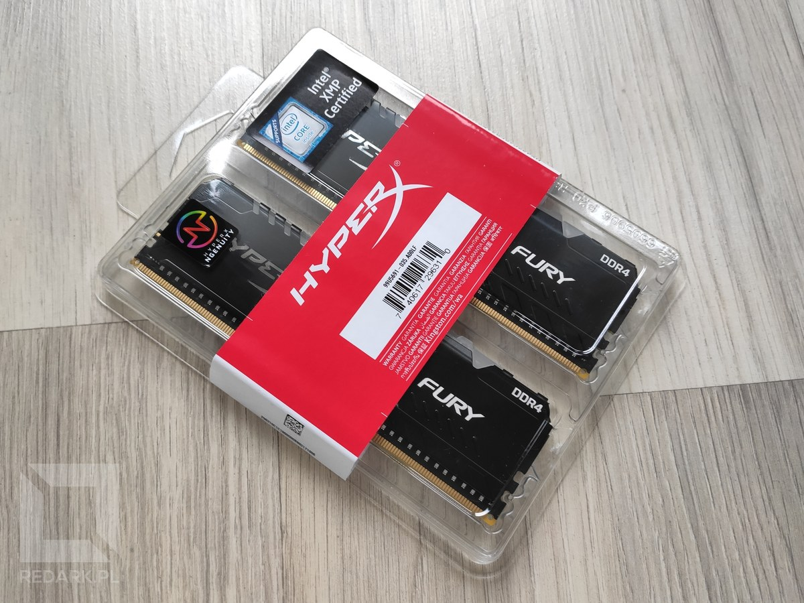
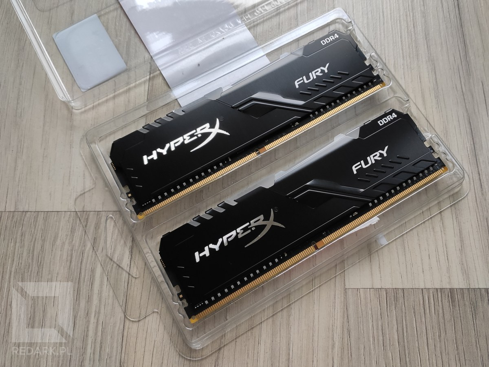
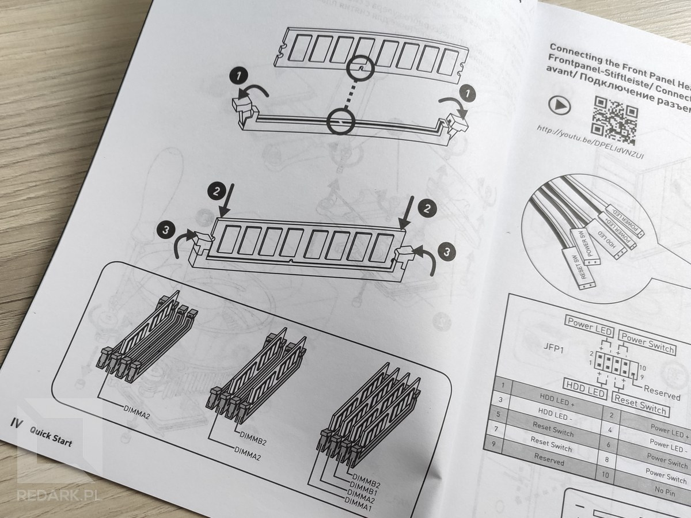
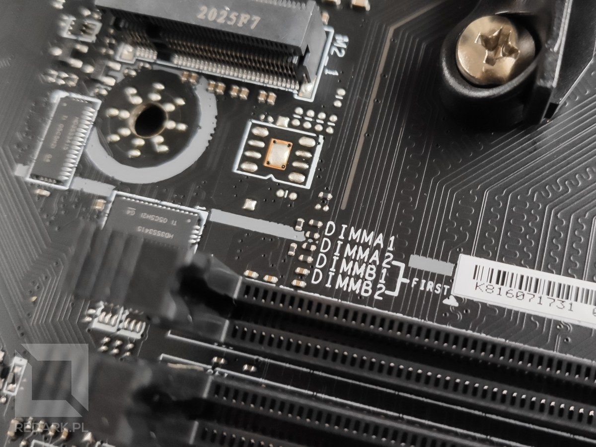
</Gallery>

Montaż kości rozpoczynamy od odbezpieczenia zatrzasków znajdujących się na obu jej końcach. Następnie musimy określić odpowiednią orientację modułów w gnieździe. Służy do tego wcięcie znajdujące się przy stykach modułu. Jest ono asymetryczne, co uniemożliwia nieprawidłową instalację, choć podobno "dla chcącego nic trudnego" i zdarzało się, że ktoś na siłę montował RAM odwrotnie. Gdy znamy już prawidłową orientację modułów, możemy wcisnąć je do gniazda. Należy to robić prostopadle do płyty oraz naciskać na moduł równomiernie kciukami z obu stron. Gdy moduł zostanie dociśnięty do końca, zatrzaski samoistnie wrócą do swoich poprzednich pozycji. Prawidłowość instalacji modułu można potwierdzić próbując wyjąć moduł z gniazda bez odbezpieczania zatrzasków. Dobrze zamontowany RAM nie wyskoczy z gniazda.

<Gallery>

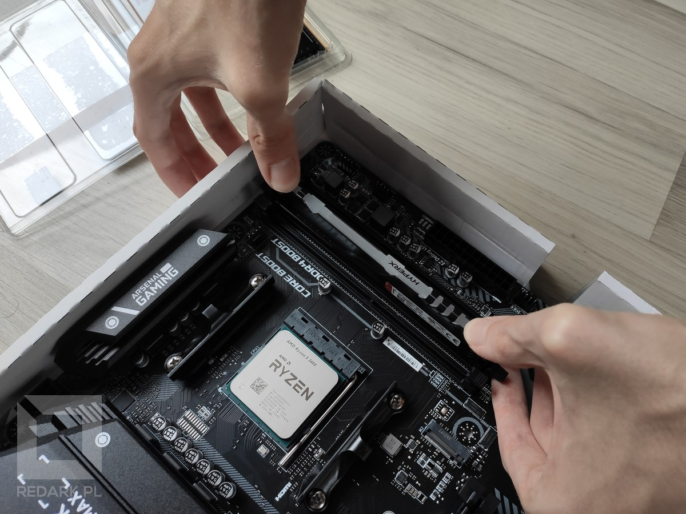
</Gallery>

<WarningBlock>Aby moduły mogły działać ze swoją prędkością 3200 MHz, należy po pierwszym uruchomieniu komputera włączyć w BIOSie profil XMP!</WarningBlock>

## Montaż dysku SSD M.2

Ostatnim elementem, jaki w tej części poradnika zamontujemy na płycie głównej będzie dysk SSD. Nie będzie to klasyczny dysk 2,5" na kablu, a wersja montowana w gnieździe M.2 znajdującym się pod procesorem. Wybrany dysk to Adata XPG SX8200 Pro o pojemności 512 GB. Model ten posiada wsparcie dla protokołu NVMe i PCIe 3. generacji x4, co zapewni wysoką szybkość działania komputera. Zawartość opakowania jest bardzo skromna. Znajdziemy tam tylko dysk oraz opcjonalny radiator. Ja nie będę go montować, ponieważ właściwie jest to miniaturowa blaszka z naniesioną dwustronną taśmą klejącą, a nie prawdziwy radiator. Jedyne, co robi, to poprawia wygląd dysku.

<ActionButton to='/dyski-ssd-m2'>Dobieranie dysków SSD M.2</ActionButton>

<Gallery>

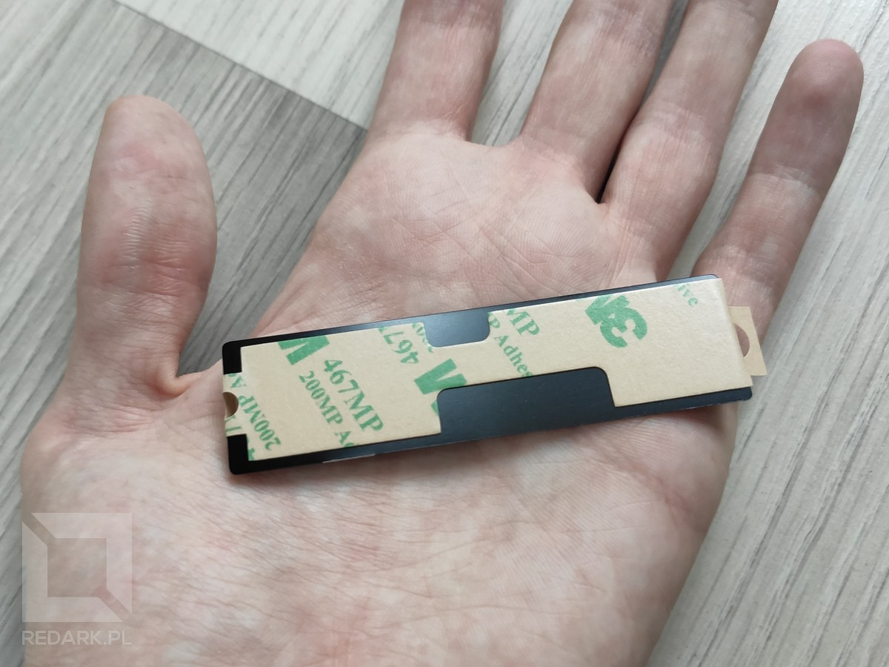
</Gallery>

Z racji tego, że dyski M.2 występują w różnych rozmiarach, montaż musimy rozpocząć od skorygowania pozycji śruby podtrzymującej przyszły dysk. Montowany przez nas dysk ma rozmiar 2280, czyli jego długość wynosi 8 centymetrów. Śrubę dystansową należy wykręcić z płyty śrubokrętem i wkręcić w odpowiednie dla naszego dysku miejsce. Aby je określić, można przymierzyć na chwilę dysk "w powietrzu" lub skorzystać z linijki.

<AdSense/>

<Gallery width='2'>
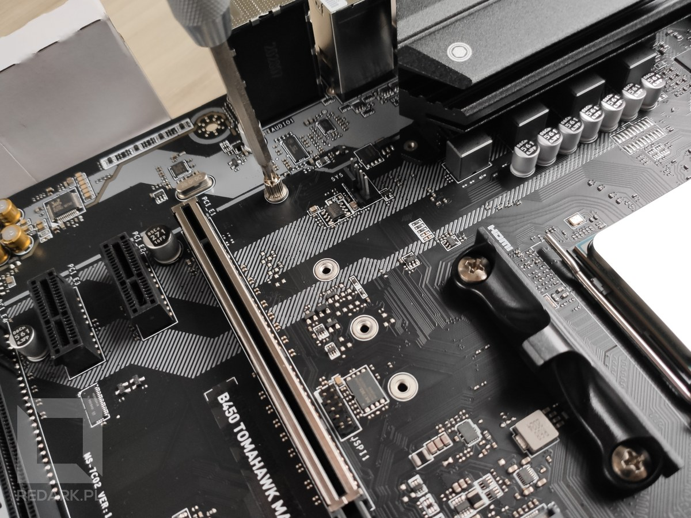
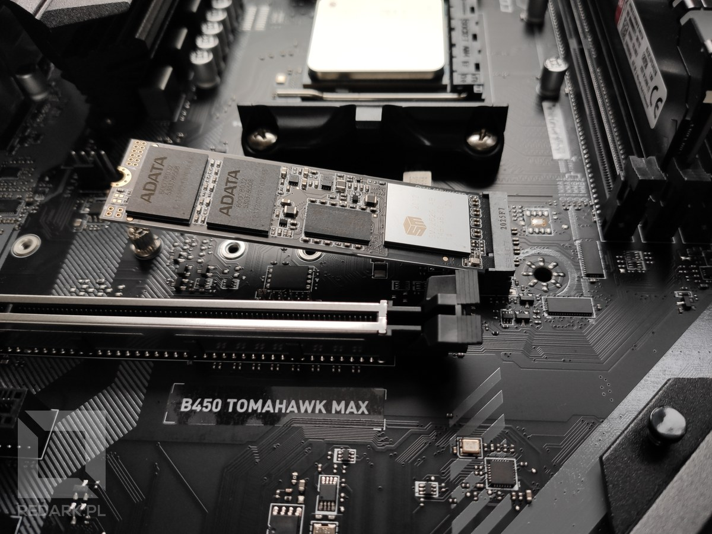
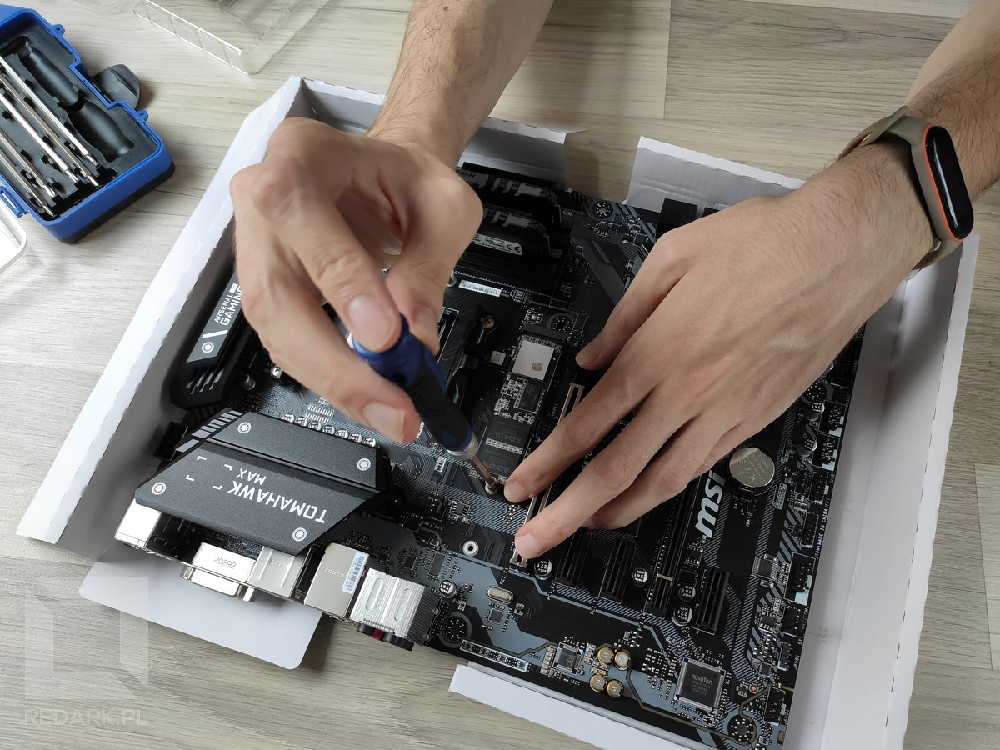
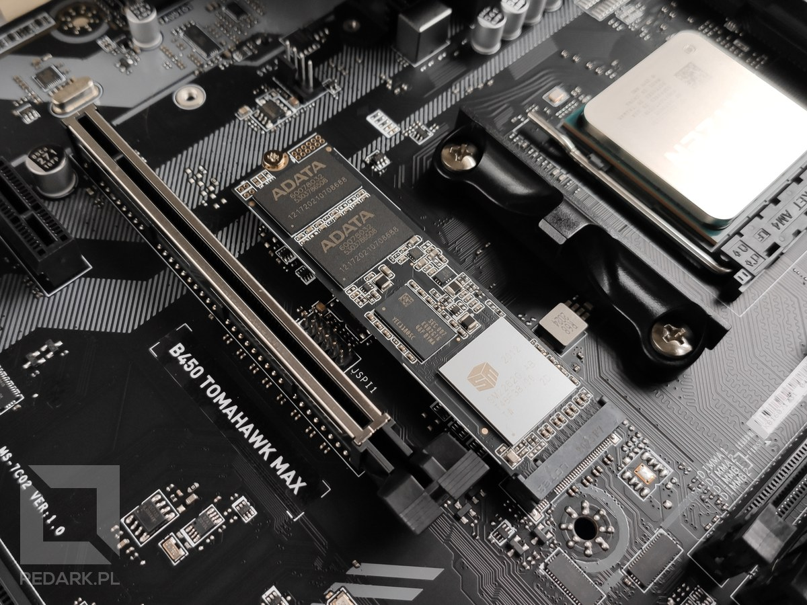
</Gallery>

Gdy śruba dystansowa jest już na swoim miejscu, możemy wsunąć dysk do gniazda M.2. Tak samo, jak w przypadku procesora, należy unikać niepotrzebnego dotykania powierzchni dysku. Jego elementy są wrażliwe na ładunki elektrostatyczne, które mogą gromadzić się na powierzchni naszej skóry. Dodatkowo dyski M.2 są wsuwane do gniazda pod kątem około 30 stopni (patrz zdjęcie poniżej). Dopiero gdy dysk znajdzie się w gnieździe, należy docisnąć go do płyty głównej i śruby dystansowej, a następnie unieruchomić dołączoną do płyty mikroskopijną śrubką montażową.

## Podsumowanie

Takim oto sposobem przygotowaliśmy wstępnie naszą płytę główną. W następnym kroku zajmiemy się obudową komputera oraz zamontujemy w niej płytę główną oraz chłodzenia procesora.

<AssemblingPcFooter nextPost='/skladanie-pc-2020-montaz-chlodzenia-wodnego-i-plyty-glownej'/>
