import AssemblingPcFooter from '../../typography/assemblingPcFooter'

W [poprzednim kroku](/skladanie-pc-2020-montaz-podzespolow-na-plycie-glownej) wstępnie przygotowaliśmy płytę główną instalując na jej powierzchni procesor, moduły pamięci RAM oraz dysk M.2 NVMe. Teraz zajmiemy się montażem owej płyty w obudowie komputera oraz zainstalujemy na niej chłodzenie wodne procesora.

## Przygotowanie obudowy

Gwiazdą tego artykułu zostanie obudowa SilentiumPC Armis AR6X TG RGB. Jest to model typu midi tower wyposażony w wydzieloną przestrzeń na zasilacz, kontroler podświetlenia i obrotów wentylatora, subtelne podświetlenie RGB oraz dwa panele z hartowanego i przyciemnianego szkła. Przed włożeniem płyty głównej musimy odpowiednio przygotować obudowę do pracy.

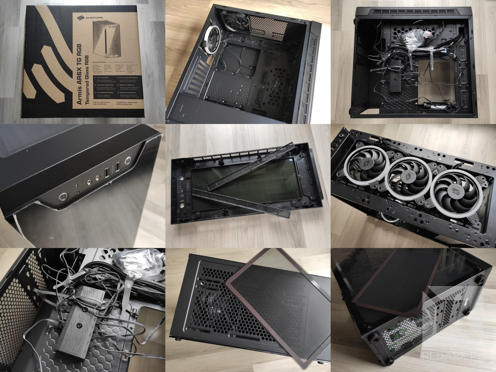

<ActionButton to='/obudowy-czesc-1'>Dobieranie obudowy</ActionButton>

### Zdemontuj wszystko, co niepotrzebne

Pusta obudowa waży aż 7 kilogramów, co z pewnością nie ułatwia montażu podzespołów. Aby ją odciążyć, należy zdemontować front oraz oba boczne panele. Szklany panel boczny jest mocowany za pomocą czterech śrub z gumowymi podkładkami, a metalowy panel boczny za pomocą dwóch śrub znajdujących się z tyłu obudowy. Żeby nie zgubić tych śrub, zaraz po zdjęciu elementów, wkręć je z powrotem na swoje miejsce. Aby zdemontować panel frontowy należy chwycić za znajdujący się od spodu obudowy uchwyt i energicznie szarpnąć. Oprócz tego zalecam także zdjęć dwa filtry przeciwkurzowe znajdujące się na górze oraz dole obudowy. Są one mocowane na magnes.

<WarningBlock>Choć szklane panele są hartowane, to należy zachować wobec nich szczególną ostrożność! Podczas ich zdejmowania asekurujmy ją przy pomocy drugiej dłoni oraz odłóżmy je w bezpieczne miejsce.</WarningBlock>

### Zamontuj osłonę tylnych portów

Jednym z najczęściej popełnianych błędów w trakcie składania komputera jest zapominanie o zainstalowaniu osłony tylnych portów płyty głównej. Tę czynność należy wykonać **PRZED** zamontowaniem płyty, dlatego zróbmy to od razu! Podczas jej montażu zachowaj należytą ostrożność, ponieważ krawędzie blachy obudowy mogą być ostro zakończone! Prawidłowo zainstalowana zaślepka nie wyskakuje pod lekkim naciskiem palca.

<Gallery>
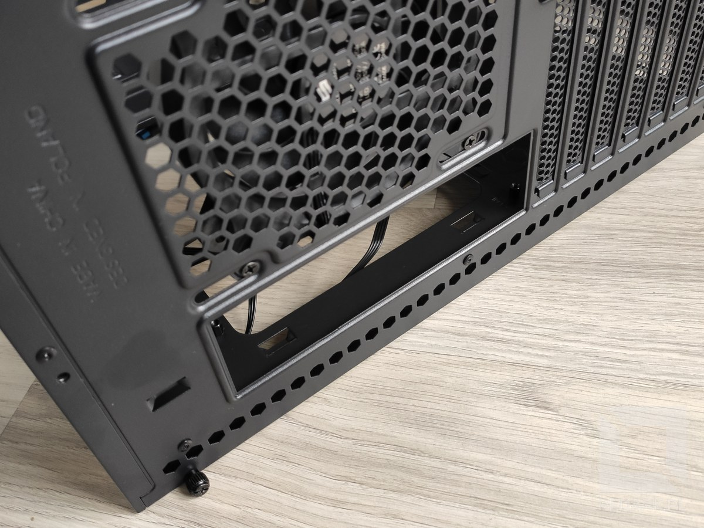
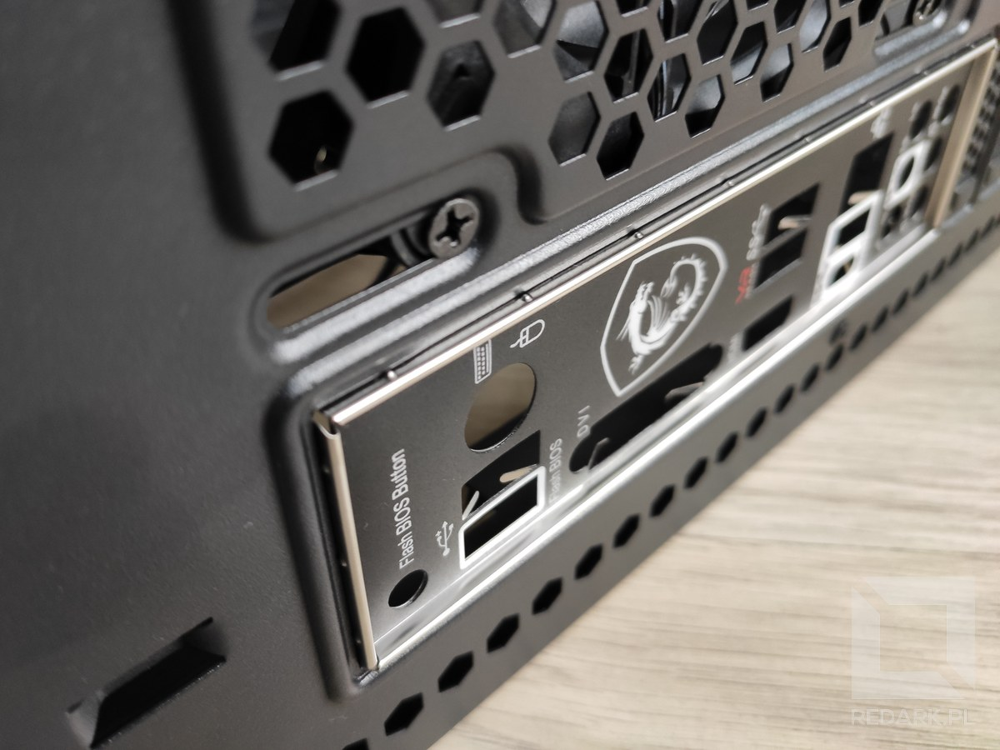
</Gallery>

### Usuń zbędne wentylatory

Do obudowy został dołączony zestaw pięciu wentylatorów 120-milimetrowych. Cztery z nich posiadają podświetlenie RGB typu o-ring, natomiast piąty egzemplarz jest już standardowy. Został on zamontowany na górnej kratce wentylacyjnej i w tym przypadku musi zostać zdemontowany, aby zrobić miejsce na chłodnicę procesora. Po odkręceniu wentylatora należy jeszcze odłączyć jego wtyczkę z kontrolera obrotów znajdującego się po drugiej stronie obudowy.

<Gallery>
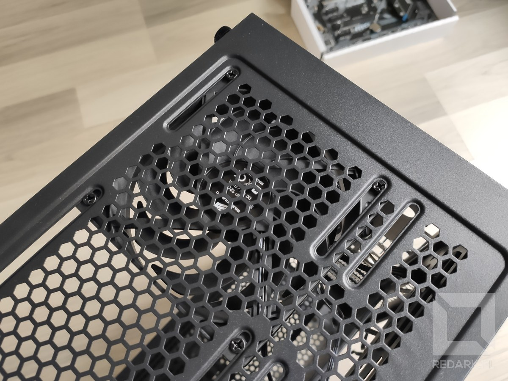
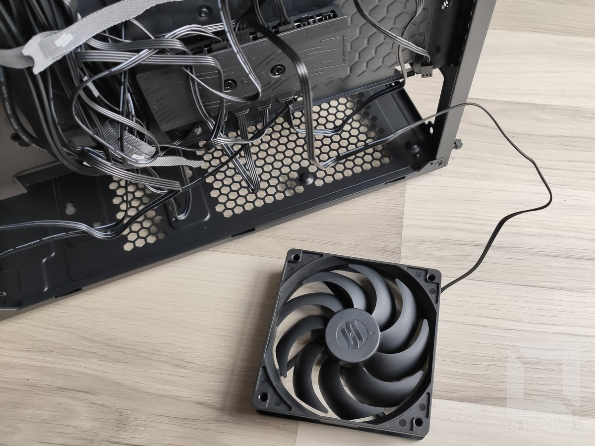
</Gallery>

### Wkręć odpowiednie kołki dystansowe

Płyta główna nie leży bezpośrednio obudowie, a jest do niej przykręcana za pomocą kołków dystansowych - małych śrubek, które zabezpieczają płytę przed zwarciem jej obwodów przez metalowy spód obudowy. Płyta w standardzie ATX posiada 9 miejsc na śruby montażowe, natomiast w obudowie wkręconych jest tylko 6. Pozostałe 3 znajdują się w woreczku z dodatkowymi częściami obudowy i należy je wkręcić samodzielnie.

<Gallery>
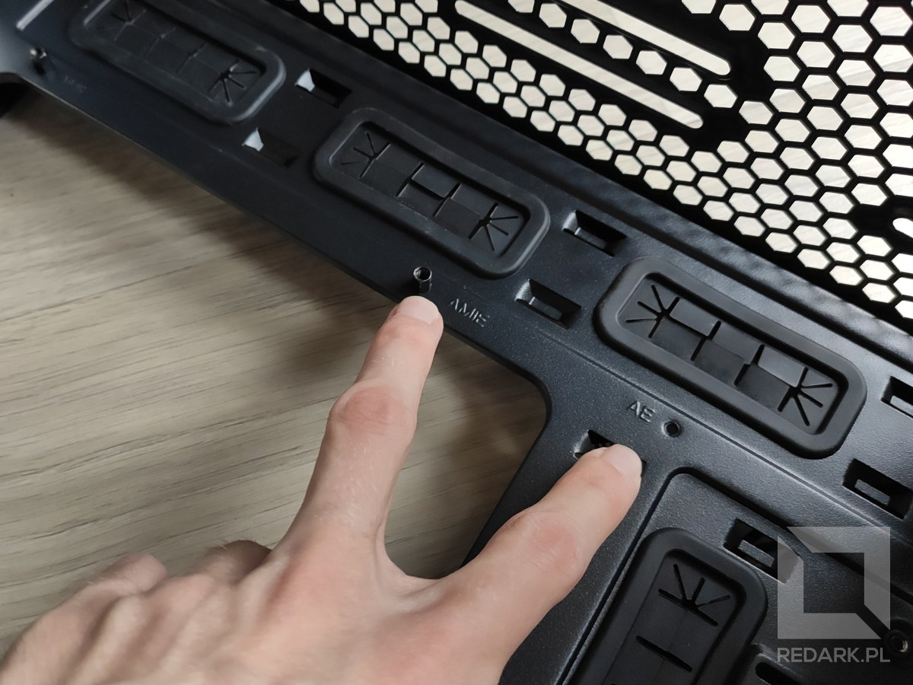
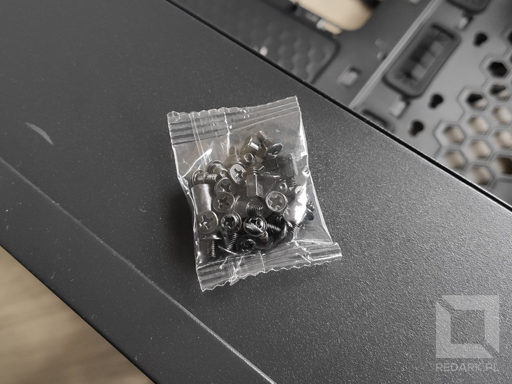
</Gallery>

## Montaż płyty głównej w obudowie

Możemy przejść już do montażu płyty w obudowie komputera. Zanim jeszcze chwycisz za płytę główną, upewnij się, że żaden przewód (np. od tylnego wentylatora) nie plącze się w okolicach kołków dystansowych. Jeśli nie, podnieś płytę główną i ostrożnie umieść ją w obudowie. Następnie musisz dosunąć ją tak, aby otwory mocujące zgrały się z kołkami dystansowymi. Najbardziej problematyczna będzie w tym zaślepka tylnych portów. Jej metalowe wąsy bardzo mocno sprężynują i czasami, gdy nie chcą one współpracować, można je lekko dogiąć palcem.

<AdSense/>

Podczas tego montażu warto przygotować sobie zawczasu kilka śrub mocujących, aby można było nimi od razu chwycić dobrze ułożoną płytę główną. Przykręcanie płyty głównej należy wykonać ze spokojem i opanowaniem. Największa tragedia, jaka może się teraz wydarzyć, to przypadkowe ześlizgnięcie się śrubokrętu z główki śrubki. Przejechanie takim śrubokrętem po powierzchni płyty głównej bardzo często kończy się jej całkowitym zniszczeniem! Dodatkowo przykręcanie należy wykonywać stopniowo i na krzyż, aby nie wytworzyły się negatywne naprężenia materiału.

<Gallery>
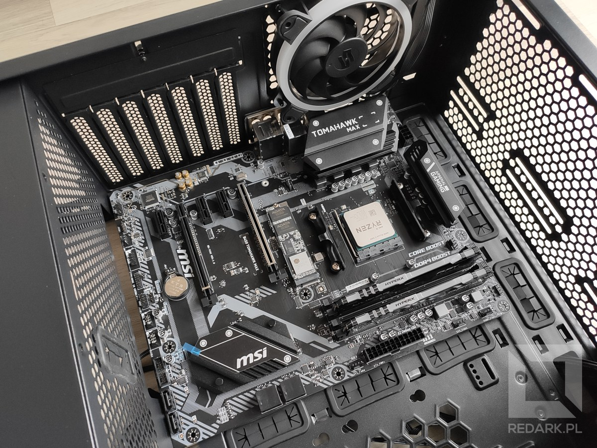
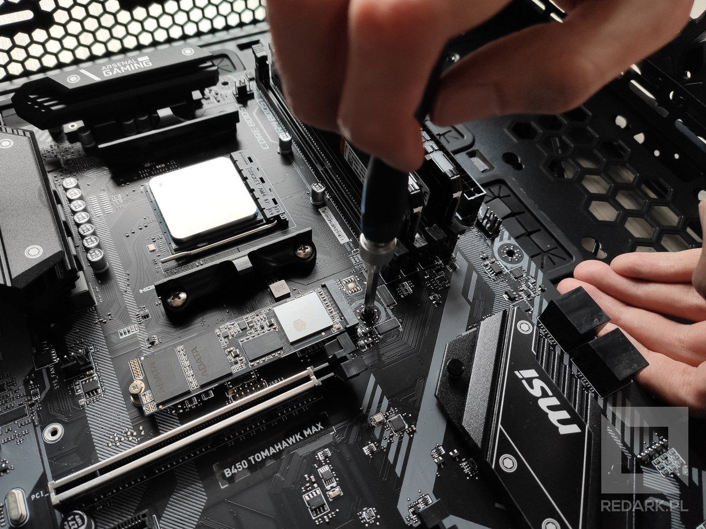
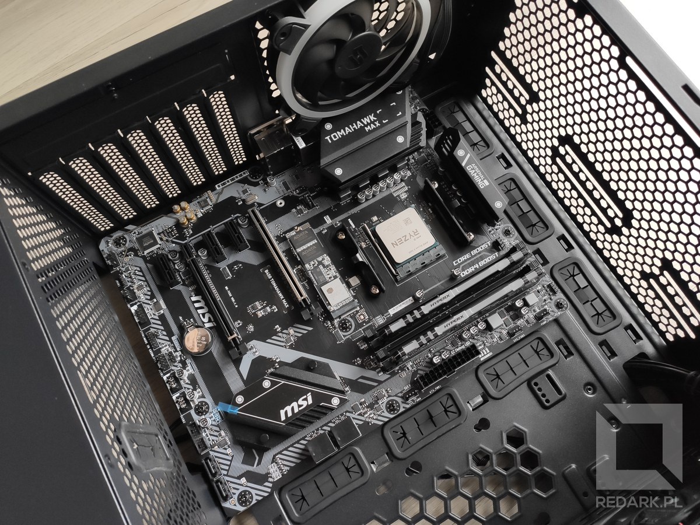
</Gallery>

<WarningBlock>Nieostrożne dokręcanie płyty głównej może spowodować ześlizgnięcie się śrubokrętu z główki śruby i permanentne uszkodzenie montowanego podzespołu - zachowaj szczególną ostrożność!</WarningBlock>

## Montaż chłodzenia wodnego Nzxt Kraken

Gdy płyta siedzi już na swoim miejscu, możemy przejść do instalacji chłodzenia procesora. W tej jednostce będzie to chłodzenie wodne Nzxt Kraken X53 wyposażone w dwa wentylatory po 120 mm oraz chłodnicę 240 mm. Jest to chłodzenie typu AiO (All in One), czyli jest to obieg zamknięty, gotowy do zamontowania w obudowie. W zestawie znajdziemy chłodnicę połączoną wężami z tzw. blokopompką, instrukcję montażu, kable sygnałowe, dwa wentylatory 120 mm oraz zestaw śrub i uchwytów montażowych.

<ActionButton to='/chlodzenie-komputera'>Dobieranie chłodzeń procesora</ActionButton>

Ceny chłodzeń wodnych są znacząco wyższe w porównaniu z tradycyjnymi chłodzeniami powietrznymi. Dodatkowo ich montaż również nie należy do łatwych i przyjemnych. Postanowiłem jednak je zastosować, ponieważ alternatywne chłodzenia typu "tower" zajmują dużo miejsca na płycie głównej. Powoduje to bardzo duże problemy z montażem modułów pamięci RAM, czego chciałem uniknąć. Chłodnice AiO również zajmują sporo miejsca, ale znajdują się poza płytą główną co pozytywnie wpływa na wygląd jednostki oraz wydajność chłodzenia. Przejdźmy do montażu.

<Gallery width='3'>
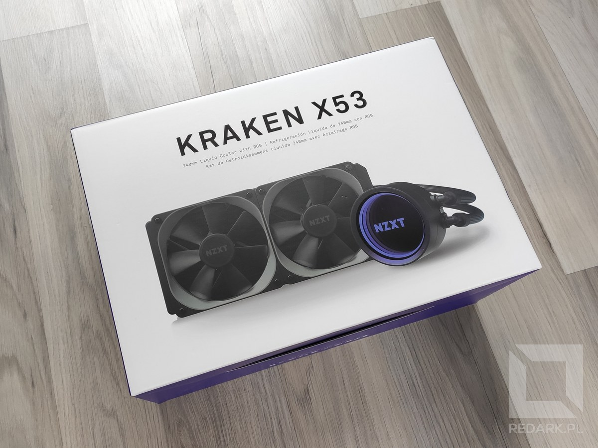
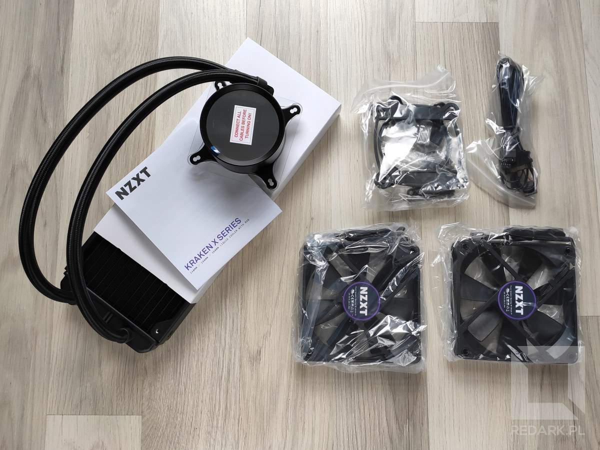
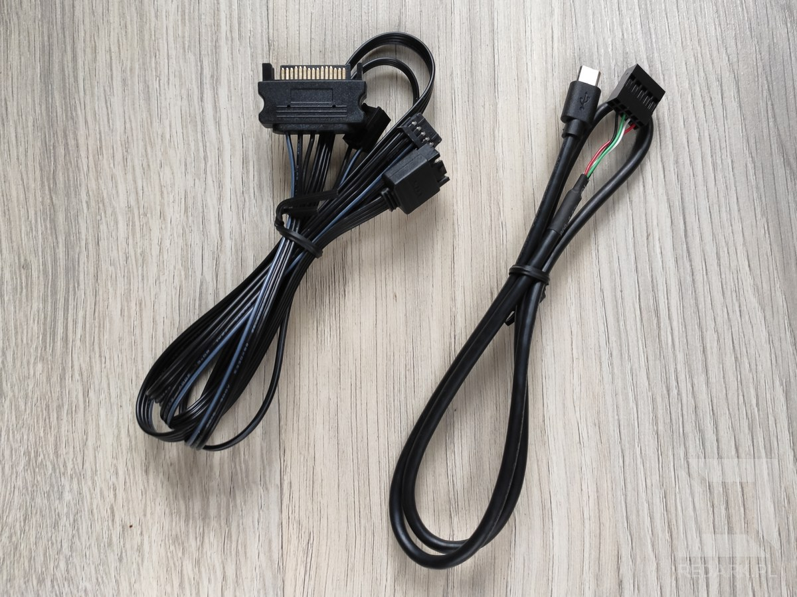
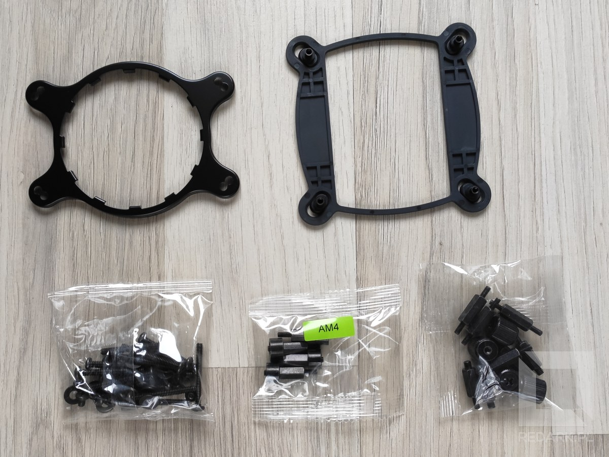
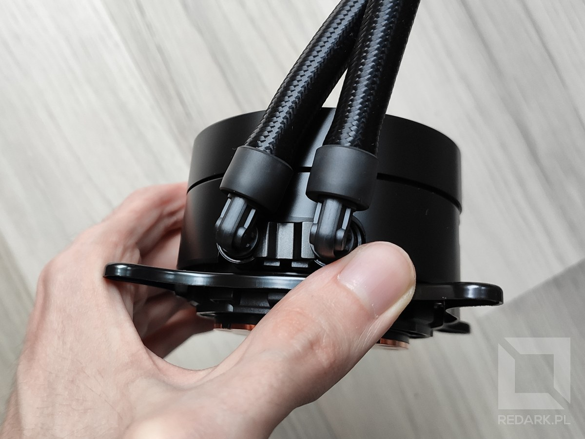
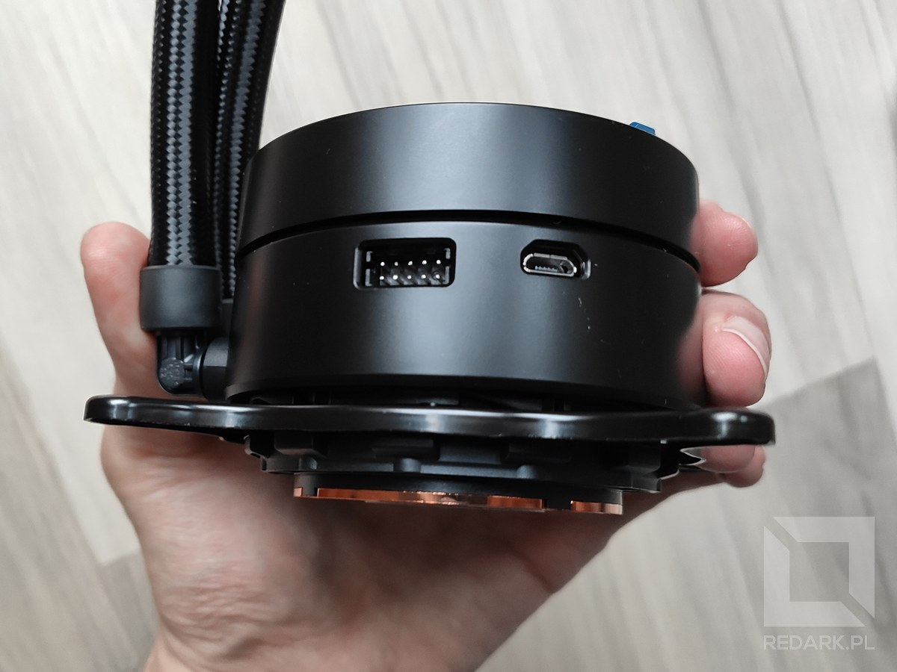
</Gallery>

### Wymiana mocowania blokopompki

Znajdujące się obok procesora dwa czarne plastikowe elementy to mocowanie standardowych chłodzeń AMD starego typu. Naszym pierwszym zadaniem jest zdemontowanie ich z płyty głównej oraz podmiana na zaczepy dołączone do Krakena. Podczas odkręcania tych zaczepów należy uważać na backplate, czyli prostokątną płytkę znajdującą po drugiej stronie płyty głównej. Podczas odkręcania ostatniej śruby, należy chwyć backplate drugą ręką, aby nie spadł on na ziemię i nie wywołał przy tym niepotrzebnych szkód. Następnie odnajdź woreczek oznaczony naklejką "AM4" (jest to nazwa gniazda naszego procesora) i za pomocą znajdujących się tam czterech śrub przykręć ponownie backplate do tyłu płyty głównej.

<AdSense/>

<Gallery>
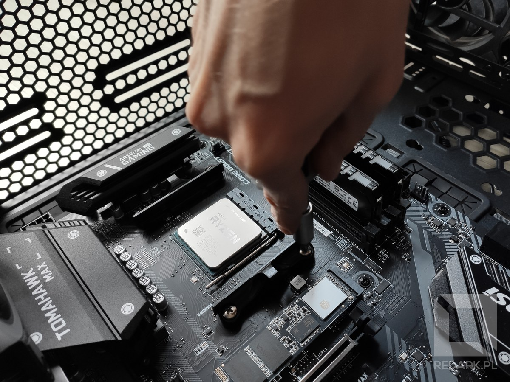
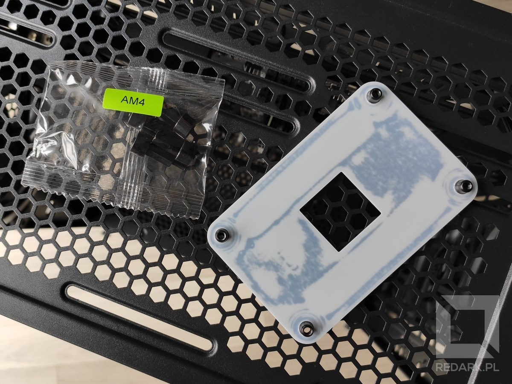
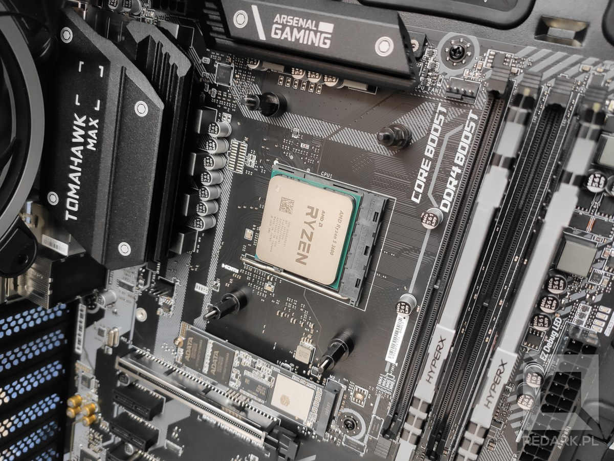
</Gallery>

<InfoBlock>Podobny zabieg należałoby wykonać montując też inne typy chłodzeń. Nawet użycie radiatora dołączonego do procesora AMD Ryzen wymusza usunięcie oryginalnych zaczepów.</InfoBlock>

### Przygotowanie chłodnicy

Chłodnica znajdująca się w pudełku nie posiada jeszcze zamontowanych wentylatorów tłoczących przez nią powietrze. Musimy przymocować je sami. Najczęstszą taktyką w chłodzeniach wodnych jest montaż wentylatorów w konfiguracji "push", czyli wpychającej powietrze do chłodnicy. W tym celu należy użyć dołączonych do zestawu długich śrub oraz podkładek i przymocować wentylatory od strony, od której wychodzą węże. Orientacja wentylatorów jest tutaj bardzo ważna. Po pierwsze: muszą one być skierowane wirnikiem na zewnątrz, a stelażem do chłodnicy. W przeciwnym wypadku wypychałyby one powietrze, zamiast je tłoczyć. Po drugie: należy obrócić wentylatory tak, aby ich kable zasilające wychodziły za płytę główną. Przygotowanie chłodnicy powinno wyglądać tak:

<Gallery>
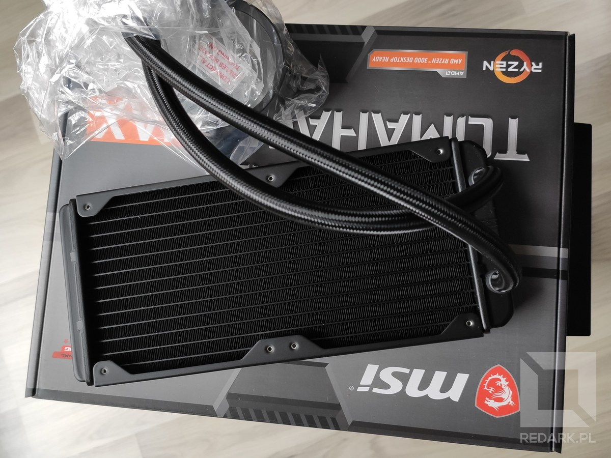
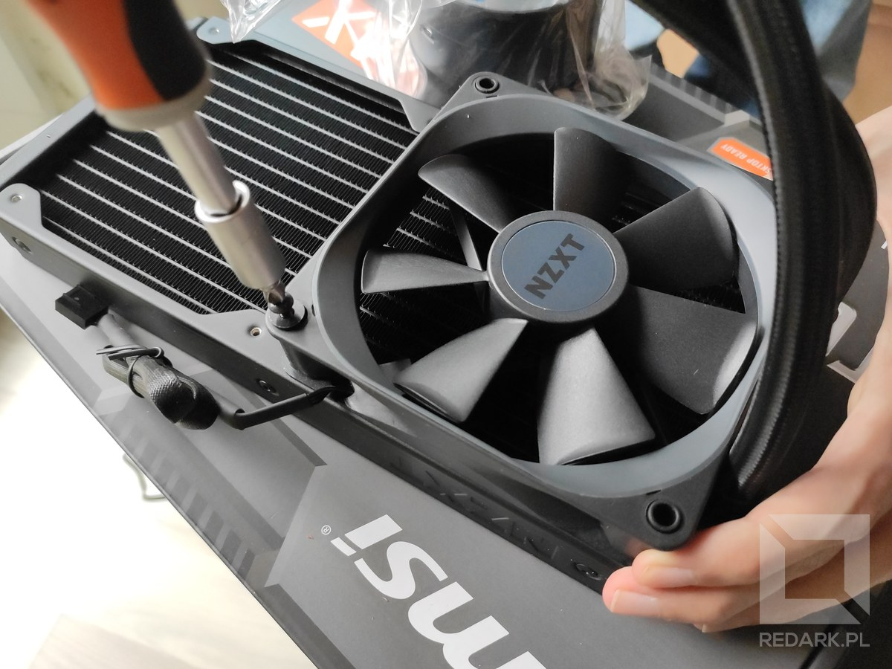
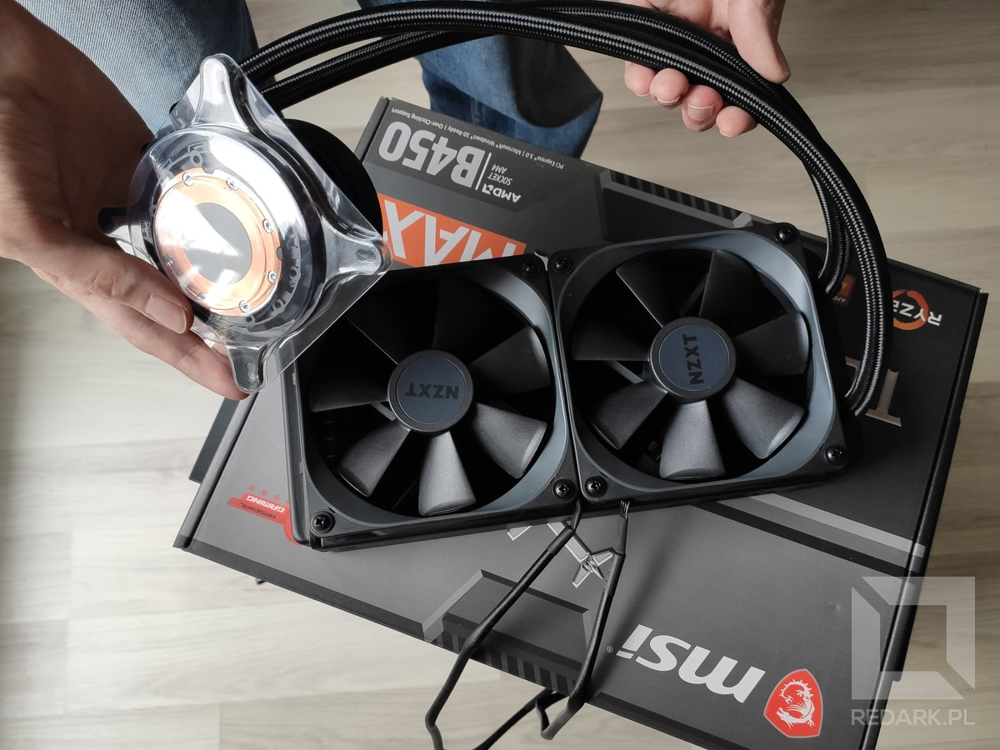
</Gallery>

### Przykręcenie chłodnicy do obudowy

Następnym krokiem jest montaż chłodnicy w obudowie. Miejsca montażu są dwa: przód lub góra obudowy. Montaż chłodnicy u góry jest prostszy i wydajniejszy (inne podzespoły nie nagrzewają się ciepłem procesora). Przykręcanie chłodnicy najlepiej wykonywać w pozycji pionowej obudowy. Jedną ręką podtrzymujemy chłodnicę, a drugą delikatnie odkładamy blokopompkę na dnie obudowy. Zauważ, że celowo nie zdejmowałem jeszcze plastikowej osłonki z blokopompki. Bez niej miedziana stopa radiatora mogłaby ulec uszkodzeniu, a znajdująca się na niej termopasta ubrudzić któryś z podzespołów. Dla bezpieczeństwa możesz też osłonić całość foliowym rękawem którym była początkowo zabezpieczona.

<Gallery>
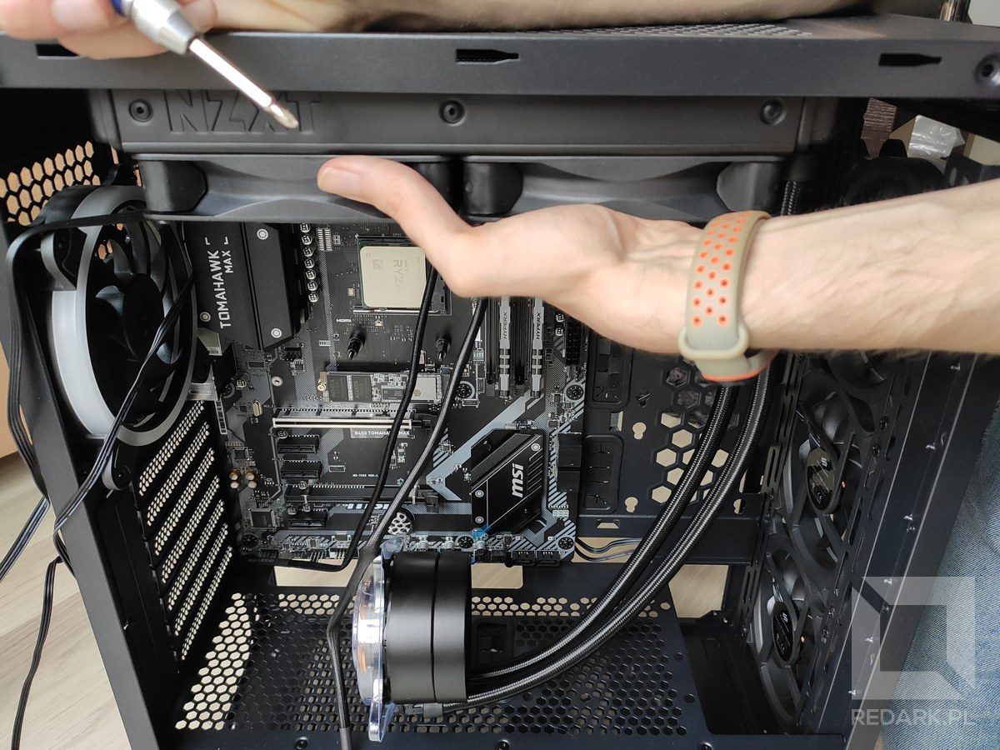
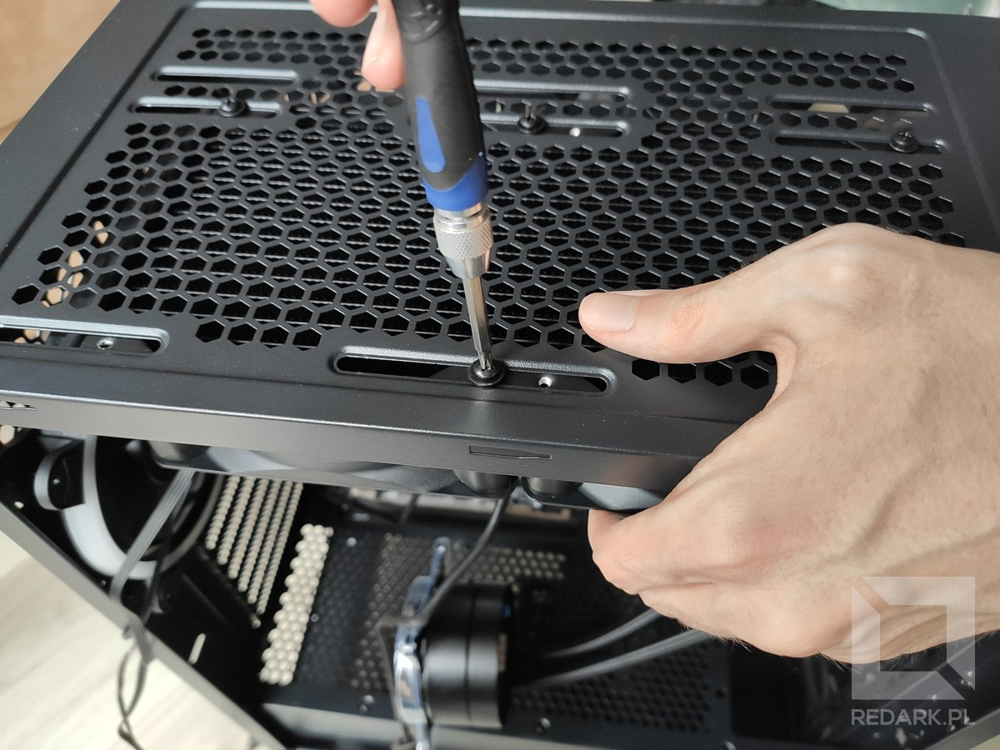
</Gallery>

### Montaż blokopompki

Na koniec pozostało umieścić blokopompkę na procesorze. Chłodzenia Nzxt Kraken posiadają genialnie zaprojektowane mocowanie, które umożliwia obrócenie pompki o dowolny kąt. Dzięki temu możemy wyprowadzić węże po tej stronie, po jakiej dokładnie chcemy. Zanim jednak położymy element na procesorze, musimy wykonać jeszcze parę rzeczy.

<AdSense/>

Metalowa ramka przymocowana fabrycznie do procesora (która trzyma też plastikową osłonkę) jest przeznaczona dla procesorów Intela. Dlatego w przypadku procesora AMD trzeba jeszcze podmienić ją na drugi typ, który znajdował się w woreczku ze śrubkami. Aby zdemontować ramkę należy obrócić ją w lewo, a aby ją zablokować, w prawo. Różnicę w typach ramek zobaczycie na poniższych zdjęciach:

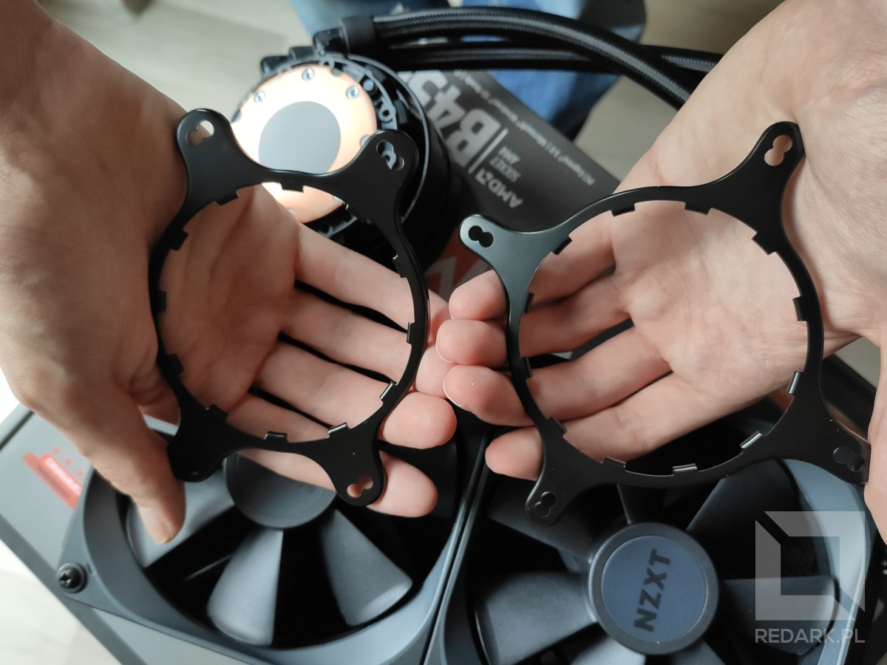

<ImageDescription>Po lewej ramka dla procesorów AMD, a po prawej dla procesorów Intel</ImageDescription>

<WarningBlock>Przed zainstalowaniem jakiegokolwiek chłodzenia na procesorze, należy upewnić się, czy na jego stopce nie znajduje się folia ochronna! W przypadku Krakena była to duża plastikowa wytłoczka, ale chłodzenia powietrzne typu tower posiadają cieniutką słabo widoczną folię, którą kategorycznie należy usunąć przed montażem.</WarningBlock>

Drugą czynnością jest ustalenie prawidłowego obrotu ramki. Od jej pozycji zależeć będzie, w którym miejscu wypadną węże transportujące ciecz do chłodnicy. Ja zamontuję blokopompkę tak, aby jej węże wychodziły od dołu. Trzecią rzeczą są przewody podłączeniowe, które w pewnych sytuacjach mogą kolidować z jakimiś elementami płyty głównej. Dla przykładu: w moim przypadku, gdy węże wychodzą od dołu, to gniazda wtyczek znajdują się po prawej stronie procesora, co może powodować kolizje z modułami pamięci RAM. Reasumując: każdy musi znaleźć optymalną orientację blokopompki dla swojego komputera.

Gdy ustaliliśmy już pozycję blokopompki i założyliśmy ramkę montażową na odpowiednie zęby, możemy przejść do instalacji podzespołu na procesorze. Jeśli posiadasz alkohol izopropylowy, możesz w tym momencie przetrzeć jeszcze powierzchnię procesora, ale pamiętaj, aby dać mu jeszcze chwilę na odparowanie. Przed położeniem blokopompki na procesor, przygotuj sobie cztery duże śruby/nakrętki, które posłużą do przykręcenia pompki do uchwytów płyty głównej.

<Gallery>
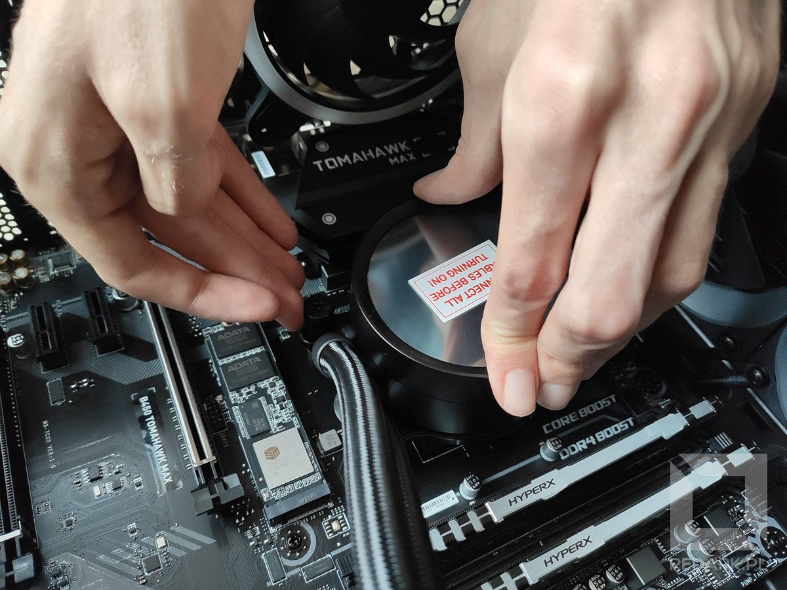
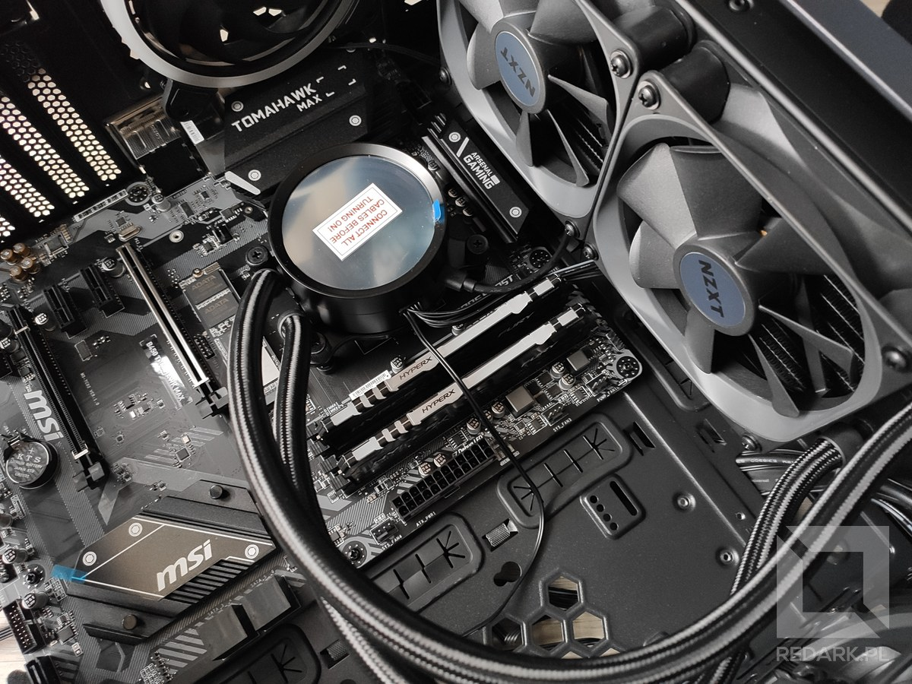
</Gallery>

Po położeniu pompki na procesorze, wkręć odrobinę wszystkie przygotowane wcześniej śruby. Następnie cały czas dociskając lekko blokopompkę, dokręcaj śruby stopniowo na krzyż. Jest to bardzo ważne, ponieważ pozwoli to równomiernie rozprowadzić termopastę po powierzchni procesora. Gdy wszystkie śruby są już należycie dokręcone, podłącz oba dołączone do zestawu przewody do blokopompki i wyprowadź je do góry na tył obudowy. Ich podłączeniem zajmiemy się później.

## Podsumowanie

To by było już na tyle w tym kroku. W obudowie znajduje się już płyta główna wraz z kompletnym chłodzeniem wodnym, którego instalacja wcale nie była łatwa! W następnej części poradnika zajmiemy się montażem zasilacza oraz dodatkowego dysku na dane, a także zaczniemy łączyć już wszystkie przewody ze sobą.

<AssemblingPcFooter nextPost='/skladanie-pc-2020-montaz-zasilacza-oraz-dyskow-na-dane'/>
