import AssemblingPcFooter from '../../typography/assemblingPcFooter'

W [poprzednim kroku](/skladanie-pc-2020-montaz-chlodzenia-wodnego-i-plyty-glownej) dokonaliśmy znaczącego postępu w składaniu komputera i zainstalowaliśmy w obudowie płytę główną oraz zestaw chłodzenia wodnego procesora. Dzisiaj zajmiemy się instalacją zasilacza oraz dysku HDD w tzw. piwnicy obudowy.

## Montaż dysku HDD

Najpierw zainstalujmy dysk twardy. Nasza obudowa posiada kilka miejsc, w których możliwe jest zainstalowanie dysków SSD/HDD o rozmiarze 2,5 cala. Ja z racji tego, że nie chcę, aby dysk psuł wygląd wnętrza komputera (gdyż posiada on jasną, srebrną obudowę), postanowiłem zamontować go w wydzielonej przestrzeni na samym dole obudowy. Przewidziano tam zaczepy umożliwiające instalację jednego dysku o rozmiarze 2,5 lub 3,5 cala. Znajdują się one tuż obok miejsca na zasilacz, dlatego chcę zamontować dysk jako pierwszy, ponieważ za chwilę będzie się tutaj roić od przeróżnych kabli zasilających.

Do składowania danych posłuży dysk twardy Seagate Barracuda o pojemności 1 terabajta i rozmiarze 2,5 cala. Dlaczego taki dysk, a nie większy (3,5 cala), który zazwyczaj jest montowany w komputerach PC? Ponieważ zależało mi bardziej na lepszej kulturze pracy, niż na wysokiej szybkości transferu. Dysk będzie służył przede wszystkim jako miejsce na kopie bezpieczeństwa, a modele 3,5 cala kręcą się znacznie szybciej (5400 kontra 7200) i generowałby znacznie więcej hałasu.

<ActionButton to='/nosniki-pamieci-dyski-hdd-ssd'>Dobieranie dysków na dane</ActionButton>

Początek montażu dysku rozpoczyna się od przykręcenia do niego czterech gumowych podkładek, które zmniejszą ilość drgań przekazywanych do obudowy. Po ich zamontowaniu, możemy wsunąć dysk na odpowiednie miejsce w obudowie, a następnie zabezpieczyć go przed wysunięciem przy pomocy specjalnej wysokiej śruby dołączonej do obudowy. Trochę dziwnie ona wygląda, ale trudno.

## Przygotowanie i montaż zasilacza

Dysk zamontowany, czas zająć się zasilaczem. Będzie to model SilentiumPC Supremo M2 o mocy 550 wat. Posiada on certyfikat sprawności 80 Plus Gold oraz pół modularny typ okablowania. Oznacza to, że część z jego przewodów nie jest na stałe przytwierdzona do zasilacza i może być dopinana w zależności od potrzeb użytkownika. Pozwala to zaoszczędzić dużo miejsca w obudowie oraz poprawić jej przewiewność. W zestawie znajdziemy zasilacz, dodatkowe przewody, kabel zasilający 230V z uziemieniem, opaski zaciskowe oraz śrubki mocujące.

<ActionButton to='/zasilacze'>Dobieranie zasilaczy</ActionButton>

Na stałe przytwierdzony jest kabel zasilający płytę główną oraz procesor. Oprócz tego, potrzebować będziemy jeszcze zasilania dla karty graficznej, blokopompki, kontrolera wentylatorów oraz dysku HDD. W tym celu wykorzystamy 3 z 5 dołączonych do zasilacza przewodów. Dwa z nich zakończone są wtyczkami 6+2 dla karty graficznej, natomiast trzeci kabel posiada trzy wtyczki zasilające SATA, które obskoczą resztę podzespołów. Przewody warto jest podłączyć od razu do zasilacza, aby nie musieć później szukać ich gniazd z użyciem latarki w obudowie.

<Gallery width='3'>
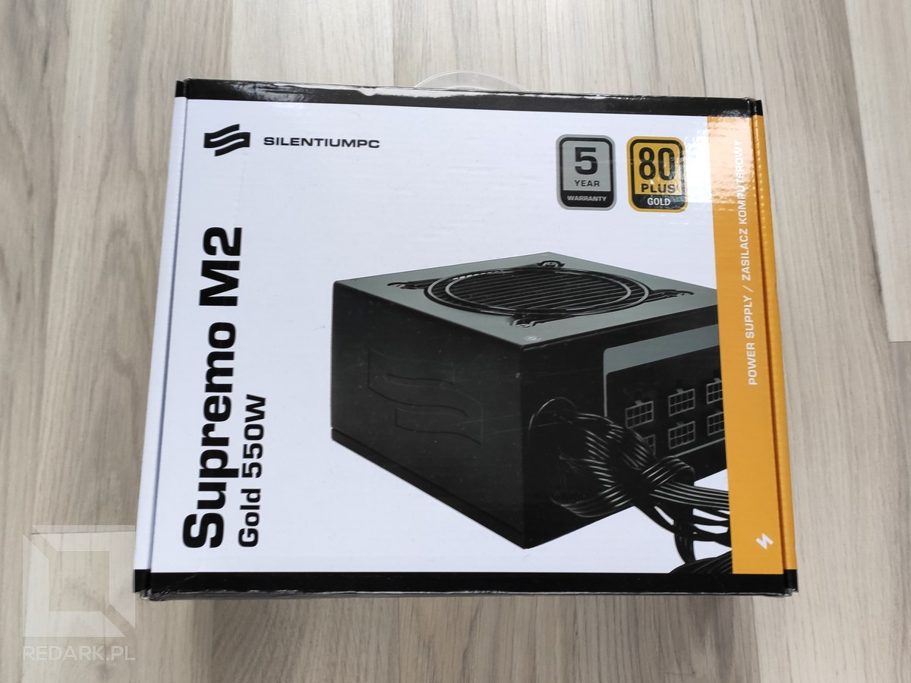
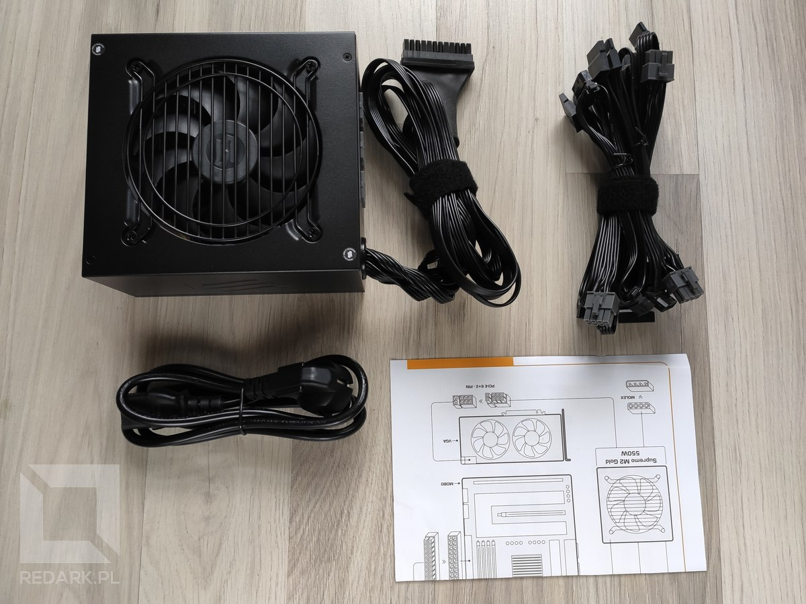
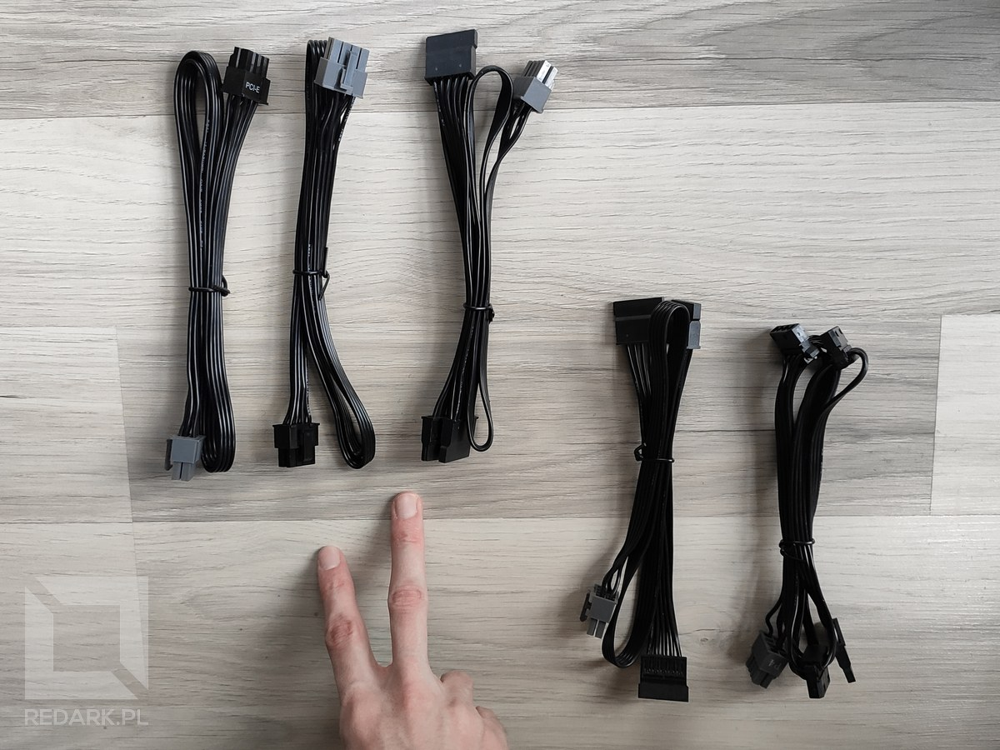
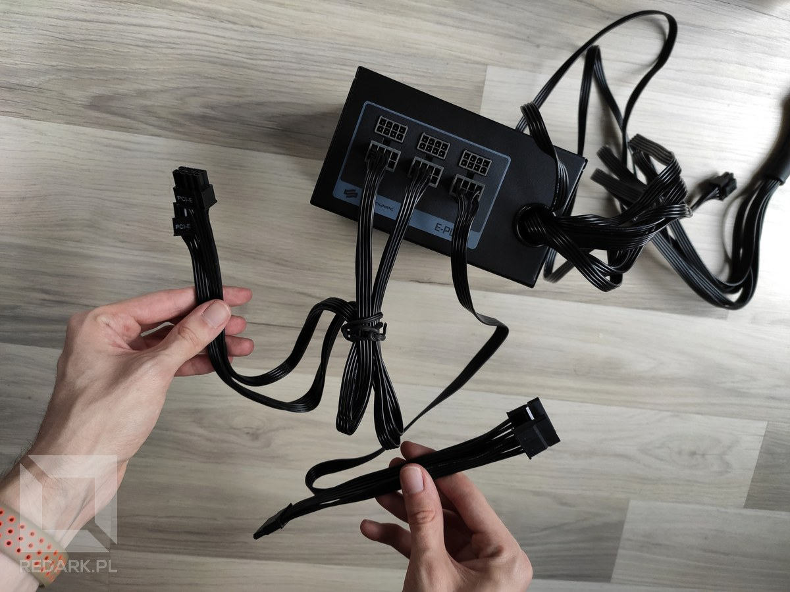
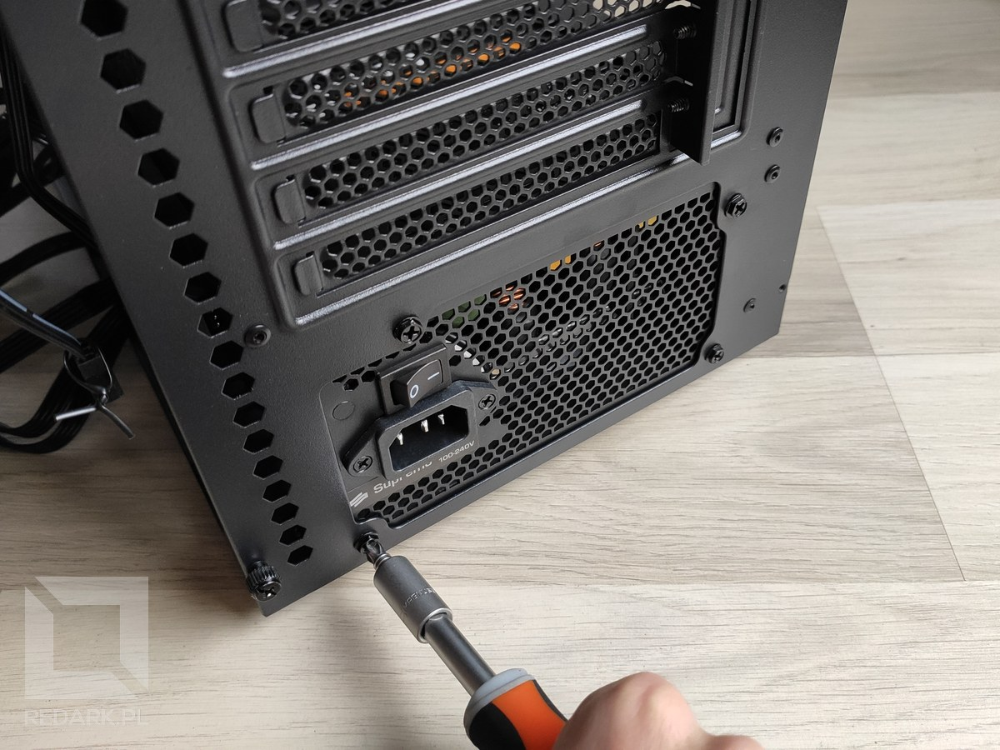
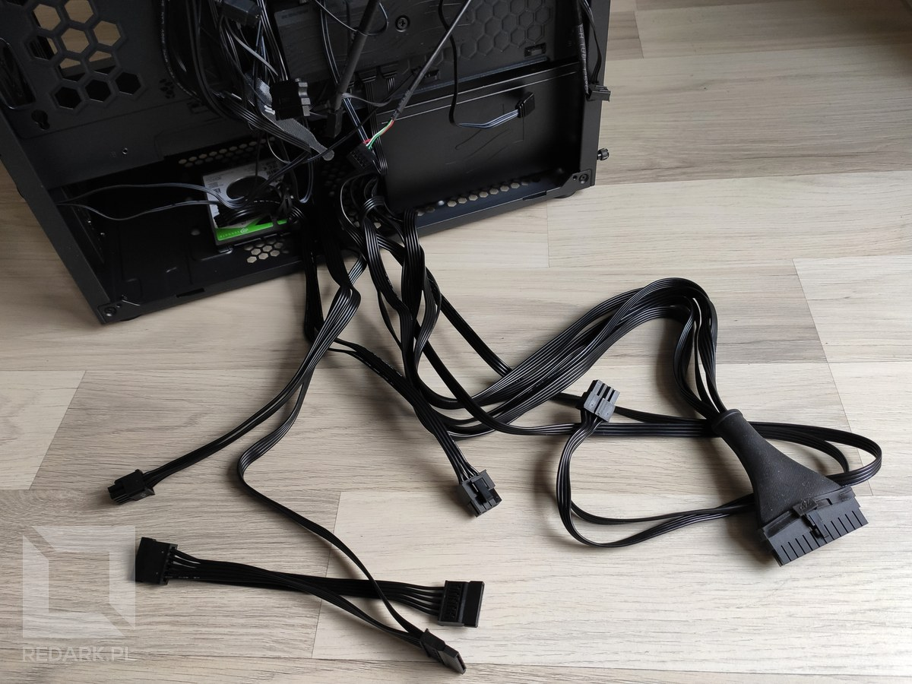
</Gallery>

Zasilacz mocowany jest do obudowy za pomocą czterech śrub dołączonych do zestawu. Aby ułatwić sobie montaż i nie walczyć z siłą grawitacji warto to robić w pionowej pozycji obudowy. Po przykręceniu kilku śrubek zasilacz jest już zamontowany! Chyba nie było to trudne, co nie? Teraz czas na coś znacznie trudniejszego, czyli podpinanie wszystkich przewodów.

<AdSense/>

## Technika podpinania przewodów

Przewodów idących przez obudowę jest masa i ciężko jest się w nich połapać nawet doświadczonym monterom. Abyś mógł/mogła przebrnąć przez ten proces sprawnie i bezpiecznie, podam Ci parę rad na układanie przewodów w jednostce. Nie będę pokazywał tutaj przeciągania i podpinania każdego przewodu z osobna. Przedstawienie czegoś takiego na zdjęciach jest niewykonalne. Ponadto nie ma na to sprawdzonego przepisu lub instrukcji. Układanie kabli to eksperymentowanie i szukanie najoptymalniejszego układu ich położenia. Ja w swoim pierwszym komputerze, aż trzy razy zmieniałem układ kabli. Przestałem dopiero wtedy, kiedy byłem zadowolony z efektu. Ciebie również to czeka, dlatego nie zakładaj, że pierwsze ułożenie musi być już tym ostatecznym.

## Przygotowywanie przewodów

Od rozpakowania obudowy z kartonu, "na jej tyłach" przez cały czas znajdowało się spięte kilkoma rzepami spaghetti przeróżnych kabli. Nie chcemy go, dlatego rozpinamy rzepy i całkowicie wysuwamy przewody z uchwytów, rozpuszczając je niczym włosy. Dodatkowo warto odłączyć przewody idące do kontrolera wentylatorów (czarna skrzyneczka u dołu). Na tym etapie ich podłączenie tylko utrudnia sprawę. Ja zostawiłem jedynie jeden kabelek sygnałowy, który możliwe, że był podłączony do niego na stałe.

## Podłączanie kabli zasilających

Podłączanie przewodów zaczniemy od przewodów zasilających wychodzących z zasilacza. Są one duże i grube przez co układa się je najciężej. Dlatego też zaczniemy właśnie od nich. W tym momencie najlepszą taktyką jest przerzucenie wszystkich przewodów niewychodzących z zasilacza przez górę obudowy, tak jak na zdjęciu:

<Gallery>
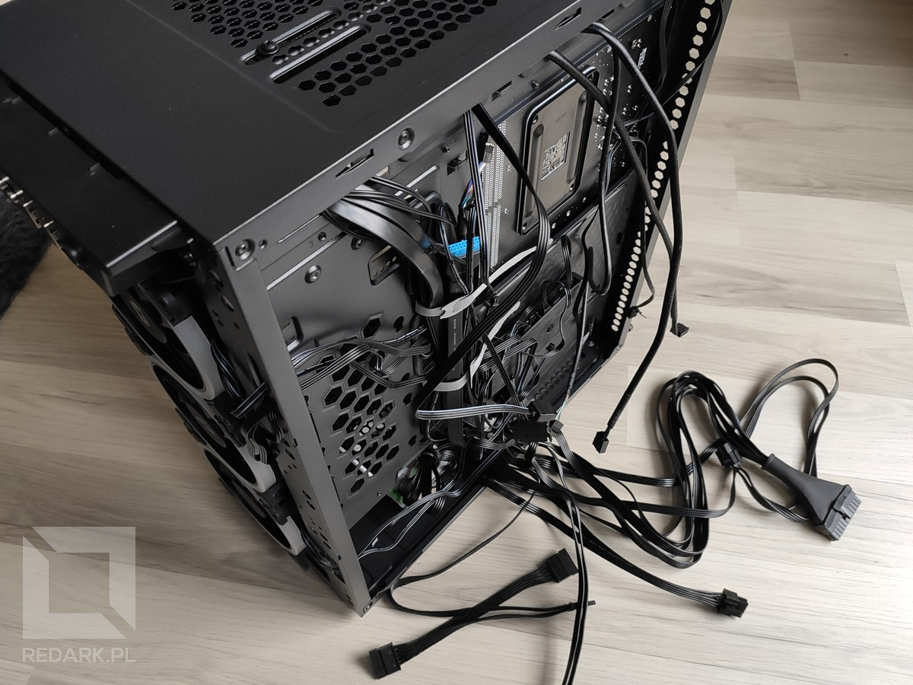
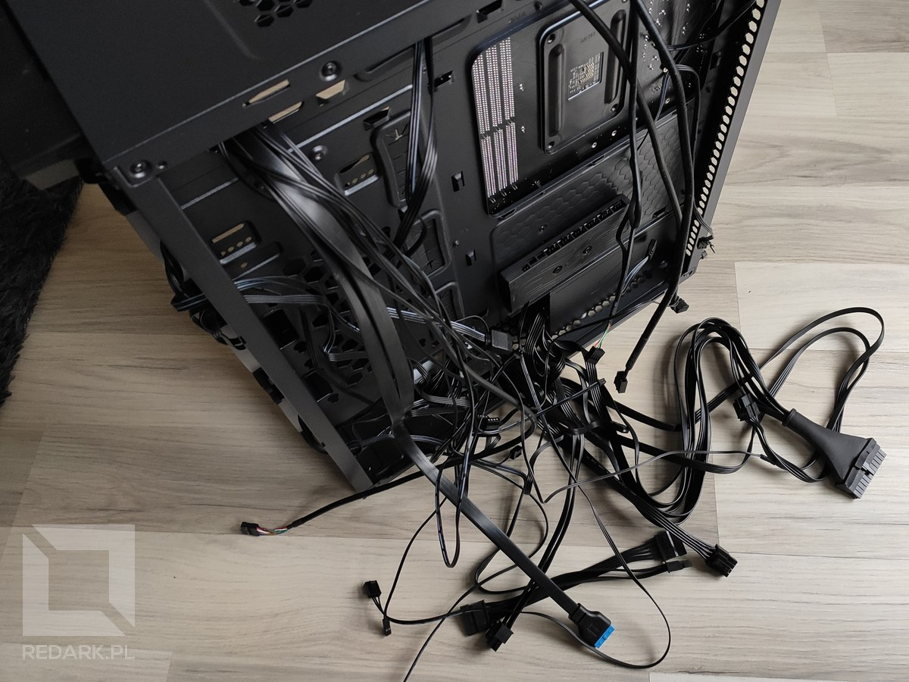
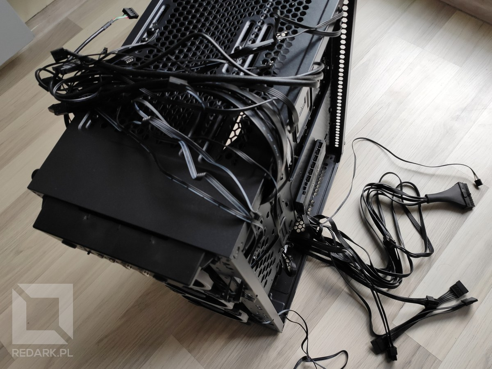
</Gallery>

<ImageDescription> Kable przed i po rozplątaniu oraz przygotowane do podłączania</ImageDescription>

Pozwala to skupić się tylko i wyłącznie na przewodach zasilacza. W tej części poradnika zajmiemy się przeprowadzeniem i podłączeniem sześciu elementów do zasilania:

- płyty głównej,
- procesora,
- karty graficznej (tylko doprowadzenie przewodów, bo karty jeszcze nie mamy zainstalowanej),
- blokopompki chłodzenia wodnego,
- kontrolera wentylatorów obudowy,
- dysku twardego.

### Zasilanie płyty głównej

Do zasilenia płyty głównej służy największa wtyczka w zasilaczu posiadająca 24 piny. Może być też ona dzielona na dwie łączone ze sobą wtyczki 20+4. Jej gniazdo znajduje się na prawej krawędzi płyty głównej. Bierzemy kabel, prowadzimy go w górę wzdłuż gumowych przepustów na kable, przeprowadzamy wtyczkę na drugą stronę i wpinamy ją do płyty głównej. Używany przeze mnie zasilacz ma na wtyczce założoną gumową osłonę, która zakrywa łączenie przewodów. Elegancko.

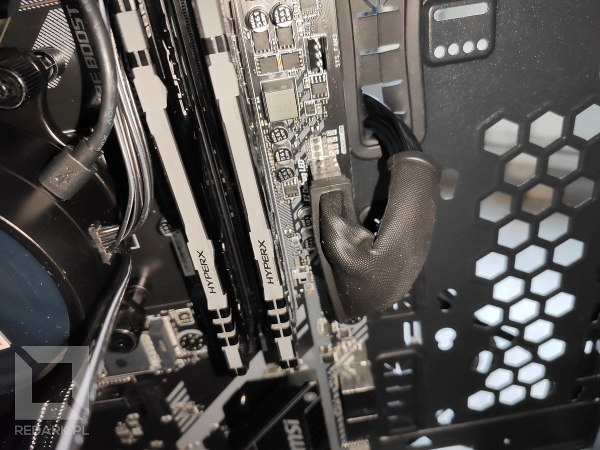

### Zasilanie procesora

Drugim elementem jest procesor. Posiada on osobną sekcję zasilania, której gniazdo znajduje się w górnym lewym rogu płyty głównej. Przewód poprowadziłem poziomo dołem obudowy oraz pionowo wzdłuż jej tylnej ścianki. Przez chłodnicę procesora jest tam trochę ciasno, więc trzeba się trochę nagimnastykować. W przypadku problemów, możesz poluzować śruby trzymające chłodnice i przesunąć ją bliżej frontu obudowy, o ile masz tam jeszcze trochę luzu.

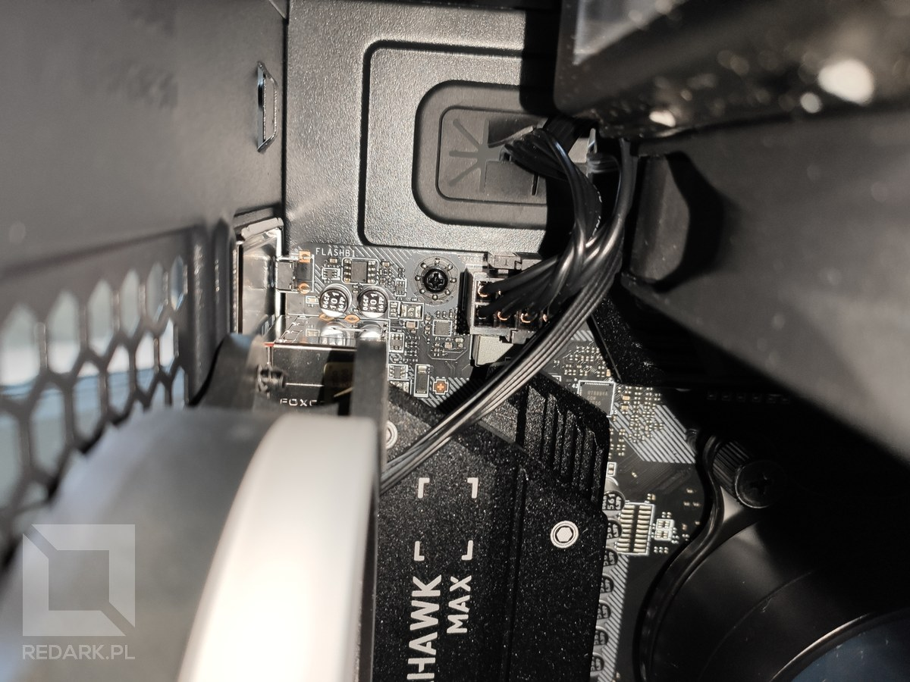

<AdSense/>

### Zasilanie karty graficznej

Choć nie mamy jeszcze zamontowanej w obudowie karty graficznej, to już teraz zadbajmy o doprowadzenie do jej okolic odpowiednich przewodów zasilających. Posłuży do tego gumowy przepust znajdujący się na środku osłony zasilacza. To tam mniej więcej będą znajdować się gniazda zasilania karty graficznej. Z racji niewielkiej odległości od zasilacza, już wcześniej związałem oba przewody, aby nie wiły się one niepotrzebnie w piwnicy.

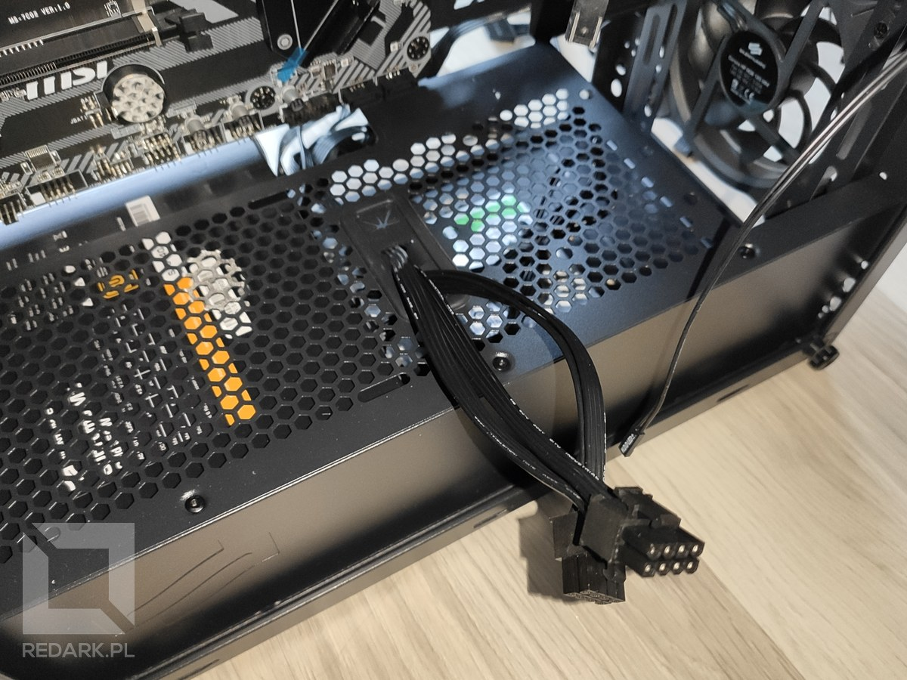

### Zasilanie SATA

Ostatnią trójkę zasilimy wspólnym przewodem zasilacza wyposażonym w trzy identyczne wtyczki SATA. Dysk twardy znajduje się na dole obudowy, kontroler obrotów jest z tyłu płyty głównej, czyli pozostało tylko zlokalizować przewód zasilający idący od blokopompki chłodzenia procesora. Aby to zrobić, idź tropem przewodów wychodzących z pompki i znajdź przewód zakończony szeroką płaską wtyczką. Na szczęście jest on bardzo długi i bez problemu można go poprowadzić w okolice dołu obudowy. Jak widzisz na poniższych zdjęciach, udało mi się bez problemu podłączyć wszystkie trzy urządzenia za pomocą jednego przewodu zasilacza. Super!

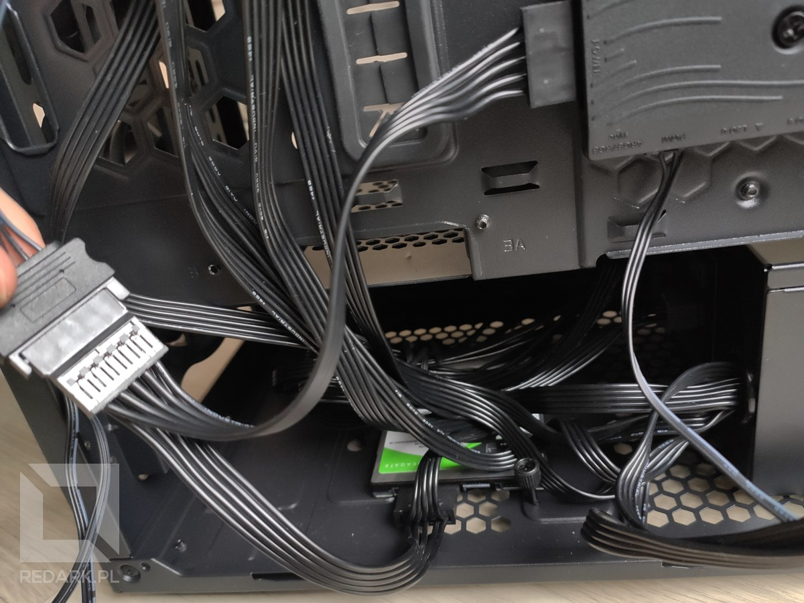

<InfoBlock>Jeśli obskoczenie wszystkich urządzeń jednym kablem SATA nie będzie możliwe, pamiętaj, że do zasilacza pół modularnego były dołączone jeszcze dwa inne kable posiadające wtyczki SATA.</InfoBlock>

## Podsumowanie

W tym miejscu przerwijmy na chwilę szał podłączania przewodów. Przeszliśmy przez instalację w obudowie dysku twardego oraz zasilacza, a także podłączenie najważniejszych kabli zasilających. W następnym artykule będziemy kontynuować ten temat i zaczniemy formować eleganckie wiązki przewodów.

<AssemblingPcFooter nextPost='/skladanie-pc-2020-podlaczanie-i-ukladanie-przewodow-w-obudowie'/>
