import AssemblingPcFooter from '../../typography/assemblingPcFooter'

W [poprzednim artykule](/skladanie-pc-2020-montaz-zasilacza-oraz-dyskow-na-dane) z serii zamontowaliśmy zasilacz oraz dodatkowy dysk na dane. Zaczęliśmy również podłączać i układać pierwsze przewody w obudowie. Dzisiaj będziemy kontynuować ten temat.

## Sposób na podłączenie wszystkich przewodów

Celem uporządkowanego układania przewodów w jednostce centralnej komputera jest poprawa cyrkulacji powietrza, zabezpieczenie przewodów przed dostaniem się w wirniki wentylatorów oraz rzecz jasna - kwestie estetyczne. Najpopularniejszą metodą układania przewodów jest wyznaczenie sobie linii (korytek) na przewody za płytą główną. Obudowa składanego przez nas komputera posiada bardzo dużo przeróżnych uchwytów, do których możliwe jest ich przytwierdzenie. Dodatkowo dysponujemy tutaj ogromną przestrzenią za płytą główną. Tanie obudowy mają tego miejsca jak na lekarstwo i trzeba się nieźle natrudzić, aby dało się je później zamknąć. Ja  wyznaczyłem sobie taką trasę układania przewodów:

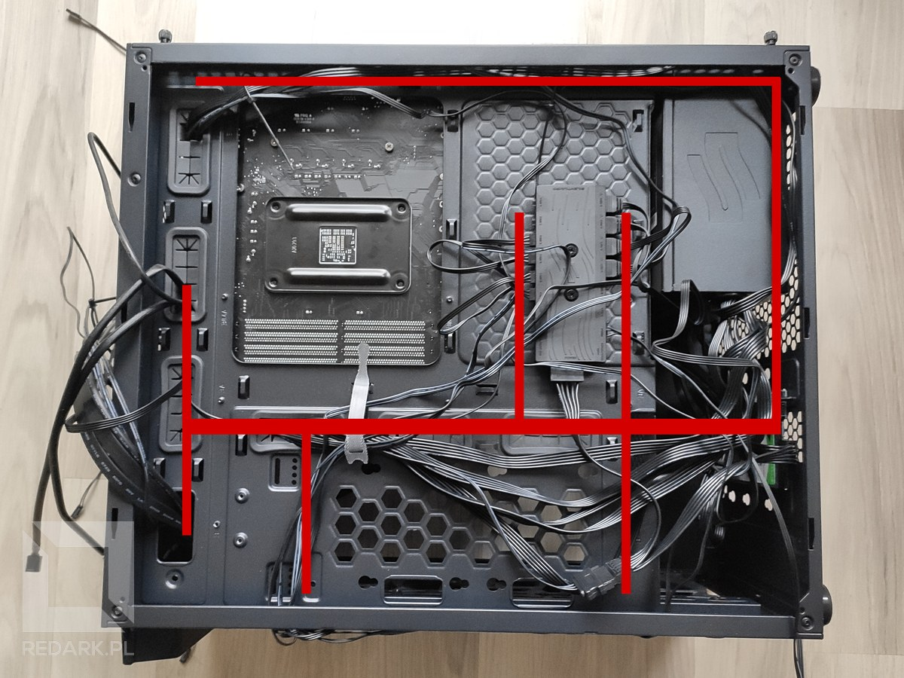

<ImageDescription>Przykładowe poprowadzenie kabli w obudowie</ImageDescription>

Tak jak już wspominałem w poprzednim kroku, nie będę tutaj przedstawiał fotografii jak przeciągam każdy kabelek z osobna, bo nie ma to sensu. Tę drogę trzeba przebyć samemu i powtarzać, dopóki efekt pracy nie będzie zadowalający. Pokażę jednak kilka zdjęć prezentujących postęp w przeciąganiu przewodów, oraz sfotografuję wszystkie wtyczki w gotowej jednostce wraz z opisem przeznaczenia kabli. Jednak zanim to zrobię, zwróćmy jeszcze uwagę na budowę kontrolera wentylatorów, którego kazałem wcześniej całkowicie rozłączyć.

## Podłączanie kontrolera wentylatorów oraz oświetlenia RGB

Przyjrzyjmy się mu z bliska:

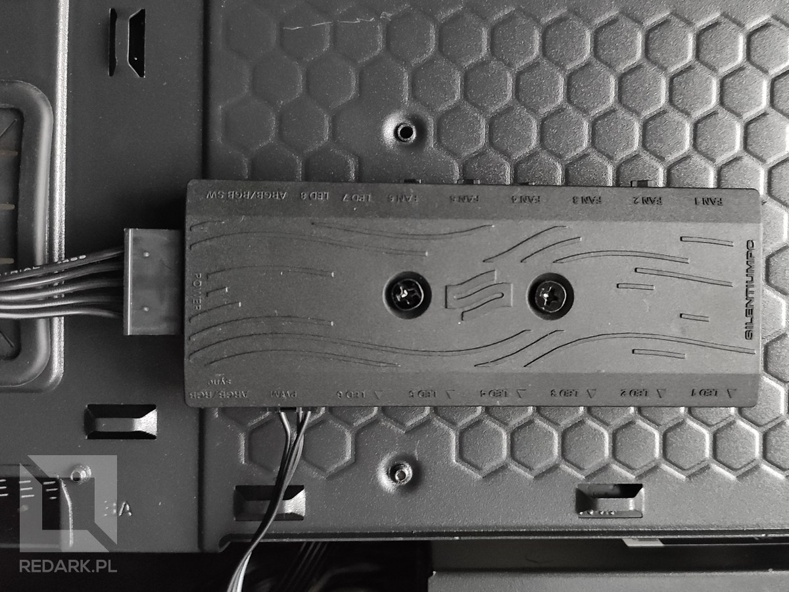

<ImageDescription>Kontroler wentylatorów i oświetlenia obudowy SilentiumPC Armis AR6X TG RGB</ImageDescription>

Po lewej stronie znajduje się gniazdo zasilania SATA, które w poprzednim kroku podłączyliśmy do zasilacza. Górna krawędź zawiera:

- **RGB SW** - czyli miejsce na przewód idący do przycisku zmiany podświetlenia RGB, który znajduje się na przednim panelu obudowy. Jest on podpisany na wtyczce skrótem "LED SW",
- **LED 7 i LED 8** - są to dwupinowe gniazdka służące do podłączenia podświetlenia obydwu przycisków panelu frontowego (opowiem o nich jeszcze później),
- **FAN 1-6** - sześć gniazd do podłączenia zasilania wentylatorów obudowy. Posiadają one "języczki", które ustalają prawidłową orientację wtyczki w gnieździe. W przypadku tej obudowy warto jest wpiąć któryś z wentylatorów do gniazda **FAN 6**. Odczyt prędkości obrotowej tylko tego wentylatora będzie przekazywany do płyty głównej. Informacja ta jest podana w instrukcji dołączonej do obudowy, ale po opiniach w sklepach internetowych widziałem, że parę osób jej nie przeczytało i wystawiało "negatywa" za wadliwy kontroler, który nie pokazuje prędkości wentylatorów.

<AdSense/>

To by było na tyle gniazd z górnej krawędzi. Teraz zajmijmy się dolną:

- **RGB sync** - przewód sygnałowy idący do płyty głównej pozwalający sterować oświetleniem obudowy z poziomu dedykowanego do tego oprogramowania. Poprzez przytrzymywanie przycisku z przodu obudowy jesteśmy w stanie przełączać kontroler pomiędzy wbudowanymi trybami świecenia a sterowaniem przez płytę główną. Niestety, nie wiadomo czemu, przewód ten nie został dołączony do obudowy,
- **PWM** - przewód sygnałowy idący do płyty głównej pozwalający sterować prędkością obrotową wszystkich wentylatorów. Koniec jego przewodu należy podłączyć do dowolnego gniazda oznaczonego skrótem **SYS_FAN**,
- **LED 1-6** - sześć gniazd do podłączenia oświetlenia RGB. W przypadku tych złączy ważna jest znajdująca się obok nich strzałka. Musi się ona znajdować po tej samej stronie, jak na wtyczce. W przeciwnym wypadku oświetlenie nie będzie działać.

Oto cały kontroler. Nie ma tutaj czarnej magii. Jest on bardzo rozbudowany, co należy zachwalać, ale nie podoba mi się jedno rozwiązanie, jakie zostało w nim wprowadzone. Mówiłem wcześniej o gniazdach **LED 7** oraz **LED 8**, do których podłączane są diody sygnalizacyjne panelu frontowego. Przyciski zaświecają się, gdy komputer (kontroler) się uruchomi i gasną, gdy komputer się wyłączy. Wszystko pięknie, ale producent zapomniał chyba o jednym bardzo ważnym zastosowaniu tych diod. Komputer znajdujący się w trybie uśpienia nie może zostać pozbawiony prądu. Jego odłączenie oznacza utratę danych, nad jakimi pracowaliśmy, a także możliwość poważnego uszkodzenia plików systemu operacyjnego. Aby tego uniknąć, znajdująca się na froncie obudowy dioda zasilania jest podłączana bezpośrednio do płyty głównej komputera. Dzięki temu, gdy komputer przechodzi w tryb uśpienia, dioda na obudowie zaczyna mrugać lub pulsować, co ostrzega o pozostawieniu niewyłączonej jednostki. W przypadku obudowy od SilentiumPC tego nie ma. Diody są podłączone do kontrolera i świecą się tylko wtedy, gdy on pracuje. Może to spowodować sytuację, w której nieświadomi uśpienia komputera, wyłączymy listwę zasilającą obok biurka narażając się tym samym na utratę danych. Moim zdaniem jest to bardzo nierozsądne i niebezpieczne rozwiązanie.

## Związywanie przewodów

Wróćmy jednak do tematu układania przewodów. Poniżej możesz zobaczyć kilka zdjęć z przebiegu tego procesu. Cała filozofia układania przewodów polega na ich stopniowym dokładaniu do tworzącej się wiązki. Najpierw zaczynasz tylko z przewodami zasilania, mocujesz je za pomocą dołączonych do obudowy rzepów, bierzesz kolejny przewód, przewlekasz go przez rzepy, wpinasz do gniazdka. Powtarzasz te czynności, aż nie pozostanie w komputerze ani jedna niepodłączona wtyczka. Pamiętaj również, że w instrukcjach dołączonych do podzespołów zawsze jest wszystko dokładnie opisane! Jeśli nie wiesz, do czego jest dana wtyczka i gdzie ma być podłączona - weź instrukcję! Oto cała filozofia układania kabli!

<Gallery width='2'>
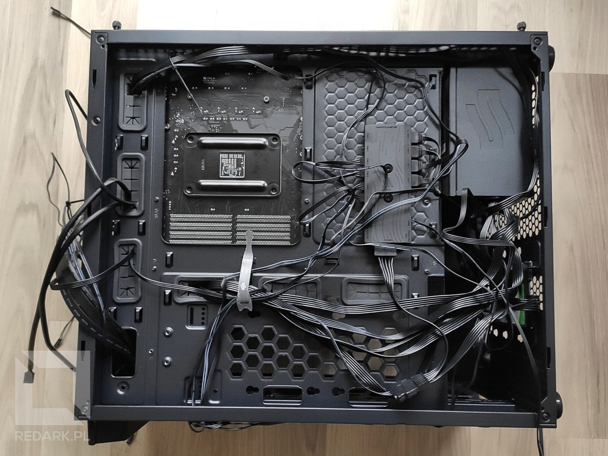
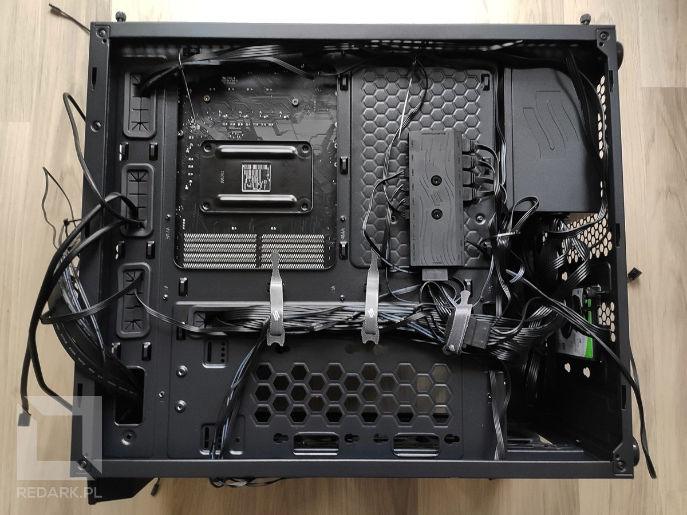
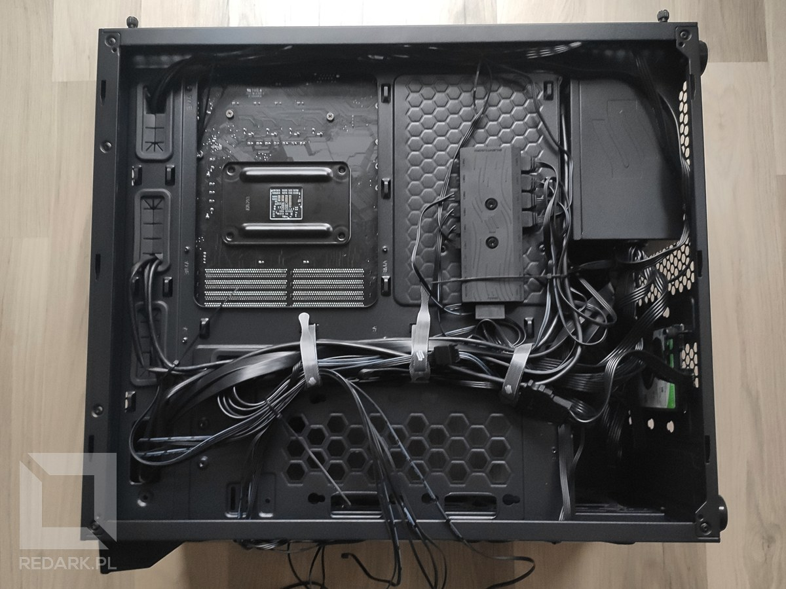
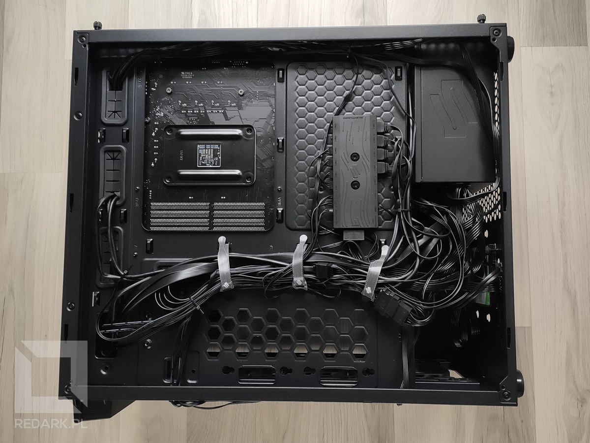
</Gallery>

<ImageDescription>Stopniowe formowanie wiązki kabli jest drogą do sukcesu</ImageDescription>

## Omówienie gotowej instalacji

Poniżej prezentuję zdjęcia gotowej instalacji. Muszę przyznać, że całkiem fajnie ona wyszła. Na pewno dużo pomogło zastosowanie modularnego zasilacza oraz przestronnej obudowy. Przy tańszych modelach trzeba się o wiele bardziej natrudzić.

<Gallery width='2'>
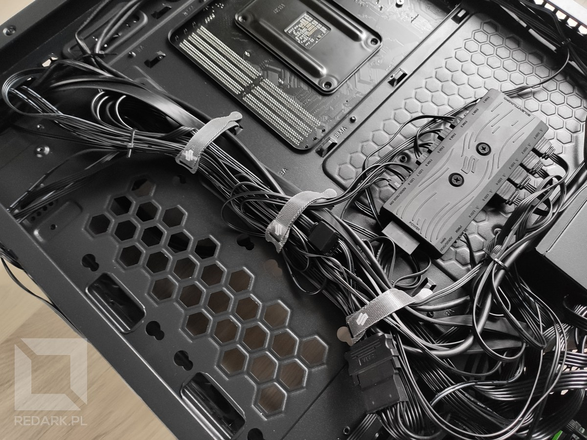
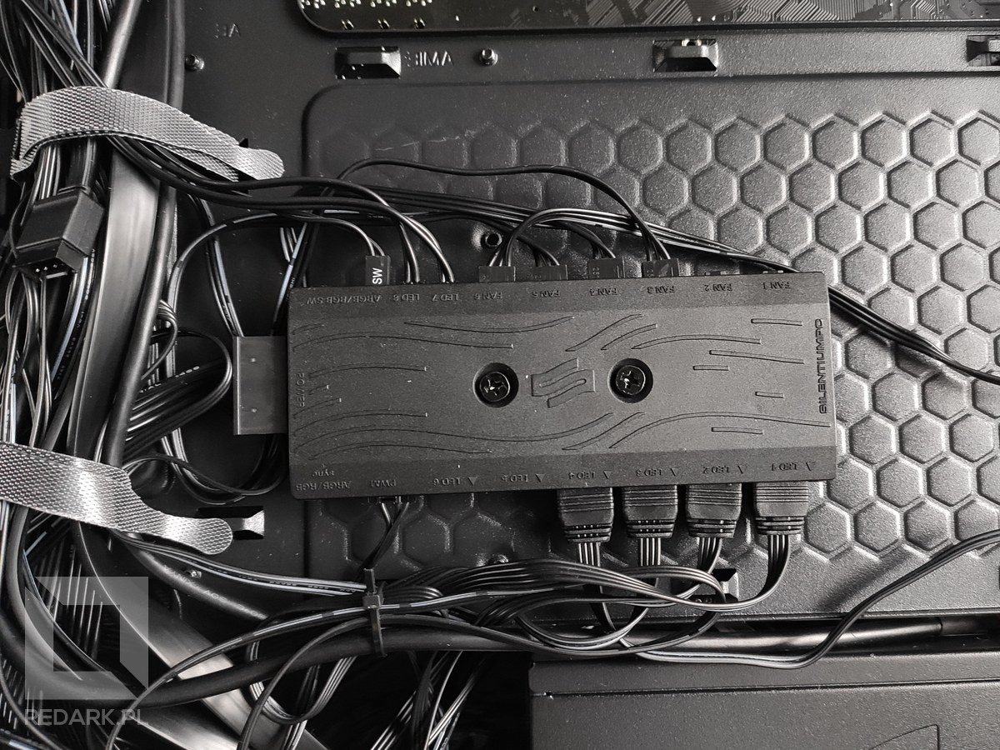
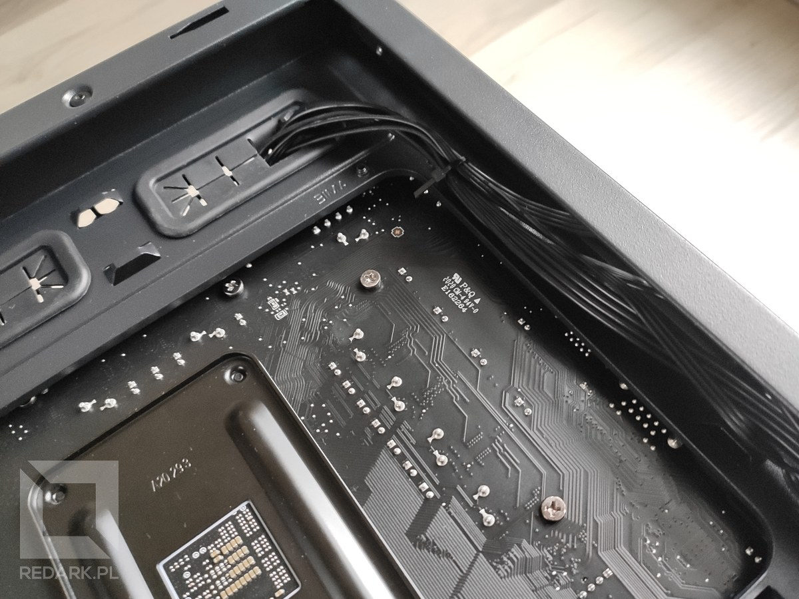
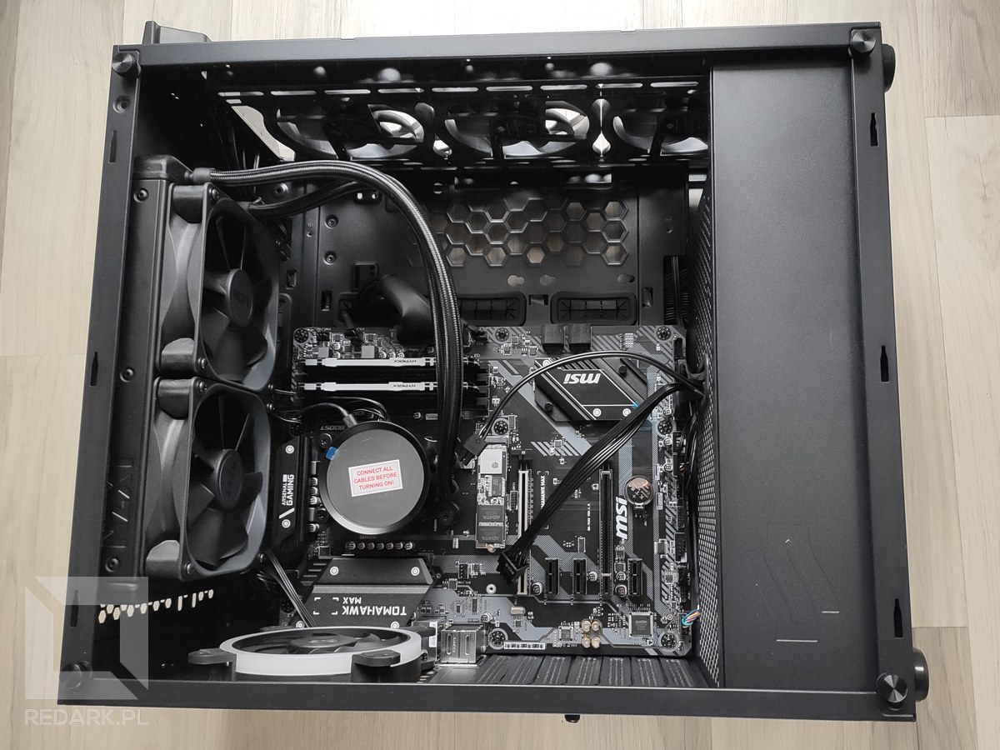
</Gallery>

<ImageDescription>Gotowe okablowanie obudowy</ImageDescription>

A teraz, zgodnie z obietnicą, prezentuję wszystkie znajdujące się w obudowie wtyczki oraz gniazdka wraz z opisem, co jest do czego podłączone.

### Tył obudowy

Zacznijmy od kontrolera. Jest tam podłączony przycisk LED SW idący z przedniego panelu obudowy, dwie diody LED frontowych przycisków, cztery wentylatory (zasilanie oraz podświetlenie RGB) oraz kabel PWM idący do płyty głównej. Kabla do sterowania podświetlenie RGB przez płytę główną, tak jak już mówiłem, nie było w zestawie. Zasilanie podłączone jest od lewej za pomocą gniazda SATA. Obok kontrolera, pośród przewodów, znajduje się jedna niepodłączona wtyczka. Idzie ona do chłodzenia wodnego Nzxt Kraken i jest opcjonalna w podłączeniu (więcej informacji później). Poniżej omawianej wtyczki znajduje się jeszcze zasilanie blokopompki Krakena. Do dysku twardego, oprócz zasilania SATA, został jeszcze podłączony kabel sygnałowy idący do płyty głównej.

<Gallery>
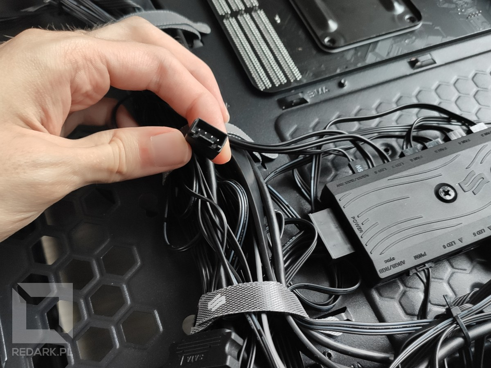
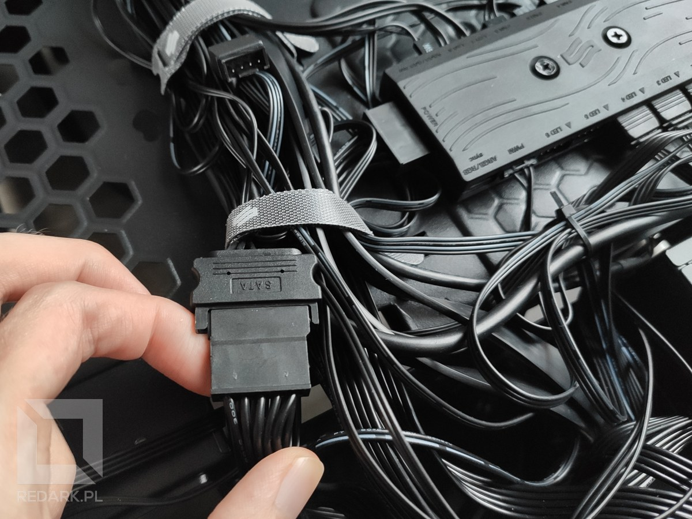
</Gallery>

### Płyta główna

Zobaczmy na płytę główną. U samej góry po lewej mamy 8-pinowe zasilanie procesora. Blokopompka posiada dwa przewody: jeden USB, a drugi zbiorczy, rozchodzący się na kilka pomniejszych kabelków. Jeden z nich zakończony jest wtyczką identyczną, co zasilanie wentylatorów w kontrolerze obudowy. Musi ona zostać podłączona do gniazda **CPU_FAN** znajdującego się obok procesora na płycie głównej. Jest ona wpięta i widoczna na poniższych zdjęciach. Reszta przewodów idzie już za płytę główną.

<Gallery>

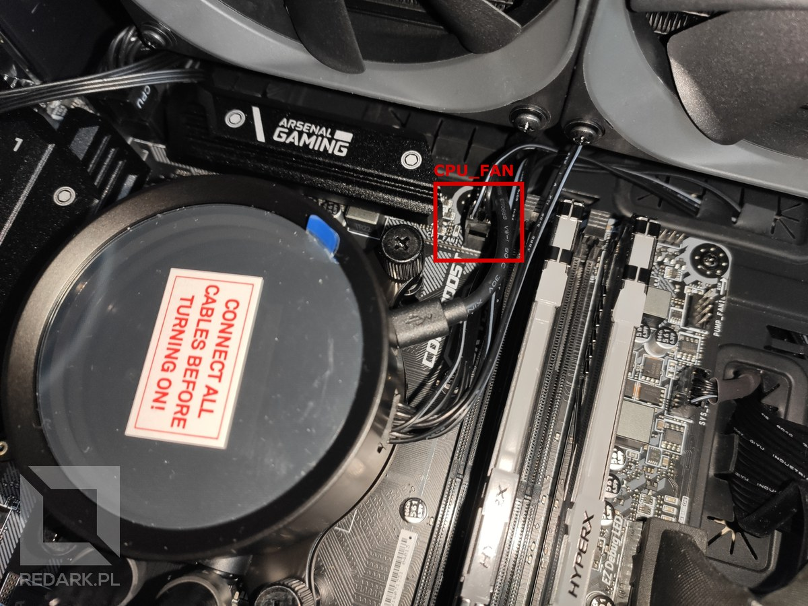
</Gallery>

Prawa krawędź płyty głównej zawiera trzy wtyczki. Największa to 24-pinowe zasilanie idące z zasilacza. Wtyczki po bokach są podłączone do gniazd oznaczonych skrótem **SYS_FAN** i są to kable zasilające dwa wentylatory chłodnicy Nzxt Kraken. Podłączyłem je bezpośrednio do płyty, a nie do kontrolera obrotów obudowy, aby móc sterować nimi z poziomu dedykowanego oprogramowania od Nzxt.

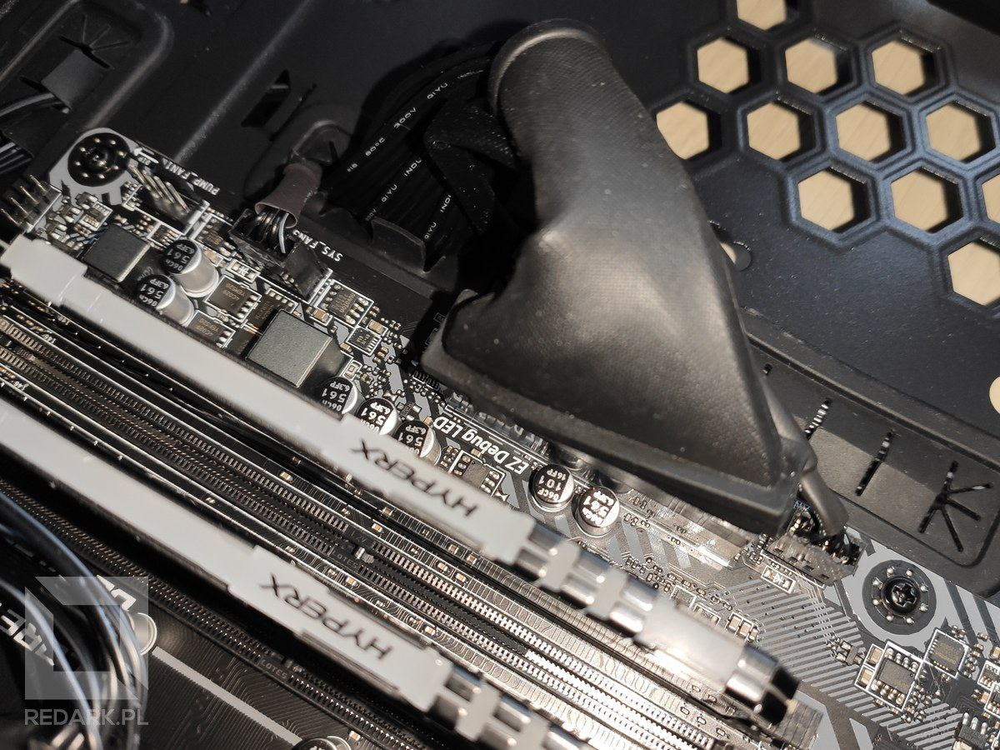

Dół płyty zawiera najwięcej kabli. Omówię je wszystkie, idąc od lewej:

- **HD AUDIO** - kabel gniazda słuchawkowego i mikrofonowego znajdującego się na panelu frontowym,
- **SYS_FAN** - kabel do sterowania wentylatorami obudowy idący do kontrolera i jego gniazda PWM,
- **FPANEL** - zestaw małych kabelków od panelu frontowego (przycisk power, reset itd.), których opis podłączenia znajdziesz oczywiście w instrukcji obsługi płyty głównej,
- **USB2** - kabel USB idący do blokopompki Krakena, który umożliwia sterowanie jego parametrami (po jego podłączeniu nie jest wymagane podłączanie wtyczki, którą pokazywałem wcześniej z tyłu obudowy),
- **USB3** - kabel od gniazd USB znajdujących się na panelu frontowym,
- **SATA** - kabel sygnałowy idący do dysku twardego zamontowanego w piwnicy obudowy.

<AdSense/>

Z tego samego otworu, którym wychodzą przewody USB3 i SATA jest poprowadzone zasilanie 2x6+2 pin do karty graficznej, którą zamontujemy w następnej części poradnika.

<WarningBlock>W wielu płytach głównych, gdy instalujemy dysk SSD w gnieździe M.2, część portów SATA zostaje dezaktywowana i nie może zostać wykorzystana! Informacje o tym, które porty zostaną dezaktywowane, znajdziesz w instrukcji obsługi płyty głównej. U mnie były to dwa najwyższe porty znajdujące się na prawej krawędzi podzespołu.</WarningBlock>

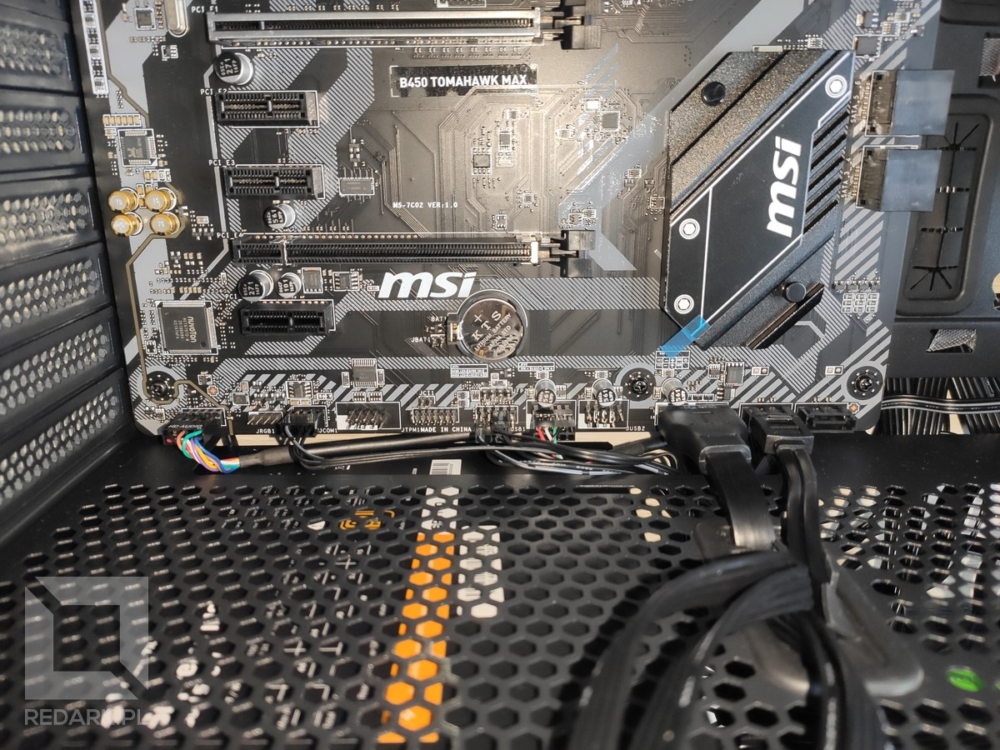

## Podsumowanie

To już wszystko w tej części. W tym momencie, Twój komputer powinien posiadać już podłączone wszystkie wymagane przewody. W następnym, ostatnim w tej serii artykule, zajmiemy się instalowaniem w obudowie karty graficznej oraz dodatkowej karty sieciowej Wi-Fi, a także przygotujemy jednostkę do pierwszego uruchomienia.

<AssemblingPcFooter nextPost='/skladanie-pc-2020-montaz-karty-graficznej-oraz-sieciowej'/>
