import AssemblingPcFooter from '../../typography/assemblingPcFooter'

Komputer jest już prawie gotowy. Pozostało jeszcze zamontować w nim kartę graficzną, a także dodatkową kartę sieciową, która zapewni łączność bezprzewodową Wi-Fi. Zaczynajmy.

## Usunięcie śledzi kart rozszerzeń

Przed zainstalowaniem jakiejkolwiek karty rozszerzeń, musimy najpierw usunąć odpowiednie zaślepki na tylnej ściance obudowy. Mogą być one mocowane na dwa sposoby:

- **wyłamywane** - są jednorazowe, ciężko demontowalne i występują w tańszych modelach obudów,
- **odkręcane** - wielokrotnego użytku, łatwe w demontażu i ponownym montażu.

Nasza obudowa posiada śledzie wykręcane. Aby dostać się do ich śrub mocujących, najpierw musimy usunąć ich osłonkę, która jest trzymana przez jedną dużą śrubę z tyłu obudowy. Następnie możemy już przejść do demontażu interesujących nas zaślepek.

<Gallery>
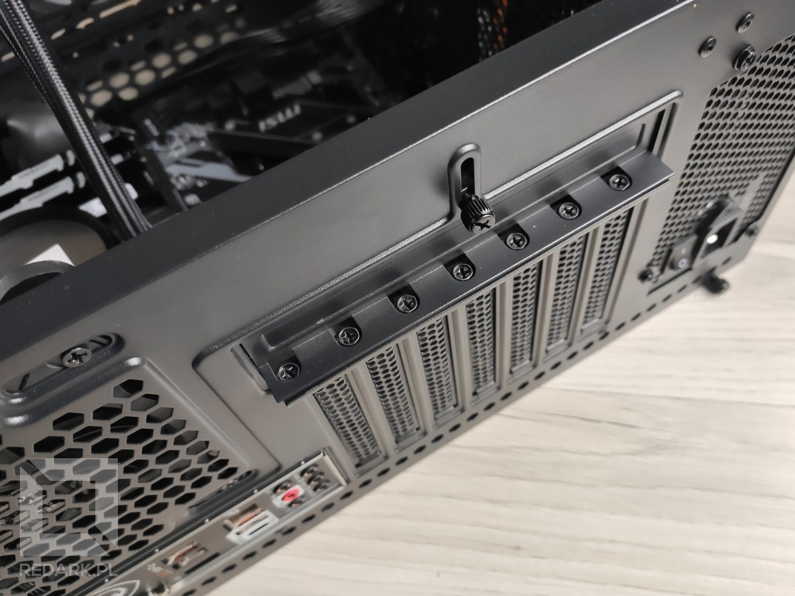
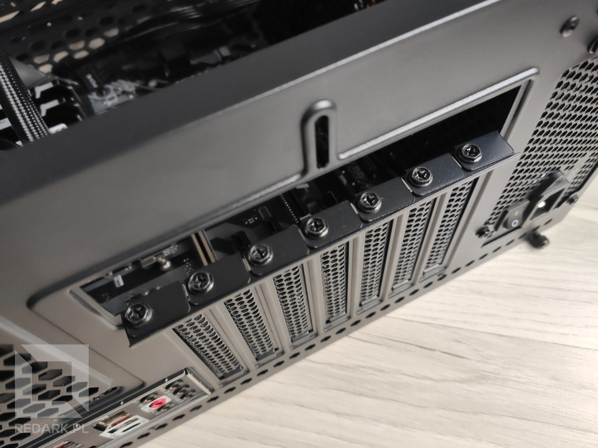
</Gallery>

## Montaż karty sieciowej

Zacznijmy od mniejszego gracza. Za komunikację sieciową odpowiedzialny będzie Tp-Link AC1300 Archer T6E. Jest to karta Wi-Fi obsługująca dwa pasma komunikacji 2.4 i 5 GHz oraz posiadająca dwie anteny wspierające komunikację 2x2 MIMO. Do komunikacji z komputerem karta wykorzystuje złącze PCI-Express x1. Opis części tych parametrów znajdziesz w artykule poświęconym routerom domowym. W pudełku znajdziemy kartę, parę antenek, śledź typu "Low-profile" oraz płytkę ze sterownikami.

<ActionButton to='/jak-wybrac-router-domowy'>Dobieranie routerów domowych</ActionButton>

<Gallery>
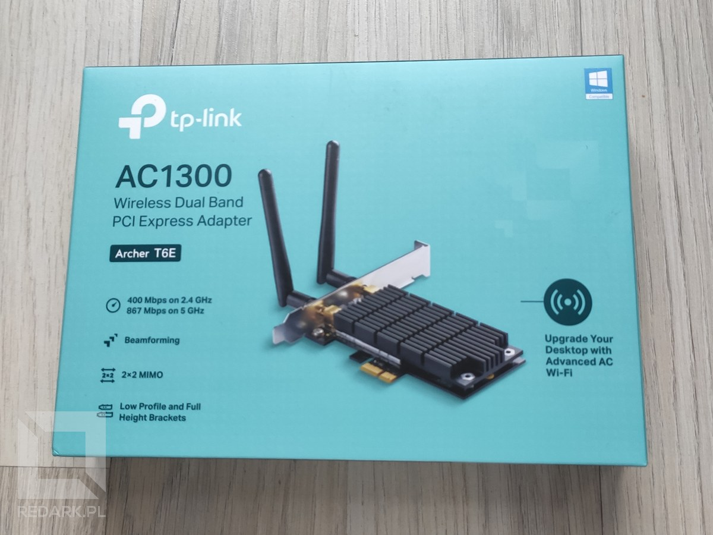
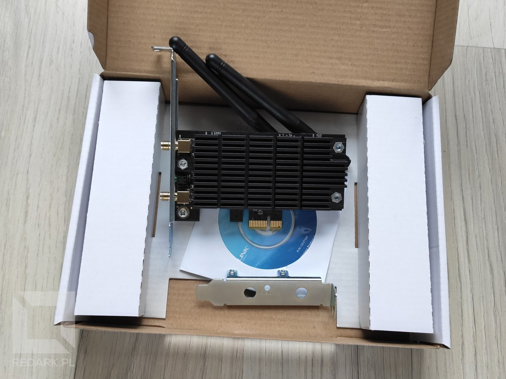

</Gallery>

Montaż karty jest banalnie prosty. Odkręcamy zaślepkę przy dowolnym porcie PCIe x1, a następnie wsuwamy kartę do gniazda. Na koniec przykręcamy śledź tą samą śrubką, którą była przytwierdzona zaślepka. Ja na montaż wybrałem najniższy możliwy port. Zakryje to przewody u dołu płyty głównej oraz da wystarczająco dużo przestrzeni na zainstalowanie karty graficznej oraz anten nadawczo-odbiorczych za obudową.

<AdSense/>

## Montaż karty graficznej

Z racji rozmiaru obecnych kart graficznych, ich montaż jest trochę bardziej skomplikowany. Do zaprezentowania tego procesu posłuży moja dawna karta Gigabyte GTX 970 G1 Gaming. Jest ona za słaba dla zamontowanego w komputerze Ryzena 3600, ale jest to celowy zabieg. Do tej jednostki lepiej sprawdziłaby się karta pokroju RTX 2070.

<ActionButton to='/karty-graficzne'>Dobieranie karty graficznej</ActionButton>

<Gallery>
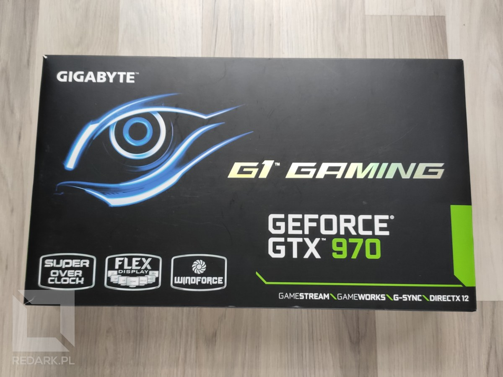
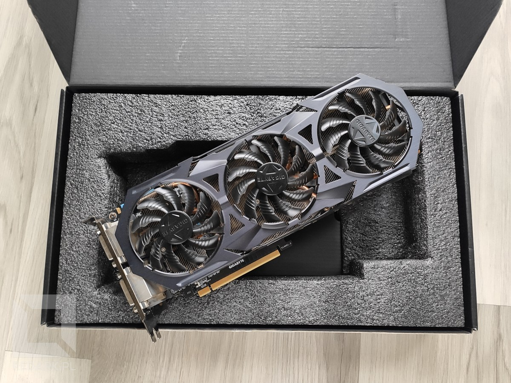
</Gallery>

Montaż karty graficznej rozpoczynamy ponownie od demontażu zaślepek. Karta montowana jest w gnieździe PCIe x16, który na tej płycie głównej jest dodatkowo wzmocniony metalową osłoną. Wykorzystane GPU zajmuje 2 sloty na karty rozszerzeń, dlatego tyle też zaślepek musimy zdemontować z tyłu obudowy. Drugą czynnością jest odbezpieczenie zaczepu na końcu gniazda PCI-Express. Ma on identyczną budowę, co zatrzaski przy pamięciach RAM - zaskoczy samoczynnie, gdy karta znajdzie się na swoim miejscu. Po wykonaniu tych dwóch rzeczy, możemy już umieścić ostrożnie kartę w obudowie. Następnie upewnijmy się, że zatrzask gniazda PCIe zablokował kartę w gnieździe, a później dokręćmy dwie śruby trzymające śledź GPU. Ostatnim elementem jest podłączenie poprowadzonych wcześniej kabli zasilających. GTX 970 do działania wymaga dwóch wtyczek - jednej 8-pinowej, a drugiej 6-pinowej. Nasze obie wtyczki są typu 6+2, więc "usuwamy" z jednej wtyczki dobudowane dwa piny i podłączamy zasilanie do karty graficznej. Gotowe!

<Gallery width='2'>
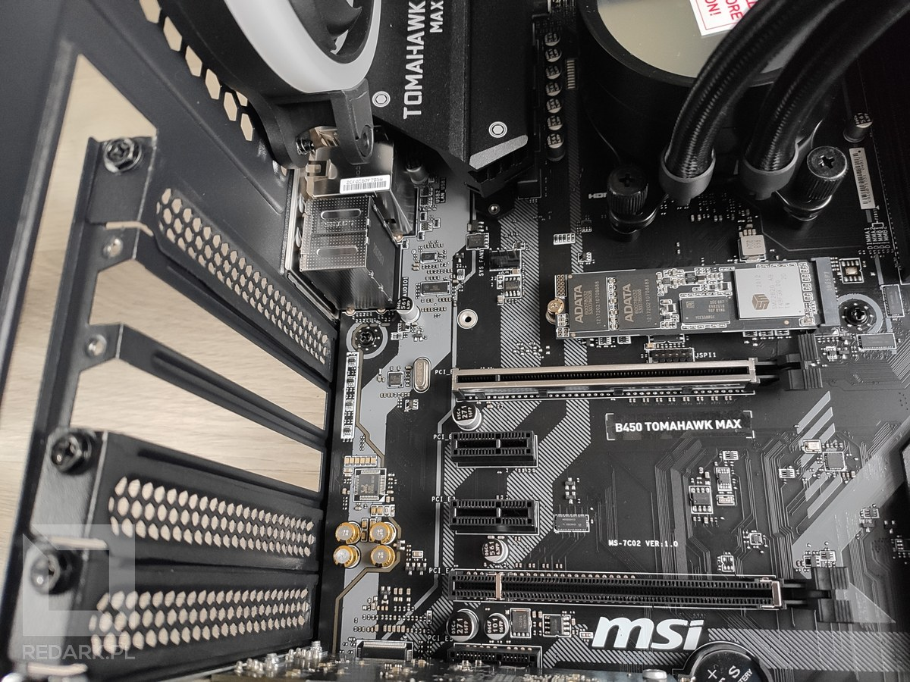
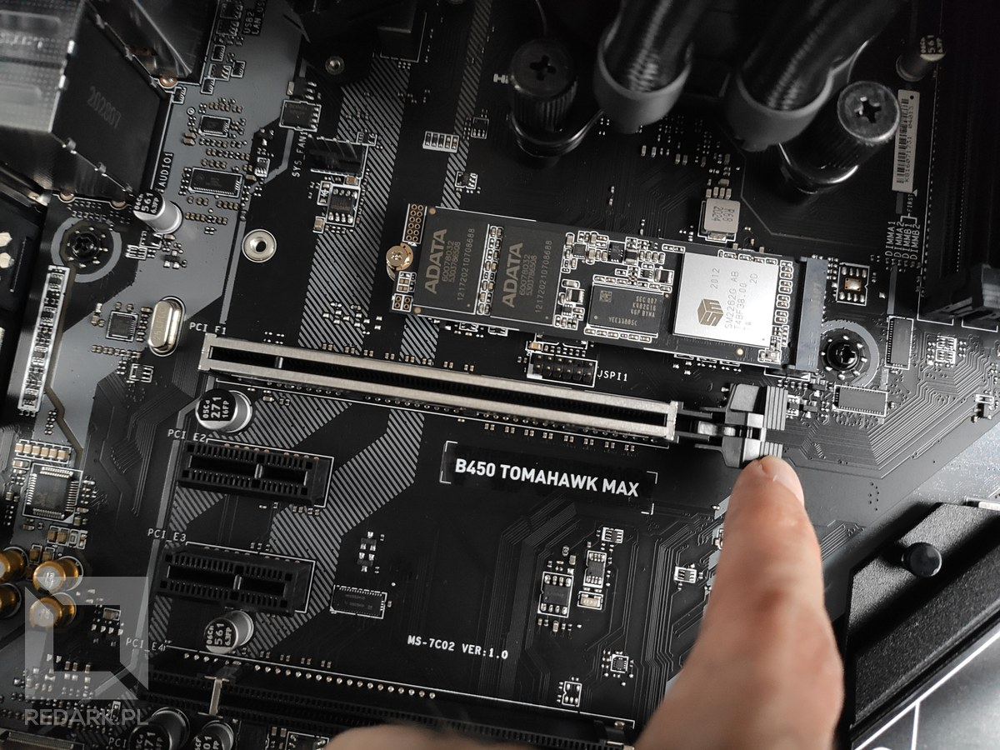
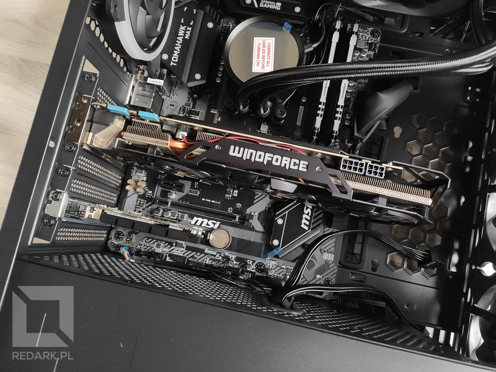
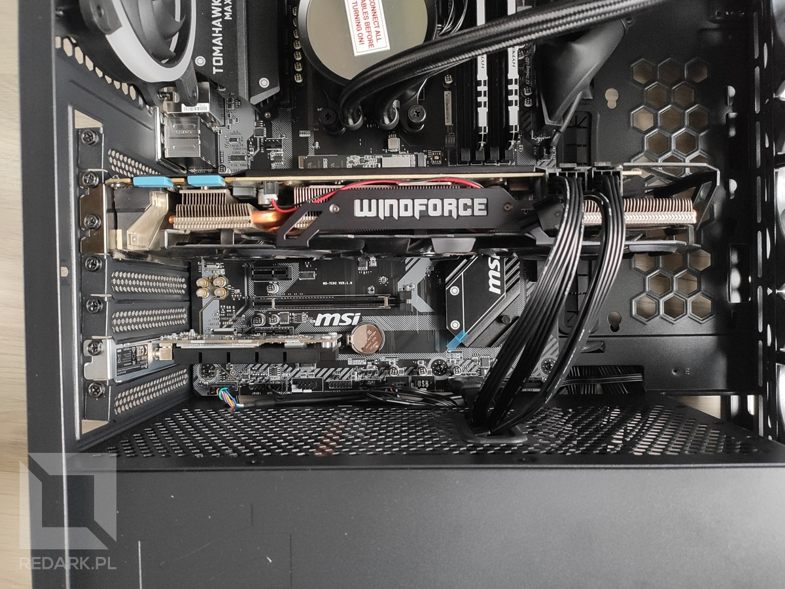
</Gallery>

## Czynności końcowe

Komputer jest już praktycznie złożony, dlatego zajmijmy się teraz założeniem na niego wszystkich zdemontowanych wcześniej elementów. Pierwszym z nich jest osłonka zaślepek kart rozszerzeń, którą zdjęliśmy na początku tej części poradnika. Następnie możemy przykręcić anteny nadawczo-odbiorcze do karty sieciowej. Dokręcamy je jak zwykłe śrubki, a następnie wyginamy do pozycji pionowej.

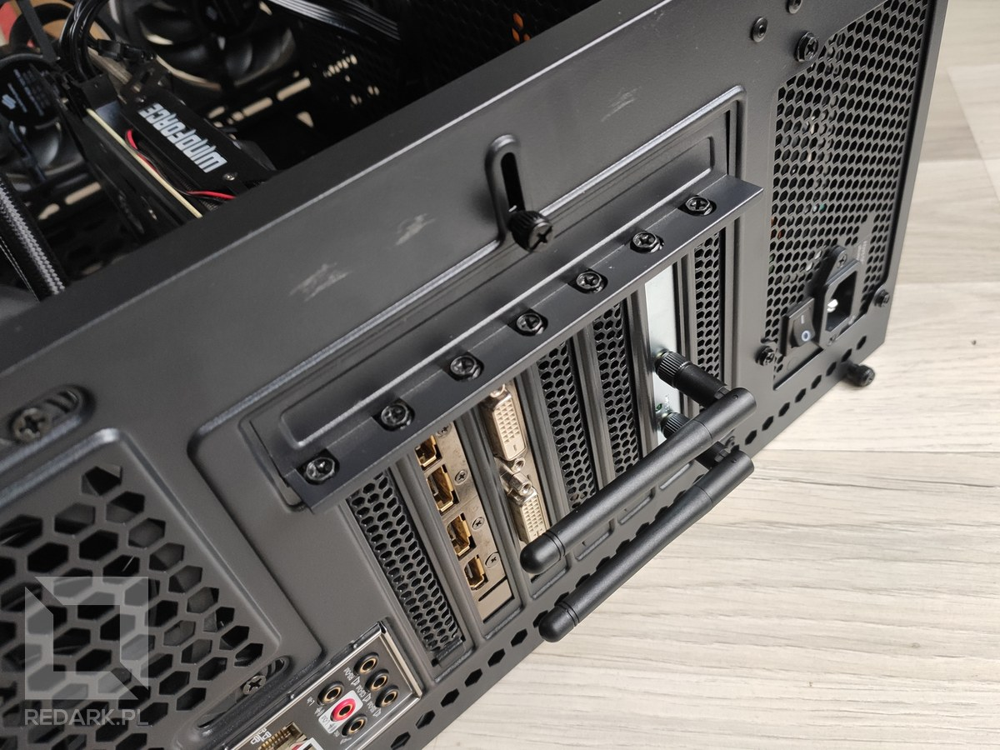

Teraz przenieśmy się do wnętrza komputera. Nareszcie można zdemontować folie ochronne z podzespołów. Znajdują się one na radiatorze chipsetu płyty głównej (jej dolny prawy narożnik przy logo MSI) oraz na blokopompce procesora. Zdjęcie folii z pompki dopiero odsłania prawdziwe piękno chłodzenia Nzxt Kraken. Mamy tutaj pierścieniowe adresowalne podświetlenie RGB połączone z lustrem, które stworzy efekt głębi. Od lat jest to znak rozpoznawczy tej serii chłodzeń, który zachwyca wszystkich, którzy go zobaczą. Oprócz zdjęcia folii musimy wykonać jeszcze jedną rzecz. Na środku lustra znajduje się logo Nzxt, które dzięki obrotowemu pierścieniu, może zostać obrócone do właściwej orientacji. Ponownie brawa dla inżynierów Nzxt za tak genialnie przemyślaną budowę blokopompki.

<Gallery width='2'>
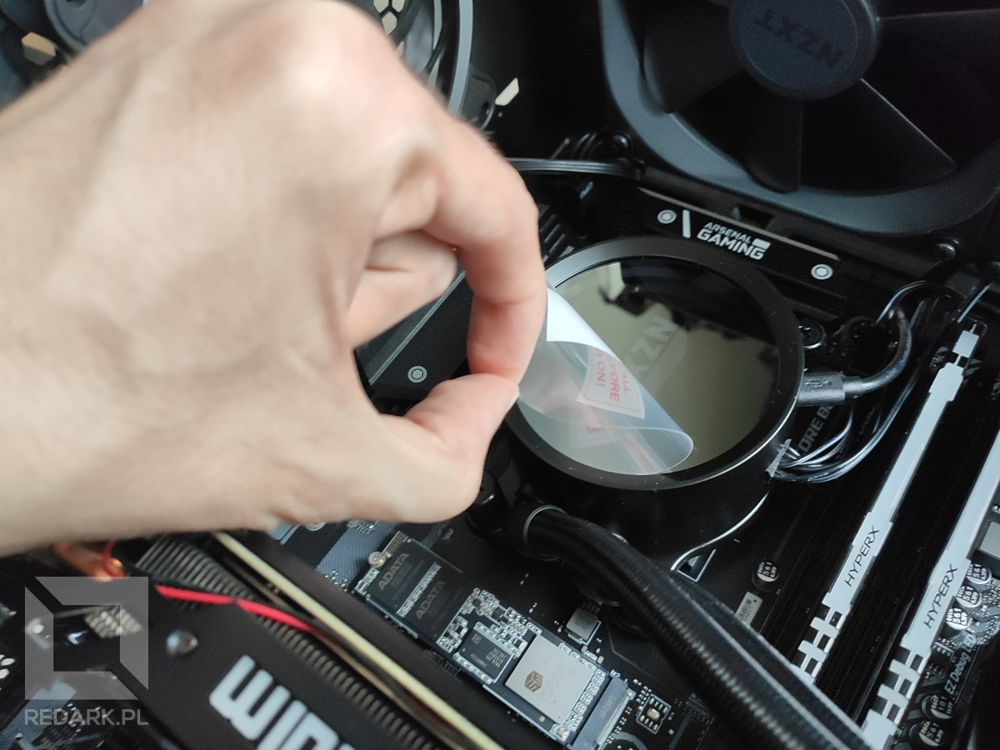
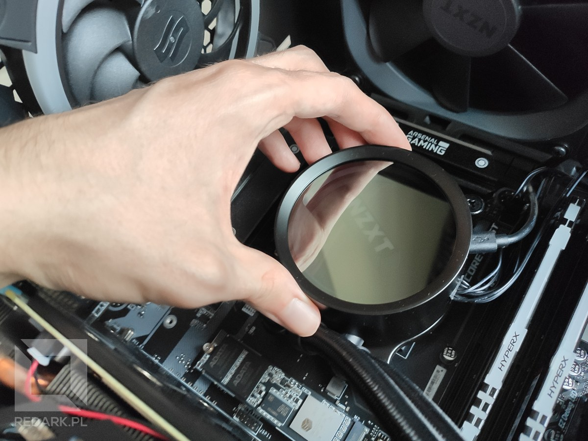
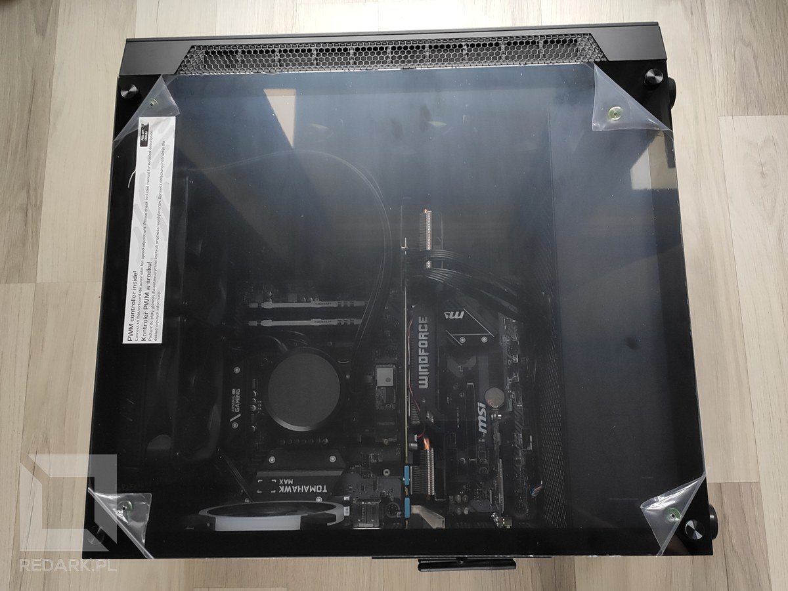
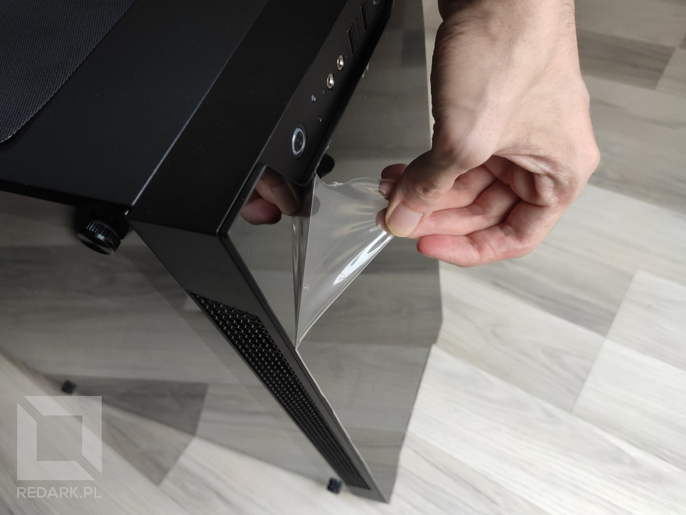
</Gallery>

Ostatnim zadaniem pozostało zamontowanie obu filtrów przeciwkurzowych, metalowego i szklanego panelu bocznego oraz frontu obudowy. Możemy już oczywiście zdjąć zabezpieczające szkło folie ochronne. Podczas wykonywania tej czynności ostrzegam przed silnymi ładunkami elektrostatycznymi, które wytworzą się w trakcie jej zrywania. Lepiej nie wyładować ich na którymś z podzespołów komputera.

## Podsumowanie

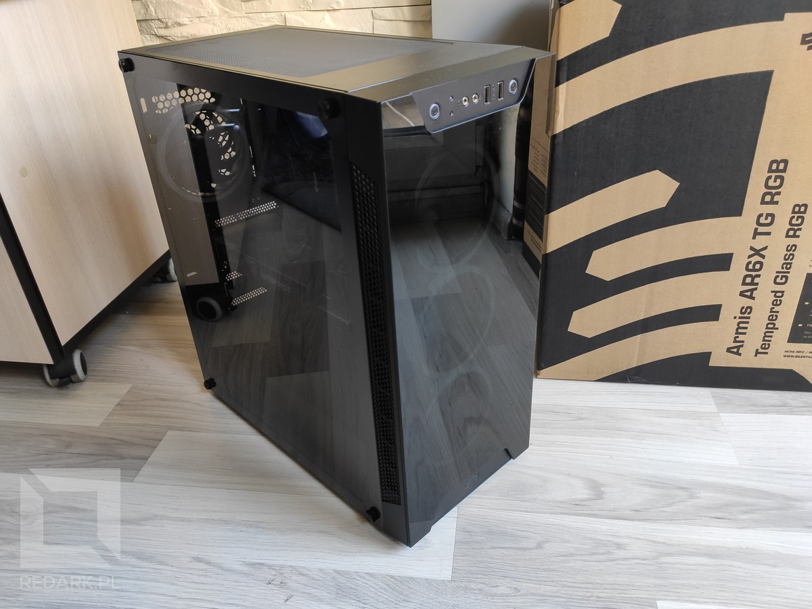

Tak oto prezentuje się gotowy komputer. Udało się nam przebrnąć przez cały proces montażu wszystkich jego części. W następnej części poradnika zajmiemy się już podłączeniem jednostki do prądu oraz przeprowadzeniem pierwszego uruchomienia. Zachęcam również do zapoznania się z [edycją 2014 tego poradnika](/skladanie-pc-przygotowujemy-obudowe-i-plyte-glowna), w której zajmowałem się montażem innej jednostki. Znacznie tańszej i mniejszej, ale dla odmiany opartej na procesorze od Intela.

<AssemblingPcFooter nextPost='/pierwsze-uruchomienie-komputera-diagnostyka-awarii'/>
