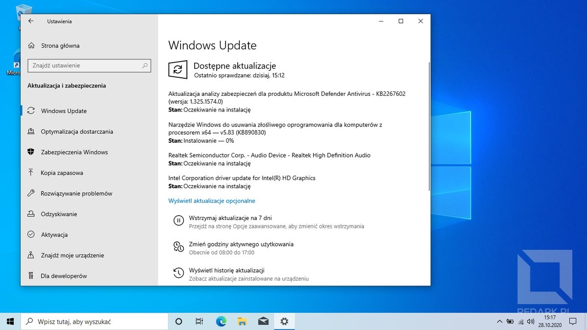
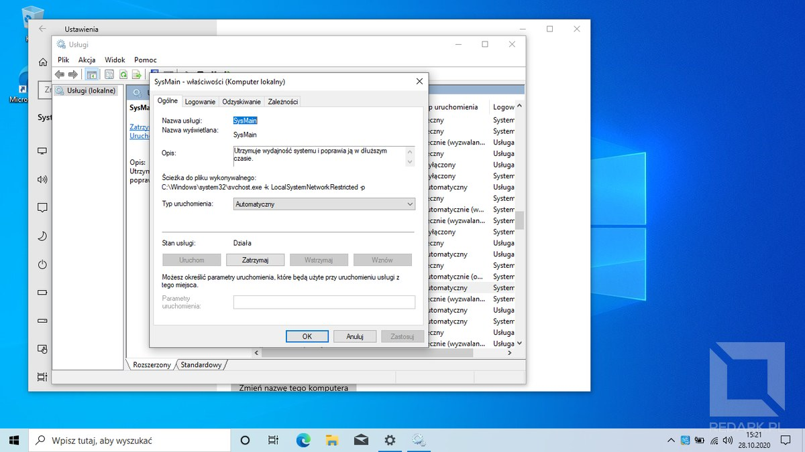
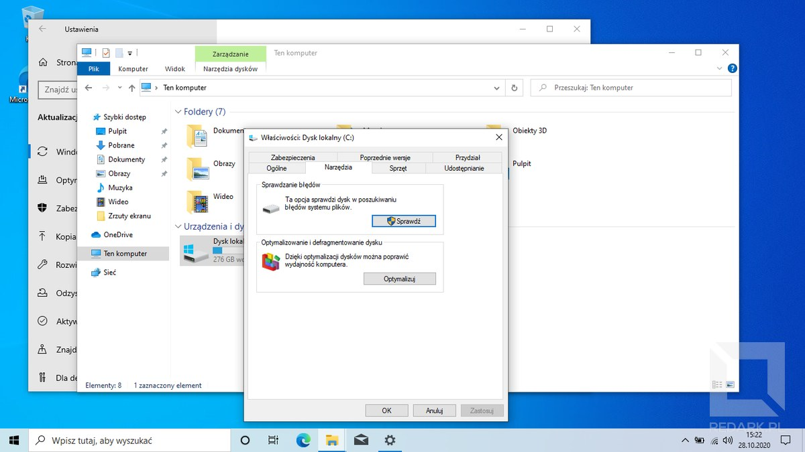
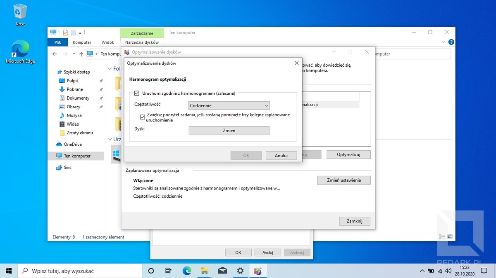
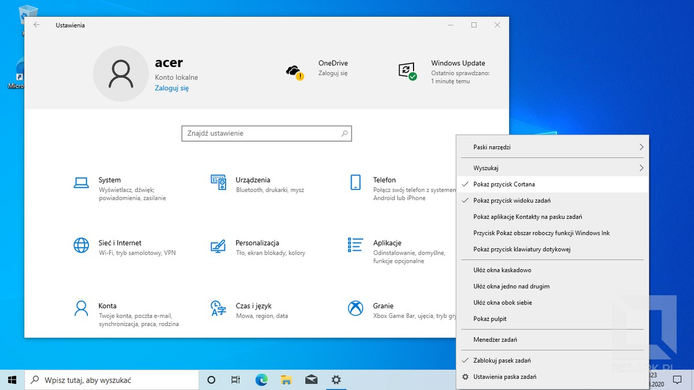
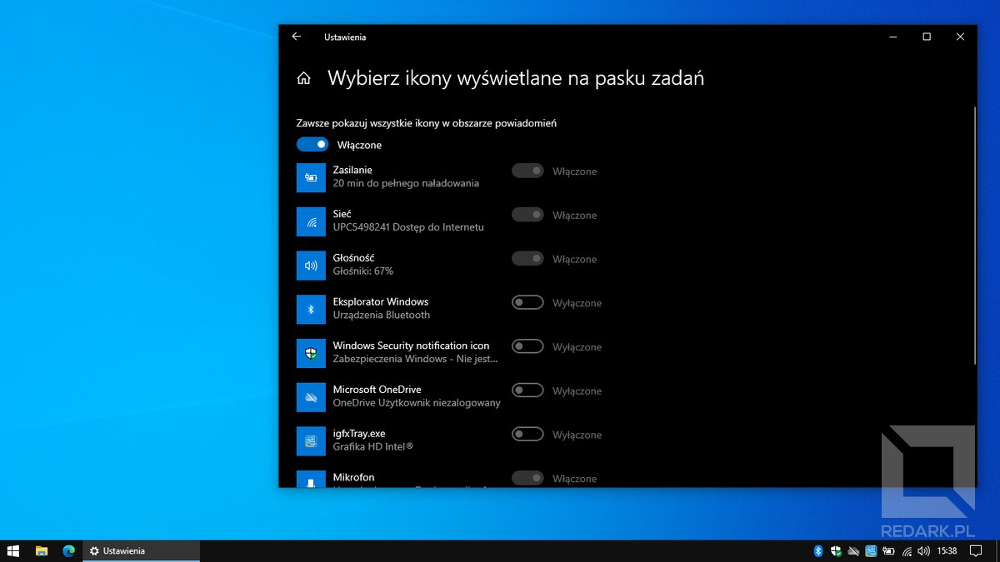
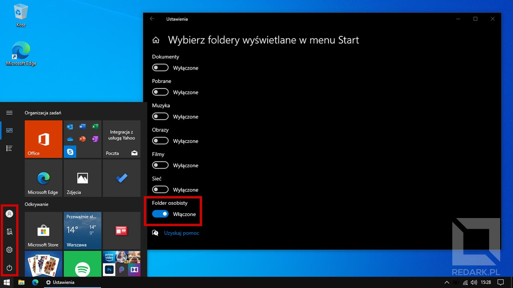
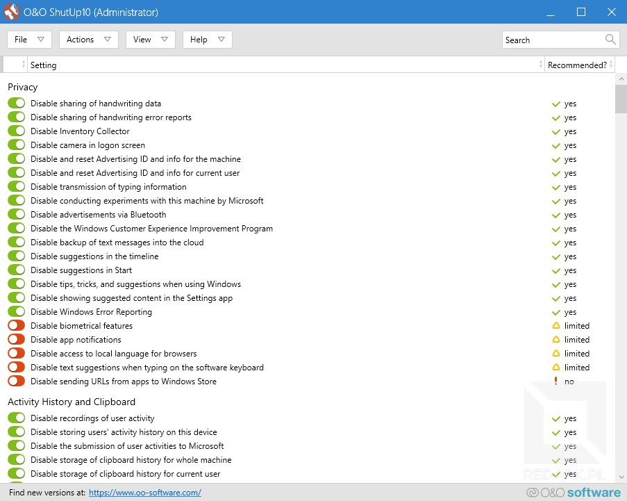

Według badań przeprowadzonych przez serwis instalki.pl we wrześniu 2020 roku aż 88% komputerów osobistych pracuje pod kontrolą systemów operacyjnych z rodziny Windows. Najnowszy produkt Microsoftu - Windows 10 - jest obecnie najpopularniejszym system dostępnym na rynku. Posiada on rozbudowane opcje personalizacji, lecz z moich obserwacji wynika, że duża część użytkowników kompletnie z nich nie korzysta lub nie wie, co warto jest zrobić ze świeżo zainstalowaną 10-tką. Z tego powodu stworzyłem zestawienie dziewięciu rzeczy, które robię po zainstalowaniu świeżej kopii systemu Windows 10. Wszystkie metody zawarte w tym artykule były testowane przeze mnie przez wiele lat, a ich zadaniem jest poprawa komfortu korzystania z komputera wraz ze wzrostem wydajności pracy na nim. Nie mówię, że musisz je robić u siebie od A do Z. To moja lista konfiguracyjna, a wybór interesujących opcji zależy od Ciebie.

Zanim jednak zaczniemy, zachęcam również do zapoznania się z poradnikiem poświęconym procesowi instalacji systemu Windows 10 oraz Linux:

<ActionButton to='/instalacja-systemow-windows-oraz-linux-krok-po-kroku'>Instalacja systemów operacyjnych</ActionButton>

## 1. Instalacja sterowników oraz aktualizacji

Pierwszą rzeczą, jaką musimy wykonać po postawieniu nowego systemu operacyjnego, jest instalacja podstawowych sterowników. Bez nich Twój komputer będzie ledwo chodzić, wyświetlać tylko podstawową rozdzielczość (np. 800x600), a wiele z jego elementów nie będzie właściwie działać. W przypadku systemu Windows 10 instalacja sterowników nie jest skomplikowana. Większość roboty wykona za nas usługa Windows Update. Aby ją aktywować, otwórz menu start, wybierz ikonę zębatki i przejdź do kategorii "Aktualizacje i zabezpieczenia". W otwartym oknie kliknij przycisk "Sprawdź aktualizacje". System Windows sam rozpozna podzespoły komputera i zainstaluje odpowiednie sterowniki, a także aktualizacje systemowe. W trakcie instalacji ekran Twojego komputera może zacząć mrugać, a elementy interfejsu będą zmieniać swój rozmiar - jest to normalny objaw instalacji sterowników graficznych.

<InfoBlock>Jeśli Twoja karta sieciowa (np. zewnętrzna karta Wi-Fi) nie chce współpracować z systemem operacyjnym bez instalacji dedykowanych sterowników, musisz dostarczyć je do komputera samodzielnie za pomocą nośnika CD/USB dołączonego do karty sieciowej lub pobrać najnowsze sterowniki ze strony producenta za pomocą innego komputera. Sytuację może uratować także modem GSM na USB lub chwilowe podłączenie jednostki za pomocą kabla Ethernet.</InfoBlock>

Muszę jednak ostrzec, że **Windows Update nie wyręcza nas całkowicie** i trzeba patrzeć mu na ręce, ponieważ nie zawsze zainstaluje on odpowiednie dla naszego komputera sterowniki. Przykładem niech będzie moja drukarka laserowa od Samsunga. Update zawsze instaluje dla niej złe, uniwersalne sterowniki, co powoduje, że kolory wydruków są bardzo mocno przekłamane. W takim wypadku należy skorygować działanie Update'a poprzez deinstalację wadliwego oprogramowania i pobranie odpowiednich, dedykowanych sterowników ze strony producenta.

## 2. Instalacja przeglądarki internetowej

Jakiej aplikacji najczęściej używamy obecnie na komputerach? Oczywiście przeglądarki internetowej. Mój wybór nie powinien chyba nikogo zdziwić. Od lat używam Google Chrome ze względu na jego popularność, synchronizację z kontem Google oraz mnogość opcji i narzędzi programistycznych. Dawniej wybór ten był oczywisty. Jedyną drobną konkurencją był Firefox oraz Opera. Microsoft przez naście lat bezsensownie próbował forsować swojego Internet Explorera, który stał się już memem w świecie IT. Później zamieniono go na Microsoft Edge - było już lepiej, ale nadal był to ten sam silnik renderujący, co w IE, co powodowało, że projektowanie stron na tę przeglądarkę, wciąż było cofaniem się w czasie o minimum 10 lat. Obecnie MS chyba w końcu poddał się w tej bezsensownej walce i przepisał Edge'a na silnik Chromium - ten sam, który zasila Chrome oraz Operę. Dzięki temu teraz jest to zupełnie inna przeglądarka. Zyskała dużo opcji, strony lepiej się renderują, a komfort użytkowania poszybował w górę. Widać tam jeszcze odrobinę naleciałości Microsoftu, ale to jest niebo a ziemia w porównaniu z tym, co było kiedyś. Kończąc wywód: ja nadal pobieram i instaluję Google Chrome, ale jeśli chcesz, polecam dać szansę nowej przeglądarce Microsoftu.

<AdSense/>

## 3. Wyłączenie zbędnych usług

Usługi w systemie Windows to mini programy działające w tle naszego komputera. Każdy ma przypisaną jakąś rolę i odpowiada za działanie którejś konkretnej funkcji Windowsa. Niestety część z nich bardzo często się psuje i jedynie szkodzi działaniu naszego komputera. Aby temu zaradzić, przejdź do okna zarządzania usługami i wyłącz je według poniższej instrukcji:

1. Wciśnij kombinację klawiszy "Windows + R",
2. Wpisz w okno frazę "services.msc",
3. Zatwierdź okno i poczekaj na załadowanie okna z listą usług,
4. Wybierz interesującą Cię usługę z listy klikając na nią dwukrotnie,
5. Zmień jej typ uruchamiania na "Wyłączony",
6. Zatrzymaj działanie usługi przy pomocy przycisku "Zatrzymaj".

### Usługa Superfetch

Zadaniem usługi Superfetch jest wykonywanie tzw. "wstępnego ładowania do pamięci", co teoretycznie powinno zwiększyć szybkość działania komputera poprzez ładowanie najczęściej używanych danych z pamięci masowej do modułów pamięci RAM. Niestety to tylko w teorii. W praktyce usługa Superfetch powoduje jedynie problemy, które najczęściej objawiają się 100% zużyciem przepustowości dysku w menadżerze urządzeń, a co za tym idzie, bardzo mocnym spowolnieniem komputera. Dodatkowo coraz popularniejsze dzisiaj dyski SSD kompletnie nie potrzebują już tego mechanizmu. Ich zawrotna szybkość odczytu nie ogranicza już systemu.

Aby wyłączyć funkcję Superfetch, **znajdź w oknie usługę o nazwie "SysMain"**, a następnie wyłącz ją według instrukcji podanej wcześniej. Od teraz funkcja Superfetch nie będzie już niepotrzebnie katować Twojej pamięci masowej.

### Usługa indeksowania plików

Kolejna funkcja Windowsa, która zamiast poprawiać wydajność, obniża ją i niepotrzebnie obciąża podzespoły komputera. Jej zadaniem jest przyspieszanie działania wyszukiwarki systemowej poprzez analizę tworzonych przez nas plików. Ponownie dyski SSD radzą sobie dobrze i bez niej, dlatego warto ją wyłączyć dla świętego spokoju. Za działanie omawianej funkcji odpowiedzialna jest **usługa o nazwie "Windows Search"**. Wyłącz ją tak samo, jak poprzedniczkę.

<InfoBlock>Powinieneś utrzymywać w plikach taki porządek, abyś nigdy nie był zmuszony do używania wyszukiwarki systemowej. Ja ze swojej korzystam chyba maksymalnie 1-2 razy w roku.</InfoBlock>

### Analiza i defragmentacja dysków

Ostatnią rzecz do wyłączenia będzie funkcja analizy i automatycznej defragmentacji dysków. Proces ten był wymagany, aby przeciwdziałać negatywnemu zjawisku fragmentacji danych na dyskach HDD. W przypadku SSD proces ten jest już nie potrzebny, a system Windows po wykryciu takiego typu nośnika automatycznie wyłącza dla niego defragmentację. Nie jestem zwolennikiem tej usługi, dlatego najczęściej całkowicie ją wyłączam, aby nawet nie analizowała ona zawartości mojego dysku. Aby dezaktywować tę funkcję, przejdź do menadżera plików i widoku "Ten komputer". Następnie kliknij PPM na partycję (np. z literą C), wybierz "Właściwości", karta "Narzędzia", a następnie przycisk "Optymalizuj". W otwartym oknie skorzystaj z przycisku "Zmień ustawienia" i wyłącz harmonogram optymalizacji. Cały proces jest widoczny poniżej:

<Gallery>

</Gallery>

## 4. Oprogramowanie antywirusowe

System Windows nie grzeszy dobrymi zabezpieczeniami przed atakami hackerskimi. Stąd też praktycznie obowiązkowe jest zainstalowanie na nim oprogramowania antywirusowego. Windows 10 posiada wbudowany program Windows Defender, ale jego działanie jest bardzo podstawowe i ja osobiście bym na nim nie polegał. Jest on napisany tak samo dobrze, jak cały Windows - czyli beznadziejnie.

W tym miejscu muszę jeszcze wspomnieć o dziwnym podejściu dużej grupy użytkowników Windowsa. Uważają oni, że: "wystarczy nie wchodzić na podejrzane strony, używać mózgu i nie da się zawirusować komputera". Niestety to nieprawda, a takie osoby pewnie chcą jedynie uzasadnić swoją niechęć do kupowania licencji na oprogramowanie antywirusowe. Windows nie jest bezpiecznym systemem, a wirusy mogą na niego czyhać na każdej stronie internetowej. Wystarczy, że administrator Twojej ulubionej strony słabo zabezpieczy swoją witrynę (proste hasło lub niezabezpieczony przed wstrzykiwaniem kodu atakiem XSS formularz) i pozwoli na zainfekowanie na przykład tzw. "favikonki". Zostaje ona pobierana automatycznie, co oznacza, że Twój komputer zostaje zainfekowany od razu po wejściu na taką stronę. I co? Wystarczy używać mózgu nie? A może fajnie jest paść atakiem ransomware i zobaczyć żądanie okupu za swój komputer?

Na koniec jedna uwaga: oprogramowanie antywirusowe wcale nie musi być płatne. Ze swojej strony polecam rewelacyjnego Kaspersky'ego Free i **zalecam omijanie szerokim łukiem antywirusów Avast oraz AVG**. Te dwa produkty nie mają nic wspólnego z bezpieczeństwem, a jedynie instalują niechciany adware na komputerach użytkowników skuszonych pozornie darmowym produktem. Dodatkowo ich czeskiemu właścicielowi udowodniono już wielokrotnie sprzedaż informacji osobistych swoich klientów. Nic dziwnego, bo jak niby mieliby utrzymać firmę oddając produkt za darmo? Natomiast z płatnych aplikacji **mogę szczerze polecić Kaspersky'ego oraz Eset'a**. Są to dwa zaufane antywirusy, których notabene używam od wielu lat na swoich urządzeniach.

## 5. Personalizacja paska zadań

Pasek zadań w systemie Windows znajduje się domyślnie przy dolnej krawędzi ekranu i pełni bardzo ważną rolę - pozwala przełączać się użytkownikowi pomiędzy uruchomionymi programami, a także monitorować ich stan. Widzimy go cały czas i korzystamy z niego tysiące razy dziennie. Z tego powodu ważne jest, aby dobrze do spersonalizować, ponieważ Microsoft w Windowsie 10 bardzo mocno zepsuł jego funkcjonalność.

### Usunięcie zbędnych elementów

Nie wiem dlaczego, ale twórcy postanowili wyposażyć swój najnowszy system w pole wyszukiwarki zajmujące nawet 1/4 szerokości ekranu. Na początku miało to jeszcze sens, ponieważ Microsoft planował mocną promocję swojej inteligentnej wirtualnej asystentki Cortany, która była zintegrowana z tym polem wyszukiwania. Problem polega na tym, że nie wyróżniała się ona niczym szczególnym, nigdy nie podbiła ona globalnego rynku, a Polska nigdy nie doczekała się jej wsparcia. Obecnie projekt jest już wycofywany z użycia na całym świecie i został dodatkowo zdegradowany do osobnej ikonki (aplikacji) obok wyszukiwarki. Zobaczcie zresztą sami:

<ImageDescription>Kompletnie nieprzemyślany i niepraktyczny domyślny pasek systemu Windows 10</ImageDescription>

Idąc od lewej mamy tutaj przycisk menu Start, bezużyteczną wyszukiwarkę zajmującą 1/4 ekranu, niedziałający przycisk Cortany oraz jeszcze jeden przycisk, który jest odpowiedzialny za funkcjonalność tzw. wirtualnych pulpitów, ale nawet on jest niepotrzebny, ponieważ powinno się go obsługiwać za pomocą skrótów klawiszowych, a nie myszy. **Wszystkie te trzy elementy są kompletnie bezwartościowe** i powinny być obowiązkowo usunięte. Potrzebne opcje znajdziesz klikając PPM na pustą przestrzeń paska. Odznacz opcję "Pokaż przycisk Cortana" oraz "Pokaż przycisk widoku zadań", a w podmenu "Wyszukaj" wybierz "Ukryty". Uffff, od razu przestronniej.

<InfoBlock>Aby móc wyszukiwać potrzebne aplikacje w systemie nie potrzebujesz wyszukiwarki na pasku. Możesz ją wywołać przy pomocy skrótu "Windows + Q", a także otwierając menu Start przy pomocy myszy lub klawisza "Windows". To, że w menu Start nie widać żadnej wyszukiwarki, to nie znaczy, że jej tam nie ma. Gdy menu Start jest otwarte, zacznij po prostu pisać nazwę potrzebnej aplikacji, a wyszukiwarka POJAWI SIĘ AUTOMATYCZNIE. Mało osób wie o takim udogodnieniu i zostawia na pasku zadań to kompletnie bezużyteczne pole wyszukiwania. Ma ono chyba jedynie zastosowanie w przypadku tabletów z ekranem dotykowym.</InfoBlock>

<AdSense/>

### Zmiana typu paska

Następne opcje znajdują się w ustawieniach systemowych. Kliknij ponownie PPM w puste miejsce na pasku zadań i wybierz pozycje "Ustawienia paska zadań". Interesujące są tutaj dwie opcje. Po pierwsze włącz opcję "Użyj małych przycisków paska zadań", a po drugie wybierz z listy rozwijanej "Połącz przyciski paska zadań" opcję "Nigdy". Zobacz jak bardzo zmienił się teraz pasek Twojego systemu. Może przypominać Ci on paski ze starszych wersji Windowsa i bardzo słusznie! Korzystanie z takiej konfiguracji niesie ze sobą cztery zasadnicze korzyści:

1. Pasek jest o połowę niższy, co zwiększa obszar roboczy ekranu. W przypadku laptopów z małymi ekranami przestrzeń ta jest na wagę złota!
2. Przyciski aplikacji są niższe, ale jednocześnie szersze, przez co znacznie łatwiej jest w nie kliknąć.
3. Wiele okien tej samej aplikacji nie jest scalane w jedność, co przyspiesza nawigację przy pomocy myszy, gdy mamy otwarte np. 5 eksploratorów plików.
4. Tytuły aplikacji są widoczne, co pozwala zauważyć chociażby zmieniający się tytuł karty w przeglądarce informujący o ważnych powiadomieniach np. "Odebrane (4) - Gmail".

<ImageDescription>Od razu lepiej...</ImageDescription>

<InfoBlock>Jeśli posiadasz na swoim stanowisku wiele monitorów, to w tym miejscu możesz zmienić również wygląd i zachowanie pasków na reszcie ekranów. W systemie Windows pasek na dodatkowych monitorach może być inny niż na ekranie głównym.</InfoBlock>

### Szybki dostęp do potrzebnych opcji i programów

Ikony znajdujące się na pasku zadań można oczywiście personalizować. Klikając na ikonę PPM możesz ją usunąć przy pomocy opcji "Odepnij od paska zadań", natomiast przytrzymanie i przeciągnięcie ikony pozwoli Ci zmienić kolejność przypiętych skrótów. Ciekawą opcją znajdującą się w omawianych wcześniej "Ustawieniach paska zadań" jest pozycja "Wybierz ikony wyświetlane na pasku zadań". Pozwala ona decydować, które ikony uruchomionych w tle aplikacji są widoczne (prawa strona paska obok zegara), a które mają być ukryte w wysuwanym od dołu panelu. Ja jestem zwolennikiem, aby włączyć tam widoczność wszystkich ikon. Nie zajmują one wiele miejsca, a brak ich ukrywania niweluje ryzyko, że nie zauważymy jakiegoś ważnego powiadomienia pochodzącego np. z Discorda.

<InfoBlock>Po pierwszych dziesięciu aplikacjach na pasku zadań można się szybko przełączać przy pomocy skrótu klawiszowego "Windows + cyfra". Dla przykładu: jeśli ustawisz eksplorator plików na pierwszym miejscu, to wywołasz go naciskając "Windows + 1", a jeśli na drugim miejscu jest Google Chrome, to skrótem do niego będzie "Windows + 2". Używam tych skrótów na okrągło i bardzo przyspieszają one nawigację między oknami.</InfoBlock>

Ostatnim elementem do spersonalizowania na pasku zadań są kafelki szybkich akcji znajdujące się na panelu powiadomień. Możesz go otworzyć przy pomocy ikony dymka znajdującego się w dolnym prawym rogu ekranu obok zegara. Aby przejść do ich personalizacji kliknij na którykolwiek kafelek PPM, a następnie wybierz "Edytuj szybkie akcje". W tym trybie możesz zmieniać kolejność, usuwać, a także dodawać nowe skróty. Możesz tutaj włączać chociażby filtr niebieskiego światła (wyświetlanie nocne), który ochroni Twoje oczy przed nadmiernym zmęczeniem oraz pomoże utrzymać zdrowy cykl dobowy.

## 6. Personalizacja systemu

Windows 10 posiada szerokie spektrum opcji personalizacji, które jest zaniedbywane przez wielu użytkowników. Nie mówię tutaj tylko o zmianie tapety, a dostosowaniu chociażby kolorystyki okien, aby zmniejszyć zmęczenie naszych oczu.

### Ustawienia personalizacji

Przejdź do ustawień systemowych (ikona zębatki w menu start), a następnie do kategorii "Personalizacja". Pierwsza zakładka, o nazwie "Tło" pozwoli Ci dostosować tapetę. Druga, o nazwie "Kolory" umożliwia zmianę koloru wiodącego w systemie oraz ogólnej kolorystyki interfejsu (jasny lub ciemny). Ja polecam korzystać z trybu ciemnego z dodatkowo wyłączonym efektem przeźroczystości. Zwiększy to przejrzystość interfejsu, a ciemny motyw pozwoli odpocząć naszym oczom. Karta "Kompozycje" umożliwia modyfikowanie dźwięków systemowych oraz pokazywanie lub ukrywanie ikon systemowych na pulpicie (opcja "Ustawienia ikon pulpitu"). To tam możemy ukryć kosz systemowy lub przywrócić skrót do widoku "Ten komputer". Kartę "Pasek zadań" już poznaliśmy, a kartą "Start" zajmiemy się w dalszej części tego artykułu.

### Opcje menadżera plików

Wbudowany w system menadżer plików również skrywa kilka istotnych opcji, które bardzo poprawiają komfort korzystania z systemu. Aby przejść do jego ustawień, otwórz dowolny katalog, a następnie odszukaj u góry na karcie "Widok" przycisku "Opcje". Listę interesujących (moim zdaniem) ustawień prezentuję poniżej:

- **"Otwórz Eksploratora plików w..."** - opcja pozwala zmienić domyślny ekran eksploratora po jego uruchomieniu. Domyślny "szybki dostęp" wyświetla listę ostatnio otwieranych plików, ale dla mnie znacznie wygodniejszym widokiem jest "ten komputer", który przywraca zachowanie eksploratora z dawnych wersji Windowsa.
- **Sekcja "Prywatność"** - zawiera dwie opcje, które polecam odznaczyć. Pozwoli to zachować porządek w lewej kolumnie eksploratora plików, który domyślnie wyświetlałby tam śmietnik ostatnich plików zamiast personalizowanych skrótów do katalogów.
- **Opcja "Ukryj rozszerzenia znanych typów plików"** - domyślnie system Windows wyświetla tylko rozszerzenia plików, do których nie mamy przypisanych aplikacji. Przed zainstalowaniem pakietu Office będziemy posiadać "Sprawozdanie.docx", ale po zainstalowaniu pakietu i skojarzeniu z nim plików wyświetlać się będzie już tylko "Sprawozdanie". Dla mnie, jako programisty, takie rozwiązanie często utrudnia pracę, ponieważ muszę ręcznie dopisywać takie rozszerzenia, gdy coś linkuję. Odznaczenie tej opcji spowoduje, że Windows będzie wyświetlać rozszerzenia dla wszystkich plików i dzięki temu plik tekstowy zawsze będzie miał końcówkę txt, obrazek jpg, png, gif i tak dalej i tak dalej.
- **Opcja "Pokaż ukryte pliki, foldery i dyski"** - ponownie opcja, która ułatwia pracę programisty. Domyślnie system Windows nie pokazuje elementów z atrybutem "ukryty" takich jak np. pliki konfiguracyjne. My - programiści - wolimy je mieć na widoku.

Oprócz tego polecam skonfigurować sobie skróty znajdujące się w lewej kolumnie eksploratora. Ogromnie przyspiesza to nawigowanie po systemie i pozwala odciążyć rękę ze zbędnego klikania. Aby dodać jakiś katalog do tej listy wystarczy, że go tam przeciągniesz przy pomocy LPM.

<Gallery>

</Gallery>

## 7. Personalizacja menu Start

Menu Start - najbardziej rozpoznawalny element systemów z rodziny Windows. Choć każdy użytkownika z pewnością zagląda do niego kilkadziesiąt razy dziennie, to tutaj również zauważyłem, że bardzo duża liczba osób kompletnie olewa jego personalizacje. Zostawiają oni stan surowy - wszystko domyślnie ustawione, a reklamy Microsoftu (z preinstalowaną grą Candy Crush Saga na czele) mrugają jak szalone. Nie dość, że nie ułatwia to pracy, to jeszcze rozprasza. Pokażę Ci teraz mój sprawdzony sposób personalizacji menu Start.

### Ustawienia

Zacznijmy od opcji znajdujących się w ustawieniach systemowych. Przejdź do kategorii "Personalizacja", a następnie przełącz się na kartę "Start". Ja zmieniam następujące ustawienia:

- **"Pokaż listę aplikacji w menu Start"** - wyłączenie tej opcji spowoduje, że w menu Start widoczna będzie tylko i wyłącznie sekcja kafelków. Pionowa lista wszystkich aplikacji zostanie ukryta po lewej stronie menu jako osobna karta. Sprawia to, że menu jest czytelniejsze i zajmuje mniej miejsca na ekranie.
- **"Pokaż ostatnio dodane/najczęściej używane aplikacje"** - dwie domyślne opcję, które wyświetlają u góry listy aplikacji często używane lub ostatnio dodane aplikacje. Ja wolę statyczny, alfabetyczny układ tej listy.
- **"Pokazuj okazjonalne sugestie w menu Start"** - sugestie, czyli mówiąc wprost reklamy, którymi atakuje nas Microsoft. Definitywnie wyłączamy.

Ostatnia opcja warta zmiany znajduje się na końcu ekranu ustawień. "Wybierz foldery wyświetlane w menu Start" pozwala spersonalizować pionową listę małych ikonek znajdujących się nad przyciskiem zasilania. Ja zawsze zostawiam tam tylko "folder osobisty", do którego notabene jest bardzo ciężko się dostać w Windowsie 10. Twórcy porobili jedynie skrótów do wirtualnych bibliotek dokumentów, obrazów, muzyki itd., ale zapomnieli o normalnym skrócie do głównego katalogu użytkownika. Umiejscowienie go tam, jest bardzo przydatne.

### Porządek w kafelkach

Sekcja kafelków (prostokątnych przycisków) może zostać całkowicie spersonalizowana pod użytkownika. Windows 10 umożliwia dodawanie własnych skrótów, zmianę rozmiaru kafelków, włączanie dynamicznych animacji (np. z aktualną pogodą), a także grupowanie skrótów w katalogi. Pracę na menu Start rozpocznij od całkowitego wyczyszczenia wszystkich znajdujących się w nim kafelków. Kliknij na każdy PPM, a następnie wybierz opcję "Odepnij od obszaru startowego". W przypadku napotkania niechcianych, preinstalowanych przez Microsoft aplikacji (bloatware) możesz od razu wybrać opcję "Odinstaluj", aby ulżyć co nieco swojemu komputerowi.

Gdy menu będzie już puste, wykorzystaj znajdującą się obok listę wszystkich aplikacji i znajdź na niej aplikacje, z których korzystasz najczęściej. Dodawanie kafelków wygląda identycznie, co ich usuwanie. Klikasz PPM na aplikację, a następnie wybierasz "Przypnij do obszaru startowego". Polecam dodać sobie jeszcze w tym miejscu skrót do "Ten komputer". Usytuowanie go po prawej w środkowej części menu pozwoli przywrócić namiastkę układu menu Start ze starszych Windowsów. Ja w tym miejscu umieszczam również skrót do kosza systemowego, a oryginalny skrót na pulpicie usuwam, aby nie szpecił tapety.

<ImageDescription>Czyż nie lepiej to teraz wygląda?</ImageDescription>

## 8. Zmiana ustawień zasilania

Po zainstalowaniu systemu Windows warto przejrzeć też ustawienia zasilania. W tym celu otwórz panel sterowania, a następnie przejdź pod ścieżkę "Sprzęt i dźwięk" oraz "Opcje zasilania". Przycisk "Zmień ustawienia planu" pozowali Ci zmienić czas bezczynności po jakim Twój komputer wyłączy ekran oraz przejdzie w stan uśpienia. Opcja "Wybierz działanie przycisków zasilania" po lewej umożliwi zmianę zachowania komputera po wciśnięciu przycisku zasilania lub zamknięciu pokrywy laptopa, a także przywrócenie funkcji hibernacji, która (nie wiedzieć czemu) została usunięta z systemu Windows 10. Jeśli nie wiesz, czym różni się uśpienie od hibernacji, serdecznie zapraszam do dedykowanego temu tematowi artykułowi na Redarku.

<ActionButton to='/uspienie-hibernacja-wylaczenie-rozne-stany-pracy-komputera'>Uśpienie, hibernacja i wyłączenie</ActionButton>

Drugą sprawą w ustawieniach zasilania systemu Windows jest domyślna lista urządzeń, która jest w stanie wybudzić komputer z uśpienia. Jest ona zdecydowanie zbyt mało restrykcyjna, co bardzo często powoduje samoczynne wybudzanie się jednostki np. przez mikroskopijne drgnięcie myszki. Cały temat odmawiania uprawnień do wybudzania komputera omówiłem dogłębnie w osobnym artykule na Redarku, który linkuję poniżej:

<ActionButton to='/problem-z-samoczynnym-wybudzaniem-sie-komputera'>Samoczynne wybudzanie się komputera</ActionButton>

<AdSense/>

## 9. Kastracja ze szpiegowskiego oprogramowania

Jedni lubią Windows 10, a inni go nienawidzą. Można powiedzieć, że zaliczam się do obu tych grup. Z jednej strony uwielbiam ten system za swój przemyślany interfejs i szybkość działania (ale tylko na dysku SSD), a z drugiej strony szczerzę nienawidzę, ponieważ jest to najbardziej szpiegowski system w karierze Microsoftu. Jeśli znasz wygląd [instalatora systemu Windows 10](/instalacja-systemow-windows-oraz-linux-krok-po-kroku), to wiesz, że na dzień dobry jesteśmy tam proszeni o zezwolenie na przesyłanie dosłownie wszystkiego - od analizy naszych aplikacji po "ulepszanie" działania rozpoznawania głosu, pisma oraz obrazu. Odmówienie działania tych wszystkich funkcji nie wyłącza ich jednak całkowicie. Cały czas w tle naszego komputera działa chociażby ukochana "usługa zbierania danych telemetrycznych". Jej zadaniem jest stałe analizowanie wykonywanych przez nas operacji oraz przesyłanie wyników obserwacji na serwery Microsoftu w celu (jak to się ładnie mówi) ulepszania i przyspieszania działania systemu Windows.

Na szczęście jest na to rada i nie wymaga ona od użytkownika grzebania w czeluściach plików konfiguracyjnych systemu operacyjnego. Mówię tutaj o aplikacji ["O&O ShutUp10"](https://www.oo-software.com/en/shutup10), która jest genialnym narzędziem pozwalającym wyłączyć wszelki szpiegowski syf znajdujący się w Windowsie 10. Program umożliwia ręczne przejrzenie wszystkich dostępnych opcji wraz z opisem ich działania lub automatyczne wyłączenie opcji ze względu na poziom rekomendacji twórców narzędzia. Program warto jest uruchamiać od czasu do czasu, ponieważ po niektórych aktualizacjach systemu Windows, pewne jego funkcje mogą się ponownie aktywować.

<ImageDescription>No to wyłączamy, co się da...</ImageDescription>

Na koniec tego artykułu polecam zajrzeć jeszcze do menadżera zadań (skrót klawiszowy Ctrl + Shift + Esc) i jego zakładki "Uruchamianie". Znajduje się tam lista autostartu, czyli lista aplikacji uruchamianych wraz z systemem operacyjnym. Jeśli Twój komputer uruchamia się bardzo wolno, możesz odciążyć go tutaj z części zadań. Znajdziesz tutaj autostart bezużytecznej Cortany, funkcji "Twój telefon", aktualizatory różnych aplikacji (Java, Adobe Reader itd.) oraz pozycję o nazwie "Windows Security notification icon". Jest to proces odpowiedzialny za wyświetlanie ikonki tarczy programu Windows Defender na pasku zadań. Jeśli korzystasz z własnego oprogramowania antywirusowego, wyłącz tę opcję (kliknij na nią PPM), a ikona zniknie po ponownym uruchomieniu komputera. W tym miejscu możesz też wyłączyć dołączonego do systemu klienta dysku chmurowego OneDrive, choć tutaj akurat chciałbym zachęcić Cię do korzystania z niego. Jeśli chcesz poznać zalety korzystania z dysku w chmurze, skorzystaj z artykułu udostępnionego poniżej:

<ActionButton to='/zalety-korzystania-z-dysku-w-chmurze'>Zalety dysków w chmurze</ActionButton>
