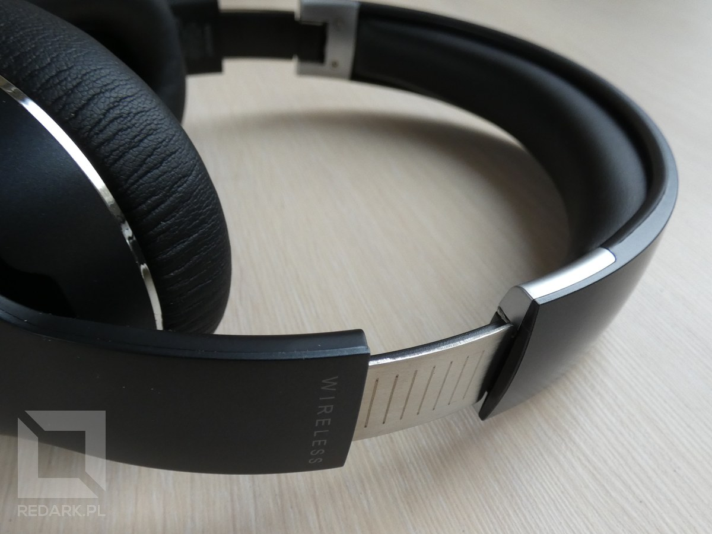

Czy w cenie około 200 złotych jesteśmy w stanie znaleźć słuchawki bezprzewodowe, których dźwięk i jakość wykonania nie przyprawi nas o ból głowy? Postanowiłem odpowiedzieć na to pytanie i nabyłem jedne z najpopularniejszych słuchawek w tym przedziale cenowym, czyli model Edifier W820BT. Sprawdźmy, czy faktycznie są one warte naszej uwagi.

## Budowa słuchawek

<Gallery>

</Gallery>

Edifier W820BT to słuchawki o konstrukcji zamkniętej wokółusznej. Wykonane są z dobrej jakości plastiku, ale posiadają też elementy metalowe, takie jak pałąk łączący obie muszle. Urządzenie prezentuje się naprawdę elegancko i solidnie, co w tej półce cenowej nie jest standardem. Całość konstrukcji nie wydaje żadnych pisków ani trzasków, nawet podczas zakładania. Przetworniki posiadają średnicę 40 milimetrów, a poduszki są wykonane z ekoskóry. Rozmiar muszli nie należy do dużych. To nadal słuchawki przenośne, więc osoby z dużymi małżowinami usznymi z pewnością nie będą się czuć w nich komfortowo. W szczelinie wokół logo Edifiera znajduje się gumowa membrana łącząca muszle słuchawek z pałąkiem, stąd słuchawki posiadają więc drobną, wręcz symboliczną regulację kąta nachylenia we wszystkie strony. Na materiale zakrywającym przetworniki słuchawek znajdują się wyszyte duże litery L i R pomagające prawidłowo założyć słuchawki na głowę. Dlaczego inni producenci nie stosują tak wyraźnych oznaczeń?!

<AdSense/>

W820BT można również złożyć do bardziej kompaktowej formy. Obie muszle posiadają na pałąku prosty zawias, który umożliwia złożenie ich do środka konstrukcji. Gdy są rozłożone mierzą 18 na 19 centymetrów, a po złożeniu 17 na 14 centymetrów. Nie jestem fanem tego rozwiązania, ponieważ mechanizm ten nie ma żadnej zapadki, która utrzymywałaby słuchawki w pozycji złożonej. Jeśli tylko lekko je podniesiemy, muszle za sprawą swojego ciężaru automatycznie wrócą do swojej normalnej pozycji. Niemniej jednak fajnie, że taka opcja się w nich znajduje, bo pozwala to zaoszczędzić trochę miejsca w plecaku bądź torbie.

## Obsługa urządzenia

Edifier W820BT potrafi pracować w dwóch trybach: przewodowym i bezprzewodowym. Na lewej muszki znajdziemy tylko i wyłącznie gniazdo do podłączenia dołączonego do zestawu kabla jack 3,5mm. Jest on dobrze wykonany, posiada długość 130 centymetrów oraz wtyk kątowy z jednej strony. Podczas pracy w trybie przewodowym słuchawki nie zużywają energii ze swoich akumulatorów.

Prawa muszla zawiera gniazdo microUSB służące do ładowania urządzenia (długość dołączonego kabla to 50 centymetrów), otwór mikrofonu, dwukolorową diodę sygnalizującą tryb pracy słuchawek oraz trzy przyciski wielofunkcyjne. Pierwszy od góry to włącznik, a dwa poniżej służą do regulacji głośności. Ich dodatkowe funkcje zależą od trybu pracy urządzenia oraz długości przytrzymania przycisku. Włącznik pozwala przechodzić w tryb parowania, odbierać lub odrzucać połączenie głosowe, zatrzymywać lub wznawiać odtwarzanie muzyki, a także sterować asystentem głosowym naszego telefonu. Przytrzymanie jednego z przycisków głośności pozwala zmienić odtwarzany utwór.

<Gallery>

</Gallery>

## Praca bezprzewodowa

Czas omówić aspekty pracy w trybie bezprzewodowym. Słuchawki łączą się z dowolnym urządzeniem za pomocą technologii Bluetooth w wersji 4.1. Nie zauważyłem żadnych problemów z działaniem tej technologii. Parowanie i łączenie się z telefonami jest natychmiastowe, a drobne utraty sygnału objawiające się przerwaniem dźwięku na ułamek sekundy objawiają się dopiero po znacznym oddaleniu od urządzenia nadającego. Dodatkowo W820BT mogą być podłączone do dwóch urządzeń jednocześnie, ale dźwięk niestety może być odtwarzany maksymalnie z jednego urządzenia naraz. To, z czego Edifier W820BT może być naprawdę dumny, to czas pracy na jednym ładowaniu. Według deklaracji producenta wynosi on aż 80 godzin! Słuchawki naprawdę pozwalają zapomnieć o konieczności ich ładowania, co bardzo pozytywnie wpływa na komfort korzystania z nich. Mały minus trzeba zaznaczyć jedynie przy komunikowaniu słabej baterii. Słuchawki zaczęły pikać już przy około 20% baterii (według wskazań telefonu), a niedługo później całkowicie się wyłączyły. Szkoda, że nie komunikują tego z trochę większym wyprzedzeniem. Czas ładowania samych baterii wyniósł około 4 godzin.

## Moje wrażenia z korzystania

Edifier W820BT z pewnością zaskoczyły mnie wysoką jakością wykonania oraz bardzo długim czasem pracy na baterii. Myślałem, że jest to jedynie pusty reklamowy slogan, ale okazało się to prawdą. Nie jestem żadnym audiofilem, więc nie przedstawię tutaj szczegółowej analizy jakości dźwięku. Słuchawki mają odrobinę inną barwę dźwięku niż ta, do której przyzwyczaiły mnie moje obecne słuchawki HyperX Cloud Stinger - niemniej może się ona podobać. Więcej natomiast mogę powiedzieć o komforcie noszenia ich na głowie. Przede wszystkim pałąk bardzo dobrze i mocno trzyma słuchawki na swoim miejscu. Nawet mocne potrząsanie głową nie było w stanie zsunąć ich z moich uszu. Minusem są natomiast małe muszle słuchawek. Tylna część mojej małżowiny usznej musiała być podwinięta, żeby zmieścić się do słuchawek, co w połączeniu z mocnym dociskiem przy dłuższym słuchaniu powodowało u mnie ból oraz lekkie pocenie się skóry. Jest to cena za ich kompaktowe rozmiary i trzeba o tym pamiętać.

Jeśli chodzi o obsługę słuchawek, to jest rewelacyjna. Długi czas pracy na baterii w połączeniu z trybem przewodowym daje szerokie spektrum możliwości. Przyciski są intuicyjnie rozmieszczone, klikają pewnie, a komunikaty dźwiękowe są czytelne. Nie zauważyłem też problemów ze sterowaniem odtwarzaczem muzyki lub wykonywaniem połączeń głosowych. Jakość wbudowanego mikrofonu jest zadowalająca, a odbieranie i odrzucanie połączenia przyciskami na słuchawkach działa bez zarzutu.

<AdSense/>

## Podsumowanie

Słuchawki Edifier W820BT to bardzo udany model łączący niską cenę, rewelacyjny czas pracy na baterii oraz bezbłędne wykonanie. Największą ich wadą jest mała muszla, która nie każdemu może przypaść do gustu. Osoby posiadające duże uszy powinny poszukać mniej kompaktowego modelu. Z mniejszych wad zaliczył bym średni mechanizm składania słuchawek, które mają tendencję do samorozkładania się oraz komunikat o rozładowanej baterii, który nie daje dużo czasu na reakcję. Jednak w cenie nieco ponad 200 złotych, wady te zdają się być niczym w porównaniu z masą zalet, jakie dają słuchawki Edifier W820BT. Serdecznie je polecam.

<GoodList>
- dobra jakość wykonania
- rewelacyjny czas pracy na baterii
- możliwość pracy w trybie przewodowym
- komfortowa obsługa zdalna telefonu
- niska cena (około 219 złotych)
</GoodList>

<BadList>
- mała muszla nauszna
- niezbyt przemyślany mechanizm składania słuchawek
</BadList>
