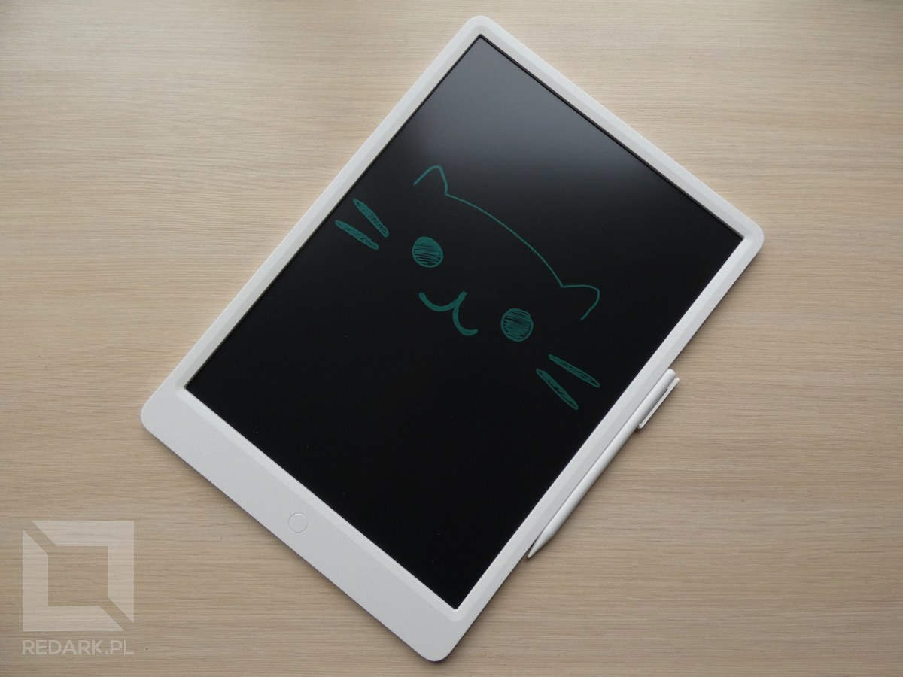
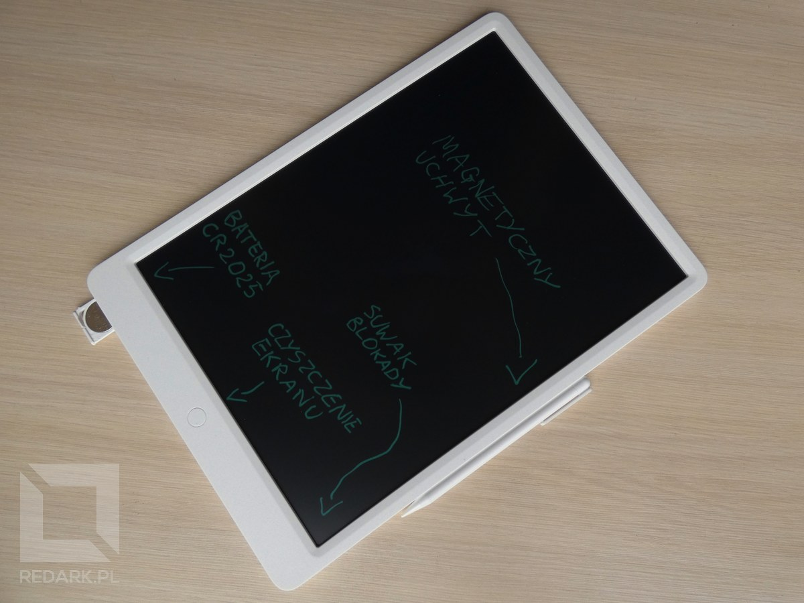
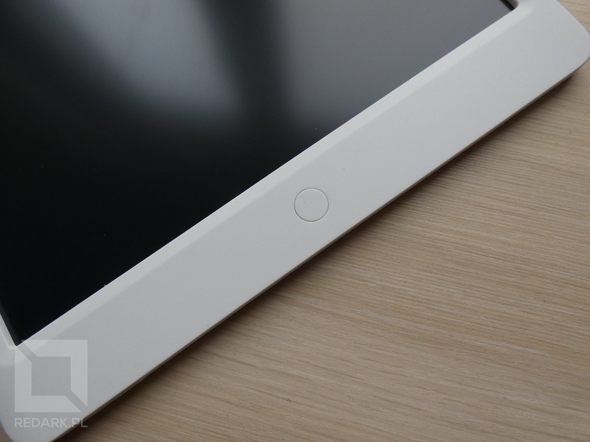
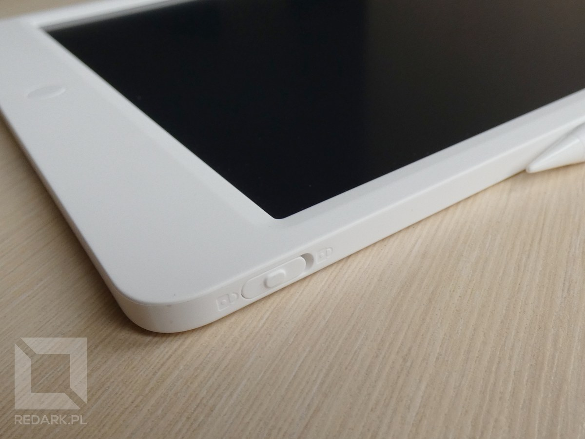
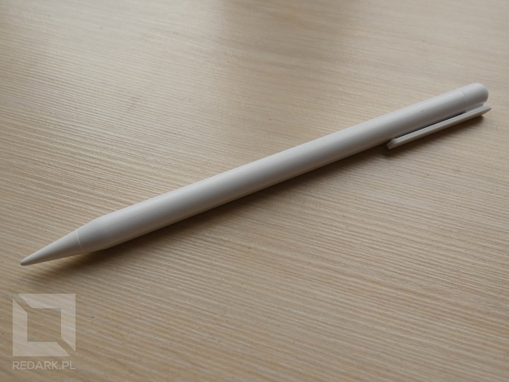
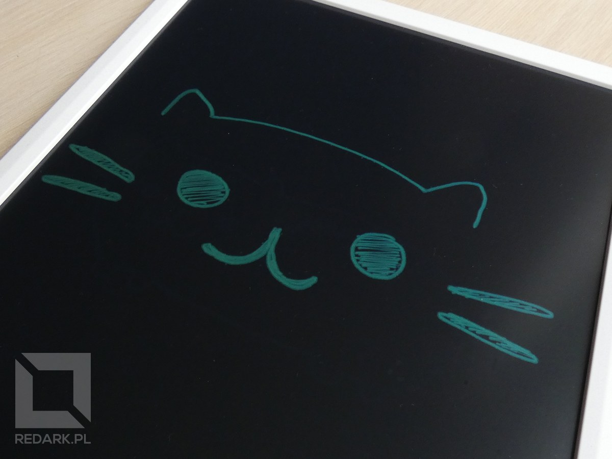

Xiaomi, design tabletów Apple i cena około 100 złotych - czy to może być prawda? Chcę przedstawić Wam dzisiaj Xiaomi LCD Writing Tablet, który niedawno nabyłem. Pewnie część z Was zdaje już sobie sprawę, skąd taka niska cena urządzenia. Nie jest to tradycyjny tablet, jaki znamy z życia codziennego. Mowa tutaj o tablecie, a raczej rysowniku, wymazywalnym elektrycznie, czyli tak zwanym znikopisie.

## Zasada działania

Na początek drobne wyjaśnienie dla osób, które po raz pierwszy słyszą o takim rodzaju sprzętu. Znikopisy to urządzenia przypominające tradycyjne, elektroniczne tablety, których ekrany umożliwiają wielokrotne rysowanie i czyszczenie ich powierzchni. Urządzenia te są bardzo uniwersalne. Sprawdzą się zarówno jako zabawka dla dziecka, jak i gadżet do zwiększania produktywności. Można na nich sporządzać szybkie notatki bądź obliczenia albo zapisywać listę zadań do zrobienia. Zaletą takiego rozwiązania jest brak walających się niepotrzebnie na biurku kartek papieru.

Ekran tabletu jest czuły na nacisk, więc można pisać po nim przy pomocy dołączonego do zestawu rysika lub za pomocą palca. Do naciśniętej powierzchni przywiera barwnik, najczęściej w kolorze zielono-niebieskim. Gdy chcemy wykasować rysunki wystarczy, że wciśniemy przycisk znajdujący się pod ekranem. W przeciwieństwie do samego pisania, do tej operacji tablet wymaga zasilania. Dostarcza je mała pastylkowa bateria ukryta w jego obudowie. Po wciśnięciu przycisku kasowania znikopis wytwarza ładunek elektryczny, który powoduje oderwanie barwnika z powierzchni ekranu i wyczyszczenie tabletu.

<AdSense/>

Zaletami tej technologii jest minimalny pobór prądu (tylko podczas kasowania zawartości ekranu), natomiast wadami jest brak możliwości wyłączenia rysowania po ekranie oraz fakt, że nie można wykasować wyłącznie części wykonanego rysunku, choć jest wyjątek. Znalazłem w Internecie model znikopisu, który posiadał tryb częściowego wymazywania ekranu, ale jego dostępność była tak znikoma, że nie zaryzykowałem kupna.

## Budowa Xiaomi LCD Writing Tablet

Nie sposób nie zauważyć tutaj inspiracji wyglądem produktów Apple. Na froncie urządzenia widzimy obszar roboczy o przekątnej 13,4" (wymiary: 220 na 276 milimetrów) oraz okrągły przycisk umożliwiający wyczyszczenie ekranu. Na dolnej krawędzi urządzenia znajdziemy kieszeń na baterię CR2025, a na prawej krawędzi u dołu suwak umożliwiający dezaktywowanie przycisku do kasowania zawartości ekranu. W połowie prawej krawędzi znajdują się również niewidoczne magnesy, które służą do zaczepienia tam dołączonego do zestawu rysika. Urządzenie wykonane jest z dobrej jakości materiałów, które nie wyginają się przesadnie i są miłe w dotyku. Waga sprzętu to zaledwie 345 gram.

<Gallery>

</Gallery>

Duży plus za ergonomię dołączonego rysika. Nie jest to zwykły, prosty patyczek. Posiada zaokrąglony przekrój, który dobrze wpływa na komfort pisania. Końcówka rysika ma kształt zaokrąglonego stożka, co umożliwia precyzyjną kontrolę grubości rysowanych przez nas linii. Do uchwytu magnetycznego mam pewne zastrzeżenia. Na plus przemawia elegancja rozwiązania, które prezentuje się znacznie lepiej niż otwory z zatrzaskami w produktach konkurencji. Na minus to, że magnesy trzymające rysik nie są zbyt mocne. Sprawdzą się, gdy nie chcesz zawieruszyć rysika na biurku, ale włożenie urządzenia do torby podróżnej najprawdopodobniej skończy się natychmiastowym odłączeniem rysika i możliwością jego zgubienia.

## Wrażenia z pisania

Używam tabletu już kilka dni, wykonałem na nim parę rysunków, zapisków i schematów. Urządzenie sprawuje się dokładnie tak, jak się spodziewałem. Jest to ciekawy gadżet dla osób, które co chwilę muszą sobie coś zapisać na szybko. Bardzo duża powierzchnia ekranu nie ogranicza w pisaniu, ale może też powodować pewien dyskomfort podczas pisania. Z racji tego, że jest to tablet reagujący na nacisk, nie można oprzeć na jego powierzchni ręki. Kolor barwnika jest przyjemny dla oka, a kąty widzenia są przyzwoite, choć pod niektórymi widoczność rysunków wyraźnie spada. Drobnym minusem, jaki zauważyłem, jest potrzeba wyczyszczenia ekranu czasami dwukrotnie, ponieważ zdarza się, że zostają na nim drobne artefakty z poprzedniego rysunku.

## Podsumowanie

Mimo drobnych wad w postaci artefaktów i słabo trzymającego magnesu jestem zadowolony z zakupu. Otrzymałem duży i elegancki tablet, który będzie towarzyszyć mi w codziennych zajęciach. Jeśli również potrzebujecie takiego gadżetu lub macie dziecko zużywające tony papieru, który i tak ląduje w koszu, to serdecznie polecam Xiaomi LCD Writing Tablet.

<GoodList>
- duża przekątna powierzchni roboczej
- elegancki wygląd urządzenia
- wygodny rysik z magnetycznym uchwytem
</GoodList>

<BadList>
- pojawiają się artefakty (potrzebne podwójne czyszczenie)
- magnesy trzymające rysik mogłyby być silniejsze
</BadList>
