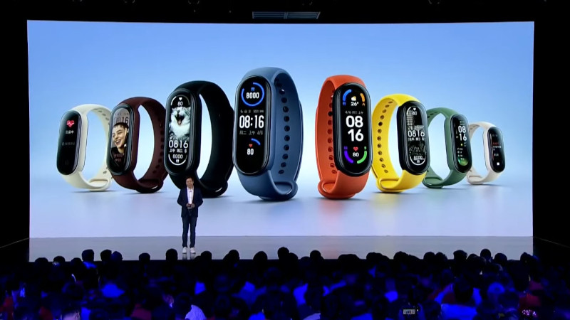
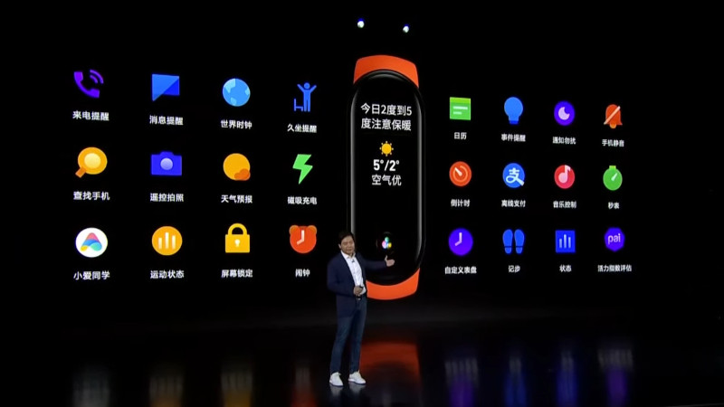
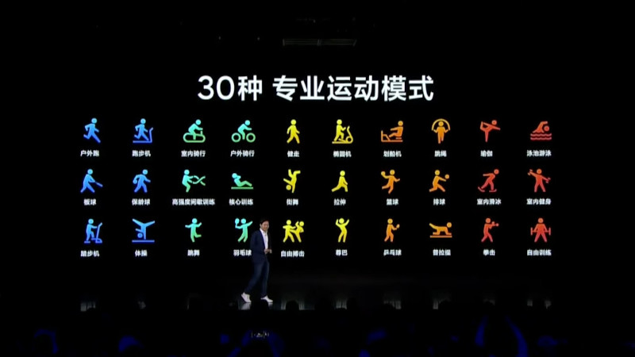

<ActionButton to='/recenzja-analiza-dzialania-opaski-xiaomi-mi-band-6'>Zobacz recenzję Xiaomi Mi Band 6 (2021)</ActionButton>

Dzisiaj miała miejsce konferencja Xiaomi, na której zaprezentowano nowe produkty tego producenta. Oprócz kolejnych modeli smarfonów z rodziny Mi 11 oraz innych drobnych gadżetów przedstawiono również nową generację Mi Banda - najpopularniejszej opaski sportowej na rynku. Uznałem, że jest to idealny moment, aby podsumować moje doświadczenia z użytkowania Mi Banda 5. generacji oraz porównać jego specyfikację z najnowszym produktem Xiaomi. Zapraszam zatem na podsumowanie opaski Xiaomi Mi Band 5 oraz omówienie parametrów nadchodzącego Mi Band 6.

## Wrażenia z użytkowania Mi Banda 5

W okresie wakacyjnym 2020 roku miałem przyjemność opublikować Wam recenzję 5. generacji opaski. Opaska służy mi od tamtej pory jako zegarek. Postaram się zweryfikować wszystkie kwestie, jakie poruszyłem w tamtej recenzji. Jeśli jej nie znasz, a chcesz nadrobić, zapraszam [tutaj](/xiaomi-mi-band-5-recenzja-analiza-dzialania).

Zacznijmy od wykonania. Opaska służyła mi bezawaryjnie przez cały okres użytkowania. Nosiłem ją zarówno w dzień, jak i w nocy. Była zdejmowana jedynie na czas ładowania i kąpieli. Korzystałem z trzech różnych pasków - czarnego, który był oryginalnie dołączony do urządzenia oraz dwóch "nieoficjalnych", które swoim kolorowym dziurkowaniem nawiązują do stylistyki Apple Watcha. Wszystkie trzy opaski przyzwoicie leżały na ręce i nie powodowały żadnego uczulenia na skórze. Opaska dołączona do zestawu jest naprawdę dobrej jakości, a szeroki wachlarz innych rodzajów opasek dostępny w Internecie pozwala dopasować wygląd zegarka do swoich preferencji. Do wytrzymałości ekranu Mi Banda 5 się nie odniosę, ponieważ niedługo po opublikowaniu jego recenzji założyłem na niego dołączone do opasek szkiełko ochronne, które wytrzymało do dziś bez żadnych widocznych rys.

<Gallery>

</Gallery>

## Wykonywanie pomiarów

Przejdźmy teraz do analizy działania sensorów opaski. Mi Band 5 posiada pulsoksymetr umożliwiający pomiar tętna, poziomu stresu oraz jakości snu. Pomiar natlenienia (saturacji) krwi niestety nie został odblokowany globalnie i jest dostępny tylko w wersji przeznaczonej na rynek chiński. Do pomiaru tętna w spoczynku lub podczas spacerów nie mam zastrzeżeń. Wyniki były wiarygodne. Gorzej wypadał pomiar w trakcie ćwiczeń. Tutaj opaska albo wskazywała tętno bezbłędnie albo pokazywała beznadziejne wyniki pokroju 40 uderzeń na minutę. Z pewnością miało to związek z poceniem się skóry oraz przemieszczaniem się opaski na ręce. Co do pomiaru stresu, nie zmieniam swojej opinii z [zeszłorocznej recenzji](/xiaomi-mi-band-5-recenzja-analiza-dzialania). Mi Band pokazuje jakieś wartości, ale nie odczułem, aby były one wiarygodne. W dodatku aby pomiar się udał, należy stać w absolutnym bezruchu, co sprawia, że automatyczny monitoring tego parametru w ciągu dnia nie ma najmniejszego sensu. Pomiar jakości snu ma również swoje humory. Miał on duże problemy z działaniem po jeden z aktualizacji, ale zostało to już na szczęście poprawione. Rejestruje on fazy głębokiego i płytkiego snu, fazy REM oraz momenty chwilowego przebudzenia. Powiedziałbym, że w okolicach 80% przypadków wyniki prezentowane w aplikacji Mi Fit miały sens, więc opcja ta nie jest bezużyteczna.

<AdSense/>

Pozostał jeszcze krokomierz i tutaj również podtrzymuje swoje zdanie z recenzji. Mi Band 5 oferuje przyzwoity pomiar ilości kroków. Ma on problemy ze zliczaniem ich na krótkich trasach np. okazjonalne przejście między pokojami w mieszkaniu nie jest rejestrowane, ale na dłuższych trasach jest już bardzo dobrze i to bez wsparcia modułu GPS. Dokładną analizę działania krokomierza przeprowadziłem w pierwszym artykule, więc nie będę rozpisywać się na ten temat.

## Obsługa urządzenia

Interfejs opaski jest przejrzysty i intuicyjny. Możliwość personalizacji pozycji menu oraz widgetów pozwala bardzo fajnie dostosować urządzenie do swoich potrzeb. Oprócz tarczy zegarka ustawiłem sobie jeszcze cztery widgety: minutnik, powiadomienia z telefonu, zdalne wyciszanie dzwonów w telefonie oraz ekran pogody. Tarczę, którą używam znalazłem w oficjalnym sklepie w aplikacji Mi Fit. Jest minimalistyczna, czytelna oraz posiada ciekawy gradient na cyfrach prezentujących godzinę. Jeśli chodzi o integrację z telefonem to korzystałem z powiadomień, wyświetlania połączeń głosowych, zdalnego wyciszania dzwonków, modułu GPS oraz blokady telefonu, jeśli opaska (oraz jej właściciel) znajdowały się z daleka od siebie. Wszystkie wymienione tutaj funkcje działały rewelacyjnie, a problem z komunikacją przez zerwanie połączenia Bluetooth zdarzył się może z dwa razy w ciągu całego roku. Pod tym względem jestem naprawdę zadowolony z działania Mi Banda 5. Dodatkowo Xiaomi regularnie wypuszcza do niego aktualizacje, które dodały już m.in. automatyczne wykrywanie treningów oraz interfejs w języku polskim. Szkoda tylko, że moduł komunikacji NFC wraz z płatnościami zbliżeniowymi nadal nie działa na rynku globalnym.

## Ładowanie i czas pracy na baterii

Na koniec oczywiście pozostało omówić, jak Mi Band 5 radzi sobie z pracą na baterii. W zeszłym roku przy włączonych pomiarach automatycznych co 10 minut, jasności ekranu na 80% oraz wybudzaniu ekranu po podniesieniu ręki udało mi się uzyskiwać około 13-14 dni pracy na baterii, czyli dokładnie tyle, ile deklaruje producent. Obecnie urządzenie doznało jedynie nieznacznego obniżenia wydajności ogniwa. Uśredniony interwał ładowania opaski wynosi teraz 11-12 dni, a najgorszy wynik, jaki udało mi się uzyskać (użytkowałem wtedy opaskę bardzo intensywnie) wynosił 9 dni. Jestem pozytywnie zaskoczony działaniem Mi Banda 5, ponieważ pozwolił mi on nie przejmować się zbytnio poziomem naładowania baterii, co z pewnością miałoby miejsce podczas używania produktów konkurencji (dla przykładu opaska od Huawei'a ma problem z osiągnięciem pełnego tygodnia bez ładowania). Dołączona do zestawu magnetyczna ładowarka to strzał w dziesiątkę. Korzystanie z niej jest bardzo komfortowe oraz nie powoduje zwiększonego zużycia paska przez ciągłe wyciąganie, a raczej wyciskanie z niego pastylki. Jeśli chodzi o czas pracy na baterii i sposób ładowania, to Mi Band 5 jest rewelacyjny.

## Konferencja Xiaomi

Podczas konferencji Xiaomi, która odbyła się 29 marca 2021 roku o godzinie 13:30 czasu polskiego, gigant przedstawił nowy telefon - Mi 11 Pro. Będzie on posiadać większą baterię o pojemności 5000mAh z ładowaniem bezprzewodowym 67W, który naładuje baterię do pełna w zaledwie 36 minut. Kamery zaoferują 50-krotny zoom hybrydowy oraz nagrywanie w rozdzielczości 8K z trybem slow-motion w 1920 klatkach na sekundę. Dodatkowo Xiaomi zaprezentował dwie nowe ładowarki bezprzewodowe - jedną w formie podstawki, a drugą w formie płaskiego panelu umożlwiającego jednoczesne ładowanie trzech urządzeń w dowolnym miejscu. Następnie pokazano nowy 12-antenowy router Wi-Fi oraz dwa nowe telefony - Mi 11 Ultra oraz Mi 11 Lite 5G. Model Ultra będzie wyposażony w dużą wyspę aparatów skrywającą trzy obiektywy (zwykły, szeroki kąt i teleobiektyw z hybrydowym 120-krotnym zoomem) oraz dodatkowy mini wyświetlacz. Lite 5G ma zostać najtańszym i najmniejszym telefonem wyposażonym w technologię komunikacji 5G oraz procesor Snapdragon 780G. Na koniec prezentacji pozostawiono to, na czym mi najbardziej zależało, czyli premierę opaski Xiaomi Mi Band 6.

<ImageDescription>Ładowanie bezprzewodowe do trzech urządzeń naraz</ImageDescription>

<AdSense/>

## Analiza specyfikacji nadchodzącego Mi Banda 6

Niedawno na moich social mediach informowałem Was o ciekawej grafice promocyjnej Mi Banda 6, z której można było wywnioskować, że opaska otrzyma bezramkowy ekran i okazało się to prawdą. Mi Band 6 posiada zaokrąglony ekran AMOLED o przekątnej 1,56 cala wypełniający praktycznie cały front urządzenia. Xiaomi potwierdziło umieszczenie w 6-tce pulsoksymetru i mam nadzieję, że tym razem będzie on dostępny globalnie.

<Gallery>

</Gallery>

Opaska ponownie wystąpi w dwóch wariantach - bez i z modułem NFC, ale na 99% znowu będzie on działać tylko na terenie Chin. Nie potwierdziły się za to plotki o wbudowanym module GPS. Mi Band 6 nadal będzie wymagał pomocy telefonu do ustalenia swojej dokładnej lokalizacji w terenie. Dodatkowo opaska ma posiadać rozbudowaną bazę 30. trybów treningowych w tym 6 wykrywanych automatycznie. W kwestii baterii i ładowania jest bez zmian - producent deklaruje do 14 dni pracy na baterii i ładowanie za pomocą uchwytu magnetycznego. **Wersja bez NFC na rynku globalnym została wyceniona na 45 euro.**

<Gallery>

</Gallery>

Jeśli o mnie chodzi, to przede wszystkim jestem oczarowany nowym zaokrąglonym wyświetlaczem, który wygląda fenomenalnie. Wszystko wskazuje na to, że otrzymamy czujnik saturacji krwi, który jest szczególnie cenny podczas walki z pandemią COVID-19. Do szczęścia brakuje mi tylko płatności NFC i raczej będę musiał obejść się smakiem. W kwestii braku modułu GPS i prawdopodobnie również braku asystenta głosowego, to dla mnie nie jest to problemem. Jeśli miałoby się to odbić na czasie pracy na baterii, to wolę już używać nadajnika w moim telefonie. Ciekawi mnie tylko, jak będzie się korzystać z interfejsu Mi Banda bez stałego przycisku dotykowego. Jego umiejscowienie było intuicyjne i pozwalało łatwo wybudzać ekran w nocy. Teraz prawdopodobnie będzie się to odbywało za pomocą dotknięcia dowolnego miejsca na ekranie i nie wiem, czy przez to ekran nie będzie wybudzał się zbyt często.

<ImageDescription>Podsumowanie specyfikacji Xiaomi Mi Band 6</ImageDescription>

I to by było na tyle. Mam nadzieję, że uda mi się sprawnie zdobyć egzemplarz Mi Banda 6 i przeprowadzić dla Was dokładną analizę jego działania. W międzyczasie zapraszam serdecznie do obserwowania moich social mediów oraz do przeczytania przeprowadzonego u mnie niedawno testu tabletu od Xiaomi w cenie nieco ponad 100 złotych. Link do artykułu znajduje się poniżej:

<ActionButton to='/test-xiaomi-lcd-writing-tablet'>Test Xiaomi LCD Writing Tablet za 100 złotych</ActionButton>
