Tuż przed majówką Xiaomi zorganizowało w Polsce konferencję poświęconą premierze ich najnowszych produktów. Jednym z nich był Xiaomi Mi Band 6 - kolejny przedstawiciel najpopularniejszej serii opasek sportowych. [Moja zeszłoroczna analiza działania Mi Banda 5](/xiaomi-mi-band-5-recenzja-analiza-dzialania) cieszyła się bardzo dużym zainteresowaniem, więc nie mogłem przejść obojętnie wokół tego wydarzenia. Zakupiłem Mi Banda 6 podczas premiery i przez następne dwa tygodnie dokładnie analizowałem jego działanie. Aby dobrze odpowiedzieć na pytanie "czy warto wymienić Mi Banda 5 na 6" postanowiłem przez ten czas używać obu opasek jednocześnie i porównywać na bieżąco wszystkie zbierane przez nie dane. Dla jasności przekazu dodam, że poprzednią generację Mi Banda rozpoznacie na zdjęciach po jasnej (niestandardowej) opasce, którą do niej dokupiłem. Mi Band 6 przez cały czas był wyposażony w oryginalny czarny pasek.

<AdSense/>

## Zawartość pudełka i wykonanie

Wewnątrz opakowania znajdziemy serce Mi Banda w formie małej pastylki włożonej w czarną gumową opaskę, ładowarkę magnetyczną oraz papierową instrukcję obsługi - większą i cięższą od samego urządzenia (niech żyje ekologia!). Analogicznie jak to miało miejsce w przypadku Mi Banda 3 i 4, tak i tutaj **otrzymaliśmy wsteczną kompatybilność z zeszłorocznym modelem smart banda**. Urządzenie ma takie same wymiary, co Mi Band 5, więc osoby posiadające kolekcję niestandardowych opasek do poprzednika, będą zadowolone. Samego Mi Banda 6 można rozróżnić od ubiegłorocznego modelu tylko za pomocą dwóch szczegółów. Pierwszym z nich jest brak dotykowego przycisku pod ekranem, który jest zaznaczony malutkim szarym kółkiem. Druga różnica kryje się w wyglądzie sensora optycznego. Z racji wbudowanego w tę generację pulsoksymetru wygląda on odrobinę inaczej. Oprócz tych różnic, to stary sprawdzony Mi Band. Zarówno wykonanie samej pastylki, jak i opaski stoi na wysokim poziomie, a bezramkowy wyświetlacz nadaje wrażenie jednolitej i jednobarwnej tafli szkła. Ekran posiada przekątną 1.56 cala (Mi Band 5 posiadał 1.1 cala), jest wykonany w technologii AMOLED oraz przykryty jest szkłem hartowanym 2.5D. Jasność ekranu można podbić do 450 nitów, a zagęszczenie pikseli wynosi 326 PPI, co daje fenomenalne rezultaty. Obraz wyświetlany na ekranie jest jasny, żywy, a pojedyncze piksele nie do zauważenia. Oprócz tego Mi Band 6 posiada 3-osiowy akcelerometr i żyroskop, pulsoksymetr, baterię 125 mAh oraz moduł łączności Bluetooth 5.0 Low Energy.

<Gallery>
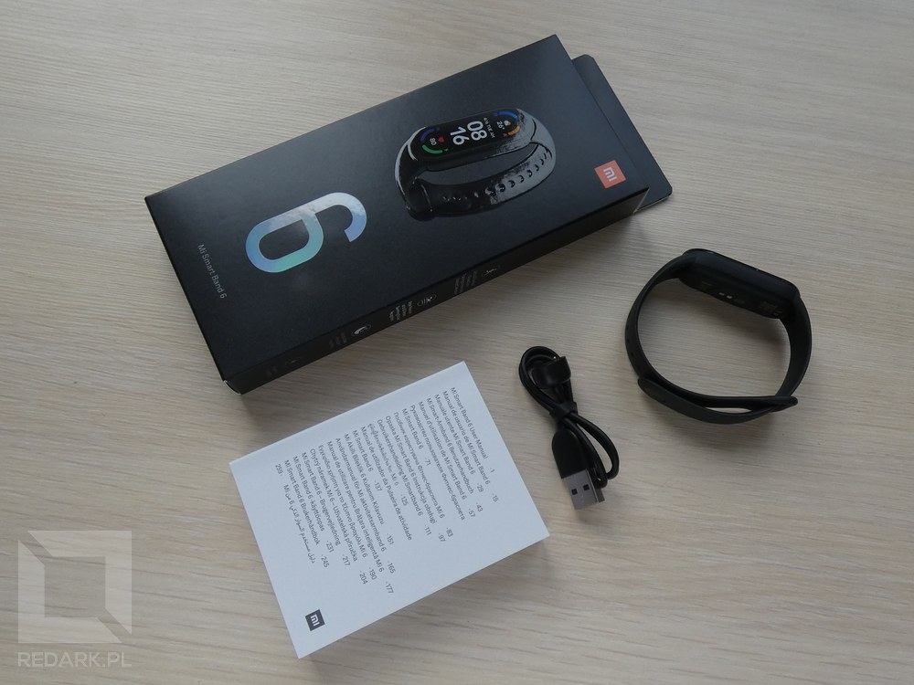
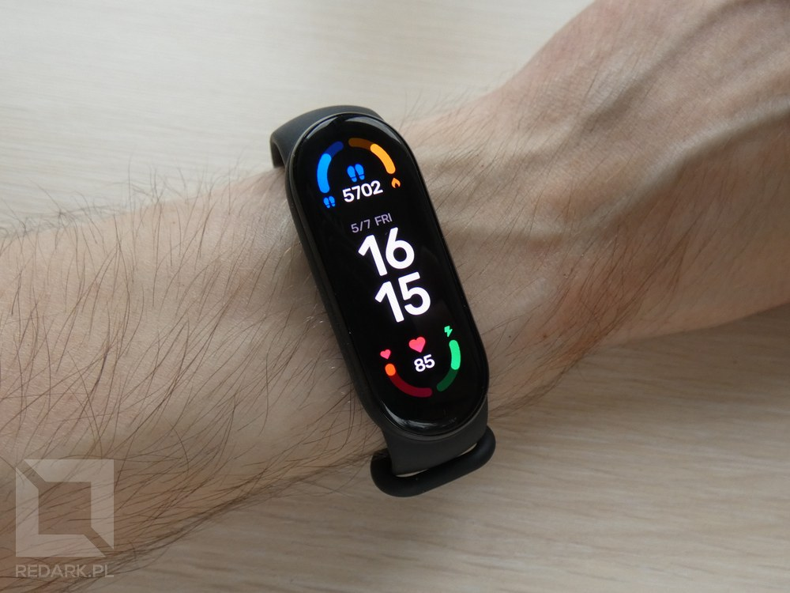
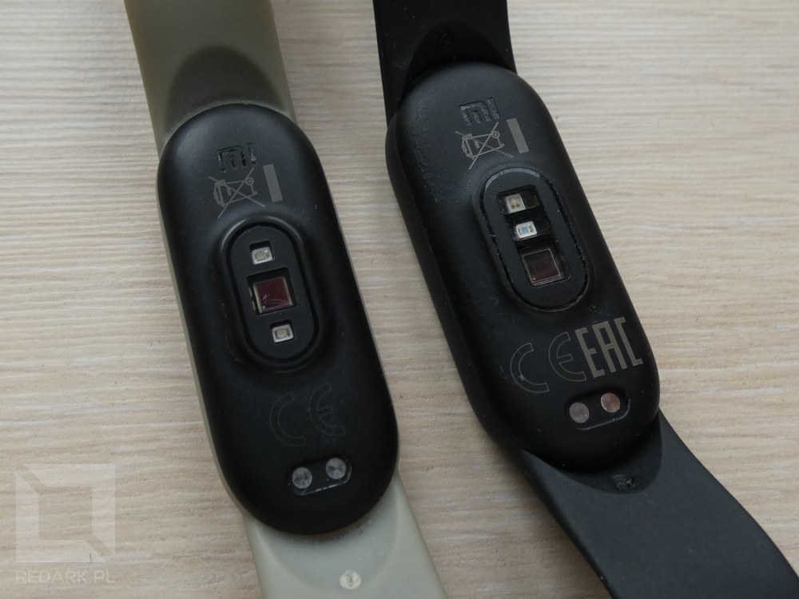
</Gallery>

## Interfejs

Interfejs Mi Banda 6 otrzymał szereg ulepszeń pozwalających w pełni wykorzystać potencjał nowego ekranu. Ponownie mamy tutaj do czynienia z krzyżakowym sposobem nawigacji. Przeciągając ekrany poziomo możemy przeglądać widgety umożliwiające szybki dostęp do najczęściej używanych przez nas funkcji zegarka. Pionowe przeciągnięcia ekranu pozwalają wywołać menu główne, za pomocą którego aktywujemy pozostałe funkcje opaski oraz przejdziemy do jej ustawień. Zarówno listę widgetów, jak i pozycji menu możemy w pełni personalizować - widoczność oraz kolejność wszystkich opcji zależy od użytkownika. Poprzednie modele Mi Bandów posiadały pod ekranem dotykowy przycisk, który umożliwiał wybudzanie ekranu oraz wracanie do poprzedniego menu lub tarczy zegara. Z powodu zastosowania bezramkowego ekranu Xiaomi było zmuszone zrezygnować z tego rozwiązania. Zamiast tego z każdego ekranu wychodzimy teraz przy pomocy gestu przeciągania od lewej krawędzi urządzenia. Muszę przyznać, że jest to fajne i intuicyjne rozwiązanie, choć nadal tęsknię trochę za dotykowym przyciskiem, ale pewnie jest to kwestia przyzwyczajenia i tego, że ze względu na recenzję, noszę teraz obie opaski jednocześnie :D.

Najbardziej widoczną zmianą w interfejsie opaski jest powiększenie wszystkich przycisków funkcyjnych. W poprzedniej generacji były one małe i płaskie, przez co w wielu sytuacjach trafienie w nie graniczyło z cudem. Dzięki większemu i zaokrąglonemu ekranowi Xiaomi mogło rozwiązać ten problem. **Przyciski znajdujące się na końcach wyświetlacza są teraz półokrągłe, a ich powierzchnia zwiększyła się ponad dwukrotnie!** Ciężko mi jest opisać, jak bardzo polepszyło to komfort korzystania z urządzenia. Aby nie był gołosłownym, poniżej znajdziecie porównanie kilku tych samych ekranów na Mi Bandzie 5 oraz 6. Nie tylko przyciski uległy zmianie, ale też, chociażby sposób wybierania wartości minutnika lub godzin alarmów - Mi Band 5 używał do tego malutkich strzałeczek, "szóstka" z kolei posiada duże przewijane menu dobrze znane z systemów operacyjnych smartfonów.

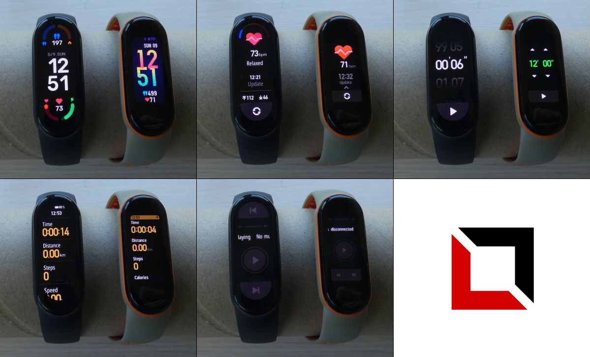

<ImageDescription>Porównanie ekranów interfejsu Mi Band 5 i 6</ImageDescription>

## Tarcze zegarka

Wraz z urządzeniem ponownie otrzymujemy 3 wbudowane tarcze zegarka. Każda posiada kilka personalizowanych pól i pasków, które są w stanie wyświetlić rozmaite dane zebrane przez opaskę lub telefon. Pierwsza zawiera zegar cyfrowy oraz dwa okrągłe personalizowane panele, druga - zegar analogowy oraz dwa półkoliste panele, a trzecia oferuje dwuwierszowy cyfrowy zegar i aż (!) 6 personalizowanych pól. Ich zastosowanie jest przeróżne. Mogą wyświetlać liczbę kroków, spalonych kalorii, poziom baterii, tętno, wskaźnik PAI, aktualną pogodę, wilgotność, indeks UV, godzinę wschodu i zachodu słońca, czystość powietrza, a także wykresy historyczne ilości kroków, tętna itp. Ciężko mi wymienić wszystkie widoczne tam funkcje.

<Gallery>
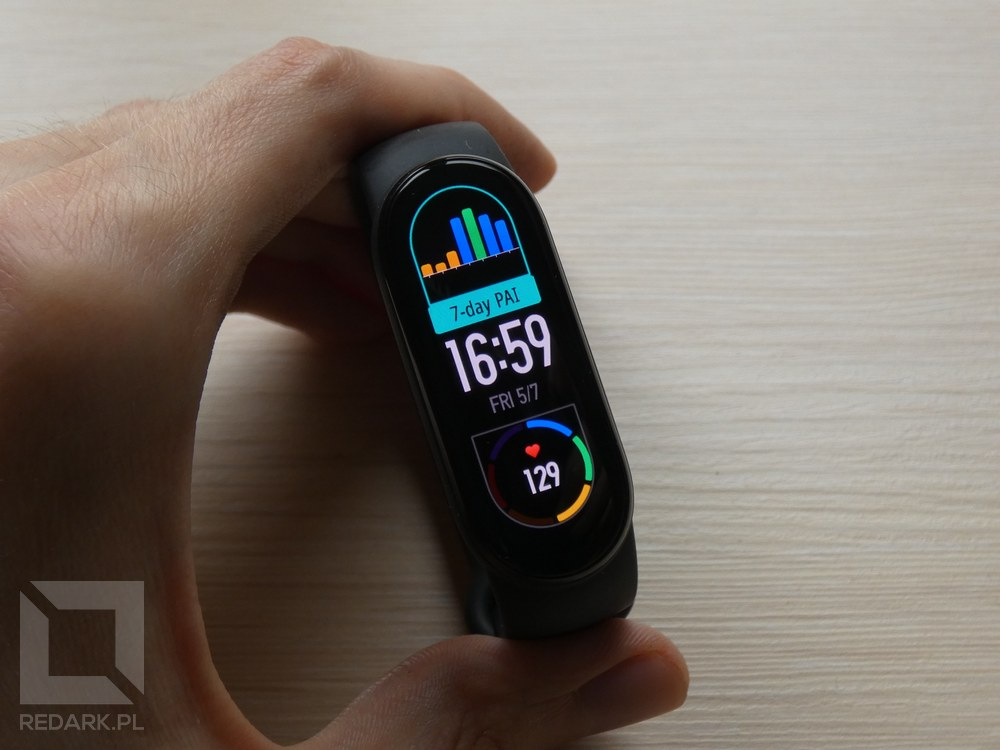
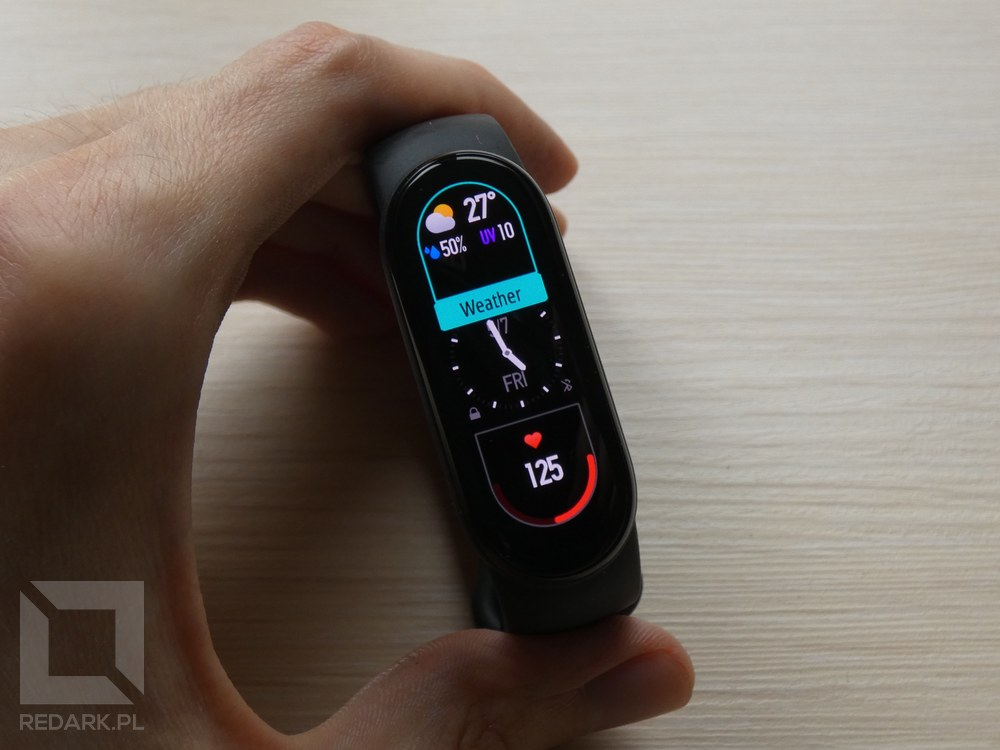
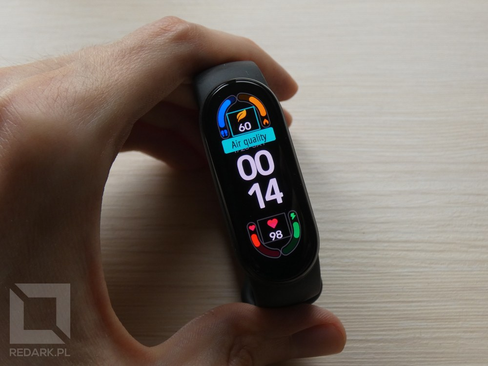
</Gallery>

Oprócz pokazanych powyżej tarcz Mi Band 6 posiada oczywiście możliwość wgrywania niestandardowych układów stworzonych przez  innych użytkowników. Ich wybór jest już całkiem spory (chyba lepszy niż na premierę poprzednika) i z pewnością będzie nadal cały czas powiększany. **Nowością w Mi Bandzie 6 jest możliwość wgrywania tarcz z własnymi zdjęciami w tle.** Z poziomu aplikacji Mi Fit (o której porozmawiamy za chwilę) możemy wybrać jeden z predefiniowanych układów interfejsu (zegar, ikony, datownik itd.) i uzupełnić go o wybrane przez nas zdjęcie z galerii telefonu. Bardzo uatrakcyjnia to wygląd urządzenia i pozwala ukazać prawdziwe piękno wyświetlacza AMOLED wbudowanego w Mi Banda 6, choć wyraźnie wydłuża to czas potrzebny do wybudzenia ekranu urządzenia i z pewnością szybciej drenuje baterię. Efekt działanie tej funkcji mogliście zobaczyć już na grafice promującej ten artykuł.

*P.S. Pozdrawiam Kromkę oraz jej właścicieli ;)*

<AdSense/>

## Aplikacja Mi Fit

Mówiłem o tym rok temu i teraz to powtórzę - Mi Band nie jest samodzielnym urządzeniem. Opaska do swojego działania potrzebuje telefonu wyposażonego w system Android lub iOS z zainstalowaną aplikacją "Mi Fit". Dzięki niej jesteśmy w stanie zmienić część ustawień opaski oraz podejrzeć bardziej szczegółowe wyniki wykonanych pomiarów. Opaska po wyjęciu z opakowania wyświetla jedynie komunikat "Pair first" i aby ją aktywować, należy pobrać i uruchomić wspomnianą wcześniej aplikację, a następnie przeprowadzić parowanie urządzeń za pomocą technologii Bluetooth. Chwilę później aplikacja wykona operacje niezbędne do jej uruchomienia, w tym aktualizację oprogramowania układowego. Cały proces jest wykonywany automatycznie i nie doświadczyłem przy nim żadnych nieprzyjemnych niespodzianek. Dodatkowo, jeśli posiadaliście Mi Banda 5 (tak jak ja), wszystkie podstawowe ustawienia zostaną przekopiowane do nowego urządzenia, co znacząco ułatwi jego wstępną konfigurację.

<WarningBlock>

Próba sparowania Mi Banda 6 oznacza dezaktywację Mi Banda 5. Po tym kroku stara opaska utraci dostęp do części swoich funkcji takich jak np. sprawdzanie pogody, synchronizowanie czasu, odbiór sygnału GPS czy wyświetlanie powiadomień z telefonu. Możemy ten proces cofnąć, ale aplikacja Mi Fit może współpracować z maksymalnie jedną opaską jednocześnie.

</WarningBlock>

Ekran zarządzania opaską został nieco zmodernizowany, ale większość opcji pozostała bez zmian. Znajdziemy tutaj opcje takie jak:

- odbieranie powiadomień i SMS-ów z telefonu,
- odrzucanie lub wyciszanie połączeń przychodzących,
- alarmy oraz powiadomienia o wydarzeniach lub zbyt długim siedzeniu w miejscu,
- funkcja "wykryj opaskę" (uruchamia w niej wibracje),
- ustawienia widoczności urządzenia przez Bluetooth,
- sposób działania ekranu (jasność w trybie nocnym, wybudzanie po podniesieniu ręki),
- częstotliwość automatycznego pomiaru tętna oraz poziomu stresu,
- monitoring jakości snu,
- personalizacja menu, widgetów oraz listy treningów,
- personalizacja zegarów światowych oraz prognozy pogody,
- personalizacja sygnałów wibracji (pozwala nagrać własne sekwencje wibracji do każdego typu powiadomień),
- odblokowanie telefonu z pominięciem ekranu blokady.

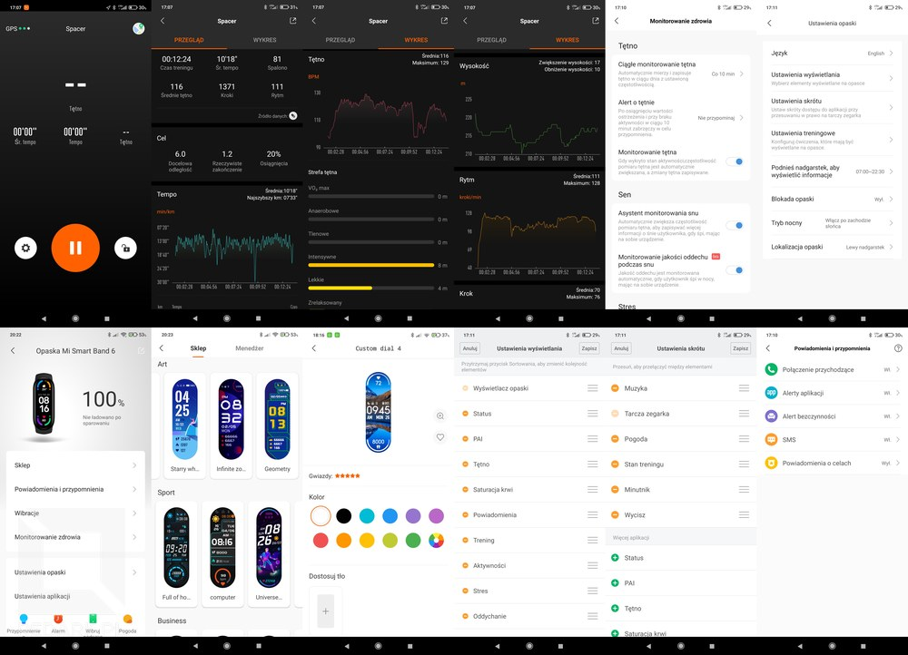

**Z nowych opcji względem poprzednika** zauważyłem alerty pogodowe, automatyczną blokadę opaski po zdjęciu jej z ręki oraz możliwość wyboru sposobu wybudzania ekranu urządzenia. W Mi Bandzie 5 odbywało się to poprzez dotykowy przycisk pod ekranem. Mi Band 6 oferuje dwa tryby: pojedyncze dotknięcie lub gest przeciągnięcia od dołu. Oba tryby są bardzo ciekawe i minimalizują ryzyko niepotrzebnego wybudzania się ekranu, co bardzo mnie martwiło przed otrzymaniem tego urządzenia. Pierwsza opcja faktycznie reaguje tylko na dotknięcia (losowe "mazianie" po ekranie nie wywoła reakcji), natomiast ustawienie gestu przeciągania sprawia, że musimy wykonać określony gest, aby wybudzić ekran.

Główny widok aplikacji Mi Fit, tak samo, jak w przypadku poprzednika, pozwala na przejrzenie wykresów treningu, pomiaru tętna, saturacji (nowość), stresu, jakości snu, a także wagi i składu naszego ciała, jeśli tylko posiadamy inteligentną wagę od Xiaomi (mam i polecam). Podgląd historii treningów pokazuje wykres tętna, wysokości n.p.m., rytmu marszu oraz długości kroku. Jeśli korzystaliśmy z sygnału GPS, dostępna będzie również mapa z naniesioną ścieżką naszej trasy. Trening można uruchomić także z poziomu aplikacji. W tym trybie Mi Fit posiada przyjemny, minimalistyczny interfejs z dodatkową opcją personalizacji wyświetlanych wartości oraz blokadą ekranu.

<InfoBlock>
Wbrew przedpremierowym plotkom Mi Band 6 nie posiada wbudowanego modułu GPS i nadal musi się posiłkować danymi lokalizacyjnymi telefonu. Jest to moim zdaniem bardzo dobra wiadomość, ponieważ zastosowanie modułu GPS znacząco podniosłoby cenę urządzenia i drastycznie skróciło czas pracy na baterii, a nie oto chodzi w tej serii opasek.
</InfoBlock>

<AdSense/>

## Test dokładności pomiarów

Czas zająć się najważniejszą częścią tego artykułu, czyli testem dokładności pomiarów wykonywanych przez Mi Banda 6. Tak samo, jak rok temu, postanowiłem przeprowadzić szereg testów wszystkich sensorów dostępnych w opasce, aby ustalić, czy urządzenie w tej klasie cenowej, jest wiarygodnym źródłem informacji, czy jedynie tanią chińską zabawką.

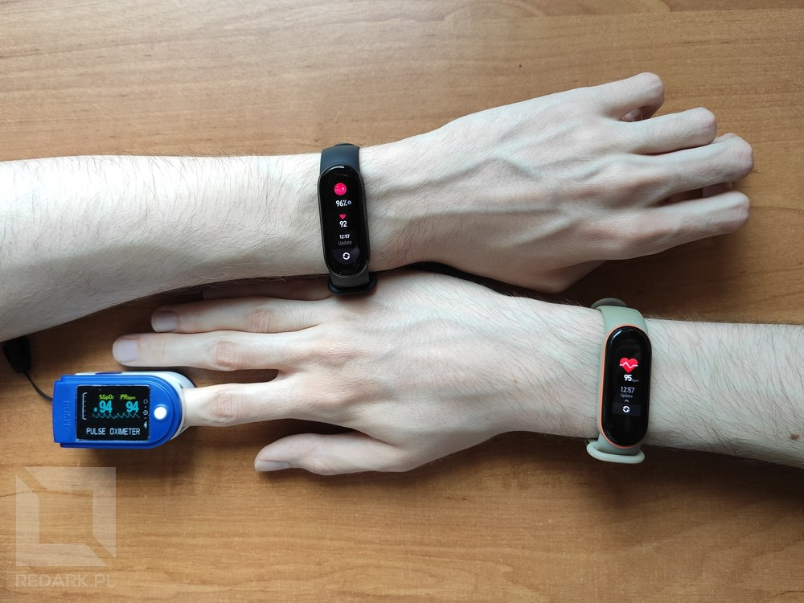

### Pulsoksymetr

Na początek weźmy pulsoksymetr, czyli pomiar tętna wraz z natlenieniem ludzkiej krwi. Pomiar saturacji jest szczególnie ważny w przypadku zakażenia wirusem COVID-19, z którym zmagamy się przez ostatni rok, więc bardzo dobrze, że taka opcja w końcu zawitała do najpopularniejszej opaski dostępnej na rynku. Aby zweryfikować dokładność tego sensora, postanowiłem wykonywać na sobie pomiar za pomocą trzech urządzeń jednocześnie: Mi Banda 6 na lewej ręce, Mi Banda 5 na prawej ręce oraz standardowego pulsoksymetru zakładanego na palec, który jest używany przez chorych na koronawirusa. Wyniki przeprowadzonych pomiarów prezentuje tabela poniżej:

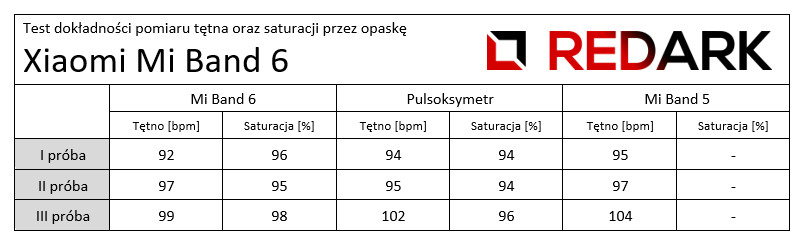

Jak widać po otrzymanych wynikach dane podawane przez Mi Banda 6 są bardzo dokładne. Największe odchylenie pomiaru saturacji między opaską a dedykowanym pulsoksymetrem wynosiło 2%. Pomiar tętna również był zadowalający. Różnica do pulsoksymetru wynosiła maksymalnie 3 uderzenia na minutę.

### Poziom stresu i jakość snu

Mi Band 6 pozwala również na badanie poziomu naszego zestresowania. Nie byłem fanem tej funkcji u poprzednika. Często wskazywał on różne wyniki, a pomiary często kończyły się błędem. W przypadku tegorocznego modelu jest odrobinę lepiej. Na pewno pomiar rzadziej kończy się niepowodzeniem, a niewłaściwe ułożenie opaski na ręce jest sygnalizowane od razu na początku wykonywania pomiaru.

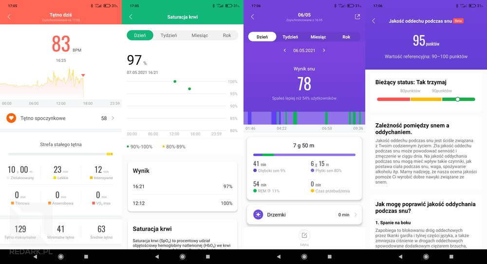

Opaska umożliwia także monitorowanie jakości snu wraz z podziałem na fazy głębokiego i płytkiego snu, fazy REM oraz okresu przebudzenia. Tak samo, jak u poprzednika, zdarzają się tej funkcji drobne potknięcia i wyniki z kosmosu, ale w ogólnym rozrachunku jest dobrze. Prezentowane wyniki są wiarygodne i można im ufać. **Nowością w Mi Bandzie 6 jest za to pomiar jakości oddechu podczas snu** dzięki zastosowaniu testowanego wcześniej pulsoksymetru. Opaska prezentuje zebrane dane w 100-punktowej skali, która pozwala na wykrycie możliwości wystąpienia tzw. bezdechu sennego. Należy zaznaczyć, że funkcja ta jest oznaczona jako eksperymentalna i Xiaomi nadal ją dopracowuje.

### Krokomierz i treningi

Równie ważną funkcją wszystkich Mi Bandów był monitoring aktywności fizycznej połączony z krokomierzem. Rok temu przygotowałem obszerny test jego działania podzielony na aż 9 prób i teraz również nie mogło go zabraknąć. Wykonałem dwa różne testy po trzy próby każdy. Pierwszy test odbywał się bez pomocy sygnału GPS, a drugi z pomocą sygnału lokalizacyjnego telefonu. Wszystkie wyniki porównywałem z pomiarem długości trasy w Google Maps, a także z pomiarami Mi Banda 5, który znajdował się na mojej drugiej ręce. Naturalnie nie mógł on w żadnej próbie korzystać z sygnału GPS, ponieważ został odłączony od aplikacji Mi Fit, więc jego wyniki obserwujcie tylko z czystej ciekawości. Wartości zebrane podczas testów krokomierza widoczne są w tabeli poniżej:

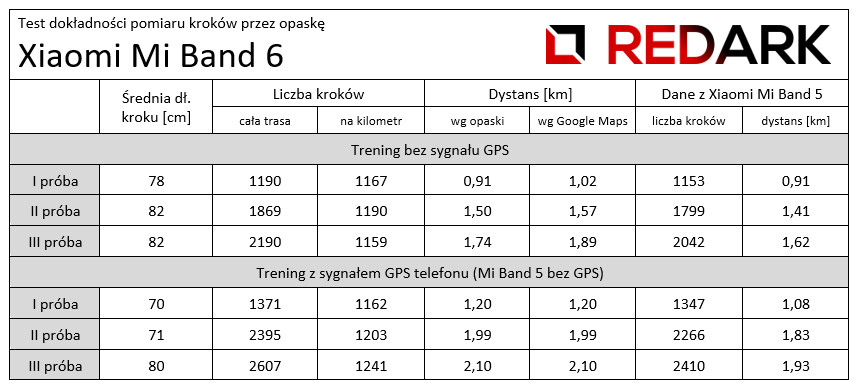

Jak widać dane zebrane przez Mi Banda 6 bez GPS są lepsze lub na tym samym poziomie dokładności, co u Mi Banda 5. Liczba zarejestrowanych kroków na kilometr oscylowała w okolicach 1100-1200, a największy błąd pomiarowy długości trasy wyniósł piętnaście setnych kilometra (III próba). Jest to bardzo dobry wynik, jak na urządzenie polegające tylko i wyłącznie na odczytach z akcelerometru. W przypadku testów z sygnałem GPS długość trasy zgadzała się w 100%, a ilość kroków na kilometr wahała się w okolicach 1200. Podczas pomiarów nie doświadczyłem żadnych problemów z rejestrowaniem danych i łączeniem się z satelitami GPSu poprzez aplikację Mi Fit.

W tym miejscu muszę także pochwalić Xiaomi za ulepszenie ekranu treningów. Po pierwsze posiada on wyraźnie większy, biały zegar cyfrowy. W przypadku Mi Banda 5 bardzo na to narzekałem, ponieważ zegar nie dość, że mikroskopijny, to znajdował się na pomarańczowym tle, przez co odczytanie go nawet w domu było niezwykle trudne. Po drugie **Mi Band 6 pozwala sterować odtwarzaczem muzyki bez wychodzenia z trybu treningu**, co na pewno ucieszy osoby lubiące słuchać muzyki podczas ćwiczeń. Po trzecie każdy trening pozwala ustawić sobie cel wykonywanych ćwiczeń. Możemy wybrać, że chcemy ćwiczyć np. pół godziny lub przebiec określoną liczbę kilometrów.

Oprócz pomiarów w terenie przetestowałem opaskę podczas treningu na rowerze eliptycznym (orbitreku) oraz podczas prowadzenia samochodu. W przypadku orbitreku obie opaski wykonywały pomiary wzorowo, mimo że Mi Band 5 lubił sprawiać mi tam problemy. Obecna generacja zarejestrowała średnie tętno 134, maksymalne 160 i pokazała 243 spalonych kilokalorii, natomiast ubiegłoroczna pokazała średnie tętno 132, maksymalne 156 i 244 spalone kilokalorie. Co do prowadzenia samochodu wykonałem jeden pomiar i Mi Band 6 wypadł zdecydowanie gorzej od poprzedniczki. Na dystansie 150 kilometrów Mi Band 5 zarejestrował nieco ponad 400 kroków, a Mi Band 6 około 1200. Nie wiem skąd taka ogromna różnica, ale będę to jeszcze badać, choć winne może być odmienne wykorzystywanie rąk w w trakcie prowadzenia samochodu.

### Integracja z telefonem

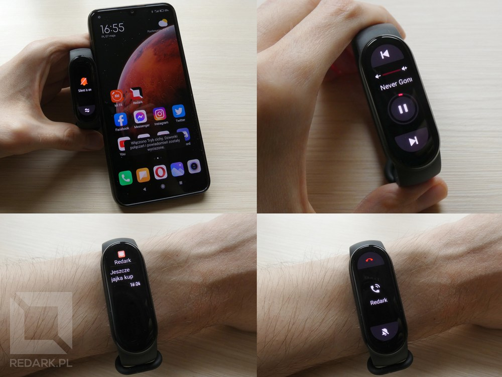

Jeśli chodzi o integrację opaski z telefonem, to nie zauważyłem żadnych problemów z komunikacją. Mi Band 6 zawsze reagował na nadchodzące wiadomości i połączenia. Przed premierę pojawiła się plotka, że tegoroczna opaska zaoferuje opcję szybkich odpowiedzi na otrzymane SMSy, ale niestety nie otrzymaliśmy takiej funkcjonalności.

**Aktualizacja z dnia 25-05-2021:**

Xiaomi wypuściło aktualizację, która dodaje język polski do interfejsu opaski oraz możliwość odpowiadania SMS-ami według zdefiniowanych wcześniej szablonów. Niestety funkcja ta dotyczy tylko połączeń głosowych. Powiadomienia SMS nadal nie umożliwiają wysyłania odpowiedzi.

<AdSense/>

## Ładowanie i długość pracy na baterii

Na koniec oczywiście kwestie zasilania urządzenia. Opaskę ładuje się za pomocą dołączonej do zestawu ładowarki magnetycznej, która jest identyczna, jak w Mi Bandzie 5. Jest ona bardzo wygodna i nie wyobrażam sobie powrotu do dawnego wyjmowania, a raczej wyciskania pastylki z opaski. Urządzenie przyszło do mnie całkowicie rozładowane, a jego pełne naładowanie (od 0 do 100 procent) zajęło dokładnie **godzinę i 35 minut**, czyli praktycznie tyle samo czasu, co u poprzednika. Pierwszą "porcję baterii" zużyłem na poznanie większości funkcji urządzenia oraz eksperymenty, następnie naładowałem baterię ponownie i używałem jej "jak co dzień", aby sprawdzić, jak szybko będę zmuszony sięgnąć ponownie po ładowarkę. Na początku każdy dzień używania opaski obniżał poziom jej baterii o 9-10%, co było znacznie słabszym wynikiem, niż u Mi Banda 5. Później sytuacja się trochę ustabilizowała i urządzenie zużywało 6-7% dziennie, więc **kolejne ładowanie musiałem wykonać po 11 dniach użytkowania** przy zapasie energii wynoszącym około 10%. Jest to więc wynik odrobinę gorszy, niż w przypadku Mi Banda 5 i nie ma się chyba co temu dziwić. Oba urządzenia posiadają ogniowo o tej samej pojemności, ale wyświetlacz Mi Banda 6 znacząco zwiększył swoje wymiary. Pewnie gdybym obniżył odrobinę jego jasność, zbliżyłbym się do deklarowanych przez producenta dwóch tygodni. Nadal jednak większość konkurencyjnych smart opasek może pomarzyć o takim czasie pracy na baterii, więc nie można tutaj narzekać - Mi Band 6 to nadal król pod względem czasu pracy na baterii.

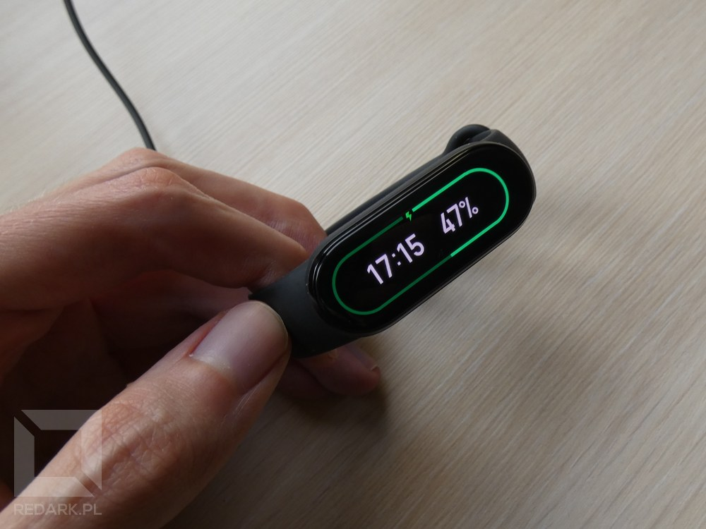

Poniżej prezentuję listę funkcji włączonych w opasce w trakcie trwania testów baterii:

- powiadomienia, połączenia przychodzące oraz SMSy z telefonu,
- alert o bezczynności,
- wybudzanie ekranu po podniesieniu ręki w godzinach 7-23,
- monitoring snu oraz tętna co 10 minut z opcją zwiększania częstotliwości podczas aktywności,
- jasność ekranu ustawiona na 80% z trybem nocnym po zachodzie słońca.

## Podsumowanie

Podsumowując, Mi Band 6 to ponownie bardzo dobrze przemyślany i wyceniony kawałek elektroniki. W kwocie niecałych 200 złotych otrzymałem urządzenie z rewelacyjnym ekranem, ulepszonym interfejsem, o przyzwoitym pomiarze liczby kroków (nawet bez sygnału GPS) oraz pulsoksymetrem, którego dokładności nie mogło podważyć dedykowane urządzenie medyczne, a także (jak pokazują recenzje użytkowników) nawet Apple Watch, który jest 20 razy droższy od omawianego dzisiaj urządzenia. Do szczęścia brakuje mi w nim tylko modułu komunikacji NFC obsługującego płatności zbliżeniowe, ale kto wie, może doczekamy się tego za rok?

Pozostało mi jeszcze tylko dotrzymać obietnicy i odpowiedzieć na pytanie "czy warto zamienić Mi Banda 5 na 6?". Moim zdaniem są tylko dwa powody do zmiany:

1. Chcesz posiadać pulsoksymetr, aby np. badać swój stan w razie zarażenia koronawirusem.
2. Denerwuje Cię mały ekran Mi Banda 5 i masz problemy z trafieniem w przyciski jego interfejsu.

Jeśli na któreś z powyższych pytań możesz odpowiedzieć twierdząco, to bierz Mi Banda 6 bez zastanowienia. Jeśli nie potrzebujesz pulsoksymetru oraz większego bezramkowego wyświetlacza, to wstrzymaj się z zakupem - Mi Band 6 zaoferuje Ci to samo, co "piątka".

To by było na tyle. Zapraszam serdecznie do udostępniania tego artykułu znajomym, a także do udzielania się w sekcji komentarzy pod tym artykułem lub na moich social mediach - z chęcią odpowiem na wszystkie Wasze pytania.

<GoodList>
- Bezramkowy wyświetlacz z rewelacyjnymi kolorami i kontrastem
- Znacząco ulepszony interfejs
- Przyzwoity czas pracy na baterii oraz wygodna magnetyczna ładowarka
- Szeroka gama ustawień, personalizacji oraz trybów treningu
- Dobra lub bardzo dobra precyzja pomiaru kroków, tętna, snu oraz saturacji
</GoodList>

<BadList>
- Nadal brak komunikacji NFC w wersji globalnej
</BadList>