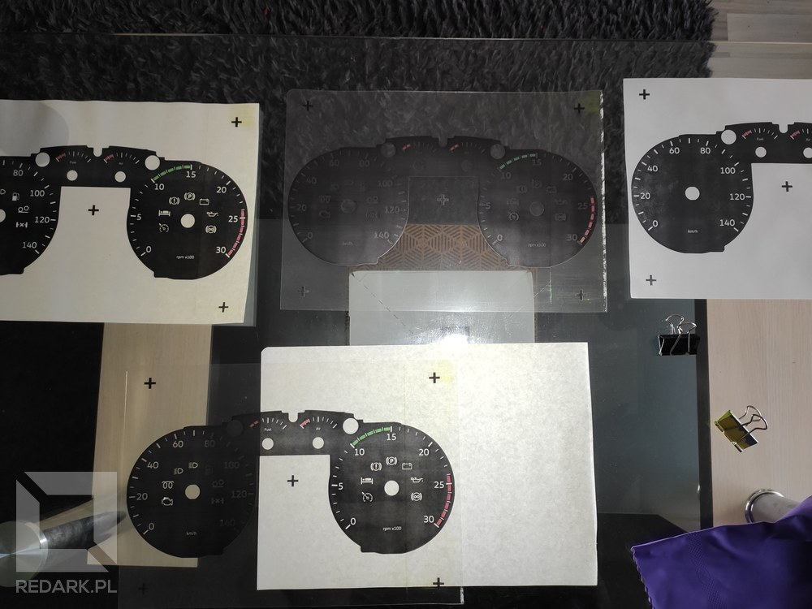

<InfoBlock>
This article has English version. Use the button below to see it.
</InfoBlock>

<ActionButton to='/diy-arduino-dashboard-ets-ats-eng'>Go to English version</ActionButton>

Na co dzień zajmuję się programowaniem. Bardzo często w życiu programisty pojawia się potrzeba zbudowania i zaprogramowania czegoś fizycznego. Czegoś, co nie istnieje wyłącznie na ekranie komputera, tylko czegoś, czym można się pochwalić, wskazując palcem na półkę w mieszkaniu. Kilka lat temu miałem właśnie taką potrzebę i zbudowałem mini drukarkę, przy użyciu posiadanych wówczas klocków Lego Mindstorms. Nie było to jednak coś dla mnie. Mindstorms choć fajny, to stawia jednak pewne ograniczenia - technologiczne oraz cenowe, tak jak przystało na tego popularnego producenta klocków.

Jakiś czas temu ta potrzeba powróciła. W tamtej chwili dość dużo jeździłem relaksacyjnie po Europie w grze Euro Truck Simulator 2. Z czasem YouTube zaczął mi podrzucać ogromne ilości przeróżnych filmików z projektami DIY do tej gry. Od prostych podzespołów pokroju "button box'ów", aż po całe kokpity odwzorowujące wiernie wnętrza ciężarówek. Postanowiłem spróbować wykonać sobie gadżet do tej gry i tym samym przetestować swoje umiejętności do babrania się w elektronice. Projekt był robiony po godzinach i miał wiele kilkutygodniowych przerw, więc od pomysłu do jego realizacji minęło ponad 1,5 roku. Dziś mam nareszcie przyjemność pokazać Wam rezultat tego przedsięwzięcia. Jest to mój pierwszy projekt tego typu, więc nie wszystko jest w nim zrobione idealnie, ale mimo to udało mi się go dowieźć do końca.

Chcąc zaprezentować projekt trochę bardziej dynamicznie, postanowiłem przygotować krótki filmik pokazujący z grubsza wszystkie jego funkcje. Montaż wideo może nie zachwyca, ale jak na weekendowy przyspieszony kurs obsługi DaVinci Resolve, to sądzę, że jest w miarę okej 😅. Bez przedłużania, zapraszam na pokaz, a później do artykułu opisującego proces realizacji projektu:

<YouTube id="KW6sZINNi9Y" title="DIY Arduino Dashboard" />

## Prezentacja projektu

<Gallery>

</Gallery>

Projekt z zewnątrz. Zegary zostały zamknięte w drewnianej prostopadłościennej obudowie, która została wycięta laserowo na zamówienie. Z lewej strony znajduje się port USB typu B służący do komunikacji umieszczonego wewnątrz Arduino z komputerem. Z tyłu widoczny jest potencjometr do regulacji natężenia podświetlenia zegarów, a także gniazdo DC, którym można dostarczyć zasilanie 12V. Jest ono wykorzystywane tylko do podświetlania zegarów, więc urządzenie może pracować i bez niego. Z frontu widoczne są cztery analogowe zegary: duży prędkościomierz i obrotomierz, a także małe wskazówki poziomu paliwa oraz ciśnienia w układzie hamulcowym. Na środku, pomiędzy dużymi zegarami, znajduje się mały wyświetlacz LCD o przekątnej 2,4 cala. Całość może stać płasko na biurku lub zostać postawiona na specjalnej podstawce, która ustawia zegary pod kątem, aby ułatwić korzystanie z nich przy komputerze.

<AdSense/>

### Kontrolki ostrzegawcze

W zegarach samochodowych nie mogło zabraknąć rzecz jasna wielokolorowych kontrolek. W innych projektach tego typu, które widziałem na YT, kontrolki miały często formę kilku surowych diod LED wbitych w kawałek tektury lub deski - mnie takie coś nie satysfakcjonowało, więc postanowiłem pójść o krok dalej. Urządzenie posiada łącznie 16 kontrolek - 7 ukrytych w tarczy lewego zegara, 7 ukrytych w prawym zegarze oraz dwa kierunkowskazy znajdujące się u góry frontu obudowy.

<ImageDescription>Kontrolki i podświetlenie zegarów w pełnej okazałości</ImageDescription>

Idąc od lewej do prawej mamy tutaj kontrolki o następującym znaczeniu:

- **Awaria silnika** (żółta) - zapala się, gdy poziom uszkodzeń ciężarówki będzie zbyt wysoki,
- **Grzanie świec** (żółta) - zapala się po włączeniu zapłonu,
- **Światła krótkie** (zielona) - informuje o włączeniu świateł mijania,
- **Światła długie** (niebieska) - informuje o włączeniu świateł drogowych,
- **Dystrybutor** (żółta) - zapala się, gdy poziom paliwa jest zbyt niski,
- **Podniesiona oś** (żółta) - uruchamia się, gdy jedna z osi w ciężarówce lub naczepie jest podniesiona do góry,
- **Blokada dyferencjału** (żółta) - informuje o zablokowaniu mechanizmu różnicowego w ciężarówce,
- **Tempomat** (zielona) - zapala się po włączeniu tempomatu,
- **Spanie** (czerwona) - informuje o konieczności zatrzymania się na nocleg,
- **Awaria hamulców** (czerwona) - mruga, gdy ciśnienie w układzie hamulcowym jest zbyt niskie,
- **Parking** (czerwona) - informuje o włączonym hamulcu parkingowym,
- **Akumulator** (czerwona) - zapala się po uruchomieniu zapłonu,
- **Olej** (czerwona) - zapala się po uruchomieniu zapłonu,
- **Retarder** (zielona) - informuje o hamowaniu przy użyciu retardera.

### Komputer pokładowy

Bardzo dumny jestem z komputera pokładowego wyświetlanego na ekranie LCD zegarów. Kontrolowany jest on za pomocą trzech wybranych przez użytkownika przycisków na klawiaturze lub innym kontrolerze podłączonym do komputera. Posiada 7 różnych ekranów prezentujących rozmaite dane o stanie ciężarówki, naczepy oraz o aktualnie przyjętym zleceniu. Jeden z nich może zostać spersonalizowany przez użytkownika i to nawet z poziomu menu zegarów, które wywołuje się naciśnięciem przycisku OK. W menu oprócz personalizacji ekranu parametrów znajduje się również zmiana logotypu pokazywanego podczas uruchamiania silnika oraz wiele innych ustawień dotyczących np. działania zegara lub odtwarzania dźwięków ostrzegawczych. Znajduje się tam nawet narzędzie do pomiaru przyspieszenia ciężarówki. Pozwala ono wybrać docelową prędkość ciężarówki, a następnie automatycznie wykonuje pomiar czasu, który upłynął między ruszeniem z miejsca a osiągnięciem zadanej prędkości.

Oprócz wymienionych przed chwilą parametrów, na ekranie komputera podczas jazdy cały czas widoczne jest kilka podstawowych informacji. U góry wyświetlana jest godzina (z gry lub rzeczywista - w zależności od wybranych ustawień), prędkość tempomatu oraz numer wbitego biegu wraz z asystentem ekologicznej zmiany przełożeń (strzałki góra/dół). U dołu widoczny jest przebieg pojazdu, aktualnie wybrany stopień retardera oraz limit prędkości obowiązujący na danym odcinku trasy. Oprócz tego komputer jest w stanie wyświetlać krótkie powiadomienia tekstowe u dołu ekranu informujące o podłączeniu naczepy, otrzymaniu mandatu, zapłacie za przejazd przez autostradę itp. Poszczególne ekrany możecie zobaczyć w zestawieniu umieszczonym poniżej:

<ImageDescription>Poszczególne ekrany komputera pokładowego</ImageDescription>

### Przykładowa trasa

Zanim przejdę do omawiania budowy i zasady działania zegarów, podrzucam jeszcze kompilację fragmentów z przykładowej jazdy w grze Euro Truck Simulator 2, jaką wykonałem z zegarami:

<YouTube id="NMoZSP29ytk" title="DIY Arduino Dashboard Euro Truck Simulator 2" />

## Zasada działania

Omówię teraz pokrótce, na jakiej zasadzie działa to urządzenie oraz jak odczytuje dane z gry.

### Telemetria gier SCS Software

Wszystko zaczyna się od biblioteki do obsługi telemetrii dostarczonej przez SCS Software. Umożliwia ona dostęp do danych gry i odczyt parametrów ciężarówki, naczepy, trasy, zlecenia i wielu innych rzeczy. Ma ona postać pojedynczego pliku DLL, który należy umieścić w odpowiednim katalogu gry. Po skopiowaniu pliku do określonego miejsca i uruchomieniu gry będziemy od teraz widzieli komunikat ostrzegawczy informujący o korzystaniu z narzędzi deweloperskich. Nie da się tego ominąć i musi ono być każdorazowo zaakceptowane, aby zewnętrzne aplikacje na komputerze miały dostęp do naszej gry.

### Interpreter telemetrii

Biblioteka telemetryczna dostarcza jednak tylko surowe dane, które nie są za bardzo przydatne zegarom. Potrzebny jest program, który odbierze te dane, przetworzy je w odpowiedni sposób i wyśle gotowe komendy przez kabel USB do Arduino. Tym programem jest napisana przeze mnie aplikacja w języku C#, której wygląd możecie zobaczyć poniżej:

<ImageDescription>Interpreter telemetri został napisany w C#</ImageDescription>

Znajduje się tutaj kompletny zestaw przycisków umożliwiających pełną kontrolę wszystkich funkcji zawartych w projekcie. W górnym lewym rogu znajdują się przyciski odpowiedzialne za obsługę kontrolek LED oraz podświetlenia tarcz i wskazówek. Poniżej nich znajduje się sekcja "Program" umożliwiająca włączenie jednego z czterech trybów pracy:

- **Home** - powrót urządzenia do stanu startowego (domowego),
- **Manual** - umożliwia ręczne sterowanie zegarami z poziomu aplikacji,
- **Test** - przeprowadza w pętli procedurę testową wszystkich elementów składowych zegarów (mogliście ją zobaczyć na filmiku prezentacyjnym),
- **Telemetry** - przełącza na sterowanie przy pomocy telemetrii gry ETS lub ATS.

<AdSense/>

Następnie w sekcji "Screen and Sound" znajdują się przyciski kontrolujące wyświetlacz LCD oraz dźwięki ostrzeżeń odtwarzane przy pomocy głośników lub słuchawek podłączonych do komputera. Prawa kolumna interfejsu aplikacji prezentuje cztery poziome suwaki odpowiedzialne za kontrolę pozycji czterech wskazówek zegarów. Towarzyszą im również przyciski MIN, MAX, a także HOME RESET, który umożliwia naprawienie błędnej pozycji wyjściowej wskazówek. Sekcja "Options" zawiera zestaw siedmiu przycisków reprezentujących ustawienia pracy zegarów. Część z nich można zmienić z poziomu menu samego urządzenia, a część tylko tutaj. Podświetlenie przycisku świadczy o aktywacji funkcji, którą reprezentuje. Znaczenie wszystkich funkcji podaję poniżej:

- **Keyboard** - reakcja na zdefiniowane skróty klawiszowe,
- **Sound** - wł./wył. ostrzeżeń dźwiękowych,
- **Speed Limit Warn** - ostrzeżenia o przekroczeniu dozwolonej w danym miejscu prędkości,
- **Clock 24h** - przełączenie między zegarem 12 a 24-godzinnym,
- **Real Time Clock** - umożliwia wyświetlanie na ekranie zegara czasu realnego (wg komputera) lub wirtualnego czasu pochodzącego z gry,
- **Eco Shift** - wł./wył. asystenta ekologicznej zmiany biegów,
- **Diff Lock** - stan aktywacji blokady dyferencjału w ciężarówce (opowiem o nim jeszcze później).

Sekcja "Customization" zawiera pięć opcji personalizacyjnych. "Init Image" umożliwia wybór jednego z ośmiu logotypów pojawiających się na ekranie komputera pokładowego podczas uruchamiania ciężarówki, natomiast pozostałe odpowiedzialne są za wybór zawartości czterech pól personalizowanego ekranu komputera pokładowego nazywanego "asystentem". Użytkownik może wybierać z listy 14 różnych parametrów zbieranych przez telemetrię gry. Modyfikacja wszystkich opcji jest możliwa z poziomu aplikacji, jak i menu zegarów.

Na koniec pozostały jeszcze dwie małe poziome sekcje u dołu okna aplikacji. Sekcja "Connection" pozwala wybrać wirtualny port COM, który reprezentuje Arduino podłączone do komputera. Jeśli w systemie jest dostępny tylko jeden taki port, aplikacja spróbuje nawiązać połączenie automatycznie. Drugą sekcją jest "Keyboard shortcuts", która umożliwia zdefiniowanie czterech skrótów klawiszowych służących do sterowania zegarami. Pozycja Left, Ok i Right jest raczej już znana - służą one do nawigacji po menu komputera pokładowego. Tajemnicza jest za to opcja "Diff Lock", którą należy przypisać pod przycisk, pod którym mamy ustawioną blokadę dyferencjału w grze. Dlaczego? Już tłumaczę.

Telemetria gier ETS i ATS nie jest zrobiona perfekcyjnie i posiada pewne braki, które uniemożliwiają dostęp do wielu parametrów ciężarówki. Jednym z tych braków jest właśnie niemożność odczytania stanu blokady dyferencjału w ciężarówce. Bardzo chciałem mieć ową kontrolkę w swoich zegarach, więc musiałem dopuścić się tutaj pewnego oszustwa. Każdorazowe wciśnięcie na klawiaturze przycisku odpowiedzialnego za zablokowanie lub odblokowanie dyferencjału powoduje przełączenie opcji "Diff Lock", a tym samym zapalenie lub zgaszenie kontrolki ostrzegawczej. Nie jest to rozwiązanie idealne, ponieważ stan kontrolki może się "rozsynchronizować" z grą i ciężarówką, ale inaczej się tego zrobić nie dało. Mimo to, daje to zadowalający efekt.

### Komunikacja przez USB

Zadaniem omawianego przed chwilą interpretera jest odbieranie i analizowanie telemetrii wysyłanej przez grę, a także generowanie gotowych danych dla zegarów. Gdy są już gotowe, wysyłane są przy pomocy kabla USB do urządzenia w postaci prostych komend. Przeniesienie logiki działania zegarów do komputera było wymagane przez bardzo ograniczoną moc obliczeniową Arduino oraz trudności w debugowaniu jego kodu. Środowisko programistyczne Arduino jest bardzo archaiczne i pisanie w nim bardziej skomplikowanego kodu, to proszenie się o przedwczesną siwiznę. Listę stałych reprezentujących komendy wysyłane przez interpreter do zegarów pokazuję poniżej. Postanowiłem nie tłumaczyć tutaj dokładnie ich znaczenia, aby nie przedłużać za bardzo tego tekstu oraz nie zanudzić Was na śmierć moim ględzeniem o tematach programistycznych. Mówiąc w skrócie, program wysyła komendy do Arduino, a ten ustawia wskazówki, kontrolki oraz ekran według informacji, jakie otrzymał. Wszystko zrobione tak, aby jak najbardziej odciążyć procesor Arduino.

## Proces tworzenia

Zanim przeszedłem do fazy wykonywania tych zegarów przez kilka miesięcy opracowywałem koncept tego urządzenia. W głowie rodziły się przeróżne pomysły, a każdy coraz ambitniejszy od poprzedniego. Na początku miały to być proste zegary na serwomechanizmach ze zwykłymi kontrolkami LED 5 mm i wyświetlaczem segmentowym. Później pojawił się pomysł wykorzystania istniejących już zegarów i podłączenie się do ich styków - pomysł prosty, łatwy, ale zegary niewyskalowane pod ciężarówkę oraz niepasujące kontrolki kompletnie mi nie odpowiadały. Następnym pomysłem było wykorzystanie zegarów samochodowych jako bazy i dostosowanie ich pod swoje potrzeby. To był dobry trop, choć początkowo miałem zapędy, aby spróbować odwzorować kokpit Scanii S przy pomocy okrągłych ekranów OLED, ale cena i dostępność potrzebnych części szybko odwiodła mnie od tego zamiaru. Ostatecznie postanowiłem znaleźć kompromis między wyglądem, a skomplikowaniem budowy. Wszak był to mój pierwszy projekt, więc też musiałem się liczyć z tym, że wiele rzeczy pójdzie nie po mojej myśli.

<InfoBlock>Dokładne schematy instalacji zostaną udostępnione na końcu tego artykułu.</InfoBlock>

### Dawca zegarów

Gdy już wiedziałem, czego mniej więcej oczekuję, zacząłem przeglądać oferty liczników samochodowych, aby znaleźć model, który będzie posiadał atrakcyjny dla mnie wygląd oraz odpowiednią budowę wewnętrzną (aby przejść później szereg modyfikacji). Zegary miały docelowo zostać pozbawione wszelkiej oryginalnej elektroniki sterującej, tak abym mógł mieć pełną kontrolę nad kontrolkami oraz wskazówkami. Po paru dniach poszukiwań znalazłem w końcu idealnego dawcę. Był nim **Volkswagen Golf 4. generacji**. Jego zegary bardzo mi się spodobały. Układ tarcz był idealny i posiadał wystarczająco miejsca na zainstalowanie wyświetlacza LCD. W sieci znalazłem również mnóstwo filmików z ich rozbiórką, które pozwoliły mi poznać budowę zestawu jeszcze przed jego zakupem. Wszystkie potrzebne wymiary otrzymałem z filmików dzięki obliczaniu proporcji z długości podzespołów na ekranie. Udało się zaprojektować ich wygląd co do milimetra. Gdy upewniłem się co do projektu urządzenia, zamówiłem zegary na Allegro. Zdobyłem je w śmiesznie niskiej cenie (40 złotych), ponieważ zostały one uszkodzone podczas demontażu. Pęknięciu uległ plastikowy klosz liczników, ale to kompletnie mi nie przeszkadzało.

<Gallery width='2'>

</Gallery>

<ImageDescription>Bazą projektu były liczniki Volkswagena Golfa 4. generacji</ImageDescription>

Z zegarów pozyskałem tarcze, wskazówki, silniczki krokowe oraz diody SMD LED kontrolek, które pogrupowałem według koloru świecenia. Oprócz tego "pożyczyłem" również plastikowy rozbłyśnik, który przeszedł szereg modyfikacji przy użyciu wiertarki oraz pilników. Przede wszystkim musiałem usunąć zbędny plastik znajdujący się pomiędzy dużymi zegarami. W tym miejscu docelowo miał się znaleźć wyświetlacz LCD komputera pokładowego. Druga modyfikacja polegała na wydrążeniu korytka pod przewody oświetleniowe, które w mojej wersji musiały iść po powierzchni "płytki drukowanej". A skoro już o niej wspominam...

<AdSense/>

### Zastępstwo dla płytki drukowanej

Tak jak mówiłem już wcześniej, chciałem pozbyć się wszelkiej elektroniki, która uniemożliwiałaby mi pełną kontrolę nad podzespołami zegarów. Z racji tego, że mój poziom wiedzy o elektronice był i z pewnością nadal jest znikomy, postanowiłem, że nie będę oglądał się na oryginalną płytkę drukowaną liczników i spróbuję zastąpić ją czymś własnym. Wybór padł na tekturę modelarską i była to chyba najgłupsza decyzja, jaką podjąłem w tym projekcie. Teraz już wiem, że powinienem zmusić się i pójść w kierunku dedykowanych płytek PCB. Znaleźć kogokolwiek, kto pomógłby mi ją zaprojektować oraz zamówić. Zostałem jednak przy pomyśle tektury i zbudowałem na jej powierzchni całe potrzebne okablowanie. Kosztowało mnie to wiele cierpliwości (oraz pourywanych kabli i diod), ale jak widzicie, mimo to, udało mi się dowieźć projekt do końca. Plastikowy reflektor ułożony jest na tekturze, do której przyklejone są wszystkie kontrolki oraz silniczki krokowe zamontowane za pomocą uchwytów z tektury i spinaczy biurowych. Każdy kabel sygnałowy został wyprowadzony do tyłu i połączony w miarę możliwości w odpowiednie wiązki. Zrobiło się z tego niezłe spaghetti, ale uwierzcie mi, ja się w nim doskonale orientuję 😄.

<Gallery width='2'>

</Gallery>

Jeśli chodzi o układ przewodów, to kontrolki LED otrzymały przylutowane pod kątem prostym przewody, które wychodziły na tył urządzenia. Kable masowe zostały połączone ze sobą, natomiast plusowe zostały zakończone żeńską wtyczką, która miała zostać później wpięta do kontrolera LED, o którym powiem za niedługo. Podświetlenie wskazówek oraz tarcz zostało poprowadzone po frontowej powierzchni tektury. Białe diody zostały pozyskane ze zwykłej taśmy LED kupionej w sklepie, ponieważ oryginalne zegary Volkswagena posiadały podświetlenie w kolorze niebieskim, które niezbyt mi się podobało. Następnie połączyłem diody w łańcuszki. Czerwone były łączone po dwie sztuki na ścieżkę (łącznie 6), natomiast białe po 3 sztuki na ścieżkę (łącznie 15). Plus znajdował się u góry dużych zegarów i rozchodził się na obie strony do dołu. Dopasowanie wymiarów wszystkich kabli oraz przyklejenie diod do tektury nie było łatwe. Wszystkie elementy musiały być tak spasowane, aby nie przeszkadzały później w założeniu plastikowego rozbłyśnika. Wymagało to wielu poprawek i manewrowania gorącą lutownicą przy teksturze, ale udało się.

### Kontroler diod LED

Aby móc łatwo wyjmować tekturę i reflektor z urządzenia potrzebowałem ograniczyć ilość przewodów, jaka wychodziła do pozostałych podzespołów zegarów. Prowadzenie wszystkich szesnastu przewodów kontrolek bezpośrednio do Arduino nie dość, że byłoby męczące, to jeszcze znacząco uszczupliłoby pulę dostępnych wyprowadzeń mikrokontrolera. Wszystkie problemy rozwiązało wykorzystanie układu scalonego MCP23017. Jest to 16-kanałowy ekspander wyprowadzeń, który łączy się z Arduino za pomocą magistrali I2C. Umieściłem go na "plecach" tektury, co spowodowało, że zamiast ciągnąć do Arduino prawie 20 kabli sygnałowych, wystarczyły tylko cztery - dwa sygnałowe SDA i SCL (magistrala I2C) oraz plus i minus do zasilania.

<Gallery width='2'>

</Gallery>

<ImageDescription>Kontroler sterowania kontrolkami LED</ImageDescription>

Ekspander został umieszczony na dwustronnej płytce uniwersalnej, która została przytwierdzona do tektury za pomocą uchwytów zrobionych ze spinaczy biurowych. Oprócz układu scalonego na płytce znalazły się również potrzebne do podłączenia diod męskie gniazda goldpin, a także zestaw rezystorów dobranych odpowiednio do koloru każdej kontrolki. Przy konstruowaniu układu jedynym problemem okazało się ograniczenie prądowe układu MCP23017. Według noty katalogowej ekspander może wytrzymać jedynie pobór prądu w wysokości 150 mA. Zmuszony byłem więc stopniować moc dostarczaną na każdą diodę w zależności od jej koloru:

- 5x czerwona dioda po 6 mA (rezystory: 470+47, razem 517 Ohm),
- 5x żółta dioda po 9 mA (rezystory: 220+100, razem 320 Ohm),
- 5x zielona dioda po 12 mA (rezystory: 100+47, razem 147 Ohm),
- 1x niebieska dioda po 16 mA (rezystory: 47+47, razem 94 Ohm).

Taki dobór rezystorów pozwolił mi uzyskać przyzwoitą moc świecenia wszystkich diod przy zmieszczeniu się w zalecanym poborze prądu.

<AdSense/>

### Kontroler podświetlenia

Oprócz kontrolera diod LED w obudowie zegarów znajduje się jeszcze druga płytka uniwersalna, która z kolei zajmuje się obsługą podświetlenia tarcz, wskazówek oraz wyświetlacza LCD. Jest ona odrobinę bardziej skomplikowana w budowie od swojej poprzedniczki.

<Gallery width='2'>

</Gallery>

<ImageDescription>Kontroler podświetlenia oraz pierwsze testy</ImageDescription>

Przy lewej krawędzi płytki znajdują się gniazda goldpin w kolorze czarnym oraz czerwonym. Służą one jako rozdzielacz dla przewodów masowych oraz zasilania +12V. Do tych listw podłączone jest gniazdo DC znajdujące się z tyłu obudowy. U góry płytki znajduje się rząd czterech tranzystorów N-MOSFET. Służą one do sterowania czterema strefami podświetlenia zegarów. Pierwszy odpowiada za podświetlenie dużych tarcz, drugi za małe tarcze, trzeci za duże wskazówki, a czwarty za małe wskazówki. Pod tranzystorami znajduje się szereg rezystorów dopasowanych odpowiednio do poszczególnych łańcuchów LED. Na płytce znajduje się również piąty tranzystor mocy, ale o działaniu odwrotnym. Jest to tranzystor P-MOSFET i służy on do włączania i wyłączania podświetlenia wyświetlacza LCD. Mała czerwona listwa podłączona do jednego z jego wyprowadzeń służy do rozdzielenia napięcia 3.3V pochodzącego z Arduino, które posiada tylko jedno wyprowadzenie tego typu.

Na niektórych zdjęciach możecie zauważyć cienką pastylkę połączoną z płytką kontrolera za pomocą dwóch przewodów. Był to tzw. "buzzer" odpowiedzialny za odtwarzanie prostych komunikatów dźwiękowych, lecz w ostatecznej wersji urządzenia zlikwidowałem go, ponieważ zdecydowałem się na odtwarzanie dźwięków za pomocą interpretera telemetrii.

### Silniczki krokowe

Za obracanie wskazówek zegarów odpowiedzialne są cztery silniczki krokowe x27.168 wymontowane z licznika Volkswagena. Są one przymocowane do głównej tektury za pomocą uchwytów wykonanych z tektury i odpowiednio wyprofilowanego drutu spinacza biurowego. Zapewnia to dobry docisk oraz możliwość demontażu podzespołu w razie awarii. Do wysterowania pojedynczego silnika potrzeba 4 przewodów - po 2 na obie cewki sterujące. Ich wyprowadzenia znajdują się z przodu zegarów, więc przewody musiały zostać do nich doprowadzone przez prostokątne otwory w tekturze. Następnie kable są związywane ze sobą zaraz za silniczkiem przy użyciu taśmy izolacyjnej i idą bezpośrednio do Arduino. Przewody najdalszego licznika (duży obrotomierz) zostały dodatkowo przedłużone, aby nie musiały być silnie napięte. Silniczki mają przypisane litery od A do D, idąc od lewej strony i patrząc od frontu. Wyprowadzenia zostały oznaczone cyframi. Patrząc od strony osi, po lewej stronie znajdują się przewody 2 i 1, a po prawej 3 i 4. Dokładne podłączenie silniczków będziecie mogli zobaczyć na schematach elektrycznych, które pokaże pod koniec tego artykułu.

### Wyświetlacz LCD

Ważnym elementem całego projektu był oczywiście wyświetlacz LCD. Posiada on przekątną 2,4" i rozdzielczość 240 na 320 pikseli. Jego podłączenie i optymalne wysterowanie nie było łatwe. Jednym z problemów, jaki musiałem rozwiązać, była konwersja poziomów logicznych. Kontroler ILI9341, który odpowiedzialny jest za obsługę tego ekranu, pracuje na logice i zasilaniu 3,3V, natomiast Arduino na logice 5V. Aby nie uszkodzić układu, zastosowałem tutaj gotowy 4-kanałowy konwerter stanów logicznych, który został wpięty pomiędzy Arduino a wyświetlacz. Uformowaną wiązkę przewodów wraz z miniaturowym konwerterem możecie zobaczyć poniżej tego akapitu. Wszystko zostało spięte tak, aby każdy przewód wychodził dokładnie w tym miejscu, w którym jest potrzebny. Wiązka łączyła ze sobą sekcję zasilania Arduino, wyprowadzenia interfejsu SPI, wyjścia wyświetlacza, konwerter stanów logicznych oraz mosfet odpowiedzialny za włączanie podświetlenia LCD. Każdy kabel posiadał również etykiety na swoich końcach do łatwiejszej identyfikacji.

<ImageDescription>Wiązka kabli odpowiedzialna za obsługę wyświetlacza LCD</ImageDescription>

Jeśli chodzi o sam wyświetlacz, to zastosowałem podobne mocowanie przy użyciu spinacza biurowego, co przy pozostałych podzespołach. Tym razem drut nie mógł przechodzić na drugą stronę, więc został uformowany tak, żeby przechodził przez dwa rowki drewienka trzymającego krawędzie wyświetlacza. Mocowanie to okazało się bardzo skuteczne i rewelacyjnie utrzymuje ekran na swoim miejscu. Dodatkowo jest niezależne od reflektora i płytki, więc nie utrudnia ich wyjmowania.

<Gallery>

</Gallery>

Sterowanie wyświetlaczem było bardzo trudne, ponieważ jego odświeżanie znacząco pochłaniało moc obliczeniową Arduino. Zmusiło mnie to do opracowania bardzo optymalnego kodu obsługującego aktualizowanie informacji na jego powierzchni. Obraz musiał być odświeżany fragmentami i tylko wtedy, kiedy było to naprawdę konieczne. Nie będę opisywał tutaj wszystkich sztuczek, jakie zastosowałem, ponieważ trochę ich tam było. Działanie zegarów nie jest idealne i nadal widać momenty przywieszania się Arduino, ale uważam, że zrobiłem wszystko, co było możliwe, aby temu zapobiec.

### Obudowa

Teraz parę słów o obudowie, w której znajdują się te wszystkie podzespoły. Jest to cięta laserowo na zamówienie sklejka o grubości 3 milimetrów. Wszystkie wymiary elementów obliczyłem sam, wzorując się na oryginalnej obudowie liczników. Odrysowałem kontur ich otworów na kartce, następnie zeskanowałem, obrobiłem w Gimpie, a na końcu przeniosłem do oprogramowania CAD. Tak oto metodą prób i błędów sporządziłem ostateczny projekt obudowy i podstawki, których wycięcie zleciłem później przez Internet. Kilka zdjęć z procesu projektowania możecie zobaczyć poniżej:

<Gallery width='2'>

</Gallery>

<ImageDescription>Projektowanie i składanie obudowy zegarów</ImageDescription>

Żałuję trochę, że nie wziąłem odrobinę grubszej sklejki. Ta tutaj uległa niestety lekkiej deformacji, przez co w jednym miejscu widać nierówność, a klapa obudowy nie zamyka się całkowicie. Mimo to cieszę się, że udało się wykonać taką obudowę. Jest ona elegancka i skrojona na miarę. Jedyne modyfikacje, jakie sam w niej wykonałem to wywiercenie otworów pod kołki dystansowe Arduino, port USB, gniazdo zasilania 12V oraz potencjometr do regulacji podświetlenia. Na koniec doklejone zostały jeszcze małe elementy służące do utrzymywania zegarów na swoim miejscu. Były to ograniczniki zrobione ze sklejonych drewnianych patyczków na dole obudowy oraz uchwyty w kształcie litery L znajdujące się na bocznych ściankach. Ich zadaniem jest dociskanie belki rozporowej odpowiedzialnej za dociskanie zegarów do frontu obudowy. Te drewienka z kolei zostały uzyskane z resztek sklejki, z której była wycinana obudowa.

<Gallery>

</Gallery>

<ImageDescription>Mocowanie reflektora i płytki w obudowie</ImageDescription>

<AdSense/>

### Tarcze zegarów

Elementem równie ważnym, co sama obudowa, były rzecz jasna tarcze zegarów. Powodem, dla którego nie zdecydowałem się skorzystać z gotowych liczników samochodowych, były właśnie tarcze. Ich skala jest zupełnie inna niż w ciężarówkach, co bardzo psuje imersję podczas gry. W tym projekcie miały pojawić się dedykowane, przygotowane przeze mnie skale liczników. Potrzebowałem do tego dwóch rzeczy. Oryginalnych tarcz od tego licznika oraz programu, który pozwoliłby mi wygenerować nowe grafiki. Z pierwszym elementem nie było problemu. Zeskanowałem oryginalne tarcze skanerem, oświetlając je dodatkowo latarką, aby uwydatnić półprzeźroczyste kontrolki ostrzegawcze. Wygenerowanie nowych tarcz było znacznie większym problemem, ponieważ nie znalazłem w Internecie za bardzo programu umożliwiającego tworzenie takich tarcz. Co mogłem zrobić? To, co każdy programista - jeśli program, którego potrzebujesz, nie istnieje, to go sobie stwórz. Tak też zrobiłem i stworzyłem [program "Gauge Generator"](https://github.com/adan2013/Gauge-Generator), który od jakiegoś czasu widnieje na moim profilu GitHub. Pozwala on wygenerować dowolnie wyglądające tarcze zegarów. Aplikacja nie jest jakoś super dopracowana, ale spełnia swoje zadanie i pozwoliła mi stworzyć grafiki, które widzicie teraz w ostatecznej wersji urządzenia.

<Gallery>

</Gallery>

<ImageDescription>Przygotowywanie dedykowanych tarcz zegarów odbywało się w Gimpie oraz autorskim programie Gauge Generator</ImageDescription>

Drugim etapem szykowania tarcz było oczywiście ich wydrukowanie i sklejenie. Z racji tego, że miały one przepuszczać i blokować światło w odpowiedni sposób, nie mogły zostać wykonane na zwykłej kartce białego papieru. Rozpocząłem więc testy. Pierwsze wersje były wydrukowane w negatywie, aby oszczędzić toner. Posłużyły mi do zweryfikowania rozmiaru tarcz oraz stylu kontrolek. Gdy umiejscowienie elementów było już dobre, rozpocząłem testy na czarnych wersjach. Sprawdzałem przepuszczalność światła na trzech różnych materiałach: białej, standardowej kartce, przeźroczystej folii do drukarek laserowych oraz kalce technicznej. Na poniższych zdjęciach możecie zobaczyć pierwszą poważną wersję tarcz. Jak widzicie, światło przebijało się przez czarne obszary, a prawa strona ewidentnie rozjechała się między warstwami. Kontrolki były bardzo słabo widoczne w słońcu i również przebijały wyraźnie czarne tło zegarów. Wszystkie zebrane dane posłużyły mi do stworzenia kolejnego prototypu, który okazał się już wersją ostateczną, choć zastąpioną później drugim egzemplarzem z powodu pęcherzy powietrza, jakie pojawiły się na powierzchni kalki po kilkunastu dniach od wykonania tarcz.

<Gallery>

</Gallery>

<ImageDescription>Pierwsza wersja tarcz posiadała widoczne prześwity oraz lekko niedopasowane tło</ImageDescription>

Ostateczna wersja tarcz składa się z czterech warstw. Trzech przeźroczystych folii z nadrukowanymi kontrolkami oraz wierzchniej kalki technicznej pozbawionej kontrolek, aby były one niewidoczne, gdy nie są podświetlone. Połączenie takiego zestawu materiałów stworzyło tarcze o przepuszczalności bardzo zbliżonej do oryginału. Zastosowanie krzyżyków pozycjonujących oraz klejenie warstw na szklanym stole podświetlanym silną latarką warsztatową pozwoliło bardzo precyzyjnie skleić wszystkie warstwy ze sobą. Do ich łączenia użyłem kleju w sprayu. Jego wadą było to, że zostawiał mokre kropelki na powierzchni warstw, które były widoczne po ich podświetleniu, ale za to bardzo dobrze łączył arkusze ze sobą. Aby uniknąć pęcherzy powietrza, po każdorazowym klejeniu przykrywałem zegary czystą kartą papieru, a następnie wyciskałem powietrze przy użyciu plastikowej ekierki. Brak kartki ochronnej powodował momentalne zdrapywanie się tonera z powierzchni folii oraz kalki. Na koniec całość tarcz została dociążona na noc, aby klej mógł porządnie związać.

<Gallery>

</Gallery>

<ImageDescription>Sklejanie tarcz zegarów odbywało się na szklanym podświetlanym stole</ImageDescription>

Przygotowanie tarcz było dużym wyzwaniem, ale uważam, że efekt końcowy był tego wart. Prezentują się fenomenalnie i są sto razy lepsze niż niewyskalowane tarcze pochodzące z samochodów osobowych. Nawet rozebranie na czynniki pierwsze mojej drukarki laserowej, która zaniemogła podczas ich przygotowywania, było tego warte 😂.

## Podsumowanie projektu

### Kosztorys

W przypadku projektów DIY wiele osób chce wiedzieć, jaki był ostateczny koszt przygotowania takiego urządzenia. Postanowiłem przygotować przybliżony kosztorys wszystkich części, jakich użyłem w projekcie. Parę pozycji ciężko było wycenić, ponieważ wykorzystałem np. tylko część ich zawartości. Do kwoty nie wliczałem również wszelkich narzędzi, które musiałem zakupić do wykonania tego projektu. Większość pozycji z tej listy została zakupiona w polskim sklepie z elektroniką [Botland](https://botland.com.pl/). Kosztorys prezentuję poniżej:

<ImageDescription>Kosztorys projektu DIY Arduino Dashboard</ImageDescription>

Jak widzicie, całkowity koszt wykonaniu projektu plasuje się między 300 a 350 złotych. Czy to dużo, czy to mało, oceńcie sami. Dla mnie nie jest to duża cena, zwłaszcza jeśli wziąć pod uwagę efekt końcowy, jaki udało się uzyskać. Wszelkie podobne projekty znalezione w Internecie nie umywają się do tych zegarów.

<AdSense/>

### Schematy elektryczne

Zgodnie z obietnicą, poniżej znajdziecie schematy elektryczne wszystkich połączeń między podzespołami, jakie znajdują się w obudowie zegarów. Gdyby któreś z połączeń było nie jasne, chętnie wytłumaczę ich znaczenie w sekcji komentarzy pod tym artykułem.

<ImageDescription>Kompletne schematy elektryczne urządzenia</ImageDescription>

### Moja opinia o projekcie

Po pierwsze cieszę się, że udało mi się dokończyć ten projekt. Tak jak mówiłem, to był pierwszy taki projekt w moim życiu i zaczynałem go z zerową wiedzą o elektronice, myląc napięcie prądu z jego natężeniem. Porywanie się na tak rozbudowany projekt bez doświadczenia było dość szalonym pomysłem, stąd jest parę rzeczy, które mogłem zrobić lepiej. Największym moim błędem było niezastosowanie dedykowanego PCB, którego obecność znacząco ułatwiłaby wykonanie projektu i odchudziła plątaninę kabli w obudowie. Pogodzenie sterowania wskazówek z zasobożernym wyświetlaczem też nie jest zrobione idealnie i zegary mają problem z przywieszaniem się. Jednak cieszę się, że udało mi się umieścić w tym projekcie komputer pokładowy. Jestem z niego naprawdę dumny i dobrze, że nie pozostałem przy pomyśle użycia zwykłego wyświetlacza segmentowego.

### Repozytorium GitHub

A teraz czas na open source. Cały kod interpretera telemetrii, kod Arduino, pliki z grafikami, projekty tarcz - wszystko, co stworzyłem w tym projekcie, jest dostępne w publicznym repozytorium na GitHubie. Chętni mogą prześledzić działanie zegarów w najmniejszym szczególe:

<ActionButton to='https://github.com/adan2013/DIY-Arduino-Dashboard'>Przejdź do GitHuba</ActionButton>

### Przyszłe projekty

To by było na tyle. Na pewno nie jest to koniec mojej przygody z elektroniką. W głowie mam już pomysły na kolejne projekty, a jeden z nich (nie do końca planowany) został już nawet przeze mnie sfinalizowany i również pojawi się wkrótce na tym portalu. Jeśli spodobał się Wam ten projekt, koniecznie dajcie znać o tym w sekcji komentarzy. Spędzał mi on sen z powiek przez wiele miesięcy i jest dla mnie bardzo ważny, więc cieszę się, że nareszcie mogłem go Wam pokazać.
