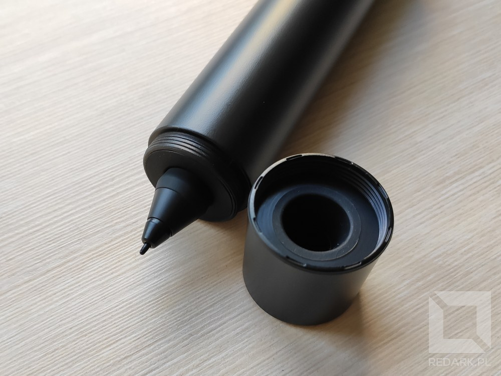

Czasami podczas pracy na komputerze zachodzi potrzeba szybkiego stworzenia rysunku, schematu lub odręcznej notatki. Niestety mysz komputerowa nie jest stworzona do takich operacji i powstałe w ten sposób zapiski wyglądają na pisane "jak kura pazurem". Alternatywą jest użycie kartki papieru i długopisu, a następnie skanowanie jej skanerem lub zrobienie zdjęcia telefonem, ale chyba nie musze mówić, że nie jest to ani wygodne, ani szybkie rozwiązanie.

Chcąc wykonywać takie rysunki łatwo i przyjemnie, musimy się wyposażyć w tzw. tablet graficzny, czyli płytkę po której możemy rysować specjalnym rysikiem. Tablet jest wykrywany w systemie jako ekran dotykowy, więc przenosi nasze malunki w czasie rzeczywistym na ekran komputera. Jednak tablet panelowy nie jest idealnym rozwiązaniem. Każdy, kto pracował na sprzęcie tego typu wie, że trzeba długo się do niego przyzwyczajać. Wszak na tablecie nie widzimy, gdzie dokładnie klikamy i rysujemy, a różnica w przekątnych urządzenia i ekranu komputera sprawia, że nasz mózg toczy non stop walkę ze zsynchronizowaniem ruchów ręki z tym, co widzi na ekranie. Czy mamy jakieś wyjście z tej sytuacji? Tak i jest nim tablet graficzny ze zintegrowanym ekranem, który miałem niedawno przyjemność testować. Zapraszam zatem na recenzję tabletu XP-Pen Artist 15,6 Pro.

<AdSense/>

## Zawartość zestawu

Tablet przychodzi do nas w białym eleganckim pudełku. Zaraz po jego otwarciu oczom ukazuje się czarny tablet zabezpieczony kilkoma foliami ochronnymi. Zostawię go jednak na później, ponieważ pod nim znajduje się jeszcze szereg akcesoriów. Niżej znajdziemy nieco mniejszym rozmiarów podstawkę umożliwiającą ułożenie tabletu pod kątem około 25 stopni od podłoża. Obok podstawki widoczny jest miniaturowy zasilacz USB oraz trzy końcówki do różnych rodzajów gniazdek sieciowych. Czwarty rodzaj wtyczki dostępny jest bezpośrednio w zasilaczu poprzez "postawienie do pionu" ruchomych styków zasilacza.

<Gallery width='2'>

</Gallery>

Pod podstawką znajduje się jeszcze czarna metalowa tuba skrywająca pióro oraz dwa białe pudełka. Pierwsze zawiera instrukcję, gwarancję oraz dwupalcową rękawiczkę sygnowaną logo XP-Pen. Drugie pudełko natomiast zawiera zestaw przewodów, które posłużą do połączenia tabletu do naszego komputera. Pod wszystkimi akcesoriami, na dnie opakowania znajdowała się również ściereczka do czyszczenia ekranu z zabrudzeń.

## Przegląd akcesoriów

### Kable sygnałowe i zasilanie

W zestawie otrzymujemy dwa kable. Jeden z nich to standardowy przedłużacz USB, natomiast drugi to specjalna "ośmiorniczka", która łączy tablet z zasilaczem oraz komputerem użytkownika. Wszystkie przewody zbiegają się przy wtyczce HDMI, którą podłączamy do laptopa bądź jednostki centralnej. Od niego odchodzą trzy kable zakończone różnymi wtyczkami USB. Przewód zakończony końcówką w kolorze czerwonym służy do doprowadzenia zasilania i można go podłączyć na dwa różne sposoby. Tablet może być zasilany poprzez dołączony do zestawu zasilacz lub bezpośrednio z portu USB komputera - co komu wygodnie. Drugi przewód jest zakończony identyczną wtyczką, jak u poprzednika, ale tym razem koloru czarnego. Służy ona do podłączenia "funkcji dotyku" do komputera. Ostatni przewód jest znacznie dłuższy od pozostałych i został zakończony wtyczką USB typu C. Ją podłączamy oczywiście do gniazda znajdującego się z boku tabletu graficznego. Cały proces podpinania urządzenia do komputera jest dobrze przemyślany i bajecznie prosty, a sam tablet zaczyna działać ze swoją podstawową funkcjonalnością bez instalacji dodatkowego oprogramowania. Dodatkowo, jeśli posiadasz hub na USB-C podobny do mojego, który widoczny jest na zdjęciach poniżej, to możesz podłączyć tablet z komputerem przy użyciu zaledwie jednego przewodu, co jeszcze bardziej ułatwi jego podłączanie i odłączanie.

<Gallery width='2'>

</Gallery>

### Pióro oraz etui

Przejdźmy teraz do chyba najważniejszego akcesorium w zestawie, czyli pióra, które umożliwia rysowanie po powierzchni tabletu. Znajduje się ono w czarnej metalowej tubie, która pełni rolę jego etui i powiem szczerze, że dawno nie widziałem tak dobrze zaprojektowanego akcesorium. Pióro wyjmujemy odkręcając szeroką końcówkę tuby, która po postawieniu na biurku pełni rolę "kałamarzu", do którego możemy odłożyć pionowo pióro w trakcie pracy. Na drugim końcu tuby również znajduje się odkręcana nakrętka, której usunięcie z kolei daje dostęp do zestawu ośmiu wymiennych końcówek rysika. Tak zaprojektowanie etui sprawia, że XP-Pen Artist Pro jest idealny dla osób chcących podróżować z tabletem. Nie dość, że pióro podczas transportu cały czas znajduje się w bezpiecznym ochraniaczu, to jeszcze pełni on rolę podstawki pod pióro w czasie pracy oraz schowka na wymienne rysiki. Po prostu rewelacja!

<AdSense/>

<Gallery>

</Gallery>

Co do samego pióra, to jest ono wykonane w połowie z plastiku i w połowie z gumy poprawiającej chwyt. Obie połówki połączone są małym czerwonym pierścieniem, które nadaje rysikowi elegancji. Do dyspozycji użytkownika oddano dwa wielofunkcyjne przyciski o zróżnicowanym rozmiarze. Urządzenie jest zasilane bezprzewodowo, więc nie musimy martwić się o jego okresowe ładowanie, czy wymienianie baterii "paluszków". Pióro rozpoznaje ponad 8 tysięcy różnych poziomów nacisku, a także wykrywa kąt pochylenie rysika do 60 stopni, co programy graficzne mogą wykorzystać np. do obsługi cieniowania rysunków.

## Tablet oraz podstawka

Czas omówić danie główne i zacznę niestety od dużego minusu, który od razu rzucił mi się w oczy. Podstawka dołączona do zestawu pozwala ustawić tablet tylko w jednej pozycji. Co prawda kąt pochylenia jest dobrany idealnie pod rysowanie na nim, ale osoby, takie jak ja, które chcą również używać tabletu także jako drugi mobilny monitor do laptopa, nie będą zadowolone. Problem ten oczywiście można rozwiązać dokupując uniwersalną podstawkę do telefonów/tabletów, ale szkoda, że ta dołączona do zestawu nie pozwala na żadną regulację. Po prostu trzeba mieć to na uwadze.

Jeśli chodzi o sam tablet, to jest on wyposażony w ekran FullHD o przekątnej 15,6 cala, co jest idealnym kompromisem pomiędzy komfortem pracy a mobilnością urządzenia, które ma w dodatku zaledwie 11 milimetrów grubości! Kąty widzenia są rewelacyjne, a kolory żywe. Według danych producenta ekran jest w stanie pokryć 120% przestrzeni sRGB, co będzie szczególnie ważne dla profesjonalnych grafików. Powierzchnia przykrywająca ekran jest matowa i lekko chropowata, a producent chwali ją za małą grubość, co przekłada się na to, że tablet nie jest obarczony negatywnym zjawiskiem paralaksy.

<Gallery>

</Gallery>

Do sterowania ekranem służą trzy przyciski znajdujące się na prawej krawędzi tabletu. Pozwalają one włączyć lub wyłączyć urządzenie, a także sterować jego jasnością. Tuż nad przyciskami znajduje się również gniazdo USB-C, do którego podłączamy kabel idący do komputera. Po lewej stronie wyświetlacza znajduje się aż 8 programowalnych przycisków, pod które możemy przypisać najróżniejsze skróty klawiszowe ułatwiające prace z programami graficznymi takimi jak Adobe Photoshop, Corel Draw, czy Gimp. Na ich powierzchni znajdują się drobne wypukle symbole, które ułatwiają namierzenie przycisków po ciemku. Oprócz przycisków znajduje się tam również wielofunkcyjne pokrętło (lub jak to woli rolka) zaznaczone eleganckim czerwonym pierścieniem. Obraca się ono skokowo wraz z wyczuwalnym i lekko słyszalnym klikaniem - podobnie, jak regulacja głośności w radiach samochodowych. Pozwala to na bardzo precyzyjne przewijanie lub powiększanie płótna na ekranie. Moim zdaniem jest to lepsze rozwiązanie niż linijkowy panel dotykowy, choć pewnie jest to jedynie kwestia przyzwyczajenia. Tak czy siak uważam, że jest to obowiązkowa funkcja, jaką musi posiadać dobry tablet graficzny. Ciągłe sięganie ręką po klawiaturę lub mysz komputera nie jest wygodne.

<Gallery>

</Gallery>

Jeśli chodzi o korzystanie z tabletu, to nie mam żadnych zastrzeżeń. Pióro bezbłędnie leży w dłoni i dobrze ślizga się po powierzchni ekranu. Moje dotychczasowe doświadczenie z tabletami graficznymi ograniczało się jedynie do 7-calowego Wacoma One S bez wyświetlacza, więc mój przeskok technologiczny jest tutaj ogromny. Przede wszystkim, to o czym mówiłem we wstępie, czyli w tabletach z wyświetlaczem nie trzeba się przyzwyczajać do patrzenia się w inne miejsce, niż to, w którym się rysuje. Dodatkowo nie występuje tutaj problem różnych rozmiarów powierzchni. W Wacomie drobny ruch ręką powodował znaczny ruch na ekranie i przyzwyczajenie się do tego nie było łatwe. W XP-Pen'ie tego problemu nie ma - stosunek rozmiaru powierzchni dotykowej do powierzchni ekranu jest 1:1. Rysunek pojawia się dokładnie tam, gdzie go rysujesz, więc precyzja ruchów jest ogromna! Nie wiem, czy jestem teraz w stanie wrócić do klasycznych tabletów bez wyświetlacza.

<AdSense/>

Oprogramowanie producenta pozwala na regulację czułości pióra, twardości, oraz obszaru ekranu, jaki ma obsługiwać nasz tablet. Przyciski oraz rolka mogą zostać skonfigurowane na bardzo wiele możliwości. Aplikacja umożliwia również przypisanie tych konfiguracji do konkretnych programów zainstalowanych na komputerze - podobnie jak to ma miejsce w przypadku gamingowych myszy lub klawiatur. Dzięki temu możemy posiadać różne skróty klawiszowe do różnych aplikacji. Dodatkowo podczas używania przycisków tabletu, u dołu jego ekranu pojawiają się małe powiadomienia informujące jaki skrót klawiszowy właśnie wywołaliśmy. Bardzo ułatwia to pracę, zwłaszcza na początku, jak nie pamiętamy jeszcze wszystkich ustawionych skrótów.

## Podsumowanie

Tablet graficzny XP-Pen Artist 15.6 Pro to rewelacyjny sprzęt, który urzekł mnie wysoką jakością wykonania oraz genialnie zaprojektowanym etui do transportu pióra. To sprzęt, który pokochają zarówno profesjonalni graficy, jak i osoby dopiero zaczynające swoją przygodę z rysowaniem. Praca na nim to czysta przyjemność, a szereg znajdujących się na nim programowalnych przycisków oraz fizyczna rolka sprawia, że kompletnie nie musimy podczas pracy sięgać ręką w stronę klawiatury komputera. Jedyna wada, jaką znalazłem, to brak dodatkowej regulacji kąta pochylenia tabletu na podstawce. Sądzę, że firma XP-Pen odwaliła kawał dobrej roboty i jest w stanie zdobyć swoimi produktami znaczną część rynku zdominowaną obecnie przez tablety Wacoma. Serdecznie Wam ten produkt polecam.

<GoodList>
- bardzo dobra jakość wykonania
- wygodne bezbateryjne pióro
- rewelacyjne kąty widzenia i odwzorowanie barw
- praktycznie przyciski wielofunkcyjne oraz fizyczna rolka
- genialnie zaprojektowane etui do transportu pióra
- niska cena w porównaniu do konkurencji
</GoodList>

<BadList>
- brak regulacji kąta nachylenia podstawki
- wymienne końcówki o takiej samej twardości
</BadList>