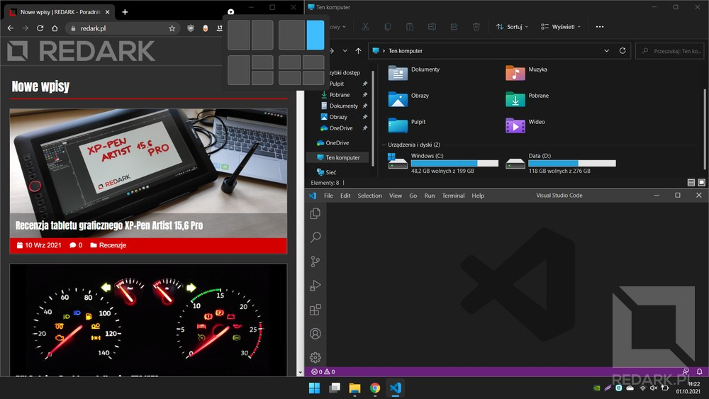
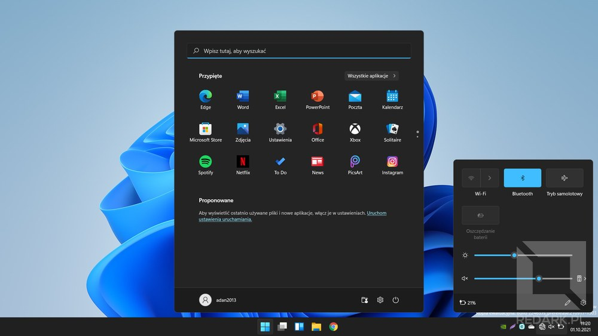
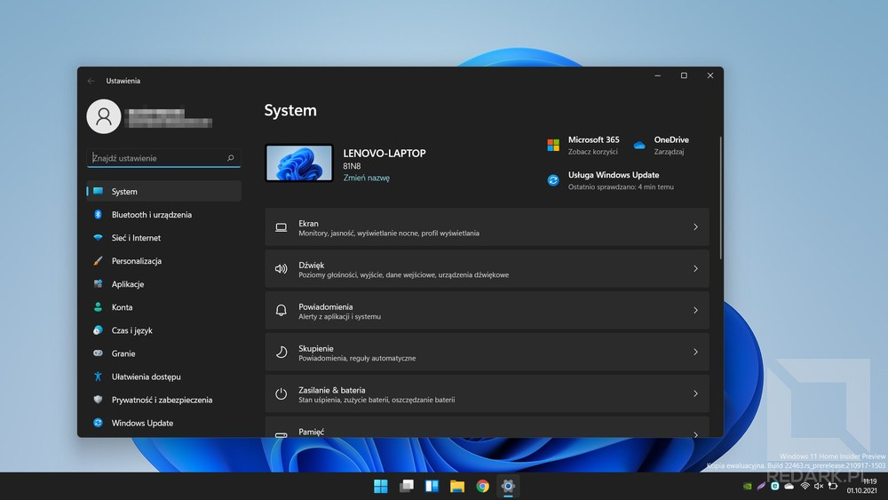

Właśnie dzisiaj, 5. października 2021 roku, ma miejsce premiera najnowszej wersji najpopularniejszego systemu operacyjnego Windows, oznaczonego numerem 11. Z tej okazji postanowiłem podzielić się z Wami moją listą skrótów klawiszowych, dzięki którym można poprawić swoją wydajność pracy na komputerze. Skupię się tutaj zarówno na nowych skrótach wchodzący wraz z Windows 11, jak i starszych systemach Microsoftu. Nie zabraknie też skrótów do sprawnego redagowania tekstów oraz przeglądania stron internetowych. Zapraszam.

## Skróty systemu Windows

Systemy operacyjne z rodziny Windows posiadają szereg unikatowych skrótów klawiszowych, które najczęściej wywołuje się poprzez przytrzymanie specjalnego klawisza z logotypem Windows, który znajduje się między klawiszami Ctrl i Alt. Omawiane skróty prezentowane są na najnowszym systemie Windows 11, ale z powodzeniem mogą być wykorzystywane również w starszych "okienkach".

<AdSense/>

Przypinanie aplikacji do paska zadań Windowsa pozwala łatwo wywoływać ich okno za pomocą skrótu **Win + (cyfra)**. Wciśnięcie skrótu Win + 1 wywoła pierwszą aplikację licząc od lewej, Win + 2 drugą, Win + 3 trzecią itd. Szybki powrót do poprzedniego okna zapewnia skrót **Alt + Tab**. Wciśnięcie klawisza Tab wielokrotnie pozwoli wywołać także pozostałe otwarte przez nas okna. Posiadasz milion otwartych okien, a potrzebujesz dostać się do plików na pulpicie? Skorzystaj z **Win + D**, aby ukryć wszystkie okna i odsłonić pulpit. Systemy Windows pozwalają w łatwy sposób dzielić powierzchnię ekranu między kilkoma aplikacjami. Możemy podzielić ją na połówki oraz ćwiartki, a najnowszy Windows 11 znacząco rozbudowuje ten mechanizm i wprowadza nowe układy, takie jak 3w1 oraz asymetryczne 2w1. Niezależnie od wersji systemu Microsoftu można przemieszczać okna między tymi pozycjami przy pomocy skrótu **Windows + (strzałki)**. Kliknięcie na konkretną strzałkę powoduje przeniesienie aktualnie wybranego okna w nowe miejsce w wybranym kierunku. Dodatkowo, jeśli okno znajduje się na samej górze ekranu, to strzałka w górę pozwoli je zmaksymalizować. Analogicznie jest ze strzałką w dół. Jeśli okno znajduje się na samym dole, to skorzystanie ze skrótu spowoduje zminimalizowanie okna do paska systemowego. Poniższe wideo prezentuje ten efekt:

<YouTube id='BbEIxABD9Sw' title='Przełączanie okien Windows 11'></YouTube>

<InfoBlock>Skrót do przenoszenia okien działa również pomiędzy monitorami, co znacząco usprawnia ich przenoszenie w stanowiskach wielomonitorowych.</InfoBlock>

Aby natychmiast zamknąć aktualną aplikację, skorzystaj ze skrótu **Alt + F4**. Jeśli posiadasz wrażliwe dane na komputerze i musisz szybko na chwilę od niego odejść, skorzystaj ze skrótu **Win + L**. Uruchomi on ekran blokady i zabezpieczy konto hasłem, jeśli masz takowe ustawione. Potrzebujesz zajrzeć do plików na komputerze? Skrótem **Win + E** uruchomisz nowe okno domyślnego eksploratora plików Windows. Potrzebujesz znaleźć jakiś plik na komputerze lub uruchomić konkretną zainstalowaną aplikację? Otwórz Menu Start przyciskiem **Win** i po prostu zacznij pisać! Okno wyszukiwarki otworzy się automatycznie i wybierze najtrafniejszy wynik wyszukiwania. Korzystasz z monitora zewnętrznego lub projektora i chcesz zmienić tryb jego działania lub po prostu go wyłączyć. Skrót **Win + P** wywoła podręczne menu pozwalające wybrać jeden z czterech trybów pracy wielu monitorów.

Chcesz wzbogacić pisany tekst o emoji? System Windows posiada wbudowaną przeglądarkę emoji, którą wywołasz skrótem **Win + (kropka)**. Chwilowe powiększenie fragmentu ekranu umożliwia wbudowane narzędzie o nazwie Lupa. Możesz je znaleźć w Menu Start lub wywołać skrótem **Win + (plus)**. Po uruchomieniu programu możesz sterować powiększeniem lupy za pomocą myszy i klawiatury (**Ctrl + Alt + rolka myszy**) lub tylko za pomocą klawiatury: **Win + (minus)**, **Win + (plus)** oraz **Ctrl + Alt + (strzałki)**.

<ImageDescription>Windows 11 posiada uprawniony mechanizm dzielenia ekranu oraz potrafi zapisywać pozycję okien na zewnętrznych monitorach po ich odłączeniu</ImageDescription>

Aby skopiować aktualnie wyświetlany na ekranie obraz do schowka, należy skorzystać z klawisza **Print Screen**, który może widnieć na klawiaturze ze skróconą nazwą **PrtSc**. Kombinacja **Win + PrtSc** automatycznie zapisze zrzut ekranu w "Obrazach" w Twoim katalogu użytkownika. Kombinacja **Alt + PrtSc** wykonuje zrzut tylko aktualnie aktywnego okna, a nie wszystkich monitorów.

<WarningBlock>Korzystanie z wbudowanej funkcji zrzutów ekranu jest 100 razy lepsze niż jakiekolwiek robienie zdjęć ekranu telefonem. Wyjątek stanowią sytuacje, w których chcesz pokazać obraz poza działającym systemem operacyjnym (np. ekran BIOSu lub kod błędu z Blue Screena) lub usterkę matrycy monitora.</WarningBlock>

Funkcja pulpitów wirtualnych została wprowadzona w systemie Windows 10 i ułatwia przełączanie między kilkoma grupami otwartych okien, co jest szczególnie przydatne w przypadku pracy na małym ekranie laptopa. Do sterowania pulpitami wirtualnymi służy kilka kombinacji klawiszy (choć najważniejszy jest ten pierwszy):

- **Win + Ctrl + (strzałki w bok)** - przechodzi między otwartymi pulpitami,
- **Win + Ctrl + D** - tworzy nowy pulpit,
- **Win + Ctrl + F4** - zamyka aktualny pulpit (otwarte okna zostają przeniesione na główny pulpit),
- **Win + Tab** - pokazuje listę otwartych okien i pulpitów (tutaj możesz przenosić okna między pulpitami).

<YouTube id='THgDBZ1JwV0' title='Pulpity wirtualne w Windows 11'></YouTube>

## Menadżer plików Windows

Podczas nawigowania po katalogach możesz skorzystać ze skrótu **Alt + (strzałka w lewo)**, aby powrócić do poprzedniego katalogu - funkcja "wstecz". Użycie strzałki w prawo pozwala aktywować przeciwną akcję - "dalej". Aby zmienić nazwę aktualnie wybranego pliku lub katalogu, nie musisz otwierać menu kontekstowego. Skorzystaj z klawisza **F2** i zacznij wpisywać nową nazwę. Do przenoszenia obiektów do kosza systemowego służy klawisz **Delete**. Użycie skrótu **Shift + Delete** umożliwia trwałe usunięcie z pominięciem kosza. Wybór aktualnie zaznaczonego pliku/katalogu umożliwia klawisz Enter, natomiast skrót **Alt + Enter** otwiera bardzo przydatne okno właściwości danego obiektu. Potrzebujesz utworzyć nowy katalog? Skorzystaj z **Ctrl + Shift + N** i podaj jego nazwę.

<AdSense/>

Pliki i katalogi można zaznaczać klikając na nie myszą, wybierając je obszarem, ale także za pomocą **strzałek oraz Spacji** na klawiaturze. Do zmiany zachowania wszystkich tych mechanizmów służą klawisze Shift oraz Ctrl. Zaznaczenie dwóch odległych obiektów ze wciśniętym klawiszem **Shift** spowoduje również zaznaczenie wszystkich plików i katalogów znajdujących się pomiędzy wybraną dwójką. Przydatne, gdy potrzebujesz skopiować z aparatu wszystkie zdjęcia zrobione w pewnym okresie czasu. Klawisz **Ctrl** z kolei pozwala zaznaczyć kolejny obiekt bez odznaczania już aktualnie wybranych elementów. Dzięki temu możesz za jednym zamachem zaznaczyć i skopiować kilka zdjęć, mimo że nie znajdują się one obok siebie. Oczywiście oba te skróty można ze sobą połączyć.

<YouTube id='MuRFZJ50h7c' title='Sposoby przenoszenia plików w Windows 11'></YouTube>

## Skróty uniwersalne

Pewna grupa skrótów klawiszowych jest na tyle spopularyzowana i ustandaryzowana, że działa w bardzo wielu programach tak samo lub bardzo podobnie (w zależności od zastosowania danej aplikacji). Poniżej pokrótce je wymienię:

- **Ctrl + F** - funkcja "znajdź na stronie" umożliwia wyszukanie danej frazy w czytanym lub redagowanym dokumencie (bardzo przyspiesza pisanie lub szukanie informacji w Internecie),
- **Ctrl + Shift + S** - funkcja "zapisz jako", czyli zapis projektu do nowego pliku na dysku twardym,
- **Ctrl + S** - zapis wprowadzonych zmian do poprzednio zdefiniowanego pliku projektu lub wywołanie funkcji "zapisz jako",
- **Ctrl + O** - menu dialogowe pozwalające otworzyć w programie plik dokumentu lub innego projektu,
- **Ctrl + P** - menu dialogowe drukowania aktualnie wyświetlanego dokumentu lub strony internetowej,
- **Ctrl + A** - zaznacza wszystkie widoczne pliki, katalogi, tekst dokumentu, zawartość strony internetowej itd.,
- **Ctrl + Z** - cofa ostatnio wykonaną zmianę w dokumencie lub projekcie,
- **Ctrl + Y** - powtarza ostatnio wycofaną (np. przez Ctrl + Z) zmianę,
- **Ctrl + X** - wycina tekst/obiekt i przenosi go do schowka,
- **Ctrl + C** - kopiuje tekst/obiekt i przenosi go do schowka,
- **Ctrl + V** - wkleja zawartość schowka,
- **F5** - odświeża widok lub stronę internetową,
- **F10** / **lewy Alt** - ustawia fokus na menu aplikacji oraz pokazuje dodatkowe skróty klawiszowe w postaci podkreślonych liter w nazwach opcji,
- **F11** - włącza lub wyłącza widok na pełnoekranowy (ukrywa pasek okna oraz pasek Windowsa),
- **Tab** - przeniesienie fokusu na następny element interfejsu lub strony internetowej,
- **Shift + Tab** - przeniesienie fokusu na poprzedni element interfejsu lub strony internetowej.

<InfoBlock>Często zauważam, że niektóre osoby podczas logowania na konto poczty, banku lub innego portalu pierw zaznaczają myszką login, wpisują go klawiaturą, później myszką przechodzą do hasła, wpisują klawiaturą hasło, a na końcu używają myszki, aby wybrać przycisk "zaloguj". Taki sposób korzystania z formularzy jest męczący i kompletnie bezsensowny. Po pierwsze, pole loginu jest najczęściej zaznaczone na starcie i nie trzeba na nie klikać. Po drugie, do pola hasła można przejść, naciskając klawisz **Tab**. Po trzecie, wciśnięcie klawisza Enter jest równoznaczne ze wciśnięciem przycisku pod formularzem (w tym przypadku: "zaloguj"). Dzięki temu cały proces logowania może odbyć się bez udziału myszki i niepotrzebnego machania rękami.</InfoBlock>

Bardzo często przydatne jest szybkie powiększenie oglądanego widoku. Najczęściej mowa tutaj o stronach internetowych, ale skrót działa również w wielu innych programach. Kombinacja **Ctrl + (plus)** powiększa widok, **Ctrl + (minus)** pomniejsza, a **Ctrl + 0** przywraca domyślną wielkość. Przybliżenie może zostać również zmienione poprzez przytrzymanie klawisza **Ctrl i obrócenie rolki w myszce**.

<ImageDescription>Elementem wyróżniającym system Windows 11 jest nowe wycentrowane menu Start</ImageDescription>

<AdSense/>

## Edycja tekstu

Dużą część pracy na komputerze zajmuje pisanie tekstów. Nieważne, czy mowa o redagowaniu książki, artykułów, odpowiadaniu na maile lub programowaniu. Umiejętność sprawnego poruszania się kursorem po ekranie jest kluczowa do sprawnego pisania na komputerze. Wiele operacji na tekście da się wykonać szybciej wyłącznie na klawiaturze, niż posiłkując się myszką. Cała magia leży w skorzystaniu z bloku znajdującego się nad strzałkami klawiatury (Del, Home, End, Page Up/Down) oraz modyfikatorów Shift i Ctrl.

<YouTube id='itF3tj4dgp0' title='Sprawna edycja tekstów w Windows 11'></YouTube>

Na początek zasada działania bez klawiszy modyfikatorów:

- **strzałki** - przemieszczają kursor co znak/linijkę,
- **Home** - przenosi kursor na początek linijki,
- **End** - przenosi kursor na koniec linijki,
- **Page Up/Down** - przenosi widok edytora o stronę w górę lub w dół.

Teraz te same klawisze, ale z modyfikatorem **Ctrl**:

- **strzałki na boki** - przemieszczają kursor co słowo,
- **strzałki góra/dół** - przemieszczają kursor co akapit lub przewijają widok edytora,
- **Home** - przenosi kursor na początek całego dokumentu
- **End** - przenosi kursor na koniec całego dokumentu
- **Page Up/Down** - przenosi kursor na początek poprzedniej lub następnej strony dokumentu.

Czas na drugi modyfikator, czyli Shift. Może on być stosowany ze wszystkimi powyższymi skrótami i nie zmienia ich zachowania. Gdzie tkwi szkopuł? **Klawisz Shift pozwala zaznaczać tekst** tak, jakbyśmy to robili tradycyjnie myszką! Chcesz zaznaczyć kilka znaków? Przytrzymaj Shift i przesuń kursor o kilka pozycji za pomocą strzałki. Chcesz zaznaczyć całą linijkę? Przejdź na jej początek dzięki Home, przytrzymaj Shift i kliknij End - gotowe! Dzięki skorzystaniu z tych klawiszy jesteś w stanie w ułamku sekundy dokonywać zarówno drobnych, jak i wielkich modyfikacji w tekście bez sięgania po mysz komputera!

Aby usunąć znak stojący po lewej stronie kursora, należy użyć klawisza **Backspace** i chyba każdy wie, że za pomocą klawisza **Delete** jesteśmy w stanie usuwać znaki po jego prawej stronie, ale czy wiesz, że możesz za ich pomocą usuwać również całe słowa? Wystarczy, że skorzystasz z poznanej niedawno mocy klawisza **Ctrl** i połączysz go z **Backspace** lub **Delete**. Dzięki temu przy pomocy jednego kliknięcia usuniesz cały wyraz znajdujący się po lewej lub prawej stronie kursora.

Kojarzycie zapewne wyróżnianie tekstów za pomocą pogrubienia, kursywy lub podkreślenia tak? Są one zawsze oznaczane w interfejsach edytorów literkami B, I oraz U. To nie przypadek, ponieważ pod tymi właśnie literami znajdziesz skrót klawiszowy odpowiedzialny za ich aktywacje. Zaznacz dany fragment zdania za pomocą strzałek oraz klawisza Shift oraz Ctrl, a następnie wciśnij **Ctrl + B**, aby go pogrubić, **Ctrl + I**, aby uruchomić kursywę lub **Ctrl + U**, aby podkreślić.

<InfoBlock>Ważne jest, aby sukcesywnie trenować te skróty podczas edycji tekstu. Schowaj myszkę, aby nie była ona pod ręką, a gdy będziesz próbować po nią sięgnąć, zastanów się, jaki skrót klawiszowy jest odpowiedni do akcji, którą chcesz wykonać i go użyj. Z czasem obiecuję Ci, że przestaniesz sięgać po mysz w trakcie edycji. Nawet gdy będzie ona w pobliżu 🙂.</InfoBlock>

## Przeglądarka internetowa

Obecnie chyba najpopularniejszą aplikacją na komputerach jest przeglądarka internetowa. Coraz więcej narzędzi oraz aplikacji przenosi się do chmury, stąd też taki sposób korzystania z komputera. Z tego powodu ważne jest, aby potrafić sprawnie poruszać się po interfejsie obecnych przeglądarek. Pokazane poniżej skróty będą dotyczyły najpopularniejszego Google Chrome'a, ale większość z nich jest uniwersalna i zadziała również w przeglądarkach Edge, Firefox, Opera i innych.

Na początek poruszanie się wstecz i do przodu. Umożliwia to skrót **Alt + (strzałki w bok)**. Jeśli potrzebujesz przejść do ostatnio odwiedzonej strony, to skrótem **Ctrl + H** otworzysz historię przeglądania, natomiast historia pobierania dostępna jest pod kombinacją **Ctrl + J**. Dostęp do paska adresu umożliwia klawisz **F6** - jest to bardzo wygodne rozwiązanie, ponieważ w 99% adres strony lub frazę do wyszukiwania wprowadzamy klawiaturą, a nie myszką. Aby otworzyć dodatkowe okno przeglądarki, możesz skorzystać ze skrótu **Ctrl + N**, natomiast dołożenie do tej kombinacji klawisza **Shift** pozwoli na otwarcie okna w trybie incognito.

<ImageDescription>Aplikacja ustawień ponownie uległa zmianom - to kolejny krok Microsoftu do porzucenia przestarzałego panelu sterowania</ImageDescription>

W trakcie pracy mamy często potrzebę otwarcia jednocześnie kilku, kilkunastu, a nawet kilkudziesięciu stron internetowych. Stąd w przeglądarkach zaimplementowany został mechanizm kart, pomiędzy którymi możemy się łatwo przełączać, korzystając z belki u góry ekranu. Cały ten mechanizm może być obsługiwany bez problemu również za pomocą samej klawiatury. Korzystając z kombinacji **Ctrl + W** zamkniemy aktualną kartę, a za pomocą **Ctrl + T** otworzymy nową. Zamknęliście kiedyś przez przypadek ważną kartę? Na pewno nie raz 😂. **Ctrl + Shift + T** pozwoli na jej szybkie przywrócenie. Do przełączania pomiędzy otwartymi kartami mamy na klawiaturze aż trzy dostępne metody:

- **Ctrl + Tab** / **Ctrl + Shift + Tab** - przełącza na następną/poprzednią kartę,
- **Ctrl + Page Up** / **Ctrl + Page Down** - przełącza na poprzednią/następną kartę,
- **Ctrl + (cyfra)** - przełącza na kartę o wybranym numerze licząc od lewej.

Na koniec jeszcze dwa super przydatne skróty, ale tym razem z użyciem myszy, a nie klawiatury. Mysz komputerowa posiada ukryty pod rolką środkowy przycisk, z którego regularnie korzystam, przeglądając Internet i dziwię się, że tak mało osób zna jego zastosowanie. Pierwsza funkcja to otwieranie linków w nowych kartach. Cały czas klikasz na linki PPM i żmudnie wybierasz pozycję "Otwórz w nowej karcie"? Natychmiast przestań! **Kliknięcie na link rolką automatycznie otworzy go w nowej karcie**. Jest to szczególnie przydatne podczas porównywania specyfikacji wielu produktów w sklepie internetowym. Możesz w mgnieniu oka otworzyć wszystkie widoczne produkty w osobnych kartach. Druga funkcja to zamykanie otwartych kart. Za każdym razem starasz się przycelować w ten mikroskopijny krzyżyk na ich zakładce? **Klikając rolką w dowolnym miejscu zakładki, natychmiast zamkniesz kartę przeglądarki**.

<AdSense/>

## Podsumowanie

Mam nadzieję, że znajdziesz w tym artykule przydatne skróty. Nie musisz ich wszystkich koniecznie używać. Nawet ja tak nie robię, choć spędzam przed monitorem większość swojego czasu. Po prostu znajdź i wypisz sobie na kartce kilka skrótów, które uważasz, że mogą Ci uprawnić pracę. Następnie powieś kartę przy monitorze i staraj się sukcesywnie z nich korzystać. Z czasem wejdą one w nawyk i nawet nie będziesz wiedzieć, że ich używasz. Jeśli masz jakieś pytania lub znasz inne przydatne skróty, których nie zawarłem w tym tekście, napisz komentarz pod artykułem, a z chęcią na niego odpowiem 😉.
