Jakiś czas temu miałem przyjemność zaprezentować Wam mój [pierwszy projekt DIY](/diy-arduino-dashboard-ets-ats), którym były samochodowe analogowe zegary do gier komputerowych. Dziś mam zaszczyt zaprezentować drugi projekt o nazwie Raspberry Book Reader. Jest to urządzenie, który udało się się ukończyć w ekspresowym tempie, ponieważ od momentu pojawienia się pomysłu do zakończenia jego konstruowania minęły zaledwie 2 tygodnie! Tym razem jest to urządzenie znacznie bardziej praktyczne. Zostało stworzone, aby umożliwić mojej tracącej wzrok babci łatwy dostęp do audiobooków. Dawniej czytała bardzo dużo książek, ale z powodu wieku i choroby nie może już tego robić. Postanowiłem więc, że wykonam dla niej niestandardowe urządzenie umożliwiające jak najprostszy odsłuch cyfrowych multimediów.

## Prezentacja urządzenia

Tak, jak to miało miejsce w poprzednim projekcie DIY, tak i tutaj postanowiłem przygotować krótki filmik pokazujący w skrócie działanie urządzenia.

<YouTube id='_oJZlEEj5N0' title='Prezentacja projektu DIY Raspberry Book Reader'></YouTube>

U góry urządzenia znajduje się panel sterowania. Składa się on z ośmiu przycisków, dwóch diod LED oraz jednego potencjometru. Wszystkie elementy zostały ułożone tak, aby maksymalnie ułatwić korzystanie z urządzenia. W górnym lewym rogu znajduje się potencjometr do regulacji głośności odtwarzania utworów oraz przycisk umożliwiający włączanie i wyłączanie komunikatów głosowych. W prawym narożniku panelu znajduje się włącznik urządzenia wraz z czerwoną diodą informującą o jego uruchomieniu. Wiersz przycisków u dołu odpowiada za operowanie odtwarzanym utworem. Przyciski po bokach służą do przewijania w przód i w tył odtwarzanego rozdziału, natomiast środkowy do zatrzymywania i wznawiania odtwarzania. Dioda znajdująca tuż się nad nim jest koloru zielonego i informuje o stanie działania urządzenia - świeci, gdy odtwarza lub mruga, gdy czeka na wznowienie. Górny wiersz przycisków pozwala na zmianę książek oraz rozdziałów. Boczne przyciski zmieniają rozdziały, a środkowy pozwala zmienić aktualnie wybraną książkę.

<Gallery>
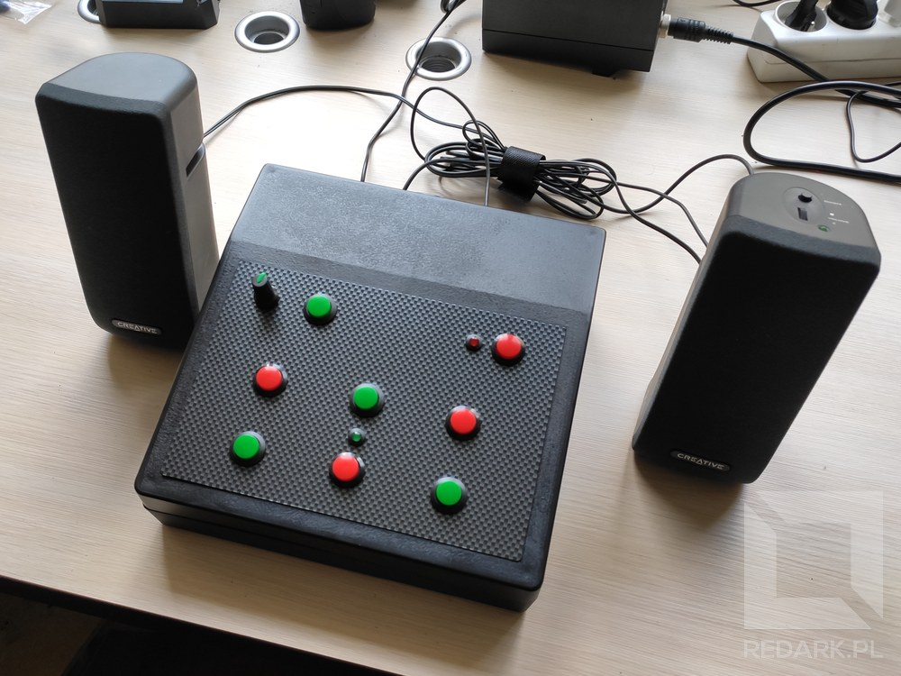
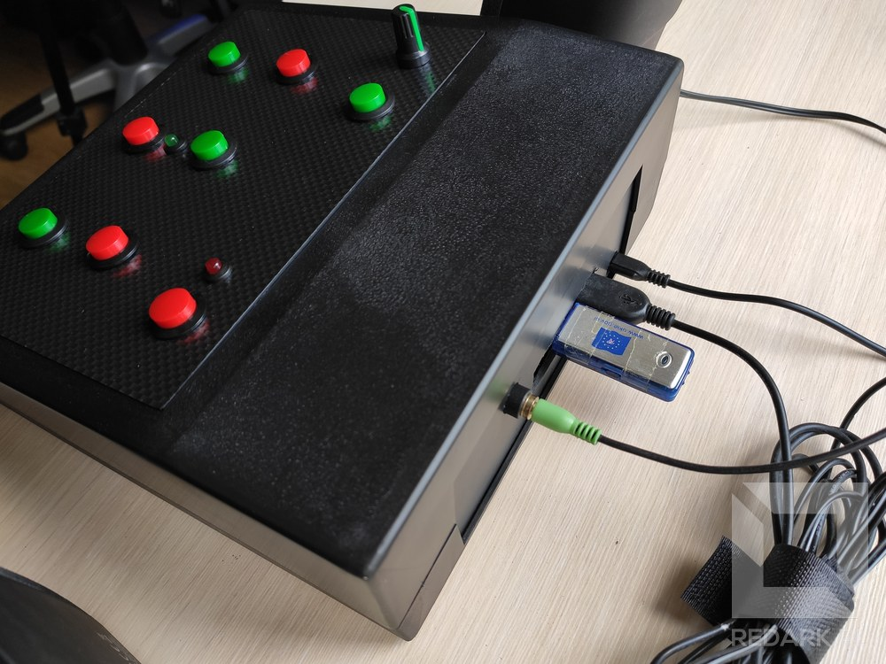
</Gallery>

<AdSense/>

Z tyłu urządzenia znajduje się zestaw wyjść służący do podłączenia zasilania i peryferii. Idąc od prawej jest to mały port microUSB służący do zasilania komputera, następnie widoczny jest duży otwór odsłaniający zestaw USB oraz gniazdo Ethernet pochodzące od Raspberry Pi. Służą one do podłączenia pendrive'a, a także zasilenia głośników USB. Na końcu znajduje się jeszcze standardowe gniazdo audio jack 3,5mm, które umożliwia rzecz jasna podłączenie zewnętrznych głośników.

## Budowa wewnętrzna i zasada działania

Aby umożliwić łatwą obsługę treści audio oraz pamięci masowych sercem całego układu zostało bardzo popularne Raspberry Pi. Postawiłem na generację trzecią, ponieważ posiada najlepszy stosunek możliwości do ceny. Sama "malinka", to jednak za mało. Z racji tego, że jest ona pełnoprawnym komputerem posiadającym własny system operacyjny, to nie można jej sobie od tak wyłączać poprzez odcięcie zasilania. Sprzęt miała obsługiwać osoba starsza, więc musiałem maksymalnie uprościć sposób uruchamiania i wyłączania Raspberry oraz zabezpieczyć go przed awariami. Pomógł mi tutaj mikrokontroler ATtiny85, czyli mikroskopijna wersja popularnego Arduino. Zadaniem owego układu jest sterowanie dopływem zasilania do RPi, a także "kulturalne" zamykanie systemu operacyjnego. Wszystko dzieje się automatycznie i jest sterowane za pomocą jednego przycisku.

### Procedura włączania i wyłączania

Opiszę teraz w skrócie proces współpracy obydwu układów oraz zachowanie całego urządzenia:

1. Do urządzenia zostaje doprowadzone zasilanie poprzez port microUSB z tyłu obudowy. Arduino zostaje zasilone i (w celach diagnostycznych) daje krótki sygnał gotowości za pomocą czerwonej diody LED.
2. Wciśnięcie przycisku zasilania powoduje uruchomienie urządzenia - czerwona dioda zaczyna mrugać, Raspberry otrzymuje zasilanie, uruchamia się i ładuje system operacyjny.
3. Za pomocą funkcji autostartu w Linuksie zostaje uruchomiony skrypt napisany w Pythonie. Poprzez GPIO do Arduino wysyłany zostaje cyfrowy sygnał gotowości, który powoduje ciągłe świecenie się czerwonej diody zasilania.
4. Skrypt przeprowadza diagnostykę i próbuje odnaleźć pamięć przenośną z plikami dźwiękowymi. Jeśli wszystko jest poprawne, uruchamia zieloną diodę LED i rozpoczyna odtwarzanie treści. Jeśli podczas inicjalizacji wystąpi błąd, urządzenie odtworzy stosowny komunikat dźwiękowy informujący o problemie.
5. Ponowne naciśnięcie przycisku zasilania rozpoczyna procedurę bezpiecznego wyłączania Raspberry. Czerwona dioda zaczyna mrugać, a skrypt działający na komputerze zostaje powiadomiony o chęci wyłączenia za pomocą sygnału cyfrowego pochodzącego z Arduino. Skrypt zapisuje wszystkie dane, odtwarza opcjonalny komunikat głosowy, a na końcu uruchamia komendę w terminalu powodującą bezpieczne zamknięcie systemu operacyjnego.
6. W tym samym czasie Arduino odczekuje 20 sekund od momentu wysłania sygnału wyłączenia, a następnie odcina zasilanie idące do Raspberry. Dioda zasilania przestaje mrugać, a cykl pracy urządzenia powraca do początku.

Dzięki sprytnemu połączeniu Raspberry i Arduino udało mi się uzyskać łatwe w obsłudze urządzenie, które samo dba o swoje prawidłowe włączenie oraz wyłączenie. Skoro już wiesz, jak urządzenie działa od strony użytkownika, mogę omówić poszczególne jej podzespoły.

<AdSense/>

### Arduino - prosta maszyna stanów

Budowę urządzenia rozpocząłem od tego, co dobrze znam, czyli od programowania Arduino. Układ miał być prostą maszyną stanów, która przełącza swoje wyjścia po wciśnięciu podłączonego do niego przycisku. Aby ułatwić sobie programowanie skorzystałem z gotowej płytki od Digispark. Posiada ona "wbudowaną" wtyczkę USB oraz wgrany bootloader, który bardzo ułatwia wgrywanie kodu ze środowiska programistycznego Arduino. Zastosowanie czystego chipa ATtiny85 byłoby oczywiście znacznie bardziej profesjonalne, ale nie dorobiłem się jeszcze programatora UART, a projekt miał być wykonany szybko, więc nie chciałem już sobie komplikować roboty.

<Gallery>
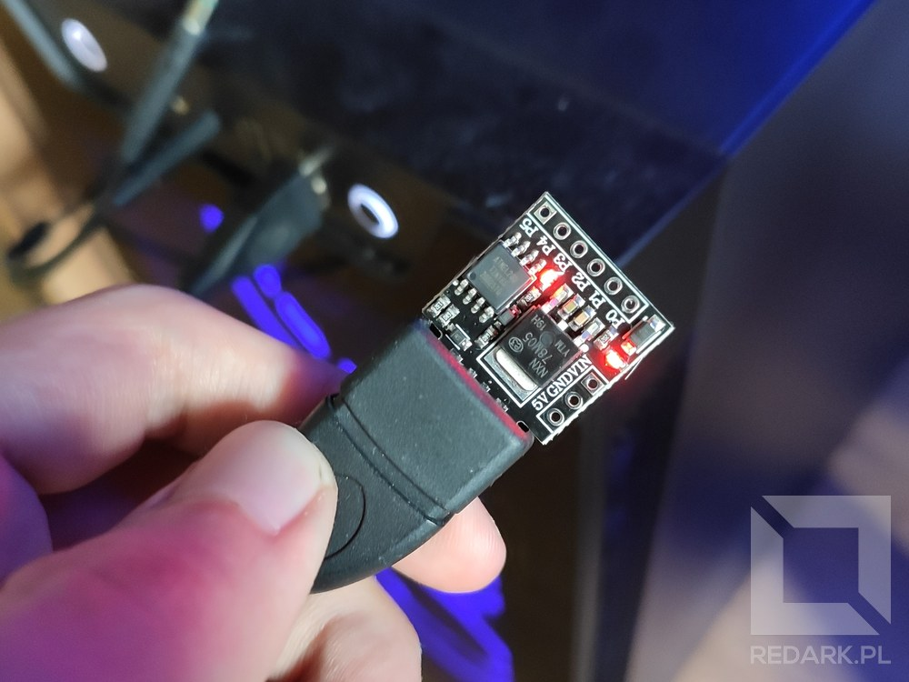
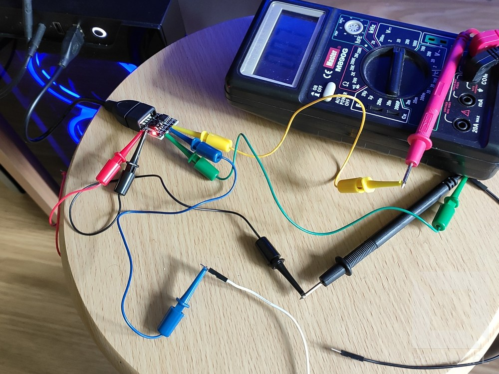
</Gallery>

Odpaliłem IDE, napisałem prosty kod i przetestowałem jego działanie za pomocą multimetru i zestawu przewodów pomiarowych z haczykami. Program nie był skomplikowany, więc obyło się bez większych problemów. Przycisk został podłączony do pinu 0, a dioda zasilania do pinu 1. Pin nr 1 posiada dodatkowo podłączoną do siebie maleńką diodę LED znajdującą się na samej płytce, więc mogłem łatwo diagnozować stan, w jakim znajduje się ATtiny.

### Raspberry Pi 3 - serce urządzenia

Znacznie większe wyzwania czekały mnie przy programowaniu Raspberry. Był to mój pierwszy kontakt z tym maleństwem, a także z programowaniem w Pythonie. Na szczęście znałem się już trochę na Linuxach, więc nawigowanie w środowisku tekstowym nie było dla mnie niczym nowym. Na początku pracy musiałem zainstalować system operacyjny. Posłużył mi tutaj dedykowany system Raspbian, czy jak to woli Raspberry Pi OS. System został załadowany na kartę microSD i włożony do urządzenia. Pierwsze uruchomienie obyło się bez niespodzianek. Malinka uruchomiła się prawidłowo i poprawnie przeszła przez wstępną konfigurację. Przeprowadziłem wtedy pierwsze testy audio, które zakończyły się niestety bardzo złymi wynikami.

Problemy były dwa. Po pierwsze dźwięk wychodzący z głośników był bardzo cichy - na pewno za cichy dla osoby niedosłyszącej. Drugi problem polegał na **wytworzeniu się tzw. pętli mas**, która objawiała się znacznymi zakłóceniami dźwięku zależnymi od poziomu obciążenia procesora Raspberry. Za pojawienie się tego zjawiska odpowiadało zasilanie głośników poprzez USB mikrokomputera. Głośniki były połączone z urządzeniem odtwarzającym za pomocą dwóch różnych kabli masowych - jeden szedł kablem USB, a drugi jackiem 3,5mm. Już myślałem, że projekt upadł z powodu nędznej jakości audio, ale na szczęście udało się wyeliminować oba problemy. 😅

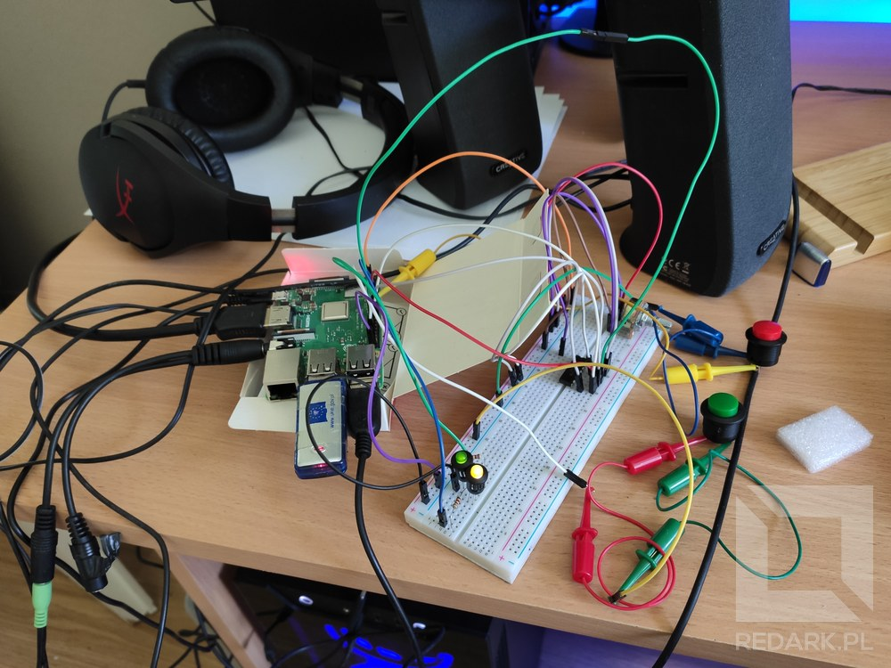

<AdSense/>

Cichy dźwięk naprawiło odkrycie dodatkowego miksera audio o nazwie "Alsamixer" zainstalowanego w systemie operacyjnym. Domyślnie wyjście audio jest w nim bardzo mocno ściszone i stąd całe to zamieszanie. Aby temu zaradzić, trzeba wpisać w terminal komendę "alsamixer" i przestawić pasek wyjścia na 100%. Pomocne screeny możecie znaleźć [w artykule na portalu Wiretuts](https://wiretuts.com/fix-low-volume-level-on-raspberry-pi). Drugi problem wymagał interwencji sprzętowej. Aby zaradzić tworzeniu się pętli mas, należało zastosować tzw. izolator mas pomiędzy Raspberry a kablem jack głośników. Wewnątrz takiego izolatora znajdują się dwa malutkie transformatory, które oddzielają galwanicznie oba kanały audio. Wykorzystują one fale elektromagnetyczne do przekazywania sygnały między dwoma niezależnymi obwodami. Omawiany izolator zauważycie podczas montażu urządzenia w dalszej części artykułu.

### Układ zasilania

Oprócz Arduino i Raspberry Pi w obudowie musiała znaleźć się również uniwersalna płytka realizująca wszystkie potrzebne połączenia pomiędzy podzespołami. Nie jestem w 100% zadowolony z jakości jej wykonania, ponieważ przez pośpiech nie została ona dostatecznie dobrze przemyślana i musiałem posiłkować się chociażby słabo wyglądającymi pętelkami kabli łączących odległe od siebie punkty na płytce.

Płytka miała dwa podstawowe zadania. **Pierwszym z nich była dystrybucja zasilania**. Port microUSB został do niej dolutowany za pomocą pary krótkich przewodów. Zasilanie idzie bezpośrednio do układu ATtiny85. Za płytką od Digispark znajduje się MOSFET odpowiedzialny za doprowadzanie lub odcinanie zasilania do Raspberry. Tutaj należy się z mojej strony małe sprostowanie. Użyłem w tym projekcie MOSFET-u z kanałem typu N, który odłącza kabel masowy malinki. Znacznie lepszym rozwiązaniem jest tutaj użycie tranzystora z kanałem P i odcinanie przewodu 5V, ale na takie zmiany było już u mnie za późno. Drugi mankament dotyczy doprowadzenia zasilania do samego Raspberry. Miało być ono podłączone standardowym sposobem, czyli poprzez gniazdo microUSB malinki. Niestety użyte w uciętym przeze mnie kablu USB przewody okazały się bardzo słabej jakości i nie wytrzymywały wysokiego chwilowego poboru prądu komputera. Aby temu zaradzić postanowiłem, że doprowadzę prąd bezpośrednio przez piny GPIO. Nie jest to w pełni bezpieczne rozwiązanie, ponieważ w taki sposób omijam całkowicie zabezpieczenia prądowe RPi, a to oznacza, że w przypadku jakiegoś przepięcia, upiekę malinkę na chrupko. Nie widziałem jednak lepszego rozwiązania, więc zastąpiłem kabel microUSB przewodami idącymi do GPIO. Spadki napięcia nadal występowały, ale były znacznie mniejsze, niż w przypadku zastosowania nędznej jakości kabla.

<Gallery>
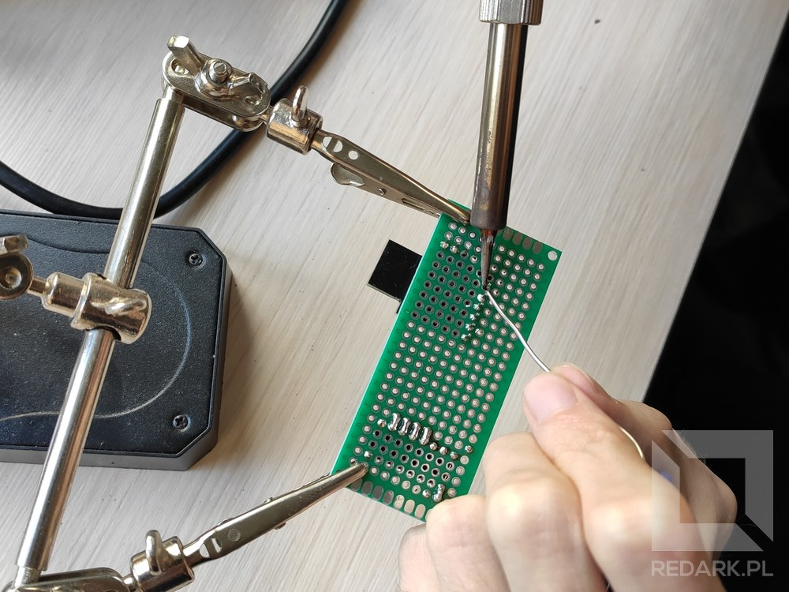
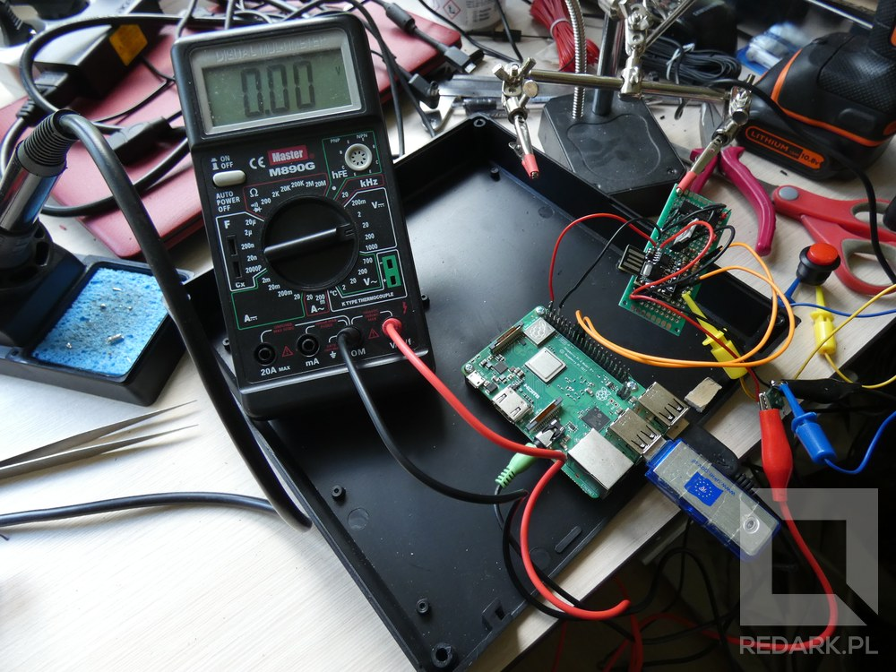
</Gallery>

**Drugim zadaniem płytki jest obsługa potencjometru do regulacji głośności.** Raspberry Pi, w przeciwieństwie do popularnego Arduino, nie posiada wbudowanego przetwornika ADC, czyli kompletnie nie potrafi interpretować analogowych sygnałów. Aby wykryć pozycję potencjometru wymagana jest interpretacja sygnału analogowego, więc musiałem użyć tutaj zewnętrznego przetwornika. Wykorzystałem układ MCP3008, czyli 8-kanałowy przetwornik analogowo-cyfrowy komunikujący się z komputerem za pomocą magistrali SPI. Chip był zasilany za pomocą napięcia 3,3 V pochodzącego z RPi i posiadał przylutowane goldpiny do łatwego podłączenia magistrali SPI oraz potencjometru.

<AdSense/>

### Komunikacja między układami

Omawiana przed chwilą płytka ma jeszcze jedno małe zadanie. Musi skomunikować ze sobą Arduino oraz Raspberry, aby móc zrealizować opisywaną wcześniej procedurę łatwego i bezpiecznego wyłączania urządzenia. Komunikacja musi odbywać się dwustronnie, więc użyłem do tego dwóch różnych przewodów. Kabel idący od RPi do Arduino nazywałem **READY** i odpowiada on za zasygnalizowanie poprawnego uruchomienia skryptu (zatrzymanie mrugania czerwonej diody). Drugi kabel, noszący nazwę **SHUTDOWN**, wysyła sygnał z Arduino do RPi informujący o chęci wyłączenia urządzenia. Tak jak w przypadku [mojego poprzedniego projektu DIY](/diy-arduino-dashboard-ets-ats), tak i tutaj pojawił się problem z różnicą poziomów logicznych. Arduino pracuje na napięciu 5 V, a RPi z kolei na napięciu 3,3 V. Sygnał pochodzący z Raspberry był bez problemu rozumiany przez Arduino, ponieważ napięcie 3,3 V jest już interpretowane w logice 5-woltowej jako jedynka. Problem leżał w komunikacji w drugą stronę, ponieważ podanie 5 V do RPi usmażyłoby procesor. Za rozwiązanie tego problemu posłużył prosty dzielnik napięcia złożony z dwóch odpowiednio dobranych rezystorów, które zbijały niebezpieczne napięcie 5V do okolic 3,2 V.

## Konstruowanie urządzenia

### Programowanie Raspberry Pi

Aby ułatwić sobie korzystanie z malinki bez potrzeby angażowania osobnej klawiatury i monitora, pierwsze co zrobiłem, to skonfigurowałem sobie zdalny dostęp do systemu za pośrednictwem lokalnej sieci LAN. Na kartę SD dodałem specjalny plik tekstowy zawierający nazwę i hasło mojej sieci Wi-Fi, w systemie wprowadziłem własne hasła dostępu do użytkownika pi oraz root, a następnie aktywowałem łączność po protokole SSH. Dodatkowo w ustawieniach swojego routera domowego skonfigurowałem dla malinki statyczny adres IP, aby ułatwić sobie odnajdywanie jej w sieci. Dzięki tym zabiegom, od teraz wystarczyło jedynie podłączyć RPi do zasilania, odczekać kilkanaście sekund i połączyć się z nią za pomocą terminala na moim komputerze. Dokładną instrukcję, jak wykonać wszystkie te kroki, możecie znaleźć [w kursie Forbota](https://forbot.pl/blog/kurs-raspberry-pi-instalacja-komunikacja-przez-siec-id21051). Kopiowanie plików pomiędzy urządzeniami realizowałem za pomocą SCP, czyli komendy kopiującej pliki po protokole SSH.

Programowanie w środowisku tekstowym, w nieznanym mi języku programowania i w dodatku na zdalnej maszynie było ciekawym doświadczeniem. Oczywiście po drodze wyszła masa problemów i awarii skryptu bez żadnego komunikatu błędu, ale udało mi się zaimplementować wszystkie potrzebne funkcje. W czasie programowania wpadłem też na pomysł dodania prostych komend głosowych inforumujących o stanie urządzenia. Uzupełniłem je o prosty syntezator mowy, który z nagranych przeze mnie pojedynczych cyfr generuje komunikaty z numerami książek oraz rozdziałów.

### Planowanie ułożenia

Konstruowanie właściwego urządzenia rozpocząłem od zaplanowania rozmieszczenia podzespołów w obudowie, którą został **Kradex Z25**. Jest to uniwersalna dwuczęściowa obudowa z dwoma demontowalnymi panelami - jeden z tyłu i drugi umieszony pod kątem u góry. W obudowie znaleźć musiał się port microUSB, uniwersalna płytka z układem zasilania, Raspberry Pi 3 oraz izolator audio. Na poniższym zdjęciu możecie zobaczyć krótki rozdzielacz audio w formie litery Y. To on był początkowo planowany do wyprowadzenia gniazda jack na tył obudowy, ale później zastąpił go wspomniany wcześniej izolator.

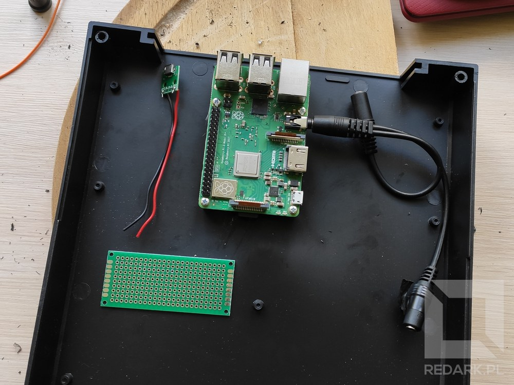

<AdSense/>

### Mocowanie podzespołów

Gdy już wiedziałem, co i jak chcę wykonać, przeszedłem do działania. Pobrałem z Internetu i wyciąłem szablon otworów montażowych Raspberry Pi 3, przykleiłem go do obudowy i wywierciłem otwory. Następnie wykonałem mocowanie gniazda microUSB i płytki uniwersalnej. Skorzystałem tutaj ze sprawdzonego przy pierwszym projekcie DIY mocowania za pomocą wygiętego spinacza biurowego. Do obudowy został on przymocowany przy użyciu kleju na gorąco. Z powodu braku odpowiednich kołków dystansowych port zasilania spoczął na dwóch drewienkach i został również przytwierdzony przy użyciu spinacza i kleju. Gniazdo nie jest zbyt stabilne i trzeba je podłączać z wyczuciem, ale ważne, że działa.

Później przygotowałem mocowania pod izolator audio. Z racji jego gabarytów wykorzystałem tutaj dwa druciki do związywania przewodów, które również przymocowałem klejem na gorąco. Na koniec pozostało wykonać otwory w tylnym panelu obudowy - mały otwór na microUSB, duży prostokątny otwór na USB i Ethernet Raspberry oraz okrągły otwór na gniazdko jack 3,5 mm izolatora. Gniazdo audio również zostało osadzone przy użyciu kleju na gorąco. Finalny efekt możecie zobaczyć poniżej:

<Gallery>
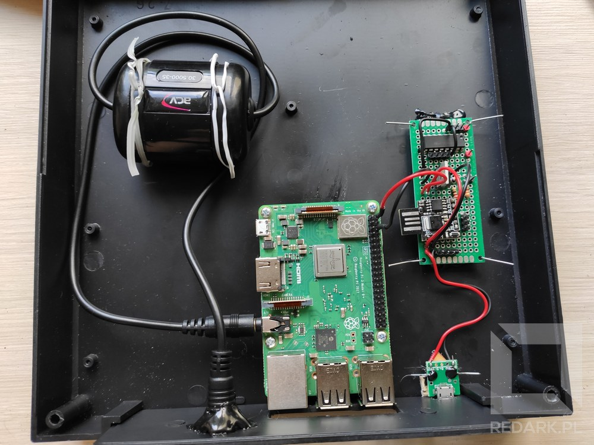
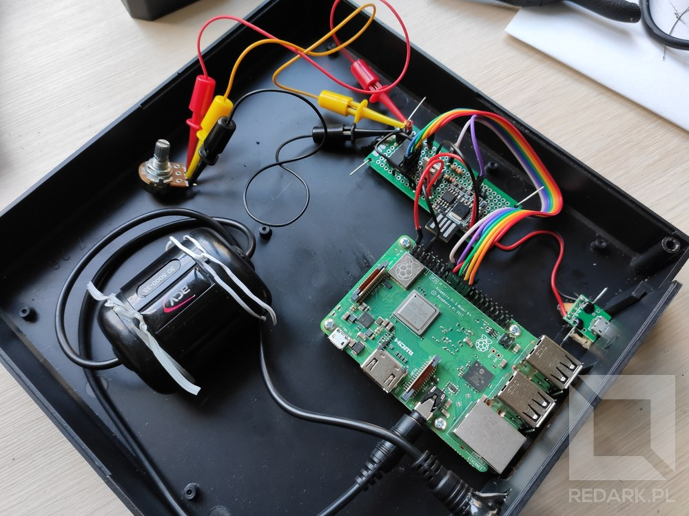
</Gallery>

### Ostatnie testy i modyfikacje

Po wstępnym zamontowaniu wszystkich podzespołów powróciłem do programowania. Dopracowałem i przetestowałem porządnie kod. Wykonałem jeszcze dwie ważne modyfikacje w systemie operacyjnym Raspberry. Pierwsza polegała na dodaniu stworzonego przeze mnie skryptu do autostartu. Dotychczas uruchamiałem go ręcznie przy pomocy komend w konsoli, ale teraz musiał już on zacząć uruchamiać się samodzielnie. Do zrealizowania autostartu użyłem linuksowego menadżera "systemd" oraz jego mechanizmu usług użytkownika (systemd user service). Nie będę tutaj dokładnie omawiał tego zagadnienia, ponieważ jest ono trochę rozbudowane. Podrzucę za to [link do przydatnego artykułu](https://blog.victormendonca.com/2018/05/14/creating-a-simple-systemd-user-service/), który pomógł mi rozgryźć ten mechanizm, a także wrzucę screen gotowego pliku usługi, który uruchamia skrypt w czytniku:

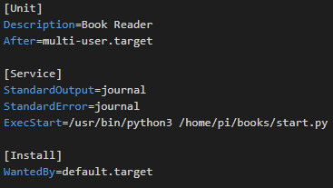

Druga modyfikacja polegała na wykorzystaniu modułu Wi-Fi RPi do umożliwienia przyszłej łatwej diagnostyki urządzenia i systemu operacyjnego po zamknięciu obudowy. Skorzystałem z [oficjalnego poradnika twórców Raspberry](https://www.raspberrypi.org/documentation/configuration/wireless/access-point-routed.md) i przekształciłem moduł Wi-Fi w samodzielny hotspot. Dzięki temu po restarcie malinki, system zamiast łączyć się z moją domową siecią bezprzewodową, stworzył własną o nazwie "BookReader". Dzięki temu, w razie awarii urządzenia, mogę pójść do babci ze swoim laptopem, podłączyć się do Wi-Fi urządzenia i wejść do systemu przy użyciu połączenia SSH. Wewnątrz sieci działa nawet mini serwer DNS, który umożliwia łatwe połączenie się z RPi przy użyciu wygodnej nazwy "gw.wlan" zamiast adresu IP. Naprawdę fajna opcja.

<AdSense/>

### Panel sterowania

Pozostała tylko wisienka na torcie, czyli przygotowanie panelu sterowania czytnikiem. Najpierw zaplanowałem ułożenie wszystkich przycisków i naniosłem odpowiednie wymiary na plastikową płytkę. Do wykonania otworów pod przyciski zakupiłem zestaw małych otwornic/sękowników do drewna. Podczas wiercenia otworów frontowa powierzchnia panelu uległa mocnemu porysowaniu, więc postanowiłem okleić ją na koniec folią imitującą karbon. Następnie zamontowałem w panelu przyciski, oprawki na diody LED oraz potencjometr. Pozostało to teraz tylko okablować. Było to pracochłonne, ale nie skomplikowane. Oprawki oraz diody unieruchomiłem odrobiną kleju na gorąco, a także dobrałem odpowiednie rezystory ograniczające idący do nich prąd. Większość przewodów została przedłużona tak, aby ułatwić podłączenie ich pod GPIO Raspberry i zamknięcie obudowy. Zdjęcia z procesu przygotowywania panelu możecie zobaczyć poniżej:

<Gallery width='2'>
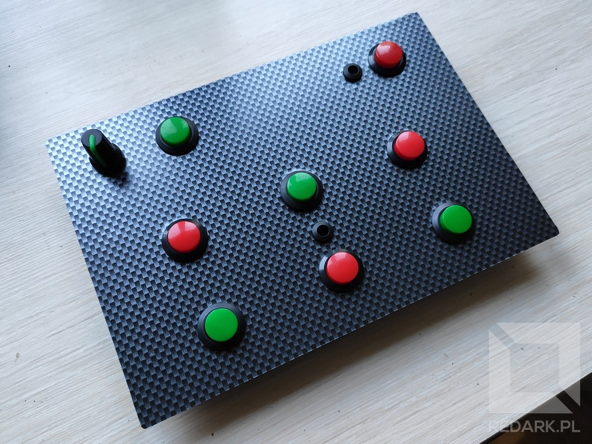
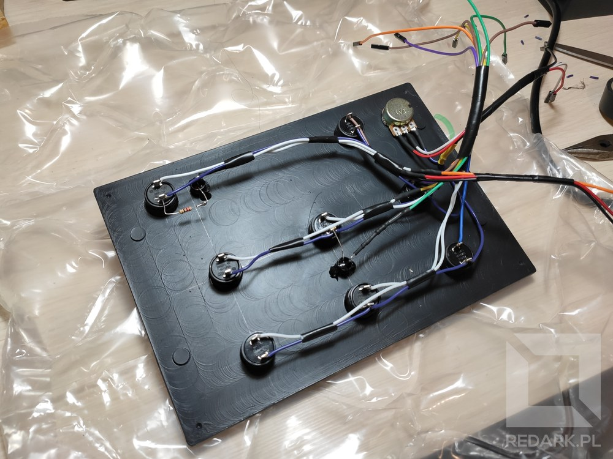
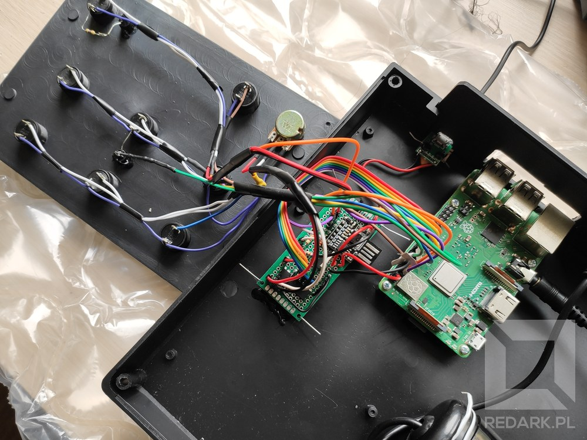
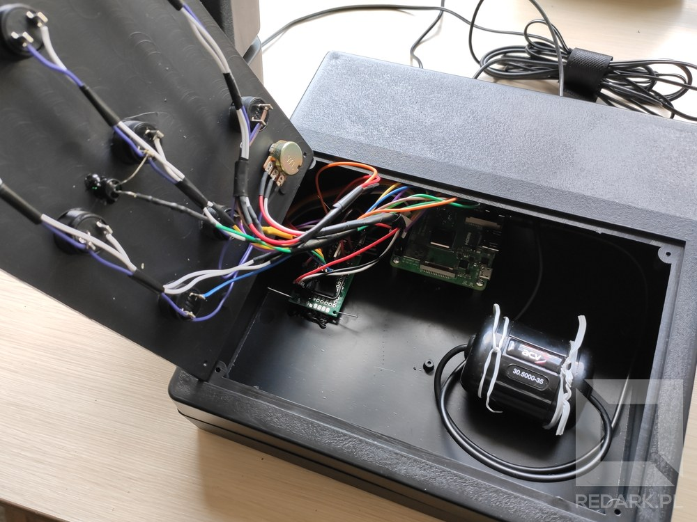
</Gallery>

## Podsumowanie

### Kosztorys i schematy elektryczne

Tradycyjnie udostępniam kosztorys całego projektu oraz pełne schematy elektryczne:

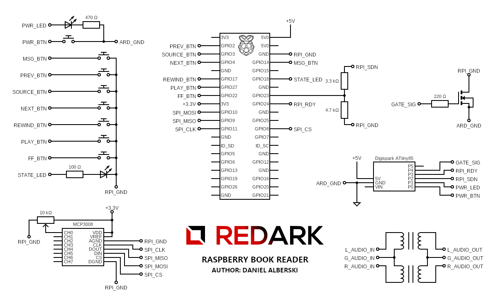

### Kod źródłowy

Nie mogło też zabraknąć rzecz jasna kodu źródłowego urządzenia. Poniżej podaję link do repozytorium GitHub, w którym znajdują się cztery elementy:

- **BookReader** - skrypt działający na Raspberry Pi napisany w Pythonie,
- **RpiPowerSwitch** - kod źródłowy ATtiny85,
- **BookReaderFileRenamer** - proste narzędzie konsolowe napisane w C# ułatwiające masową zmianę nazw plików audio na 001.mp3, 002.mp3 itd.,
- **config.ini** - przykładowy plik konfiguracyjny umieszczany wraz z plikami audio w pamięci masowej podłączanej do czytnika.

<ActionButton to='https://github.com/adan2013/RaspberryBookReader'>Przejdź do GitHuba</ActionButton>

<AdSense/>

### Moja opinia

To by było na tyle. Kolejny projekt DIY za mną. Cieszę się, że udało się go wykonać tak sprawnie. Jest to miła odmiana po zegarach, które męczyłem półtora roku 😂. Co do moich spostrzeżeń to żałuję, że nie dopracowałem lepiej sterowania tym zasilaniem. Powinienem lepiej przemyśleć układ na płytce uniwersalnej i zastosować MOSFET typu P, a nie N. Mimo to projekt uważam za udany. W dwa tygodnie zaprojektowałem i wykonałem urządzenie, o którym nic wcześniej nie myślałem i w dodatku zmierzyłem się w nim z nowościami jakimi było Raspberry oraz programowanie w Pythonie. Samo urządzenie dzięki wykorzystaniu gotowej obudowy oraz folii karbonowej prezentuje się wyśmienicie. Mam nadzieję, że Wam również spodobał się ten projekt. Na dzisiaj to koniec, wracam obmyślać kolejne projekty i widzimy się w kolejnych artykułach na Redarku.
