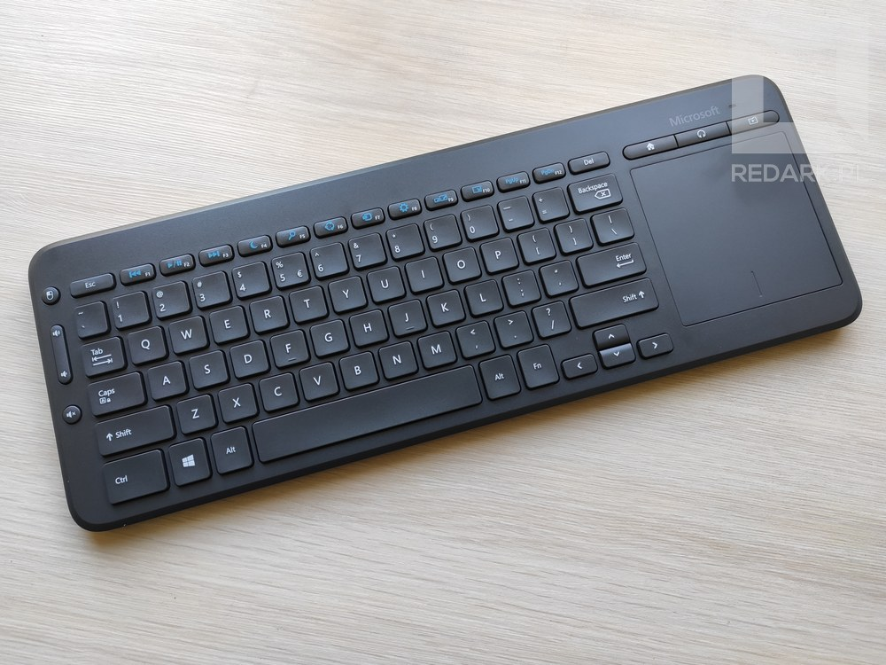
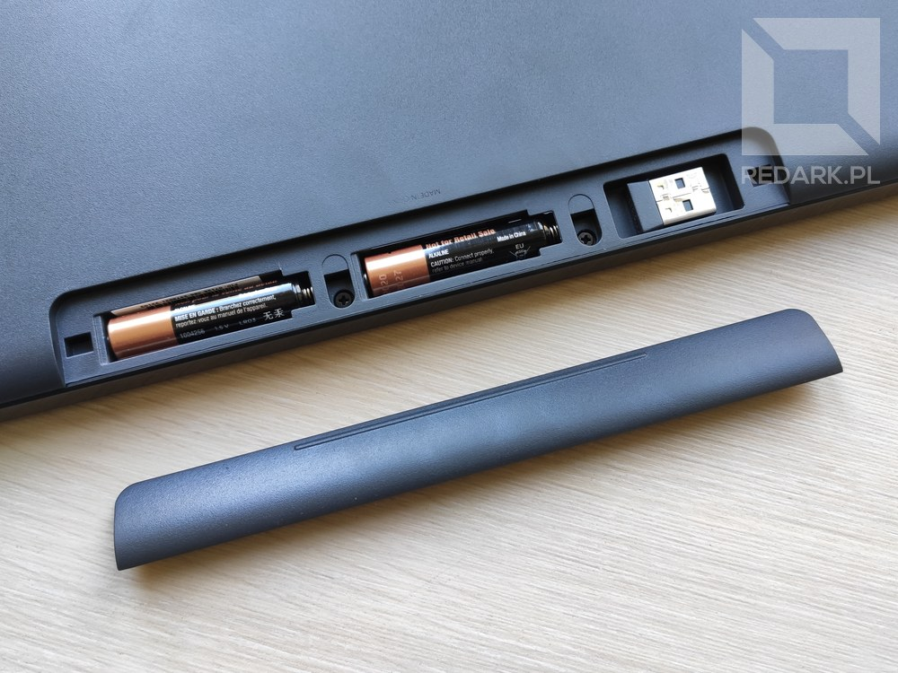
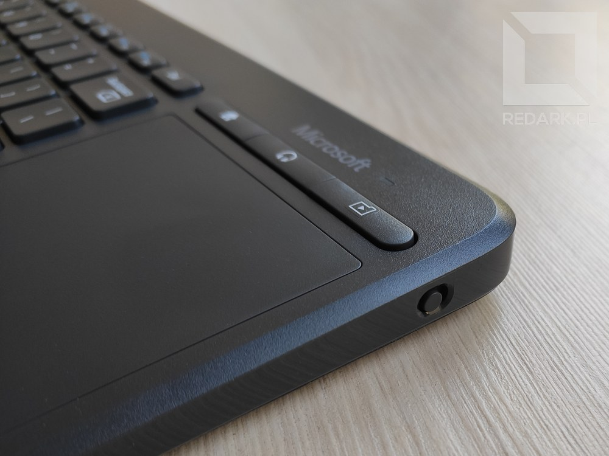
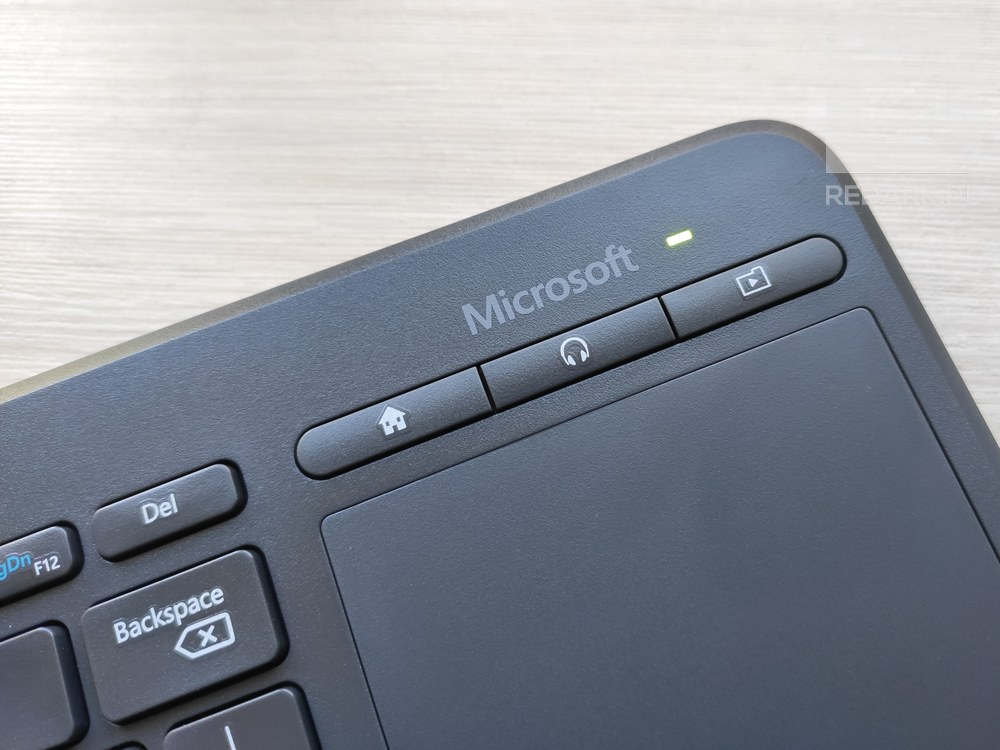
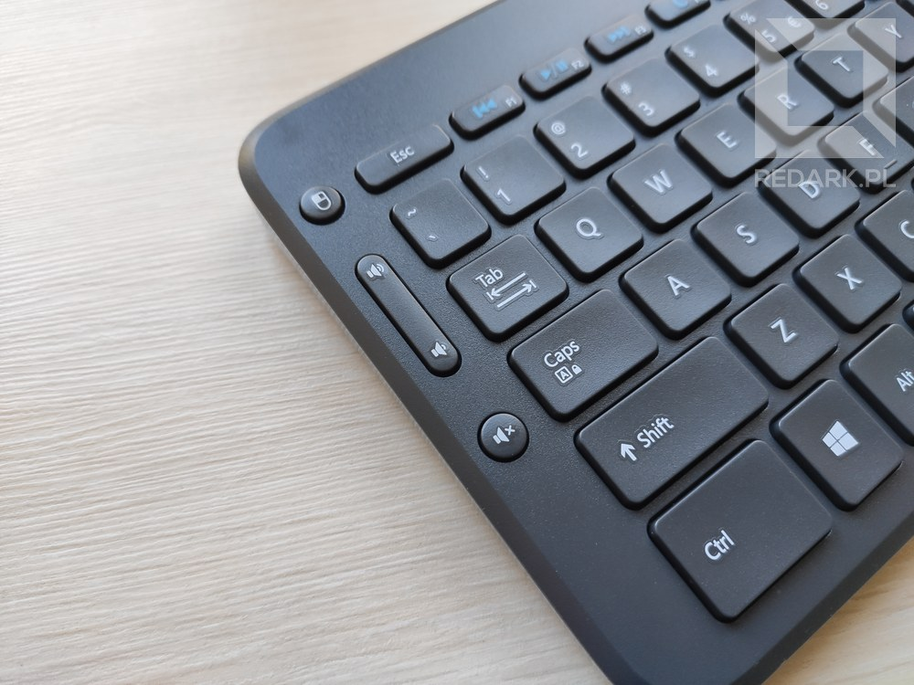

Współczesne systemy smart TV pozwalają nam na coraz więcej interakcji. Niestety wpisywanie tekstu lub poruszanie kursorem przy użyciu zwykłego pilota do telewizora nie jest zbyt wygodne i wydajne. Wpisanie czegokolwiek do wyszukiwarki to męka połączona z wciskaniem po kilkadziesiąt razy tych samych przycisków. Z tego powodu coraz popularniejszą metodą jest podłączanie pod telewizory standardowych klawiatur oraz myszek. Z racji zastosowania, muszą być one bezprzewodowe oraz mobilne, aby dało się ich używać na stoliku kawowym lub kanapie. Dziś mam Wam do zaprezentowania interesujący model klawiatury z touchpadem przystosowany pod operowanie telewizorem lub komputerem na odległość. Jest nim Microsoft All-in-One Media Keyboard. Zapraszam do recenzji

## Budowa i wykonanie

W segmencie bezprzewodowych klawiatur z gładzikiem prym wiodą dwa modele - Logitech Touch K400 Plus oraz omawiany Microsoft All-in-One Media Keyboard. Pozostałe modele to miniaturowe tanie chińczyki, po których raczej nie spodziewałbym się długiego okresu eksploatacji. Produkt Microsoftu posiada stonowany wygląd oraz klasyczny układ klawiatury QWERTY wraz z długim Shiftem oraz Enterem, co jest kompletnym przeciwieństwem udziwnionego układu Logitecha. Klawiatura ma wymiary 365x135 mm i jest wykonana z bardzo dobrej jakości plastiku, który nie trzeszczy podczas pisania. W urządzeniu zastosowano mechanizm nożycowy, dzięki czemu klawisze posiadają krótki i pewny skok oraz są bardzo ciche w działaniu. Nie ustępują one jakością klawiaturom montowanym w laptopach.

<AdSense />

## Zasilanie i komunikacja

Po obróceniu urządzenia do góry nogami, otrzymujemy dostęp do klapki baterii. Klawiatura zasilana jest dwoma paluszkami AAA, a obok nich znajduje się również mały schowek z magnesem na "nano odbiornik" USB. Na prawej krawędzi urządzenia widoczny jest mały suwak umożliwiający włączenie lub wyłączenie zestawu. Jest on pokolorowany na zielono i czerwono, przez co łatwo zauważyć, w jakim stanie zostawione jest urządzenie. Po uruchomieniu klawiatury obok logotypu Microsoftu zapala się na chwilę zielona dioda LED. Jej zadaniem jest również poinformowanie w przyszłości o konieczności wymiany rozładowanych baterii. W trakcie korzystania z klawiatury nie zauważyłem żadnych problemów z zasięgiem.

<Gallery>

</Gallery>

## Touchpad

Elementem wyróżniającym ten model klawiatury jest oczywiście wbudowany touchpad, który niweluje potrzebę korzystania z klasycznego optycznego gryzonia, który niezbyt sprawdzi się na miękkiej kanapie lub łóżku. Powierzchnia gładzika ma kształt kwadratu o boku 8 centymetrów. U dołu znajdują się również dwa standardowe przyciski myszy - LPM i PPM. Rozmiar touchpada nie jest zatem przesadnie duży i nie ma co go porównywać do modeli montowanych w laptopach. Oczywiście spowodowane jest to wymiarami samej klawiatury, która miała pozostać mobilnym akcesorium do telewizora. W konkurencyjnym Logitechu ta powierzchnia jest jeszcze mniejsza, ponieważ przyciski u dołu touchpada są fizyczne i nie wchodzą w skład aktywnej powierzchni gładzika. Tutaj znacznie lepiej sprawdza się rozwiązanie Microsoftu. Jeśli chodzi o precyzję sensora, to jest ona zadowalająca. Po chwili pracy na komputerze zwiększyłem sobie odrobinę szybkość kursora, aby móc pokryć większy procent ekranu przy pomocy jednego przeciągnięcia palcem.

## Skróty

### Klawisze funkcyjne

Klawisze funkcyjne od F1 do F12 posiadają podwójne znaczenie. Domyślnie aktywują one skróty zaznaczone niebieskimi ikonami. Przytrzymanie klawisza "Fn" na prawo od Spacji umożliwia skorzystanie z klasycznego znaczenia tych klawiszy. Wśród skrótów znajdziemy opcje sterowania odtwarzaczem multimediów, a także funkcje systemowe takie jak usypianie komputera, czy wywoływanie wyszukiwarki, okna ustawień lub udostępniania plików lub ekranu. Ich dobór jest całkiem dobrze przemyślany.

<Gallery>

</Gallery>

<AdSense />

### Szybki dostęp do aplikacji

Tuż nad touchpadem znajdują się trzy duże przyciski umożliwiające szybkie uruchomienie konkretnych aplikacji. Pierwszy umożliwia uruchomienie przeglądarki internetowej, drugi odtwarzacza multimediów, a trzeci menadżera plików. Jest to zatem zestaw trzech najczęstszych zastosowań smart TV / HTPC. Ich umiejscowienie jest idealne, ponieważ po uruchomieniu programu mogę natychmiast przenieść dłoń nad touchpad i kontynuować obsługę komputera.

### Sterowanie głośnością

W takim modelu nie mogło rzecz jasna zabraknąć sterowania głośnością. Odpowiednie do tego skróty znajdują się przy lewej krawędzi klawiatury. Nad nimi znajduje się również dodatkowy przycisk odpowiedzialny za wciśnięcie LPM na touchpadzie. Jest on bardzo przydatny, ponieważ przyspiesza nawigowanie po systemie przy użyciu gładzika. Prawa dłoń może skupić się na operowaniu kursorem, natomiast lewa dłoń trzyma klawiaturę w powietrzu i akceptuje wskazywane przez kursor elementy (podobny patent znajduje się również w modelu Logitecha). Na plus muszę zaznaczyć zastosowanie długiego przycisku regulacji głośności - pozwala on na pozycjonowanie ręki bez patrzenia na klawiaturę. Na minus niestety to, że omawiane teraz cztery przyciski działają inaczej, niż reszta klawiatury i mają lekko "gumowaty" skok, przez co nie wciska się ich tak pewnie, jak pozostałe klawisze.

## Podsumowanie

Microsoft All-in-One Media Keyboard to bardzo dobra klawiatura, która zaskoczyła mnie pozytywnie swoją jakością wykonania oraz przemyśleniem budowy. Dzięki odpowiednio dobranym skrótom oraz podręcznemu touchpadowi, to idealne rozwiązanie dla osób szukających możliwości łatwego sterowania swoim smart tv lub innym urządzeniem siedząc wygodnie na kanapie. Duży plus również za wykorzystanie klasycznego układu klawiszy. Najważniejsze klawisze są duże (Shift, Enter, Backspace, Del i Esc), a strzałki nie są na siłę "przyklejone" do reszty klawiszy, co ułatwia korzystanie z nich. Serdecznie wszystkim polecam.

<GoodList>
- wykonanie z dobrej jakości plastiku oraz mobilna konstrukcja urządzenia
- bardzo dobrej jakości cichy mechanizm nożycowy
- optymalny układ klawiszy bez zbędnych udziwnień
- praktyczny gładzik oraz skróty do aplikacji i funkcji systemowych
</GoodList>
