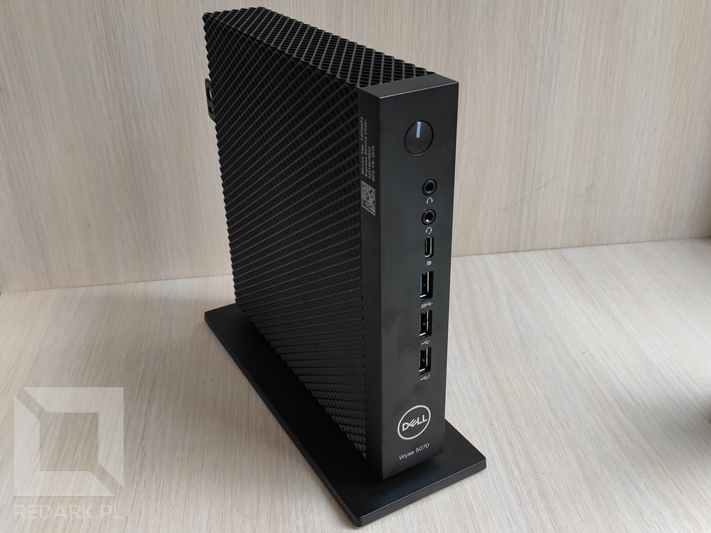
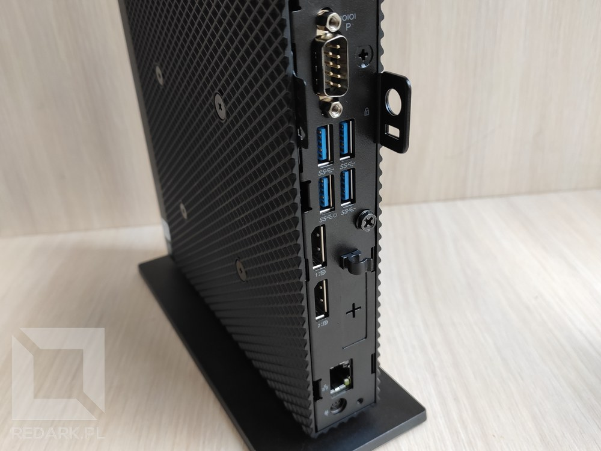
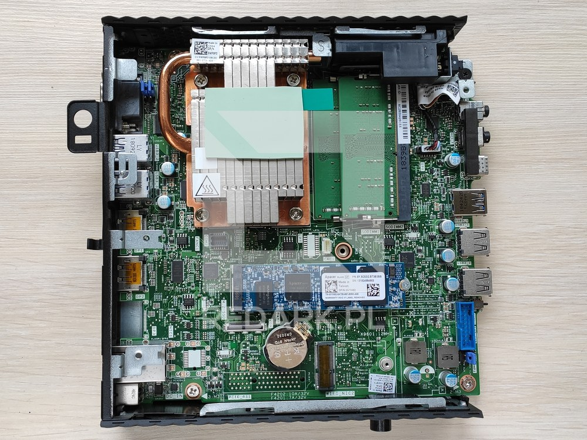
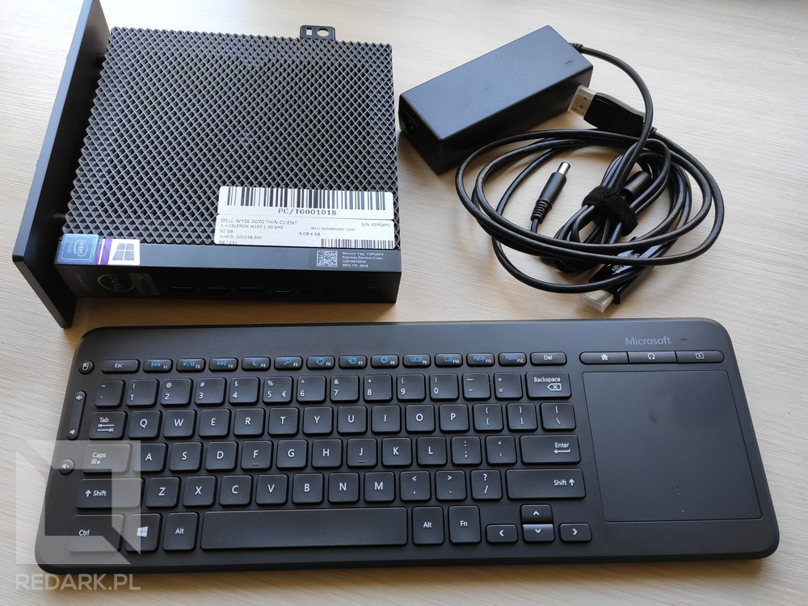
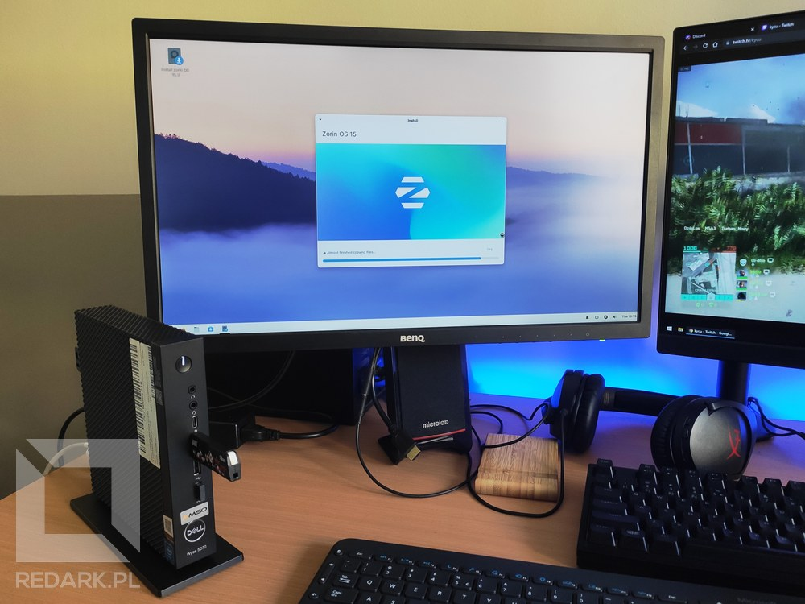
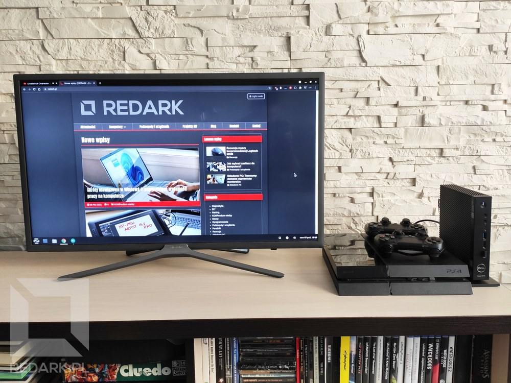
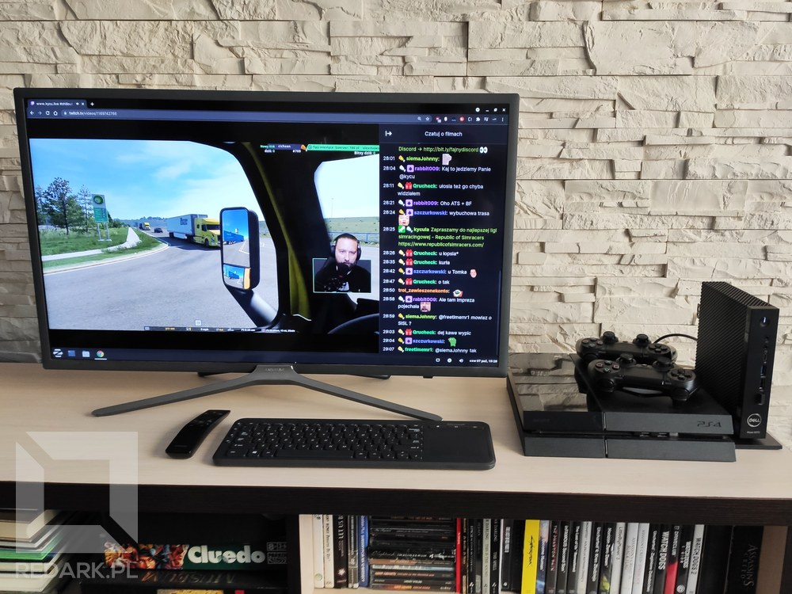
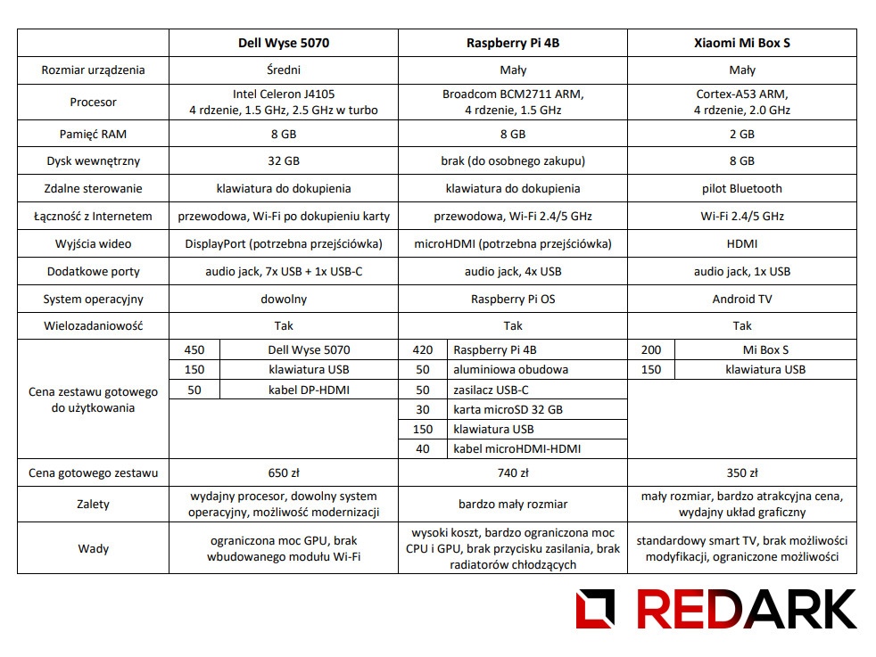

Ostatnio bardzo często zdarzało mi się korzystać z platformy Twitch.tv. Niestety twórcy tego serwisu nie ułatwiają użytkownikom korzystania z serwisu na innych urządzeniach niż komputer z przeglądarką internetową. Aplikacja na telefony z Androidem, konsole poprzedniej i obecnej generacji oraz wbudowane rozwiązania w smart TV, wołają o pomstę do nieba. Korzystanie z nich to istna katorga połączona z licznymi błędami oraz brakami w funkcjonalnościach. Dodatkowo bardzo popularne w społeczności stało się korzystanie z rozszerzenia do przeglądarek o nazwie "Better Twitch TV" (w skrócie BTTV), które usprawnia działanie czatu oraz dodaje do niego rozbudowaną bibliotekę emotek. Oczywiście oficjalne aplikacje Twitcha nie posiadają BTTV. Nie posiadają też bardzo wielu funkcjonalności przeglądarkowej wersji Twitcha, także o czym tu mówić.

Oliwy do ognia dolał popularny producent smart TV - Samsung. W 2019 roku wycofał on ze swojego systemu operacyjnego Tizen fanowską aplikację do obsługi Twitcha i do dzisiaj nie zaoferował żadnej oficjalnej wersji. Skalę tego problemu stale widzę poprzez licznik odsłon mojego [poradnika dotyczącego obchodzenia tego braku na telewizorach Samsunga](/twitch-samsung-smart-tv). Mimo dwóch lat na karku, nadal generuje znaczący ruch na Redarku. Niemniej jednak to rozwiązanie wymaga dużo zachodu i zakupu (obecnie) płatnej aplikacji, którą Samsung również próbuje od jakiegoś czasu wyplenić ze swoich urządzeń. Dodatkowo mowa tutaj o obsłudze samej transmisji wideo. O podglądzie czatu, a tym bardziej o BTTV, użytkownicy telewizorów Samsunga mogą tylko pomarzyć.

<AdSense />

Z racji mojej potrzeby komfortowego oglądania Twitcha na telewizorze postanowiłem poszukać jakiegoś uniwersalnego rozwiązania, które umożliwi mi korzystanie z platformy, jak na zwykłym komputerze, ale bez składania drogiej w budowie [jednostki HTPC](https://en.wikipedia.org/wiki/Home_theater_PC). Czy udało mi się znaleźć rozwiązanie? Tak i jest nim terminal Dell Wyse 5070.

## Czym jest terminal?

Zapewne część z Was nie wie, czym są terminale komputerowe. Są to specjalne, miniaturowe jednostki centralne o ograniczonej mocy obliczeniowej, których jedynym zadaniem jest umożliwić użytkownikowi połączenie i zalogowanie się do zewnętrznego serwera. Użytkownik zatem nie pracuje de facto na terminalu, a na współdzielonym systemie operacyjnym uruchomionym w serwerowni. W mocnym uproszczeniu terminale można więc nazwać takimi sprzętowymi TeamViewer'ami. Takie rozwiązanie jest często wykorzystywane w biurach, ponieważ ułatwia kontrolowanie i utrzymywanie sieci IT oraz ogranicza potrzebę częstej modernizacji wielu stanowisk komputerowych. Dodatkowo pracownik nie musi posiadać dedykowanego komputera, otrzyma on dostęp do swoich plików z każdego stanowiska umieszczonego w biurze.

## Dell Wyse 5070 - wiele za niewiele

Dell Wyse 5070 jest to najnowszy model z serii Wyse amerykańskiego producenta służący do zdalnej obsługi serwera. Jest to zarazem pełnoprawny mini komputer, więc idealnie sprawdzi się do naszych potrzeb. Prezentowany tutaj egzemplarz jest poleasingowy i został zakupiony w sklepie [Amso](https://amso.pl/) za około 450 złotych. Posiada on 8 GB pamięci DDR3 oraz dysk SSD o pojemności 32 GB. Sercem komputera jest 4-rdzeniowy Intel Celeron J4105 chłodzony całkowicie pasywnie. Tak, ten komputer nie wydaje żadnych dźwięków podczas swojej pracy, co jest szczególnie ważne przy budowie dobrego HTPC.

<Gallery>

</Gallery>

Urządzenie mierzy zaledwie 184 mm wysokości, 184 mm głębokości i 35 mm grubości oraz posiada elegancką kratkowaną obudowę charakterystyczną dla urządzeń spod marki Dell. Komputer może stać pionowo (dzięki specjalnej podstawce), jak i poziomo na swoim prawym boku. Idąc od góry, na panelu frontowym znajdziemy przycisk zasilania z białą diodą, dwa gniazda audio jack 3.5 mm, jedno USB-C, jedno USB 3.0 oraz dwa USB 2.0. Z tyłu znajdziemy port szeregowy RS232, cztery USB 3.0, dwa wyjścia obrazu DisplayPort, port sieciowy RJ45 oraz gniazdo zewnętrznego zasilacza. W tej wersji na pokładzie nie uświadczymy niestety karty bezprzewodowej Wi-Fi, ale zawsze można posiłkować się miniaturową kartą na USB. Ja później podłączyłem takową do terminala przy użyciu krótkiego przedłużacza USB. System obsłużył ją bez najmniejszego problemu.

Wnętrze urządzenia pozostawia całkiem niezłe pole do modernizacji. Płyta główna oferuje wewnętrzne gniazdo USB 3.0 (niebieski port po prawej), port M.2 na kartę Wi-Fi, port M.2 na dysk SSD oraz dwa gniazda SO-DIMM DDR3 dla pamięci operacyjnej. Procesor jest przylutowany na stałe do płyty głównej i posiada rozbudowany radiator z rurką cieplną odprowadzający ciepło. Na płycie znajduje się również miejsce pod wlutowanie gniazda PCI-Express, które w wersji "Extended" (obudowa jest wtedy szerokości podstawki) Wyse 5070 umożliwia zainstalowanie dedykowanej karty graficznej ze skróconym śledziem. Komputer wyposażony jest również we wbudowany głośnik, który zaskoczył mnie donośnością i jakością dźwięku. Jest on sto razy lepszy, niż to, co możemy spotkać w monitorach.

<AdSense />

## Dodatkowe akcesoria i instalacja systemu

Aby umożliwić pracę na telewizorze potrzebowałem dwóch akcesoriów. Pierwszym z nich jest kabel, który umożliwi mi zamianę DisplayPortu na HDMI, z którego korzystają współczesne telewizory. Wybór padł na kabel od Silver Monkey ze sklepu [x-kom](https://x-kom.pl). Drugim akcesorium jest bezprzewodowa klawiatura z touchpadem [Microsoft All-in-One Media Keyboard, której recenzja niedawno pojawiła się na Redarku](/recenzja-microsoft-all-in-one-media-keyboard).

<Gallery>

</Gallery>

Na początek przeszedłem do ustawień BIOSu, które były bardziej rozbudowane, niż w niejednym oglądanym przeze mnie laptopie. Gdy wszystko zostało skonfigurowane, przeszedłem do instalacji systemu operacyjnego. Wybór padł na **Zorin OS** ze względu na lekkość i przyjemny interfejs. Postawiłem na Linuxa, ale oczywiście mógłbym zainstalować tutaj Windowsa. Nie muszę jednak chyba tłumaczyć, [skąd taka decyzja](/windows-konta-linux-jaki-system-operacyjny-wybrac). Przygotowałem [bootowalny pendrive, uruchomiłem system i zainstalowałem go na dysku](/instalacja-systemow-windows-oraz-linux-krok-po-kroku). Czysty system zajął na dysku koło 10 GB. Następnie skonfigurowałem Zorina pod swoje potrzeby. Zainstalowałem przeglądarkę Google Chrome (ze względu na synchronizację z moim kontem Google), dobrałem czytelne kolory oraz powiększyłem interfejs i kursor tak, aby komfortowo się z niego korzystało na oddalonym od widza telewizorze. Na pasku u dołu dodałem dwa widgety, które umożliwiły mi monitorowanie zużycia mocy procesora oraz jaką temperaturę on osiąga.

## Testy wydajnościowe

Testowałem terminal przez pewien okres czasu i przeprowadziłem kilka eksperymentów, aby sprawdzić jego możliwości. Na początek przeglądanie stron internetowych. Z tym Dell Wyse 5070 nie ma żadnego problemu. System jest responsywny i startuje bardzo szybko. Jeśli chodzi o odtwarzanie treści na YouTube, Twitch lub innych serwisach, to trzeba się zgodzić na pewne ustępstwa. Intel Celeron J4105 posiada układ graficzny Intel UHD Graphics 600, który nie jest demonem prędkości. Jeśli chodzi o strumieniowe odtwarzanie treści w przeglądarce internetowej, to wartością graniczną jest 60 FPS w 1080p. Na statycznych streamach jest jeszcze dobrze, ale przy dynamicznym obrazie układ graficzny zaczyna się już dławić i gubi znaczące ilości klatek. Po zejściu do 1080p 30 FPS lub 720p 60 FPS jest już w porządku. GPU nie łapie zadyszki, a użycie CPU waha się w okolicach 50-60%. Jeśli chodzi o oglądanie filmów z dysku lub YouTube, to większość materiałów jest nagrana w 24 FPS, więc rozdzielczość FullHD nie generuje problemów.

Podczas długiego oglądania streamów i zużycia CPU powyżej 50% **temperatura Intela utrzymywała się na poziomie 53 stopni Celsjusza**. Przeglądanie Internetu mniej obciąża urządzenie i temperatura oscyluje już wokół 40-45 stopni. Chłodzenie pasywne spisuje się zatem rewelacyjnie i kompletnie nie przeszkadza w oglądaniu seriali lub filmów. Jeśli chodzi o pamięć RAM, to codzienna praca w systemie Windows sprawiła, że zapomniałem już, jak oszczędny potrafi być Linux. Wybranie wersji z 8 GB RAMu było drobną przesadą, ponieważ podczas oglądania streamów 720p60 w przeglądarce Google Chrome **zużycie pamięci operacyjnej wykosiło około półtora gigabajta**. Doliczając nawet do tego przestrzeń buforowaną nie widzę możliwości przekroczenia 4 gigabajtów. Jeśli chodzi o zużycie energii, to **terminal podczas oglądania streamów zużywa 12-13 W energii**, czyli mniej niż obecne ładowarki do smartfonów.

<InfoBlock>
Dla porównania moja podstawowa wersja PS4 podczas oglądania streamów zużywa 85-90 W energii, czyli prawie 7 razy więcej niż Dell Wyse!
</InfoBlock>

<AdSense />

## Porównanie z innymi rozwiązaniami

Tak oto prezentuje się gotowy zestaw przy telewizorze oraz konsoli PS4. Nie zajmuje on dużo miejsca, jest elegancki i łatwy w obsłudze. Do przedniego portu USB została podłączona klawiatura Microsoftu, co poprawia zasięg i umożliwia łatwe przepięcie akcesorium do innego komputera.

<Gallery>

</Gallery>

Czas jeszcze porównać wybrane przeze mnie urządzenie do pozostałych rozwiązań dostępnych na rynku. W zestawieniu znajdzie się popularny mikrokomputer Raspberry Pi w wersji 4B oraz smart przystawka Xiaomi Mi Box S.

Dlaczego więc nie zdecydowałem się na Raspberry Pi? Ponieważ wymaga dokupienia wielu akcesoriów i części, których sumaryczna cena wynosi ponad 700 złotych i przy tym nie oferuje wystarczającej mocy obliczeniowej. Procesor malinki nie jest stworzony do obsługi multimediów wysokiej rozdzielczości. Uruchomienie na tym procesorze trybu pełnoekranowego na YouTube zajmuje koło 5 sekund. Dodatkowo ze względu na system operacyjny i architekturę ARM serwisy takie jak Netflix lub HBO GO potrafią odmówić odtwarzania filmów ze względu na zabezpieczenia DRM. Raspberry Pi jest zatem dobrym rozwiązaniem, jeśli chodzi o stawienie domowych serwerów, ale nie budowę wydajnych HTPC. Jeśli chodzi o Xiaomi Mi Boxa, to jest to najtańsze i najprostsze rozwiązanie dla przeciętnego Kowalskiego działające pod kontrolą systemu Android TV. Płacimy 300 złotych i otrzymujemy standardowy smart TV. Jednak coś za coś. Nie jest to komputer, nie uruchomimy na nim kilku aplikacji i zaoferuje on jedynie słabą aplikację Twitcha bez dobrodziejstw BTTV - a przecież na tym zalezało mi w tym eksperymencie.

Della Wyse wybrałem ze względu na najlepszy stosunek ceny do możliwości. Naturalnie mówię tutaj o używanym, poleasingowym egzemplarzu i można zarzucić mi, że porównuję jego cenę do nowych egzemplarzy Raspberry Pi oraz Mi Box S. Niemniej jednak odsprzedaż takich urządzeń nie jest niczym niezwykłym w branży IT i jest to naturalny efekt działalności firm, które pozbywają się takiego sprzętu po upływie ich gwarancji. Dodatkowo takie urządzenia prawie zawsze nie noszą śladów użytkowania (mój egzemplarz miał jedynie małą ryskę po prawdopodobnie nietrafieniu pendrive'm w port USB), a wszelkie zużyte podzespoły takie jak np. dyski SSD są wymieniane na nowe dzięki firmom takim jak Amso. Jest to więc bardzo bezpieczna forma zakupu używanych komputerów, które potrafią zastąpić nowe jednostki o znacznie wyższej cenie.

<AdSense />

## Podsumowanie

Podsumowując: zakup poleasingowego terminala to idealny sposób na tanie uzupełnienie swojego stanowiska wypoczynkowego o pełnoprawny komputer, który nie tylko umożliwi komfortowe korzystanie z Twitcha, ale również pozwoli wygodnie przeglądać Internet oraz korzystać z innych aplikacji komputerowych.

<GoodList>
- niewielkie wymiary i elegancki wygląd urządzenia
- pełnoprawny komputer z dowolnym systemem operacyjnym
- przyzwoite możliwości modernizacji podzespołów
- bezgłośne i wydajne pasywne chłodzenie
- niski pobór energii
</GoodList>

<BadList>
- ograniczona wydajność układu graficznego procesora
- brak wbudowanej karty sieciowej Wi-Fi
</BadList>

**Informacja:** Artykuł NIE powstał wraz ze współpracą z firmą Amso. Na zdjęciach dołączonych do tego artykułu widnieją fragmenty z transmisji [streamera kycu](https://www.twitch.tv/kycu).
